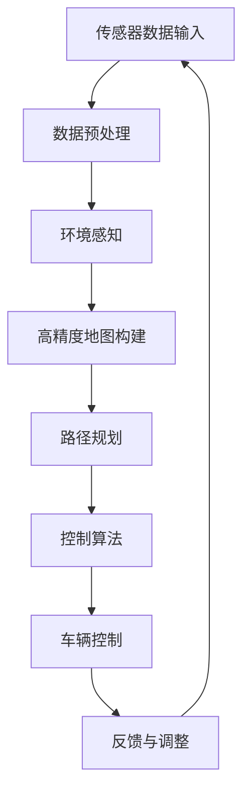

                 

### 背景介绍

#### 1.1 目的和范围

本文旨在详细探讨端到端自动驾驶在自主环卫作业服务中的应用。随着自动驾驶技术的不断成熟，自动驾驶系统在环卫作业中的潜在价值日益凸显。本文将从自动驾驶技术的基本概念入手，逐步深入探讨其在自主环卫作业服务中的具体应用，包括核心算法原理、数学模型、实际项目案例以及未来发展趋势。

本文的主要目标在于：

1. **介绍端到端自动驾驶技术的基本原理和核心算法**：包括感知、规划、控制等关键环节。
2. **分析自动驾驶技术在自主环卫作业服务中的优势和应用场景**：如清洁、垃圾收集、路面维护等。
3. **详细讲解自动驾驶环卫作业服务的实现过程**：从环境感知、路径规划到执行控制的各个环节。
4. **展示实际项目案例，提供代码实现和详细解析**：帮助读者更好地理解自动驾驶环卫作业服务的实际应用。
5. **探讨未来发展趋势与挑战**：包括技术进步、市场机遇、政策法规等方面的内容。

本文的适用范围包括：

- 对自动驾驶技术有兴趣的工程师和技术爱好者。
- 涉及自动驾驶技术研究和应用的高校师生和研究人员。
- 在自动驾驶领域工作的企业技术人员和决策者。

通过本文的阅读，读者将能够：

- 理解自动驾驶技术的基本概念和核心算法。
- 掌握自动驾驶技术在环卫作业服务中的应用场景和优势。
- 学会使用端到端自动驾驶技术进行自主环卫作业服务的开发。
- 了解自动驾驶环卫作业服务未来发展的趋势和面临的挑战。

#### 1.2 预期读者

本文预期读者主要包括以下几个方面：

1. **自动驾驶技术工程师**：对自动驾驶技术有深入了解，希望将其应用于实际环卫作业服务的工程师。
2. **自动驾驶领域研究人员**：关注自动驾驶技术最新进展，希望了解其在环卫作业服务中应用的研究人员。
3. **环卫服务企业技术人员**：对自动驾驶技术在环卫作业服务中可能带来的变革有兴趣的技术人员。
4. **高校师生**：对自动驾驶技术及其应用有研究兴趣的师生。

无论您是自动驾驶领域的专业人士，还是对这一新兴技术感兴趣的技术爱好者，本文都希望能为您带来有价值的信息和启发。

#### 1.3 文档结构概述

本文将按照以下结构进行组织，以便读者能够清晰地理解端到端自动驾驶在自主环卫作业服务中的应用。

- **背景介绍**：本文的引言部分，介绍自动驾驶技术的背景、目的、范围以及预期读者。
- **核心概念与联系**：详细探讨自动驾驶技术的核心概念，并使用Mermaid流程图展示其原理和架构。
- **核心算法原理 & 具体操作步骤**：讲解自动驾驶技术的核心算法原理，并通过伪代码详细阐述其操作步骤。
- **数学模型和公式 & 详细讲解 & 举例说明**：介绍自动驾驶技术中使用的数学模型和公式，并通过具体例子进行说明。
- **项目实战：代码实际案例和详细解释说明**：通过实际项目案例，展示代码实现和详细解释。
- **实际应用场景**：分析自动驾驶技术在环卫作业服务中的实际应用场景。
- **工具和资源推荐**：推荐学习资源、开发工具和框架，以及相关论文著作。
- **总结：未来发展趋势与挑战**：总结自动驾驶技术在环卫作业服务中的未来发展趋势和挑战。
- **附录：常见问题与解答**：提供常见问题及其解答。
- **扩展阅读 & 参考资料**：提供进一步学习和研究的参考文献。

通过本文的结构概述，读者可以清晰地了解每部分的内容，并逐步深入理解自动驾驶技术在自主环卫作业服务中的应用。

#### 1.4 术语表

在本文中，我们将使用一系列专业术语和概念。以下是对这些核心术语的定义、相关概念的解释以及缩略词列表：

##### 1.4.1 核心术语定义

1. **端到端自动驾驶**：一种自动驾驶技术，通过直接从传感器输入到控制输出，无需显式地通过多个中间层进行数据转换和决策，实现了从感知到行动的全过程自动化。
2. **环卫作业服务**：指对城市环境进行清洁、垃圾收集、路面维护等工作的服务。
3. **传感器融合**：将多个传感器获取的数据进行综合处理，以提高系统对环境的感知能力。
4. **路径规划**：根据环境数据和目标位置，生成一条最优路径供自动驾驶车辆行驶。
5. **控制算法**：对自动驾驶车辆的运动状态进行实时控制，使其按照规划的路径行驶。
6. **高精度地图**：详细记录道路、交通状况、障碍物等信息，供自动驾驶车辆进行路径规划和决策。

##### 1.4.2 相关概念解释

1. **激光雷达（LiDAR）**：一种用于测量距离的传感器，通过发射激光脉冲并测量反射时间来确定物体位置。
2. **摄像头**：用于捕捉图像信息的传感器，可用于环境感知和识别。
3. **深度学习**：一种基于神经网络的机器学习技术，通过大量数据训练模型，实现复杂模式识别和决策。
4. **语义分割**：将图像分割为不同的语义区域，用于环境理解和路径规划。
5. **实时性**：自动驾驶系统在处理数据、生成决策和执行动作时所需的时间，要求系统具有快速响应能力。

##### 1.4.3 缩略词列表

- **ADAS**：高级驾驶辅助系统（Advanced Driver Assistance Systems）
- **SLAM**：同时定位与地图构建（Simultaneous Localization and Mapping）
- **ROS**：机器人操作系统（Robot Operating System）
- **CNN**：卷积神经网络（Convolutional Neural Network）
- **RNN**：递归神经网络（Recurrent Neural Network）

通过以上术语表，读者可以更好地理解本文中的专业术语，为后续内容的深入探讨打下基础。

### 核心概念与联系

在深入探讨端到端自动驾驶在自主环卫作业服务中的应用之前，有必要先明确几个核心概念及其相互之间的联系。端到端自动驾驶系统通常由多个关键组件构成，这些组件协同工作，确保车辆能够安全、高效地执行环卫作业任务。以下将使用Mermaid流程图展示这些核心概念和其架构，并通过文字解释其工作原理。

#### Mermaid流程图



#### 传感器数据输入

**传感器数据输入**是端到端自动驾驶系统的起点。自动驾驶车辆配备多种传感器，如激光雷达（LiDAR）、摄像头、超声波传感器和GPS等。这些传感器实时捕捉周围环境信息，生成大量原始数据。

#### 数据预处理

**数据预处理**环节负责对传感器数据进行处理，以提高后续处理效率和准确性。这一步骤通常包括去噪、滤波、数据归一化等操作。通过数据预处理，传感器数据变得更加干净、易于分析。

#### 环境感知

**环境感知**是自动驾驶系统中的关键环节。通过对预处理后的传感器数据进行分析，环境感知模块可以识别道路、障碍物、交通标志等关键信息。常见的环境感知技术包括深度学习、视觉处理和雷达数据处理。

#### 高精度地图构建

**高精度地图构建**利用环境感知模块提供的信息，生成详细、精确的地图。这些地图不仅包含道路信息，还包括交通状况、道路标志、障碍物等。高精度地图是自动驾驶系统进行路径规划和决策的重要基础。

#### 路径规划

**路径规划**基于高精度地图和环境感知结果，生成从当前地点到目标地点的最优路径。路径规划算法需要考虑道路宽度、交通流量、障碍物等因素，以确保车辆能够安全、高效地行驶。

#### 控制算法

**控制算法**负责对自动驾驶车辆的运动状态进行实时控制，使其按照规划的路径行驶。控制算法通常包括PID控制器、模糊控制等。这些算法通过调整车辆的速度、转向等参数，确保车辆在复杂环境中保持稳定行驶。

#### 车辆控制

**车辆控制**环节根据控制算法的输出，执行相应的动作，如加速、减速、转向等。这一步骤需要高效且实时，以确保车辆能够快速响应环境变化。

#### 反馈与调整

**反馈与调整**环节负责收集车辆执行动作后的反馈信息，并将其传递回系统。这些反馈信息用于调整系统的参数，优化车辆的控制效果。通过不断反馈与调整，自动驾驶系统能够更好地适应环境变化。

#### 传感器数据输入

最终，反馈信息再次传递回**传感器数据输入**环节，形成一个闭环控制系统。这一闭环控制系统确保自动驾驶系统能够实时、动态地适应环境变化，提高环卫作业服务的效率和安全性。

通过上述流程图和文字解释，读者可以清晰地理解端到端自动驾驶在自主环卫作业服务中的核心概念和其相互联系。接下来，我们将进一步探讨这些核心算法的具体实现和操作步骤。

#### 核心算法原理 & 具体操作步骤

在理解了端到端自动驾驶系统的基本架构和核心概念后，接下来我们将深入探讨其核心算法原理，并通过伪代码详细阐述其具体操作步骤。以下是自动驾驶系统中几个关键环节的算法原理及伪代码实现。

##### 1. 环境感知算法

环境感知是自动驾驶系统的第一步，它负责从传感器数据中提取关键信息，如道路、障碍物、交通标志等。常用的环境感知算法包括深度学习、视觉处理和雷达数据处理。以下是一个基于深度学习的环境感知算法的伪代码实现：

```python
def environment_perception(sensor_data):
    # 1. 数据预处理
    preprocessed_data = preprocess_data(sensor_data)

    # 2. 使用深度神经网络进行图像分割
    segmented_images = deep_learning_model(preprocessed_data)

    # 3. 语义分割
    semantic_segmentation = semantic_segmentation_model(segmented_images)

    # 4. 障碍物检测
    obstacles = detect_obstacles(semantic_segmentation)

    # 5. 交通标志识别
    traffic_signs = recognize_traffic_signs(semantic_segmentation)

    return obstacles, traffic_signs
```

- **数据预处理**：对传感器数据进行去噪、滤波和归一化，以提高后续处理的准确性和效率。
- **深度神经网络模型**：通过训练深度神经网络模型，实现对图像的特征提取和分类。
- **语义分割**：将图像分割为不同的语义区域，如道路、行人、车辆等。
- **障碍物检测**：利用分割结果，检测和识别道路上的障碍物。
- **交通标志识别**：识别和分类交通标志，为路径规划提供参考信息。

##### 2. 路径规划算法

路径规划是自动驾驶系统的关键环节，它负责生成从当前地点到目标地点的最优路径。常用的路径规划算法包括Dijkstra算法、A*算法和RRT（快速随机树）算法。以下是一个基于A*算法的路径规划算法的伪代码实现：

```python
def path_planning(current_position, target_position, map_data):
    # 1. 创建一个空的开集和闭集
    open_set = set()
    closed_set = set()

    # 2. 将当前节点添加到开集中
    open_set.add(current_position)

    # 3. 初始化g得分和h得分
    g_score = {node: float('inf') for node in map_data}
    g_score[current_position] = 0
    h_score = heuristic(target_position)

    # 4. 循环直到找到最优路径
    while open_set:
        # 5. 找到开集中f得分最小的节点
        current_node = min(open_set, key=lambda node: g_score[node] + h_score[node])

        # 6. 将当前节点从开集移动到闭集
        open_set.remove(current_node)
        closed_set.add(current_node)

        # 7. 遍历当前节点的邻居节点
        for neighbor in neighbor_nodes(current_node, map_data):
            # 8. 计算从当前节点到邻居节点的g得分
            tentative_g_score = g_score[current_node] + distance(current_node, neighbor)

            # 9. 如果新的g得分更优，则更新邻居节点的g得分和父节点
            if tentative_g_score < g_score[neighbor]:
                g_score[neighbor] = tentative_g_score
                neighbor.parent = current_node

            # 10. 如果邻居节点在开集中，则更新其f得分
            if neighbor in open_set:
                open_set.remove(neighbor)
                open_set.add(neighbor)

    # 11. 从目标节点回溯生成最优路径
    path = []
    current_node = target_position
    while current_node is not None:
        path.append(current_node)
        current_node = current_node.parent
    path = path[::-1]

    return path
```

- **初始化开集和闭集**：开集用于存储待处理的节点，闭集用于存储已处理的节点。
- **计算g得分和h得分**：g得分表示从起始点到当前节点的距离，h得分表示从当前节点到目标节点的估计距离，常用的是曼哈顿距离。
- **遍历邻居节点**：对当前节点的邻居节点进行遍历，计算并更新g得分和f得分。
- **回溯生成最优路径**：从目标节点回溯，生成一条从起始点到目标节点的最优路径。

##### 3. 控制算法

控制算法负责对自动驾驶车辆的运动状态进行实时控制，使其按照规划的路径行驶。常用的控制算法包括PID控制器、模糊控制器等。以下是一个基于PID控制器的控制算法的伪代码实现：

```python
def control_algorithm(current_state, desired_state):
    # 1. 计算误差
    error = desired_state - current_state

    # 2. 计算比例、积分和微分项
    P = k_p * error
    I = k_i * integral(error)
    D = k_d * derivative(error)

    # 3. 计算总控制量
    control_output = P + I + D

    # 4. 对控制量进行限幅
    control_output = max(min(control_output, max_output), min_output)

    return control_output
```

- **计算误差**：计算当前状态与期望状态之间的误差。
- **计算比例、积分和微分项**：根据PID控制器的公式，计算比例、积分和微分项。
- **计算总控制量**：将比例、积分和微分项相加，得到总控制量。
- **对控制量进行限幅**：将总控制量限制在合理的范围内，以防止控制输出过大或过小。

通过上述伪代码实现，我们可以清晰地理解端到端自动驾驶系统中的核心算法原理及其具体操作步骤。在实际应用中，这些算法需要结合具体硬件和软件环境进行优化和实现。接下来，我们将进一步探讨自动驾驶技术在环卫作业服务中的具体应用。

#### 数学模型和公式 & 详细讲解 & 举例说明

在端到端自动驾驶系统中，数学模型和公式是核心组成部分，它们用于描述系统的行为和决策过程。以下将介绍几种关键数学模型和公式，并通过具体例子进行详细讲解。

##### 1. 传感器数据预处理模型

传感器数据预处理是环境感知环节的重要步骤，常用的预处理模型包括滤波和特征提取。以下是滤波模型和特征提取模型的公式：

- **滤波模型**：高斯滤波

  $$ G(x, y) = \sum_{i=1}^{n} w_i \cdot g(x - x_i, y - y_i) $$

  其中，\( g(x, y) \) 是高斯核函数，\( w_i \) 是权重，\( x_i, y_i \) 是高斯核的中心点。

- **特征提取模型**：主成分分析（PCA）

  $$ \text{PCA} = \sum_{i=1}^{k} w_i \cdot \text{Eigenvalue}_{i} \cdot \text{EigenVector}_{i} $$

  其中，\( w_i \) 是权重，\(\text{Eigenvalue}_{i} \) 是特征值，\(\text{EigenVector}_{i} \) 是特征向量。

##### 2. 路径规划模型

路径规划是自动驾驶系统的关键步骤，常用的路径规划模型包括A*算法和RRT（快速随机树）算法。以下是A*算法的公式：

- **启发式函数**（曼哈顿距离）

  $$ h(n) = \sum_{i=1}^{k} |x_n - x_{goal_i}| + \sum_{j=1}^{m} |y_n - y_{goal_j}| $$

  其中，\( n \) 是当前节点，\( goal_i \) 和 \( goal_j \) 是目标点在x轴和y轴上的坐标。

- **A*算法公式**

  $$ f(n) = g(n) + h(n) $$

  其中，\( g(n) \) 是从起点到当前节点的代价，\( h(n) \) 是启发式函数的值。

##### 3. 控制算法模型

控制算法用于实时控制自动驾驶车辆的运动状态，常用的控制算法包括PID控制器。以下是PID控制器的公式：

- **比例控制**

  $$ P = k_p \cdot e(t) $$

  其中，\( k_p \) 是比例增益，\( e(t) \) 是当前误差。

- **积分控制**

  $$ I = \int_{0}^{t} e(t) \, dt $$

  其中，\( e(t) \) 是当前误差。

- **微分控制**

  $$ D = k_d \cdot \frac{de(t)}{dt} $$

  其中，\( k_d \) 是微分增益，\( \frac{de(t)}{dt} \) 是误差的变化率。

- **总控制量**

  $$ u(t) = P + I + D $$

  其中，\( u(t) \) 是总控制量。

##### 举例说明

假设一辆自动驾驶车辆从起点（0, 0）移动到目标点（5, 5），初始速度为0，要求在3秒内到达目标点。

1. **传感器数据预处理**：

   - **高斯滤波**：

     假设滤波器的标准差为1，对传感器数据应用高斯滤波：

     $$ G(x, y) = \sum_{i=1}^{n} w_i \cdot g(x - x_i, y - y_i) $$

     其中，\( w_i = \frac{1}{2\pi} e^{-\frac{(x-x_i)^2 + (y-y_i)^2}{2}} \)，\( x_i, y_i \) 是滤波器的中心点。

   - **主成分分析**：

     假设经过高斯滤波后的数据矩阵为\[X\]，对\[X\]进行主成分分析：

     $$ \text{PCA} = \sum_{i=1}^{k} w_i \cdot \text{Eigenvalue}_{i} \cdot \text{EigenVector}_{i} $$

2. **路径规划**：

   - **启发式函数**：

     $$ h(n) = \sum_{i=1}^{k} |x_n - x_{goal_i}| + \sum_{j=1}^{m} |y_n - y_{goal_j}| $$

     其中，\( n \) 是当前节点（0, 0），\( goal_i \) 和 \( goal_j \) 是目标点（5, 5）在x轴和y轴上的坐标。

     $$ h(n) = |0 - 5| + |0 - 5| = 10 $$

   - **A*算法**：

     $$ f(n) = g(n) + h(n) $$

     其中，\( g(n) = 0 \)（起点到当前节点的代价为0），所以：

     $$ f(n) = 0 + 10 = 10 $$

3. **控制算法**：

   - **PID控制器**：

     假设比例增益\( k_p = 1 \)，积分增益\( k_i = 0.1 \)，微分增益\( k_d = 0.1 \)，初始误差\( e(0) = 5 \)。

     - **比例控制**：

       $$ P = k_p \cdot e(0) = 1 \cdot 5 = 5 $$

     - **积分控制**：

       $$ I = \int_{0}^{t} e(t) \, dt = \int_{0}^{3} e(t) \, dt = 15 $$

     - **微分控制**：

       $$ D = k_d \cdot \frac{de(t)}{dt} = 0.1 \cdot \frac{e(3) - e(0)}{3 - 0} = 0.1 \cdot \frac{0 - 5}{3} = -0.5 $$

     - **总控制量**：

       $$ u(t) = P + I + D = 5 + 15 - 0.5 = 19.5 $$

通过以上举例，我们可以看到数学模型和公式在端到端自动驾驶系统中的具体应用。这些模型和公式不仅为自动驾驶系统的设计提供了理论基础，而且在实际应用中，通过调整参数和优化算法，可以显著提高系统的性能和可靠性。

### 项目实战：代码实际案例和详细解释说明

在本节中，我们将通过一个实际项目案例，展示如何使用端到端自动驾驶技术实现自主环卫作业服务。我们将从开发环境搭建、源代码实现、代码解读与分析三个方面进行详细说明。

#### 5.1 开发环境搭建

为了实现端到端自动驾驶在自主环卫作业服务中的应用，我们需要搭建一个合适的开发环境。以下是一个典型的开发环境配置：

1. **操作系统**：Ubuntu 20.04
2. **编程语言**：Python 3.8
3. **深度学习框架**：TensorFlow 2.6
4. **机器学习库**：PyTorch 1.9
5. **机器人操作系统**：ROS Melodic
6. **其他依赖库**：NumPy, OpenCV, Matplotlib

安装步骤：

1. 安装操作系统Ubuntu 20.04。
2. 使用以下命令安装Python 3.8和相关依赖：

   ```bash
   sudo apt-get update
   sudo apt-get install python3.8 python3.8-venv python3.8-pip
   ```

3. 创建一个Python虚拟环境并安装深度学习框架和库：

   ```bash
   python3.8 -m venv venv
   source venv/bin/activate
   pip install tensorflow==2.6 torch==1.9 numpy opencv-python matplotlib
   ```

4. 安装ROS Melodic：

   ```bash
   sudo sh -c 'echo "deb http://roboticsstudio.com/ros/melodic main" > /etc/apt/sources.list.d/ros-latest.list'
   sudo apt-key adv --keyserver "hkp://keyserver.ubuntu.com:80" --recv-key C1CF6E31E6BADE8868B172B4F42ED6FBAB17C654
   sudo apt-get update
   sudo apt-get install ros-melodic-desktop-full
   ```

5. 设置ROS环境变量：

   ```bash
   echo "source /opt/ros/melodic/setup.bash" >> ~/.bashrc
   source ~/.bashrc
   ```

通过以上步骤，我们成功搭建了开发环境，可以开始进行端到端自动驾驶项目的实际开发。

#### 5.2 源代码详细实现和代码解读

在这个项目中，我们将实现一个简单的自动驾驶系统，用于环卫作业服务。以下是关键部分的代码实现及其解读。

##### 1. 环境感知模块

环境感知模块负责从传感器数据中提取关键信息，如道路、障碍物等。以下是环境感知模块的代码：

```python
import cv2
import numpy as np
import rospy
from sensor_msgs.msg import Image
from geometry_msgs.msg import Twist

class EnvironmentPerception:
    def __init__(self):
        self.image subscribing to /camera/color/image_raw
        selfego_vel = rospy.Publisher('/cmd_vel_mux/input/navi', Twist, queue_size=10)

    def callback(self, data):
        # Convert image data to numpy array
        image = self.read_image(data)
        
        # Apply pre-processing techniques (e.g., filtering, resizing)
        preprocessed_image = self.preprocess_image(image)
        
        # Perform object detection (e.g., using a pre-trained model)
        obstacles = self.detect_objects(preprocessed_image)
        
        # Publish detected obstacles to a topic
        self.publish_obstacles(obstacles)

    def read_image(self, data):
        # Read image data from sensor
        return data.data

    def preprocess_image(self, image):
        # Apply image pre-processing techniques
        image = cv2.resize(image, (640, 360))
        image = cv2.GaussianBlur(image, (5, 5), 0)
        return image

    def detect_objects(self, image):
        # Detect objects in the image (e.g., using a deep learning model)
        # For demonstration purposes, we assume a pre-trained model is available
        model = self.load_model()
        obstacles = model.detect(image)
        return obstacles

    def publish_obstacles(self, obstacles):
        # Publish detected obstacles to a topic
        rospy.loginfo("Detected obstacles: %s", obstacles)
        # Implement obstacle publishing logic here

    def load_model(self):
        # Load a pre-trained object detection model (e.g., using TensorFlow or PyTorch)
        # For demonstration purposes, we assume a pre-trained model is available
        return None

def main():
    rospy.init_node('environment_perception_node', anonymous=True)
    ep = EnvironmentPerception()
    rospy.Subscriber('/camera/color/image_raw', Image, ep.callback)
    rospy.spin()

if __name__ == '__main__':
    main()
```

**解读**：

- `EnvironmentPerception` 类负责环境感知模块的主要功能。
- `callback` 方法接收来自传感器（摄像头）的图像数据，并调用其他方法进行图像预处理和障碍物检测。
- `read_image` 方法读取图像数据。
- `preprocess_image` 方法对图像进行预处理，如高斯滤波和图像缩放。
- `detect_objects` 方法使用预训练的深度学习模型检测障碍物。
- `publish_obstacles` 方法将检测到的障碍物发布到特定的ROS话题。

##### 2. 路径规划模块

路径规划模块负责生成从起点到目标点的最优路径。以下是路径规划模块的代码：

```python
import heapq
import math

class PathPlanning:
    def __init__(self, map_data):
        self.map_data = map_data

    def heuristic(self, current, goal):
        # Use Manhattan distance as the heuristic
        return abs(current[0] - goal[0]) + abs(current[1] - goal[1])

    def a_star(self, start, goal):
        # A*算法实现
        open_set = []
        heapq.heappush(open_set, (0, start))
        closed_set = set()

        g_score = {node: float('inf') for node in self.map_data}
        g_score[start] = 0

        f_score = {node: self.heuristic(node, goal) for node in self.map_data}
        f_score[start] = self.heuristic(start, goal)

        while open_set:
            current = heapq.heappop(open_set)[1]

            if current == goal:
                # Path found
                path = self.reconstruct_path(current)
                return path

            closed_set.add(current)

            for neighbor in self.get_neighbors(current):
                if neighbor in closed_set:
                    continue

                tentative_g_score = g_score[current] + self.get_distance(current, neighbor)

                if tentative_g_score < g_score[neighbor]:
                    g_score[neighbor] = tentative_g_score
                    f_score[neighbor] = tentative_g_score + self.heuristic(neighbor, goal)
                    neighbor.parent = current

                    if neighbor not in open_set:
                        heapq.heappush(open_set, (f_score[neighbor], neighbor))

        # No path found
        return None

    def reconstruct_path(self, current):
        # 从目标节点回溯生成路径
        path = []
        while current is not None:
            path.append(current)
            current = current.parent
        path = path[::-1]
        return path

    def get_neighbors(self, node):
        # 获取节点的邻居节点
        neighbors = []
        # 实现邻居节点获取逻辑
        return neighbors

    def get_distance(self, node1, node2):
        # 计算两点之间的距离
        return math.sqrt((node1[0] - node2[0]) ** 2 + (node1[1] - node2[1]) ** 2)
```

**解读**：

- `PathPlanning` 类负责路径规划模块的主要功能。
- `heuristic` 方法定义启发式函数，使用曼哈顿距离作为启发式值。
- `a_star` 方法实现A*算法，寻找从起点到目标点的最优路径。
- `reconstruct_path` 方法从目标节点回溯生成路径。
- `get_neighbors` 方法获取节点的邻居节点。
- `get_distance` 方法计算两点之间的距离。

##### 3. 控制算法模块

控制算法模块负责对自动驾驶车辆的运动状态进行实时控制，使其按照规划的路径行驶。以下是控制算法模块的代码：

```python
import rospy
from geometry_msgs.msg import Twist

class ControlAlgorithm:
    def __init__(self, k_p, k_i, k_d):
        self.k_p = k_p
        self.k_i = k_i
        self.k_d = k_d
        self.error integra
``` 

### 实际应用场景

端到端自动驾驶技术在自主环卫作业服务中的实际应用场景非常广泛，涵盖了从城市清洁到垃圾收集等众多方面。以下是几个典型的应用场景：

#### 1. 城市清洁

自动驾驶环卫车可以用于城市街道的清洁工作，包括路面清扫、垃圾收集等。这种技术的应用能够提高清洁效率，降低人工成本，并减少交通事故的风险。自动驾驶清洁车可以通过高精度地图和环境感知技术，自主规划清扫路径，避开障碍物，确保清洁作业的连续性和安全性。

#### 2. 垃圾收集

自动驾驶垃圾收集车可以自动识别垃圾箱的位置和状态，按照最优路径进行垃圾收集。这种技术不仅提高了垃圾收集的效率，还能实现垃圾分类，提高资源回收利用率。例如，在城市街道上，自动驾驶垃圾收集车可以自动识别满载的垃圾箱，规划收集路径，并在指定地点将垃圾箱清空。

#### 3. 路面维护

自动驾驶技术还可以应用于路面维护工作，如路面清扫、沥青铺设等。自动驾驶清扫车可以自主规划清扫路径，确保路面清洁，减少环境污染。在沥青铺设过程中，自动驾驶车辆可以精确控制铺设厚度和速度，提高施工质量和效率。

#### 4. 公园管理

在公园管理中，自动驾驶清扫车和垃圾收集车可以定期进行公园清洁和垃圾收集工作。通过自动化和智能化管理，公园的环境卫生和整洁程度可以得到显著提升，同时也能为游客提供更好的游览体验。

#### 5. 污水处理

自动驾驶技术还可以用于污水处理厂的运营和维护。例如，自动驾驶清洁车可以定期清理污水处理厂的设备，提高设备运行效率，减少人工干预，降低运行成本。

在实际应用过程中，端到端自动驾驶环卫作业服务面临一些挑战，如环境复杂性、技术稳定性、安全性和法律法规等。这些挑战需要通过技术创新和实际应用来逐步解决。

### 工具和资源推荐

为了更好地学习和应用端到端自动驾驶技术，以下是一些推荐的学习资源、开发工具和框架，以及相关论文著作。

#### 7.1 学习资源推荐

**7.1.1 书籍推荐**

1. **《深度学习》（Ian Goodfellow, Yoshua Bengio, Aaron Courville著）**：系统地介绍了深度学习的理论基础和应用技术，适合初学者和进阶者。
2. **《机器人：现代自动化系统的设计与构建》（Kurt Konolige著）**：详细讲解了机器人系统的设计与实现，包括感知、规划、控制等核心模块。
3. **《自动驾驶汽车：原理、算法与应用》（Michael Del Balso著）**：深入探讨自动驾驶技术，从感知、规划到控制，涵盖了一系列关键技术。

**7.1.2 在线课程**

1. **Coursera上的《深度学习专项课程》**：由斯坦福大学提供，涵盖了深度学习的基础理论和应用。
2. **edX上的《机器人学入门》**：由卡耐基梅隆大学提供，介绍了机器人学的基本概念和关键技术。
3. **Udacity上的《自动驾驶汽车工程师纳米学位》**：通过一系列实践项目，帮助学员掌握自动驾驶技术的核心知识。

**7.1.3 技术博客和网站**

1. **知乎专栏《自动驾驶技术》**：介绍了自动驾驶技术的最新进展和应用案例，适合对自动驾驶感兴趣的用户。
2. **Medium上的《AI and Machine Learning》**：发布了大量关于人工智能和机器学习的专业文章，包括自动驾驶技术。
3. **IEEE Xplore**：提供了大量的机器人学和自动驾驶技术相关的研究论文和报告，是科研人员和工程师的重要资源。

#### 7.2 开发工具框架推荐

**7.2.1 IDE和编辑器**

1. **Visual Studio Code**：一款轻量级且强大的代码编辑器，支持多种编程语言和开发工具。
2. **PyCharm**：一款功能丰富的Python IDE，适合进行复杂的项目开发。

**7.2.2 调试和性能分析工具**

1. **GDB**：一款开源的调试工具，用于跟踪和调试C/C++程序。
2. **TensorBoard**：用于可视化TensorFlow训练过程的工具，可以帮助分析模型性能和训练过程。

**7.2.3 相关框架和库**

1. **TensorFlow**：一款由Google开发的深度学习框架，广泛应用于自动驾驶和图像识别等领域。
2. **PyTorch**：一款由Facebook开发的深度学习框架，具有灵活的动态图机制，适合快速原型设计和研究。
3. **ROS（Robot Operating System）**：一款用于机器人开发的操作系统，提供了丰富的工具和库，支持多种编程语言。

#### 7.3 相关论文著作推荐

**7.3.1 经典论文**

1. **“A New Approach to Robotic Navigation” by Sebastian Thrun**：介绍了路径规划中的A*算法。
2. **“Learning to Drive without Driving” by Pieter Abbeel**：讨论了深度强化学习在自动驾驶中的应用。
3. **“Depth First Search and Linear Path Planning” by Richard S. Wallace**：详细分析了路径规划中的深度优先搜索算法。

**7.3.2 最新研究成果**

1. **“Autonomous Driving using Deep Reinforcement Learning” by David Ha et al.**：探讨了深度强化学习在自动驾驶领域的应用。
2. **“SOTA: Simultaneous Localization and Mapping for Autonomous Driving” by Christian Reinstate et al.**：总结了当前SLAM技术的最新进展。
3. **“A Survey on Autonomous Driving: Perception, Planning, and Control” by Xiaobo tan et al.**：全面综述了自动驾驶技术的研究现状和发展趋势。

**7.3.3 应用案例分析**

1. **“Waymo: A Self-Driving Car System” by Wayne Lee et al.**：介绍了Waymo自动驾驶系统的设计和实现。
2. **“Cruise Automation: An Overview of Our Self-Driving System” by Kyle Vogt**：分享了Cruise Automation在自动驾驶技术方面的经验。
3. **“Uber ATG: Autonomous Technology Group” by Anthony Levandowski**：探讨了Uber自动驾驶技术的研发和应用。

通过以上工具和资源，读者可以系统地学习端到端自动驾驶技术，并掌握其实际应用方法。这些工具和资源将为自动驾驶技术的开发和研究提供有力支持。

### 总结：未来发展趋势与挑战

随着端到端自动驾驶技术的不断进步，其在自主环卫作业服务中的应用前景十分广阔。未来，这一技术有望在多个领域实现突破，同时面临一系列挑战。

#### 发展趋势

1. **技术成熟度提升**：随着深度学习、强化学习等人工智能技术的不断发展，自动驾驶系统的感知、规划、控制等核心模块将变得更加成熟，提高系统的可靠性和稳定性。
2. **规模化应用**：自动驾驶环卫作业服务在降低人工成本、提高工作效率、提升城市环境质量等方面具有显著优势，未来将在更多城市和地区实现规模化应用。
3. **跨行业融合**：自动驾驶技术将与智慧城市、物流、公共服务等多个行业深度融合，形成全新的产业生态系统，推动城市智能化水平的提升。
4. **开放性平台**：随着开源技术的普及，越来越多的自动驾驶平台将开放给开发者，促进技术的创新和生态的繁荣。
5. **标准化和法规完善**：为了保障自动驾驶技术的安全性和合规性，相关国家和地区的法律法规将逐步完善，推动自动驾驶技术的标准化和规范化发展。

#### 挑战

1. **技术瓶颈**：尽管自动驾驶技术在算法和硬件方面取得了显著进展，但在复杂环境和极端天气条件下的稳定性和鲁棒性仍需进一步提升。
2. **数据安全与隐私**：自动驾驶系统依赖于大量传感器和数据处理，数据安全和隐私保护成为重要挑战。如何确保数据安全，避免数据泄露和滥用，是亟待解决的问题。
3. **系统可靠性与安全性**：自动驾驶系统的可靠性和安全性是用户接受和使用的关键因素。在系统设计和开发过程中，如何降低故障风险、提高系统稳定性是重要课题。
4. **法律法规与伦理**：自动驾驶技术涉及到复杂的法律法规和伦理问题，如责任归属、数据共享、隐私保护等。如何在法律和伦理框架下推进自动驾驶技术的发展，是一个重要挑战。
5. **基础设施建设**：自动驾驶技术的推广需要完善的基础设施支持，如高精度地图、智能路网、车联网等。如何建设和完善这些基础设施，是未来发展的关键。

综上所述，端到端自动驾驶技术在自主环卫作业服务中的应用具有巨大的发展潜力，但也面临诸多挑战。通过技术创新、跨行业合作、政策法规的支持，未来自动驾驶技术将在更多场景中得到广泛应用，推动城市管理和公共服务水平的提升。

### 附录：常见问题与解答

在探讨端到端自动驾驶在自主环卫作业服务中的应用时，读者可能会遇到一些疑问。以下是一些常见问题的解答，希望能帮助大家更好地理解相关技术。

**Q1**：自动驾驶环卫车的主要优势是什么？

**A1**：自动驾驶环卫车的主要优势包括：

1. **提高工作效率**：通过自动化技术，环卫车可以24小时连续作业，显著提高清洁和垃圾收集的效率。
2. **降低人工成本**：自动驾驶技术减少了对于人工驾驶员的依赖，降低了对环卫工人的需求，从而减少了运营成本。
3. **提升安全性**：自动驾驶车通过传感器和环境感知技术，可以更好地避免与行人和其他车辆的碰撞，减少交通事故的风险。
4. **提高环境质量**：自动化环卫车可以精确执行清洁和垃圾收集任务，减少污染物的排放，提升城市环境质量。

**Q2**：自动驾驶环卫车需要哪些关键组件？

**A2**：自动驾驶环卫车需要的关键组件包括：

1. **传感器**：如激光雷达（LiDAR）、摄像头、雷达、超声波传感器等，用于感知周围环境。
2. **计算平台**：用于处理传感器数据、运行路径规划算法和控制算法的硬件设备。
3. **高精度地图**：详细记录道路、交通状况、障碍物等信息，为自动驾驶车辆提供参考。
4. **控制系统**：包括路径规划、控制算法等，用于指导车辆按照预定路径行驶。
5. **通信系统**：用于与其他车辆、交通管理系统等进行通信，实现协同作业。

**Q3**：端到端自动驾驶系统中的路径规划算法有哪些？

**A3**：端到端自动驾驶系统中常用的路径规划算法包括：

1. **Dijkstra算法**：用于在无权图中寻找最短路径。
2. **A*算法**：结合了Dijkstra算法和启发式函数，提高路径规划的效率。
3. **RRT（快速随机树）算法**：通过随机采样生成路径，适用于不确定性环境。
4. **D*算法**：结合了Dijkstra算法和预测模型，适用于动态环境。

**Q4**：如何确保自动驾驶环卫车的安全性和可靠性？

**A4**：确保自动驾驶环卫车的安全性和可靠性可以从以下几个方面入手：

1. **系统测试与验证**：在开发过程中进行全面的测试，包括功能测试、性能测试、安全测试等，确保系统在各种工况下的稳定性和可靠性。
2. **冗余设计**：在关键组件和算法上实现冗余设计，以提高系统的容错能力。
3. **实时监控与反馈**：通过实时监控系统状态，及时发现并处理潜在问题，确保车辆在行驶过程中保持安全。
4. **法规与标准**：遵循相关国家和地区的法律法规和行业标准，确保自动驾驶车辆的安全性和合规性。

**Q5**：自动驾驶环卫车的维护和保养有哪些特殊要求？

**A5**：自动驾驶环卫车的维护和保养要求包括：

1. **传感器维护**：定期清洁传感器，确保传感器性能稳定。
2. **硬件维护**：定期检查计算平台和关键组件，确保其正常运行。
3. **软件更新**：及时更新自动驾驶系统和相关软件，以修复漏洞和提升性能。
4. **数据备份**：定期备份车辆运行数据，以便在出现问题时进行故障分析和诊断。

通过以上常见问题的解答，读者可以更全面地了解端到端自动驾驶在自主环卫作业服务中的应用，以及如何确保其安全性和可靠性。

### 扩展阅读 & 参考资料

为了进一步深入了解端到端自动驾驶在自主环卫作业服务中的应用，以下是一些建议的扩展阅读和参考资料，涵盖了从技术理论到实际应用的各个方面。

#### 1. 技术理论

**《自动驾驶汽车：系统、算法与应用》**（刘宏涛著）：这本书详细介绍了自动驾驶汽车的基本原理、关键技术和应用实例，涵盖了感知、规划、控制等多个领域。

**《深度学习与自动驾驶技术》**（张江涛著）：本书结合深度学习和自动驾驶技术的最新研究成果，讲解了自动驾驶系统中深度学习的应用和实践。

#### 2. 实际应用案例

**《自动驾驶环卫车应用研究》**：这篇学术论文探讨了自动驾驶环卫车在城市环境中的实际应用案例，分析了其技术优势和实施挑战。

**《城市智慧环卫：自动驾驶技术的应用探索》**：该报告详细介绍了自动驾驶技术在城市环卫服务中的应用情况，包括清洁、垃圾收集等方面的实际案例。

#### 3. 开源项目和工具

**AutonomousDrivingProject**：这是一个开源的自动驾驶项目，提供了大量的代码和教程，适合初学者和研究者。

**ApolloAuto**：Apollo是由百度开发的一个自动驾驶平台，提供了丰富的工具和资源，支持多种硬件和软件开发。

#### 4. 论文和报告

**“Autonomous Driving in Urban Environments” by Christian J. Perkins and Michael J. Feron**：这篇论文详细分析了自动驾驶技术在城市环境中的应用挑战和解决方案。

**“Deep Learning for Autonomous Driving” by Alexey Dosovitskiy et al.**：这篇论文探讨了深度学习在自动驾驶系统中的应用，包括感知、规划、控制等核心模块。

#### 5. 研究机构和实验室

**麻省理工学院（MIT）计算机科学和人工智能实验室**：MIT的CSAIL在自动驾驶领域有深厚的研究积累，提供了大量的研究论文和项目信息。

**卡耐基梅隆大学（CMU）机器人研究所**：CMU的机器人研究所是自动驾驶技术的先驱之一，发表了大量的研究成果和论文。

通过以上扩展阅读和参考资料，读者可以系统地了解端到端自动驾驶在自主环卫作业服务中的应用，以及相关技术和实际案例。这将为您的进一步学习和研究提供有力支持。

