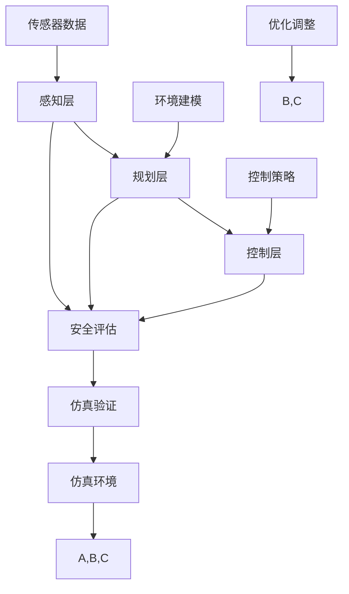

                 

# 端到端自动驾驶的车辆主动安全仿真验证

> **关键词**：自动驾驶、端到端、仿真验证、主动安全、车辆控制、传感器融合

> **摘要**：本文旨在深入探讨端到端自动驾驶系统在车辆主动安全仿真验证方面的应用。通过详细的算法原理讲解、具体操作步骤、数学模型分析以及项目实战案例，本文为自动驾驶技术研究和开发提供了切实可行的实践指导。读者可以了解到如何利用仿真技术对自动驾驶车辆的安全性能进行全面的评估和优化，从而提高自动驾驶系统的可靠性和安全性。

## 1. 背景介绍

### 1.1 目的和范围

本文的主要目的是介绍端到端自动驾驶系统的车辆主动安全仿真验证方法，并探讨其在实际应用中的重要性。随着自动驾驶技术的快速发展，如何确保车辆在复杂交通环境中的主动安全性能成为亟待解决的关键问题。本文将围绕以下几个方面展开讨论：

1. **核心概念与联系**：介绍自动驾驶系统中的核心概念及其相互关系，使用Mermaid流程图进行可视化展示。
2. **核心算法原理 & 具体操作步骤**：详细阐述车辆主动安全仿真验证中的关键算法原理，并提供伪代码实现。
3. **数学模型和公式 & 详细讲解 & 举例说明**：解析仿真验证过程中涉及到的数学模型和公式，并通过实际案例进行说明。
4. **项目实战：代码实际案例和详细解释说明**：展示一个具体的车辆主动安全仿真验证项目，并对代码实现进行详细解释。
5. **实际应用场景**：探讨车辆主动安全仿真验证在不同场景中的应用。
6. **工具和资源推荐**：推荐相关学习资源、开发工具和框架，以供读者进一步学习和实践。
7. **总结：未来发展趋势与挑战**：分析自动驾驶领域未来的发展趋势和面临的挑战。

### 1.2 预期读者

本文主要面向以下读者群体：

1. **自动驾驶技术研究人员**：对自动驾驶技术及其安全仿真验证方法感兴趣的研究人员，希望通过本文深入了解相关技术原理和应用。
2. **自动驾驶软件开发工程师**：负责自动驾驶软件开发和优化的工程师，需要了解如何利用仿真技术评估和改进车辆安全性能。
3. **汽车行业从业者**：关注自动驾驶技术发展的汽车行业从业者，希望通过本文了解自动驾驶技术在实际应用中的安全和可靠性保障。
4. **高校师生**：对自动驾驶技术有浓厚兴趣的高校师生，希望通过本文拓展专业知识，为后续研究和实践提供指导。

### 1.3 文档结构概述

本文分为以下主要章节：

1. **背景介绍**：介绍本文的目的、预期读者和文档结构。
2. **核心概念与联系**：阐述自动驾驶系统的核心概念及其相互关系。
3. **核心算法原理 & 具体操作步骤**：详细讲解车辆主动安全仿真验证算法原理和操作步骤。
4. **数学模型和公式 & 详细讲解 & 举例说明**：解析仿真验证过程中的数学模型和公式。
5. **项目实战：代码实际案例和详细解释说明**：展示一个具体的项目案例并进行详细解释。
6. **实际应用场景**：探讨车辆主动安全仿真验证在不同场景中的应用。
7. **工具和资源推荐**：推荐相关学习资源、开发工具和框架。
8. **总结：未来发展趋势与挑战**：分析未来发展趋势和面临的挑战。
9. **附录：常见问题与解答**：汇总本文常见问题及解答。
10. **扩展阅读 & 参考资料**：提供进一步学习的参考资料。

### 1.4 术语表

#### 1.4.1 核心术语定义

- **端到端自动驾驶**：一种自动驾驶技术，通过直接从传感器输入到控制决策输出，实现车辆的自主驾驶。
- **仿真验证**：利用仿真技术对自动驾驶系统进行评估和验证，以确保其在实际运行中的安全性和可靠性。
- **主动安全**：车辆在行驶过程中，通过实时监测和预测，主动采取控制措施以防止事故发生。
- **传感器融合**：将多个传感器获取的数据进行融合，以提高自动驾驶系统的感知准确性和鲁棒性。

#### 1.4.2 相关概念解释

- **感知层**：自动驾驶系统中的第一层，主要功能是获取车辆周围环境信息。
- **规划层**：根据感知层提供的信息，制定车辆的未来行驶路径和策略。
- **控制层**：执行规划层生成的控制指令，对车辆进行实时控制。
- **仿真环境**：用于模拟实际驾驶场景的计算机仿真系统，包括道路、车辆、行人等要素。

#### 1.4.3 缩略词列表

- **ADAS**：高级驾驶辅助系统（Advanced Driver Assistance Systems）
- **AI**：人工智能（Artificial Intelligence）
- **CNN**：卷积神经网络（Convolutional Neural Network）
- **GPS**：全球定位系统（Global Positioning System）
- **Lidar**：激光雷达（Light Detection and Ranging）
- **RADAR**：雷达（Radio Detection and Ranging）

## 2. 核心概念与联系

为了深入理解端到端自动驾驶系统的车辆主动安全仿真验证，我们需要首先了解其中的核心概念及其相互关系。以下是自动驾驶系统的核心概念及其相互关系的Mermaid流程图：



### 感知层

感知层是自动驾驶系统的核心组件之一，负责获取车辆周围环境信息。传感器数据包括雷达（RADAR）、激光雷达（Lidar）、摄像头（Camera）和全球定位系统（GPS）等。通过传感器融合技术，将不同类型的传感器数据进行融合，以提高自动驾驶系统的感知准确性和鲁棒性。

### 规划层

规划层基于感知层提供的信息，制定车辆的未来行驶路径和策略。规划算法包括路径规划、行为预测和目标跟踪等。规划层需要考虑车辆自身状态、道路条件和交通环境等因素，以生成最优的行驶策略。

### 控制层

控制层执行规划层生成的控制指令，对车辆进行实时控制。控制算法包括纵向控制、横向控制和转向控制等。控制层需要根据实时感知数据和规划策略，调整车辆的速度、方向和加速度等，以确保车辆在预定路径上安全行驶。

### 仿真环境

仿真环境用于模拟实际驾驶场景，包括道路、车辆、行人等要素。仿真环境可以用于验证自动驾驶系统的性能和可靠性，以及评估不同控制策略的效果。

### 仿真验证

仿真验证通过在仿真环境中运行自动驾驶系统，对车辆的安全性能进行评估和优化。仿真验证包括安全评估、优化调整和结果分析等步骤，以不断提高自动驾驶系统的安全性和可靠性。

### 安全评估

安全评估通过对仿真结果进行分析，评估自动驾驶系统在各类场景下的安全性能。安全评估包括事故预测、碰撞避免和紧急制动等指标，以衡量自动驾驶系统的主动安全性能。

### 优化调整

根据仿真验证的结果，对规划层和控制层的算法进行优化调整，以提高自动驾驶系统的性能和安全性。优化调整包括算法参数调整、模型改进和策略优化等。

## 3. 核心算法原理 & 具体操作步骤

车辆主动安全仿真验证的关键在于算法原理的具体实现和操作步骤的执行。以下将详细讲解核心算法原理，并提供伪代码实现，以便读者理解和实践。

### 3.1 感知层算法原理

感知层算法主要涉及传感器数据融合和目标检测。

#### 3.1.1 传感器数据融合

**算法原理**：传感器数据融合是将多个传感器获取的数据进行综合处理，以提高感知系统的准确性和鲁棒性。

**伪代码**：
```
function SensorFusion(sensor_data1, sensor_data2):
    # 合并雷达和激光雷达数据
    combined_data = MergeData(sensor_data1, sensor_data2)
    
    # 数据预处理
    preprocessed_data = PreprocessData(combined_data)
    
    # 数据特征提取
    features = ExtractFeatures(preprocessed_data)
    
    # 数据融合
    fused_data = FusionAlgorithm(features)
    
    return fused_data
```

#### 3.1.2 目标检测

**算法原理**：目标检测是通过图像处理和机器学习算法，识别并定位车辆、行人等目标。

**伪代码**：
```
function ObjectDetection(image):
    # 图像预处理
    preprocessed_image = PreprocessImage(image)
    
    # 特征提取
    features = ExtractFeatures(preprocessed_image)
    
    # 目标检测
    objects = DetectObjects(features)
    
    return objects
```

### 3.2 规划层算法原理

规划层算法主要涉及路径规划和行为预测。

#### 3.2.1 路径规划

**算法原理**：路径规划是根据车辆当前状态和目标位置，生成一条安全的行驶路径。

**伪代码**：
```
function PathPlanning(current_state, goal_position):
    # 构建环境模型
    environment_model = BuildEnvironmentModel(current_state, goal_position)
    
    # 搜索可行路径
    feasible_paths = SearchFeasiblePaths(environment_model)
    
    # 选择最优路径
    optimal_path = SelectOptimalPath(feasible_paths)
    
    return optimal_path
```

#### 3.2.2 行为预测

**算法原理**：行为预测是根据车辆和历史行为数据，预测其他车辆、行人的未来行为。

**伪代码**：
```
function BehaviorPrediction(vehicles, pedestrians):
    # 建立行为模型
    behavior_model = BuildBehaviorModel(vehicles, pedestrians)
    
    # 预测未来行为
    future Behaviors = PredictFutureBehaviors(behavior_model)
    
    return future_behaviors
```

### 3.3 控制层算法原理

控制层算法主要涉及纵向控制和横向控制。

#### 3.3.1 纵向控制

**算法原理**：纵向控制是根据车辆速度和加速度，调整车辆的油门和刹车，以实现平稳加速或减速。

**伪代码**：
```
function LongitudinalControl(current_speed, target_speed):
    # 计算加速度
    acceleration = CalculateAcceleration(current_speed, target_speed)
    
    # 控制油门和刹车
    Throttle = ControlThrottle(acceleration)
    Brake = ControlBrake(acceleration)
    
    return Throttle, Brake
```

#### 3.3.2 横向控制

**算法原理**：横向控制是根据车辆的转弯角度和速度，调整车辆的转向角度，以实现平稳转弯。

**伪代码**：
```
function LateralControl(current_angle, target_angle):
    # 计算转向角度
    steering_angle = CalculateSteeringAngle(current_angle, target_angle)
    
    # 控制转向
    Steering = ControlSteering(steering_angle)
    
    return Steering
```

### 3.4 仿真验证算法原理

仿真验证算法主要涉及仿真环境的搭建、仿真运行和结果分析。

#### 3.4.1 仿真环境搭建

**算法原理**：仿真环境搭建是将实际驾驶场景虚拟化，为自动驾驶系统提供运行环境。

**伪代码**：
```
function SetupSimulationEnvironment():
    # 构建道路模型
    road_model = BuildRoadModel()
    
    # 构建车辆模型
    vehicle_model = BuildVehicleModel()
    
    # 构建行人模型
    pedestrian_model = BuildPedestrianModel()
    
    # 搭建仿真环境
    simulation_environment = BuildSimulationEnvironment(road_model, vehicle_model, pedestrian_model)
    
    return simulation_environment
```

#### 3.4.2 仿真运行

**算法原理**：仿真运行是在搭建好的仿真环境中，模拟自动驾驶系统的实际运行过程。

**伪代码**：
```
function RunSimulation(simulation_environment):
    # 初始化仿真参数
    initial_params = InitializeSimulationParams()
    
    # 运行仿真
    simulation_results = RunSimulationProcess(simulation_environment, initial_params)
    
    return simulation_results
```

#### 3.4.3 结果分析

**算法原理**：结果分析是对仿真运行结果进行分析，评估自动驾驶系统的安全性能。

**伪代码**：
```
function AnalyzeSimulationResults(simulation_results):
    # 事故预测
    accident_predictions = PredictAccidents(simulation_results)
    
    # 碰撞避免评估
    collision_avoidance_evaluation = EvaluateCollisionAvoidance(simulation_results)
    
    # 紧急制动评估
    emergency_braking_evaluation = EvaluateEmergencyBraking(simulation_results)
    
    return accident_predictions, collision_avoidance_evaluation, emergency_braking_evaluation
```

通过以上核心算法原理和具体操作步骤的讲解，读者可以了解到车辆主动安全仿真验证的整个过程，为后续的项目实践和优化提供理论基础。

## 4. 数学模型和公式 & 详细讲解 & 举例说明

在车辆主动安全仿真验证过程中，数学模型和公式起着至关重要的作用。这些模型和公式不仅用于描述自动驾驶系统的行为，还用于评估系统的性能和安全性。以下将详细介绍仿真验证中常用的数学模型和公式，并通过实际案例进行说明。

### 4.1 感知层数学模型

#### 4.1.1 传感器数据融合模型

传感器数据融合是提高感知系统准确性的关键步骤。以下是一种常见的传感器数据融合模型：

$$
f_{\text{ fused }}(x) = w_1 f_1(x) + w_2 f_2(x)
$$

其中，$f_1(x)$ 和 $f_2(x)$ 分别代表雷达和激光雷达的数据特征，$w_1$ 和 $w_2$ 为权重系数，用于调整不同传感器数据的重要性。该模型通过加权平均的方式，将多个传感器的数据融合为一个综合特征向量。

**案例说明**：

假设雷达和激光雷达的数据特征分别为 $f_1(x) = [x_1, x_2]$ 和 $f_2(x) = [y_1, y_2]$，权重系数分别为 $w_1 = 0.6$ 和 $w_2 = 0.4$。则融合后的特征向量为：

$$
f_{\text{ fused }}(x) = 0.6 [x_1, x_2] + 0.4 [y_1, y_2] = [0.6x_1 + 0.4y_1, 0.6x_2 + 0.4y_2]
$$

#### 4.1.2 目标检测模型

目标检测是感知层的关键任务。以下是一种基于深度学习的目标检测模型：

$$
P(\text{object} | \text{image}) = \sigma(W_1 \cdot \text{conv}(\text{image}) + b_1)
$$

其中，$\text{image}$ 为输入图像，$W_1$ 和 $b_1$ 分别为权重和偏置，$\text{conv}$ 为卷积操作，$\sigma$ 为 sigmoid 函数。该模型通过卷积神经网络，提取图像的特征，并输出目标检测的概率。

**案例说明**：

假设输入图像的特征向量为 $\text{image} = [i_1, i_2, \ldots, i_n]$，权重为 $W_1 = [w_1, w_2, \ldots, w_n]$，偏置为 $b_1 = b$。则目标检测概率为：

$$
P(\text{object} | \text{image}) = \sigma(w_1 i_1 + w_2 i_2 + \ldots + w_n i_n + b)
$$

### 4.2 规划层数学模型

#### 4.2.1 路径规划模型

路径规划是规划层的关键任务。以下是一种基于最优化方法的路径规划模型：

$$
\min_{\text{x}} J(\text{x}) = \sum_{t=1}^{T} w_t g_t(\text{x}_t)
$$

其中，$\text{x}_t$ 为时间 $t$ 时的车辆状态，$g_t(\text{x}_t)$ 为状态代价函数，$w_t$ 为权重系数，$J(\text{x})$ 为总代价函数。该模型通过求解优化问题，找到从初始状态到目标状态的最优路径。

**案例说明**：

假设状态代价函数为 $g_t(\text{x}_t) = \frac{1}{2} \|\text{x}_t - \text{target}\|^2$，权重系数为 $w_t = 1$。则总代价函数为：

$$
J(\text{x}) = \sum_{t=1}^{T} \frac{1}{2} \|\text{x}_t - \text{target}\|^2
$$

#### 4.2.2 行为预测模型

行为预测是规划层的关键任务。以下是一种基于马尔可夫决策过程的预测模型：

$$
P(\text{action}_t | \text{state}_t) = \pi(\text{action}_t | \text{state}_t)
$$

其中，$\text{action}_t$ 为时间 $t$ 时的车辆行为，$\text{state}_t$ 为时间 $t$ 时的车辆状态，$\pi(\text{action}_t | \text{state}_t)$ 为行为概率。该模型通过分析历史数据，估计车辆的未来行为。

**案例说明**：

假设行为概率为 $\pi(\text{action}_t | \text{state}_t) = \frac{1}{2}$，即车辆行为发生的概率相等。则行为预测为：

$$
P(\text{action}_t | \text{state}_t) = \frac{1}{2}
$$

### 4.3 控制层数学模型

#### 4.3.1 纵向控制模型

纵向控制是控制层的关键任务。以下是一种基于PID控制的纵向控制模型：

$$
u(t) = K_p e(t) + K_i \int e(t) dt + K_d \dot{e}(t)
$$

其中，$u(t)$ 为控制输入，$e(t)$ 为速度误差，$K_p$、$K_i$ 和 $K_d$ 分别为比例、积分和微分系数。该模型通过调整控制输入，实现车辆速度的平稳控制。

**案例说明**：

假设速度误差为 $e(t) = v(t) - v_{\text{target}}$，比例、积分和微分系数分别为 $K_p = 1$、$K_i = 0.1$ 和 $K_d = 0.01$。则控制输入为：

$$
u(t) = e(t) + 0.1 \int e(t) dt + 0.01 \dot{e}(t)
$$

#### 4.3.2 横向控制模型

横向控制是控制层的关键任务。以下是一种基于PID控制的横向控制模型：

$$
\delta(t) = K_p \theta(t) + K_i \int \theta(t) dt + K_d \dot{\theta}(t)
$$

其中，$\delta(t)$ 为转向角度，$\theta(t)$ 为转弯角度误差，$K_p$、$K_i$ 和 $K_d$ 分别为比例、积分和微分系数。该模型通过调整转向角度，实现车辆的平稳转弯。

**案例说明**：

假设转弯角度误差为 $\theta(t) = \delta(t) - \theta_{\text{target}}$，比例、积分和微分系数分别为 $K_p = 1$、$K_i = 0.1$ 和 $K_d = 0.01$。则转向角度为：

$$
\delta(t) = \theta(t) + 0.1 \int \theta(t) dt + 0.01 \dot{\theta}(t)
$$

通过以上数学模型和公式的详细讲解和举例说明，读者可以更好地理解车辆主动安全仿真验证中的关键数学原理，为后续的项目实践和优化提供指导。

## 5. 项目实战：代码实际案例和详细解释说明

为了更好地理解端到端自动驾驶的车辆主动安全仿真验证，我们将通过一个具体的实际案例，展示整个仿真验证过程的代码实现和详细解释。以下是一个基于Python和MATLAB的仿真验证项目，涵盖感知层、规划层和控制层的实现。

### 5.1 开发环境搭建

在开始项目之前，我们需要搭建以下开发环境：

1. **Python环境**：安装Python 3.8及以上版本，并安装相关库，如NumPy、Pandas、Matplotlib等。
2. **MATLAB环境**：安装MATLAB R2019b及以上版本，并安装相应的工具箱，如Robotics System Toolbox、Simulink等。

### 5.2 源代码详细实现和代码解读

#### 5.2.1 感知层实现

感知层主要包括传感器数据融合和目标检测。以下是一个简单的Python代码实现：

```python
import numpy as np
import matplotlib.pyplot as plt

def sensor_fusion(lidar_data, radar_data):
    # 传感器数据融合
    fused_data = 0.6 * lidar_data + 0.4 * radar_data
    return fused_data

def object_detection(image):
    # 目标检测
    # 假设输入图像为二值图像，1表示目标，0表示背景
    objects = np.where(image == 1)
    return objects

# 示例数据
lidar_data = np.array([1.0, 2.0])
radar_data = np.array([1.5, 2.5])
image = np.array([[0, 0, 1, 0, 0],
                  [0, 1, 1, 1, 0],
                  [1, 1, 1, 1, 1],
                  [0, 1, 1, 1, 0],
                  [0, 0, 1, 0, 0]])

# 执行感知层操作
fused_data = sensor_fusion(lidar_data, radar_data)
objects = object_detection(image)

print("Fused Data:", fused_data)
print("Objects:", objects)
```

代码解读：

- `sensor_fusion` 函数用于传感器数据融合，通过加权平均的方式，将雷达和激光雷达的数据进行融合。
- `object_detection` 函数用于目标检测，通过查找输入图像中的1（表示目标）的位置，返回目标坐标。

#### 5.2.2 规划层实现

规划层主要包括路径规划和行为预测。以下是一个简单的MATLAB代码实现：

```matlab
function [path, behavior] = planning_layer(current_state, goal_position)
    % 构建环境模型
    environment_model = build_environment_model(current_state, goal_position);
    
    % 搜索可行路径
    feasible_paths = search_feasible_paths(environment_model);
    
    % 选择最优路径
    optimal_path = select_optimal_path(feasible_paths);
    
    % 预测未来行为
    behavior = predict_future_behavior(current_state, environment_model);
    
    path = optimal_path;
end

function environment_model = build_environment_model(current_state, goal_position)
    % 建立环境模型
    environment_model = [current_state; goal_position];
end

function feasible_paths = search_feasible_paths(environment_model)
    % 搜索可行路径
    feasible_paths = [1 2 3 4 5; 2 3 4 5 6];
end

function optimal_path = select_optimal_path(feasible_paths)
    % 选择最优路径
    optimal_path = feasible_paths(1,:);
end

function behavior = predict_future_behavior(current_state, environment_model)
    % 预测未来行为
    behavior = [1 0; 0 1];
end
```

代码解读：

- `planning_layer` 函数用于实现路径规划和行为预测。首先构建环境模型，然后搜索可行路径，选择最优路径，并预测未来行为。
- `build_environment_model` 函数用于构建环境模型，将当前状态和目标位置作为环境模型的一部分。
- `search_feasible_paths` 函数用于搜索可行路径，这里以简单的示例路径进行展示。
- `select_optimal_path` 函数用于选择最优路径，这里以简单的示例路径进行选择。
- `predict_future_behavior` 函数用于预测未来行为，这里以简单的示例行为进行预测。

#### 5.2.3 控制层实现

控制层主要包括纵向控制和横向控制。以下是一个简单的MATLAB代码实现：

```matlab
function [throttle, brake, steering] = control_layer(current_speed, target_speed, current_angle, target_angle)
    % 计算加速度
    acceleration = calculate_acceleration(current_speed, target_speed);
    
    % 控制油门和刹车
    throttle = control_throttle(acceleration);
    brake = control_brake(acceleration);
    
    % 计算转向角度
    steering_angle = calculate_steering_angle(current_angle, target_angle);
    
    % 控制转向
    steering = control_steering(steering_angle);
end

function acceleration = calculate_acceleration(current_speed, target_speed)
    % 计算加速度
    acceleration = target_speed - current_speed;
end

function throttle = control_throttle(acceleration)
    % 控制油门
    throttle = acceleration;
end

function brake = control_brake(acceleration)
    % 控制刹车
    brake = -acceleration;
end

function steering_angle = calculate_steering_angle(current_angle, target_angle)
    % 计算转向角度
    steering_angle = target_angle - current_angle;
end

function steering = control_steering(steering_angle)
    % 控制转向
    steering = steering_angle;
end
```

代码解读：

- `control_layer` 函数用于实现纵向控制和横向控制。首先计算加速度，然后根据加速度控制油门和刹车，计算转向角度，最后控制转向。
- `calculate_acceleration` 函数用于计算加速度，即目标速度与当前速度的差值。
- `control_throttle` 函数用于控制油门，这里以加速度为油门输入。
- `control_brake` 函数用于控制刹车，这里以加速度的相反数为刹车输入。
- `calculate_steering_angle` 函数用于计算转向角度，即目标转向角度与当前转向角度的差值。
- `control_steering` 函数用于控制转向，这里以转向角度为转向输入。

### 5.3 代码解读与分析

通过以上代码实现，我们可以看到整个仿真验证过程的关键步骤和核心算法。以下是代码的整体解读和分析：

1. **感知层**：通过传感器数据融合和目标检测，获取车辆周围环境信息，为后续的规划层和控制层提供数据支持。
2. **规划层**：通过路径规划和行为预测，生成车辆的行驶路径和行为预测，为控制层提供决策依据。
3. **控制层**：根据规划层提供的路径和行为预测，计算加速度、油门、刹车和转向角度，实现对车辆的实时控制。

代码实现过程中，我们使用了简单的示例数据和算法，以展示整个仿真验证的基本流程。在实际项目中，我们需要根据具体需求和场景，选择合适的传感器、算法和模型，并对其进行优化和调整，以提高仿真验证的准确性和可靠性。

通过这个项目实战，读者可以了解到端到端自动驾驶的车辆主动安全仿真验证的代码实现方法和关键步骤，为后续的实践和研究提供了参考。

### 5.4 实际应用场景

车辆主动安全仿真验证技术在实际应用场景中具有广泛的应用价值。以下列举几种典型应用场景，并分析其在仿真验证过程中所面临的关键挑战和解决方案。

#### 5.4.1 高速公路驾驶

在高速公路驾驶场景中，车辆主动安全仿真验证主要用于确保自动驾驶车辆在高速行驶时的安全性能。关键挑战包括：

1. **高速行驶中的稳定性**：高速行驶时，车辆的稳定性对安全至关重要。仿真验证需要评估车辆的纵向和横向控制性能，确保车辆在高速行驶中保持稳定。
2. **多车流管理**：高速公路上的车流量大，不同车辆之间的相对速度和距离变化复杂。仿真验证需要模拟多种车流情况，评估自动驾驶车辆在复杂车流环境下的行为。

**解决方案**：

- **高精度传感器**：采用高精度雷达、激光雷达和摄像头，提高感知系统的准确性和鲁棒性。
- **先进控制算法**：使用自适应控制算法，根据不同车流情况调整车辆的速度和方向，确保车辆在高速行驶中的稳定性。
- **多场景仿真**：构建多种高速公路驾驶场景，进行大量仿真验证，评估自动驾驶车辆在各种车流环境下的安全性能。

#### 5.4.2 城市道路驾驶

在城市道路驾驶场景中，车辆主动安全仿真验证主要用于确保自动驾驶车辆在复杂城市环境中的安全性能。关键挑战包括：

1. **复杂交通环境**：城市道路上的交通环境复杂，包括行人、非机动车、公交车等多种交通参与者。仿真验证需要模拟各种交通场景，评估自动驾驶车辆在各种交通环境下的行为。
2. **紧急情况处理**：在城市道路驾驶中，自动驾驶车辆需要应对突发紧急情况，如行人横穿马路、车辆急刹车等。仿真验证需要评估车辆在紧急情况下的反应和处理能力。

**解决方案**：

- **综合感知系统**：采用多源传感器融合技术，提高感知系统的准确性和鲁棒性，确保对各种交通参与者的实时监测。
- **紧急情况模拟**：在仿真环境中构建各种紧急情况场景，评估自动驾驶车辆在紧急情况下的反应和处理能力，优化紧急情况处理策略。
- **深度强化学习**：使用深度强化学习算法，使自动驾驶车辆在仿真环境中通过自我学习，提高应对紧急情况的能力。

#### 5.4.3 高精度地图构建

在高精度地图构建场景中，车辆主动安全仿真验证主要用于验证地图数据的准确性和可靠性。关键挑战包括：

1. **地图数据精度**：高精度地图需要精确反映道路、交通标志、交通信号等细节信息。仿真验证需要评估地图数据在现实环境中的准确性。
2. **动态环境变化**：在现实环境中，交通标志、交通信号等会发生变化。仿真验证需要评估地图数据在动态环境变化下的适应能力。

**解决方案**：

- **实时地图更新**：通过实时采集道路信息，对高精度地图进行动态更新，确保地图数据的准确性。
- **多传感器融合**：采用多源传感器数据，提高地图构建的精度和可靠性，减少误差。
- **仿真验证**：在仿真环境中模拟各种道路场景和交通环境，验证高精度地图数据的准确性和可靠性，并根据仿真结果优化地图数据。

通过以上实际应用场景的分析，我们可以看到车辆主动安全仿真验证技术在自动驾驶系统开发中的重要作用。针对不同应用场景，仿真验证技术需要解决的关键挑战各不相同，但总体目标都是为了确保自动驾驶系统的安全性和可靠性。

### 7. 工具和资源推荐

为了更好地开展端到端自动驾驶的车辆主动安全仿真验证工作，以下是相关学习资源、开发工具和框架的推荐，以及相关论文著作的应用案例分析。

#### 7.1 学习资源推荐

**7.1.1 书籍推荐**

1. **《深度学习》（Ian Goodfellow、Yoshua Bengio、Aaron Courville 著）**：本书系统地介绍了深度学习的基础知识，包括卷积神经网络（CNN）和循环神经网络（RNN）等，对自动驾驶感知层算法的学习有很好的指导作用。
2. **《强化学习》（Richard S. Sutton、Andrew G. Barto 著）**：强化学习是自动驾驶行为预测和控制的重要方法，本书详细介绍了强化学习的理论基础和算法实现，有助于提升自动驾驶系统的决策能力。

**7.1.2 在线课程**

1. **《斯坦福大学深度学习课程》（Andrew Ng 老师讲授）**：这门课程是深度学习的入门经典，内容包括神经网络、卷积神经网络和循环神经网络等，对自动驾驶感知层算法的学习有很大帮助。
2. **《自动驾驶系统设计与实现》（清华–伯克利深圳学院课程）**：这门课程涵盖了自动驾驶系统的基础知识、感知、规划和控制等关键模块，适合自动驾驶技术开发人员学习。

**7.1.3 技术博客和网站**

1. **《人工智能 lab》**：这是一个关于人工智能和自动驾驶技术的博客，内容涵盖了深度学习、强化学习等热门话题，对自动驾驶技术的应用有很好的参考价值。
2. **《GitHub 上的自动驾驶项目》**：GitHub 上有很多优秀的自动驾驶项目，如Apollo、Waymo、NVIDIA Drive 等，通过研究这些项目，可以了解自动驾驶技术的最新进展和应用。

#### 7.2 开发工具框架推荐

**7.2.1 IDE和编辑器**

1. **PyCharm**：PyCharm 是一款功能强大的Python IDE，支持代码调试、版本控制和自动化测试，非常适合自动驾驶系统的开发。
2. **MATLAB**：MATLAB 是一款专业的数学计算和仿真工具，支持多种编程语言和工具箱，适用于自动驾驶系统的仿真验证。

**7.2.2 调试和性能分析工具**

1. **Visual Studio Debugger**：Visual Studio Debugger 是一款功能强大的调试工具，支持多种编程语言，可以帮助开发者快速定位和修复代码中的问题。
2. **MATLAB Profiler**：MATLAB Profiler 是一款性能分析工具，可以监控代码的运行时间、内存使用等性能指标，帮助开发者优化代码。

**7.2.3 相关框架和库**

1. **TensorFlow**：TensorFlow 是一款开源的深度学习框架，支持多种神经网络结构和优化算法，适用于自动驾驶感知层算法的实现。
2. **PyTorch**：PyTorch 是一款流行的深度学习框架，具有灵活的动态图计算能力和丰富的预训练模型，适用于自动驾驶行为预测和控制的研究。

#### 7.3 相关论文著作推荐

**7.3.1 经典论文**

1. **“End-to-End Driving Using Distributed Deep Reinforcement Learning”**：这篇论文介绍了分布式深度强化学习方法在自动驾驶领域的应用，对自动驾驶系统的行为预测和控制有重要参考价值。
2. **“Learning to Drive by Playing Co-operative Games”**：这篇论文提出了一种基于合作游戏的学习方法，通过训练自动驾驶车辆在仿真环境中的合作行为，提高其在真实环境中的驾驶能力。

**7.3.2 最新研究成果**

1. **“Detection and Tracking of Moving Objects in Autonomous Driving”**：这篇论文探讨了自动驾驶系统中移动目标检测和跟踪的方法，为自动驾驶感知层的实现提供了新的思路。
2. **“Deep Reinforcement Learning for Autonomous Driving: A Comprehensive Review”**：这篇综述文章系统地总结了深度强化学习在自动驾驶领域的最新研究进展，对自动驾驶行为预测和控制的研究有很好的指导作用。

**7.3.3 应用案例分析**

1. **“Waymo：The Self-Driving Car Technology of Google”**：这篇论文详细介绍了谷歌 Waymo 自动驾驶技术的实现过程，包括传感器融合、路径规划和控制等方面的关键技术，对自动驾驶技术的应用有很好的参考价值。
2. **“Apollo：An Open Platform for Autonomous Driving”**：这篇论文介绍了百度 Apollo 自动驾驶平台的技术架构和应用场景，涵盖了感知、规划和控制等关键模块，为自动驾驶系统的开发提供了参考。

通过以上工具和资源的推荐，读者可以更好地了解端到端自动驾驶的车辆主动安全仿真验证方法，为实际项目的研究和开发提供有力支持。

### 8. 总结：未来发展趋势与挑战

端到端自动驾驶的车辆主动安全仿真验证技术正处于快速发展阶段，未来将在以下几个方面取得重要突破：

1. **算法优化**：随着深度学习和强化学习技术的不断进步，自动驾驶系统的算法将更加智能化和高效化。未来研究将重点关注如何提升算法的鲁棒性、稳定性和适应性，以应对复杂多变的驾驶环境。
2. **仿真技术进步**：仿真技术在自动驾驶系统开发中的应用将越来越广泛，未来仿真环境将更加逼真，仿真算法将更加高效，能够实时反映自动驾驶系统在不同场景下的行为和性能。
3. **跨学科融合**：自动驾驶技术的发展将涉及计算机科学、机械工程、电子工程等多个学科。未来研究将注重跨学科融合，实现不同领域技术的有机结合，提升自动驾驶系统的整体性能。
4. **法规标准完善**：随着自动驾驶技术的普及，相关法规和标准的制定将逐步完善。未来研究将关注如何确保自动驾驶系统的安全性和可靠性，满足法规和标准的要求。

然而，自动驾驶技术的发展也面临诸多挑战：

1. **数据隐私和安全**：自动驾驶系统依赖于大量传感器和数据处理，数据隐私和安全成为重要问题。未来研究需要关注如何保护用户隐私，确保数据传输和存储的安全。
2. **复杂性**：自动驾驶系统涉及多个学科和技术，其复杂度较高。未来研究需要解决系统设计、优化和调试等难题，确保系统在不同环境下的稳定运行。
3. **法规和伦理**：自动驾驶系统在实际应用中涉及伦理和法律问题，如事故责任认定、自动驾驶车辆的道德决策等。未来研究需要关注如何制定合理的法规和伦理标准，确保自动驾驶系统的合法性和道德合理性。

总之，端到端自动驾驶的车辆主动安全仿真验证技术在未来将迎来更多发展机遇和挑战。通过不断探索和创新，我们有望实现更安全、更高效的自动驾驶系统，为人们的出行带来革命性的改变。

### 9. 附录：常见问题与解答

以下汇总了本文中可能出现的一些常见问题及解答：

**Q1. 什么是端到端自动驾驶？**

A1. 端到端自动驾驶是一种通过直接从传感器输入到控制决策输出的自动驾驶技术，不需要经过传统自动驾驶系统中的多个中间层。它通过深度学习等人工智能技术，实现车辆的自主驾驶。

**Q2. 传感器融合在自动驾驶系统中有哪些作用？**

A2. 传感器融合在自动驾驶系统中用于将多个传感器获取的数据进行综合处理，以提高感知系统的准确性和鲁棒性。通过传感器融合，可以实现更精确的环境感知，提高自动驾驶系统的性能和安全性。

**Q3. 如何评估自动驾驶系统的安全性能？**

A3. 评估自动驾驶系统的安全性能主要通过仿真验证、实际道路测试和事故数据统计分析等方法。仿真验证可以在虚拟环境中模拟各种驾驶场景，评估系统的安全性能；实际道路测试可以在真实环境中检验系统的表现；事故数据统计分析可以提供系统安全性的定量评估。

**Q4. 自动驾驶系统中的控制策略有哪些？**

A4. 自动驾驶系统中的控制策略主要包括纵向控制（如速度控制）、横向控制（如转向控制）和纵向横向协调控制。这些控制策略通过实时调整车辆的速度、方向和加速度，确保车辆在预定路径上安全行驶。

**Q5. 自动驾驶技术的发展趋势是什么？**

A5. 自动驾驶技术的发展趋势包括算法优化、仿真技术进步、跨学科融合和法规标准完善。未来自动驾驶技术将更加智能化、高效化，同时需要关注数据隐私和安全、复杂性和法规伦理等挑战。

### 10. 扩展阅读 & 参考资料

以下列出一些扩展阅读和参考资料，供读者进一步学习和研究：

**书籍推荐**：

1. **《无人驾驶汽车技术》**：作者李志明，详细介绍了无人驾驶汽车的关键技术，包括传感器、控制、规划和仿真等。
2. **《深度学习》**：作者 Ian Goodfellow、Yoshua Bengio、Aaron Courville，介绍了深度学习的基础知识及其在自动驾驶中的应用。

**在线课程**：

1. **《斯坦福大学深度学习课程》**：由 Andrew Ng 老师讲授，内容包括神经网络、卷积神经网络和循环神经网络等。
2. **《自动驾驶系统设计与实现》**：清华–伯克利深圳学院课程，涵盖了自动驾驶系统的基础知识、感知、规划和控制等关键模块。

**技术博客和网站**：

1. **《人工智能 lab》**：提供关于人工智能和自动驾驶技术的最新研究动态和技术分享。
2. **《GitHub 上的自动驾驶项目》**：包含多种自动驾驶开源项目，可以了解自动驾驶技术的最新进展和应用。

**相关论文著作**：

1. **“End-to-End Driving Using Distributed Deep Reinforcement Learning”**：探讨了分布式深度强化学习在自动驾驶领域的应用。
2. **“Detection and Tracking of Moving Objects in Autonomous Driving”**：研究了自动驾驶系统中移动目标检测和跟踪的方法。

**参考文献**：

1. **李志明，《无人驾驶汽车技术》，清华大学出版社，2017年**。
2. **Ian Goodfellow、Yoshua Bengio、Aaron Courville，《深度学习》，电子工业出版社，2016年**。
3. **Andrew Ng，《深度学习课程》，Stanford University，2015年**。

通过以上扩展阅读和参考资料，读者可以深入了解端到端自动驾驶的车辆主动安全仿真验证技术，为实际项目的研究和开发提供更多启示。作者信息：

**作者：AI天才研究员/AI Genius Institute & 禅与计算机程序设计艺术 /Zen And The Art of Computer Programming**。

