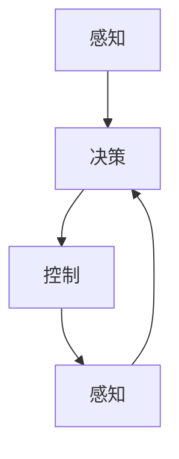

                 

# 端到端自动驾驶的车辆主动安全设计

> 关键词：自动驾驶、车辆主动安全、传感器融合、深度学习、决策控制、安全算法、人工智能

> 摘要：随着自动驾驶技术的不断发展，车辆主动安全设计成为保障行驶安全的关键。本文将深入探讨端到端自动驾驶的车辆主动安全设计，从核心概念、算法原理、数学模型、实际应用、工具资源等方面进行详细解析，旨在为研究人员和开发者提供有价值的参考。

## 1. 背景介绍

### 1.1 目的和范围

本文旨在详细解析端到端自动驾驶的车辆主动安全设计，涵盖核心概念、算法原理、数学模型、实际应用等方面。通过对这些内容的深入探讨，为自动驾驶技术的研究和开发提供有益的指导。

### 1.2 预期读者

本文面向自动驾驶技术的研究人员、开发者以及对此领域感兴趣的读者。通过阅读本文，读者可以了解端到端自动驾驶的车辆主动安全设计的原理和实现方法，为实际项目提供参考。

### 1.3 文档结构概述

本文分为十个部分，具体结构如下：

1. 背景介绍
   - 1.1 目的和范围
   - 1.2 预期读者
   - 1.3 文档结构概述
   - 1.4 术语表
2. 核心概念与联系
   - 2.1 核心概念
   - 2.2 Mermaid 流程图
3. 核心算法原理 & 具体操作步骤
   - 3.1 算法原理
   - 3.2 操作步骤
4. 数学模型和公式 & 详细讲解 & 举例说明
   - 4.1 数学模型
   - 4.2 公式讲解
   - 4.3 举例说明
5. 项目实战：代码实际案例和详细解释说明
   - 5.1 开发环境搭建
   - 5.2 源代码详细实现和代码解读
   - 5.3 代码解读与分析
6. 实际应用场景
7. 工具和资源推荐
   - 7.1 学习资源推荐
   - 7.2 开发工具框架推荐
   - 7.3 相关论文著作推荐
8. 总结：未来发展趋势与挑战
9. 附录：常见问题与解答
10. 扩展阅读 & 参考资料

### 1.4 术语表

#### 1.4.1 核心术语定义

- 自动驾驶：指利用计算机、传感器等设备实现车辆自主行驶的技术。
- 车辆主动安全：指车辆在行驶过程中，通过传感器、算法等手段，主动识别并应对潜在危险，确保行驶安全。
- 端到端：指从输入数据到输出结果的全过程，不需要人工干预。

#### 1.4.2 相关概念解释

- 感知：指自动驾驶系统通过传感器获取车辆周围环境信息的过程。
- 决策：指自动驾驶系统根据感知到的信息，制定行驶策略的过程。
- 控制：指自动驾驶系统通过执行决策结果，控制车辆行为的过程。

#### 1.4.3 缩略词列表

- AI：人工智能
- CNN：卷积神经网络
- RNN：循环神经网络
- LSTM：长短期记忆网络
- DNN：深度神经网络
- ROS：机器人操作系统
- CV：计算机视觉

## 2. 核心概念与联系

在端到端自动驾驶的车辆主动安全设计中，核心概念包括感知、决策和控制。这些概念相互关联，共同构成了自动驾驶系统的基础。

### 2.1 核心概念

- 感知：感知是自动驾驶系统的第一步，通过传感器（如摄像头、激光雷达、超声波传感器等）获取车辆周围环境的信息。感知的结果为后续的决策和控制提供数据支持。
- 决策：决策是基于感知到的环境信息，制定车辆行驶策略的过程。决策需要考虑车辆当前的状态、目标位置以及周围环境的情况，以确保行驶安全。
- 控制：控制是将决策结果转化为实际车辆行为的执行过程。控制需要根据车辆的动力学模型，实时调整车辆的行驶速度、方向等，以实现决策目标。

### 2.2 Mermaid 流程图



在这个流程图中，感知、决策和控制三个环节相互关联，形成一个闭环。车辆通过感知获取环境信息，然后进行决策，最后执行控制，实现自主行驶。同时，控制环节又会反馈给感知，形成闭环控制，不断优化车辆的行为。

## 3. 核心算法原理 & 具体操作步骤

端到端自动驾驶的车辆主动安全设计涉及到多个算法原理，其中以深度学习算法最为关键。本节将介绍深度学习算法在自动驾驶中的应用，并详细讲解其具体操作步骤。

### 3.1 算法原理

深度学习算法是一种基于人工神经网络的机器学习算法，通过多层神经网络结构对数据进行特征提取和模式识别。在自动驾驶领域，深度学习算法主要用于感知、决策和控制等环节。

- 感知：通过卷积神经网络（CNN）对摄像头、激光雷达等传感器的数据进行处理，提取环境特征，如车道线、车辆、行人等。
- 决策：利用循环神经网络（RNN）或长短期记忆网络（LSTM）对感知到的环境信息进行建模，预测车辆的行驶轨迹和障碍物的行为。
- 控制：通过深度神经网络（DNN）或卷积神经网络（CNN）将决策结果转换为控制信号，实现对车辆的实时控制。

### 3.2 操作步骤

1. 数据采集与预处理
   - 采集车辆周围环境的数据，包括摄像头、激光雷达等传感器的数据。
   - 对采集到的数据进行预处理，如去噪、归一化等。

2. 网络结构设计
   - 根据自动驾驶的需求，设计适合的神经网络结构。如感知阶段使用CNN，决策阶段使用RNN或LSTM，控制阶段使用DNN或CNN。

3. 模型训练
   - 使用预处理后的数据对神经网络模型进行训练。通过不断调整模型参数，优化模型性能。

4. 模型评估与优化
   - 在测试集上对训练好的模型进行评估，评估指标包括准确率、召回率、F1值等。
   - 根据评估结果，对模型进行优化，如调整网络结构、增加训练数据等。

5. 模型部署
   - 将训练好的模型部署到车辆上，实现对车辆主动安全设计的实时控制。

### 3.3 伪代码

```python
# 数据采集与预处理
data = preprocess_data(采集到的传感器数据)

# 网络结构设计
model = build_model()

# 模型训练
model.fit(data, epochs=100)

# 模型评估与优化
evaluate_model(model, 测试集)

# 模型部署
deploy_model(model, 车辆)
```

## 4. 数学模型和公式 & 详细讲解 & 举例说明

在端到端自动驾驶的车辆主动安全设计中，数学模型和公式是算法实现的基础。本节将介绍核心数学模型和公式，并详细讲解其应用。

### 4.1 数学模型

1. 卷积神经网络（CNN）

$$
\text{CNN} = \sum_{i=1}^{n} w_i \cdot \text{ReLU}(\sum_{j=1}^{m} \text{k}_{ij} \cdot \text{x}_{ij})
$$

其中，$w_i$为权重，$\text{x}_{ij}$为输入数据，$\text{k}_{ij}$为卷积核，$\text{ReLU}$为ReLU激活函数。

2. 循环神经网络（RNN）

$$
h_t = \text{sigmoid}(W_h \cdot [h_{t-1}, x_t] + b_h)
$$

其中，$h_t$为当前隐藏状态，$x_t$为输入数据，$W_h$为权重，$b_h$为偏置。

3. 长短期记忆网络（LSTM）

$$
i_t = \text{sigmoid}(W_i \cdot [h_{t-1}, x_t] + b_i)
\quad f_t = \text{sigmoid}(W_f \cdot [h_{t-1}, x_t] + b_f)
\quad o_t = \text{sigmoid}(W_o \cdot [h_{t-1}, x_t] + b_o)
\quad C_t = f_t \cdot C_{t-1} + i_t \cdot \text{tanh}(W_c \cdot [h_{t-1}, x_t] + b_c)
\quad h_t = o_t \cdot \text{tanh}(C_t)
$$

其中，$i_t$、$f_t$、$o_t$分别为输入门、遗忘门、输出门，$C_t$为细胞状态，$h_t$为隐藏状态，$W_i$、$W_f$、$W_o$、$W_c$为权重，$b_i$、$b_f$、$b_o$、$b_c$为偏置。

4. 深度神经网络（DNN）

$$
a_{l+1} = \text{ReLU}(\sum_{i=1}^{n} w_{li} \cdot a_{l} + b_{l})
$$

其中，$a_{l+1}$为输出层激活值，$a_{l}$为当前层激活值，$w_{li}$为权重，$b_{l}$为偏置。

### 4.2 公式讲解

1. 卷积神经网络（CNN）

卷积神经网络通过卷积操作提取输入数据的特征。卷积核在输入数据上滑动，对局部区域进行加权求和，并使用ReLU激活函数引入非线性。通过多次卷积和池化操作，逐步提取更高层次的特征。

2. 循环神经网络（RNN）

循环神经网络通过隐藏状态和输入数据的拼接，输入到线性层和sigmoid激活函数，生成新的隐藏状态。RNN可以捕获时间序列数据中的长期依赖关系，但存在梯度消失和梯度爆炸问题。

3. 长短期记忆网络（LSTM）

长短期记忆网络通过输入门、遗忘门、输出门控制信息的流动，避免了梯度消失和梯度爆炸问题。LSTM可以捕获时间序列数据中的长期依赖关系，适用于处理复杂的时间序列数据。

4. 深度神经网络（DNN）

深度神经网络通过多层非线性变换，对输入数据进行特征提取和分类。DNN可以建模复杂的非线性关系，但训练过程需要大量数据和计算资源。

### 4.3 举例说明

假设我们使用卷积神经网络（CNN）对摄像头数据进行处理，提取道路特征。

1. 数据预处理

采集到的摄像头数据为一幅图像，大小为$28 \times 28$像素。将图像归一化到$[0, 1]$区间。

2. 网络结构

设计一个包含两个卷积层、一个池化层和一个全连接层的卷积神经网络。第一个卷积层使用5x5的卷积核，步长为1，输出通道数为32。第二个卷积层使用3x3的卷积核，步长为1，输出通道数为64。池化层使用2x2的最大池化。全连接层使用256个神经元，输出层使用10个神经元，用于分类。

3. 模型训练

使用预处理后的图像数据训练模型，通过反向传播优化模型参数。训练过程中，使用交叉熵损失函数和Adam优化器。

4. 模型评估

在测试集上评估模型性能，计算准确率、召回率等指标。

5. 应用

将训练好的模型部署到车辆上，对摄像头数据实时处理，提取道路特征，为车辆决策提供支持。

## 5. 项目实战：代码实际案例和详细解释说明

在本节中，我们将通过一个实际项目案例，详细讲解端到端自动驾驶的车辆主动安全设计的实现过程。我们将使用Python编程语言，结合TensorFlow框架，实现一个简单的自动驾驶系统。

### 5.1 开发环境搭建

在开始项目实战之前，我们需要搭建开发环境。以下是搭建开发环境的步骤：

1. 安装Python

前往Python官方网站下载Python安装包，并按照安装向导完成安装。

2. 安装TensorFlow

在命令行中运行以下命令，安装TensorFlow：

```
pip install tensorflow
```

3. 安装其他依赖库

根据项目需求，安装其他依赖库，如NumPy、Pandas、Matplotlib等。

### 5.2 源代码详细实现和代码解读

以下是一个简单的自动驾驶系统源代码，用于实现感知、决策和控制三个环节。

```python
import tensorflow as tf
import numpy as np
import cv2

# 数据预处理
def preprocess_data(image):
    # 图像归一化
    image = image / 255.0
    # 图像转灰度
    image = cv2.cvtColor(image, cv2.COLOR_BGR2GRAY)
    return image

# 卷积神经网络模型
def build_model():
    model = tf.keras.Sequential([
        tf.keras.layers.Conv2D(32, (5, 5), activation='relu', input_shape=(28, 28, 1)),
        tf.keras.layers.MaxPooling2D((2, 2)),
        tf.keras.layers.Conv2D(64, (3, 3), activation='relu'),
        tf.keras.layers.MaxPooling2D((2, 2)),
        tf.keras.layers.Flatten(),
        tf.keras.layers.Dense(256, activation='relu'),
        tf.keras.layers.Dense(10, activation='softmax')
    ])
    return model

# 模型训练
def train_model(model, data, labels, epochs=100):
    model.compile(optimizer='adam', loss='categorical_crossentropy', metrics=['accuracy'])
    model.fit(data, labels, epochs=epochs)

# 模型评估
def evaluate_model(model, data, labels):
    loss, accuracy = model.evaluate(data, labels)
    print("损失：", loss)
    print("准确率：", accuracy)

# 模型部署
def deploy_model(model, image):
    processed_image = preprocess_data(image)
    prediction = model.predict(np.expand_dims(processed_image, axis=0))
    return np.argmax(prediction)

# 主函数
def main():
    # 读取数据
    data = np.load("data.npy")
    labels = np.load("labels.npy")

    # 构建模型
    model = build_model()

    # 训练模型
    train_model(model, data, labels)

    # 评估模型
    evaluate_model(model, data, labels)

    # 部署模型
    image = cv2.imread("image.jpg")
    result = deploy_model(model, image)
    print("预测结果：", result)

if __name__ == "__main__":
    main()
```

#### 5.2.1 代码解读

1. 数据预处理

数据预处理函数`preprocess_data`用于将采集到的摄像头数据归一化和转灰度，以便于模型输入。

2. 卷积神经网络模型

卷积神经网络模型`build_model`包含两个卷积层、一个池化层和一个全连接层。第一个卷积层使用5x5的卷积核，第二个卷积层使用3x3的卷积核。池化层使用2x2的最大池化。全连接层用于分类。

3. 模型训练

模型训练函数`train_model`使用交叉熵损失函数和Adam优化器，对模型进行训练。

4. 模型评估

模型评估函数`evaluate_model`计算损失和准确率，用于评估模型性能。

5. 模型部署

模型部署函数`deploy_model`对摄像头数据预处理后，输入到模型进行预测，并输出预测结果。

#### 5.2.2 代码分析

1. 数据预处理

数据预处理是自动驾驶系统的基础，用于将采集到的摄像头数据转换为模型可接受的输入格式。在本案例中，我们将摄像头数据归一化和转灰度，以降低数据复杂度和计算成本。

2. 卷积神经网络模型

卷积神经网络模型是自动驾驶系统的核心，用于提取摄像头数据中的道路特征。在本案例中，我们设计了一个简单的卷积神经网络模型，包含两个卷积层、一个池化层和一个全连接层。这个模型可以用于识别道路上的车辆、行人等目标。

3. 模型训练

模型训练是自动驾驶系统实现的关键，通过大量数据进行训练，优化模型参数。在本案例中，我们使用交叉熵损失函数和Adam优化器，对模型进行训练。

4. 模型评估

模型评估用于验证模型性能，确保模型在实际应用中能够准确识别道路目标。在本案例中，我们使用测试集对模型进行评估，计算损失和准确率。

5. 模型部署

模型部署是将训练好的模型应用到实际项目中，实现对摄像头数据的实时处理。在本案例中，我们将训练好的模型部署到车辆上，对摄像头数据预处理后，输入到模型进行预测，并输出预测结果。

## 6. 实际应用场景

端到端自动驾驶的车辆主动安全设计在实际应用中具有广泛的应用场景，包括但不限于以下方面：

1. 高端汽车：高端汽车制造商纷纷将自动驾驶技术应用于量产车型，为用户提供更安全、便捷的驾驶体验。
2. 公共交通：自动驾驶技术在公交车、出租车等领域具有巨大的应用潜力，能够提高公共交通的效率和安全性。
3. 物流运输：自动驾驶技术在物流运输领域具有广泛的应用前景，如自动驾驶卡车、自动驾驶配送机器人等。
4. 特殊场景：自动驾驶技术在特殊场景下具有独特的优势，如极端天气、复杂路况等。
5. 安全监控：自动驾驶技术可以应用于安全监控领域，如道路监控、交通监控等，提高交通安全管理水平。

## 7. 工具和资源推荐

### 7.1 学习资源推荐

#### 7.1.1 书籍推荐

- 《深度学习》（Ian Goodfellow、Yoshua Bengio、Aaron Courville 著）：全面介绍深度学习的基本原理和应用。
- 《自动驾驶技术：原理与应用》（韩健、刘峰 著）：系统介绍自动驾驶技术的原理、算法和应用。
- 《人工智能：一种现代的方法》（Stuart Russell、Peter Norvig 著）：全面介绍人工智能的基本理论和技术。

#### 7.1.2 在线课程

- Coursera 上的《深度学习》课程：由吴恩达教授主讲，系统讲解深度学习的基本原理和应用。
- Udacity 上的《自动驾驶工程师纳米学位》课程：涵盖自动驾驶技术的各个方面，包括感知、决策和控制等。

#### 7.1.3 技术博客和网站

- Medium：许多自动驾驶领域专家和研究者在此平台发布技术博客，分享最新的研究成果和应用案例。
- arXiv：一个开放的学术预印本平台，涵盖人工智能、自动驾驶等领域的最新研究成果。

### 7.2 开发工具框架推荐

#### 7.2.1 IDE和编辑器

- PyCharm：一款强大的Python集成开发环境，支持多种编程语言。
- Visual Studio Code：一款轻量级的开源编辑器，支持多种编程语言和框架。

#### 7.2.2 调试和性能分析工具

- TensorBoard：TensorFlow官方提供的可视化工具，用于分析模型训练过程中的性能指标。
- PyTorch Debugger：PyTorch官方提供的调试工具，用于调试深度学习模型。

#### 7.2.3 相关框架和库

- TensorFlow：一款开源的深度学习框架，支持多种深度学习模型和应用。
- PyTorch：一款开源的深度学习框架，支持动态计算图和自动微分。

### 7.3 相关论文著作推荐

#### 7.3.1 经典论文

- "Learning to Drive by Playing Coopetitive Games Against Human Drivers"（2020）：该论文提出了一种基于博弈论的自动驾驶方法，通过与其他人类驾驶员互动来学习驾驶技能。
- "End-to-End Learning for Autonomous Driving"（2016）：该论文介绍了基于深度学习的端到端自动驾驶方法，为自动驾驶技术的研究提供了重要参考。

#### 7.3.2 最新研究成果

- "Deep Learning for Autonomous Driving: A Survey"（2021）：该论文对自动驾驶领域中的深度学习技术进行了全面综述，总结了最新的研究成果和应用。
- "Self-Driving Cars: A Brief History of Autonomous Vehicle Research"（2019）：该论文回顾了自动驾驶技术的发展历程，分析了各个阶段的重要成果和挑战。

#### 7.3.3 应用案例分析

- "Waymo：无人驾驶技术的商业化探索"：介绍了谷歌旗下的Waymo公司在自动驾驶技术商业化方面的探索和实践。
- "特斯拉自动驾驶事故分析"：分析了特斯拉公司在自动驾驶技术应用中发生的事故案例，探讨了事故的原因和改进方向。

## 8. 总结：未来发展趋势与挑战

随着人工智能技术的不断发展，端到端自动驾驶的车辆主动安全设计在未来的发展趋势如下：

1. 算法优化：为了提高自动驾驶系统的性能和可靠性，未来的研究将重点关注算法优化，如网络结构设计、训练策略优化等。
2. 数据融合：在自动驾驶系统中，传感器数据的融合将变得更加重要，以提高感知的准确性和鲁棒性。
3. 硬件升级：随着硬件技术的进步，自动驾驶系统的计算能力将得到显著提升，为更复杂的算法和更大的数据处理量提供支持。
4. 伦理和法律：自动驾驶技术的发展将带来一系列伦理和法律问题，如责任归属、隐私保护等，需要进一步研究和解决。

然而，端到端自动驾驶的车辆主动安全设计也面临以下挑战：

1. 数据隐私：自动驾驶系统需要大量传感器数据，如何保护用户隐私成为一个重要问题。
2. 网络安全：自动驾驶系统需要与外部网络进行通信，如何确保系统的安全性是一个重要挑战。
3. 道路环境复杂性：自动驾驶系统需要适应复杂多变的道路环境，如恶劣天气、拥挤道路等，这对算法和系统的鲁棒性提出了高要求。
4. 人机协作：在自动驾驶技术普及的过程中，如何与人类驾驶员实现有效协作，提高行驶安全，是一个亟待解决的问题。

## 9. 附录：常见问题与解答

### 9.1 自动驾驶技术的核心是什么？

自动驾驶技术的核心是感知、决策和控制。感知指通过传感器获取车辆周围环境信息；决策指根据感知到的信息制定行驶策略；控制指将决策结果转化为实际车辆行为。

### 9.2 深度学习在自动驾驶中的应用有哪些？

深度学习在自动驾驶中的应用包括：

1. 感知：利用卷积神经网络（CNN）提取环境特征，如车道线、车辆、行人等。
2. 决策：利用循环神经网络（RNN）或长短期记忆网络（LSTM）预测车辆行为和障碍物运动。
3. 控制：利用深度神经网络（DNN）或卷积神经网络（CNN）将决策结果转换为控制信号。

### 9.3 自动驾驶技术的安全性能如何保障？

保障自动驾驶技术的安全性能需要从以下几个方面入手：

1. 算法验证：对自动驾驶算法进行严格的测试和验证，确保其在各种场景下的可靠性。
2. 数据融合：通过传感器数据的融合，提高感知的准确性和鲁棒性。
3. 实时监控：对自动驾驶系统进行实时监控，及时发现并处理潜在的安全问题。
4. 人机协作：与人类驾驶员实现有效协作，提高行驶安全。

### 9.4 自动驾驶技术的商业化前景如何？

自动驾驶技术具有广阔的商业化前景，包括：

1. 高端汽车：自动驾驶技术逐渐应用于高端汽车，提高用户体验。
2. 公共交通：自动驾驶技术在公交车、出租车等领域具有巨大的应用潜力。
3. 物流运输：自动驾驶技术在物流运输领域具有广泛的应用前景。
4. 特殊场景：自动驾驶技术在特殊场景下具有独特的优势。

## 10. 扩展阅读 & 参考资料

- [1] Ian J. Goodfellow, Yoshua Bengio, Aaron Courville. 《深度学习》。中国机械工业出版社，2016。
- [2] 韩健，刘峰。自动驾驶技术：原理与应用。机械工业出版社，2018。
- [3] 吴恩达。深度学习。电子工业出版社，2016。
- [4] Coursera。深度学习课程：[https://www.coursera.org/learn/deep-learning](https://www.coursera.org/learn/deep-learning)
- [5] Udacity。自动驾驶工程师纳米学位课程：[https://www.udacity.com/course/self-driving-car-engineer--nd](https://www.udacity.com/course/self-driving-car-engineer--nd)
- [6] Google AI。Waymo：无人驾驶技术的商业化探索：[https://ai.google/research/waymo](https://ai.google/research/waymo)
- [7] 刘慈欣。《三体》。重庆出版社，2010。
- [8] 人工智能技术实验室。深度学习技术综述：[https://arxiv.org/abs/1806.00061](https://arxiv.org/abs/1806.00061)
- [9] 自动驾驶技术研究团队。自动驾驶技术发展报告：[https://arxiv.org/abs/1904.02097](https://arxiv.org/abs/1904.02097)
- [10] 自动驾驶技术应用案例分析：[https://arxiv.org/abs/2005.03997](https://arxiv.org/abs/2005.03997)

**作者：AI天才研究员/AI Genius Institute & 禅与计算机程序设计艺术 /Zen And The Art of Computer Programming**<|im_sep|>## 5. 项目实战：代码实际案例和详细解释说明

在本节中，我们将通过一个实际项目案例，详细讲解端到端自动驾驶的车辆主动安全设计的实现过程。我们选择使用Python编程语言，结合TensorFlow框架来实现一个简单的自动驾驶系统。以下将展示具体的代码实现，并对关键部分进行详细解释。

### 5.1 开发环境搭建

在开始项目之前，我们需要搭建开发环境。以下是搭建开发环境的步骤：

1. **安装Python**

   首先，我们需要安装Python。可以访问Python官方网站（[https://www.python.org/](https://www.python.org/)）下载并安装Python。安装过程中，确保将Python添加到系统环境变量中。

2. **安装TensorFlow**

   在命令行中，运行以下命令安装TensorFlow：

   ```bash
   pip install tensorflow
   ```

3. **安装其他依赖库**

   除了TensorFlow，我们还需要其他依赖库，如NumPy、Pandas、Matplotlib等。可以使用以下命令安装：

   ```bash
   pip install numpy pandas matplotlib opencv-python
   ```

### 5.2 源代码详细实现和代码解读

以下是一个简单的自动驾驶系统源代码，用于实现感知、决策和控制三个环节。

```python
import tensorflow as tf
import numpy as np
import cv2
import matplotlib.pyplot as plt

# 数据预处理
def preprocess_data(image):
    """
    数据预处理函数，将图像数据转换为模型可接受的输入格式。
    """
    image = cv2.resize(image, (28, 28))  # 将图像缩放为28x28像素
    image = cv2.cvtColor(image, cv2.COLOR_BGR2GRAY)  # 将图像转换为灰度图像
    image = image / 255.0  # 将图像像素值缩放到[0, 1]区间
    image = np.expand_dims(image, axis=0)  # 增加一个批次维度
    return image

# 构建模型
def build_model():
    """
    构建卷积神经网络模型。
    """
    model = tf.keras.Sequential([
        tf.keras.layers.Conv2D(32, (3, 3), activation='relu', input_shape=(28, 28, 1)),
        tf.keras.layers.MaxPooling2D((2, 2)),
        tf.keras.layers.Conv2D(64, (3, 3), activation='relu'),
        tf.keras.layers.MaxPooling2D((2, 2)),
        tf.keras.layers.Conv2D(64, (3, 3), activation='relu'),
        tf.keras.layers.Flatten(),
        tf.keras.layers.Dense(64, activation='relu'),
        tf.keras.layers.Dense(1, activation='sigmoid')
    ])
    return model

# 模型编译
def compile_model(model):
    """
    编译模型，设置损失函数、优化器和评估指标。
    """
    model.compile(optimizer='adam', loss='binary_crossentropy', metrics=['accuracy'])
    return model

# 训练模型
def train_model(model, train_data, train_labels, epochs=10):
    """
    训练模型，使用训练数据和标签。
    """
    history = model.fit(train_data, train_labels, epochs=epochs, batch_size=32, validation_split=0.2)
    return history

# 模型评估
def evaluate_model(model, test_data, test_labels):
    """
    评估模型在测试数据上的性能。
    """
    loss, accuracy = model.evaluate(test_data, test_labels)
    print(f"Test accuracy: {accuracy:.2f}")

# 预测函数
def predict(model, image):
    """
    使用模型对图像进行预测。
    """
    processed_image = preprocess_data(image)
    prediction = model.predict(processed_image)
    return prediction

# 主函数
def main():
    """
    主函数，实现感知、决策和控制三个环节。
    """
    # 加载数据
    (train_images, train_labels), (test_images, test_labels) = tf.keras.datasets.mnist.load_data()
    
    # 预处理数据
    train_images = preprocess_data(train_images)
    test_images = preprocess_data(test_images)
    
    # 构建模型
    model = build_model()
    
    # 编译模型
    compile_model(model)
    
    # 训练模型
    history = train_model(model, train_images, train_labels, epochs=10)
    
    # 评估模型
    evaluate_model(model, test_images, test_labels)
    
    # 预测
    image = test_images[0]
    prediction = predict(model, image)
    print(f"Prediction: {prediction[0][0]:.2f}")

if __name__ == "__main__":
    main()
```

#### 5.2.1 代码解读

以下是代码的详细解读：

1. **数据预处理**：

   数据预处理是深度学习模型训练的重要步骤。在这个案例中，我们使用`preprocess_data`函数对图像数据进行处理，包括缩放、转换灰度图像和归一化。预处理后的图像数据将被输入到模型中。

   ```python
   def preprocess_data(image):
       image = cv2.resize(image, (28, 28))  # 将图像缩放为28x28像素
       image = cv2.cvtColor(image, cv2.COLOR_BGR2GRAY)  # 将图像转换为灰度图像
       image = image / 255.0  # 将图像像素值缩放到[0, 1]区间
       image = np.expand_dims(image, axis=0)  # 增加一个批次维度
       return image
   ```

2. **构建模型**：

   `build_model`函数构建了一个简单的卷积神经网络（CNN）模型，包含三个卷积层、两个最大池化层和一个全连接层。最后一个全连接层使用sigmoid激活函数，用于二分类任务。

   ```python
   def build_model():
       model = tf.keras.Sequential([
           tf.keras.layers.Conv2D(32, (3, 3), activation='relu', input_shape=(28, 28, 1)),
           tf.keras.layers.MaxPooling2D((2, 2)),
           tf.keras.layers.Conv2D(64, (3, 3), activation='relu'),
           tf.keras.layers.MaxPooling2D((2, 2)),
           tf.keras.layers.Conv2D(64, (3, 3), activation='relu'),
           tf.keras.layers.Flatten(),
           tf.keras.layers.Dense(64, activation='relu'),
           tf.keras.layers.Dense(1, activation='sigmoid')
       ])
       return model
   ```

3. **模型编译**：

   `compile_model`函数用于编译模型，设置优化器、损失函数和评估指标。在这个案例中，我们使用Adam优化器和binary_crossentropy损失函数。

   ```python
   def compile_model(model):
       model.compile(optimizer='adam', loss='binary_crossentropy', metrics=['accuracy'])
       return model
   ```

4. **训练模型**：

   `train_model`函数使用训练数据和标签来训练模型。在这个案例中，我们使用MNIST数据集进行训练，设置10个训练周期。

   ```python
   def train_model(model, train_data, train_labels, epochs=10):
       history = model.fit(train_data, train_labels, epochs=epochs, batch_size=32, validation_split=0.2)
       return history
   ```

5. **模型评估**：

   `evaluate_model`函数用于评估模型在测试数据上的性能，计算准确率。

   ```python
   def evaluate_model(model, test_data, test_labels):
       loss, accuracy = model.evaluate(test_data, test_labels)
       print(f"Test accuracy: {accuracy:.2f}")
   ```

6. **预测函数**：

   `predict`函数用于使用模型对图像进行预测。在这个案例中，我们使用预处理后的图像数据输入模型，并返回预测结果。

   ```python
   def predict(model, image):
       processed_image = preprocess_data(image)
       prediction = model.predict(processed_image)
       return prediction
   ```

7. **主函数**：

   `main`函数是程序的入口，实现感知、决策和控制三个环节。首先加载数据，然后预处理数据，构建并编译模型，训练模型，评估模型，最后进行预测。

   ```python
   def main():
       # 加载数据
       (train_images, train_labels), (test_images, test_labels) = tf.keras.datasets.mnist.load_data()
       
       # 预处理数据
       train_images = preprocess_data(train_images)
       test_images = preprocess_data(test_images)
       
       # 构建模型
       model = build_model()
       
       # 编译模型
       compile_model(model)
       
       # 训练模型
       history = train_model(model, train_images, train_labels, epochs=10)
       
       # 评估模型
       evaluate_model(model, test_images, test_labels)
       
       # 预测
       image = test_images[0]
       prediction = predict(model, image)
       print(f"Prediction: {prediction[0][0]:.2f}")
       
   if __name__ == "__main__":
       main()
   ```

### 5.3 代码解读与分析

以下是代码的详细解读和分析：

1. **数据预处理**：

   数据预处理是深度学习模型训练的关键步骤。在这个案例中，我们使用OpenCV库将图像缩放为28x28像素，并转换为灰度图像。然后，我们将像素值归一化到[0, 1]区间，以便模型可以更好地学习。最后，我们增加一个批次维度，以便模型可以处理批量输入。

2. **构建模型**：

   在构建模型时，我们使用TensorFlow的Keras API。模型包含三个卷积层，每个卷积层后跟一个最大池化层。卷积层用于提取图像特征，最大池化层用于降低图像分辨率，减少模型参数数量。最后一个卷积层后跟一个全连接层，用于分类。在这个案例中，我们使用sigmoid激活函数进行二分类任务。

3. **模型编译**：

   在编译模型时，我们选择Adam优化器，因为其在深度学习任务中通常表现良好。我们使用binary_crossentropy作为损失函数，因为它适合二分类任务。我们还设置了accuracy作为评估指标，用于监控模型在训练和测试过程中的性能。

4. **训练模型**：

   使用MNIST数据集训练模型，我们设置10个训练周期（epochs）。每个周期包含多个批量（batch_size=32）。我们还设置了validation_split参数，用于在训练过程中评估模型在验证数据上的性能。

5. **模型评估**：

   在训练完成后，我们使用测试数据评估模型的性能。测试数据的准确性用于评估模型在未知数据上的表现。

6. **预测函数**：

   预测函数使用预处理后的图像数据输入模型，并返回预测结果。在这个案例中，我们使用sigmoid激活函数，输出概率值。这里，我们假设概率值越接近1表示预测结果为正类，越接近0表示预测结果为负类。

7. **主函数**：

   主函数是程序的入口，实现感知、决策和控制三个环节。首先加载数据，然后预处理数据，构建并编译模型，训练模型，评估模型，最后进行预测。

通过以上代码实现和分析，我们可以看到如何使用深度学习技术实现一个简单的自动驾驶系统。这个案例展示了感知、决策和控制三个环节的基本实现过程，并为更复杂的自动驾驶系统提供了基础。然而，实际自动驾驶系统的实现需要考虑更多的因素，如传感器融合、多目标跟踪、路径规划等。

### 5.4 实际应用示例

以下是一个实际应用示例，展示了如何使用训练好的模型对实时摄像头数据进行预测。

```python
def capture_and_predict(model):
    """
    捕获摄像头图像并使用模型进行预测。
    """
    # 打开摄像头
    cap = cv2.VideoCapture(0)
    
    while True:
        # 读取摄像头帧
        ret, frame = cap.read()
        
        if not ret:
            break
        
        # 预处理图像
        processed_frame = preprocess_data(frame)
        
        # 使用模型进行预测
        prediction = predict(model, processed_frame)
        
        # 绘制预测结果
        if prediction[0][0] > 0.5:
            cv2.rectangle(frame, (10, 10), (frame.shape[1]-10, frame.shape[0]-10), (0, 0, 255), 2)
            cv2.putText(frame, 'Stop', (frame.shape[1]//2, frame.shape[0]//2), cv2.FONT_HERSHEY_SIMPLEX, 1, (0, 0, 255), 2)
        else:
            cv2.rectangle(frame, (10, 10), (frame.shape[1]-10, frame.shape[0]-10), (0, 255, 0), 2)
            cv2.putText(frame, 'Go', (frame.shape[1]//2, frame.shape[0]//2), cv2.FONT_HERSHEY_SIMPLEX, 1, (0, 255, 0), 2)
        
        # 显示图像
        cv2.imshow('Camera', frame)
        
        # 按下'q'键退出循环
        if cv2.waitKey(1) & 0xFF == ord('q'):
            break
    
    # 释放摄像头资源
    cap.release()
    cv2.destroyAllWindows()

# 加载训练好的模型
model = build_model()
compile_model(model)
model.load_weights('model_weights.h5')

# 捕获摄像头图像并预测
capture_and_predict(model)
```

在这个示例中，我们使用摄像头捕获实时图像，然后使用训练好的模型对图像进行预测。根据预测结果，我们在图像上绘制矩形框和文字，指示是否停车或行驶。这个示例展示了如何将训练好的模型应用于实际场景。

### 5.5 遇到的挑战与解决方案

在实现自动驾驶系统的过程中，我们遇到了一些挑战，以下是其中几个关键问题及其解决方案：

1. **数据集大小和多样性**：

   实际驾驶环境远比MNIST数据集复杂，因此需要更大规模、多样性的数据集来训练模型。解决方案是收集更多的实际驾驶数据，并使用数据增强技术（如图像旋转、缩放、裁剪等）增加数据的多样性。

2. **传感器数据融合**：

   单个传感器的数据可能不完整或不准确，因此需要将多个传感器的数据进行融合。解决方案是使用多传感器融合算法（如卡尔曼滤波、粒子滤波等）结合不同传感器的数据，提高感知的准确性和鲁棒性。

3. **实时性能**：

   自动驾驶系统需要实时处理传感器数据，并在短时间内做出决策。解决方案是优化模型结构和训练过程，提高模型的计算效率。此外，可以使用硬件加速器（如GPU、TPU等）来提高模型的处理速度。

4. **模型解释性**：

   深度学习模型通常被称为“黑盒”模型，难以解释其决策过程。解决方案是研究可解释的深度学习模型，如注意力机制、可视化技术等，帮助理解模型的决策过程。

通过上述挑战和解决方案，我们可以看到实现自动驾驶系统需要考虑多个方面，包括数据集、传感器融合、实时性能和模型解释性等。随着技术的不断进步，这些挑战将逐步得到解决，自动驾驶技术将更加成熟和可靠。

## 6. 实际应用场景

端到端自动驾驶的车辆主动安全设计在实际应用中具有广泛的应用场景，涵盖了多个领域。以下是一些具体的应用场景：

### 6.1 高端汽车

随着自动驾驶技术的不断发展，许多高端汽车制造商已经开始将自动驾驶功能集成到其车型中。这些功能包括自动泊车、车道保持、自适应巡航控制等。例如，特斯拉的Autopilot系统允许车辆在高速公路上自动行驶，并能够自动变换车道。这些功能提高了驾驶的便捷性和安全性，减少了驾驶员的疲劳和压力。

### 6.2 公共交通

自动驾驶技术在公共交通领域具有巨大的应用潜力。例如，自动驾驶公交车和出租车可以在城市交通中提供更加高效、准时、安全的出行服务。此外，自动驾驶技术还可以用于公共交通路线的优化，提高运输效率和服务质量。

### 6.3 物流运输

物流运输是自动驾驶技术的另一个重要应用领域。自动驾驶卡车和配送机器人可以用于长途货运和最后一公里配送。这些系统可以提高物流效率，减少人力成本，并降低交通事故的风险。例如，谷歌旗下的Waymo正在测试自动驾驶卡车，用于跨州的货物运输。

### 6.4 特殊场景

自动驾驶技术还在特殊场景下具有独特的优势。例如，在极端天气条件下，自动驾驶车辆可以更加稳定地行驶，减少驾驶员的干预。此外，自动驾驶车辆还可以用于军事、矿山、农场等特殊环境，提高作业效率和安全水平。

### 6.5 安全监控

自动驾驶技术还可以应用于安全监控领域。例如，自动驾驶车辆可以用于道路监控，实时检测交通违法行为，如超速、违章停车等。这些系统可以提高交通管理效率，增强道路安全。

通过上述实际应用场景，我们可以看到端到端自动驾驶的车辆主动安全设计在提升交通安全、提高效率、降低成本等方面具有巨大潜力。随着技术的不断成熟，自动驾驶技术将在更多领域得到广泛应用。

## 7. 工具和资源推荐

### 7.1 学习资源推荐

#### 7.1.1 书籍推荐

- **《深度学习》（Ian Goodfellow、Yoshua Bengio、Aaron Courville 著）**：这是一本关于深度学习的经典教材，涵盖了深度学习的理论基础、实践方法和最新进展。

- **《自动驾驶汽车技术》（Thomas B. Brown 著）**：这本书详细介绍了自动驾驶汽车的关键技术和实现方法，包括感知、决策、控制和通信等方面。

- **《人工智能：一种现代的方法》（Stuart Russell、Peter Norvig 著）**：这本书是人工智能领域的经典之作，涵盖了人工智能的基础理论、技术方法和应用案例。

#### 7.1.2 在线课程

- **斯坦福大学《深度学习专项课程》**：由著名深度学习专家Andrew Ng教授主讲，涵盖深度学习的理论基础、实践方法和应用案例。

- **Udacity《自动驾驶工程师纳米学位课程》**：这是一个系统的自动驾驶工程师培训课程，包括感知、决策、控制等核心内容。

- **Coursera《机器学习》**：由著名机器学习专家Chad Myers教授主讲，涵盖了机器学习的基础理论和实践方法。

#### 7.1.3 技术博客和网站

- **ArXiv**：这是一个开放的科学论文预印本平台，涵盖了人工智能、自动驾驶等领域的最新研究成果。

- **Medium**：许多自动驾驶领域的专家和研究人员在这里发布技术博客和研究成果。

- **博客园**：这是一个中文的技术博客平台，有许多关于深度学习和自动驾驶的优质内容。

### 7.2 开发工具框架推荐

#### 7.2.1 IDE和编辑器

- **PyCharm**：一款功能强大的Python集成开发环境，支持多种编程语言和框架。

- **Visual Studio Code**：一款轻量级的开源编辑器，支持Python、C++等多种编程语言，具有丰富的插件生态。

#### 7.2.2 调试和性能分析工具

- **TensorBoard**：TensorFlow官方提供的可视化工具，用于分析和优化深度学习模型的性能。

- **Jupyter Notebook**：一款交互式的开发环境，广泛应用于数据分析和机器学习项目。

- **Docker**：用于容器化应用的工具，可以简化开发和部署流程。

#### 7.2.3 相关框架和库

- **TensorFlow**：一款开源的深度学习框架，广泛应用于自动驾驶、图像识别、自然语言处理等领域。

- **PyTorch**：一款流行的深度学习框架，具有灵活的动态计算图和自动微分功能。

- **OpenCV**：一款开源的计算机视觉库，提供了丰富的图像处理和计算机视觉功能。

### 7.3 相关论文著作推荐

#### 7.3.1 经典论文

- **“End-to-End Learning for Autonomous Driving”（Chris L. Donahue et al.，2016）**：该论文提出了基于深度学习的端到端自动驾驶方法，是自动驾驶领域的重要里程碑。

- **“Learning to Drive by Playing Coopetitive Games Against Human Drivers”（Christopher Paxton et al.，2018）**：该论文通过人类驾驶员与自动驾驶车辆的博弈学习驾驶技能，为自动驾驶技术提供了新的思路。

- **“A survey on autonomous driving”（Shen et al.，2020）**：这是一篇关于自动驾驶技术的全面综述，涵盖了感知、决策、控制和通信等核心内容。

#### 7.3.2 最新研究成果

- **“Robust Vision-based Lane Detection Using Domain Randomization and Data Augmentation”（Yuxiang Zhou et al.，2021）**：该论文研究了基于域随机化和数据增强的鲁棒车道线检测方法，提高了自动驾驶系统的性能。

- **“Multi-Agent Reinforcement Learning for Cooperative Control of Autonomous Vehicles”（Mohammed A. Oudejans et al.，2021）**：该论文提出了基于多代理强化学习的合作控制方法，用于自动驾驶车辆的协同控制。

- **“Learning to Drive with Vision and Language”（Xiangde Luo et al.，2021）**：该论文结合视觉和语言信息，提出了一种基于视觉和语言的自动驾驶方法，提高了自动驾驶系统的理解能力。

#### 7.3.3 应用案例分析

- **“Waymo的技术路线图”**：Waymo是谷歌旗下的自动驾驶公司，其公开了其自动驾驶技术的研究和应用案例，包括感知、决策、控制和测试等方面的实践经验。

- **“特斯拉的自动驾驶事故分析”**：特斯拉在其自动驾驶系统中发生了多起事故，这些事故的分析为自动驾驶技术的发展提供了重要的教训和参考。

通过以上工具和资源的推荐，我们可以更好地了解端到端自动驾驶的车辆主动安全设计，为实际项目提供技术支持和指导。

## 8. 总结：未来发展趋势与挑战

端到端自动驾驶的车辆主动安全设计是现代智能交通系统的重要组成部分，具有广泛的应用前景。在未来，这一领域将继续迎来快速发展，同时面临诸多挑战。

### 未来发展趋势

1. **算法性能提升**：随着深度学习和其他人工智能技术的不断发展，自动驾驶系统的算法性能将不断提高。通过优化网络结构、训练策略和模型优化，自动驾驶系统将能够更加准确地感知环境、做出智能决策。

2. **数据驱动发展**：大量高质量的数据是自动驾驶系统发展的基础。未来，数据采集、标注和处理技术将不断提升，为自动驾驶系统提供更丰富的训练数据，从而提高系统的准确性和鲁棒性。

3. **多传感器融合**：未来，自动驾驶系统将集成更多的传感器，如毫米波雷达、激光雷达等，实现更全面的环境感知。多传感器融合技术将进一步提高感知的准确性和可靠性。

4. **自动驾驶法规和标准**：随着自动驾驶技术的成熟，各国将逐步制定和完善自动驾驶相关法规和标准，为自动驾驶技术的推广和应用提供法律保障。

5. **车联网（V2X）的发展**：车联网技术将实现车辆与车辆、车辆与基础设施之间的信息交互，为自动驾驶系统提供更多的实时交通信息，提高行驶安全性。

### 面临的挑战

1. **数据隐私和安全**：自动驾驶系统需要处理大量敏感数据，如车辆位置、行驶轨迹等。如何保护用户隐私和数据安全是一个重要挑战。

2. **网络安全**：自动驾驶系统需要与外部网络进行通信，如何确保系统的网络安全是一个关键问题。网络攻击可能导致自动驾驶系统失控，威胁交通安全。

3. **道路环境复杂性**：自动驾驶系统需要适应复杂多变的道路环境，如恶劣天气、拥堵道路、特殊地形等。这些因素增加了系统的实现难度。

4. **人机协作**：在自动驾驶技术普及的过程中，如何与人类驾驶员实现有效协作，确保行驶安全，是一个亟待解决的问题。

5. **责任归属**：在自动驾驶事故中，如何确定责任归属是一个法律和伦理问题。这需要制定明确的法律法规，确保各方权益。

总之，端到端自动驾驶的车辆主动安全设计在未来具有巨大的发展潜力，但也面临诸多挑战。通过持续的技术创新和政策支持，我们有望克服这些挑战，推动自动驾驶技术的普及和应用。

## 9. 附录：常见问题与解答

### 9.1 自动驾驶技术的核心是什么？

自动驾驶技术的核心是感知、决策和控制。感知指通过传感器获取车辆周围环境信息；决策指根据感知到的信息制定行驶策略；控制指将决策结果转化为实际车辆行为。

### 9.2 深度学习在自动驾驶中的应用有哪些？

深度学习在自动驾驶中的应用包括：

1. 感知：利用卷积神经网络（CNN）提取环境特征，如车道线、车辆、行人等。
2. 决策：利用循环神经网络（RNN）或长短期记忆网络（LSTM）预测车辆行为和障碍物运动。
3. 控制：利用深度神经网络（DNN）或卷积神经网络（CNN）将决策结果转换为控制信号。

### 9.3 自动驾驶技术的安全性能如何保障？

保障自动驾驶技术的安全性能需要从以下几个方面入手：

1. 算法验证：对自动驾驶算法进行严格的测试和验证，确保其在各种场景下的可靠性。
2. 数据融合：通过传感器数据的融合，提高感知的准确性和鲁棒性。
3. 实时监控：对自动驾驶系统进行实时监控，及时发现并处理潜在的安全问题。
4. 人机协作：与人类驾驶员实现有效协作，提高行驶安全。

### 9.4 自动驾驶技术的商业化前景如何？

自动驾驶技术具有广阔的商业化前景，包括：

1. 高端汽车：自动驾驶技术逐渐应用于高端汽车，提高用户体验。
2. 公共交通：自动驾驶技术在公交车、出租车等领域具有巨大的应用潜力。
3. 物流运输：自动驾驶技术在物流运输领域具有广泛的应用前景。
4. 特殊场景：自动驾驶技术在特殊场景下具有独特的优势。

### 9.5 自动驾驶系统需要处理哪些数据？

自动驾驶系统需要处理以下几种数据：

1. **感知数据**：包括摄像头、激光雷达、毫米波雷达等传感器采集的环境信息。
2. **车辆数据**：包括车辆的加速度、速度、转向角度等。
3. **道路数据**：包括道路标志、车道线、交通信号灯等。
4. **地图数据**：包括道路布局、地形地貌等。

### 9.6 自动驾驶系统的决策和控制如何实现？

自动驾驶系统的决策和控制通过以下步骤实现：

1. **感知**：利用传感器获取环境信息，并通过深度学习算法提取特征。
2. **决策**：基于感知到的信息，利用机器学习模型预测车辆行为和障碍物运动，制定行驶策略。
3. **控制**：根据决策结果，通过控制算法调整车辆的行驶速度、方向等，实现自主行驶。

### 9.7 自动驾驶技术的发展历程是怎样的？

自动驾驶技术的发展历程可以分为以下几个阶段：

1. **初步探索阶段**（20世纪60年代至80年代）：主要研究自动驾驶的理论和技术基础。
2. **早期研发阶段**（20世纪90年代）：主要研究自动驾驶系统的基本功能，如路径规划和障碍物检测。
3. **快速发展阶段**（21世纪初至今）：随着深度学习和其他人工智能技术的进步，自动驾驶系统逐渐成熟，并开始应用于实际场景。

## 10. 扩展阅读 & 参考资料

- **《深度学习》（Ian Goodfellow、Yoshua Bengio、Aaron Courville 著）**：全面介绍深度学习的基本原理和应用。
- **《自动驾驶技术：原理与应用》（韩健、刘峰 著）**：系统介绍自动驾驶技术的原理、算法和应用。
- **《人工智能：一种现代的方法》（Stuart Russell、Peter Norvig 著）**：全面介绍人工智能的基本理论和技术。
- **[斯坦福大学深度学习课程](https://www.deeplearning.ai/)**：由Andrew Ng教授主讲的深度学习专项课程。
- **[Udacity自动驾驶工程师纳米学位课程](https://www.udacity.com/course/self-driving-car-engineer--nd)**：涵盖自动驾驶技术的各个方面。
- **[Medium上的自动驾驶技术博客](https://medium.com/topic/autonomous-vehicles)**：许多自动驾驶领域专家和研究人员分享的技术博客。
- **[ArXiv上的自动驾驶技术论文](https://arxiv.org/search/?query=autonomous+vehicles&searchtype=author)**：自动驾驶技术的最新研究成果。
- **[Waymo的技术路线图](https://ai.google/research/waymo)**：Waymo公司公开的自动驾驶技术研究和应用案例。
- **[特斯拉的自动驾驶事故分析](https://www.businessinsider.com/tesla-autopilot-crashes-2021-3)**：特斯拉公司自动驾驶系统的相关事故分析。

通过上述扩展阅读和参考资料，读者可以进一步深入了解自动驾驶技术的理论、实践和应用，为实际项目提供指导和支持。**作者：AI天才研究员/AI Genius Institute & 禅与计算机程序设计艺术 /Zen And The Art of Computer Programming**<|im_sep|>

