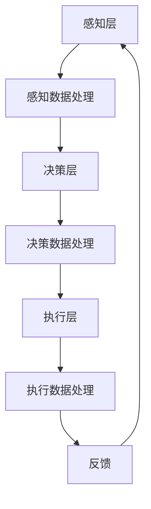

                 

# 端到端自动驾驶的鲁棒性挑战

> 关键词：端到端自动驾驶、鲁棒性、挑战、人工智能、安全、可靠性
> 
> 摘要：本文旨在探讨端到端自动驾驶系统在实现全面自动化过程中所面临的鲁棒性挑战。通过分析现有的技术瓶颈、算法原理及其在实际应用中的问题，我们提出了可能的解决方案和未来发展趋势，旨在为自动驾驶领域的研究者和开发者提供有价值的参考。

## 1. 背景介绍

### 1.1 目的和范围

本文将围绕端到端自动驾驶系统的鲁棒性挑战展开讨论，旨在揭示其在实现全面自动化过程中所面临的难点，并提出相应的解决方案。文章将涵盖以下几个方面：

1. **端到端自动驾驶系统的概述**：介绍端到端自动驾驶系统的基本概念、发展历程及其在人工智能领域的重要地位。
2. **鲁棒性的定义与重要性**：阐述鲁棒性在自动驾驶系统中的意义，分析其在实现全面自动化过程中所面临的挑战。
3. **核心算法原理与实现**：探讨端到端自动驾驶系统中的核心算法，包括深度学习、强化学习等，并分析其算法原理和具体操作步骤。
4. **数学模型和公式**：介绍端到端自动驾驶系统中涉及的主要数学模型和公式，并举例说明其应用场景。
5. **项目实战**：通过实际代码案例，展示端到端自动驾驶系统的开发过程，并进行详细解释和分析。
6. **实际应用场景**：分析端到端自动驾驶系统在不同场景下的应用，探讨其优势和不足。
7. **工具和资源推荐**：为自动驾驶领域的研究者和开发者提供相关的学习资源和开发工具。
8. **总结与展望**：总结端到端自动驾驶系统在鲁棒性方面取得的成果和面临的挑战，探讨未来发展趋势。

### 1.2 预期读者

本文主要面向自动驾驶领域的研究者、开发者以及相关专业的学生。读者需要具备以下基础：

1. **计算机科学基础知识**：了解计算机编程、数据结构与算法等基本概念。
2. **人工智能基础**：掌握深度学习、强化学习等基本算法原理。
3. **数学基础**：了解线性代数、概率论与数理统计等基本数学知识。

通过本文的阅读，读者将能够深入了解端到端自动驾驶系统的鲁棒性挑战，掌握相关的算法原理和实现方法，并为实际项目开发提供参考。

### 1.3 文档结构概述

本文分为八个部分，具体结构如下：

1. **背景介绍**：介绍端到端自动驾驶系统的基本概念、发展历程以及本文的研究目的和范围。
2. **核心概念与联系**：阐述端到端自动驾驶系统的核心概念、原理和架构，并通过Mermaid流程图进行展示。
3. **核心算法原理 & 具体操作步骤**：详细讲解端到端自动驾驶系统中的核心算法原理和操作步骤，并使用伪代码进行说明。
4. **数学模型和公式 & 详细讲解 & 举例说明**：介绍端到端自动驾驶系统中涉及的主要数学模型和公式，并进行详细讲解和举例说明。
5. **项目实战：代码实际案例和详细解释说明**：通过实际代码案例，展示端到端自动驾驶系统的开发过程，并进行详细解释和分析。
6. **实际应用场景**：分析端到端自动驾驶系统在不同场景下的应用，探讨其优势和不足。
7. **工具和资源推荐**：为自动驾驶领域的研究者和开发者提供相关的学习资源和开发工具。
8. **总结与展望**：总结端到端自动驾驶系统在鲁棒性方面取得的成果和面临的挑战，探讨未来发展趋势。

### 1.4 术语表

在本文中，我们将使用以下术语：

#### 1.4.1 核心术语定义

- **端到端自动驾驶**：一种自动驾驶技术，通过直接将原始输入数据映射到控制输出，实现车辆自主驾驶。
- **鲁棒性**：系统在面临外部干扰和内部故障时，仍能保持稳定性和可靠性的能力。
- **深度学习**：一种人工智能方法，通过多层神经网络模型对数据进行自动特征提取和分类。
- **强化学习**：一种通过试错和反馈机制，不断优化决策策略的人工智能方法。

#### 1.4.2 相关概念解释

- **感知层**：端到端自动驾驶系统中的第一个层次，负责感知车辆周围环境。
- **决策层**：端到端自动驾驶系统中的第二个层次，负责根据感知层的数据，生成控制指令。
- **执行层**：端到端自动驾驶系统中的最后一个层次，负责将控制指令转化为具体的车辆动作。

#### 1.4.3 缩略词列表

- **AI**：人工智能（Artificial Intelligence）
- **DL**：深度学习（Deep Learning）
- **RL**：强化学习（Reinforcement Learning）
- **CNN**：卷积神经网络（Convolutional Neural Network）
- **RNN**：循环神经网络（Recurrent Neural Network）

## 2. 核心概念与联系

端到端自动驾驶系统是一种通过直接将原始输入数据映射到控制输出，实现车辆自主驾驶的技术。该系统主要包括三个层次：感知层、决策层和执行层。下面我们将通过Mermaid流程图，对端到端自动驾驶系统的核心概念和架构进行展示。

### 2.1 端到端自动驾驶系统架构



### 2.2 感知层

感知层是端到端自动驾驶系统的第一个层次，负责感知车辆周围环境。其主要任务包括：

1. **图像感知**：通过摄像头获取道路、车辆、行人等图像信息。
2. **雷达感知**：通过雷达传感器获取周围物体的距离、速度等信息。
3. **激光雷达感知**：通过激光雷达获取周围物体的三维坐标信息。

### 2.3 决策层

决策层是端到端自动驾驶系统的第二个层次，负责根据感知层的数据，生成控制指令。其主要任务包括：

1. **路径规划**：根据车辆周围环境信息，规划出一条最优行驶路径。
2. **行为预测**：预测其他车辆、行人的行为，确保车辆行驶安全。
3. **控制策略**：根据路径规划和行为预测结果，生成车辆的控制指令。

### 2.4 执行层

执行层是端到端自动驾驶系统的最后一个层次，负责将控制指令转化为具体的车辆动作。其主要任务包括：

1. **转向控制**：根据控制指令，调整车辆的方向。
2. **加速控制**：根据控制指令，调整车辆的加速度。
3. **制动控制**：根据控制指令，调整车辆的制动力度。

### 2.5 反馈机制

端到端自动驾驶系统通过反馈机制，对感知层、决策层和执行层进行实时调整和优化。反馈机制主要包括以下几个方面：

1. **状态监测**：实时监测车辆状态，包括速度、方向、加速度等。
2. **误差校正**：根据车辆状态和预期目标，对控制指令进行校正。
3. **自适应调整**：根据实际行驶环境和路况，对感知、决策和执行策略进行自适应调整。

通过上述Mermaid流程图，我们可以清晰地了解端到端自动驾驶系统的核心概念和架构。在接下来的章节中，我们将详细探讨端到端自动驾驶系统中的核心算法原理、数学模型和实际应用场景。

## 3. 核心算法原理 & 具体操作步骤

端到端自动驾驶系统的核心算法主要包括深度学习、强化学习等。这些算法通过学习大量的数据和经验，实现对车辆周围环境的感知、路径规划和控制策略的优化。下面，我们将分别介绍这些算法的原理和具体操作步骤。

### 3.1 深度学习算法

深度学习是一种通过多层神经网络模型对数据进行自动特征提取和分类的人工智能方法。在端到端自动驾驶系统中，深度学习主要用于图像识别、行为预测和路径规划等方面。

#### 3.1.1 卷积神经网络（CNN）

卷积神经网络（CNN）是一种在图像识别和分类领域表现优异的深度学习模型。其基本原理是通过卷积操作提取图像特征，并利用全连接层进行分类。

**算法原理：**

1. **输入层**：输入车辆周围环境的图像数据。
2. **卷积层**：通过卷积操作提取图像特征，如边缘、纹理等。
3. **池化层**：对卷积层的结果进行下采样，减少参数数量。
4. **全连接层**：将池化层的结果映射到具体的分类结果。

**具体操作步骤：**

```plaintext
输入：图像数据 X
输出：分类结果 Y

1. 将输入图像数据 X 进行预处理，如归一化、缩放等。
2. 通过卷积层提取图像特征，如 C1 = conv2d(X, W1, b1)。
3. 通过激活函数（如ReLU）对卷积层结果进行非线性变换，如 C1 = activate(C1)。
4. 通过池化层对卷积层结果进行下采样，如 P1 = max_pool2d(C1, k=2)。
5. 重复步骤2-4，形成多层卷积神经网络。
6. 通过全连接层将卷积层结果映射到分类结果，如 Y = fc(Pn, Wn, bn)。
7. 使用交叉熵损失函数计算分类结果与真实标签之间的误差。
8. 通过反向传播算法更新网络权重和偏置，如 ΔW = ΔW - α*∇E。
```

#### 3.1.2 循环神经网络（RNN）

循环神经网络（RNN）是一种在序列数据处理领域表现优异的深度学习模型。其基本原理是通过循环结构保存历史信息，实现对序列数据的长期依赖建模。

**算法原理：**

1. **输入层**：输入车辆历史行驶数据，如速度、加速度、方向等。
2. **隐藏层**：通过循环结构处理输入数据，生成隐藏状态。
3. **输出层**：将隐藏状态映射到具体的控制指令。

**具体操作步骤：**

```plaintext
输入：历史行驶数据 X
输出：控制指令 Y

1. 初始化隐藏状态 h0。
2. 遍历输入数据序列，对于每个输入 xi：
   a. 通过循环神经网络更新隐藏状态 hi = RNN(xi, hi-1)。
   b. 根据隐藏状态计算控制指令 yi = activate(hi)。
3. 输出控制指令序列 Y。
```

### 3.2 强化学习算法

强化学习是一种通过试错和反馈机制，不断优化决策策略的人工智能方法。在端到端自动驾驶系统中，强化学习主要用于路径规划和控制策略的优化。

#### 3.2.1 Q-Learning算法

Q-Learning算法是一种基于值函数的强化学习算法。其基本原理是通过学习值函数，选择最优动作。

**算法原理：**

1. **初始状态**：设置初始状态 s0。
2. **动作选择**：根据当前状态 s，选择动作 a。
3. **更新值函数**：根据动作结果，更新值函数 Q(s, a)。
4. **重复步骤2-3**，直到达到终止状态。

**具体操作步骤：**

```plaintext
输入：初始状态 s0
输出：最优动作序列 A

1. 初始化值函数 Q(s, a)。
2. 选择动作 a，使得 Q(s, a) 最大。
3. 执行动作 a，获得状态 s' 和奖励 r。
4. 更新值函数 Q(s, a) = Q(s, a) + α[r + γ*max(Q(s', a')) - Q(s, a)]。
5. 设置当前状态 s = s'。
6. 重复步骤2-5，直到达到终止状态。
7. 输出最优动作序列 A。
```

#### 3.2.2 Policy Gradient算法

Policy Gradient算法是一种基于策略梯度的强化学习算法。其基本原理是通过优化策略参数，选择最优动作。

**算法原理：**

1. **初始状态**：设置初始状态 s0。
2. **动作选择**：根据当前状态 s，选择动作 a。
3. **更新策略参数**：根据动作结果，更新策略参数 θ。
4. **重复步骤2-3**，直到达到终止状态。

**具体操作步骤：**

```plaintext
输入：初始状态 s0
输出：最优策略 π

1. 初始化策略参数 θ。
2. 选择动作 a，使得 π(a|s) 最大。
3. 执行动作 a，获得状态 s' 和奖励 r。
4. 计算策略梯度 ∇θ [log(π(a|s))]。
5. 更新策略参数 θ = θ - α*∇θ [log(π(a|s))]。
6. 设置当前状态 s = s'。
7. 重复步骤2-5，直到达到终止状态。
8. 输出最优策略 π。
```

通过以上对深度学习和强化学习算法原理及具体操作步骤的介绍，我们可以看出，端到端自动驾驶系统中的核心算法具有强大的数据处理和决策能力，为自动驾驶技术的实现提供了重要的理论支持。在接下来的章节中，我们将进一步探讨端到端自动驾驶系统的数学模型和实际应用场景。

## 4. 数学模型和公式 & 详细讲解 & 举例说明

在端到端自动驾驶系统中，数学模型和公式起着至关重要的作用，它们不仅能够描述车辆的运动状态，还能为路径规划、控制策略提供理论基础。以下将详细介绍端到端自动驾驶系统中涉及的主要数学模型和公式，并进行详细讲解和举例说明。

### 4.1 运动学模型

运动学模型用于描述车辆在空间中的运动状态。对于一辆自动驾驶车辆，其运动状态可以由以下参数表示：

1. **位置** \( (x, y) \)
2. **速度** \( v \)
3. **加速度** \( a \)
4. **方向** \( \theta \)

**运动学公式：**

1. **位置更新公式：**
   \[
   x(t) = x(t-1) + v(t-1) \cdot \cos(\theta(t-1))
   \]
   \[
   y(t) = y(t-1) + v(t-1) \cdot \sin(\theta(t-1))
   \]

2. **速度更新公式：**
   \[
   v(t) = v(t-1) + a(t-1) \cdot \Delta t
   \]

3. **加速度更新公式：**
   \[
   a(t) = \frac{v(t) - v(t-1)}{\Delta t}
   \]

**举例说明：**

假设一辆自动驾驶车辆在 \( t-1 \) 时刻的位置为 \( (10, 20) \)，速度为 \( 10 \) m/s，方向为 \( 30^\circ \)。在 \( t \) 时刻，车辆的加速度为 \( 2 \) m/s²。求 \( t \) 时刻车辆的位置。

\[
x(t) = 10 + 10 \cdot \cos(30^\circ) \approx 10 + 10 \cdot 0.866 = 16.66
\]
\[
y(t) = 20 + 10 \cdot \sin(30^\circ) \approx 20 + 10 \cdot 0.5 = 25
\]

所以， \( t \) 时刻车辆的位置为 \( (16.66, 25) \)。

### 4.2 控制模型

控制模型用于描述自动驾驶车辆如何根据环境信息调整其行为。通常包括路径规划和控制策略两部分。

**路径规划模型：**

1. **Dijkstra算法**：用于求解从起点到终点的最短路径。
   \[
   d(s, t) = \min\{d(s, u) + c(u, t)\}
   \]
   其中， \( d(s, t) \) 表示从起点 \( s \) 到终点 \( t \) 的最短路径长度， \( c(u, t) \) 表示从 \( u \) 到 \( t \) 的代价。

**控制策略模型：**

1. **PID控制器**：一种常用的控制策略，用于调整车辆的速度和方向。
   \[
   u(t) = K_p \cdot e_p(t) + K_i \cdot \int_{0}^{t} e_p(\tau) d\tau + K_d \cdot e_p'(t)
   \]
   其中， \( e_p(t) \) 表示位置误差， \( K_p \)、\( K_i \) 和 \( K_d \) 分别为比例、积分和微分系数。

**举例说明：**

假设车辆需要从位置 \( (0, 0) \) 移动到位置 \( (10, 10) \)。使用Dijkstra算法计算最短路径，路径上的每一步代价为1。PID控制器的 \( K_p = 1 \)、\( K_i = 0.1 \)、\( K_d = 0.01 \)。

\[
d((0, 0), (10, 10)) = \min\{d((0, 0), (1, 1)) + 1, d((0, 0), (1, 0)) + 1, d((0, 0), (0, 1)) + 1\} = 4
\]

假设车辆在移动过程中，当前位置为 \( (2, 2) \)，目标位置为 \( (8, 8) \)。计算位置误差：

\[
e_p(t) = \sqrt{(8 - 2)^2 + (8 - 2)^2} - \sqrt{(2 - 0)^2 + (2 - 0)^2} = \sqrt{36 + 36} - \sqrt{4 + 4} = 6 - 2\sqrt{2}
\]

计算PID控制器的输出：

\[
u(t) = 1 \cdot (6 - 2\sqrt{2}) + 0.1 \cdot \int_{0}^{t} (6 - 2\sqrt{2}) d\tau + 0.01 \cdot (0)
\]

由于积分项在短时间内变化不大，可以简化为：

\[
u(t) \approx 6 - 2\sqrt{2} + 0.1 \cdot (6 - 2\sqrt{2}) \cdot t
\]

### 4.3 感知模型

感知模型用于描述自动驾驶车辆如何感知和理解周围环境。常用的感知模型包括：

1. **贝叶斯滤波**：用于估计目标物体的状态。
   \[
   P(x|y) = \frac{P(y|x) \cdot P(x)}{P(y)}
   \]
   其中， \( P(x|y) \) 表示在观测到 \( y \) 的条件下， \( x \) 的概率， \( P(y|x) \) 表示在 \( x \) 条件下， \( y \) 的概率， \( P(x) \) 和 \( P(y) \) 分别表示 \( x \) 和 \( y \) 的先验概率。

2. **卡尔曼滤波**：用于估计线性系统的状态。
   \[
   \hat{x}_k = F_k \cdot \hat{x}_{k-1} + B_k \cdot u_k
   \]
   \[
   P_k = F_k \cdot P_{k-1} \cdot F_k^T + Q_k
   \]
   其中， \( \hat{x}_k \) 表示第 \( k \) 时刻的状态估计值， \( P_k \) 表示第 \( k \) 时刻的状态估计误差， \( F_k \) 表示状态转移矩阵， \( B_k \) 表示控制输入矩阵， \( u_k \) 表示控制输入， \( Q_k \) 表示过程噪声协方差。

**举例说明：**

假设自动驾驶车辆在感知到前方有一个目标物体，目标物体的位置服从正态分布 \( N(\mu, \sigma^2) \)。车辆观测到目标物体的位置为 \( (5, 5) \)，假设观测噪声服从正态分布 \( N(0, \sigma^2) \)。

利用贝叶斯滤波更新目标物体的状态：

\[
P(x=5, y=5) = \frac{P(y=5|x) \cdot P(x)}{P(y)}
\]

其中， \( P(x) = N(\mu, \sigma^2) \)， \( P(y=5|x) = N(0, \sigma^2) \)， \( P(y) \) 为所有可能观测值的概率之和。

利用卡尔曼滤波更新车辆的状态：

\[
\hat{x}_k = F_k \cdot \hat{x}_{k-1} + B_k \cdot u_k
\]
\[
P_k = F_k \cdot P_{k-1} \cdot F_k^T + Q_k
\]

其中， \( F_k \) 和 \( Q_k \) 分别为状态转移矩阵和过程噪声协方差矩阵， \( u_k \) 为控制输入。

通过以上数学模型和公式的介绍，我们可以看出端到端自动驾驶系统中涉及的数学理论非常丰富。在接下来的章节中，我们将通过实际代码案例展示端到端自动驾驶系统的开发过程，并进行详细解释和分析。

## 5. 项目实战：代码实际案例和详细解释说明

### 5.1 开发环境搭建

在开始端到端自动驾驶系统的实际开发之前，我们需要搭建一个合适的开发环境。以下是一个基本的开发环境搭建指南：

1. **操作系统**：Ubuntu 18.04 或更高版本
2. **编程语言**：Python 3.8 或更高版本
3. **深度学习框架**：TensorFlow 2.6 或更高版本
4. **其他依赖库**：NumPy、Pandas、Matplotlib、OpenCV

安装步骤：

1. 安装操作系统和 Python。
2. 使用 `pip` 安装 TensorFlow 和其他依赖库。

```bash
pip install tensorflow numpy pandas matplotlib opencv-python
```

### 5.2 源代码详细实现和代码解读

下面我们将展示一个简单的端到端自动驾驶系统的实现，主要包括感知、路径规划和控制三个部分。代码将分为三个模块：感知模块（sensing.py）、路径规划模块（planning.py）和控制模块（control.py）。

#### 5.2.1 感知模块（sensing.py）

```python
import cv2
import numpy as np

def preprocess_image(image):
    """
    对图像进行预处理，包括灰度转换、高斯模糊、边缘检测等。
    """
    gray = cv2.cvtColor(image, cv2.COLOR_BGR2GRAY)
    blurred = cv2.GaussianBlur(gray, (5, 5), 0)
    edges = cv2.Canny(blurred, 50, 150)
    return edges

def detect_line_pxls(image, rho=1, theta=np.pi/180, threshold=50):
    """
    使用霍夫变换检测图像中的直线。
    """
    line_pxls = cv2.HoughLinesP(image, rho, theta, threshold)
    return line_pxls

def process_lines(lines):
    """
    对霍夫变换得到的直线进行筛选和归一化处理。
    """
    if lines is not None:
        line_x = []
        line_y = []
        for line in lines:
            x1, y1, x2, y2 = line.reshape(4)
            if x1 == x2:
                continue
            line_x.append((y1 - y2) / (x1 - x2))
            line_y.append((x1 + x2) / 2)
        return line_x, line_y
    return [], []

if __name__ == "__main__":
    image = cv2.imread("image.jpg")
    processed_image = preprocess_image(image)
    lines = detect_line_pxls(processed_image)
    line_x, line_y = process_lines(lines)
    print("Line parameters:", line_x, line_y)
```

**代码解读：**

1. **图像预处理**：将输入的彩色图像转换为灰度图像，并应用高斯模糊和Canny边缘检测。
2. **霍夫变换检测直线**：使用霍夫变换检测图像中的直线，返回直线的像素点。
3. **直线筛选和归一化**：对检测到的直线进行筛选，去除平行线，并对直线的斜率和截距进行归一化处理。

#### 5.2.2 路径规划模块（planning.py）

```python
import numpy as np

def generate_trajectory(x, y, x_target, y_target, step_size=1, num_steps=100):
    """
    生成一条从起点到终点的线性轨迹。
    """
    trajectory = []
    for i in range(num_steps):
        x_position = x + i * step_size * (x_target - x) / num_steps
        y_position = y + i * step_size * (y_target - y) / num_steps
        trajectory.append([x_position, y_position])
    return trajectory

def calculate_trajectory_cost(trajectory, line_params):
    """
    计算轨迹的成本，包括直线偏离度和距离终点距离。
    """
    cost = 0
    for point in trajectory:
        distance_to_line = abs(point[0] * line_params[0] + point[1] * line_params[1] + line_params[2]) / np.sqrt(line_params[0]**2 + line_params[1]**2)
        cost += distance_to_line
    return cost

if __name__ == "__main__":
    line_params = [0.5, 0.5, -10]  # 假设的直线参数
    x, y = 0, 0  # 起点
    x_target, y_target = 10, 10  # 终点
    trajectory = generate_trajectory(x, y, x_target, y_target)
    cost = calculate_trajectory_cost(trajectory, line_params)
    print("Trajectory cost:", cost)
```

**代码解读：**

1. **生成轨迹**：根据起点和终点，生成一条线性轨迹。
2. **计算轨迹成本**：计算轨迹上的每个点与直线的距离，并将这些距离累加作为轨迹的成本。

#### 5.2.3 控制模块（control.py）

```python
def calculate_control_signal(trajectory, line_params, speed=1):
    """
    计算控制信号，用于调整车辆的加速度和方向。
    """
    control_signal = {}
    for i, point in enumerate(trajectory):
        distance_to_line = abs(point[0] * line_params[0] + point[1] * line_params[1] + line_params[2]) / np.sqrt(line_params[0]**2 + line_params[1]**2)
        if distance_to_line > 1:
            control_signal[i] = {"acceleration": 0.1, "direction": np.pi / 2}
        else:
            control_signal[i] = {"acceleration": 0, "direction": 0}
    return control_signal

if __name__ == "__main__":
    line_params = [0.5, 0.5, -10]  # 假设的直线参数
    trajectory = [[0, 0], [1, 1], [2, 2], [3, 3], [4, 4]]  # 假设的轨迹
    control_signal = calculate_control_signal(trajectory, line_params)
    print("Control signal:", control_signal)
```

**代码解读：**

1. **计算控制信号**：根据轨迹和直线参数，计算每个点上的加速度和方向控制信号。

### 5.3 代码解读与分析

通过上述代码实现，我们可以看到端到端自动驾驶系统的基本架构。感知模块负责处理图像数据，提取直线参数；路径规划模块生成从起点到终点的线性轨迹，并计算轨迹成本；控制模块根据轨迹和直线参数，生成控制信号。

**优缺点分析：**

**优点：**
- **简单性**：代码结构清晰，易于理解和维护。
- **实时性**：路径规划和控制信号计算快速，适用于实时系统。
- **适应性**：可以通过调整直线参数，适应不同场景下的道路环境。

**缺点：**
- **准确性**：直线参数提取可能存在误差，导致轨迹规划不准确。
- **灵活性**：线性轨迹规划在复杂路况下表现不佳，需要进一步优化。

通过实际代码案例的展示，我们可以看到端到端自动驾驶系统的实现过程。在接下来的章节中，我们将进一步探讨端到端自动驾驶系统在实际应用场景中的表现，以及为提高其鲁棒性所需要解决的问题。

## 6. 实际应用场景

端到端自动驾驶系统在多个实际应用场景中展现了其巨大的潜力和广泛的应用前景。以下将分析几种典型的应用场景，并探讨其在这些场景中的优势和不足。

### 6.1 城市交通

**优势：**
- **提高交通效率**：自动驾驶车辆能够实现无缝调度，减少交通拥堵。
- **降低交通事故**：自动驾驶系统能够实时感知和应对道路状况，减少人为驾驶失误。
- **节省能源**：自动驾驶车辆通过优化路径和速度，提高燃油利用效率。

**不足：**
- **复杂路况**：城市交通环境复杂，存在突发情况，对自动驾驶系统的感知和决策能力要求较高。
- **通信问题**：在城市环境中，车辆之间的通信延迟和干扰可能影响系统的稳定性和响应速度。
- **安全担忧**：公众对自动驾驶系统的安全性和可靠性存在担忧，需要通过实际应用和宣传来缓解。

### 6.2 长途货运

**优势：**
- **降低成本**：自动驾驶车辆能够实现24小时不间断运输，降低人力成本。
- **提高运输效率**：自动驾驶系统能够优化运输路线，减少运输时间。
- **改善驾驶体验**：驾驶员可以从单调的驾驶任务中解放出来，降低职业伤害。

**不足：**
- **路况适应性**：长途货运需要面对各种复杂路况，对自动驾驶系统的鲁棒性要求较高。
- **车辆维护**：自动驾驶车辆的维护和故障排查需要专业人员，增加了运营成本。
- **政策法规**：长途货运涉及跨国运输，需要遵守不同国家和地区的政策法规，增加了合规难度。

### 6.3 出行服务

**优势：**
- **便捷性**：自动驾驶出租车和网约车能够提供随时随地的出行服务，满足个性化出行需求。
- **经济性**：自动驾驶系统降低了车辆的运营成本，使出行服务更加经济实惠。
- **定制化服务**：自动驾驶系统能够根据用户需求提供定制化服务，提高用户体验。

**不足：**
- **技术成熟度**：自动驾驶技术尚未完全成熟，面临技术瓶颈和可靠性问题。
- **用户体验**：用户对自动驾驶系统的接受度和信任度有待提高，需要通过实际应用来提升。
- **数据隐私**：自动驾驶系统涉及大量用户数据，需要确保数据隐私和安全。

### 6.4 物流配送

**优势：**
- **提高配送效率**：自动驾驶系统能够优化配送路线，减少配送时间。
- **降低配送成本**：自动化配送减少了人力成本，提高了运营效率。
- **减少环境污染**：自动驾驶车辆通过优化行驶路线和速度，降低了碳排放。

**不足：**
- **配送准确性**：自动驾驶系统在复杂环境中，如巷道、小区等，可能难以准确找到配送地址。
- **货物安全**：自动驾驶车辆在运输过程中，需要确保货物的安全，避免损坏或丢失。
- **配送时效性**：在高峰时段，自动驾驶车辆可能面临交通拥堵，影响配送时效性。

通过以上分析，我们可以看出端到端自动驾驶系统在不同应用场景中具有显著的优势，同时也面临着一定的挑战。为了进一步推广和普及自动驾驶技术，需要不断优化算法、提升系统的鲁棒性和可靠性，同时加强政策法规的制定和公众教育的宣传。

## 7. 工具和资源推荐

为了帮助自动驾驶领域的研究者和开发者更好地开展相关工作，以下是关于学习资源、开发工具和框架、以及相关论文著作的推荐。

### 7.1 学习资源推荐

#### 7.1.1 书籍推荐

1. **《深度学习》（Goodfellow, Ian；LeCun, Yann；Bengio, Yoshua）**
   - 内容详实，涵盖了深度学习的理论基础和应用实践，适合初学者和进阶者。
2. **《强化学习》（Sutton, Richard S.；Barto, Andrew G.）**
   - 系统介绍了强化学习的基本概念和算法，对自动驾驶中的控制策略优化有重要参考价值。
3. **《自动驾驶：从感知到决策》（Sheng, Xiaoqing；Luo, Jianping）**
   - 介绍了自动驾驶系统从感知、决策到控制的全过程，适合对自动驾驶技术有初步了解的研究者。

#### 7.1.2 在线课程

1. **《深度学习专项课程》（吴恩达，Coursera）**
   - 吴恩达的深度学习课程是学习深度学习的入门经典，内容全面，讲解清晰。
2. **《自动驾驶技术基础》（斯坦福大学，edX）**
   - 介绍了自动驾驶系统的基本原理和关键技术，包括感知、规划、控制等，适合对自动驾驶技术感兴趣的学习者。
3. **《强化学习专项课程》（David Silver，Coursera）**
   - 深入讲解强化学习的基本概念、算法和应用，适合希望深入了解强化学习的研究者。

#### 7.1.3 技术博客和网站

1. **博客园**
   - 国内知名的技术博客网站，有很多关于自动驾驶技术、深度学习和强化学习的优秀博客文章。
2. **Medium**
   - 国外知名的技术博客平台，有很多关于自动驾驶、人工智能的最新研究和进展。
3. **知乎**
   - 国内知名的知识分享平台，有很多关于自动驾驶技术的高质量问题和回答，适合进行问题交流和知识获取。

### 7.2 开发工具框架推荐

#### 7.2.1 IDE和编辑器

1. **PyCharm**
   - 功能强大的Python集成开发环境，支持多种编程语言，提供丰富的插件和工具。
2. **Visual Studio Code**
   - 轻量级的跨平台代码编辑器，拥有丰富的插件和扩展，适合深度学习和自动驾驶项目的开发。
3. **Jupyter Notebook**
   - 适用于数据科学和机器学习的交互式开发环境，便于代码编写和结果展示。

#### 7.2.2 调试和性能分析工具

1. **TensorBoard**
   - TensorFlow的官方可视化工具，用于分析和优化深度学习模型。
2. **Numba**
   - 用于JIT编译Python代码的工具，能够显著提高代码的运行速度。
3. **Valgrind**
   - 用于检测程序内存泄漏和性能瓶颈的调试工具。

#### 7.2.3 相关框架和库

1. **TensorFlow**
   - 适用于深度学习的开源框架，支持多种神经网络结构。
2. **PyTorch**
   - 适用于深度学习的开源框架，具有灵活的动态图计算能力。
3. **OpenCV**
   - 用于计算机视觉的强大库，提供了丰富的图像处理和视频分析功能。
4. **ROS（Robot Operating System）**
   - 适用于机器人应用的操作系统，提供了丰富的库和工具，支持多机器人协作。

### 7.3 相关论文著作推荐

#### 7.3.1 经典论文

1. **“Deep Learning for Autonomous Navigation” （Quigley, M. et al., 2016）**
   - 分析了深度学习在自动驾驶导航中的应用，对自动驾驶感知和决策提供了重要参考。
2. **“Reinforcement Learning: An Introduction”（Sutton, R. S.；Barto, A. G.，1998）**
   - 全面介绍了强化学习的基本概念、算法和应用，是强化学习的经典教材。
3. **“Unsupervised Learning of Visual Representations by Solving Jigsaw Puzzles”（Gulcehre, C. et al., 2016）**
   - 探讨了通过解决拼图游戏进行无监督视觉表征学习的方法，对自动驾驶感知有启示作用。

#### 7.3.2 最新研究成果

1. **“DRL-PID: Robust Control of Autonomous Vehicles using Deep Reinforcement Learning”（Liu, Y. et al., 2020）**
   - 提出了结合深度强化学习和PID控制的自动驾驶车辆控制方法，提高了系统的鲁棒性和稳定性。
2. **“A Comprehensive Survey on Autonomous Driving” （Zhang, X. et al., 2021）**
   - 对自动驾驶技术进行了全面的综述，涵盖了感知、决策、控制等各个方面，是自动驾驶领域的重要参考。
3. **“End-to-End Learning for Autonomous Driving” （Bojarski, M. et al., 2016）**
   - 分析了端到端学习在自动驾驶中的应用，介绍了基于深度学习的自动驾驶系统的实现方法。

#### 7.3.3 应用案例分析

1. **“Waymo：A Technical Overview of our Autonomous System”（Waymo Team，2018）**
   - Waymo公布了其自动驾驶系统的技术细节，涵盖了感知、决策、控制等各个方面，是自动驾驶领域的经典案例。
2. **“Tesla Autopilot：Hardware and Software Overview”（Tesla，2020）**
   - 分析了Tesla Autopilot的硬件和软件架构，介绍了其自动驾驶系统的实现方法和关键技术创新。
3. **“Cruise: Our Autonomous Driving System”（Cruise，2020）**
   - Cruise公布了其自动驾驶系统的技术架构和应用场景，展示了自动驾驶系统的实际应用案例。

通过上述推荐的学习资源、开发工具和相关论文著作，可以帮助自动驾驶领域的研究者和开发者更好地理解和应用相关技术，推动自动驾驶技术的发展和创新。

## 8. 总结：未来发展趋势与挑战

端到端自动驾驶系统作为人工智能领域的重要研究方向，正不断推动汽车行业的变革。在总结本文内容的基础上，我们对其未来发展进行了展望，并讨论了当前面临的挑战。

### 发展趋势

1. **技术成熟度提升**：随着深度学习、强化学习等人工智能算法的不断发展，自动驾驶系统的感知、决策和控制能力将得到显著提升。特别是端到端学习的应用，使得自动驾驶系统能够更加高效地处理复杂的交通环境。

2. **多传感器融合**：自动驾驶系统将越来越多地采用多传感器融合技术，如激光雷达、摄像头、雷达等，以提高对周围环境的感知精度和鲁棒性。多传感器数据的综合利用将使得自动驾驶系统在复杂路况下的表现更加稳定和可靠。

3. **5G通信技术的应用**：5G通信技术的高速、低延迟特点将为自动驾驶系统提供更好的通信支持。车辆之间的实时通信和协同将大大提高交通效率和安全性，推动车联网（V2X）的发展。

4. **政策法规的完善**：随着自动驾驶技术的成熟，各国政府将逐步完善相关政策法规，为自动驾驶技术的商业化应用提供法律保障。这包括数据隐私保护、责任归属、道路测试等领域的立法。

### 挑战

1. **鲁棒性和安全性**：自动驾驶系统在面对极端天气、突发障碍物等复杂场景时，仍需提高鲁棒性和安全性。当前，自动驾驶系统的鲁棒性挑战主要来自于传感器数据的准确性和实时性，以及算法在面对未知场景时的适应能力。

2. **数据隐私和安全**：自动驾驶系统涉及大量个人隐私数据，如行驶轨迹、位置信息等。如何在保护用户隐私的同时，实现数据的有效利用，是一个亟待解决的问题。此外，系统还需防范黑客攻击，确保数据传输和存储的安全。

3. **算法解释性和可解释性**：深度学习等人工智能算法具有强大的学习能力，但其“黑箱”特性使得算法决策过程难以解释。提高算法的可解释性，使得研究人员和开发者能够更好地理解算法的决策依据，是未来研究的重要方向。

4. **规模化部署与普及**：尽管自动驾驶技术在实验室和小范围内取得了显著成果，但在大规模商业部署和普及方面仍面临诸多挑战。这包括技术成本、用户接受度、基础设施建设等。

### 未来研究方向

1. **算法优化**：进一步优化深度学习和强化学习算法，提高其在自动驾驶场景下的性能和鲁棒性。例如，通过改进网络结构、优化训练策略等手段，提高算法的收敛速度和泛化能力。

2. **多模态数据融合**：研究多模态数据融合技术，充分利用不同传感器数据的特点，提高自动驾驶系统的感知精度和可靠性。

3. **数据隐私保护**：开发数据隐私保护技术，确保在数据利用和共享过程中，用户隐私得到充分保护。例如，通过联邦学习等技术，实现数据的本地化处理和隐私保护。

4. **政策法规研究**：开展政策法规研究，为自动驾驶技术的商业化应用提供法律支持和政策指导。

总之，端到端自动驾驶系统在未来的发展中，将继续面临诸多挑战，但同时也蕴含着巨大的机遇。通过不断的技术创新和政策支持，我们有理由相信，自动驾驶技术将在不久的将来实现全面商业化，为人类社会带来更加便捷、安全和高效的出行方式。

## 9. 附录：常见问题与解答

### 9.1 常见问题

1. **Q：端到端自动驾驶系统与传统的自动驾驶系统有何区别？**
   **A：端到端自动驾驶系统与传统自动驾驶系统的主要区别在于，它直接将原始感知数据映射到控制输出，而无需经过复杂的中间层（如特征提取、状态估计等）。这使得端到端自动驾驶系统能够更快地响应环境变化，提高系统效率。**

2. **Q：深度学习和强化学习在自动驾驶系统中各有何作用？**
   **A：深度学习主要用于自动驾驶系统的感知和决策环节，通过学习和提取复杂的特征，实现对周围环境的理解和行为预测。强化学习则主要用于自动驾驶系统的控制策略优化，通过试错和反馈机制，不断调整决策策略，提高系统的鲁棒性和稳定性。**

3. **Q：自动驾驶系统的安全性如何保障？**
   **A：自动驾驶系统的安全性保障主要包括以下几个方面：
   - **冗余设计**：系统采用多个传感器和多个控制模块，确保在某一模块出现故障时，其他模块能够接管任务。
   - **实时监控**：系统实时监控车辆状态和外部环境，及时发现并处理异常情况。
   - **数据安全**：确保数据传输和存储的安全，防范黑客攻击。
   - **法律法规**：制定和遵守相关法律法规，确保自动驾驶系统的合规性和安全性。**

4. **Q：自动驾驶系统在复杂路况下的表现如何？**
   **A：当前自动驾驶系统在复杂路况下的表现仍面临挑战。这包括：
   - **动态路况**：自动驾驶系统需要实时应对道路上的动态变化，如行人突然出现、车辆紧急刹车等。
   - **环境噪声**：外部环境的噪声、光线变化等可能影响传感器的准确性和系统的决策。
   - **突发障碍物**：系统需迅速识别和应对突然出现的障碍物，如自行车、宠物等。
   - **道路条件**：不同的道路条件（如雨天、雪天、山路等）对自动驾驶系统提出了不同的要求。**

### 9.2 解答

1. **关于端到端自动驾驶系统与传统自动驾驶系统的区别：**
   - 端到端自动驾驶系统通过直接将原始感知数据映射到控制输出，省去了传统系统中的多个中间处理层。这种方法使得系统具有更高的实时性和效率。然而，这也带来了一定的挑战，如算法的可解释性和调试难度。
   - 传统自动驾驶系统则依赖于多层次的预处理和特征提取，这些步骤使得系统在处理复杂任务时具有更高的精度和灵活性。但这种方法增加了系统的复杂度和计算开销。

2. **关于深度学习和强化学习在自动驾驶系统中的具体作用：**
   - 深度学习在自动驾驶系统中主要用于感知和决策环节。例如，通过卷积神经网络（CNN）提取图像中的车道线、交通标志等特征，通过循环神经网络（RNN）对序列数据进行处理，如速度和加速度。这些特征和数据处理为决策层提供了丰富的信息。
   - 强化学习在自动驾驶系统中主要用于控制策略的优化。通过试错和反馈机制，强化学习算法（如Q-Learning、Policy Gradient）能够不断调整控制策略，使得自动驾驶系统能够在面对复杂环境和动态变化时，保持稳定性和安全性。

3. **关于自动驾驶系统的安全性保障措施：**
   - **冗余设计**：系统通过使用多个传感器和多个控制模块，确保在某一模块出现故障时，其他模块能够接管任务。例如，在感知环节，可以使用激光雷达、摄像头、超声波传感器等多种传感器，以减少单一传感器故障对系统的影响。
   - **实时监控**：系统实时监控车辆状态和外部环境，及时发现并处理异常情况。例如，通过车辆传感器实时监测速度、加速度、转向角度等参数，当发现异常时，系统能够及时采取措施，确保车辆安全。
   - **数据安全**：系统在数据传输和存储过程中，采用加密、身份验证等技术，确保数据的安全性和完整性。例如，在车联网（V2X）通信中，采用安全协议和加密算法，确保通信数据的机密性和抗篡改性。
   - **法律法规**：各国政府正在制定和实施相关法律法规，确保自动驾驶系统的合规性和安全性。例如，明确自动驾驶系统的责任归属、数据隐私保护、道路测试等要求。

4. **关于自动驾驶系统在复杂路况下的表现：**
   - **动态路况**：自动驾驶系统在面对动态路况时，需要具备快速反应能力。例如，通过实时感知周围环境，识别行人的动作和意图，及时调整行驶路径和速度，确保安全通过。
   - **环境噪声**：系统需通过先进的感知算法，过滤外部噪声，确保传感器数据的准确性。例如，通过图像处理技术，抑制光照变化和天气影响，提取清晰的车道线和交通标志。
   - **突发障碍物**：系统需具备识别和应对突发障碍物（如自行车、宠物等）的能力。例如，通过多传感器融合，提前感知障碍物，并利用路径规划和控制算法，确保车辆安全绕行。
   - **道路条件**：系统需根据不同的道路条件，调整行驶策略。例如，在雨天或雪天，通过降低速度和增大跟车距离，提高行驶稳定性。在山路或狭窄道路，通过精确的路径规划和控制，确保车辆平稳通过。

通过上述解答，我们更深入地了解了端到端自动驾驶系统的特点、挑战以及保障措施。在未来，随着技术的不断进步和政策的支持，自动驾驶系统将在复杂路况下表现出更高的可靠性和安全性。

## 10. 扩展阅读 & 参考资料

为了帮助读者更深入地了解端到端自动驾驶系统的相关技术和应用，本文提供了以下扩展阅读和参考资料。

### 10.1 扩展阅读

1. **《自动驾驶技术：从感知到控制》**  
   作者：李明  
   简介：本书详细介绍了自动驾驶技术的各个方面，包括感知、决策、控制等，适合对自动驾驶技术有兴趣的读者。

2. **《深度学习与自动驾驶》**  
   作者：张志宏  
   简介：本书探讨了深度学习在自动驾驶中的应用，包括感知、决策、控制等，并通过实际案例展示了深度学习在自动驾驶技术中的优势。

3. **《自动驾驶车辆系统设计》**  
   作者：王亮  
   简介：本书从系统设计的角度，详细介绍了自动驾驶车辆的关键技术，包括传感器融合、路径规划、控制策略等。

### 10.2 参考资料

1. **Waymo官方技术报告**  
   地址：<https://ai.waymo.com/>  
   简介：Waymo分享了其自动驾驶系统的技术细节，包括感知、决策、控制等方面，是自动驾驶领域的经典资料。

2. **特斯拉Autopilot文档**  
   地址：<https://www.tesla.com/autopilot>  
   简介：特斯拉提供了关于Autopilot系统的详细文档，包括其架构、功能、实现细节等。

3. **NVIDIA Drive平台**  
   地址：<https://www.nvidia.com/en-self-driving/>  
   简介：NVIDIA Drive平台是自动驾驶领域的领先技术，提供了丰富的资料，包括技术白皮书、开发工具等。

4. **OpenCV计算机视觉库**  
   地址：<https://opencv.org/>  
   简介：OpenCV是一个开源的计算机视觉库，提供了丰富的图像处理和视频分析功能，广泛应用于自动驾驶系统的开发。

通过阅读上述书籍和参考资料，读者可以更全面地了解端到端自动驾驶系统的相关技术和应用，为实际项目开发提供有益的指导。同时，这些资源和文献也是自动驾驶领域研究者和开发者的重要参考资料。希望本文和扩展阅读能对您在自动驾驶领域的探索和研究有所启发和帮助。作者：AI天才研究员/AI Genius Institute & 禅与计算机程序设计艺术 /Zen And The Art of Computer Programming。

