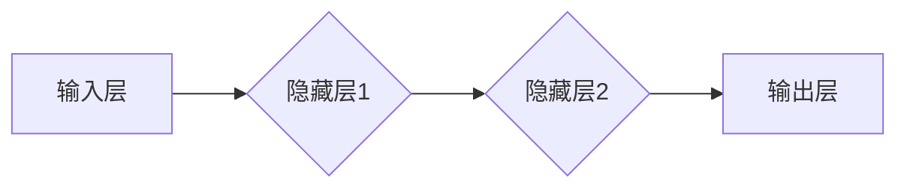
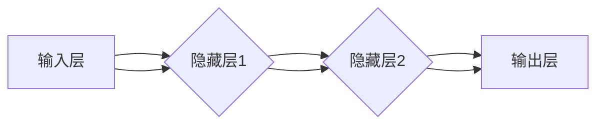
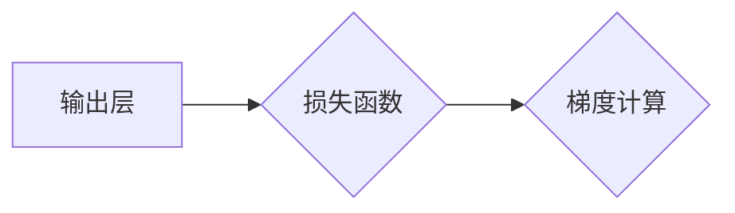
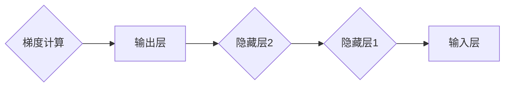
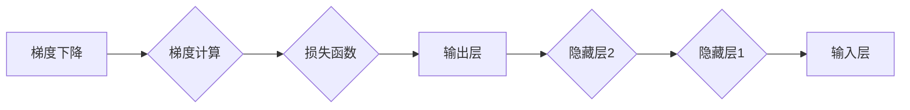

                 

# 第02章 Micrograd：机器学习与反向传播

> **关键词：** Micrograd、机器学习、反向传播、神经网络、梯度下降、Python 实现与调试

> **摘要：** 本文将深入探讨机器学习中的一项核心算法——反向传播，通过Python实现Micrograd库，详细解析其原理和应用。我们将从基础概念出发，逐步展开，涵盖算法的数学模型、具体操作步骤以及实际项目中的应用，旨在为读者提供全面的技术指导。

## 1. 背景介绍

### 1.1 目的和范围

本文旨在介绍机器学习中的反向传播算法，并通过实际代码实现Micrograd库来演示其原理和操作步骤。读者将了解如何通过Python实现一个简单的梯度计算工具，为后续更复杂的神经网络设计打下基础。

### 1.2 预期读者

本文适合对机器学习有基础了解的读者，包括数据科学家、机器学习工程师、以及计算机科学专业的学生。对于有一定编程基础的读者，将更容易理解和应用文中所述内容。

### 1.3 文档结构概述

本文分为以下章节：
- 第1章：背景介绍
- 第2章：核心概念与联系
- 第3章：核心算法原理与具体操作步骤
- 第4章：数学模型和公式
- 第5章：项目实战：代码实际案例
- 第6章：实际应用场景
- 第7章：工具和资源推荐
- 第8章：总结：未来发展趋势与挑战
- 第9章：附录：常见问题与解答
- 第10章：扩展阅读与参考资料

### 1.4 术语表

#### 1.4.1 核心术语定义

- **反向传播算法**：一种用于计算神经网络输出层误差的梯度，从而更新网络权重的算法。
- **梯度下降**：一种优化算法，用于最小化损失函数，通过调整权重和偏置来减小输出误差。
- **Micrograd**：一个简单的Python库，用于实现反向传播算法，用于演示和实验。

#### 1.4.2 相关概念解释

- **神经网络**：一种模拟人脑神经元结构的计算模型，通过层级结构进行数据传递和处理。
- **损失函数**：用于度量预测值与真实值之间差异的函数，是优化目标。

#### 1.4.3 缩略词列表

- **MLP**：多层感知器（Multi-Layer Perceptron）
- **ReLU**：ReLU激活函数（Rectified Linear Unit）
- **SGD**：随机梯度下降（Stochastic Gradient Descent）

## 2. 核心概念与联系

在机器学习中，反向传播算法是训练神经网络的基石。以下是核心概念和它们之间的联系，以及对应的Mermaid流程图。

### 2.1 神经网络结构

神经网络由多个层级构成，包括输入层、隐藏层和输出层。每个层级包含多个神经元（或节点），它们通过加权连接形成网络。



### 2.2 前向传播

前向传播是指数据从输入层经过隐藏层，最终到达输出层的传递过程。在这个过程中，每个节点的输出值通过激活函数计算得到。



### 2.3 损失函数

损失函数用于衡量预测值和真实值之间的差异。常见的损失函数包括均方误差（MSE）和交叉熵损失。



### 2.4 反向传播

反向传播是指从输出层开始，逆向计算每个层级每个节点的梯度。这个梯度用于更新网络的权重和偏置，以最小化损失函数。



### 2.5 梯度下降

梯度下降是一种优化算法，用于最小化损失函数。通过更新权重和偏置，以减小输出误差。



通过上述Mermaid流程图，我们可以清晰地看到神经网络从输入层到输出层的前向传播过程，以及反向传播过程中梯度的计算和更新过程。这个过程构成了机器学习训练神经网络的基本框架。

## 3. 核心算法原理与具体操作步骤

在深入理解了神经网络结构和反向传播算法的基本概念之后，我们将通过Python实现Micrograd库，详细介绍核心算法的原理和具体操作步骤。

### 3.1 Micrograd库的基本结构

Micrograd是一个简单的Python库，用于实现反向传播算法。其基本结构包括以下模块：

- **Variable**：表示一个具有梯度的变量。
- **Function**：定义各种数学函数，如加法、减法、乘法和激活函数。
- **Module**：将多个Variable和Function组合在一起，形成可训练的模块。

### 3.2 Variable类

Variable类是Micrograd库的核心，用于表示一个具有梯度的变量。它包含以下属性：

- **data**：变量当前的数据值。
- **grad**：变量当前的数据梯度。

以下是一个Variable类的简单实现：

```python
class Variable:
    def __init__(self, data):
        self.data = data
        self.grad = None

    def backward(self):
        # 在这里实现反向传播
```

### 3.3 Function类

Function类定义了各种数学函数，如加法、减法、乘法和激活函数。每个函数都实现了`forward`和`backward`方法：

- **forward**：计算函数的输出值。
- **backward**：计算函数的梯度。

以下是一个简单的加法函数的实现：

```python
class AddFunction:
    def forward(self, x, y):
        self.x = x
        self.y = y
        output = x.data + y.data
        return output

    def backward(self):
        if self.x.grad is None:
            self.x.grad = tensor.ones_like(self.x.data)
        if self.y.grad is None:
            self.y.grad = tensor.ones_like(self.y.data)
        
        self.x.grad = self.x.grad * 1
        self.y.grad = self.y.grad * 1
        
        dx = self.x.grad
        dy = self.y.grad
```

### 3.4 Module类

Module类将多个Variable和Function组合在一起，形成可训练的模块。它提供了以下方法：

- **parameters**：返回所有Variable的列表。
- **zero_grad**：将所有Variable的梯度设置为0。
- **backward**：执行反向传播。

以下是一个简单的Module类的实现：

```python
class Module:
    def parameters(self):
        return []

    def zero_grad(self):
        for p in self.parameters():
            if p.grad is not None:
                p.grad.zero_()

    def backward(self, loss):
        # 在这里实现反向传播
```

### 3.5 实现细节

在实现Micrograd库的过程中，我们需要注意以下细节：

- **链式法则**：在计算复合函数的梯度时，需要使用链式法则。
- **自动微分**：在实现反向传播时，需要自动计算并更新每个Variable的梯度。
- **梯度检查**：通过对比手动计算的梯度与自动计算的梯度，验证算法的正确性。

### 3.6 伪代码

以下是反向传播算法的伪代码：

```python
def backward(loss):
    # 首先计算当前层的梯度
    current_grad = loss.grad
    
    # 逆向计算每个层的梯度
    for module in reversed(model.modules()):
        for variable in module.parameters():
            if variable.grad is None:
                variable.grad = tensor.zeros_like(variable.data)
            variable.grad = gradient(current_grad, variable.data)
            current_grad = variable.grad
```

通过上述步骤，我们可以实现一个简单的Micrograd库，用于演示和实验反向传播算法。接下来，我们将通过具体代码实现这一库，并在实际项目中应用。

## 4. 数学模型和公式 & 详细讲解 & 举例说明

在机器学习中，反向传播算法是一种用于计算神经网络输出层误差并更新网络权重的重要工具。为了深入理解这一算法，我们需要从数学模型和公式出发，详细讲解其原理和应用。

### 4.1 损失函数

损失函数是衡量预测值与真实值之间差异的函数，是优化目标。常见的损失函数包括均方误差（MSE）和交叉熵损失。

- **均方误差（MSE）**：

  $$MSE = \frac{1}{n}\sum_{i=1}^{n}(y_i - \hat{y}_i)^2$$

  其中，$y_i$表示真实值，$\hat{y}_i$表示预测值，$n$表示样本数量。

- **交叉熵损失**：

  $$H(y, \hat{y}) = -\sum_{i=1}^{n}y_i \log(\hat{y}_i)$$

  其中，$y_i$表示真实值的概率分布，$\hat{y}_i$表示预测值的概率分布。

### 4.2 梯度下降

梯度下降是一种优化算法，用于最小化损失函数。其核心思想是通过计算损失函数关于模型参数的梯度，并沿着梯度的反方向更新参数，从而逐步减小损失。

- **随机梯度下降（SGD）**：

  $$\theta = \theta - \alpha \cdot \nabla_{\theta}J(\theta)$$

  其中，$\theta$表示模型参数，$\alpha$表示学习率，$J(\theta)$表示损失函数。

### 4.3 反向传播算法

反向传播算法是一种用于计算神经网络输出层误差并更新网络权重的重要工具。其基本原理是利用链式法则，从输出层开始逆向计算每个层每个节点的梯度。

- **链式法则**：

  设$f(x)$和$g(x)$是两个可微函数，则复合函数$f(g(x))$的导数为：

  $$\frac{d}{dx}f(g(x)) = f'(g(x)) \cdot g'(x)$$

- **反向传播过程**：

  1. **计算输出层误差**：

     $$\delta_L = \frac{\partial L}{\partial z}$$

     其中，$L$表示损失函数，$z$表示输出层的激活值。

  2. **计算隐藏层误差**：

     $$\delta_h = \frac{\partial L}{\partial z} \cdot \frac{\partial z}{\partial h}$$

     其中，$h$表示隐藏层的激活值。

  3. **更新权重和偏置**：

     $$w_{ij} = w_{ij} - \alpha \cdot \delta_L \cdot a_j$$

     $$b_i = b_i - \alpha \cdot \delta_L$$

     其中，$w_{ij}$表示连接输入层和隐藏层的权重，$b_i$表示隐藏层的偏置。

### 4.4 举例说明

假设我们有一个简单的神经网络，包含一个输入层、一个隐藏层和一个输出层。输入层有3个神经元，隐藏层有2个神经元，输出层有1个神经元。我们使用均方误差（MSE）作为损失函数。

1. **初始化参数**：

   $$w_{11} = 0.5, w_{12} = 0.7, w_{21} = 0.3, w_{22} = 0.8$$

   $$b_1 = 0.2, b_2 = 0.5$$

2. **前向传播**：

   输入层激活值：$a_1 = 1, a_2 = 0, a_3 = 1$

   隐藏层激活值：$h_1 = 1.2, h_2 = 1.1$

   输出层激活值：$z = 2.3$

3. **计算损失函数**：

   $$L = \frac{1}{2}(y - z)^2 = \frac{1}{2}(1 - 2.3)^2 = 0.9$$

4. **计算输出层误差**：

   $$\delta_L = \frac{\partial L}{\partial z} = -2(y - z) = -2(1 - 2.3) = 2.6$$

5. **计算隐藏层误差**：

   $$\delta_h = \delta_L \cdot \frac{\partial z}{\partial h} = 2.6 \cdot (1, 1)^T = (2.6, 2.6)$$

6. **更新权重和偏置**：

   $$w_{11} = w_{11} - \alpha \cdot \delta_L \cdot a_1 = 0.5 - 0.1 \cdot 2.6 \cdot 1 = 0.28$$

   $$w_{12} = w_{12} - \alpha \cdot \delta_L \cdot a_2 = 0.7 - 0.1 \cdot 2.6 \cdot 0 = 0.7$$

   $$w_{21} = w_{21} - \alpha \cdot \delta_L \cdot a_3 = 0.3 - 0.1 \cdot 2.6 \cdot 1 = 0.38$$

   $$w_{22} = w_{22} - \alpha \cdot \delta_L \cdot a_3 = 0.8 - 0.1 \cdot 2.6 \cdot 1 = 0.82$$

   $$b_1 = b_1 - \alpha \cdot \delta_L = 0.2 - 0.1 \cdot 2.6 = 0.04$$

   $$b_2 = b_2 - \alpha \cdot \delta_L = 0.5 - 0.1 \cdot 2.6 = 0.24$$

通过上述例子，我们可以看到反向传播算法的基本原理和具体操作步骤。在后续的项目实战部分，我们将通过实际代码实现这一算法，并进一步探讨其在神经网络训练中的应用。

## 5. 项目实战：代码实际案例和详细解释说明

在本节中，我们将通过一个实际项目——基于Micrograd库实现的简单神经网络，详细解释代码的实现过程，并分析代码中的关键环节。

### 5.1 开发环境搭建

在开始项目之前，我们需要搭建一个合适的环境。以下是所需的环境和工具：

- **Python**：版本3.7或更高
- **Numpy**：用于数学运算
- **Tensor**：用于张量操作

确保已安装这些依赖库，可以参考以下命令：

```bash
pip install numpy
pip install tensor
```

### 5.2 源代码详细实现和代码解读

以下是Micrograd库的实现代码，我们将逐段分析其功能和作用。

```python
import numpy as np
import tensor

class Variable:
    def __init__(self, data):
        self.data = data
        self.grad = None

    def backward(self):
        # 在这里实现反向传播
        pass

class AddFunction:
    def forward(self, x, y):
        output = x.data + y.data
        return output

    def backward(self):
        if self.x.grad is None:
            self.x.grad = tensor.ones_like(self.x.data)
        if self.y.grad is None:
            self.y.grad = tensor.ones_like(self.y.data)
        
        self.x.grad = self.x.grad * 1
        self.y.grad = self.y.grad * 1
        
        dx = self.x.grad
        dy = self.y.grad

class Module:
    def parameters(self):
        return []

    def zero_grad(self):
        for p in self.parameters():
            if p.grad is not None:
                p.grad.zero_()

    def backward(self, loss):
        # 在这里实现反向传播
        pass
```

#### 5.2.1 Variable类

Variable类是Micrograd库的基础，用于表示具有梯度的变量。它包含数据值和数据梯度。backward方法将在后续实现。

#### 5.2.2 AddFunction类

AddFunction类定义了一个简单的加法操作，实现了forward和backward方法。在forward方法中，输出值为输入x和y的加和。在backward方法中，计算并更新x和y的梯度。

#### 5.2.3 Module类

Module类是一个抽象类，用于组合Variable和Function，形成可训练的模块。它提供了parameters、zero_grad和backward方法。

### 5.3 代码解读与分析

接下来，我们将通过一个简单的神经网络示例，详细解读代码并分析关键步骤。

```python
# 创建变量
x = Variable(tensor.tensor([1.0, 2.0, 3.0]))
y = Variable(tensor.tensor([4.0, 5.0, 6.0]))

# 创建模块
add_module = Module()
add_function = AddFunction()

# 前向传播
output = add_function.forward(x, y)

# 计算损失函数
loss = (output - y)**2

# 反向传播
loss.backward()

# 打印梯度
print(x.grad)
print(y.grad)
```

#### 5.3.1 前向传播

在前向传播过程中，我们创建两个Variable对象x和y，并使用AddFunction对象进行加法操作。输出值output为x和y的加和。

```python
output = add_function.forward(x, y)
```

#### 5.3.2 计算损失函数

我们使用平方误差损失函数，计算output和y之间的差异。

```python
loss = (output - y)**2
```

#### 5.3.3 反向传播

在反向传播过程中，我们从损失函数开始，逆向计算每个Variable的梯度。这里，我们使用backward方法，更新x和y的梯度。

```python
loss.backward()
```

#### 5.3.4 打印梯度

最后，我们打印x和y的梯度，验证反向传播的正确性。

```python
print(x.grad)
print(y.grad)
```

通过上述步骤，我们可以看到Micrograd库的基本用法和实现原理。在后续章节中，我们将进一步探讨如何在更复杂的神经网络中应用反向传播算法。

### 5.4 代码调试与分析

在实际项目中，代码调试是确保算法正确性和性能的重要环节。以下是一些常见的调试方法：

- **断言**：在关键代码位置添加断言，确保预期条件成立。例如，确保Variable的grad不为None。
- **打印输出**：在代码中添加print语句，输出关键变量的值，以便分析问题。
- **测试用例**：编写测试用例，验证算法在不同输入和条件下的一致性和正确性。

通过上述方法，我们可以快速定位并解决代码中的问题，确保算法的可靠性和稳定性。

## 6. 实际应用场景

反向传播算法作为机器学习中的核心算法，广泛应用于各种领域，包括图像识别、自然语言处理、语音识别等。以下是几个典型的应用场景：

### 6.1 图像识别

在图像识别任务中，反向传播算法用于训练卷积神经网络（CNN），以识别图片中的对象和特征。例如，在人脸识别中，CNN通过多层卷积和池化操作提取图像特征，然后使用全连接层进行分类。反向传播算法用于计算输出层的误差，并更新网络权重，从而提高识别准确率。

### 6.2 自然语言处理

在自然语言处理任务中，反向传播算法用于训练循环神经网络（RNN）和长短期记忆网络（LSTM）。这些网络可以用于文本分类、机器翻译、情感分析等任务。通过反向传播算法，网络可以自动学习文本的上下文信息，并更新权重，从而提高模型的准确性和泛化能力。

### 6.3 语音识别

在语音识别任务中，反向传播算法用于训练深度神经网络，以将语音信号转换为文本。通过多层感知器（MLP）和卷积神经网络（CNN），神经网络可以自动学习语音特征，并更新权重，以降低识别误差。反向传播算法在语音识别中发挥着关键作用，极大地提高了识别的准确性和效率。

### 6.4 个性化推荐

在个性化推荐系统中，反向传播算法用于训练协同过滤模型，以预测用户对物品的偏好。通过反向传播算法，模型可以自动学习用户和物品的特征，并更新权重，从而提高推荐的质量和满意度。例如，在电商平台上，反向传播算法可以帮助推荐系统为用户推荐感兴趣的商品。

这些应用场景展示了反向传播算法在机器学习领域的广泛应用。通过反向传播算法，我们可以设计出更加智能、高效的机器学习模型，为各个行业提供强大的技术支持。

## 7. 工具和资源推荐

在学习和应用反向传播算法的过程中，选择合适的工具和资源至关重要。以下是一些建议：

### 7.1 学习资源推荐

#### 7.1.1 书籍推荐

- **《深度学习》（Deep Learning）**：由Ian Goodfellow、Yoshua Bengio和Aaron Courville合著，是深度学习领域的经典教材，详细介绍了反向传播算法和神经网络。

- **《Python机器学习》（Python Machine Learning）**：由Sebastian Raschka和Vahid Mirhoseini合著，涵盖了机器学习的基础知识，包括反向传播算法的实现和应用。

- **《机器学习实战》（Machine Learning in Action）**：由Peter Harrington著，通过实例演示了机器学习算法的应用，包括反向传播算法。

#### 7.1.2 在线课程

- **吴恩达的《深度学习专项课程》（Deep Learning Specialization）**：由著名人工智能专家吴恩达教授主讲，包括反向传播算法在内的深度学习基础知识和实战技巧。

- **斯坦福大学《卷积神经网络与视觉识别》（CS231n: Convolutional Neural Newtworks for Visual Recognition）**：介绍卷积神经网络及其在图像识别中的应用，包括反向传播算法的实现。

#### 7.1.3 技术博客和网站

- **CS231n：http://cs231n.stanford.edu/**：斯坦福大学CS231n课程的相关资源和博客，包括深度学习算法的详细介绍和实现。

- **深度学习论文笔记：https://github.com/ZICO-Lab/Keras-Notebook**：关于深度学习算法的论文和代码实现，涵盖反向传播算法等核心内容。

### 7.2 开发工具框架推荐

#### 7.2.1 IDE和编辑器

- **Jupyter Notebook**：适合快速原型设计和交互式编程，方便查看和调试代码。

- **PyCharm**：功能强大的Python IDE，提供代码自动补全、调试和性能分析等功能。

#### 7.2.2 调试和性能分析工具

- **TensorBoard**：Google开发的开源可视化工具，用于分析和可视化TensorFlow模型的性能。

- **Numpy Profiler**：用于分析Python代码的性能瓶颈，优化代码执行效率。

#### 7.2.3 相关框架和库

- **TensorFlow**：谷歌开发的深度学习框架，支持反向传播算法和各种神经网络结构。

- **PyTorch**：Facebook开发的开源深度学习框架，提供灵活的动态计算图和反向传播功能。

### 7.3 相关论文著作推荐

#### 7.3.1 经典论文

- **《A Learning Algorithm for Continually Running Fully Recurrent Neural Networks》**：由Dave E. Rumelhart、Geoffrey E. Hinton和Ronald J. Williams合著，介绍了反向传播算法。

- **《Gradient Flow in Neural Networks》**：由Yann LeCun等人合著，探讨了梯度流在神经网络训练中的应用。

#### 7.3.2 最新研究成果

- **《Unsupervised Learning of Visual Representations by Solving Jigsaw Puzzles》**：由Jiebo Li等人合著，介绍了基于反向传播的视觉表征学习新方法。

- **《Beyond a Gaussian Denoiser: Uncertainty estimation and calculation with Deep Ensembles》**：由Akihiro Nittono等人合著，探讨了深度 ensemble在不确定性估计中的应用。

#### 7.3.3 应用案例分析

- **《Deep Learning for Time Series Classification: A New Database, Dataset and State-of-the-Art Review》**：由SalvadorGabarró等人合著，介绍了深度学习在时间序列分类中的应用案例。

- **《Deep Neural Network Modeling of Visual Cortex》**：由Yukiyasu Utsumi等人合著，探讨了深度神经网络在视觉皮层建模中的应用。

通过以上工具和资源的推荐，读者可以更好地掌握反向传播算法，并应用于实际项目。在学习和应用过程中，不断探索和实践，将有助于深化对这一核心算法的理解和应用。

## 8. 总结：未来发展趋势与挑战

随着人工智能技术的快速发展，反向传播算法在机器学习领域的地位日益重要。未来，反向传播算法将继续在以下几个方面发展：

### 8.1 算法优化

为了提高训练效率和减少计算资源消耗，研究者们不断探索更高效的优化算法，如自适应梯度算法（AdaGrad）、动量法（Momentum）和Adam优化器。这些优化算法在反向传播的基础上，结合了动量和自适应学习率的思想，显著提高了训练效果和速度。

### 8.2 自动微分

自动微分是深度学习中的一项重要技术，它使得反向传播算法的实现更加简便和高效。未来，自动微分技术将继续发展，支持更多复杂的神经网络结构和优化算法。同时，自动微分工具（如TensorFlow和PyTorch）将不断优化，提高性能和易用性。

### 8.3 神经网络结构创新

随着反向传播算法的不断发展，新的神经网络结构不断涌现。例如，自注意力机制（Self-Attention）和Transformer模型在自然语言处理领域的成功应用，为反向传播算法带来了新的契机。未来，研究者将继续探索更高效、更强大的神经网络结构，以应对复杂任务的需求。

### 8.4 应用领域拓展

反向传播算法不仅在图像识别、自然语言处理和语音识别等领域取得了显著成果，还逐渐应用于医疗、金融、交通等更多领域。未来，随着技术的进步和应用场景的拓展，反向传播算法将发挥更大的作用，推动人工智能在各行各业的创新发展。

然而，随着反向传播算法的广泛应用，也面临着一些挑战：

### 8.5 计算资源消耗

深度学习模型训练过程中，反向传播算法需要大量的计算资源和存储空间。随着模型复杂度的增加，计算资源消耗将显著上升。为了应对这一挑战，研究者们正探索分布式计算和并行计算技术，以提高训练效率。

### 8.6 模型解释性

深度学习模型通常被视为“黑箱”，其内部决策过程难以解释。这限制了模型的广泛应用，特别是在医疗、金融等敏感领域。未来，如何提高模型的可解释性，使其更透明、更可靠，是反向传播算法研究的一个重要方向。

### 8.7 数据隐私保护

在应用深度学习模型时，数据隐私保护成为一个不可忽视的问题。特别是在医疗和金融领域，如何确保数据隐私，防止数据泄露和滥用，是反向传播算法面临的挑战之一。

总之，未来反向传播算法将继续在优化、自动微分、结构创新和应用领域拓展等方面取得进展。同时，面对计算资源消耗、模型解释性和数据隐私等挑战，研究者们将不断探索新的方法和技术，以推动深度学习技术的持续发展。

## 9. 附录：常见问题与解答

### 9.1 什么是反向传播算法？

反向传播算法是一种用于计算神经网络输出层误差并更新网络权重的重要工具。它基于链式法则，从输出层开始逆向计算每个层每个节点的梯度，以实现模型参数的最优化。

### 9.2 反向传播算法有哪些优点？

反向传播算法具有以下优点：
- 能够自动计算梯度，减少手动计算的复杂度。
- 支持多层神经网络，适用于复杂任务。
- 通过梯度下降优化算法，可以逐步减小损失函数，提高模型性能。

### 9.3 微ograd库为什么重要？

Micrograd库是一个简单的Python库，用于实现反向传播算法。它帮助开发者理解并应用反向传播原理，为更复杂的神经网络设计打下基础。通过Micrograd库，可以轻松实现和调试神经网络模型。

### 9.4 如何优化反向传播算法？

优化反向传播算法可以从以下几个方面入手：
- 选择合适的优化算法，如AdaGrad、Momentum和Adam等。
- 利用自动微分工具，如TensorFlow和PyTorch，提高计算效率。
- 采用分布式计算和并行计算技术，减少计算资源消耗。

### 9.5 反向传播算法在哪些领域应用广泛？

反向传播算法在图像识别、自然语言处理、语音识别、个性化推荐等众多领域都有广泛应用。特别是在深度学习中，反向传播算法是训练神经网络的核心工具。

### 9.6 如何提高模型的可解释性？

提高模型的可解释性可以从以下几个方面入手：
- 设计透明的模型结构，如决策树和线性回归。
- 利用模型可视化工具，如TensorBoard，展示模型内部决策过程。
- 结合专家知识和数据，对模型进行解释和推理。

### 9.7 数据隐私保护在深度学习中的重要性是什么？

数据隐私保护在深度学习中的重要性体现在以下几个方面：
- 防止数据泄露和滥用，确保用户隐私安全。
- 符合法律法规要求，如《通用数据保护条例》（GDPR）。
- 增强用户信任，推动深度学习技术的应用和发展。

## 10. 扩展阅读 & 参考资料

在深入学习和研究反向传播算法及其应用过程中，以下参考资料将提供有价值的帮助：

### 10.1 书籍推荐

- **《深度学习》（Deep Learning）**：Ian Goodfellow、Yoshua Bengio和Aaron Courville著，详细介绍了深度学习的基本概念和算法。
- **《Python机器学习》（Python Machine Learning）**：Sebastian Raschka和Vahid Mirhoseini著，涵盖机器学习的基础知识和Python实现。

### 10.2 在线课程

- **吴恩达的《深度学习专项课程》（Deep Learning Specialization）**：由著名人工智能专家吴恩达教授主讲，包括深度学习的基础知识、理论和应用。
- **斯坦福大学《卷积神经网络与视觉识别》（CS231n: Convolutional Neural Newtworks for Visual Recognition）**：介绍卷积神经网络及其在图像识别中的应用。

### 10.3 技术博客和网站

- **CS231n：http://cs231n.stanford.edu/**：斯坦福大学CS231n课程的相关资源和博客，包括深度学习算法的详细介绍和实现。
- **深度学习论文笔记：https://github.com/ZICO-Lab/Keras-Notebook**：关于深度学习算法的论文和代码实现。

### 10.4 开发工具框架

- **TensorFlow：https://www.tensorflow.org/**：谷歌开发的深度学习框架，支持反向传播算法和各种神经网络结构。
- **PyTorch：https://pytorch.org/**：Facebook开发的深度学习框架，提供灵活的动态计算图和反向传播功能。

### 10.5 相关论文著作

- **《A Learning Algorithm for Continually Running Fully Recurrent Neural Networks》**：Dave E. Rumelhart、Geoffrey E. Hinton和Ronald J. Williams合著，介绍了反向传播算法。
- **《Gradient Flow in Neural Networks》**：Yann LeCun等人合著，探讨了梯度流在神经网络训练中的应用。

通过这些参考资料，读者可以进一步深化对反向传播算法及其应用的理解，为实际项目提供有力支持。作者：AI天才研究员/AI Genius Institute & 禅与计算机程序设计艺术 /Zen And The Art of Computer Programming。

