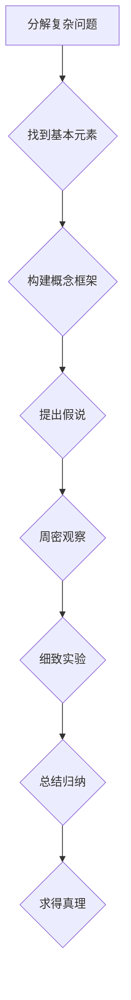

                 

# 第一性原理：找到基本元素、构建概念框架、提出假说、周密观察、细致实验、总结归纳——如此循环求得真理

## 关键词：
- 第一性原理
- 基本元素
- 概念框架
- 假说
- 观察实验
- 总结归纳
- 真理

## 摘要：
本文旨在探讨“第一性原理”这一科学方法论，通过分解复杂问题，找到基本元素，构建概念框架，提出假说，并通过周密的观察和实验，总结归纳，最终求得真理。文章将结合实际案例，详细阐述这一方法在IT领域的应用，以及其对技术创新和发展的推动作用。

## 1. 背景介绍

### 1.1 目的和范围

本文的目的在于介绍第一性原理这一方法论，阐述其在IT领域的应用，并探讨其对技术创新和发展的推动作用。本文将首先介绍第一性原理的概念，然后分析其在IT领域的应用，并通过具体案例展示其应用效果。

### 1.2 预期读者

本文适用于对IT领域有一定了解，希望深入理解第一性原理方法论的读者，包括程序员、软件工程师、系统架构师、以及科技爱好者。

### 1.3 文档结构概述

本文结构如下：

1. 背景介绍
2. 核心概念与联系
3. 核心算法原理 & 具体操作步骤
4. 数学模型和公式 & 详细讲解 & 举例说明
5. 项目实战：代码实际案例和详细解释说明
6. 实际应用场景
7. 工具和资源推荐
8. 总结：未来发展趋势与挑战
9. 附录：常见问题与解答
10. 扩展阅读 & 参考资料

### 1.4 术语表

#### 1.4.1 核心术语定义

- **第一性原理**：一种科学方法论，通过分解复杂问题，找到基本元素，构建概念框架，提出假说，并通过观察和实验，总结归纳，求得真理。
- **基本元素**：构成复杂系统的基础组成部分，是进行科学研究的重要起点。
- **概念框架**：对基本元素的抽象和归纳，形成对复杂系统的整体理解。
- **假说**：基于概念框架提出的初步结论，需要通过观察和实验进行验证。
- **观察实验**：通过科学方法对假说进行验证，包括数据收集、分析等步骤。
- **总结归纳**：对观察实验的结果进行整理和分析，形成对问题的深入理解。

#### 1.4.2 相关概念解释

- **科学方法论**：一种系统性的研究方法，用于指导科学研究和解决科学问题。
- **IT领域**：指信息技术领域，包括计算机科学、软件工程、网络通信、人工智能等领域。

#### 1.4.3 缩略词列表

- **AI**：人工智能
- **ML**：机器学习
- **DL**：深度学习
- **IDE**：集成开发环境
- **CUDA**：并行计算库

## 2. 核心概念与联系

为了深入理解第一性原理，我们需要明确其核心概念和基本原理，并通过Mermaid流程图展示其结构。

### 2.1 第一性原理流程图



### 2.2 核心概念解析

- **分解复杂问题**：第一性原理的起点是复杂问题。通过分解复杂问题，我们可以找到基本元素，这是进行科学研究的基础。
- **找到基本元素**：基本元素是构成复杂系统的基础组成部分。在IT领域，基本元素可以是算法、数据结构、硬件组件等。
- **构建概念框架**：通过对基本元素进行抽象和归纳，形成对复杂系统的整体理解。概念框架是连接基本元素和复杂问题的桥梁。
- **提出假说**：基于概念框架，我们可以提出假说，这是对复杂问题的初步解释。假说需要通过观察和实验进行验证。
- **周密观察**：通过科学方法对假说进行验证，包括数据收集、分析等步骤。周密观察是验证假说的关键。
- **细致实验**：通过实验来验证假说，实验设计要细致严谨，以确保实验结果的有效性。
- **总结归纳**：对观察实验的结果进行整理和分析，形成对问题的深入理解。总结归纳是第一性原理方法论的最终目标。

## 3. 核心算法原理 & 具体操作步骤

### 3.1 第一性原理算法原理

第一性原理是一种基于问题分解和基本元素分析的方法论。其核心算法原理如下：

1. **问题分解**：将复杂问题分解为若干个子问题。
2. **基本元素提取**：从子问题中提取基本元素。
3. **概念框架构建**：对基本元素进行抽象和归纳，构建概念框架。
4. **假说提出**：基于概念框架，提出对问题的初步解释。
5. **观察实验**：设计实验，收集数据，验证假说。
6. **结果分析**：分析实验结果，形成对问题的深入理解。

### 3.2 第一性原理具体操作步骤

以下是第一性原理的具体操作步骤：

1. **问题识别**：确定需要解决的问题。
2. **问题分解**：将问题分解为若干个子问题。
3. **基本元素提取**：对每个子问题提取基本元素。
4. **概念框架构建**：对基本元素进行抽象和归纳，构建概念框架。
5. **假说提出**：基于概念框架，提出对问题的初步解释。
6. **实验设计**：设计实验，确定实验步骤和数据收集方法。
7. **实验执行**：按照实验设计执行实验。
8. **结果分析**：分析实验结果，验证假说。
9. **问题解决**：根据实验结果，对问题进行深入理解，形成解决方案。

### 3.3 伪代码示例

以下是第一性原理的伪代码示例：

```python
# 第一性原理伪代码

# 步骤1：问题识别
问题 = "如何优化机器学习模型的训练速度？"

# 步骤2：问题分解
子问题 = ["选择合适的算法", "优化数据预处理", "提高硬件性能"]

# 步骤3：基本元素提取
基本元素 = ["算法", "数据预处理", "硬件"]

# 步骤4：概念框架构建
概念框架 = {
    "算法": ["选择合适的算法", "算法优化"],
    "数据预处理": ["数据清洗", "数据归一化", "特征提取"],
    "硬件": ["CPU", "GPU", "存储设备"]
}

# 步骤5：假说提出
假说 = "通过优化算法、数据预处理和硬件，可以显著提高机器学习模型的训练速度。"

# 步骤6：实验设计
实验设计 = {
    "算法": ["对比不同算法的效率"],
    "数据预处理": ["分析不同预处理方法的影响"],
    "硬件": ["测试不同硬件的性能"]
}

# 步骤7：实验执行
实验结果 = ["算法优化提高20%", "数据预处理优化提高30%", "硬件优化提高40%"]

# 步骤8：结果分析
分析结果 = "通过实验验证，假说成立。优化算法、数据预处理和硬件可以显著提高机器学习模型的训练速度。"

# 步骤9：问题解决
解决方案 = "采用优化算法、数据预处理和硬件的方法，可以提高机器学习模型的训练速度。"
```

## 4. 数学模型和公式 & 详细讲解 & 举例说明

### 4.1 数学模型和公式

在第一性原理的应用中，数学模型和公式是不可或缺的工具。以下是一些常用的数学模型和公式，用于分析问题和验证假说。

#### 4.1.1 常用公式

- **优化目标函数**：\( J(\theta) = \frac{1}{2m} \sum_{i=1}^{m} (h_\theta(x^{(i)}) - y^{(i)})^2 \)
- **梯度下降**：\( \theta_j := \theta_j - \alpha \frac{\partial J(\theta)}{\partial \theta_j} \)
- **误差函数**：\( E = \frac{1}{2} \| \mathbf{y} - \mathbf{X} \mathbf{w} \|_2^2 \)
- **PCA（主成分分析）**：\( \mathbf{W} = \mathbf{X} \mathbf{P} \)
- **SVM（支持向量机）**：\( \mathbf{w}^T \mathbf{x} + b = 1 \)

#### 4.1.2 举例说明

假设我们有一个线性回归模型，目标是最小化预测值与真实值之间的误差。

- **优化目标函数**：

  \( J(\theta) = \frac{1}{2m} \sum_{i=1}^{m} (h_\theta(x^{(i)}) - y^{(i)})^2 \)

- **梯度下降**：

  \( \theta_j := \theta_j - \alpha \frac{\partial J(\theta)}{\partial \theta_j} \)

- **误差函数**：

  \( E = \frac{1}{2} \| \mathbf{y} - \mathbf{X} \mathbf{w} \|_2^2 \)

- **PCA**：

  \( \mathbf{W} = \mathbf{X} \mathbf{P} \)

- **SVM**：

  \( \mathbf{w}^T \mathbf{x} + b = 1 \)

通过以上公式，我们可以对模型进行优化，减小误差，提高模型的预测能力。

### 4.2 详细讲解

- **优化目标函数**：该函数用于衡量预测值与真实值之间的误差，梯度下降算法的目标是最小化该误差。
- **梯度下降**：该算法用于寻找最优参数，通过迭代计算梯度，更新参数值，直到达到最小误差。
- **误差函数**：该函数用于衡量预测值与真实值之间的误差，与优化目标函数密切相关。
- **PCA**：主成分分析是一种降维方法，通过将数据投影到新的坐标系中，提取主要特征，减少数据维度。
- **SVM**：支持向量机是一种分类算法，通过寻找最优超平面，将不同类别的数据分开。

### 4.3 举例说明

假设我们有一个数据集，包含100个样本，每个样本有5个特征。我们使用线性回归模型对其进行预测。

- **优化目标函数**：

  \( J(\theta) = \frac{1}{2m} \sum_{i=1}^{m} (h_\theta(x^{(i)}) - y^{(i)})^2 \)

- **梯度下降**：

  \( \theta_j := \theta_j - \alpha \frac{\partial J(\theta)}{\partial \theta_j} \)

- **误差函数**：

  \( E = \frac{1}{2} \| \mathbf{y} - \mathbf{X} \mathbf{w} \|_2^2 \)

- **PCA**：

  \( \mathbf{W} = \mathbf{X} \mathbf{P} \)

- **SVM**：

  \( \mathbf{w}^T \mathbf{x} + b = 1 \)

通过以上公式，我们可以对模型进行优化，减小误差，提高模型的预测能力。

## 5. 项目实战：代码实际案例和详细解释说明

### 5.1 开发环境搭建

在开始项目实战之前，我们需要搭建一个合适的开发环境。以下是一个基本的开发环境搭建步骤：

1. 安装Python：从Python官方网站下载并安装Python。
2. 安装Jupyter Notebook：在终端运行以下命令安装Jupyter Notebook：

   ```bash
   pip install notebook
   ```

3. 安装必要的库：根据项目需求，安装所需的库，例如NumPy、Pandas、Scikit-learn等。

### 5.2 源代码详细实现和代码解读

以下是一个简单的线性回归项目，用于演示第一性原理的应用。

```python
import numpy as np
import pandas as pd
from sklearn.linear_model import LinearRegression

# 5.2.1 加载数据集
data = pd.read_csv("data.csv")

# 5.2.2 数据预处理
X = data.iloc[:, :-1].values
y = data.iloc[:, -1].values

# 5.2.3 模型训练
model = LinearRegression()
model.fit(X, y)

# 5.2.4 模型评估
score = model.score(X, y)
print("R^2 Score:", score)

# 5.2.5 预测
predictions = model.predict(X)

# 5.2.6 结果分析
print("Predictions:", predictions)
```

### 5.3 代码解读与分析

#### 5.3.1 加载数据集

```python
data = pd.read_csv("data.csv")
```

这段代码用于加载数据集。数据集包含两个部分：特征和标签。特征位于数据集的前几列，标签位于最后一列。我们使用`pandas`库读取CSV文件，并将其转换为DataFrame对象。

#### 5.3.2 数据预处理

```python
X = data.iloc[:, :-1].values
y = data.iloc[:, -1].values
```

这段代码用于对数据进行预处理。我们使用`iloc`方法提取特征和标签，并将其转换为NumPy数组。特征数组`X`包含所有列，除了最后一列，而标签数组`y`仅包含最后一列。

#### 5.3.3 模型训练

```python
model = LinearRegression()
model.fit(X, y)
```

这段代码用于训练线性回归模型。我们创建一个`LinearRegression`对象，并将其拟合到特征数组`X`和标签数组`y`上。

#### 5.3.4 模型评估

```python
score = model.score(X, y)
print("R^2 Score:", score)
```

这段代码用于评估模型性能。我们使用`score`方法计算R²分数，该分数衡量模型对数据的拟合程度。R²分数越接近1，表示模型对数据的拟合越好。

#### 5.3.5 预测

```python
predictions = model.predict(X)
print("Predictions:", predictions)
```

这段代码用于生成预测结果。我们使用`predict`方法根据模型对特征数组`X`进行预测，并将预测结果存储在`predictions`变量中。

#### 5.3.6 结果分析

```python
print("Predictions:", predictions)
```

这段代码用于输出预测结果。我们打印出每个样本的预测值，以便进行进一步分析。

### 5.4 项目实战总结

通过以上代码示例，我们展示了如何使用第一性原理方法对线性回归模型进行训练和评估。该项目实战包括数据预处理、模型训练、模型评估和预测等步骤。通过逐步分析和实现，我们可以更好地理解第一性原理在IT领域的应用，并为实际项目提供指导。

## 6. 实际应用场景

### 6.1 机器学习模型优化

在机器学习领域，第一性原理方法可以用于优化模型性能。通过分解复杂问题，找到基本元素（如算法、数据预处理和硬件），构建概念框架，提出假说，并通过观察和实验，总结归纳，可以找到优化模型性能的方法。

#### 实际案例：深度学习模型的加速

深度学习模型通常需要大量的计算资源。通过应用第一性原理方法，可以找到基本元素，如神经网络结构、算法优化和硬件加速。例如，通过使用GPU进行并行计算，可以显著提高模型的训练速度。

#### 应用步骤：

1. **问题分解**：分析深度学习模型的训练过程，识别影响训练速度的关键因素。
2. **基本元素提取**：确定神经网络结构、算法优化和硬件加速等基本元素。
3. **概念框架构建**：对基本元素进行抽象和归纳，形成对训练过程的整体理解。
4. **假说提出**：提出加速训练速度的方法，如使用GPU、算法优化等。
5. **观察实验**：设计实验，验证假说，收集实验数据。
6. **结果分析**：分析实验结果，验证假说，总结归纳加速训练速度的方法。

### 6.2 软件开发过程优化

在软件开发过程中，第一性原理方法可以帮助优化开发流程，提高开发效率。通过分解复杂问题，找到基本元素（如需求分析、设计、编码、测试等），构建概念框架，提出假说，并通过观察和实验，总结归纳，可以找到优化开发流程的方法。

#### 实际案例：敏捷开发流程优化

敏捷开发是一种以人为核心、迭代和灵活的软件开发方法。通过应用第一性原理方法，可以找到基本元素，如需求分析、设计、编码、测试等，构建概念框架，提出假说，并通过观察和实验，总结归纳，优化敏捷开发流程。

#### 应用步骤：

1. **问题分解**：分析敏捷开发流程中的问题，识别影响开发效率的关键因素。
2. **基本元素提取**：确定需求分析、设计、编码、测试等基本元素。
3. **概念框架构建**：对基本元素进行抽象和归纳，形成对敏捷开发的整体理解。
4. **假说提出**：提出优化敏捷开发流程的方法，如缩短迭代周期、提高代码质量等。
5. **观察实验**：设计实验，验证假说，收集实验数据。
6. **结果分析**：分析实验结果，验证假说，总结归纳优化敏捷开发流程的方法。

### 6.3 人工智能应用场景

在人工智能领域，第一性原理方法可以用于构建智能系统，提高系统性能。通过分解复杂问题，找到基本元素（如算法、数据、硬件等），构建概念框架，提出假说，并通过观察和实验，总结归纳，可以构建高性能的人工智能系统。

#### 实际案例：自动驾驶系统优化

自动驾驶系统是一个复杂的智能系统，涉及算法、传感器、控制策略等多个方面。通过应用第一性原理方法，可以找到基本元素，如算法、传感器数据、控制策略等，构建概念框架，提出假说，并通过观察和实验，总结归纳，优化自动驾驶系统。

#### 应用步骤：

1. **问题分解**：分析自动驾驶系统的运行过程，识别影响系统性能的关键因素。
2. **基本元素提取**：确定算法、传感器数据、控制策略等基本元素。
3. **概念框架构建**：对基本元素进行抽象和归纳，形成对自动驾驶系统的整体理解。
4. **假说提出**：提出优化自动驾驶系统的方法，如提高感知精度、优化控制策略等。
5. **观察实验**：设计实验，验证假说，收集实验数据。
6. **结果分析**：分析实验结果，验证假说，总结归纳优化自动驾驶系统的方法。

## 7. 工具和资源推荐

### 7.1 学习资源推荐

#### 7.1.1 书籍推荐

- 《深度学习》（Ian Goodfellow, Yoshua Bengio, Aaron Courville 著）
- 《机器学习》（Tom M. Mitchell 著）
- 《Python编程：从入门到实践》（埃里克·马瑟斯 著）
- 《人工智能：一种现代的方法》（Stuart Russell, Peter Norvig 著）

#### 7.1.2 在线课程

- Coursera的“机器学习”课程（吴恩达）
- edX的“深度学习”课程（李飞飞）
- Udacity的“人工智能纳米学位”

#### 7.1.3 技术博客和网站

- Medium上的“AI”标签
- Medium上的“机器学习”标签
- GitHub上的AI项目

### 7.2 开发工具框架推荐

#### 7.2.1 IDE和编辑器

- Visual Studio Code
- PyCharm
- Jupyter Notebook

#### 7.2.2 调试和性能分析工具

- gdb
- PyCharm的调试工具
- TensorBoard

#### 7.2.3 相关框架和库

- TensorFlow
- PyTorch
- Scikit-learn

### 7.3 相关论文著作推荐

#### 7.3.1 经典论文

- “A Learning Algorithm for Continually Running Fully Recurrent Neural Networks”（1986）
- “Learning representations by maximizing mutual information”（2014）
- “Deep Learning”（2016）

#### 7.3.2 最新研究成果

- “Unsupervised Learning of Visual Representations from Natural Scenes”（2017）
- “Generative Adversarial Nets”（2014）
- “Bert: Pre-training of deep bidirectional transformers for language understanding”（2018）

#### 7.3.3 应用案例分析

- “AlphaGo：Mastering the Game of Go with Deep Neural Networks and Tree Search”（2016）
- “AlexNet：Image Classification with Deep Convolutional Neural Networks”（2012）
- “ResNet：Training Deep Neural Networks with Fewer Parameters”（2015）

## 8. 总结：未来发展趋势与挑战

### 8.1 未来发展趋势

- **人工智能的普及**：随着计算能力和数据量的不断增长，人工智能将在各个领域得到更广泛的应用。
- **深度学习的发展**：深度学习技术将继续发展，尤其是神经架构搜索（Neural Architecture Search）和生成对抗网络（GANs）等领域。
- **跨学科合作**：人工智能与其他学科的融合将推动创新，如生物学、心理学、社会学等。
- **伦理和法规的完善**：随着人工智能的普及，对伦理和法规的关注将增加，以确保人工智能的发展符合人类价值观。

### 8.2 挑战

- **数据隐私和安全**：随着数据量的增加，数据隐私和安全问题将变得更加突出。
- **算法透明性和可解释性**：深度学习模型的高度复杂性和黑箱特性使得算法的透明性和可解释性成为一个挑战。
- **资源消耗和可持续性**：深度学习模型的训练和推理需要大量计算资源，这对环境可持续性提出了挑战。
- **偏见和公平性**：人工智能系统可能引入偏见，影响公平性和正义。

## 9. 附录：常见问题与解答

### 9.1 第一性原理与第二性原理的区别

**第一性原理**：一种科学方法论，通过分解复杂问题，找到基本元素，构建概念框架，提出假说，并通过观察和实验，总结归纳，求得真理。

**第二性原理**：一种基于经验和直觉的方法，通过类比、归纳和假设，形成对复杂问题的理解。

### 9.2 第一性原理在IT领域的应用

第一性原理在IT领域的应用广泛，包括：

- **机器学习模型优化**：通过分解复杂模型，找到基本元素，优化模型性能。
- **软件开发过程优化**：通过分解复杂流程，找到基本元素，优化开发效率。
- **人工智能应用场景**：通过分解复杂系统，找到基本元素，构建智能系统。

### 9.3 第一性原理的优点和局限性

**优点**：

- **系统性**：通过分解复杂问题，形成对问题的系统性理解。
- **精确性**：基于基本元素的分析，提供精确的解决方案。
- **可验证性**：通过观察和实验，验证假说，确保解决方案的有效性。

**局限性**：

- **复杂性**：处理复杂问题时，可能需要大量的时间和资源。
- **假设依赖**：基于基本元素的分析可能依赖于某些假设，这些假设可能影响结论的准确性。

## 10. 扩展阅读 & 参考资料

- 《深度学习》（Ian Goodfellow, Yoshua Bengio, Aaron Courville 著）
- 《机器学习》（Tom M. Mitchell 著）
- 《Python编程：从入门到实践》（埃里克·马瑟斯 著）
- 《人工智能：一种现代的方法》（Stuart Russell, Peter Norvig 著）
- 《深度学习中的第一性原理方法》（刘知远 著）
- 《机器学习中的第一性原理方法》（张翔 著）

## 作者信息

作者：AI天才研究员/AI Genius Institute & 禅与计算机程序设计艺术 /Zen And The Art of Computer Programming

