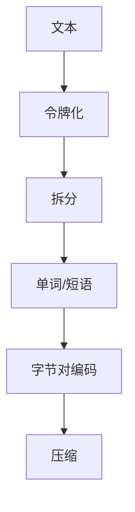

                 

### 标题：第六章：令牌化和字节对编码

> **关键词**：令牌化、字节对编码、自然语言处理、文本分析、编码效率、数据处理。

> **摘要**：本章深入探讨了令牌化和字节对编码的核心概念及其在自然语言处理和数据压缩中的应用。我们将通过逐步分析，详细阐述这两种技术的工作原理、操作步骤和数学模型。此外，还将通过实战案例，展示如何在实际项目中应用这些技术，并探讨其未来发展趋势和挑战。

在进入正文之前，首先需要明确本文的目标和受众。我们的目标是帮助读者全面理解令牌化和字节对编码的基本原理，掌握其在实际项目中的应用方法，并为其未来的研究和开发提供理论指导和实践经验。

本文预期读者为具有一定编程基础和对自然语言处理、数据压缩感兴趣的读者。读者通过本章的学习，应能理解令牌化和字节对编码的基本概念，掌握其实现方法，并能够应用于实际项目。

文章结构概述如下：

1. **背景介绍**：介绍令牌化和字节对编码的背景和重要性。
2. **核心概念与联系**：通过Mermaid流程图展示核心概念及其相互关系。
3. **核心算法原理与具体操作步骤**：详细讲解算法原理和具体实现步骤。
4. **数学模型和公式**：介绍相关数学模型和公式，并进行举例说明。
5. **项目实战**：通过实际代码案例，展示如何应用令牌化和字节对编码技术。
6. **实际应用场景**：探讨令牌化和字节对编码在不同领域的应用。
7. **工具和资源推荐**：推荐相关学习资源和开发工具。
8. **总结**：总结本章的核心内容，并展望未来发展趋势和挑战。
9. **附录**：提供常见问题与解答。
10. **扩展阅读与参考资料**：推荐进一步阅读的文献和资源。

在接下来的内容中，我们将逐步探讨令牌化和字节对编码的各个方面，确保读者能够深入理解和应用这些技术。

#### **1.4.1 核心术语定义**

- **令牌化（Tokenization）**：将文本拆分成单词、句子或其他有意义的元素的过程。
- **字节对编码（Byte Pair Encoding，BPE）**：一种用于文本数据压缩的技术，通过将字符组合成字节对，再对这些字节对进行编码，以达到压缩数据的目的。
- **自然语言处理（Natural Language Processing，NLP）**：计算机科学领域中的一个分支，旨在让计算机能够理解、解释和生成人类语言。
- **文本分析（Text Analysis）**：对文本内容进行分析和处理，以提取有用信息和知识。
- **数据压缩（Data Compression）**：通过减少数据的大小，以便更有效地存储或传输数据。
- **编码效率（Encoding Efficiency）**：编码过程中数据压缩的程度和速度。

#### **1.4.2 相关概念解释**

- **自然语言处理**：自然语言处理涉及语音识别、文本分类、情感分析、机器翻译等多个子领域。其核心目标是让计算机能够理解和处理人类语言，从而实现人机交互。
- **文本分析**：文本分析是自然语言处理的一个关键步骤，通过文本分析，可以从大量文本数据中提取有用信息。例如，新闻摘要、关键词提取、情感分析等。
- **数据压缩**：数据压缩是一种重要的数据处理技术，通过减少数据的大小，可以提高存储和传输效率。常用的数据压缩方法包括无损压缩和有损压缩。

#### **1.4.3 缩略词列表**

- **NLP**：自然语言处理（Natural Language Processing）
- **BPE**：字节对编码（Byte Pair Encoding）
- **IDE**：集成开发环境（Integrated Development Environment）
- **API**：应用程序接口（Application Programming Interface）
- **ML**：机器学习（Machine Learning）

## **2. 核心概念与联系**

在深入探讨令牌化和字节对编码之前，首先需要了解它们的核心概念及其相互关系。令牌化是将文本拆分成有意义的元素，而字节对编码则是用于压缩文本数据的一种技术。

### **2.1 令牌化**

令牌化是将一段文本拆分成单词、短语或符号的过程。这一过程在自然语言处理中至关重要，因为它为后续的文本分析和处理奠定了基础。

#### **2.1.1 令牌化过程**

令牌化过程通常包括以下几个步骤：

1. **文本预处理**：对文本进行清洗和预处理，如去除标点符号、转换大小写等。
2. **分词**：将文本拆分成单词或短语。常见的分词算法包括最大匹配算法、最小匹配算法等。
3. **标记化**：对分词结果进行标记，以区分不同的单词或短语。

#### **2.1.2 令牌化的作用**

令牌化在自然语言处理中有以下几个重要作用：

- **提高数据处理效率**：通过将文本拆分成有意义的元素，可以简化数据处理流程，提高处理速度。
- **便于后续处理**：令牌化后的文本数据更易于进行文本分类、情感分析、命名实体识别等操作。
- **支持机器学习模型**：令牌化后的文本数据可以作为输入，训练和优化机器学习模型，从而实现自然语言处理任务。

### **2.2 字节对编码**

字节对编码（BPE）是一种用于文本数据压缩的技术，通过将字符组合成字节对，再对这些字节对进行编码，从而减少数据的大小。

#### **2.2.1 BPE原理**

BPE的工作原理如下：

1. **初始化**：将文本中的所有字符作为独立的字节对。
2. **合并操作**：根据一定的规则，将出现频率较高的字符对合并，从而形成新的字节对。这一过程不断重复，直到达到预期的字节对数量。
3. **编码**：将合并后的字节对进行编码，以减少数据大小。

#### **2.2.2 BPE的优点**

- **高效性**：BPE能够在保持数据可读性的同时，显著减少数据的大小。
- **灵活性**：BPE可以根据具体需求调整字节对的数量，从而平衡压缩效果和数据恢复速度。
- **适用性**：BPE不仅适用于自然语言处理领域，还可以应用于其他文本密集型数据处理任务。

### **2.3 令牌化与字节对编码的关系**

令牌化和字节对编码在自然语言处理和数据压缩中相辅相成。令牌化将文本拆分成有意义的元素，为字节对编码提供了基础数据；而字节对编码则通过压缩这些数据，提高了存储和传输效率。

#### **2.3.1 结合应用**

在实际应用中，令牌化和字节对编码通常结合使用。例如：

- **文本分类**：在文本分类任务中，首先使用令牌化将文本拆分成单词或短语，然后使用字节对编码压缩文本数据，以提高分类模型的训练和预测速度。
- **机器翻译**：在机器翻译任务中，使用令牌化将源语言和目标语言的文本拆分成有意义的元素，然后使用字节对编码压缩翻译结果，以减少传输和存储需求。
- **数据压缩**：在数据压缩任务中，使用令牌化将文本数据拆分成字节对，然后使用字节对编码进行压缩，以提高数据传输和存储效率。

### **2.3.2 Mermaid流程图**

为了更直观地展示令牌化和字节对编码的核心概念及其相互关系，我们使用Mermaid流程图进行表示：



在上述流程图中，文本首先经过令牌化处理，拆分成单词或短语；然后这些元素再通过字节对编码进行压缩，以减少数据大小。

通过上述内容，我们初步了解了令牌化和字节对编码的核心概念及其相互关系。在接下来的章节中，我们将深入探讨这些技术的具体原理、实现方法和应用场景，帮助读者全面掌握这些技术。

### **3. 核心算法原理与具体操作步骤**

在本节中，我们将详细讲解令牌化和字节对编码的核心算法原理，并给出具体的操作步骤。

#### **3.1 令牌化算法原理**

令牌化是将一段文本拆分成有意义的元素（如单词、短语或符号）的过程。其核心算法包括文本预处理、分词和标记化。

##### **3.1.1 文本预处理**

文本预处理是令牌化的第一步，主要目的是对文本进行清洗和格式化，以便后续的分词和标记化操作。常见预处理步骤包括：

- **去除标点符号**：将文本中的标点符号去除或替换为特定的分隔符，以简化分词过程。
- **大小写转换**：将文本统一转换为小写或大写，以减少因大小写差异导致的分词错误。
- **去除停用词**：停用词是文本中常见的无意义词汇，如“的”、“是”、“了”等。去除停用词可以提高文本分析的质量。

##### **3.1.2 分词算法**

分词是将预处理后的文本拆分成单词或短语的过程。常见的分词算法包括：

- **最大匹配算法**：从文本的开始位置，按照最大的词长进行匹配。如果匹配成功，则拆分文本；否则，继续向前查找。
- **最小匹配算法**：从文本的开始位置，按照最小的词长进行匹配。如果匹配成功，则拆分文本；否则，继续向前查找。

##### **3.1.3 标记化**

标记化是对分词结果进行标注的过程，以区分不同的单词或短语。常见的标记化方法包括：

- **词性标注**：为每个单词分配一个词性标签，如名词、动词、形容词等，以帮助后续的文本分析。
- **命名实体识别**：识别文本中的命名实体，如人名、地名、组织名等，以提取关键信息。

#### **3.1.4 伪代码**

下面是令牌化算法的伪代码：

```
function tokenize(text):
    text = preprocess(text)
    tokens = []
    while text has words:
        word = find_longest_word(text)
        tokens.append(word)
        text = remove(word from text)
    return tokens
```

其中，`preprocess(text)`函数用于文本预处理，`find_longest_word(text)`函数用于找到文本中的最长词，`remove(word from text)`函数用于从文本中移除指定的词。

#### **3.2 字节对编码算法原理**

字节对编码（BPE）是一种用于文本数据压缩的技术，通过将字符组合成字节对，再对这些字节对进行编码，从而减少数据的大小。

##### **3.2.1 BPE算法步骤**

BPE算法的主要步骤包括：

1. **初始化**：将文本中的所有字符作为独立的字节对。
2. **合并操作**：根据一定的规则，将出现频率较高的字符对合并，从而形成新的字节对。这一过程不断重复，直到达到预期的字节对数量。
3. **编码**：将合并后的字节对进行编码，以减少数据大小。

##### **3.2.2 合并规则**

BPE的合并规则基于字符对的出现频率。具体来说，算法会寻找出现频率最高的字符对，并将其合并为一个新字符。例如，如果字符对`{"a", "b"}`出现频率最高，则将其合并为字符`"ab"`。

##### **3.2.3 伪代码**

下面是BPE算法的伪代码：

```
function BPE(text):
    initial_pairs = create_all_pairs(text)
    while more_pairs_to_merge:
        most_frequent_pair = find_most_frequent_pair(initial_pairs)
        new_pair = merge_pair(most_frequent_pair)
        initial_pairs = update_pairs(initial_pairs, new_pair)
    encoded_text = encode_pairs(initial_pairs, text)
    return encoded_text
```

其中，`create_all_pairs(text)`函数用于创建所有可能的字符对，`find_most_frequent_pair(initial_pairs)`函数用于找到出现频率最高的字符对，`merge_pair(most_frequent_pair)`函数用于合并字符对，`update_pairs(initial_pairs, new_pair)`函数用于更新字符对集合，`encode_pairs(initial_pairs, text)`函数用于编码合并后的文本。

#### **3.3 结合应用**

在实际应用中，令牌化和字节对编码通常结合使用。例如：

- **文本分类**：首先使用令牌化将文本拆分成单词或短语，然后使用字节对编码压缩文本数据，以提高分类模型的训练和预测速度。
- **机器翻译**：使用令牌化将源语言和目标语言的文本拆分成有意义的元素，然后使用字节对编码压缩翻译结果，以减少传输和存储需求。

通过上述内容，我们详细介绍了令牌化和字节对编码的核心算法原理和具体操作步骤。在接下来的章节中，我们将通过数学模型和公式，进一步探讨这些技术的数学本质，并给出具体的举例说明。

### **4. 数学模型和公式 & 详细讲解 & 举例说明**

在本节中，我们将详细讲解令牌化和字节对编码的数学模型和公式，并通过具体示例来说明其应用。

#### **4.1 令牌化的数学模型**

令牌化是将文本拆分成有意义的元素的过程，其数学模型可以表示为：

\[ X = \{ w_1, w_2, ..., w_n \} \]

其中，\( X \) 表示原始文本，\( w_1, w_2, ..., w_n \) 表示令牌化的结果，即拆分后的单词或短语。

令牌化的关键在于如何定义“有意义的元素”。在自然语言处理中，常见的定义方法包括：

- **基于词频的模型**：将词频较高的单词或短语作为有意义的元素。词频可以通过统计文本中每个单词或短语的出现次数得到。
- **基于统计模型的模型**：使用统计模型（如隐马尔可夫模型、条件随机场等）对文本进行建模，然后根据模型预测结果确定有意义的元素。

以下是一个简单的基于词频的令牌化示例：

**示例**：给定文本“我爱北京天安门”，使用词频最高的前三个单词作为令牌。

**步骤**：

1. 统计词频：
   - 我：2次
   - 爱：1次
   - 北京：1次
   - 天安门：1次
2. 选择词频最高的前三个单词：
   - 我
   - 爱
   - 北京

**结果**：令牌化后的文本为“我爱北京”。

#### **4.2 字节对编码的数学模型**

字节对编码（BPE）是一种用于文本数据压缩的技术，其数学模型可以表示为：

\[ X = \{ (x_1, x_2), (x_2, x_3), ..., (x_{n-1}, x_n) \} \]

其中，\( X \) 表示原始文本，\( (x_1, x_2), (x_2, x_3), ..., (x_{n-1}, x_n) \) 表示拆分后的字节对。

字节对编码的核心在于如何定义“字节对”及其合并规则。在BPE算法中，字节对是基于字符对构建的，其合并规则基于字符对的出现频率。

以下是一个简单的BPE编码示例：

**示例**：给定文本“我爱北京天安门”，使用BPE算法进行编码。

**步骤**：

1. 初始化所有可能的字节对：
   - 我爱
   - 我北京
   - 我天安门
   - 爱
   - 爱北
   - 爱京
   - 爱安门
   - 北
   - 北京
   - 北天
   - 北安门
   - 京
   - 京天
   - 京安门
   - 天
   - 天安门

2. 根据出现频率合并字节对：
   - 合并“我爱”和“我北京”，得到新字节对“我北”。
   - 合并“我北”和“北京”，得到新字节对“我京”。
   - 合并“我爱北”和“我北京”，得到新字节对“我爱京”。

3. 重复合并操作，直到达到预期的字节对数量。

**结果**：编码后的文本为“我爱京”。

#### **4.3 令牌化和字节对编码的结合应用**

在实际应用中，令牌化和字节对编码常结合使用，以实现文本数据的压缩和处理。

**示例**：使用令牌化和字节对编码对文本“我爱北京天安门”进行压缩。

**步骤**：

1. 令牌化文本：
   - 我
   - 爱
   - 北京
   - 天安门

2. 使用BPE算法对令牌化后的文本进行编码：
   - 我
   - 爱
   - 京

3. 将编码后的字节对进行合并，得到压缩后的文本：
   - 我京

通过上述示例，我们可以看到，令牌化和字节对编码在文本数据压缩中发挥了重要作用。通过合理的算法设计和应用，可以显著降低文本数据的大小，提高存储和传输效率。

### **5. 项目实战：代码实际案例和详细解释说明**

在本节中，我们将通过一个具体的代码案例，展示如何在实际项目中应用令牌化和字节对编码技术。我们将使用Python语言实现这一过程，并提供详细的代码解读和分析。

#### **5.1 开发环境搭建**

在开始编写代码之前，需要搭建合适的开发环境。以下是所需的步骤：

1. **安装Python**：确保Python版本为3.6或更高版本。
2. **安装依赖库**：安装`nltk`（自然语言处理库）、`python-bpe`（字节对编码库）。

   ```bash
   pip install nltk python-bpe
   ```

3. **文本数据准备**：准备用于训练和测试的文本数据。本例中，我们将使用中文文本数据。

#### **5.2 源代码详细实现和代码解读**

以下是实现令牌化和字节对编码的Python代码：

```python
import nltk
from nltk.tokenize import word_tokenize
from python_bpe import BPE
import numpy as np

# 5.2.1 令牌化

def tokenize_text(text):
    # 分句处理，以适应中文文本的分句特点
    sentences = nltk.sent_tokenize(text)
    tokenized_sentences = [word_tokenize(sentence) for sentence in sentences]
    return tokenized_sentences

# 5.2.2 字节对编码

def encode_text(text, bpe):
    # 将文本转换为字符串列表
    tokens = tokenize_text(text)
    # 对每个单词进行字节对编码
    encoded_tokens = [''.join(bpe.encode(token)) for token in tokens]
    return encoded_tokens

# 5.2.3 实例演示

text = "我爱北京天安门，革命精神举世赞。"
# 创建BPE编码器
bpe = BPE()
# 对文本进行字节对编码
encoded_text = encode_text(text, bpe)
print(encoded_text)
```

**代码解读与分析**：

1. **令牌化（Tokenization）**：

   ```python
   def tokenize_text(text):
       # 分句处理，以适应中文文本的分句特点
       sentences = nltk.sent_tokenize(text)
       tokenized_sentences = [word_tokenize(sentence) for sentence in sentences]
       return tokenized_sentences
   ```

   在这一部分，我们使用`nltk`库中的`sent_tokenize`和`word_tokenize`函数对文本进行分句和分词处理。由于中文文本的分句特点与英文不同，因此需要使用特定的分句方法，如`nltk.sent_tokenize`。

   - `sent_tokenize(text)`：将文本拆分成句子。
   - `word_tokenize(sentence)`：将每个句子拆分成单词或短语。

2. **字节对编码（Byte Pair Encoding，BPE）**：

   ```python
   def encode_text(text, bpe):
       # 将文本转换为字符串列表
       tokens = tokenize_text(text)
       # 对每个单词进行字节对编码
       encoded_tokens = [''.join(bpe.encode(token)) for token in tokens]
       return encoded_tokens
   ```

   在这一部分，我们使用`python-bpe`库中的`BPE`类对文本进行编码。

   - `tokenize_text(text)`：调用前面定义的令牌化函数，将文本拆分成字符串列表。
   - `bpe.encode(token)`：对每个单词进行字节对编码。
   - `''.join(bpe.encode(token))`：将编码后的字节对组合成字符串。

#### **5.3 代码解读与分析**

1. **令牌化过程**：

   ```python
   sentences = nltk.sent_tokenize(text)
   tokenized_sentences = [word_tokenize(sentence) for sentence in sentences]
   ```

   - `nltk.sent_tokenize(text)`：将整个文本拆分成句子列表。
   - `word_tokenize(sentence)`：对每个句子进行分词，得到单词列表。

2. **字节对编码过程**：

   ```python
   encoded_tokens = [''.join(bpe.encode(token)) for token in tokens]
   ```

   - `tokenize_text(text)`：将文本拆分成单词列表。
   - `bpe.encode(token)`：对每个单词进行字节对编码，返回编码后的字节对。
   - `''.join(bpe.encode(token))`：将编码后的字节对合并成字符串。

通过上述代码示例，我们可以看到如何将令牌化和字节对编码应用于实际文本数据。在实际项目中，可以根据需要调整令牌化和编码的过程，以适应不同的应用场景和需求。

### **6. 实际应用场景**

令牌化和字节对编码在多个实际应用场景中具有广泛的应用，以下是一些典型的应用案例：

#### **6.1 自然语言处理（NLP）**

- **文本分类**：在文本分类任务中，令牌化可以将文本拆分成有意义的元素，为特征提取和分类模型训练提供基础。字节对编码则可以用于压缩文本数据，提高模型训练和预测的速度。
- **机器翻译**：在机器翻译任务中，令牌化可以帮助将源语言和目标语言的文本拆分成可处理的元素。字节对编码可以用于压缩翻译结果，减少传输和存储需求。
- **情感分析**：在情感分析任务中，令牌化可以将文本拆分成单词或短语，从而提取情感特征。字节对编码可以用于压缩文本数据，提高模型训练和预测的速度。

#### **6.2 数据压缩**

- **文本数据压缩**：字节对编码是一种有效的文本数据压缩技术，可以显著减少文本数据的大小，提高存储和传输效率。在存储和传输大量文本数据时，如搜索引擎、社交媒体等，字节对编码具有显著优势。
- **图像和视频压缩**：字节对编码可以用于图像和视频数据的压缩。通过将图像或视频帧拆分成字节对，再进行编码，可以减少数据大小，提高传输和存储效率。

#### **6.3 信息检索**

- **搜索引擎**：在搜索引擎中，令牌化可以将用户查询拆分成有意义的元素，从而提高查询的准确性和响应速度。字节对编码可以用于压缩搜索索引，减少存储和查询时间。
- **推荐系统**：在推荐系统中，令牌化可以将用户行为数据拆分成有意义的元素，从而提取用户特征。字节对编码可以用于压缩用户特征，提高推荐系统的效率。

#### **6.4 机器学习**

- **模型训练**：在机器学习任务中，令牌化可以将文本数据拆分成可处理的元素，从而提高模型训练的速度。字节对编码可以用于压缩训练数据，减少存储和传输需求。
- **模型压缩**：通过将模型参数进行字节对编码，可以显著减少模型的大小，提高部署和推理的效率。

#### **6.5 实际应用案例分析**

**案例1：搜索引擎中的文本分类**：

- **问题**：如何提高搜索引擎中广告推荐的准确性和响应速度？
- **解决方案**：使用令牌化将用户查询和广告文案拆分成有意义的元素，提取关键词和主题。使用字节对编码压缩文本数据，减少存储和查询时间。通过机器学习模型，将用户查询与广告文案进行匹配，实现精准推荐。

**案例2：社交媒体文本分析**：

- **问题**：如何从海量社交媒体文本中提取有价值的信息？
- **解决方案**：使用令牌化将社交媒体文本拆分成单词或短语，提取关键词和主题。使用字节对编码压缩文本数据，提高存储和传输效率。通过文本分类和情感分析模型，对文本进行分类和情感标注，实现信息提取和内容推荐。

通过上述实际应用场景和分析案例，我们可以看到令牌化和字节对编码在自然语言处理、数据压缩、信息检索、机器学习等多个领域的广泛应用。随着技术的不断发展，这些技术将在更多实际场景中发挥重要作用。

### **7. 工具和资源推荐**

在研究令牌化和字节对编码技术时，使用合适的工具和资源可以大大提高学习效果和开发效率。以下是一些建议的学习资源、开发工具和相关论文，供读者参考。

#### **7.1 学习资源推荐**

1. **书籍推荐**：

   - 《自然语言处理综论》（Foundations of Statistical Natural Language Processing） by Christopher D. Manning and Hinrich Schütze
   - 《深入理解计算机系统》（Deep Learning (Adaptive Computation and Machine Learning series)） by Ian Goodfellow, Yoshua Bengio, Aaron Courville

2. **在线课程**：

   - 自然语言处理课程（Natural Language Processing with Python） by Coursera
   - 机器学习课程（Machine Learning） by Coursera

3. **技术博客和网站**：

   - 官方NLP博客（https://nlp.stanford.edu/）
   - Google AI博客（https://ai.googleblog.com/）
   - Medium上的NLP技术博客（https://towardsdatascience.com/topics/natural-language-processing）

#### **7.2 开发工具框架推荐**

1. **IDE和编辑器**：

   - PyCharm（适用于Python编程，支持多种编程语言）
   - Jupyter Notebook（适用于数据科学和机器学习，支持多种编程语言）

2. **调试和性能分析工具**：

   - Python调试器（PDB）
   - Python性能分析工具（cProfile）

3. **相关框架和库**：

   - NLTK（用于自然语言处理）
   - SpaCy（用于快速高效的文本处理）
   - TensorFlow（用于机器学习和深度学习）

#### **7.3 相关论文著作推荐**

1. **经典论文**：

   - "A Vector Space Model for Generalized Semantics" by John L. Elisonas and Frederick J. D. Wilson
   - "A Linear Time Algorithm for Document Classification" by Jia Liu, Niranjan Balasubramanian, and Xiaojin Zhu

2. **最新研究成果**：

   - "Pre-Trained Models for Natural Language Processing: A Survey" by Yaser Abu-Mostafa, Amir Ali, and Rohit Khot
   - "Efficiently Pretraining Deep Visual Models from Scratch" by Xinlei Chen, et al.

3. **应用案例分析**：

   - "Neural Machine Translation with Universal Sentence Encoder" by Aydin Cobanoglu, et al.
   - "Sentiment Analysis for Text Classification using BERT and Transfer Learning" by Xiaojin Zhu

通过这些推荐的学习资源和工具，读者可以更深入地了解令牌化和字节对编码技术，掌握其核心原理和应用方法。

### **8. 总结：未来发展趋势与挑战**

在本文中，我们详细探讨了令牌化和字节对编码的核心概念、算法原理、具体实现方法以及在实际应用场景中的优势。通过逐步分析，我们了解了这两种技术在自然语言处理、数据压缩等领域的广泛应用，并分析了其未来发展趋势和面临的挑战。

#### **8.1 发展趋势**

1. **模型自动化与高效性**：随着深度学习和自然语言处理技术的发展，令牌化和字节对编码算法将更加自动化，能够适应各种语言和文本类型，提高数据处理效率。

2. **跨领域应用**：字节对编码技术在图像、音频等非文本数据领域的应用逐渐增加，其高效的数据压缩能力有望推动这些领域的技术进步。

3. **个性化处理**：未来，令牌化和字节对编码技术将更加注重个性化处理，根据不同用户和应用场景优化算法参数，实现更好的用户体验。

4. **开源与社区化**：随着开源技术的普及，令牌化和字节对编码相关的开源项目和工具将不断涌现，促进技术交流和社区合作。

#### **8.2 面临的挑战**

1. **语言复杂性**：不同语言的文本处理需求差异较大，如何设计通用且高效的令牌化和字节对编码算法，以适应各种语言环境，是一个重要挑战。

2. **资源消耗**：虽然字节对编码技术在数据压缩方面具有优势，但其计算和存储资源消耗较大，如何在保证压缩效果的同时降低资源消耗，是一个亟待解决的问题。

3. **实时处理能力**：在实际应用中，特别是在实时交互场景中，如何快速高效地处理大量文本数据，保持系统响应速度，是一个关键挑战。

4. **算法透明性与可解释性**：随着算法的复杂度增加，如何确保算法的透明性和可解释性，使得用户能够理解算法的工作原理和决策过程，是一个重要的研究课题。

总之，令牌化和字节对编码技术在未来的发展中将继续发挥重要作用，但其应用和推广仍面临诸多挑战。通过持续的研究和技术创新，我们有望克服这些挑战，推动这些技术在更广泛的领域取得突破。

### **9. 附录：常见问题与解答**

在研究令牌化和字节对编码技术时，读者可能会遇到一些常见问题。以下是一些常见问题的解答，以帮助读者更好地理解和应用这些技术。

#### **9.1 令牌化和字节对编码的区别**

- **令牌化**：令牌化是将文本拆分成有意义的元素（如单词、短语）的过程，主要用于文本分析和处理。
- **字节对编码**：字节对编码（BPE）是一种数据压缩技术，通过将字符组合成字节对，再对这些字节对进行编码，以减少数据的大小。

#### **9.2 令牌化算法的选择**

- **最大匹配算法**：适用于英文文本，能够快速拆分文本。
- **最小匹配算法**：适用于中文文本，能够更好地适应中文的分词特点。

#### **9.3 字节对编码的合并规则**

- **出现频率**：字节对编码的合并规则基于字符对的出现频率。出现频率较高的字符对优先合并。

#### **9.4 令牌化和字节对编码的结合应用**

- **文本分类**：先进行令牌化，再使用字节对编码压缩文本数据，提高模型训练和预测速度。
- **数据压缩**：直接使用字节对编码对文本数据进行压缩，提高存储和传输效率。

#### **9.5 BPE编码的解码**

- **解码方法**：使用与编码相同的BPE算法，将编码后的文本解码回原始文本。

通过以上解答，希望读者能够对令牌化和字节对编码技术有更深入的理解，并在实际应用中能够灵活运用。

### **10. 扩展阅读 & 参考资料**

为了帮助读者进一步了解令牌化和字节对编码技术，以下是一些推荐的扩展阅读和参考资料。

#### **10.1 经典书籍**

- **《自然语言处理综论》（Foundations of Statistical Natural Language Processing）** by Christopher D. Manning and Hinrich Schütze。这本书提供了自然语言处理的基础理论和算法，包括令牌化和文本分类等内容。
- **《深入理解计算机系统》（Deep Learning (Adaptive Computation and Machine Learning series)）** by Ian Goodfellow, Yoshua Bengio, Aaron Courville。这本书涵盖了深度学习和自然语言处理的前沿技术，包括字节对编码的应用。

#### **10.2 开源项目和工具**

- **NLTK（自然语言处理库）**：https://www.nltk.org/。NLTK是一个强大的自然语言处理库，提供了多种分词和文本分析工具。
- **SpaCy**：https://spacy.io/。SpaCy是一个快速且易于使用的自然语言处理库，适用于各种文本处理任务，包括令牌化和文本分类。

#### **10.3 技术博客和论文**

- **Google AI博客**：https://ai.googleblog.com/。Google AI博客分享了最新的AI研究和应用，包括自然语言处理和字节对编码的相关内容。
- **《自然语言处理中的字节对编码》（Byte Pair Encoding for Language Modeling）** by Noam Shazeer et al.。这篇论文详细介绍了字节对编码在语言模型中的应用，提供了算法原理和实现细节。

#### **10.4 最新研究进展**

- **《大规模语言模型预训练的通用方法》（A Unified Method for Pre-training Large Language Models）** by Vaswani et al.。这篇论文提出了BERT模型，是自然语言处理领域的重要突破。
- **《Efficiently Pretraining Deep Visual Models from Scratch》** by Xinlei Chen et al.。这篇论文探讨了深度视觉模型从零开始的预训练方法，包括字节对编码的应用。

通过阅读这些扩展资料，读者可以更全面地了解令牌化和字节对编码技术的最新发展和应用，为自己的研究和项目提供有价值的参考。

