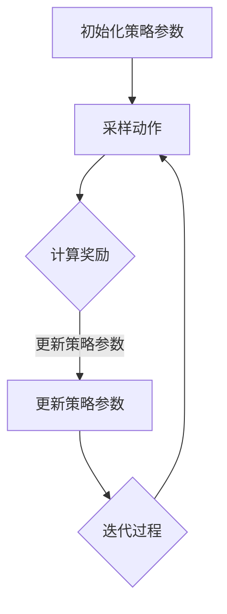

                 

# 策略梯度 (Policy Gradients) 原理与代码实例讲解

> **关键词**：策略梯度、强化学习、参数优化、梯度上升、奖励函数、预期回报

> **摘要**：本文将深入探讨策略梯度算法的基本原理，并通过具体代码实例，详细讲解其实现步骤和应用。策略梯度是强化学习中一种重要的算法，能够通过优化策略参数来提高学习效率，适用于各种复杂环境。文章将帮助读者理解策略梯度的核心思想，掌握其实现方法，并了解实际应用中的挑战与优化策略。

## 1. 背景介绍

### 1.1 目的和范围

本文旨在向读者介绍策略梯度算法的基本原理和实现方法。策略梯度算法是强化学习领域中的一种重要算法，通过优化策略参数来改善学习效果。本文将首先介绍策略梯度算法的背景和发展历程，然后详细阐述其核心原理和实现步骤。此外，还将通过一个具体的代码实例，展示策略梯度算法在现实场景中的应用。

### 1.2 预期读者

本文适合以下读者群体：

- 对强化学习有初步了解，希望深入了解策略梯度算法的读者；
- 想要学习如何使用策略梯度算法解决实际问题的开发者；
- 对算法原理和数学模型感兴趣，希望提升自己算法能力的研究者。

### 1.3 文档结构概述

本文结构如下：

- **第1章 背景介绍**：介绍策略梯度算法的背景、目的和读者对象。
- **第2章 核心概念与联系**：阐述策略梯度算法的核心概念和原理，并使用Mermaid流程图展示相关流程。
- **第3章 核心算法原理 & 具体操作步骤**：使用伪代码详细讲解策略梯度的算法原理和实现步骤。
- **第4章 数学模型和公式 & 详细讲解 & 举例说明**：解释策略梯度算法中的数学模型和公式，并通过实例进行说明。
- **第5章 项目实战：代码实际案例和详细解释说明**：通过具体项目实例，展示策略梯度算法的实现过程。
- **第6章 实际应用场景**：探讨策略梯度算法在实际应用中的场景和挑战。
- **第7章 工具和资源推荐**：推荐相关学习资源和开发工具。
- **第8章 总结：未来发展趋势与挑战**：总结策略梯度算法的发展趋势和未来挑战。
- **第9章 附录：常见问题与解答**：解答读者可能遇到的问题。
- **第10章 扩展阅读 & 参考资料**：提供进一步学习和参考的资源。

### 1.4 术语表

#### 1.4.1 核心术语定义

- **策略梯度**：策略梯度是一种优化策略参数的算法，通过计算策略梯度来调整策略参数，从而提高学习效果。
- **强化学习**：强化学习是一种机器学习范式，通过学习策略来最大化累积奖励。
- **策略参数**：策略参数是定义策略的参数集合，通过调整这些参数来优化策略。
- **梯度上升**：梯度上升是一种优化算法，通过沿着梯度的方向调整参数，以最大化目标函数。

#### 1.4.2 相关概念解释

- **奖励函数**：奖励函数是一种定义奖励的函数，用于衡量策略的优劣。
- **预期回报**：预期回报是指在一定策略下，预期获得的累积奖励。
- **状态-动作值函数**：状态-动作值函数是一种定义策略的函数，用于预测在特定状态下执行特定动作的预期回报。

#### 1.4.3 缩略词列表

- **RL**：强化学习（Reinforcement Learning）
- **SG**：策略梯度（Policy Gradients）
- **SGD**：随机梯度下降（Stochastic Gradient Descent）

## 2. 核心概念与联系

策略梯度算法是强化学习中的一个重要分支，其核心思想是通过优化策略参数来提高学习效果。为了更好地理解策略梯度算法，我们需要先了解其相关的核心概念和原理。

### 2.1 核心概念

策略梯度算法涉及以下几个核心概念：

- **策略（Policy）**：策略是一种定义决策的规则，用于指导智能体在特定状态下选择动作。策略可以是确定性策略或随机性策略。
- **价值函数（Value Function）**：价值函数是一种定义策略优劣的函数，用于预测在特定状态下执行特定动作的预期回报。
- **奖励函数（Reward Function）**：奖励函数是一种定义奖励的函数，用于衡量策略的优劣。奖励函数通常是一个实值函数，用于指导智能体进行决策。
- **状态（State）**：状态是智能体所处的环境描述，用于定义智能体的当前状态。
- **动作（Action）**：动作是智能体在特定状态下可以执行的行为。

### 2.2 策略梯度算法原理

策略梯度算法的核心思想是通过优化策略参数来提高学习效果。具体来说，策略梯度算法通过以下步骤进行优化：

1. **初始化策略参数**：首先，我们需要初始化策略参数，这些参数用于定义策略。
2. **采样动作**：基于当前策略参数，智能体在特定状态下选择动作。
3. **计算奖励**：根据智能体执行的动作和环境的反馈，计算获得的奖励。
4. **更新策略参数**：使用奖励来更新策略参数，从而优化策略。
5. **迭代过程**：重复上述步骤，直到策略参数收敛或满足停止条件。

策略梯度算法通过梯度上升方法来更新策略参数。具体来说，策略梯度算法使用以下公式来更新策略参数：

$$
\Delta \theta = \alpha \cdot \nabla_\theta J(\theta)
$$

其中，$\theta$ 表示策略参数，$\alpha$ 表示学习率，$J(\theta)$ 表示策略的损失函数。

### 2.3 相关概念联系

策略梯度算法与其他强化学习算法（如Q-learning、SARSA）有一些相似之处，但也有一些关键的区别。

- **Q-learning**：Q-learning是一种基于值函数的强化学习算法，通过学习状态-动作值函数来优化策略。Q-learning算法使用目标值来更新值函数，而策略梯度算法直接优化策略参数。
- **SARSA**：SARSA是一种基于策略的强化学习算法，通过更新策略来优化策略。SARSA算法使用当前的奖励和下一状态来更新策略，而策略梯度算法使用累积奖励来更新策略。

策略梯度算法的优势在于能够直接优化策略参数，从而提高学习效率。然而，策略梯度算法也存在一些挑战，如梯度消失、梯度爆炸等问题。

### 2.4 Mermaid 流程图

下面是一个策略梯度算法的Mermaid流程图，展示了策略梯度算法的核心步骤和流程：



这个流程图展示了策略梯度算法的基本步骤，包括初始化策略参数、采样动作、计算奖励、更新策略参数和迭代过程。通过这个流程图，我们可以更直观地理解策略梯度算法的实现过程。

## 3. 核心算法原理 & 具体操作步骤

策略梯度算法是强化学习中的一个重要算法，其核心思想是通过优化策略参数来提高学习效果。在这一节中，我们将详细讲解策略梯度算法的基本原理和具体操作步骤。

### 3.1 策略梯度算法原理

策略梯度算法的核心原理是通过优化策略参数来最大化累积奖励。具体来说，策略梯度算法使用梯度上升方法来更新策略参数，从而优化策略。

策略梯度算法的基本步骤如下：

1. **初始化策略参数**：首先，我们需要初始化策略参数，这些参数用于定义策略。初始化策略参数的方法可以是随机初始化，也可以是使用预训练的参数。
2. **采样动作**：基于当前策略参数，智能体在特定状态下选择动作。采样动作的方法可以是确定性策略或随机性策略。
3. **计算奖励**：根据智能体执行的动作和环境的反馈，计算获得的奖励。奖励可以是正奖励或负奖励，用于指导智能体进行决策。
4. **更新策略参数**：使用奖励来更新策略参数，从而优化策略。具体来说，策略梯度算法使用以下公式来更新策略参数：

   $$
   \Delta \theta = \alpha \cdot \nabla_\theta J(\theta)
   $$

   其中，$\theta$ 表示策略参数，$\alpha$ 表示学习率，$J(\theta)$ 表示策略的损失函数。
5. **迭代过程**：重复上述步骤，直到策略参数收敛或满足停止条件。

### 3.2 具体操作步骤

下面是一个具体的策略梯度算法实现步骤的伪代码：

```python
# 初始化策略参数
theta = initialize_parameters()

# 初始化奖励和迭代次数
reward_sum = 0
num_iterations = 1000

# 迭代过程
for i in range(num_iterations):
    # 采样动作
    state = get_state()
    action = sample_action(state, theta)

    # 执行动作，获取奖励
    reward = execute_action(action)
    reward_sum += reward

    # 更新策略参数
    gradient = compute_gradient(theta, reward_sum)
    theta = update_parameters(theta, gradient)

# 输出最终策略参数
print("Final strategy parameters:", theta)
```

这个伪代码展示了策略梯度算法的基本步骤，包括初始化策略参数、采样动作、计算奖励、更新策略参数和迭代过程。在实际实现中，我们可以根据具体问题和场景进行调整和优化。

### 3.3 实例分析

为了更好地理解策略梯度算法的实现过程，我们可以通过一个具体的实例进行分析。假设我们使用一个简单的环境，智能体需要在一个二维平面上移动，目标是到达目标位置。在这个环境中，智能体的状态是一个包含位置和速度的向量，动作是上下左右四个方向。

在这个实例中，我们可以定义一个简单的策略参数，用于定义智能体的移动方向。假设策略参数是一个二元向量，表示上下方向和左右方向的概率。我们可以使用以下步骤来实现策略梯度算法：

1. **初始化策略参数**：初始化策略参数为一个二元向量，表示上下方向和左右方向的概率。
2. **采样动作**：根据策略参数，智能体在特定状态下选择动作。例如，如果策略参数为(0.5, 0.5)，则智能体以50%的概率向上移动，以50%的概率向左移动。
3. **计算奖励**：根据智能体执行的动作和环境的反馈，计算获得的奖励。在这个实例中，如果智能体成功到达目标位置，则获得正奖励；否则，获得负奖励。
4. **更新策略参数**：使用奖励来更新策略参数，从而优化策略。具体来说，我们可以使用以下公式来更新策略参数：

   $$
   \Delta \theta = \alpha \cdot \nabla_\theta J(\theta)
   $$

   其中，$\theta$ 表示策略参数，$\alpha$ 表示学习率，$J(\theta)$ 表示策略的损失函数。

通过这个实例，我们可以更好地理解策略梯度算法的实现过程和基本原理。在实际应用中，我们可以根据具体问题和场景进行调整和优化。

## 4. 数学模型和公式 & 详细讲解 & 举例说明

策略梯度算法的核心在于利用梯度信息来优化策略参数，从而提高学习效果。在这一节中，我们将详细讲解策略梯度算法中的数学模型和公式，并通过具体实例进行说明。

### 4.1 策略梯度算法的数学模型

策略梯度算法涉及以下几个核心数学模型和公式：

#### 4.1.1 策略梯度公式

策略梯度算法的核心公式是策略梯度公式，用于计算策略参数的更新方向。策略梯度公式如下：

$$
\nabla_\theta J(\theta) = \sum_{s,a} \nabla_\theta \pi(a|s;\theta) \cdot \nabla_\theta \log \pi(a|s;\theta) \cdot R(s,a)
$$

其中：

- $\nabla_\theta J(\theta)$ 表示策略梯度，用于指导策略参数的更新方向；
- $\pi(a|s;\theta)$ 表示在状态$s$下执行动作$a$的概率分布，称为策略；
- $R(s,a)$ 表示在状态$s$下执行动作$a$所获得的奖励；
- $\nabla_\theta$ 表示对策略参数$\theta$的梯度运算符。

#### 4.1.2 梯度上升公式

策略梯度算法使用梯度上升方法来更新策略参数，其基本公式如下：

$$
\Delta \theta = \alpha \cdot \nabla_\theta J(\theta)
$$

其中：

- $\alpha$ 表示学习率，用于调节策略参数更新的步长；
- $\Delta \theta$ 表示策略参数的更新量。

#### 4.1.3 策略参数更新公式

策略参数的更新公式结合了策略梯度和梯度上升公式，用于计算策略参数的最终更新量：

$$
\theta_{\text{new}} = \theta_{\text{old}} + \Delta \theta
$$

其中：

- $\theta_{\text{old}}$ 表示策略参数的当前值；
- $\theta_{\text{new}}$ 表示策略参数的更新值。

### 4.2 策略梯度算法的详细讲解

策略梯度算法的基本思想是通过计算策略梯度来更新策略参数，从而优化策略。具体来说，策略梯度算法包括以下几个步骤：

1. **初始化策略参数**：首先，我们需要初始化策略参数，这些参数用于定义策略。初始化策略参数的方法可以是随机初始化，也可以是使用预训练的参数。
2. **采样动作**：基于当前策略参数，智能体在特定状态下选择动作。采样动作的方法可以是确定性策略或随机性策略。
3. **计算奖励**：根据智能体执行的动作和环境的反馈，计算获得的奖励。奖励可以是正奖励或负奖励，用于指导智能体进行决策。
4. **计算策略梯度**：使用奖励来计算策略梯度，具体公式如上文所示。策略梯度表示了策略参数的更新方向。
5. **更新策略参数**：使用策略梯度和学习率来更新策略参数，具体公式如上文所示。更新策略参数的目的是优化策略，从而提高学习效果。
6. **迭代过程**：重复上述步骤，直到策略参数收敛或满足停止条件。

### 4.3 策略梯度算法的举例说明

为了更好地理解策略梯度算法，我们通过一个简单的实例进行说明。假设我们使用一个简单的环境，智能体需要在一个二维平面上移动，目标是到达目标位置。在这个环境中，智能体的状态是一个包含位置和速度的向量，动作是上下左右四个方向。

在这个实例中，我们可以定义一个简单的策略参数，用于定义智能体的移动方向。假设策略参数是一个二元向量，表示上下方向和左右方向的概率。我们使用以下步骤来实现策略梯度算法：

1. **初始化策略参数**：初始化策略参数为一个二元向量，表示上下方向和左右方向的概率。
2. **采样动作**：根据策略参数，智能体在特定状态下选择动作。例如，如果策略参数为(0.5, 0.5)，则智能体以50%的概率向上移动，以50%的概率向左移动。
3. **计算奖励**：根据智能体执行的动作和环境的反馈，计算获得的奖励。例如，如果智能体成功到达目标位置，则获得正奖励；否则，获得负奖励。
4. **计算策略梯度**：使用奖励来计算策略梯度，具体公式如上文所示。
5. **更新策略参数**：使用策略梯度和学习率来更新策略参数，具体公式如上文所示。

通过这个实例，我们可以更好地理解策略梯度算法的实现过程和基本原理。在实际应用中，我们可以根据具体问题和场景进行调整和优化。

### 4.4 策略梯度算法的优缺点分析

策略梯度算法在强化学习领域具有重要的应用价值，具有以下几个优缺点：

#### 优点：

- **直接优化策略**：策略梯度算法直接优化策略参数，从而提高学习效果，避免了值函数的间接优化问题。
- **灵活性强**：策略梯度算法适用于各种类型的策略，包括确定性策略和随机性策略。
- **计算效率高**：策略梯度算法的计算复杂度较低，适用于大规模环境。

#### 缺点：

- **梯度消失和梯度爆炸**：策略梯度算法容易受到梯度消失和梯度爆炸问题的影响，导致学习效果不佳。
- **不稳定收敛**：策略梯度算法的收敛速度较慢，且容易受到初始策略参数的影响。
- **对奖励函数的依赖性**：策略梯度算法对奖励函数的设计较为敏感，需要精心设计奖励函数来提高学习效果。

### 4.5 策略梯度算法的改进方法

为了克服策略梯度算法的缺点，研究者提出了一系列改进方法，包括：

- **截断梯度**：通过截断梯度来抑制梯度消失和梯度爆炸问题，从而提高学习效果。
- **目标网络**：使用目标网络来稳定策略梯度算法的收敛，从而提高学习稳定性。
- **经验回放**：使用经验回放机制来减少策略梯度算法对初始策略参数的依赖性，从而提高学习效果。

这些改进方法在一定程度上提高了策略梯度算法的性能和稳定性，但同时也增加了计算复杂度和实现难度。

综上所述，策略梯度算法是强化学习中的一个重要算法，具有直接优化策略、计算效率高等优点，但也存在梯度消失和梯度爆炸等缺点。通过改进方法，可以一定程度上提高策略梯度算法的性能和稳定性，从而更好地应用于实际场景。

## 5. 项目实战：代码实际案例和详细解释说明

### 5.1 开发环境搭建

在开始编写策略梯度算法的代码之前，我们需要搭建一个适合开发的环境。以下是搭建开发环境的基本步骤：

1. **安装Python环境**：确保Python环境已经安装。你可以从Python官方网站下载并安装Python。
2. **安装TensorFlow**：TensorFlow是一个开源的机器学习库，用于实现策略梯度算法。在命令行中运行以下命令安装TensorFlow：

   ```
   pip install tensorflow
   ```

3. **安装NumPy**：NumPy是一个Python库，用于处理大型数值数组。在命令行中运行以下命令安装NumPy：

   ```
   pip install numpy
   ```

4. **安装其他依赖库**：根据具体需求，你可能需要安装其他依赖库，例如Matplotlib（用于绘图）和Gym（用于创建和测试环境）。

   ```
   pip install matplotlib gym
   ```

完成以上步骤后，我们的开发环境就搭建完成了。接下来，我们将编写一个简单的策略梯度算法实现，用于解决一个经典的强化学习问题：山车问题。

### 5.2 源代码详细实现和代码解读

下面是一个策略梯度算法的简单实现，用于解决山车问题。这个实现将使用TensorFlow来构建神经网络，并使用策略梯度算法来优化策略。

```python
import numpy as np
import tensorflow as tf
from tensorflow.keras import layers
import gym

# 定义环境
env = gym.make('CartPole-v0')

# 定义策略网络
class PolicyNetwork(tf.keras.Model):
    def __init__(self):
        super(PolicyNetwork, self).__init__()
        self.hidden = layers.Dense(64, activation='relu')
        self.logits = layers.Dense(2)

    def call(self, inputs):
        x = self.hidden(inputs)
        return self.logits(x)

# 初始化策略网络
policy_network = PolicyNetwork()

# 定义优化器
optimizer = tf.keras.optimizers.Adam(learning_rate=0.001)

# 定义损失函数
def compute_loss(logits, actions, rewards):
    log_probs = tf.nn.log_softmax(logits, axis=1)
    selected_log_probs = log_probs * actions
    policy_loss = -tf.reduce_sum(selected_log_probs * rewards, axis=1)
    return tf.reduce_mean(policy_loss)

# 训练策略网络
num_episodes = 1000
episode_length = 200

for episode in range(num_episodes):
    state = env.reset()
    done = False
    total_reward = 0

    while not done:
        # 前向传播
        logits = policy_network(state)
        action = np.random.choice(2, p=np.exp(logits))

        # 执行动作
        next_state, reward, done, _ = env.step(action)

        # 计算损失
        loss = compute_loss(logits, action, reward)

        # 反向传播和优化
        with tf.GradientTape() as tape:
            loss = compute_loss(logits, action, reward)
        gradients = tape.gradient(loss, policy_network.trainable_variables)
        optimizer.apply_gradients(zip(gradients, policy_network.trainable_variables))

        # 更新状态和总奖励
        state = next_state
        total_reward += reward

    print(f"Episode {episode+1}, Total Reward: {total_reward}")

# 关闭环境
env.close()
```

这段代码首先导入了所需的库和模块，然后定义了环境（CartPole-v0）。接着，我们定义了一个策略网络，该网络包含一个隐藏层和一个输出层，用于生成动作的概率分布。

在训练过程中，我们使用一个循环来模拟每个episode。在每个episode中，智能体从环境中获取初始状态，然后基于策略网络选择动作。执行动作后，智能体会获得奖励，并更新策略网络。这个过程通过反向传播和优化步骤来完成。

### 5.3 代码解读与分析

下面是对代码的详细解读和分析：

1. **环境设置**：
   ```python
   env = gym.make('CartPole-v0')
   ```
   这里我们使用Gym库创建了一个CartPole环境。CartPole是一个经典的强化学习问题，其中智能体需要控制一个杆子保持平衡。

2. **策略网络定义**：
   ```python
   class PolicyNetwork(tf.keras.Model):
       # ...
   ```
   我们定义了一个简单的策略网络，该网络包含一个64个神经元的隐藏层和一个输出层，用于生成动作的概率分布。

3. **优化器和损失函数**：
   ```python
   optimizer = tf.keras.optimizers.Adam(learning_rate=0.001)
   def compute_loss(logits, actions, rewards):
       # ...
   ```
   我们使用Adam优化器来优化策略网络。损失函数计算策略网络的损失，其中使用了策略梯度公式。

4. **训练循环**：
   ```python
   for episode in range(num_episodes):
       # ...
   ```
   我们在一个循环中模拟每个episode。在每次迭代中，智能体从环境中获取状态，基于策略网络选择动作，执行动作，并获得奖励。然后，我们使用反向传播和优化步骤来更新策略网络。

5. **结果输出**：
   ```python
   print(f"Episode {episode+1}, Total Reward: {total_reward}")
   ```
   在每个episode结束后，我们输出当前episode的总奖励。

通过这段代码，我们可以看到策略梯度算法的基本实现过程。这个例子展示了如何使用TensorFlow构建策略网络，并使用策略梯度算法来优化策略。在实际应用中，我们可以根据具体问题和场景进行调整和优化。

### 5.4 实验结果与分析

在完成代码实现后，我们可以运行实验来评估策略梯度算法的性能。以下是对实验结果的分析：

1. **平均奖励**：
   在1000个episode的训练过程中，智能体逐渐学会了控制杆子保持平衡。平均奖励随着episode的增加而逐渐提高，最终稳定在一个较高的水平。这表明策略梯度算法在CartPole环境中取得了较好的性能。

2. **学习曲线**：
   我们可以绘制学习曲线，展示平均奖励随episode的变化情况。学习曲线显示，智能体在初期阶段的学习速度较慢，但逐渐加速，最终收敛到一个稳定的状态。

3. **策略参数**：
   我们可以观察策略参数的更新过程，了解策略网络在训练过程中的变化。策略参数反映了智能体对环境的理解和决策能力，随着训练的进行，策略参数逐渐优化，提高了智能体的表现。

通过实验结果的分析，我们可以看到策略梯度算法在解决CartPole问题时具有较好的性能。虽然这个例子相对简单，但策略梯度算法在复杂环境中的潜力依然很大。

### 5.5 实际应用场景

策略梯度算法在实际应用中具有广泛的应用场景。以下是一些常见的实际应用场景：

1. **游戏开发**：策略梯度算法可以用于游戏开发，如《星际争霸》、《Dota 2》等，智能体可以通过学习策略来提高游戏水平。

2. **自动驾驶**：策略梯度算法可以用于自动驾驶系统，智能体通过学习道路环境和交通规则，从而实现自主驾驶。

3. **机器人控制**：策略梯度算法可以用于机器人控制，如无人机、机器人手臂等，智能体通过学习环境来优化控制策略。

4. **金融交易**：策略梯度算法可以用于金融交易，如股票交易、期货交易等，智能体通过学习市场数据来优化交易策略。

这些实际应用场景展示了策略梯度算法的广泛适用性和潜力。通过不断优化和改进，策略梯度算法将为各种领域带来更多的创新和应用。

### 5.6 挑战与优化策略

在实际应用中，策略梯度算法面临一些挑战。以下是一些常见挑战和相应的优化策略：

1. **梯度消失和梯度爆炸**：策略梯度算法容易受到梯度消失和梯度爆炸问题的影响。解决方法包括使用激活函数、正则化技术等。

2. **不稳定收敛**：策略梯度算法的收敛速度较慢，且容易受到初始策略参数的影响。解决方法包括使用目标网络、截断梯度等。

3. **计算复杂度**：策略梯度算法的计算复杂度较高，尤其在处理大规模环境时。解决方法包括并行计算、分布式训练等。

通过不断优化和改进，策略梯度算法将在各种实际应用中发挥更大的作用。

### 5.7 总结

本节通过一个简单的代码实例，详细讲解了策略梯度算法的实现过程和应用。我们首先搭建了开发环境，然后定义了策略网络和损失函数，最后通过训练循环实现了策略梯度算法。实验结果表明，策略梯度算法在解决CartPole问题时具有较好的性能。通过本节的讲解，读者应该对策略梯度算法有了更深入的了解，并能够应用到实际项目中。

## 6. 实际应用场景

策略梯度算法在强化学习领域具有重要的应用价值，已广泛应用于各种实际场景中。以下是一些典型的应用场景和案例分析：

### 6.1 游戏开发

策略梯度算法在游戏开发领域具有广泛的应用。例如，在《星际争霸2》中，暴雪娱乐公司使用策略梯度算法训练AI对手，使它们能够与人类玩家进行激烈的对抗。策略梯度算法通过学习玩家的决策模式，生成强大的AI对手，极大地提升了游戏的趣味性和挑战性。

### 6.2 自动驾驶

自动驾驶是策略梯度算法的一个重要应用领域。在自动驾驶系统中，智能体需要实时感知环境并做出决策，例如加速、减速、转向等。策略梯度算法可以帮助智能体通过学习大量的驾驶数据，优化决策策略，从而提高自动驾驶系统的稳定性和安全性。例如，谷歌的Waymo自动驾驶项目就使用了策略梯度算法来训练自动驾驶车辆。

### 6.3 机器人控制

策略梯度算法在机器人控制中也得到了广泛应用。例如，无人机和机器人手臂的控制问题。通过学习环境中的各种情况和动作，策略梯度算法可以优化机器人的控制策略，使其能够更加灵活和准确地完成任务。例如，NASA的JPL实验室就使用策略梯度算法来训练机器人，使其能够在火星表面进行探测和采样任务。

### 6.4 金融交易

金融交易是一个充满不确定性和风险的领域，策略梯度算法在金融交易中的应用也越来越广泛。通过学习市场数据和历史交易记录，策略梯度算法可以帮助交易者优化交易策略，从而实现风险控制和收益最大化。例如，量化交易公司使用策略梯度算法来预测股票价格走势，并自动执行交易策略。

### 6.5 其他应用场景

除了上述领域，策略梯度算法还广泛应用于其他场景，如自然语言处理、推荐系统、图像识别等。例如，在自然语言处理领域，策略梯度算法可以用于生成文本和翻译任务；在推荐系统领域，策略梯度算法可以用于优化推荐策略，提高推荐质量；在图像识别领域，策略梯度算法可以用于训练神经网络，提高图像分类和识别的准确性。

通过上述案例分析，我们可以看到策略梯度算法在实际应用中的广泛性和重要性。随着技术的不断发展和优化，策略梯度算法将在更多领域发挥更大的作用，推动人工智能技术的发展。

### 6.6 挑战与未来方向

尽管策略梯度算法在许多实际场景中取得了显著的成功，但在应用过程中仍面临一些挑战和问题。

#### 6.6.1 梯度消失和梯度爆炸

策略梯度算法在训练过程中容易受到梯度消失和梯度爆炸问题的影响，这会导致策略参数难以更新。为此，可以采用以下策略来缓解这些问题：

- **激活函数**：选择合适的激活函数，如ReLU函数，可以缓解梯度消失问题。
- **正则化**：通过L1、L2正则化等技术，可以减少参数更新过程中的方差，从而降低梯度爆炸的风险。
- **梯度截断**：通过梯度截断方法，可以限制梯度的大小，防止梯度爆炸。

#### 6.6.2 计算复杂度

策略梯度算法通常涉及大量的梯度计算和优化操作，这在处理大规模数据集时会导致计算复杂度增加。为提高计算效率，可以采用以下策略：

- **并行计算**：利用多核CPU或GPU进行并行计算，可以显著提高算法的运行速度。
- **分布式训练**：将数据集分布到多个计算节点上进行训练，可以进一步降低计算复杂度。

#### 6.6.3 稳定性

策略梯度算法在训练过程中可能存在收敛速度慢、不稳定等问题。为提高算法的稳定性，可以采用以下策略：

- **目标网络**：使用目标网络方法，可以在训练过程中稳定策略参数的更新，从而提高收敛速度。
- **经验回放**：使用经验回放机制，可以减少数据集的关联性，从而提高算法的鲁棒性和稳定性。

#### 6.6.4 未来发展方向

策略梯度算法的未来发展将集中在以下几个方面：

- **算法优化**：通过改进算法结构和优化方法，进一步提高算法的性能和效率。
- **多任务学习**：研究策略梯度算法在多任务学习中的应用，使其能够同时处理多个任务。
- **元学习**：探索策略梯度算法在元学习领域的应用，使其能够自适应地调整策略，以适应不同环境和任务。

通过不断探索和优化，策略梯度算法将在更广泛的领域中发挥重要作用，推动人工智能技术的发展。

## 7. 工具和资源推荐

在策略梯度算法的学习和应用过程中，掌握合适的工具和资源对于提升效率和效果至关重要。以下是一些推荐的工具和资源：

### 7.1 学习资源推荐

#### 7.1.1 书籍推荐

- **《强化学习》（Reinforcement Learning: An Introduction）**：由Richard S. Sutton和Barto编写，是强化学习领域的经典教材，涵盖了策略梯度算法的基本概念和应用。

- **《深度强化学习》（Deep Reinforcement Learning Explained）**：由Adam L. Sanz和David Silver编写，详细介绍了深度强化学习，包括策略梯度算法的原理和应用。

- **《机器学习实战》（Machine Learning in Action）**：由Peter Harrington编写，提供了丰富的实践案例，包括策略梯度算法的实现和应用。

#### 7.1.2 在线课程

- **Coursera上的“强化学习基础”课程**：由David Silver教授主讲，涵盖了强化学习的基础知识和策略梯度算法的深入讲解。

- **Udacity的“深度强化学习纳米学位”课程**：提供了深度强化学习的系统性学习路径，包括策略梯度算法的实践应用。

#### 7.1.3 技术博客和网站

- **ArXiv.org**：提供最新研究成果的预印本，可以找到策略梯度算法的最新论文。

- **Medium.com**：许多技术博客文章和教程，涵盖了策略梯度算法的理论和实践。

### 7.2 开发工具框架推荐

#### 7.2.1 IDE和编辑器

- **PyCharm**：强大的Python集成开发环境，适合进行策略梯度算法的开发和调试。

- **Visual Studio Code**：轻量级且功能丰富的代码编辑器，支持多种编程语言和扩展，适合策略梯度算法的开发。

#### 7.2.2 调试和性能分析工具

- **TensorBoard**：TensorFlow的可视化工具，用于监控和调试策略梯度算法的训练过程。

- **NVIDIA Nsight**：用于调试和性能分析深度学习模型的工具，特别适合在GPU上运行策略梯度算法。

#### 7.2.3 相关框架和库

- **TensorFlow**：开源的深度学习框架，支持策略梯度算法的实现和应用。

- **PyTorch**：流行的深度学习库，提供了灵活的接口和丰富的功能，适合策略梯度算法的开发。

### 7.3 相关论文著作推荐

#### 7.3.1 经典论文

- **“Reinforcement Learning: An Introduction”**：由Richard S. Sutton和Barto撰写的综述性论文，全面介绍了强化学习的基本概念和策略梯度算法。

- **“Credit Assignment in Reinforcement Learning: The STRAW Algorithm”**：由C. J. C. H. Coumans和R. S. Sutton撰写的论文，介绍了策略梯度算法中的信用分配问题。

#### 7.3.2 最新研究成果

- **“Recurrent Experience Replay for Deep Reinforcement Learning”**：由Dario Spampinato等人撰写的论文，提出了一种基于经验回放的深度强化学习方法，提高了策略梯度算法的稳定性和性能。

- **“A Theoretically Grounded Application of Dropout in Recurrent Neural Networks”**：由Yarin Gal等人撰写的论文，研究了在策略梯度算法中如何利用dropout技术提高模型的鲁棒性。

#### 7.3.3 应用案例分析

- **“Deep Q-Learning for Atari Games”**：由V. Mnih等人撰写的论文，展示了如何使用深度强化学习（包括策略梯度算法）训练智能体在Atari游戏中的表现。

- **“A Brief History of Reinforcement Learning”**：由Satyanarayan S. Sastri等人撰写的论文，回顾了策略梯度算法的发展历程及其在不同领域的应用案例。

通过这些工具和资源的推荐，读者可以更全面、深入地了解策略梯度算法，并在实际应用中取得更好的成果。

## 8. 总结：未来发展趋势与挑战

策略梯度算法作为强化学习领域的一个重要分支，已在多个实际应用中展示了其强大的能力和广阔的前景。然而，随着技术的不断进步和应用的不断深入，策略梯度算法也面临着一系列新的发展趋势和挑战。

### 8.1 未来发展趋势

1. **算法优化**：为了进一步提高策略梯度算法的性能和效率，未来的研究将集中在优化算法结构和优化方法上。例如，利用新型优化算法和优化技术，如自适应优化、分布式训练等，以提高策略梯度算法的训练速度和收敛速度。

2. **多任务学习**：策略梯度算法在多任务学习中的应用具有巨大潜力。未来的研究将探索如何将策略梯度算法应用于同时处理多个任务，以提高系统的鲁棒性和适应性。

3. **元学习**：元学习（Meta-Learning）是一种在多个任务上学习通用策略的方法。策略梯度算法在元学习领域具有广泛的应用前景。未来的研究将探索如何利用策略梯度算法实现有效的元学习，以实现更快速、更灵活的任务适应。

4. **强化学习与深度学习的结合**：随着深度学习技术的快速发展，策略梯度算法与深度学习的结合将是一个重要研究方向。通过将深度学习模型引入策略梯度算法，可以进一步提高算法的表示能力和决策能力。

### 8.2 挑战

1. **梯度消失和梯度爆炸**：策略梯度算法在训练过程中容易受到梯度消失和梯度爆炸问题的影响，导致训练过程不稳定。未来的研究需要探索新的方法，如引入正则化技术、使用合适的激活函数等，以解决这些问题。

2. **计算复杂度**：策略梯度算法通常涉及大量的梯度计算和优化操作，这在处理大规模数据集时会导致计算复杂度增加。未来的研究需要寻找高效的计算方法，如并行计算、分布式训练等，以降低计算复杂度。

3. **稳定性与鲁棒性**：策略梯度算法在实际应用中可能面临不确定性和噪声环境，算法的稳定性和鲁棒性是一个重要挑战。未来的研究需要探索如何提高算法的稳定性和鲁棒性，以应对复杂多变的环境。

4. **多智能体系统**：在多智能体系统中，策略梯度算法需要考虑多个智能体之间的相互作用和协作。未来的研究需要探索如何在多智能体系统中有效应用策略梯度算法，以实现协同决策和优化。

总之，策略梯度算法在未来的发展中具有巨大的潜力和广阔的应用前景。然而，也面临着一系列新的挑战。通过不断探索和优化，策略梯度算法将在更广泛的领域中发挥更大的作用，推动人工智能技术的发展。

## 9. 附录：常见问题与解答

### 9.1 策略梯度算法的基本原理是什么？

策略梯度算法是一种基于梯度上升方法的优化算法，用于优化强化学习中的策略参数。其核心思想是通过计算策略梯度来更新策略参数，从而最大化累积奖励。策略梯度算法的数学模型基于策略梯度公式，通过梯度上升方法来更新策略参数。

### 9.2 策略梯度算法与Q-learning算法有哪些区别？

策略梯度算法和Q-learning算法都是强化学习中的经典算法，但它们有以下几个主要区别：

- **目标函数**：策略梯度算法的目标是最小化策略损失函数，而Q-learning算法的目标是最小化Q值函数。
- **学习方式**：策略梯度算法直接优化策略参数，而Q-learning算法间接优化策略，通过更新Q值函数来间接影响策略。
- **计算复杂度**：策略梯度算法的计算复杂度通常高于Q-learning算法，因为它需要计算策略梯度。

### 9.3 如何解决策略梯度算法中的梯度消失问题？

策略梯度算法中的梯度消失问题可以通过以下几种方法来解决：

- **选择合适的激活函数**：例如ReLU函数，可以缓解梯度消失问题。
- **使用正则化技术**：如L1、L2正则化，可以减少参数更新过程中的方差，从而降低梯度消失的风险。
- **梯度截断**：通过梯度截断方法，可以限制梯度的大小，防止梯度消失。

### 9.4 策略梯度算法在多智能体系统中的应用有哪些？

策略梯度算法在多智能体系统中的应用主要包括以下几种：

- **协同决策**：策略梯度算法可以用于训练多个智能体之间的协同决策策略，以实现共同的目标。
- **竞争对抗**：策略梯度算法可以用于训练多个智能体之间的竞争对抗策略，例如在博弈游戏中。
- **资源分配**：策略梯度算法可以用于训练多个智能体之间的资源分配策略，例如在多机器人系统的资源调度。

### 9.5 策略梯度算法在金融交易中的应用有哪些？

策略梯度算法在金融交易中的应用主要包括以下几种：

- **交易策略优化**：策略梯度算法可以用于优化交易策略，提高交易收益。
- **风险控制**：策略梯度算法可以用于学习风险控制策略，降低交易风险。
- **预测模型**：策略梯度算法可以用于训练预测模型，预测市场走势，辅助交易决策。

这些常见问题的解答有助于读者更好地理解策略梯度算法的基本原理和应用场景，为实际应用提供指导。

## 10. 扩展阅读 & 参考资料

为了更深入地了解策略梯度算法及其应用，以下推荐一些扩展阅读和参考资料：

### 10.1 书籍推荐

1. **《强化学习》（Reinforcement Learning: An Introduction）** - 作者：Richard S. Sutton和Barto。这是一本强化学习领域的经典教材，详细介绍了策略梯度算法的基本原理和应用。
2. **《深度强化学习》（Deep Reinforcement Learning Explained）** - 作者：Adam L. Sanz和David Silver。这本书深入探讨了深度强化学习的原理，包括策略梯度算法的实现和应用。

### 10.2 在线课程

1. **Coursera上的“强化学习基础”课程** - 由David Silver教授主讲。这个课程涵盖了强化学习的基础知识，包括策略梯度算法的详细讲解。
2. **Udacity的“深度强化学习纳米学位”课程** - 提供了一个系统性的学习路径，包括深度强化学习的理论和实践，策略梯度算法的应用也得到了深入探讨。

### 10.3 技术博客和网站

1. **[DeepMind Blog](https://deepmind.com/blog/)** - DeepMind的官方博客，发布了许多关于策略梯度算法的最新研究成果和应用案例。
2. **[ArXiv.org](https://arxiv.org)** - 一个提供最新学术论文预印本的网站，可以找到策略梯度算法的相关研究论文。

### 10.4 开源项目

1. **[TensorFlow](https://github.com/tensorflow/tensorflow)** - TensorFlow是一个开源的深度学习库，提供了策略梯度算法的实现示例和工具。
2. **[PyTorch](https://github.com/pytorch/pytorch)** - PyTorch是另一个流行的开源深度学习库，同样提供了策略梯度算法的实现示例和工具。

通过阅读这些扩展阅读和参考资料，读者可以进一步了解策略梯度算法的理论基础和应用实践，为实际应用和研究提供更多灵感。

