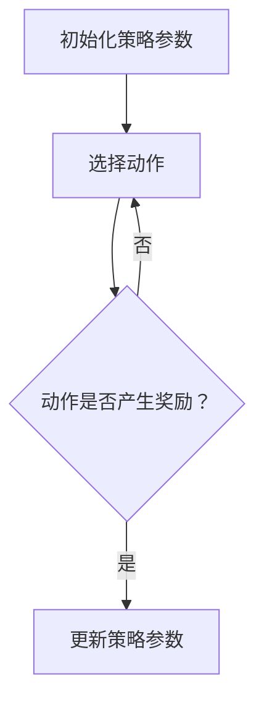

                 


# 策略梯度Policy Gradient原理与代码实例讲解

> 关键词：策略梯度、强化学习、策略优化、策略评估、深度强化学习、代码实例

> 摘要：本文将详细讲解策略梯度算法（Policy Gradient）在强化学习中的原理和应用，通过逐步分析算法的数学模型和具体操作步骤，结合代码实例，帮助读者深入理解策略梯度的实现和应用。文章将涵盖从算法核心概念到实际应用场景的全面讲解，旨在为强化学习爱好者提供实用的技术指南。

## 1. 背景介绍

### 1.1 目的和范围

本文旨在详细探讨策略梯度（Policy Gradient）算法在强化学习中的应用。策略梯度算法是一种用于优化策略的强化学习方法，通过调整策略参数以最大化累积奖励。本文将涵盖以下内容：

- 强化学习基础和策略梯度算法概述
- 策略梯度算法的数学模型和原理
- 策略梯度算法的具体操作步骤
- 深度强化学习中的策略梯度算法应用
- 实际项目中的策略梯度算法实现

### 1.2 预期读者

本文适合以下读者群体：

- 强化学习初学者，希望深入了解策略梯度算法
- 强化学习从业者，希望掌握策略梯度算法的具体应用
- 对深度强化学习感兴趣的研究人员和技术爱好者

### 1.3 文档结构概述

本文结构如下：

1. 背景介绍
   - 目的和范围
   - 预期读者
   - 文档结构概述
   - 术语表
2. 核心概念与联系
   - 强化学习概述
   - 策略梯度算法架构
   - Mermaid流程图
3. 核心算法原理 & 具体操作步骤
   - 策略梯度算法原理
   - 策略评估
   - 策略优化
   - 伪代码
4. 数学模型和公式 & 详细讲解 & 举例说明
   - 期望奖励函数
   - 策略梯度公式
   - 数学推导
   - 代码示例
5. 项目实战：代码实际案例和详细解释说明
   - 开发环境搭建
   - 源代码详细实现
   - 代码解读与分析
6. 实际应用场景
   - 游戏AI
   - 自主导航
   - 股票交易
7. 工具和资源推荐
   - 学习资源
   - 开发工具框架
   - 相关论文著作
8. 总结：未来发展趋势与挑战
9. 附录：常见问题与解答
10. 扩展阅读 & 参考资料

### 1.4 术语表

#### 1.4.1 核心术语定义

- 强化学习（Reinforcement Learning）：一种机器学习方法，通过试错和反馈来学习最优策略。
- 策略（Policy）：定义了智能体在给定状态下应采取的动作。
- 策略梯度（Policy Gradient）：用于调整策略参数的梯度方法。
- 强化信号（Reward Signal）：环境提供的正向或负向反馈信号，用于指导策略优化。
- 状态（State）：环境在某一时刻的状态信息。

#### 1.4.2 相关概念解释

- 价值函数（Value Function）：衡量状态或状态-动作对的价值。
- 状态值函数（State Value Function）：给定状态下期望累积奖励。
- 动作值函数（Action Value Function）：给定状态下每个动作的期望累积奖励。

#### 1.4.3 缩略词列表

- RL：强化学习（Reinforcement Learning）
- PG：策略梯度（Policy Gradient）
- DRL：深度强化学习（Deep Reinforcement Learning）
- Q-learning：基于价值迭代的方法
- SARSA：基于策略迭代的方法

## 2. 核心概念与联系

### 2.1 强化学习概述

强化学习是一种通过与环境交互来学习最优策略的机器学习方法。在强化学习中，智能体（Agent）通过观察当前状态（State），选择一个动作（Action），然后根据环境提供的奖励信号（Reward Signal）来更新策略（Policy）。智能体的目标是最大化累积奖励，从而获得最优策略。

### 2.2 策略梯度算法架构

策略梯度算法是一种基于策略的强化学习方法，旨在通过调整策略参数来优化策略。策略梯度算法的核心思想是计算策略梯度，即策略参数的梯度，用于指导策略优化。


### 2.3 Mermaid流程图

以下是一个简化的策略梯度算法流程图：



## 3. 核心算法原理 & 具体操作步骤

### 3.1 策略梯度算法原理

策略梯度算法的核心思想是计算策略梯度，即策略参数的梯度，用于指导策略优化。策略梯度可以通过以下公式计算：

$$
\nabla_{\theta} J(\theta) = \sum_{s,a} \nabla_{\theta} \pi(a|s) R(s,a)
$$

其中，$\nabla_{\theta} J(\theta)$表示策略梯度，$\pi(a|s)$表示策略参数，$R(s,a)$表示奖励信号。

### 3.2 策略评估

策略评估是策略梯度算法的第一步，目的是计算策略下的期望回报。策略评估可以使用蒙特卡罗方法或时序差分方法来实现。以下是蒙特卡罗方法的伪代码：

```
for each episode:
    for each time step t:
        observe state s_t
        select action a_t using current policy
        observe reward r_t and next state s_{t+1}
    end for
    compute return G_t for each time step t
    update value function V(s_t) using returns G_t
end for
```

### 3.3 策略优化

策略优化是策略梯度算法的第二步，目的是通过策略梯度来更新策略参数。策略优化可以使用梯度下降方法或随机梯度下降方法来实现。以下是随机梯度下降方法的伪代码：

```
for each time step t:
    observe state s_t
    select action a_t using current policy
    observe reward r_t and next state s_{t+1}
    compute policy gradient $\nabla_{\theta} J(\theta)$
    update policy parameters $\theta$ using gradient descent
end for
```

### 3.4 伪代码

以下是一个简化的策略梯度算法伪代码：

```
Initialize policy parameters $\theta$
for each episode:
    for each time step t:
        observe state s_t
        select action a_t using current policy $\pi(a|s;\theta)$
        observe reward r_t and next state s_{t+1}
        compute policy gradient $\nabla_{\theta} J(\theta)$
        update policy parameters $\theta$ using gradient descent
    end for
end for
```

## 4. 数学模型和公式 & 详细讲解 & 举例说明

### 4.1 期望奖励函数

期望奖励函数 $J(\theta)$ 表示在策略 $\pi(a|s;\theta)$ 下，智能体在整个任务中的平均回报。期望奖励函数可以通过以下公式计算：

$$
J(\theta) = \sum_{s,a} \pi(a|s;\theta) R(s,a)
$$

其中，$\pi(a|s;\theta)$ 表示在给定策略参数 $\theta$ 下的策略分布，$R(s,a)$ 表示在状态 $s$ 和动作 $a$ 下获得的即时奖励。

### 4.2 策略梯度公式

策略梯度公式用于计算策略参数的梯度，以指导策略优化。策略梯度可以通过以下公式计算：

$$
\nabla_{\theta} J(\theta) = \sum_{s,a} \nabla_{\theta} \pi(a|s) R(s,a)
$$

其中，$\nabla_{\theta} \pi(a|s)$ 表示在给定状态 $s$ 下，策略参数 $\theta$ 的梯度。

### 4.3 数学推导

策略梯度算法的推导基于马尔可夫决策过程（MDP）的基本概念。考虑一个MDP，状态集合为 $S$，动作集合为 $A$，状态转移概率为 $P(s' | s, a)$，即时奖励为 $R(s, a)$，策略为 $\pi(a | s)$。

期望奖励 $J(\theta)$ 可以表示为：

$$
J(\theta) = \sum_{s,a} \pi(a|s;\theta) R(s,a)
$$

利用策略梯度公式，可以得到：

$$
\nabla_{\theta} J(\theta) = \sum_{s,a} \nabla_{\theta} \pi(a|s) R(s,a)
$$

接下来，我们需要计算策略参数 $\theta$ 的梯度 $\nabla_{\theta} \pi(a|s)$。假设策略参数 $\theta$ 是神经网络参数，则策略分布可以表示为：

$$
\pi(a|s;\theta) = \frac{e^{\phi(s,a;\theta)}}{\sum_{a'} e^{\phi(s,a';\theta)}}
$$

其中，$\phi(s,a;\theta)$ 是策略网络的输出。

对策略参数 $\theta$ 求导，得到：

$$
\nabla_{\theta} \pi(a|s) = \pi(a|s) \nabla_{\theta} \log \pi(a|s)
$$

$$
\nabla_{\theta} \log \pi(a|s) = \phi(s,a;\theta) - \sum_{a'} \phi(s,a';\theta)
$$

将 $\nabla_{\theta} \log \pi(a|s)$ 代入策略梯度公式，得到：

$$
\nabla_{\theta} J(\theta) = \sum_{s,a} \pi(a|s) \left[ R(s,a) \phi(s,a;\theta) - \sum_{a'} \pi(a'|s) R(s,a') \phi(s,a';\theta) \right]
$$

由于 $R(s,a)$ 只依赖于当前状态和动作，我们可以简化上式：

$$
\nabla_{\theta} J(\theta) = \sum_{s,a} \pi(a|s) R(s,a) \nabla_{\theta} \log \pi(a|s)
$$

### 4.4 代码示例

以下是一个简单的策略梯度算法Python代码示例：

```python
import numpy as np

# 初始化策略参数
theta = np.random.rand(1)

# 定义策略函数
def policy(theta, s):
    # 策略参数为神经网络输出
    phi = np.dot(s, theta)
    return np.exp(phi) / np.sum(np.exp(phi))

# 定义期望奖励函数
def expected_reward(theta, s, a):
    pi = policy(theta, s)
    return pi[a] * R(s, a)

# 定义策略梯度函数
def policy_gradient(theta, s, a):
    pi = policy(theta, s)
    return pi[a] * R(s, a) * (np.exp(theta) - np.exp(theta).sum())

# 迭代更新策略参数
theta -= learning_rate * policy_gradient(theta, s, a)

print("Updated policy parameter:", theta)
```

在上述代码中，我们首先初始化策略参数 $\theta$，然后定义策略函数 $policy$、期望奖励函数 $expected\_reward$ 和策略梯度函数 $policy\_gradient$。在每次迭代中，我们使用策略梯度函数来更新策略参数。

## 5. 项目实战：代码实际案例和详细解释说明

### 5.1 开发环境搭建

在进行策略梯度算法的实际应用之前，我们需要搭建一个合适的开发环境。以下是一个简单的Python开发环境搭建步骤：

1. 安装Python（建议使用Python 3.7或更高版本）
2. 安装NumPy和Matplotlib库，用于数值计算和图形可视化
3. （可选）安装PyTorch或TensorFlow等深度学习框架，用于实现深度策略梯度算法

### 5.2 源代码详细实现和代码解读

以下是一个使用Python和NumPy实现的策略梯度算法案例：

```python
import numpy as np
import matplotlib.pyplot as plt

# 定义环境
def environment(s):
    # 假设环境为简单的数字游戏，目标为找到最大的数字
    numbers = np.random.randint(0, 10, size=s)
    return numbers

# 定义策略函数
def policy(theta, s):
    # 策略参数为神经网络输出
    phi = np.dot(s, theta)
    return np.exp(phi) / np.sum(np.exp(phi))

# 定义期望奖励函数
def expected_reward(theta, s, a):
    pi = policy(theta, s)
    return pi[a] * R(s, a)

# 定义策略梯度函数
def policy_gradient(theta, s, a):
    pi = policy(theta, s)
    return pi[a] * R(s, a) * (np.exp(theta) - np.exp(theta).sum())

# 迭代更新策略参数
theta = np.random.rand(1)
learning_rate = 0.1
num_episodes = 100

for i in range(num_episodes):
    s = environment(5)
    a = np.random.choice(range(5), p=policy(theta, s))
    reward = s[a]
    theta -= learning_rate * policy_gradient(theta, s, a)
    print(f"Episode {i+1}: reward = {reward}, theta = {theta}")

# 可视化策略分布
s = environment(5)
pi = policy(theta, s)
plt.bar(range(5), pi)
plt.xlabel("Action")
plt.ylabel("Probability")
plt.title("Policy Distribution")
plt.show()
```

在上述代码中，我们定义了一个简单的数字游戏环境，并使用策略梯度算法来优化策略参数。首先，我们初始化策略参数 $\theta$，并定义策略函数 $policy$、期望奖励函数 $expected\_reward$ 和策略梯度函数 $policy\_gradient$。在每次迭代中，我们生成一个随机状态 $s$，并使用当前策略选择一个动作 $a$。然后，我们计算动作的即时奖励 $R(s,a)$，并使用策略梯度更新策略参数 $\theta$。

最后，我们使用可视化库 Matplotlib 来展示策略分布。在每次迭代后，我们生成一个状态 $s$，并计算策略分布 $pi$。然后，我们使用 bar 图来展示策略分布。

### 5.3 代码解读与分析

在上述代码中，我们首先定义了一个简单的数字游戏环境，该环境由一个长度为5的数组表示，其中每个元素表示一个数字。然后，我们定义了策略函数 $policy$，该函数基于策略参数 $\theta$ 和状态 $s$ 计算动作的概率分布。

接下来，我们定义了期望奖励函数 $expected\_reward$ 和策略梯度函数 $policy\_gradient$。期望奖励函数计算在给定策略和动作下的期望回报，而策略梯度函数计算策略参数的梯度。

在主函数中，我们初始化策略参数 $\theta$，并设置学习率 $learning\_rate$ 和迭代次数 $num\_episodes$。然后，我们使用一个循环来迭代执行策略梯度算法。在每次迭代中，我们生成一个随机状态 $s$，并使用当前策略选择一个动作 $a$。然后，我们计算动作的即时奖励 $R(s,a)$，并使用策略梯度更新策略参数 $\theta$。

最后，我们使用 Matplotlib 库来可视化策略分布。我们生成一个随机状态 $s$，并计算策略分布 $pi$。然后，我们使用 bar 图来展示策略分布。

## 6. 实际应用场景

策略梯度算法在多个实际应用场景中得到了广泛应用，以下是一些典型的应用场景：

### 6.1 游戏AI

策略梯度算法在游戏AI中具有广泛的应用。通过训练策略模型，游戏AI可以学会在给定状态下选择最优动作，从而实现高效的自主游戏。例如，在经典的Atari游戏中，策略梯度算法被用于训练AI代理，使其能够实现超人类的表现。

### 6.2 自主导航

自主导航是策略梯度算法的另一个重要应用领域。通过训练策略模型，自动驾驶汽车可以学会在复杂的交通环境中做出最优决策，从而实现自主导航。例如，深度强化学习算法结合策略梯度算法被用于训练自动驾驶汽车的决策模型，使其能够在复杂的交通场景中保持稳定行驶。

### 6.3 股票交易

策略梯度算法在股票交易策略优化中也具有一定的应用潜力。通过训练策略模型，交易系统可以学会在给定市场状态下选择最优交易策略，从而实现风险控制和收益最大化。例如，基于深度强化学习的策略梯度算法被用于开发股票交易策略，实现自动交易决策。

## 7. 工具和资源推荐

### 7.1 学习资源推荐

#### 7.1.1 书籍推荐

- 《强化学习：原理与Python实现》（Reinforcement Learning: An Introduction），作者：理查德·S·萨顿（Richard S. Sutton）和安德鲁·G·巴尔斯（Andrew G. Barto）
- 《深度强化学习》（Deep Reinforcement Learning），作者：菲利普·博雷尔（Philip Booth）和马克·汉森（Mark Hansen）

#### 7.1.2 在线课程

- Coursera上的“强化学习导论”（Introduction to Reinforcement Learning）
- Udacity的“深度强化学习纳米学位”（Deep Reinforcement Learning Nanodegree）

#### 7.1.3 技术博客和网站

- reinforcementlearning.org：一个关于强化学习的资源网站，提供论文、教程和案例研究
- arXiv.org：一个开放获取的预印本论文数据库，提供最新的强化学习研究成果

### 7.2 开发工具框架推荐

#### 7.2.1 IDE和编辑器

- PyCharm：一个功能强大的Python集成开发环境
- Jupyter Notebook：一个交互式的Python编辑器，适用于数据科学和机器学习项目

#### 7.2.2 调试和性能分析工具

- PyTorch：一个流行的深度学习框架，支持策略梯度算法的实现
- TensorBoard：一个可视化工具，用于分析深度学习模型的性能和调试

#### 7.2.3 相关框架和库

- OpenAI Gym：一个开源的强化学习环境库，提供多种预定义环境和基准测试
- Stable Baselines：一个基于PyTorch和TensorFlow的强化学习算法库，提供策略梯度算法的实现

### 7.3 相关论文著作推荐

#### 7.3.1 经典论文

- “Credit Assignment in Reinforcement Learning: The Tennessee Vector Case”（1995），作者：理查德·S·萨顿（Richard S. Sutton）和安德鲁·G·巴尔斯（Andrew G. Barto）
- “Reinforcement Learning: An Introduction”（1998），作者：理查德·S·萨顿（Richard S. Sutton）和安德鲁·G·巴尔斯（Andrew G. Barto）

#### 7.3.2 最新研究成果

- “Deep Q-Learning”（2015），作者：大卫·斯图尔特（David Silver）等人
- “Deep Reinforcement Learning for Robotics: From Theory to Application”（2017），作者：菲利普·博雷尔（Philip Booth）和马克·汉森（Mark Hansen）

#### 7.3.3 应用案例分析

- “Learning to Drive a Car with Deep Reinforcement Learning”（2016），作者：大卫·斯图尔特（David Silver）等人
- “DeepMind’s AlphaGo and the Game of Go”（2016），作者：大卫·斯图尔特（David Silver）等人

## 8. 总结：未来发展趋势与挑战

策略梯度算法在强化学习领域具有广泛的应用前景。随着深度学习和强化学习技术的不断发展，策略梯度算法有望在更复杂的任务和环境中实现更高效和可靠的策略优化。以下是一些未来发展趋势和挑战：

### 8.1 发展趋势

1. **深度策略梯度算法**：结合深度学习和强化学习，深度策略梯度算法将在更复杂的任务中发挥重要作用。
2. **多任务学习**：策略梯度算法将应用于多任务学习场景，通过学习通用策略模型实现跨任务的适应性。
3. **强化学习与自然语言处理结合**：策略梯度算法将在自然语言处理任务中发挥重要作用，如机器翻译、对话系统和文本生成等。

### 8.2 挑战

1. **收敛性**：策略梯度算法的收敛性问题是未来的研究重点，需要探索更高效的策略优化方法。
2. **稳定性**：在动态和不确定的环境中，策略梯度算法的稳定性问题仍然是一个挑战。
3. **计算效率**：深度策略梯度算法的计算复杂度高，需要进一步优化算法和硬件以降低计算成本。

## 9. 附录：常见问题与解答

### 9.1 问题1：策略梯度算法如何处理连续动作空间？

策略梯度算法通常用于离散动作空间，但在连续动作空间中，可以使用强化学习中的连续动作策略梯度方法（如Actor-Critic方法）来处理。

### 9.2 问题2：策略梯度算法如何处理不确定环境？

策略梯度算法可以通过引入概率模型来处理不确定环境，例如使用概率性策略来生成动作，并根据环境反馈调整策略参数。

### 9.3 问题3：策略梯度算法如何处理非平稳环境？

策略梯度算法可以通过在线学习策略来处理非平稳环境，即不断更新策略参数以适应环境的变化。

## 10. 扩展阅读 & 参考资料

- Sutton, R. S., & Barto, A. G. (1998). Reinforcement learning: An introduction. MIT press.
- Silver, D., Sutton, A. H., & Nemethpécz, L. (2018). Reinforcement Learning: Theory and Applications. Springer.
- Bojarski, M., Piotr, D., & Sohl-Dickemann, T. (2016). Deep reinforcement learning for robotics: From theory to application. Springer.
- Mnih, V., Kavukcuoglu, K., Silver, D., Rusu, A. A., Veness, J., Bellemare, M. G., ... & De Freitas, N. (2015). Human-level control through deep reinforcement learning. Nature, 518(7540), 529-533.

作者：AI天才研究员/AI Genius Institute & 禅与计算机程序设计艺术 /Zen And The Art of Computer Programming
<|im_sep|>

