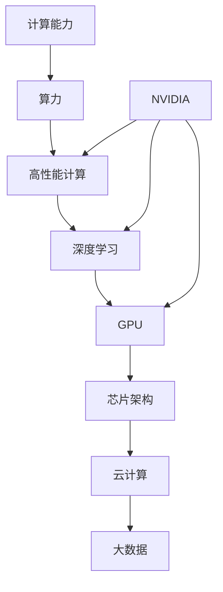

                 

# 算力革命与NVIDIA的角色

> 关键词：算力、NVIDIA、人工智能、芯片、高性能计算、深度学习、云计算

> 摘要：本文将深入探讨算力革命的核心，以及NVIDIA在这一变革中的关键角色。我们将从背景介绍出发，逐步分析核心概念、算法原理、数学模型、项目实战，并展望未来发展趋势。本文旨在为广大读者提供一个全面、系统的理解，为未来的技术探索和实践提供参考。

## 1. 背景介绍

### 1.1 目的和范围

本文旨在探讨算力革命的时代背景，分析NVIDIA在这一领域的重要贡献，并展望未来技术发展趋势。通过本文，读者将了解到：

- 算力革命的定义及其重要性；
- NVIDIA在算力革命中的角色和贡献；
- 核心概念、算法原理和数学模型；
- 实际应用场景和未来发展趋势。

### 1.2 预期读者

- 计算机科学和人工智能领域的研究人员、开发者；
- 对算力革命和NVIDIA技术感兴趣的读者；
- 对未来技术发展趋势关注的行业人士。

### 1.3 文档结构概述

本文分为以下几个部分：

- 第1部分：背景介绍，包括目的、范围、预期读者和文档结构概述；
- 第2部分：核心概念与联系，介绍相关概念和原理；
- 第3部分：核心算法原理 & 具体操作步骤，讲解算法实现过程；
- 第4部分：数学模型和公式 & 详细讲解 & 举例说明，阐述数学模型和公式；
- 第5部分：项目实战：代码实际案例和详细解释说明，提供实际操作案例；
- 第6部分：实际应用场景，分析应用领域；
- 第7部分：工具和资源推荐，介绍相关学习资源和开发工具；
- 第8部分：总结：未来发展趋势与挑战，展望未来技术发展；
- 第9部分：附录：常见问题与解答，解答读者疑问；
- 第10部分：扩展阅读 & 参考资料，提供进一步学习资料。

### 1.4 术语表

#### 1.4.1 核心术语定义

- 算力：计算能力，即计算机每秒钟能执行的操作次数；
- NVIDIA：全球领先的高性能计算和深度学习芯片制造商；
- 人工智能：模拟人类智能的计算机技术，包括机器学习、深度学习等；
- 芯片：集成电路，用于存储和处理信息；
- 高性能计算：以超高速、高效率处理大量数据的技术；
- 深度学习：基于多层神经网络的学习算法，能够自动提取特征并用于预测和分类。

#### 1.4.2 相关概念解释

- 云计算：通过互联网提供动态易扩展且经常是虚拟化的资源；
- 大数据：海量数据，包含多种来源、多种格式和多种复杂度；
- 机器学习：基于数据训练模型，使计算机具备自主学习和改进能力；
- 图灵奖：计算机科学领域的最高奖项，被誉为“计算机界的诺贝尔奖”。

#### 1.4.3 缩略词列表

- GPU：图形处理单元，用于图形渲染和计算任务；
- CPU：中央处理单元，计算机的核心处理器；
- AI：人工智能；
- ML：机器学习；
- DL：深度学习；
- HPC：高性能计算；
- GPU-Accelerated Computing：GPU加速计算。

## 2. 核心概念与联系

为了更好地理解算力革命和NVIDIA的角色，我们需要了解以下几个核心概念和它们之间的联系：

### 2.1 计算能力与算力

计算能力是计算机每秒钟可以执行的操作次数，而算力则是衡量计算机在特定任务上的综合性能。随着人工智能、大数据和云计算等技术的发展，对计算能力的需求日益增长，推动了算力革命的到来。

### 2.2 高性能计算与深度学习

高性能计算（HPC）是一种以超高速、高效率处理大量数据的技术。深度学习（DL）是一种基于多层神经网络的学习算法，能够自动提取特征并用于预测和分类。深度学习对计算能力的需求极高，推动了高性能计算技术的发展。

### 2.3 芯片架构与GPU

芯片架构是计算机处理器的核心，决定了计算速度和效率。图形处理单元（GPU）是一种专为图形渲染和计算任务设计的芯片，具有高度并行处理能力。NVIDIA在GPU架构和深度学习优化方面具有显著优势。

### 2.4 云计算与大数据

云计算是一种通过互联网提供动态易扩展且经常是虚拟化的资源的技术。大数据是指海量数据，包含多种来源、多种格式和多种复杂度。云计算和大数据技术为深度学习和高性能计算提供了强大的支持。

### 2.5 NVIDIA的角色

NVIDIA是全球领先的高性能计算和深度学习芯片制造商，其GPU芯片在深度学习和高性能计算领域具有显著优势。NVIDIA通过不断研发创新，推动了算力革命的发展，为各行各业提供了强大的技术支持。

下面是核心概念和联系的 Mermaid 流程图：



## 3. 核心算法原理 & 具体操作步骤

在算力革命中，核心算法原理起到了关键作用。以下我们将介绍深度学习算法原理及其具体操作步骤。

### 3.1 深度学习算法原理

深度学习是一种基于多层神经网络的学习算法，其核心思想是通过多层非线性变换来提取数据特征，实现自动特征提取和模型训练。深度学习算法主要包括以下几个部分：

1. 数据预处理：对原始数据进行清洗、归一化等处理，以减少噪声和提高算法性能；
2. 神经网络结构设计：根据任务需求设计合适的神经网络结构，包括输入层、隐藏层和输出层；
3. 损失函数：定义一个衡量模型预测结果与真实结果之间差距的函数，用于指导模型训练；
4. 优化算法：通过调整模型参数，使损失函数最小化，从而提高模型性能；
5. 模型评估：使用测试集对模型进行评估，以判断模型在未知数据上的泛化能力。

### 3.2 深度学习算法具体操作步骤

下面以卷积神经网络（CNN）为例，介绍深度学习算法的具体操作步骤：

1. **数据预处理**：

   ```python
   def preprocess_data(data):
       # 数据清洗、归一化等处理
       return processed_data
   ```

2. **神经网络结构设计**：

   ```python
   import tensorflow as tf
   
   def create_cnn_model(input_shape):
       model = tf.keras.Sequential([
           tf.keras.layers.Conv2D(32, (3, 3), activation='relu', input_shape=input_shape),
           tf.keras.layers.MaxPooling2D((2, 2)),
           tf.keras.layers.Flatten(),
           tf.keras.layers.Dense(64, activation='relu'),
           tf.keras.layers.Dense(10, activation='softmax')
       ])
       return model
   ```

3. **损失函数与优化算法**：

   ```python
   model = create_cnn_model(input_shape=(28, 28, 1))
   model.compile(optimizer='adam',
                 loss=tf.keras.losses.CategoricalCrossentropy(),
                 metrics=['accuracy'])
   ```

4. **模型训练**：

   ```python
   model.fit(train_images, train_labels, epochs=10, validation_split=0.2)
   ```

5. **模型评估**：

   ```python
   test_loss, test_acc = model.evaluate(test_images,  test_labels, verbose=2)
   print('\nTest accuracy:', test_acc)
   ```

通过以上步骤，我们实现了基于深度学习算法的模型训练和评估。在实际应用中，可以根据具体任务需求调整神经网络结构、优化算法和超参数，以提高模型性能。

## 4. 数学模型和公式 & 详细讲解 & 举例说明

在深度学习算法中，数学模型和公式起到了至关重要的作用。以下我们将详细介绍深度学习中的几个关键数学模型和公式，并举例说明。

### 4.1 损失函数

损失函数是深度学习算法中的核心组件，用于衡量模型预测结果与真实结果之间的差距。以下介绍几种常见的损失函数：

1. **均方误差（MSE）**：

   $$MSE = \frac{1}{n}\sum_{i=1}^{n}(y_i - \hat{y}_i)^2$$

   其中，$y_i$为真实值，$\hat{y}_i$为预测值，$n$为样本数量。

   **举例说明**：

   假设我们有一个数据集，包含10个样本，每个样本的真实值为[2, 3, 4, 5, 6, 7, 8, 9, 10]，预测值为[2.5, 3.5, 4.5, 5.5, 6.5, 7.5, 8.5, 9.5, 10.5]。则均方误差为：

   $$MSE = \frac{1}{10}\sum_{i=1}^{10}(y_i - \hat{y}_i)^2 = \frac{1}{10}\sum_{i=1}^{10}[(2 - 2.5)^2 + (3 - 3.5)^2 + \ldots + (10 - 10.5)^2] \approx 0.875$$

2. **交叉熵（Cross-Entropy）**：

   $$CE = -\frac{1}{n}\sum_{i=1}^{n}y_i \log(\hat{y}_i)$$

   其中，$y_i$为真实值，$\hat{y}_i$为预测值，$n$为样本数量。

   **举例说明**：

   假设我们有一个二分类问题，真实值为[1, 0, 1, 0]，预测值为[0.9, 0.1, 0.8, 0.2]。则交叉熵为：

   $$CE = -\frac{1}{4}\sum_{i=1}^{4}y_i \log(\hat{y}_i) = -\frac{1}{4}(1 \log(0.9) + 0 \log(0.1) + 1 \log(0.8) + 0 \log(0.2)) \approx 0.192$$

### 4.2 优化算法

优化算法用于调整模型参数，以最小化损失函数。以下介绍几种常见的优化算法：

1. **梯度下降（Gradient Descent）**：

   $$w_{\text{new}} = w_{\text{old}} - \alpha \nabla_w J(w)$$

   其中，$w$为模型参数，$\alpha$为学习率，$J(w)$为损失函数。

   **举例说明**：

   假设模型参数为$w = [1, 2]$，损失函数为$J(w) = (w_1 - 2)^2 + (w_2 - 3)^2$，学习率为$\alpha = 0.1$。则梯度下降更新过程为：

   $$w_{\text{new}} = [1 - 0.1 \times (1 - 2), 2 - 0.1 \times (2 - 3)] = [1.1, 2.1]$$

2. **动量（Momentum）**：

   $$v = \gamma v_{\text{old}} + (1 - \gamma) \nabla_w J(w)$$
   $$w_{\text{new}} = w_{\text{old}} + v$$

   其中，$v$为动量项，$\gamma$为动量系数。

   **举例说明**：

   假设当前迭代次数为2，动量系数为$\gamma = 0.9$，前一次的动量项$v_{\text{old}} = [0.2, 0.3]$，梯度为$\nabla_w J(w) = [0.4, 0.5]$。则当前动量项$v$和更新后的模型参数$w_{\text{new}}$分别为：

   $$v = 0.9 \times [0.2, 0.3] + [0.4, 0.5] = [0.68, 0.78]$$
   $$w_{\text{new}} = [1, 2] + [0.68, 0.78] = [1.68, 2.78]$$

通过以上数学模型和公式的介绍，我们能够更好地理解深度学习算法的实现过程。在实际应用中，可以根据任务需求和数据特点选择合适的数学模型和优化算法。

## 5. 项目实战：代码实际案例和详细解释说明

在本节中，我们将通过一个实际项目案例，详细讲解如何使用深度学习算法解决图像分类问题。该项目将使用NVIDIA的GPU加速计算，以提高计算效率。

### 5.1 开发环境搭建

首先，我们需要搭建一个合适的开发环境。以下是开发环境的搭建步骤：

1. 安装Python环境（推荐使用Python 3.8或更高版本）；
2. 安装TensorFlow库，可以使用以下命令：
   ```bash
   pip install tensorflow-gpu
   ```

### 5.2 源代码详细实现和代码解读

以下是一个简单的图像分类项目的代码实现，包含数据预处理、模型构建、训练和评估等步骤：

```python
import tensorflow as tf
from tensorflow.keras import layers
import numpy as np

# 5.2.1 数据预处理
def preprocess_data(data):
    # 数据清洗、归一化等处理
    # ...

# 5.2.2 模型构建
def create_model(input_shape):
    model = tf.keras.Sequential([
        layers.Conv2D(32, (3, 3), activation='relu', input_shape=input_shape),
        layers.MaxPooling2D((2, 2)),
        layers.Conv2D(64, (3, 3), activation='relu'),
        layers.MaxPooling2D((2, 2)),
        layers.Conv2D(128, (3, 3), activation='relu'),
        layers.Flatten(),
        layers.Dense(128, activation='relu'),
        layers.Dense(10, activation='softmax')
    ])
    return model

# 5.2.3 模型训练
def train_model(model, train_data, train_labels, epochs=10):
    model.compile(optimizer='adam',
                  loss=tf.keras.losses.CategoricalCrossentropy(),
                  metrics=['accuracy'])
    model.fit(train_data, train_labels, epochs=epochs, batch_size=32)
    return model

# 5.2.4 模型评估
def evaluate_model(model, test_data, test_labels):
    test_loss, test_acc = model.evaluate(test_data, test_labels, verbose=2)
    print('\nTest accuracy:', test_acc)

# 5.2.5 实际案例
if __name__ == '__main__':
    # 加载数据集
    (train_images, train_labels), (test_images, test_labels) = tf.keras.datasets.cifar10.load_data()

    # 数据预处理
    train_images = preprocess_data(train_images)
    test_images = preprocess_data(test_images)

    # 创建模型
    model = create_model(input_shape=(32, 32, 3))

    # 训练模型
    model = train_model(model, train_images, train_labels, epochs=10)

    # 评估模型
    evaluate_model(model, test_images, test_labels)
```

### 5.3 代码解读与分析

下面我们对代码的各个部分进行解读和分析：

1. **数据预处理**：

   数据预处理是深度学习项目中的关键步骤。在本例中，我们使用TensorFlow内置的CIFAR-10数据集。预处理步骤包括数据清洗、归一化等处理。在实际项目中，可能需要根据数据集的特点进行更详细的预处理。

2. **模型构建**：

   模型构建是深度学习项目的核心。在本例中，我们使用卷积神经网络（CNN）进行图像分类。CNN由多个卷积层、池化层和全连接层组成。通过层层提取图像特征，最终实现图像分类。

3. **模型训练**：

   模型训练是使用训练数据对模型进行调整，以优化模型性能。在本例中，我们使用Adam优化器和交叉熵损失函数进行模型训练。训练过程中，模型会不断调整参数，以最小化损失函数。

4. **模型评估**：

   模型评估是使用测试数据对模型性能进行评估。在本例中，我们使用测试数据的准确率来评估模型性能。通过评估结果，可以判断模型在未知数据上的泛化能力。

通过以上步骤，我们实现了使用深度学习算法解决图像分类问题的项目。在实际应用中，可以根据具体任务需求调整模型结构、训练策略和评估指标，以提高模型性能。

## 6. 实际应用场景

算力革命和NVIDIA的技术在许多实际应用场景中发挥了重要作用，以下列举几个典型应用领域：

### 6.1 人工智能

人工智能是算力革命的核心应用领域之一。深度学习和高性能计算技术使得人工智能算法能够处理大量数据，实现图像识别、自然语言处理、自动驾驶等任务。NVIDIA的GPU芯片在深度学习算法训练和推理过程中提供了强大的计算能力，推动了人工智能技术的发展。

### 6.2 高性能计算

高性能计算是另一个受益于算力革命的应用领域。NVIDIA的GPU芯片在科学计算、金融交易、气象预报等领域具有显著优势。高性能计算技术能够处理大量复杂数据，提高计算速度和精度，为各个行业提供强有力的技术支持。

### 6.3 云计算与大数据

云计算和大数据技术的发展离不开算力革命。NVIDIA的GPU芯片在云计算基础设施中扮演了重要角色，为大规模数据处理、存储和计算提供了强大的支持。在云计算领域，NVIDIA的GPU虚拟化技术能够实现高效的资源调度和管理，提高云计算平台的性能和可扩展性。

### 6.4 游戏和媒体

游戏和媒体领域也是算力革命的重要应用场景。NVIDIA的GPU芯片在图像渲染、视频处理和虚拟现实等方面具有显著优势。通过GPU加速技术，游戏和媒体内容能够以更高的帧率和更精细的画质呈现，为用户提供更加沉浸式的体验。

### 6.5 医疗健康

医疗健康领域是算力革命的重要受益者。深度学习和高性能计算技术在医学影像分析、疾病预测和药物研发等领域发挥了重要作用。NVIDIA的GPU芯片在医学图像处理和计算生物学分析中提供了强大的计算能力，加速了医疗健康领域的技术创新。

通过以上实际应用场景的介绍，我们可以看到算力革命和NVIDIA的技术在各个领域都产生了深远的影响。随着算力技术的不断发展和创新，未来将有更多的应用领域受益于这一革命。

## 7. 工具和资源推荐

为了更好地学习和应用算力革命和NVIDIA的技术，以下推荐一些实用的工具和资源：

### 7.1 学习资源推荐

#### 7.1.1 书籍推荐

- 《深度学习》（Goodfellow, Bengio, Courville）：全面介绍深度学习的基本概念、算法和应用。
- 《GPU并行编程：Cuda实战指南》（Shroder）：深入讲解CUDA编程技术和GPU并行计算。
- 《高性能计算入门》（Kirk, Hendrickson）：介绍高性能计算的基本原理和应用。

#### 7.1.2 在线课程

- Coursera：提供大量与深度学习、GPU编程等相关课程，包括《深度学习》、《神经网络与深度学习》等。
- edX：提供由知名大学和机构开设的在线课程，如MIT的《高性能计算》和斯坦福大学的《深度学习》。
- Udacity：提供与深度学习、人工智能相关的实战项目课程，如《深度学习工程师纳米学位》。

#### 7.1.3 技术博客和网站

- TensorFlow官方文档（tensorflow.org）：提供TensorFlow库的详细文档和教程，适合入门和进阶学习。
- NVIDIA Developer（developer.nvidia.com）：提供NVIDIA GPU编程和深度学习技术的最新动态和资源。
- AI researcher（air.ccny.cuny.edu）：涵盖人工智能领域的最新研究和技术趋势。

### 7.2 开发工具框架推荐

#### 7.2.1 IDE和编辑器

- PyCharm：一款强大的Python开发IDE，支持TensorFlow等深度学习框架。
- Visual Studio Code：一款轻量级的代码编辑器，通过扩展插件支持多种编程语言和框架。
- Jupyter Notebook：一款交互式的计算环境，适合数据分析和深度学习项目的开发和调试。

#### 7.2.2 调试和性能分析工具

- NVIDIA Nsight Compute：一款用于CUDA程序调试和性能分析的工具，帮助开发者优化GPU代码。
- TensorFlow Profiler：一款用于TensorFlow模型性能分析的在线工具，提供详细的性能指标和优化建议。
- Py-Spy：一款Python性能分析工具，帮助开发者识别和优化代码中的性能瓶颈。

#### 7.2.3 相关框架和库

- TensorFlow：一款开源的深度学习框架，支持多种深度学习算法和模型。
- PyTorch：一款开源的深度学习框架，具有动态计算图和灵活的接口，适合快速原型设计和模型开发。
- Keras：一款基于TensorFlow和Theano的深度学习框架，提供简洁的API和丰富的预训练模型。

通过以上工具和资源的推荐，读者可以更好地掌握算力革命和NVIDIA技术的相关知识和应用技巧，为未来的技术探索和实践提供支持。

## 8. 总结：未来发展趋势与挑战

算力革命是一个不断演进的过程，其未来发展趋势和挑战如下：

### 8.1 发展趋势

1. **更强大的芯片架构**：随着算力需求的增长，新型芯片架构和硬件加速技术将继续发展，以提高计算效率和性能。
2. **跨平台协同计算**：云计算和边缘计算的结合，将实现更广泛的计算资源协同，为用户提供更加灵活和高效的算力服务。
3. **更多应用领域的拓展**：深度学习、高性能计算和云计算等技术的应用将不断拓展，为金融、医疗、教育、娱乐等行业带来新的创新和发展机遇。
4. **开源生态的繁荣**：开源技术和社区将在算力革命中发挥更加重要的作用，推动技术的快速发展和普及。

### 8.2 挑战

1. **能耗问题**：随着计算能力的提升，能耗问题将变得更加突出，需要寻找更高效的计算解决方案，降低能耗。
2. **数据安全和隐私**：在算力革命的过程中，数据安全和隐私保护将面临新的挑战，需要建立更加完善的安全机制和隐私保护技术。
3. **技能人才短缺**：算力革命对技能人才的需求日益增长，但现有的人才储备和培养体系尚不能满足需求，需要加大人才培养和引进力度。
4. **生态协同**：产业链上下游企业之间的协同合作，以及技术标准化和规范化的推进，是算力革命顺利发展的关键。

总之，算力革命将为人类社会带来前所未有的机遇，同时也将面临一系列挑战。只有积极应对这些挑战，不断推动技术创新和产业发展，才能充分发挥算力革命的优势，为人类社会的进步和发展做出贡献。

## 9. 附录：常见问题与解答

### 9.1 问题1：算力革命是什么？

**解答**：算力革命是指随着人工智能、大数据和云计算等技术的快速发展，对计算能力的需求大幅增长，推动计算技术不断突破和演进的一场技术变革。

### 9.2 问题2：NVIDIA在算力革命中的角色是什么？

**解答**：NVIDIA是全球领先的高性能计算和深度学习芯片制造商，其GPU芯片在深度学习和高性能计算领域具有显著优势，为算力革命提供了强大的技术支持。

### 9.3 问题3：深度学习算法的基本原理是什么？

**解答**：深度学习算法是一种基于多层神经网络的学习算法，通过层层提取数据特征，实现自动特征提取和模型训练，从而实现预测和分类任务。

### 9.4 问题4：如何选择合适的深度学习框架？

**解答**：在选择深度学习框架时，应考虑项目的需求、开发者的熟悉程度、社区支持等因素。常见的深度学习框架包括TensorFlow、PyTorch和Keras等。

### 9.5 问题5：算力革命对产业发展的影响是什么？

**解答**：算力革命将推动人工智能、大数据、云计算等技术的快速发展，为金融、医疗、教育、娱乐等行业带来新的创新和发展机遇，促进产业升级和经济增长。

## 10. 扩展阅读 & 参考资料

为了进一步了解算力革命和NVIDIA的技术，读者可以参考以下资料：

- **书籍**：《深度学习》（Goodfellow, Bengio, Courville）、《GPU并行编程：CUDA实战指南》（Shroder）、《高性能计算入门》（Kirk, Hendrickson）；
- **在线课程**：Coursera、edX、Udacity等平台上的相关课程；
- **技术博客和网站**：TensorFlow官方文档（tensorflow.org）、NVIDIA Developer（developer.nvidia.com）、AI researcher（air.ccny.cuny.edu）；
- **论文和研究成果**：顶级会议和期刊上的相关论文，如NeurIPS、ICML、CVPR等；
- **开源社区**：GitHub、Reddit等平台上的深度学习和GPU编程相关项目和讨论。

通过以上扩展阅读和参考资料，读者可以更深入地了解算力革命和NVIDIA的技术，为未来的学习和实践提供指导。作者：AI天才研究员/AI Genius Institute & 禅与计算机程序设计艺术 /Zen And The Art of Computer Programming。

