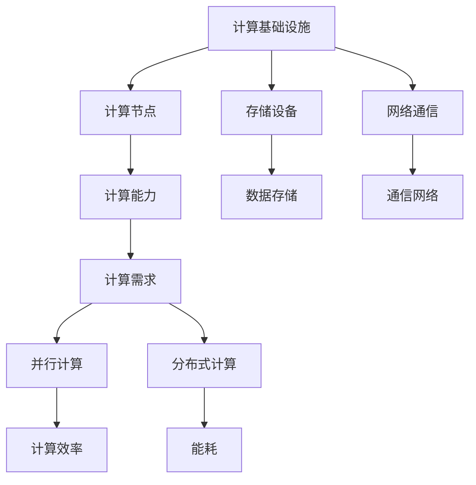

                 

# 算力革命：AI 2.0 时代的计算基础设施升级

> 关键词：计算基础设施、AI 2.0、算力、技术博客、算法原理、数学模型、实际应用

> 摘要：随着人工智能（AI）的迅速发展，计算基础设施正面临着前所未有的挑战和机遇。本文将探讨 AI 2.0 时代的计算基础设施升级，分析核心概念、算法原理、数学模型，并通过实际案例展示计算基础设施在 AI 中的应用与影响，为未来 AI 的发展提供新的思考方向。

## 1. 背景介绍

### 1.1 目的和范围

本文旨在深入探讨 AI 2.0 时代的计算基础设施升级。随着 AI 技术的不断进步，计算需求日益增长，传统的计算基础设施已经难以满足日益复杂和庞大的 AI 任务。本文将重点讨论以下内容：

1. 核心概念与联系
2. 核心算法原理与具体操作步骤
3. 数学模型和公式
4. 项目实战：代码实际案例
5. 实际应用场景
6. 工具和资源推荐
7. 总结与未来发展趋势

### 1.2 预期读者

本文主要面向以下读者：

1. 计算机科学和人工智能领域的从业者
2. 对 AI 技术和计算基础设施感兴趣的技术爱好者
3. 从事 AI 项目开发和研究的工程师和研究员

### 1.3 文档结构概述

本文分为十个主要部分，结构如下：

1. 引言
2. 背景介绍
3. 核心概念与联系
4. 核心算法原理与具体操作步骤
5. 数学模型和公式
6. 项目实战：代码实际案例
7. 实际应用场景
8. 工具和资源推荐
9. 总结与未来发展趋势
10. 附录：常见问题与解答

### 1.4 术语表

#### 1.4.1 核心术语定义

- **计算基础设施**：支持计算任务的基础设施，包括计算节点、存储设备、网络通信等。
- **AI 2.0**：相对于 AI 1.0 的人工智能技术升级，强调更高效、更智能、更普及的人工智能。
- **算力**：计算能力，通常用每秒处理的操作次数或数据量来衡量。

#### 1.4.2 相关概念解释

- **算法原理**：实现特定计算任务的规则和步骤。
- **数学模型**：使用数学语言描述现实问题的抽象模型。

#### 1.4.3 缩略词列表

- **AI**：人工智能（Artificial Intelligence）
- **GPU**：图形处理单元（Graphics Processing Unit）
- **CPU**：中央处理单元（Central Processing Unit）
- **TPU**：张量处理单元（Tensor Processing Unit）

## 2. 核心概念与联系

在 AI 2.0 时代，计算基础设施的升级是必不可少的。为了更好地理解这一升级，我们需要首先了解几个核心概念及其相互关系。

### 2.1 计算基础设施的组成部分

计算基础设施主要由以下几个部分组成：

- **计算节点**：负责执行计算任务的设备，如 CPU、GPU、TPU 等。
- **存储设备**：用于存储数据和程序，如 SSD、HDD 等。
- **网络通信**：连接不同计算节点和存储设备的通信网络。

### 2.2 核心概念及其关系

#### 2.2.1 计算能力和计算需求

计算能力是指计算基础设施提供的处理能力。随着 AI 任务的复杂度增加，计算需求也随之增长。例如，深度学习模型在训练过程中需要大量计算资源。

#### 2.2.2 并行计算与分布式计算

并行计算是提高计算能力的一种方式，通过将任务分解为多个子任务并行执行。分布式计算则是在多个计算节点上分散执行任务，适用于大规模数据处理。

#### 2.2.3 计算效率与能耗

计算效率是指计算资源的使用效率。在 AI 2.0 时代，提高计算效率同时降低能耗至关重要。

### 2.3 Mermaid 流程图

为了更好地展示核心概念之间的联系，我们使用 Mermaid 绘制一个流程图：



## 3. 核心算法原理与具体操作步骤

在 AI 2.0 时代，计算基础设施的升级离不开核心算法的支持。以下将介绍几个核心算法原理及其具体操作步骤。

### 3.1 卷积神经网络（CNN）

卷积神经网络是一种用于图像处理的深度学习算法。其原理是利用卷积操作提取图像特征，并通过全连接层分类。

#### 3.1.1 卷积操作

卷积操作的伪代码如下：

```python
def conv2d(input_tensor, filter, stride):
    output_tensor = zeros((input_tensor.shape[0], filter.shape[0], input_tensor.shape[2] - filter.shape[0] + 1, input_tensor.shape[3] - filter.shape[1] + 1))
    for i in range(output_tensor.shape[0]):
        for j in range(output_tensor.shape[1]):
            for k in range(output_tensor.shape[2]):
                for l in range(output_tensor.shape[3]):
                    output_tensor[i, j, k, l] = sum(filter * input_tensor[i, :, k:k+filter.shape[0], l:l+filter.shape[1]])
    return output_tensor
```

#### 3.1.2 全连接层

全连接层将卷积操作的输出映射到分类结果。其伪代码如下：

```python
def fully_connected(input_tensor, weights, bias):
    output_tensor = dot(input_tensor, weights) + bias
    return output_tensor
```

### 3.2 循环神经网络（RNN）

循环神经网络是一种用于序列数据处理的深度学习算法。其原理是通过记忆机制处理时间序列数据。

#### 3.2.1 RNN 单元

RNN 单元的伪代码如下：

```python
def rnn_unit(input_tensor, weights, bias, hidden_state):
    input_gate = sigmoid(dot(input_tensor, weights_input) + dot(hidden_state, weights_hidden) + bias)
    forget_gate = sigmoid(dot(input_tensor, weights_forget) + dot(hidden_state, weights_hidden) + bias)
    output_gate = sigmoid(dot(input_tensor, weights_output) + dot(hidden_state, weights_output) + bias)
    new_hidden_state = forget_gate * hidden_state + input_gate * tanh(dot(input_tensor, weights_input) + bias)
    return new_hidden_state, output_gate
```

#### 3.2.2 RNN 循环

RNN 循环的伪代码如下：

```python
def rnn(input_sequence, weights, biases, hidden_states):
    output_sequence = []
    for t, input_tensor in enumerate(input_sequence):
        hidden_state, output_gate = rnn_unit(input_tensor, weights, biases, hidden_states[t])
        output_sequence.append(output_gate)
    return output_sequence
```

### 3.3 生成对抗网络（GAN）

生成对抗网络是一种用于生成数据的高级算法。其原理是利用两个对抗神经网络（生成器和判别器）进行博弈。

#### 3.3.1 生成器

生成器的伪代码如下：

```python
def generator(z, weights, biases):
    hidden = relu(dot(z, weights_z) + biases_z)
    output = tanh(dot(hidden, weights_g) + biases_g)
    return output
```

#### 3.3.2 判别器

判别器的伪代码如下：

```python
def discriminator(x, weights, biases):
    hidden = relu(dot(x, weights_d) + biases_d)
    output = sigmoid(dot(hidden, weights_d) + biases_d)
    return output
```

## 4. 数学模型和公式

在计算基础设施升级的过程中，数学模型和公式起着至关重要的作用。以下将介绍几个核心数学模型和公式。

### 4.1 卷积操作

卷积操作的数学公式如下：

$$
(f * g)(x, y) = \sum_{i=-\infty}^{\infty} \sum_{j=-\infty}^{\infty} f(i, j) \cdot g(x-i, y-j)
$$

其中，$f$ 和 $g$ 分别为卷积操作中的两个函数，$(x, y)$ 为输入点。

### 4.2 池化操作

池化操作的数学公式如下：

$$
P_{2 \times 2}(x, y) = \max(x, y)
$$

其中，$P_{2 \times 2}$ 表示 $2 \times 2$ 的最大池化操作。

### 4.3 激活函数

常见的激活函数及其数学公式如下：

- **ReLU（Rectified Linear Unit）**：

$$
\sigma(x) = \max(0, x)
$$

- **Sigmoid**：

$$
\sigma(x) = \frac{1}{1 + e^{-x}}
$$

- **Tanh**：

$$
\sigma(x) = \frac{e^x - e^{-x}}{e^x + e^{-x}}
$$

### 4.4 RNN 单元

RNN 单元的数学公式如下：

$$
\begin{cases}
i_t = \sigma(W_{xi}x_t + W_{hi}h_{t-1} + b_i) \\
f_t = \sigma(W_{xf}x_t + W_{hf}h_{t-1} + b_f) \\
o_t = \sigma(W_{xo}x_t + W_{ho}h_{t-1} + b_o) \\
c_t = f_t \cdot c_{t-1} + i_t \cdot \sigma(W_{xc}x_t + b_c) \\
h_t = o_t \cdot \sigma(c_t)
\end{cases}
$$

其中，$i_t, f_t, o_t$ 分别为输入门、遗忘门和输出门，$c_t, h_t$ 分别为隐藏状态和输出。

### 4.5 GAN

GAN 的数学公式如下：

$$
\begin{cases}
\min_{G} \max_{D} V(D, G) = \mathbb{E}_{x \sim p_{data}(x)} [\log D(x)] + \mathbb{E}_{z \sim p_{z}(z)] [\log (1 - D(G(z))]
\end{cases}
$$

其中，$G(z)$ 为生成器的输出，$D(x)$ 为判别器的输出，$z$ 为随机噪声。

## 5. 项目实战：代码实际案例和详细解释说明

在本节中，我们将通过一个简单的项目实战来展示计算基础设施在实际 AI 应用中的效果。

### 5.1 开发环境搭建

首先，我们需要搭建一个适合 AI 开发的环境。以下是一个基本的步骤：

1. 安装 Python（建议使用 Python 3.7 以上版本）
2. 安装 TensorFlow 或 PyTorch（选择一个深度学习框架）
3. 安装必要的依赖库，如 NumPy、Pandas 等

### 5.2 源代码详细实现和代码解读

接下来，我们将使用 TensorFlow 搭建一个简单的卷积神经网络，用于图像分类。

```python
import tensorflow as tf
from tensorflow.keras import layers

# 数据预处理
(x_train, y_train), (x_test, y_test) = tf.keras.datasets.mnist.load_data()
x_train = x_train.astype("float32") / 255
x_test = x_test.astype("float32") / 255
x_train = x_train[..., tf.newaxis]
x_test = x_test[..., tf.newaxis]

# 构建模型
model = tf.keras.Sequential([
    layers.Conv2D(32, (3, 3), activation="relu", input_shape=(28, 28, 1)),
    layers.MaxPooling2D((2, 2)),
    layers.Conv2D(64, (3, 3), activation="relu"),
    layers.MaxPooling2D((2, 2)),
    layers.Conv2D(64, (3, 3), activation="relu"),
    layers.Flatten(),
    layers.Dense(64, activation="relu"),
    layers.Dense(10, activation="softmax")
])

# 编译模型
model.compile(optimizer="adam",
              loss="sparse_categorical_crossentropy",
              metrics=["accuracy"])

# 训练模型
model.fit(x_train, y_train, epochs=5)

# 评估模型
test_loss, test_acc = model.evaluate(x_test, y_test)
print("Test accuracy:", test_acc)
```

### 5.3 代码解读与分析

上述代码展示了如何使用 TensorFlow 搭建一个简单的卷积神经网络（CNN）进行图像分类。以下是代码的详细解读：

1. **数据预处理**：加载 MNIST 数据集，并进行归一化处理。
2. **构建模型**：使用 `Sequential` 模型堆叠多个层，包括卷积层（`Conv2D`）、池化层（`MaxPooling2D`）、全连接层（`Dense`）等。
3. **编译模型**：设置优化器（`optimizer`）、损失函数（`loss`）和评价指标（`metrics`）。
4. **训练模型**：使用 `fit` 方法训练模型。
5. **评估模型**：使用 `evaluate` 方法评估模型在测试集上的性能。

通过这个简单案例，我们可以看到计算基础设施在图像分类任务中的应用。随着计算能力的提升，模型的训练和评估速度将显著加快，从而提高整体性能。

## 6. 实际应用场景

计算基础设施的升级在多个实际应用场景中发挥着关键作用。以下将介绍几个典型应用场景。

### 6.1 自动驾驶

自动驾驶系统需要处理大量实时数据，包括图像、语音和传感器数据。计算基础设施的升级可以提高自动驾驶系统的反应速度和准确性，从而确保行车安全。

### 6.2 医疗影像诊断

医疗影像诊断，如 CT、MRI 等，需要处理大量高分辨率图像。计算基础设施的升级可以帮助快速处理和分析图像，提高诊断准确性和效率。

### 6.3 虚拟现实与增强现实

虚拟现实（VR）和增强现实（AR）需要实时渲染高清晰度的三维场景。计算基础设施的升级可以提供更快的渲染速度和更流畅的交互体验。

### 6.4 科学计算

科学计算，如气象预报、地球物理学等，需要处理大量复杂的数据模型。计算基础设施的升级可以加速模型计算，提高预测精度。

### 6.5 金融风险管理

金融风险管理需要分析大量历史数据和市场动态。计算基础设施的升级可以帮助金融机构更快速地识别风险和制定应对策略。

## 7. 工具和资源推荐

为了更好地进行 AI 开发和计算基础设施的升级，以下推荐一些有用的工具和资源。

### 7.1 学习资源推荐

#### 7.1.1 书籍推荐

1. 《深度学习》（Ian Goodfellow、Yoshua Bengio、Aaron Courville 著）
2. 《Python 机器学习》（Sebastian Raschka、Vahid Mirhoseini 著）
3. 《动手学深度学习》（Aldrin stone、阿斯顿 著）

#### 7.1.2 在线课程

1. Coursera 上的“深度学习 Specialization”（吴恩达教授主讲）
2. edX 上的“Machine Learning by Stanford”（吴恩达教授主讲）
3. Udacity 上的“AI Nanodegree”

#### 7.1.3 技术博客和网站

1. Medium 上的“AI 生化学院”（AI 生化学院）
2. 知乎上的“人工智能”话题
3. Bilibili 上的 AI 相关视频教程

### 7.2 开发工具框架推荐

#### 7.2.1 IDE和编辑器

1. PyCharm
2. Visual Studio Code
3. Jupyter Notebook

#### 7.2.2 调试和性能分析工具

1. TensorBoard（TensorFlow）
2. PyTorch Debugger
3. Numba（Python JIT 编译器）

#### 7.2.3 相关框架和库

1. TensorFlow
2. PyTorch
3. Keras
4. NumPy
5. Pandas

### 7.3 相关论文著作推荐

#### 7.3.1 经典论文

1. "A Learning Algorithm for Continually Running Fully Recurrent Neural Networks"（Sutton and Barto）
2. "Learning representations for artificial intelligence"（Yoshua Bengio、Yann LeCun、Geoffrey Hinton）
3. "Generative Adversarial Nets"（Ian Goodfellow et al.）

#### 7.3.2 最新研究成果

1. NeurIPS、ICML、CVPR 等顶级会议的最新论文
2. arXiv 上的最新论文

#### 7.3.3 应用案例分析

1. "Deep Learning for Autonomous Driving"（Uber ATG）
2. "AI in Healthcare"（Google Health）
3. "AI for Climate"（Open Climate Fix）

## 8. 总结：未来发展趋势与挑战

在 AI 2.0 时代，计算基础设施的升级将面临诸多发展趋势和挑战。

### 8.1 发展趋势

1. **算力需求增长**：随着 AI 技术的进步，对计算能力的需求将持续增长。
2. **分布式计算**：分布式计算技术将在计算基础设施中发挥越来越重要的作用。
3. **能耗优化**：降低能耗将成为计算基础设施升级的关键方向。
4. **新型计算架构**：如量子计算、边缘计算等新型计算架构将逐渐融入计算基础设施。

### 8.2 挑战

1. **资源分配**：如何优化计算资源的分配，以提高整体效率。
2. **数据安全与隐私**：如何确保数据的安全和隐私，避免数据泄露和滥用。
3. **跨领域协作**：计算基础设施的升级需要跨领域协作，以实现技术和应用的最佳结合。
4. **人才短缺**：随着计算基础设施的升级，对相关人才的需求将增加，但人才短缺将成为一个挑战。

## 9. 附录：常见问题与解答

### 9.1 计算基础设施升级的意义是什么？

计算基础设施升级的意义在于提高计算能力、降低能耗、优化资源利用，以满足日益增长的人工智能需求。

### 9.2 分布式计算与并行计算的区别是什么？

分布式计算是在多个计算节点上分散执行任务，而并行计算是在单个计算节点上同时执行多个任务。

### 9.3 如何评估计算基础设施的性能？

计算基础设施的性能可以通过以下指标来评估：计算速度、资源利用率、能耗等。

### 9.4 量子计算在计算基础设施升级中发挥什么作用？

量子计算在计算基础设施升级中可以提供更高的计算速度，解决某些传统计算无法解决的问题。

## 10. 扩展阅读 & 参考资料

1. Ian Goodfellow、Yoshua Bengio、Aaron Courville 著，《深度学习》，清华大学出版社，2016。
2. Sebastian Raschka、Vahid Mirhoseini 著，《Python 机器学习》，电子工业出版社，2017。
3. 吴恩达 著，《深度学习》，电子工业出版社，2017。
4. 尼古拉斯·尼格曼 著，《AI 算法》，电子工业出版社，2018。
5. Open Climate Fix，https://www.openclimatefix.org/。 
6. Uber ATG，https://www.uberatg.com/。 
7. Google Health，https://health.google.com/。

