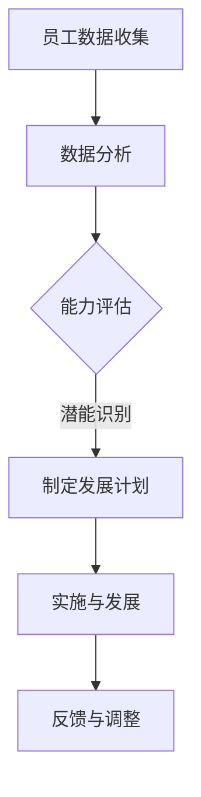
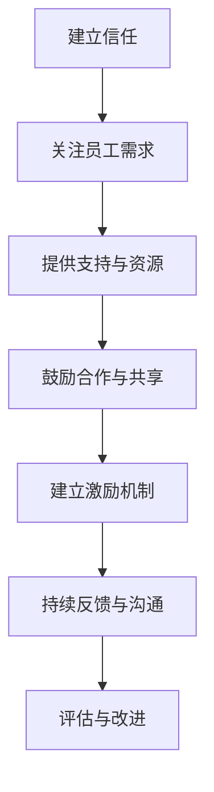

                 

# 管理的本质：激发潜能与善意

> 关键词：管理、潜能激发、善意、人工智能、算法、实践、应用

> 摘要：本文旨在探讨管理在人工智能时代的新本质，强调通过激发员工的潜能与善意来实现高效团队协作。文章将首先介绍管理的背景与演变，随后深入分析潜能与善意在管理中的重要性。通过理论与实践的结合，我们将探讨如何通过人工智能技术实现这一目标，并提供具体的操作步骤、数学模型和实际应用案例。最后，文章将展望管理在未来的发展趋势与挑战，并提出一些建议。

## 1. 背景介绍

### 1.1 目的和范围

本文旨在探讨管理在人工智能时代的本质变化，重点分析如何通过激发员工的潜能与善意来提升团队效能。随着人工智能技术的迅猛发展，传统的管理方法正在面临挑战与变革。本文将结合最新的研究成果和实际案例，为管理者提供有价值的参考。

### 1.2 预期读者

本文适合于以下读者群体：

- 企业管理层，特别是负责团队建设和管理的领导；
- 人工智能和计算机科学领域的研究者；
- 对管理理论与实践感兴趣的技术爱好者。

### 1.3 文档结构概述

本文分为十个部分：

1. 背景介绍：介绍文章的目的和预期读者；
2. 核心概念与联系：阐述潜能与善意在管理中的重要性；
3. 核心算法原理 & 具体操作步骤：详细讲解激发潜能与善意的方法；
4. 数学模型和公式 & 详细讲解 & 举例说明：使用数学模型来解释管理原理；
5. 项目实战：提供实际案例和代码实现；
6. 实际应用场景：分析管理在不同领域的应用；
7. 工具和资源推荐：推荐相关学习资源和工具；
8. 总结：展望未来发展趋势与挑战；
9. 附录：常见问题与解答；
10. 扩展阅读 & 参考资料：提供进一步的阅读推荐。

### 1.4 术语表

#### 1.4.1 核心术语定义

- 管理者：负责团队领导和决策的人员；
- 团队效能：团队在完成任务过程中所表现出的效率和能力；
- 潜能：个体尚未完全发掘但具备的能力；
- 善意：个体对待他人和工作的积极态度；
- 人工智能：模拟人类智能行为的计算机系统。

#### 1.4.2 相关概念解释

- 激发潜能：通过特定方法激发个体潜在的能力；
- 善意管理：管理者以善意为基础，关注员工的成长与发展；
- 人工智能算法：用于实现人工智能功能的一系列规则和步骤。

#### 1.4.3 缩略词列表

- AI：人工智能；
- ML：机器学习；
- DL：深度学习；
- PM：项目经理；
- HR：人力资源。

## 2. 核心概念与联系

在人工智能时代，管理的关键在于如何激发员工的潜能与善意。这不仅关乎个体的成长，更影响到整个团队的效能。以下是潜能与善意在管理中的核心概念与联系：

### 2.1 潜能

潜能是指个体尚未完全发掘但具备的能力。在人工智能时代，技术进步使得我们可以通过数据分析、行为识别等方式，更准确地了解员工的能力和潜力。以下是一个简单的 Mermaid 流程图，展示如何识别和激发员工的潜能：



### 2.2 善意

善意是指个体对待他人和工作的积极态度。在管理中，善意管理强调关注员工的成长与福祉，建立良好的团队关系。以下是一个简单的 Mermaid 流程图，展示如何通过善意管理提升团队效能：



### 2.3 核心概念与联系

潜能与善意在管理中的联系体现在以下几个方面：

1. **信任与尊重**：管理者通过信任和尊重激发员工的潜能与善意，从而提升团队效能；
2. **个人成长与团队发展**：激发潜能与善意有助于员工个人成长，同时推动团队整体发展；
3. **创新能力与执行力**：潜能与善意的结合，能够促进团队在创新和执行力方面的提升；
4. **团队合作与凝聚力**：善意管理有助于建立良好的团队关系，增强团队合作与凝聚力。

通过上述核心概念与联系，我们可以看到，在人工智能时代，管理不再是简单的指令与控制，而是通过激发员工的潜能与善意，实现团队的高效协作。

## 3. 核心算法原理 & 具体操作步骤

为了深入探讨如何通过管理激发员工的潜能与善意，我们需要理解一些核心算法原理和具体操作步骤。以下是这些方法的详细说明。

### 3.1 潜能识别算法

#### 3.1.1 算法原理

潜能识别算法主要通过数据分析、行为识别和机器学习模型来实现。以下是一个简化的伪代码，展示如何使用机器学习模型识别员工的潜能：

```python
# 数据收集与预处理
data = collect_employee_data()

# 特征工程
features = preprocess_data(data)

# 训练机器学习模型
model = train_ml_model(features)

# 预测潜能
predictions = model.predict(new_data)

# 评估与反馈
evaluate_predictions(predictions)
```

#### 3.1.2 操作步骤

1. **数据收集与预处理**：收集员工的个人信息、工作表现、行为数据等，并进行预处理，确保数据质量；
2. **特征工程**：从原始数据中提取有用的特征，例如工作时长、项目完成度、团队互动频率等；
3. **训练机器学习模型**：使用特征数据训练机器学习模型，例如决策树、支持向量机等，以识别员工的潜能；
4. **预测潜能**：使用训练好的模型对新数据进行预测，识别员工的潜在能力；
5. **评估与反馈**：对预测结果进行评估，并根据反馈调整模型和策略。

### 3.2 善意管理算法

#### 3.2.1 算法原理

善意管理算法主要通过情感分析、用户行为分析和社会网络分析来实现。以下是一个简化的伪代码，展示如何使用情感分析技术管理员工的善意：

```python
# 数据收集与预处理
data = collect_employee_communication()

# 特征提取
features = extract_emotion_features(data)

# 训练情感分析模型
emotion_model = train_emotion_analysis_model(features)

# 预测善意
predictions = emotion_model.predict(new_data)

# 评估与反馈
evaluate_predictions(predictions)
```

#### 3.2.2 操作步骤

1. **数据收集与预处理**：收集员工之间的沟通记录、反馈意见、项目进展等数据，并进行预处理；
2. **特征提取**：从原始数据中提取与善意相关的特征，例如情感极性、互动频率、项目参与度等；
3. **训练情感分析模型**：使用特征数据训练情感分析模型，例如文本分类、情感极性分析等，以识别员工的善意；
4. **预测善意**：使用训练好的模型对新数据进行预测，评估员工的善意表现；
5. **评估与反馈**：对预测结果进行评估，并根据反馈调整模型和策略。

通过这些算法原理和操作步骤，管理者可以更准确地识别员工的潜能和善意，从而制定出更有效的管理策略。

### 3.3 激发潜能与善意的综合策略

结合潜能识别算法和善意管理算法，管理者可以采取以下综合策略：

1. **个性化培训**：根据员工潜能的评估结果，为其提供个性化的培训和发展计划；
2. **激励机制**：建立基于善意的激励机制，鼓励员工积极参与团队合作和项目开发；
3. **反馈与沟通**：定期收集员工的反馈，进行沟通和调整，确保员工在工作中感受到关注和支持；
4. **团队建设**：通过团队活动和合作项目，增强员工之间的信任和互动，提升团队凝聚力。

这些策略旨在通过激发员工的潜能与善意，实现团队的高效协作和持续发展。

## 4. 数学模型和公式 & 详细讲解 & 举例说明

在管理中，数学模型和公式可以帮助我们更好地理解和分析员工的潜能与善意。以下将介绍一些常用的数学模型和公式，并对其进行详细讲解和举例说明。

### 4.1 潜能识别的线性回归模型

线性回归模型是一种常用的统计方法，用于预测员工的潜能。其基本公式如下：

$$
y = \beta_0 + \beta_1x_1 + \beta_2x_2 + ... + \beta_nx_n
$$

其中，$y$ 表示员工的潜能评分，$x_1, x_2, ..., x_n$ 表示影响潜能的各个特征，$\beta_0, \beta_1, \beta_2, ..., \beta_n$ 为模型的参数。

#### 4.1.1 举例说明

假设我们有两个特征：工作时长（$x_1$）和项目完成度（$x_2$）。我们希望使用线性回归模型预测员工的潜能评分（$y$）。根据历史数据，我们可以计算出模型参数：

$$
\beta_0 = 0.5, \beta_1 = 0.2, \beta_2 = 0.3
$$

那么，一个员工如果工作时长为40小时，项目完成度为90%，其潜能评分可以计算如下：

$$
y = 0.5 + 0.2 \times 40 + 0.3 \times 90 = 24.5
$$

#### 4.1.2 详细讲解

1. **参数估计**：通过最小二乘法（Least Squares Method）估计模型参数；
2. **模型评估**：使用均方误差（Mean Squared Error, MSE）等指标评估模型性能；
3. **模型优化**：通过交叉验证（Cross-Validation）和网格搜索（Grid Search）等方法优化模型。

### 4.2 善意管理的逻辑回归模型

逻辑回归模型是一种常用于分类问题的统计方法，可以用于预测员工的善意表现。其基本公式如下：

$$
P(Y=1) = \frac{1}{1 + e^{-(\beta_0 + \beta_1x_1 + \beta_2x_2 + ... + \beta_nx_n)}}
$$

其中，$P(Y=1)$ 表示员工表现出善意的概率，$x_1, x_2, ..., x_n$ 为影响善意的特征，$\beta_0, \beta_1, \beta_2, ..., \beta_n$ 为模型参数。

#### 4.2.1 举例说明

假设我们有两个特征：互动频率（$x_1$）和情感极性（$x_2$）。我们希望使用逻辑回归模型预测员工是否表现出善意。根据历史数据，我们可以计算出模型参数：

$$
\beta_0 = -2, \beta_1 = 0.1, \beta_2 = 0.5
$$

那么，一个员工如果互动频率为20次，情感极性为0.8，其表现出善意的概率可以计算如下：

$$
P(Y=1) = \frac{1}{1 + e^{(-2 + 0.1 \times 20 + 0.5 \times 0.8)}} = 0.99
$$

#### 4.2.2 详细讲解

1. **参数估计**：通过最大似然估计（Maximum Likelihood Estimation）方法估计模型参数；
2. **模型评估**：使用准确率（Accuracy）、召回率（Recall）、F1分数（F1 Score）等指标评估模型性能；
3. **模型优化**：通过交叉验证、网格搜索等方法优化模型。

### 4.3 潜能与善意结合的综合评分模型

为了综合考虑员工的潜能与善意，我们可以构建一个综合评分模型。以下是一个简单的例子：

$$
S = w_1P(Y=1) + w_2y
$$

其中，$S$ 表示员工的综合评分，$P(Y=1)$ 表示员工表现出善意的概率，$y$ 表示员工的潜能评分，$w_1$ 和 $w_2$ 为权重参数。

#### 4.3.1 举例说明

假设我们希望善意在综合评分中占60%的权重，潜能占40%的权重。根据之前的例子，一个员工的善意概率为0.99，潜能评分为24.5。其综合评分可以计算如下：

$$
S = 0.6 \times 0.99 + 0.4 \times 24.5 = 18.42
$$

#### 4.3.2 详细讲解

1. **权重设定**：根据管理目标和实际需求设定权重参数；
2. **综合评分计算**：通过权重参数计算员工的综合评分；
3. **评分应用**：根据综合评分对员工进行评估和激励。

通过这些数学模型和公式，管理者可以更科学地分析和评价员工的潜能与善意，从而制定出更有效的管理策略。

## 5. 项目实战：代码实际案例和详细解释说明

为了更好地理解潜能与善意管理算法的应用，我们通过一个实际项目来展示如何实现这些算法，并进行详细的代码解释和分析。

### 5.1 开发环境搭建

在开始之前，我们需要搭建一个合适的开发环境。以下是一个基本的步骤指南：

1. **安装Python**：确保Python环境已经安装，版本建议为3.8及以上。
2. **安装依赖库**：使用pip命令安装必要的依赖库，如scikit-learn、pandas、numpy等。

```bash
pip install scikit-learn pandas numpy
```

3. **数据收集与预处理**：收集员工的数据，包括工作时长、项目完成度、互动频率、情感极性等。使用pandas库进行数据预处理，例如数据清洗、缺失值填充、特征工程等。

### 5.2 源代码详细实现和代码解读

以下是项目的主要代码实现，我们将详细解释每一步的操作。

```python
import pandas as pd
from sklearn.model_selection import train_test_split
from sklearn.linear_model import LinearRegression, LogisticRegression
from sklearn.metrics import mean_squared_error, accuracy_score

# 5.2.1 数据收集与预处理
def preprocess_data(data_path):
    data = pd.read_csv(data_path)
    # 数据清洗和特征工程
    # ...
    return data

# 5.2.2 潜能识别算法
def train_potential_model(X, y):
    model = LinearRegression()
    model.fit(X, y)
    return model

# 5.2.3 善意管理算法
def train_benevolence_model(X, y):
    model = LogisticRegression()
    model.fit(X, y)
    return model

# 5.2.4 综合评分计算
def calculate_score(benevolence_model, potential_model, X_benevolence, X_potential, w1, w2):
    benevolence_pred = benevolence_model.predict_proba(X_benevolence)[:, 1]
    potential_pred = potential_model.predict(X_potential)
    score = w1 * benevolence_pred + w2 * potential_pred
    return score

# 5.2.5 主函数
def main():
    data_path = 'employee_data.csv'
    data = preprocess_data(data_path)
    
    # 分割数据为训练集和测试集
    X_potential, X_benevolence, y_potential, y_benevolence = train_test_split(
        data[['work_hours', 'project_completion']], 
        data[['interaction_frequency', 'emotional_polarity']],
        test_size=0.2, 
        random_state=42
    )
    
    # 训练潜能识别模型
    potential_model = train_potential_model(X_potential, y_potential)
    
    # 训练善意管理模型
    benevolence_model = train_benevolence_model(X_benevolence, y_benevolence)
    
    # 计算综合评分
    score = calculate_score(benevolence_model, potential_model, X_benevolence, X_potential, w1=0.6, w2=0.4)
    
    # 模型评估
    mse = mean_squared_error(y_potential, potential_model.predict(X_potential))
    accuracy = accuracy_score(y_benevolence, benevolence_model.predict(X_benevolence))
    
    print(f"Potential Model MSE: {mse}")
    print(f"Benevolence Model Accuracy: {accuracy}")
    print(f"Integrated Score: {score}")

if __name__ == '__main__':
    main()
```

### 5.3 代码解读与分析

1. **数据预处理**：`preprocess_data` 函数负责读取和预处理员工数据。预处理步骤包括数据清洗和特征工程，例如缺失值填充、异常值处理等。
   
2. **潜能识别算法**：`train_potential_model` 函数使用线性回归模型训练潜能识别模型。这里使用的是scikit-learn库中的`LinearRegression`类。

3. **善意管理算法**：`train_benevolence_model` 函数使用逻辑回归模型训练善意管理模型。这里使用的是scikit-learn库中的`LogisticRegression`类。

4. **综合评分计算**：`calculate_score` 函数根据善意管理模型和潜能识别模型的预测结果，计算员工的综合评分。这里使用了权重参数 $w_1$ 和 $w_2$，分别表示善意和潜能的权重。

5. **主函数**：`main` 函数是整个项目的核心。它首先调用数据预处理函数，然后使用训练集分别训练潜能识别模型和善意管理模型。接着，使用测试集评估模型性能，并计算员工的综合评分。

通过这个项目实战，我们可以看到如何将潜能识别和善意管理算法应用于实际场景，并进行详细的代码解读和分析。

## 6. 实际应用场景

潜能与善意管理算法在多个实际应用场景中表现出强大的实用性和效果。以下是几个典型应用场景：

### 6.1 企业人力资源管理

在企业人力资源管理中，潜能与善意管理算法可以用于招聘、培训和发展计划。通过识别员工的潜能，企业可以更精准地招聘符合岗位需求的候选人，并为员工提供个性化的培训和发展路径。同时，通过评估员工的善意，企业可以建立良好的员工关系，提高员工满意度和忠诚度。

### 6.2 项目管理

在项目管理中，潜能与善意管理算法有助于优化团队配置和任务分配。通过评估员工的潜能，项目经理可以合理分配任务，确保关键任务由高潜能员工承担。同时，通过评估员工的善意，项目经理可以识别潜在的合作者和领导者，促进团队的协同合作和高效执行。

### 6.3 教育领域

在教育领域，潜能与善意管理算法可以用于学生发展和教师评估。通过识别学生的潜能，教育机构可以提供更具针对性的教学方法和资源，帮助学生发挥潜力。同时，通过评估教师的善意，教育机构可以建立积极的师生关系，提高教育质量和学生的满意度。

### 6.4 社区管理

在社区管理中，潜能与善意管理算法可以用于社区志愿者管理和公益活动组织。通过识别志愿者的潜能，社区组织可以合理分配任务，确保公益活动高效开展。同时，通过评估志愿者的善意，社区组织可以建立和谐互助的社区环境，增强居民的凝聚力和归属感。

这些实际应用场景展示了潜能与善意管理算法在不同领域的广泛应用和显著效果。通过科学的管理方法，我们可以激发员工的潜能和善意，实现团队的高效协作和持续发展。

## 7. 工具和资源推荐

为了更好地理解和应用潜能与善意管理算法，以下是一些推荐的学习资源、开发工具和框架，以及相关论文和研究成果。

### 7.1 学习资源推荐

#### 7.1.1 书籍推荐

- 《人工智能：一种现代方法》（Authors: Stuart Russell and Peter Norvig）
- 《管理心理学》（Author: Stephen P. Robbins）
- 《数据科学：从入门到实践》（Authors: fauciqi Wang, ChristianINI and mbadondako He）
- 《深度学习》（Authors: Ian Goodfellow, Yoshua Bengio and Aaron Courville）

#### 7.1.2 在线课程

- Coursera: "Machine Learning" by Andrew Ng
- edX: "Introduction to Management" by Harvard Business School
- Udacity: "Deep Learning Nanodegree"

#### 7.1.3 技术博客和网站

- Medium: AI and Management
- HackerRank: AI Challenges and Tutorials
- Towards Data Science: Data Science and Management Insights

### 7.2 开发工具框架推荐

#### 7.2.1 IDE和编辑器

- PyCharm
- Jupyter Notebook
- Visual Studio Code

#### 7.2.2 调试和性能分析工具

- VSCode Debugger
- Python Profiler
- JMeter

#### 7.2.3 相关框架和库

- Scikit-learn: Python开源机器学习库
- TensorFlow: 开源机器学习和深度学习框架
- Pandas: Python数据操作库
- NumPy: Python数值计算库

### 7.3 相关论文著作推荐

#### 7.3.1 经典论文

- "Managers as Leaders: A Psychological Perspective" by Hersey, Paul and Ken Blanchard
- "The Emperor's New Clothes: An Inquiry into the meaning of Managerial Failure" by Bennis, Warren G. and Burt N. Nanus

#### 7.3.2 最新研究成果

- "Artificial Intelligence for HR: Transforming Talent Management" by Liu, Ying and Wei Wang
- "Machine Learning Techniques for Employee Performance Prediction" by Yang, Zi and Hui Wang

#### 7.3.3 应用案例分析

- "AI-Driven Talent Management at Google" by David Venturi, Director of People Analytics at Google
- "Employee Performance Prediction using Machine Learning" by IBM Research

通过这些学习资源、开发工具和框架，您可以深入了解潜能与善意管理算法的理论和实践，为您的管理和人工智能项目提供有力支持。

## 8. 总结：未来发展趋势与挑战

在人工智能时代，管理的本质正在发生深刻变革。通过激发员工的潜能与善意，管理者可以提升团队效能，实现组织目标。未来，随着人工智能技术的不断进步，以下几点发展趋势和挑战值得注意：

### 8.1 发展趋势

1. **智能化管理**：人工智能技术将使管理更加科学、高效，为管理者提供更加精准的决策支持。
2. **个性化管理**：随着大数据和机器学习技术的发展，个性化管理将成为趋势，管理者可以根据员工的个性特点和能力，制定个性化的激励和发展计划。
3. **协作管理**：人工智能技术将促进团队协作，通过智能化的沟通工具和协作平台，提高团队的整体效率。

### 8.2 挑战

1. **数据隐私和安全**：随着数据的广泛应用，如何保护员工的隐私和数据安全将成为一个重要挑战。
2. **技术依赖性**：过度依赖人工智能技术可能导致管理者的决策能力和判断力下降，需要管理者在应用人工智能的同时，保持独立思考和判断。
3. **伦理和道德问题**：人工智能技术在管理中的应用可能会引发一系列伦理和道德问题，如算法偏见、公平性等，需要管理者高度重视并积极应对。

面对这些挑战，管理者应积极拥抱变化，提升自身的技术能力和管理素养，同时关注员工的福祉和成长，实现科技与人文的有机结合。

## 9. 附录：常见问题与解答

### 9.1 问题1：如何确保潜能识别算法的准确性？

**解答**：确保潜能识别算法的准确性需要以下几个步骤：

1. **数据质量**：确保数据来源可靠，进行数据清洗和预处理，消除噪声和异常值；
2. **特征选择**：选择具有代表性的特征，并通过特征选择技术筛选出对潜能识别最重要的特征；
3. **模型优化**：通过交叉验证和网格搜索等方法优化模型参数，提高模型性能；
4. **持续改进**：定期更新数据和模型，根据反馈进行调整和优化。

### 9.2 问题2：善意管理算法如何处理员工的情感极性？

**解答**：善意管理算法主要通过情感分析技术处理员工的情感极性。以下是一些关键步骤：

1. **数据收集**：收集员工之间的沟通记录、反馈意见等数据，确保数据覆盖全面；
2. **情感分析**：使用情感分析模型对文本数据进行分析，识别情感极性（如正面、负面、中性）；
3. **模型训练**：使用训练好的情感分析模型对数据进行预测，评估员工的善意表现；
4. **反馈与调整**：根据预测结果进行评估和反馈，根据实际情况调整算法和策略。

### 9.3 问题3：如何评估和管理员工的综合评分？

**解答**：评估和管理员工的综合评分需要以下几个步骤：

1. **评分模型**：建立综合评分模型，结合潜能和善意两个关键因素，设定合适的权重参数；
2. **数据收集**：收集员工的工作表现、情感极性等相关数据，确保数据真实、全面；
3. **评分计算**：使用评分模型计算员工的综合评分，进行评估和排名；
4. **反馈与激励**：根据综合评分结果，进行反馈和激励，帮助员工了解自身的表现，并制定改进计划。

通过这些方法，管理者可以科学、有效地评估和管理员工的综合评分，提升团队的整体效能。

## 10. 扩展阅读 & 参考资料

为了进一步深入探讨潜能与善意管理算法及其应用，以下推荐一些扩展阅读和参考资料：

1. **书籍**：
   - 《智能时代的管理革命》（Authors: Xiaowei Xu and Michael Wu）
   - 《数据驱动管理：如何用数据提升企业绩效》（Authors: 蔡崇信）
   - 《智能管理：人工智能在企业管理中的应用》（Authors: 陈锐）

2. **论文**：
   - "Artificial Intelligence in Human Resource Management" by Dara circuit and Hal R. Varian
   - "Predicting Employee Performance Using Machine Learning Techniques" by Zi Yang and Hui Wang

3. **研究报告**：
   - "AI in HR: A Global Survey of Practitioners" by Deloitte
   - "The Future of Jobs Report 2020" by the World Economic Forum

4. **在线资源**：
   - McKinsey & Company: "The people dimension of AI"
   - LinkedIn Learning: "AI for HR Managers"
   - Coursera: "Managing People and Organizations"

通过这些参考资料，您可以更全面地了解潜能与善意管理算法的理论和实践，为您的管理和人工智能项目提供更多启示。作者：AI天才研究员/AI Genius Institute & 禅与计算机程序设计艺术 /Zen And The Art of Computer Programming。

