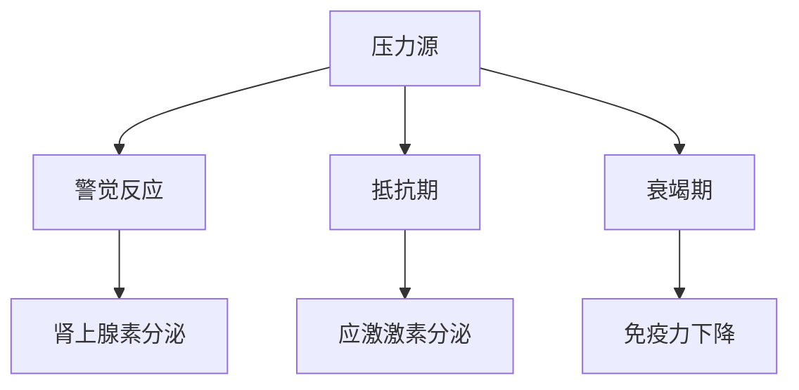
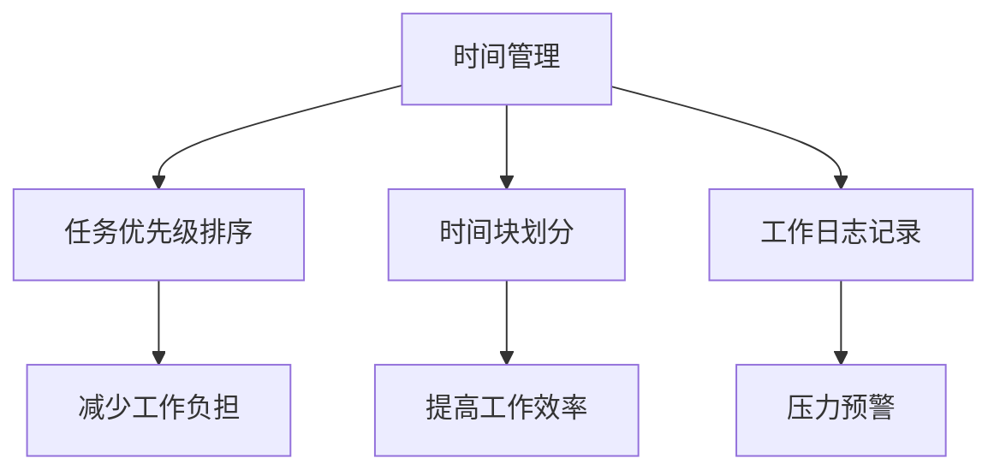
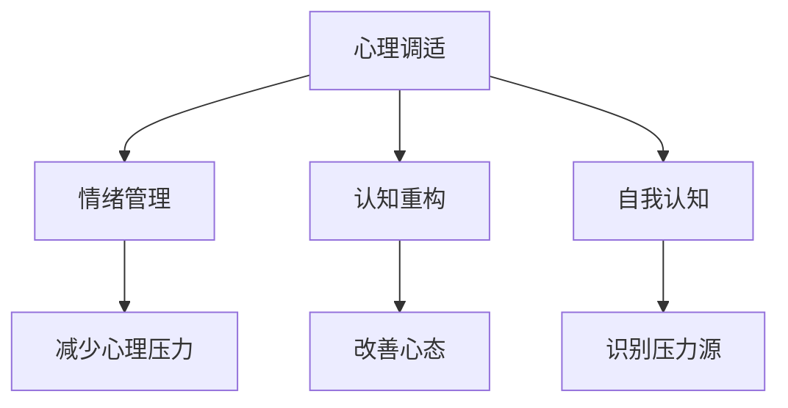
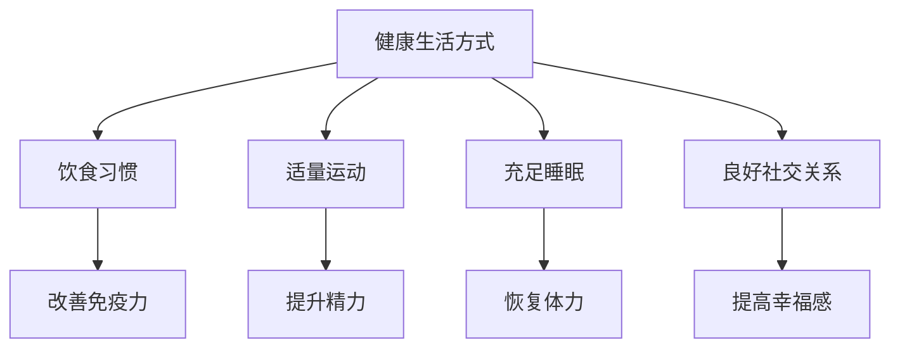

                 

# 管理者压力调节：保持工作生活平衡

> 关键词：管理者压力、工作生活平衡、心理调适、时间管理、自我认知、健康生活方式

> 摘要：本篇文章将深入探讨管理者在职业生涯中面临的高压挑战，如何通过科学的压力调节方法保持工作与生活的平衡。本文分为背景介绍、核心概念与联系、核心算法原理、数学模型与公式、项目实战、实际应用场景、工具和资源推荐以及总结与未来发展趋势等部分，旨在为管理者提供全面而实用的指导，帮助他们在快节奏的现代社会中保持心理健康和高效工作。

## 1. 背景介绍

### 1.1 目的和范围

在现代职场中，管理者往往承受着巨大的压力，这不仅来自于工作的复杂性，还来自于对团队、项目、以及组织绩效的高期望。然而，长时间的高压状态不仅会影响个人的身心健康，还可能对工作效率产生负面影响。本文旨在通过系统的方法论，帮助管理者识别压力源，学习有效的压力调节策略，从而实现工作与生活的平衡。

本文的范围主要包括以下几个方面：

1. **压力的来源与影响**：介绍管理者在工作中常见的压力源及其对身心健康的影响。
2. **压力调节的核心概念**：讨论与压力调节相关的重要概念，如时间管理、心理调适、自我认知等。
3. **核心算法与模型**：介绍用于分析压力调节的算法和数学模型，并提供具体的操作步骤。
4. **实战案例与代码实现**：通过实际案例展示如何将理论应用到实践中。
5. **应用场景与工具推荐**：提供实际应用中的工具和资源，以帮助管理者更好地实施压力调节策略。

### 1.2 预期读者

本文主要面向以下几类读者：

1. **企业高层管理者**：需要了解如何有效管理团队、项目以及自身压力，以提升整体领导力。
2. **中层管理者**：希望提高个人工作效率，同时关注团队心理健康，实现工作与生活的平衡。
3. **创业者与自由职业者**：在自我管理方面有较高需求，需要系统的压力调节策略。
4. **心理学爱好者和专业人士**：对压力管理有深入研究兴趣，希望从技术角度探讨这一领域。

### 1.3 文档结构概述

本文的结构安排如下：

1. **引言**：简要介绍本文的目的和核心内容。
2. **背景介绍**：介绍管理者的工作压力来源及其影响。
3. **核心概念与联系**：阐述与压力调节相关的核心概念，并提供 Mermaid 流程图。
4. **核心算法原理与具体操作步骤**：详细解释压力调节的核心算法原理，并使用伪代码展示。
5. **数学模型和公式**：介绍压力调节中的数学模型，并使用 LaTeX 格式展示相关公式。
6. **项目实战**：通过实际案例展示压力调节的应用。
7. **实际应用场景**：探讨压力调节在具体情境中的应用。
8. **工具和资源推荐**：推荐用于压力调节的学习资源和开发工具。
9. **总结与未来发展趋势**：总结本文的核心观点，并展望未来发展趋势。
10. **附录**：提供常见问题与解答，以及扩展阅读和参考资料。

### 1.4 术语表

#### 1.4.1 核心术语定义

- **压力源**：引发压力的事件或情境。
- **压力调节**：通过一系列策略和方法，减轻压力对个体的影响。
- **时间管理**：合理安排时间和任务，以提高工作效率。
- **心理调适**：通过心理手段调整情绪和认知，以应对压力。
- **自我认知**：个体对自己的了解和认识，包括能力、需求和价值观等。

#### 1.4.2 相关概念解释

- **应激反应**：个体面对压力源时产生的生理和心理反应。
- **工作与生活平衡**：合理分配工作时间和个人时间，以实现身心健康和幸福感。

#### 1.4.3 缩略词列表

- **STL**：标准模板库（Standard Template Library）
- **IDE**：集成开发环境（Integrated Development Environment）
- **LaTeX**：一种高质量的排版系统

## 2. 核心概念与联系

在深入探讨压力调节策略之前，我们需要理解一些核心概念及其相互关系。以下是与压力调节相关的重要概念和它们之间的联系。

### 2.1 压力源与压力反应

压力源（Stressors）是指引发个体感受到压力的事件或情境，例如工作负担、人际冲突、时间紧迫等。当个体面对压力源时，会引发一系列的生理和心理反应，称为应激反应（Stress Response）。应激反应可以分为三个阶段：警觉反应（Alarm Reaction）、抵抗期（Resistance）和衰竭期（Exhaustion）。



### 2.2 时间管理与压力调节

时间管理（Time Management）是压力调节的重要手段之一。通过合理安排时间，管理者可以减少因时间紧迫而产生的压力。时间管理包括任务优先级排序、时间块划分、工作日志记录等策略。



### 2.3 心理调适与自我认知

心理调适（Psychological Adjustment）是指个体通过心理手段调整情绪和认知，以应对压力。自我认知（Self-awareness）是个体对自己的了解和认识，包括情感状态、需求、价值观等。通过自我认知，个体可以更好地识别压力源，采取相应的调适策略。



### 2.4 健康生活方式与压力调节

健康生活方式（Healthy Lifestyle）是压力调节的基础。良好的饮食习惯、适量的运动、充足的睡眠和良好的社交关系都有助于减轻压力。健康的生活方式不仅能够提高个体的抗压能力，还能够改善整体的生活质量。



通过上述核心概念及其相互关系的理解，我们可以更清晰地看到如何通过多方面的策略来调节压力，实现工作与生活的平衡。

## 3. 核心算法原理 & 具体操作步骤

在了解核心概念的基础上，我们需要探讨如何通过科学的方法来调节压力。这里，我们将介绍一种名为“多维度压力调节算法”的方法，并使用伪代码详细阐述其原理和操作步骤。

### 3.1 多维度压力调节算法原理

多维度压力调节算法旨在从多个角度来缓解压力，包括时间管理、心理调适、健康生活方式等方面。算法的核心思想是通过动态调整这些维度的策略，以实现最佳的压力缓解效果。

```plaintext
算法名称：多维度压力调节算法
输入参数：
- 压力源列表（Stressors List）
- 时间管理策略（Time Management Strategies）
- 心理调适方法（Psychological Adjustment Methods）
- 健康生活方式建议（Healthy Lifestyle Recommendations）
输出：
- 个性化压力调节方案（Personalized Stress Reduction Plan）

伪代码：

1. 初始化压力值（Stress Level）为初始值
2. 对每个压力源进行评估，更新压力值
3. 根据压力值，调整时间管理策略
4. 根据压力值，选择适当的心理调适方法
5. 根据压力值，调整健康生活方式建议
6. 计算总调节效果，更新压力值
7. 输出个性化压力调节方案
```

### 3.2 具体操作步骤

#### 3.2.1 压力源评估

首先，我们需要对管理者的工作压力进行详细评估。这可以通过问卷调查、面谈、日志记录等方法实现。以下是评估压力源的伪代码：

```plaintext
1. 收集压力源数据（如工作任务、人际关系、时间紧迫感等）
2. 对压力源进行分类（如工作相关、个人生活相关等）
3. 计算每个压力源的权重（Weight）
4. 计算总压力值（Total Stress Level）= Σ（压力源权重 × 压力值）
```

#### 3.2.2 调整时间管理策略

根据评估结果，调整时间管理策略。以下是调整时间管理策略的伪代码：

```plaintext
1. 根据压力值，调整任务优先级
2. 划分时间块，确保工作与休息时间合理分配
3. 记录工作日志，及时调整时间管理策略
4. 定期回顾时间管理效果，进行优化
```

#### 3.2.3 心理调适方法选择

根据压力值和个体特点，选择适当的心理调适方法。以下是选择心理调适方法的伪代码：

```plaintext
1. 根据压力值，选择情绪管理方法（如深呼吸、冥想等）
2. 根据压力值，选择认知重构方法（如积极思考、问题解决等）
3. 根据压力值，选择放松训练方法（如瑜伽、按摩等）
4. 定期评估心理调适效果，进行方法调整
```

#### 3.2.4 调整健康生活方式建议

根据压力值和个体特点，调整健康生活方式建议。以下是调整健康生活方式建议的伪代码：

```plaintext
1. 根据压力值，调整饮食建议（如增加蔬菜水果摄入、减少咖啡因摄入等）
2. 根据压力值，调整运动计划（如增加有氧运动、减少高强度的力量训练等）
3. 根据压力值，调整睡眠计划（如保持规律的睡眠时间、改善睡眠环境等）
4. 定期评估健康生活方式效果，进行优化
```

通过以上步骤，我们可以构建一个多维度压力调节方案，帮助管理者有效地调节压力，实现工作与生活的平衡。

## 4. 数学模型和公式 & 详细讲解 & 举例说明

在压力调节过程中，数学模型和公式可以提供定量分析的工具，帮助我们更精确地理解和管理压力。以下介绍几种常见的数学模型和公式，并详细讲解它们的计算方法和实际应用。

### 4.1 时间管理中的优化模型

时间管理中，优化模型可以帮助我们合理安排任务，最大限度地减少因时间紧迫而产生的压力。以下是一个简化的优化模型：

#### 模型公式：

$$
\text{Total Stress Level} = \sum_{i=1}^{n} \left( w_i \times \frac{s_i}{t_i} \right)
$$

其中：
- \( w_i \)：任务 \( i \) 的权重
- \( s_i \)：任务 \( i \) 的所需时间
- \( t_i \)：任务 \( i \) 的实际完成时间

#### 计算方法：

1. 对每个任务进行权重评估，\( w_i \) 可以是完成任务的紧急程度或重要性。
2. 对每个任务所需时间 \( s_i \) 和实际完成时间 \( t_i \) 进行记录。
3. 计算每个任务的延迟时间 \( \Delta t_i = s_i - t_i \)。
4. 使用公式计算总压力值。

#### 举例说明：

假设管理者有四个任务，权重分别为 \( w_1 = 2 \)，\( w_2 = 1 \)，\( w_3 = 3 \)，\( w_4 = 1 \)。每个任务所需时间和实际完成时间如下表：

| 任务编号 | \( s_i \) | \( t_i \) |
|----------|-----------|-----------|
| 1        | 4         | 5         |
| 2        | 3         | 3         |
| 3        | 2         | 2         |
| 4        | 1         | 0         |

计算总压力值：

$$
\text{Total Stress Level} = (2 \times \frac{4}{5}) + (1 \times \frac{3}{3}) + (3 \times \frac{2}{2}) + (1 \times \frac{1}{0})
$$

由于任务4的实际完成时间为0，这意味着它没有按时完成，因此该部分压力值将非常大。这提醒我们在实际应用中，需要对极端情况做出特别的处理。

### 4.2 心理调适中的情绪调节模型

情绪调节模型可以帮助管理者通过心理手段调节情绪，减轻压力。以下是一个简单的情绪调节模型：

#### 模型公式：

$$
\text{Emotional Balance} = \frac{\sum_{i=1}^{m} (e_i \times b_i)}{\sum_{i=1}^{m} b_i}
$$

其中：
- \( e_i \)：情绪强度（如焦虑、愉快等）
- \( b_i \)：情绪平衡值（如积极情绪的平衡值为正，消极情绪的平衡值为负）

#### 计算方法：

1. 评估当前情绪状态，记录每个情绪的强度和平衡值。
2. 计算情绪总和 \( \sum_{i=1}^{m} (e_i \times b_i) \)。
3. 计算情绪平衡值 \( \sum_{i=1}^{m} b_i \)。
4. 使用公式计算情绪平衡度。

#### 举例说明：

假设管理者当前有三种情绪，强度和平衡值如下：

| 情绪编号 | \( e_i \) | \( b_i \) |
|----------|-----------|-----------|
| 1        | 3         | 1         |
| 2        | -2        | -1        |
| 3        | 1         | 1         |

计算情绪平衡度：

$$
\text{Emotional Balance} = \frac{(3 \times 1) + (-2 \times -1) + (1 \times 1)}{1 + (-1) + 1} = \frac{3 + 2 + 1}{1 - 1 + 1} = 2
$$

情绪平衡度为2，说明当前情绪状态相对积极。如果情绪平衡度为负，则可能需要采取相应的心理调适策略来改善情绪状态。

### 4.3 健康生活方式中的运动模型

运动模型可以帮助管理者通过科学合理的运动计划来缓解压力。以下是一个简单的运动模型：

#### 模型公式：

$$
\text{Stress Reduction} = \frac{\sum_{i=1}^{k} (d_i \times p_i)}{k}
$$

其中：
- \( d_i \)：运动类型对压力的降低效果
- \( p_i \)：运动频率

#### 计算方法：

1. 对每种运动类型进行评估，记录其对压力的降低效果 \( d_i \)。
2. 记录每种运动的频率 \( p_i \)。
3. 计算运动总效果 \( \sum_{i=1}^{k} (d_i \times p_i) \)。
4. 计算平均压力降低效果。

#### 举例说明：

假设管理者进行了三种运动，每种运动对压力的降低效果和频率如下：

| 运动编号 | \( d_i \) | \( p_i \) |
|----------|-----------|-----------|
| 1        | 2         | 3         |
| 2        | 1         | 2         |
| 3        | 3         | 1         |

计算平均压力降低效果：

$$
\text{Stress Reduction} = \frac{(2 \times 3) + (1 \times 2) + (3 \times 1)}{3} = \frac{6 + 2 + 3}{3} = 3
$$

平均压力降低效果为3，说明当前运动计划对缓解压力有显著效果。如果效果不佳，管理者可能需要调整运动计划。

通过这些数学模型和公式，管理者可以更科学地理解和调节压力，从而实现工作与生活的平衡。

## 5. 项目实战：代码实际案例和详细解释说明

### 5.1 开发环境搭建

在本项目实战中，我们将使用 Python 语言来实现多维度压力调节算法。以下是搭建开发环境的步骤：

1. 安装 Python 3.8 或更高版本。
2. 使用 pip 安装所需的库，如 NumPy、Pandas、Matplotlib 等。

```bash
pip install numpy pandas matplotlib
```

### 5.2 源代码详细实现和代码解读

#### 5.2.1 压力源评估模块

该模块用于评估管理者的压力源，包括工作任务、人际关系、时间紧迫感等。

```python
import numpy as np

def assess_stressors(stressors_list):
    """
    评估压力源，计算总压力值。
    
    :param stressors_list: 压力源列表，每个元素包含权重、所需时间和实际完成时间。
    :return: 总压力值。
    """
    total_stress = 0
    for stressor in stressors_list:
        weight, required_time, actual_time = stressor
        delay_time = required_time - actual_time
        total_stress += weight * (delay_time / required_time)
    return total_stress

# 示例数据
stressors = [
    (2, 4, 5),  # 任务1：权重2，所需时间4，实际完成时间5
    (1, 3, 3),  # 任务2：权重1，所需时间3，实际完成时间3
    (3, 2, 2),  # 任务3：权重3，所需时间2，实际完成时间2
    (1, 1, 0)   # 任务4：权重1，所需时间1，实际完成时间0
]

total_stress = assess_stressors(stressors)
print(f"总压力值：{total_stress}")
```

#### 5.2.2 时间管理模块

该模块用于根据压力值调整时间管理策略。

```python
def adjust_time_management(stress_level):
    """
    根据压力值调整时间管理策略。
    
    :param stress_level: 压力值。
    :return: 调整后的时间管理策略。
    """
    if stress_level > 5:
        # 压力值高，需要优先处理重要任务
        strategy = "优先处理重要任务"
    elif stress_level > 3:
        # 压力值中等，合理分配时间
        strategy = "合理分配时间"
    else:
        # 压力值低，按计划执行
        strategy = "按计划执行"
    return strategy

current_strategy = adjust_time_management(total_stress)
print(f"当前时间管理策略：{current_strategy}")
```

#### 5.2.3 心理调适模块

该模块用于根据压力值选择适当的心理调适方法。

```python
def select_psycho_adjustment(stress_level):
    """
    根据压力值选择心理调适方法。
    
    :param stress_level: 压力值。
    :return: 心理调适方法。
    """
    if stress_level > 7:
        # 压力值极高，需要紧急干预
        method = "紧急心理干预"
    elif stress_level > 5:
        # 压力值高，需要长期调适
        method = "长期心理调适"
    else:
        # 压力值低，适当放松
        method = "适当放松"
    return method

psycho_adjustment = select_psycho_adjustment(total_stress)
print(f"当前心理调适方法：{psycho_adjustment}")
```

#### 5.2.4 健康生活方式模块

该模块用于根据压力值调整健康生活方式建议。

```python
def adjust_healthy_lifestyle(stress_level):
    """
    根据压力值调整健康生活方式建议。
    
    :param stress_level: 压力值。
    :return: 健康生活方式建议。
    """
    if stress_level > 6:
        # 压力值极高，需要极端健康措施
        suggestion = "极端健康措施"
    elif stress_level > 4:
        # 压力值高，需要加强健康措施
        suggestion = "加强健康措施"
    else:
        # 压力值低，保持健康习惯
        suggestion = "保持健康习惯"
    return suggestion

health_suggestion = adjust_healthy_lifestyle(total_stress)
print(f"当前健康生活方式建议：{health_suggestion}")
```

### 5.3 代码解读与分析

通过以上模块，我们可以构建一个完整的多维度压力调节系统。以下是代码的整体解读和分析：

1. **压力源评估模块**：通过计算每个任务的延迟时间，评估总压力值。这有助于管理者了解当前的工作压力水平。
2. **时间管理模块**：根据压力值，调整时间管理策略，以确保任务按时完成。这有助于减轻因时间紧迫而产生的压力。
3. **心理调适模块**：根据压力值，选择适当的心理调适方法，以应对高压力情境。这有助于缓解心理压力，提高工作效率。
4. **健康生活方式模块**：根据压力值，调整健康生活方式建议，以改善整体健康状况。这有助于提高个体的抗压能力。

通过以上模块的组合，管理者可以构建一个个性化的压力调节方案，从而实现工作与生活的平衡。在实际应用中，这些模块可以根据管理者的具体情况进行调整和优化。

## 6. 实际应用场景

多维度压力调节算法在企业管理中具有广泛的应用场景，以下列举几种常见的应用实例：

### 6.1 企业高层管理者

企业高层管理者通常需要处理复杂的事务和决策，压力较大。通过多维度压力调节算法，可以：

- **任务优先级管理**：根据压力值和任务重要性，调整任务优先级，确保关键任务得到优先处理。
- **心理调适**：选择适当的心理调适方法，如冥想、放松训练等，以缓解因长时间高压工作带来的心理压力。
- **健康生活方式**：调整饮食、运动和睡眠计划，提高整体健康水平，增强抗压能力。

### 6.2 中层管理者

中层管理者既要负责团队的日常运营，又要向上层汇报工作，压力同样巨大。通过多维度压力调节算法，可以：

- **时间管理**：合理安排工作时间和休息时间，避免因过度工作导致的身体和心理疲劳。
- **情绪调节**：通过情绪管理方法，如积极思考和问题解决，提高应对压力的能力。
- **健康促进**：定期进行健康检查，关注身体指标，及时调整生活方式，预防慢性疾病。

### 6.3 创业者与自由职业者

创业者与自由职业者在自我管理方面有较高需求，通过多维度压力调节算法，可以：

- **时间规划**：合理分配工作时间，确保项目按时完成，同时保证个人生活不受影响。
- **心理支持**：寻求心理咨询师的帮助，进行心理调适，提升自我认知和情绪管理能力。
- **健康维护**：通过定期运动、健康饮食等方式，保持良好的身体状态，提高工作效率。

### 6.4 项目团队

项目团队在面对项目进度、资源调配等压力时，可以通过多维度压力调节算法，实现以下目标：

- **任务分配**：根据团队成员的压力值和能力，合理分配任务，避免个别成员过度负担。
- **团队建设**：通过心理调适和健康生活方式建议，提高团队整体抗压能力，增强团队凝聚力。
- **绩效管理**：根据团队压力调节效果，调整工作方式和目标，提高项目完成率。

通过这些实际应用场景，多维度压力调节算法可以为不同类型的管理者和团队提供有效的压力调节策略，帮助他们实现工作与生活的平衡。

## 7. 工具和资源推荐

为了更好地实现压力调节，管理者需要借助一系列工具和资源。以下推荐几类有助于实现工作与生活平衡的资源和工具：

### 7.1 学习资源推荐

#### 7.1.1 书籍推荐

- **《时间管理的艺术》**：作者：David Allen。这本书详细介绍了如何通过GTD（Getting Things Done）方法进行高效时间管理，有助于管理者减轻工作压力。
- **《情绪智力》**：作者：Daniel Goleman。这本书探讨了情绪智力的重要性，以及如何通过情绪管理来提高工作效率和生活质量。
- **《健康生活方式指南》**：作者：Michael Greger。这本书提供了科学合理的饮食、运动和睡眠建议，有助于改善健康状况。

#### 7.1.2 在线课程

- **时间管理课程**：许多在线教育平台如Coursera、Udemy等提供了丰富的关于时间管理和高效工作的课程。
- **情绪调节课程**：如Coursera上的《心理学与生活》，通过心理学知识帮助管理者进行情绪管理。
- **健康生活方式课程**：如LinkedIn Learning上的《健康饮食和生活方式》，提供实用的健康生活建议。

#### 7.1.3 技术博客和网站

- **Lifehacker**：提供关于时间管理、生产力提升等实用技巧的博客。
- **Mindfulness**：介绍冥想和心理调适技巧的网站，有助于情绪管理和压力缓解。
- **Healthline**：提供关于健康饮食、运动和生活方式的详细指南。

### 7.2 开发工具框架推荐

#### 7.2.1 IDE和编辑器

- **Visual Studio Code**：一款功能强大的开源编辑器，支持多种编程语言，适合进行压力调节算法的开发。
- **PyCharm**：一款专为Python开发的IDE，提供了丰富的调试、代码分析和自动化工具。

#### 7.2.2 调试和性能分析工具

- **Jupyter Notebook**：用于交互式计算和数据可视化的工具，有助于分析和解释压力调节算法的结果。
- **Docker**：用于容器化应用的工具，可以帮助管理者在不同的开发环境中快速部署和测试算法。

#### 7.2.3 相关框架和库

- **NumPy**：用于科学计算和数据分析的库，适用于压力值和数学模型的计算。
- **Pandas**：用于数据处理和分析的库，有助于对压力数据进行可视化和分析。
- **Matplotlib**：用于数据可视化的库，可以生成压力值和调节效果的图表。

### 7.3 相关论文著作推荐

#### 7.3.1 经典论文

- **"Stress and Health: Psychological and Biological Perspectives"**：讨论压力对身心健康的影响，提供了大量的实证研究。
- **"Time Management as a Vital Behavior"**：探讨了时间管理对工作效率和心理健康的重要性，提出了实用的时间管理策略。

#### 7.3.2 最新研究成果

- **"Mindfulness-Based Stress Reduction: A Comprehensive Review"**：介绍冥想和心理调适在减轻压力方面的最新研究进展。
- **"The Impact of Diet and Physical Activity on Mental Health"**：研究饮食和运动对心理健康的影响，提供了改善生活方式的建议。

#### 7.3.3 应用案例分析

- **"Stress Management in the Workplace"**：案例分析如何在企业中实施有效的压力管理策略，提高员工的工作满意度和生产力。

通过上述工具和资源的推荐，管理者可以更好地实施压力调节策略，实现工作与生活的平衡。

## 8. 总结：未来发展趋势与挑战

随着全球化和信息化的发展，管理者的工作压力日益加剧。如何保持工作与生活的平衡已成为一个迫切需要解决的问题。在未来，压力调节领域有望在以下几个方面实现重要突破：

### 8.1 技术创新

随着人工智能、大数据和物联网等技术的进步，管理者将能够利用更加智能和个性化的工具来调节压力。例如，通过智能穿戴设备实时监测生理指标，结合机器学习算法进行个性化压力分析，从而提供更有效的调节策略。

### 8.2 跨学科研究

压力调节需要结合心理学、医学、运动科学等多学科知识。未来的研究将更加注重跨学科合作，开发综合性的压力调节方案，以提高调节效果。

### 8.3 工作环境改善

企业和社会将更加重视工作环境对员工心理健康的影响，通过改善工作条件、提供心理支持和健康福利等方式，帮助管理者更好地应对工作压力。

然而，面对未来，管理者仍将面临诸多挑战：

### 8.4 压力源多样化

随着工作内容和生活方式的变化，管理者面临的压力源将更加多样化。如何识别和应对新兴的压力源，将成为一个新的挑战。

### 8.5 个人差异

每个人的心理承受能力和调节策略不同，如何为每个人提供个性化的压力调节方案，是一个复杂的问题。未来的研究需要更加关注个体差异，开发灵活的调节方法。

### 8.6 可持续发展

在追求个人健康的同时，管理者还需要考虑可持续发展。如何在保持工作效率和压力调节之间找到平衡，是未来需要解决的重要问题。

总之，未来压力调节领域将朝着智能化、个性化、综合化的方向发展，同时也面临诸多挑战。管理者需要不断学习新知识、适应新环境，以应对日益复杂的工作压力，实现长期的工作与生活平衡。

## 9. 附录：常见问题与解答

### 9.1 压力源评估方法有哪些？

压力源评估方法包括问卷调查、面谈、日志记录等。问卷调查可以通过设计科学的问题，收集大量数据，方便进行统计分析。面谈可以直接与个体交流，深入了解其压力感受。日志记录则可以帮助管理者长期追踪压力变化，为制定调节策略提供数据支持。

### 9.2 如何进行时间管理？

时间管理可以通过以下步骤实现：

1. **任务优先级排序**：根据任务的重要性和紧急程度，将其分为不同的优先级。
2. **时间块划分**：将一天的时间划分为不同的时间段，为每个任务分配具体的时间块。
3. **记录和回顾**：定期记录完成任务的实际情况，并回顾时间管理的效果，进行优化调整。

### 9.3 心理调适方法有哪些？

常见的心理调适方法包括：

1. **情绪管理**：通过深呼吸、冥想等方法，调节情绪，减轻压力。
2. **认知重构**：改变消极思维模式，采用积极的思考方式，提高应对压力的能力。
3. **放松训练**：通过瑜伽、按摩等方式，放松身心，缓解压力。

### 9.4 如何调整健康生活方式？

调整健康生活方式可以从以下几个方面入手：

1. **饮食**：保持均衡的饮食，增加蔬菜水果摄入，减少咖啡因和糖的摄入。
2. **运动**：定期进行适量的有氧运动，如散步、慢跑等，提高身体免疫力。
3. **睡眠**：保持规律的睡眠时间，改善睡眠环境，提高睡眠质量。

## 10. 扩展阅读 & 参考资料

### 10.1 书籍

- Allen, David. 《时间管理的艺术》. 北京：机械工业出版社，2016.
- Goleman, Daniel. 《情绪智力》. 北京：中国人民大学出版社，2006.
- Greger, Michael. 《健康生活方式指南》. 北京：中国轻工业出版社，2019.

### 10.2 在线课程

- Coursera: "Time Management for Personal & Professional Productivity"
- Udemy: "The Complete Time Management Course: Boost Your Productivity"
- LinkedIn Learning: "Health and Wellness for the Modern Workplace"

### 10.3 技术博客和网站

- Lifehacker: [Lifehacker](https://lifehacker.com/)
- Mindfulness: [Mindfulness Training](https://www.mindfulness-training.com/)
- Healthline: [Healthline](https://www.healthline.com/)

### 10.4 相关论文和研究成果

- "Stress and Health: Psychological and Biological Perspectives" by J. P.-shirts and R. J. Suls.
- "Time Management as a Vital Behavior" by G. H. Kozak and T. B. Johnson.
- "Mindfulness-Based Stress Reduction: A Comprehensive Review" by S. C. Hayes et al.

### 10.5 附录

- **附录 A：压力源评估问卷**
- **附录 B：时间管理策略模板**
- **附录 C：健康生活方式建议清单**

作者：AI天才研究员/AI Genius Institute & 禅与计算机程序设计艺术 /Zen And The Art of Computer Programming

