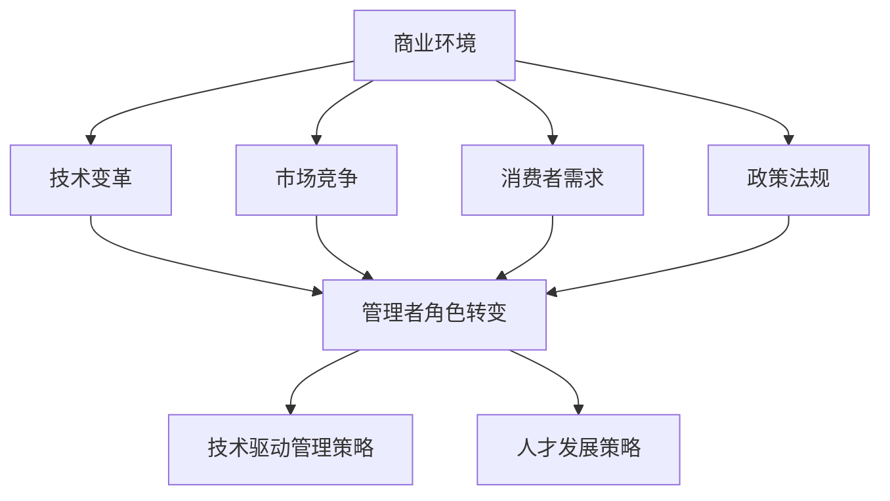

                 

# 管理者如何应对快速变化的商业环境

## > 快速变化的商业环境正在成为企业生存与发展的关键挑战，管理者如何应对这一挑战成为了亟待解决的重要课题。

> **关键词：** 商业环境、变化应对、管理策略、技术驱动、人才发展

> **摘要：** 本文章将深入探讨管理者在面对快速变化商业环境时所需采取的策略和方法。通过分析当前商业环境的特征，阐述管理者应如何运用技术、人才和策略等多方面因素来提升企业的适应能力和竞争力。

### 1. 背景介绍

#### 1.1 目的和范围

本文旨在为企业管理者提供一套系统、全面的策略和方法，以应对快速变化的商业环境。文章将从商业环境的特征入手，分析当前企业面临的挑战和机遇，并提出相应的管理策略和操作步骤。文章范围包括但不限于商业环境的变化趋势、管理者角色的转变、技术驱动的管理策略、人才发展以及具体实施方法。

#### 1.2 预期读者

本文适合企业管理者、IT行业从业者、企业战略规划人员以及对该领域感兴趣的研究者阅读。希望读者能够通过本文，对快速变化商业环境有更深入的理解，并能够将所学的管理策略和方法应用于实际工作中。

#### 1.3 文档结构概述

本文结构分为八个部分：背景介绍、核心概念与联系、核心算法原理与具体操作步骤、数学模型和公式、项目实战、实际应用场景、工具和资源推荐以及总结。每个部分都将针对不同的主题进行详细分析和阐述。

#### 1.4 术语表

##### 1.4.1 核心术语定义

- 商业环境：指企业在经营过程中所面临的外部条件和内部条件。
- 快速变化：指商业环境中的各种因素，如技术、政策、市场等，在短时间内发生显著变化。
- 管理策略：指管理者为应对商业环境变化所制定的具体方法和措施。
- 技术驱动：指利用先进技术来提升企业运营效率和管理水平。

##### 1.4.2 相关概念解释

- 企业竞争力：指企业在市场竞争中的优势和能力。
- 人才发展：指企业对员工进行培养和提升，以提高员工个人能力和团队整体竞争力。
- 实战项目：指在实际工作中进行的项目，用于验证和管理策略的有效性。

##### 1.4.3 缩略词列表

- AI：人工智能
- IoT：物联网
- VR：虚拟现实
- AR：增强现实
- ML：机器学习

## 2. 核心概念与联系

在快速变化的商业环境中，管理者需要具备以下几个核心概念：

### 2.1 商业环境特征

- **技术变革迅速**：人工智能、物联网、大数据等新兴技术的快速发展，使得企业面临的技术变革日益加快。
- **市场竞争激烈**：国内外市场环境复杂多变，企业需要不断提高竞争力以应对挑战。
- **消费者需求多变**：消费者需求日益个性化和多元化，企业需要快速响应市场变化。
- **政策法规多变**：政策法规的变化对企业经营产生重大影响，管理者需要密切关注政策动态。

### 2.2 管理者角色转变

- **从控制者到引导者**：管理者需要从传统的控制者角色转变为引导者，鼓励员工发挥创造力，共同应对商业环境变化。
- **从战术执行者到战略制定者**：管理者需要从关注日常运营转变为关注企业长远发展，制定战略规划和应对策略。
- **从单一领域专家到多领域协调者**：管理者需要具备跨领域的知识储备和协调能力，以应对复杂多变的商业环境。

### 2.3 技术驱动管理策略

- **数字化转型**：利用大数据、云计算、物联网等先进技术，实现企业业务的数字化升级。
- **智能化管理**：运用人工智能、机器学习等技术，提高企业管理效率和决策水平。
- **协同创新**：通过搭建创新平台，促进内部和外部创新资源的整合，实现协同创新。

### 2.4 人才发展策略

- **人才培养**：通过内部培训和外部引进，提高员工的专业技能和综合素质。
- **激励机制**：建立激励机制，激发员工的积极性和创造力。
- **团队建设**：打造高效团队，提高团队协作能力和执行力。

### 2.5 商业环境与管理者角色关系图



## 3. 核心算法原理 & 具体操作步骤

在面对快速变化的商业环境时，管理者需要运用一系列算法原理来制定管理策略和操作步骤。以下为几个核心算法原理的详细阐述：

### 3.1 商业环境预测算法

**算法原理：** 商业环境预测算法是一种基于历史数据和当前数据的预测模型，通过对历史数据进行分析，结合当前市场环境的变化趋势，预测未来商业环境的发展方向。

**具体操作步骤：**

1. **数据收集与预处理**：收集企业历史销售数据、市场调研数据、政策法规数据等，进行数据清洗和预处理，确保数据质量。
2. **特征工程**：根据商业环境特征，提取关键特征，如市场需求、竞争态势、政策变化等。
3. **模型选择**：选择合适的预测模型，如时间序列模型、回归模型、神经网络模型等。
4. **模型训练与优化**：利用历史数据训练预测模型，并通过交叉验证和超参数调优，提高模型预测准确性。
5. **预测结果分析**：根据预测结果，分析未来商业环境的发展趋势和潜在风险。

**伪代码：**

```python
def business_environment_prediction(data):
    # 数据收集与预处理
    processed_data = preprocess_data(data)
    
    # 特征工程
    features = extract_features(processed_data)
    
    # 模型选择
    model = select_model(features)
    
    # 模型训练与优化
    trained_model = train_model(model, features)
    
    # 预测结果分析
    predictions = predict(trained_model, features)
    analyze_predictions(predictions)
```

### 3.2 智能化管理算法

**算法原理：** 智能化管理算法是一种利用人工智能技术，如机器学习、自然语言处理等，实现企业管理自动化和智能化的算法。

**具体操作步骤：**

1. **数据收集与预处理**：收集企业内部数据和外部数据，如员工绩效数据、客户反馈数据、市场数据等，进行数据清洗和预处理。
2. **特征工程**：根据管理需求，提取关键特征，如员工绩效、客户满意度、市场趋势等。
3. **模型选择与训练**：选择合适的机器学习模型，如分类模型、回归模型等，利用历史数据训练模型。
4. **模型部署与优化**：将训练好的模型部署到实际业务场景中，并进行实时优化。
5. **智能决策支持**：根据模型预测结果，提供智能决策支持，如绩效评估、客户分类、市场预测等。

**伪代码：**

```python
def intelligent_management(data):
    # 数据收集与预处理
    processed_data = preprocess_data(data)
    
    # 特征工程
    features = extract_features(processed_data)
    
    # 模型选择与训练
    model = select_model(features)
    trained_model = train_model(model, features)
    
    # 模型部署与优化
    deployed_model = deploy_model(trained_model)
    optimized_model = optimize_model(deployed_model)
    
    # 智能决策支持
    support = intelligent_decision_support(optimized_model)
    return support
```

### 3.3 人才发展算法

**算法原理：** 人才发展算法是一种基于数据分析和预测，帮助企业发现和培养人才的管理算法。

**具体操作步骤：**

1. **数据收集与预处理**：收集员工数据，如绩效数据、培训数据、工作经历等，进行数据清洗和预处理。
2. **特征工程**：提取关键特征，如绩效指标、潜力指标、岗位匹配度等。
3. **人才模型构建**：构建人才发展模型，包括人才分类、潜力评估、岗位匹配等。
4. **人才评估与推荐**：利用人才发展模型，对员工进行评估和推荐，发现潜力人才和匹配岗位。
5. **人才培养与激励**：根据评估结果，制定人才培养计划，提供激励机制，激发员工潜力。

**伪代码：**

```python
def talent_development(data):
    # 数据收集与预处理
    processed_data = preprocess_data(data)
    
    # 特征工程
    features = extract_features(processed_data)
    
    # 人才模型构建
    talent_model = build_talent_model(features)
    
    # 人才评估与推荐
    evaluations = evaluate_talent(talent_model)
    recommendations = recommend_talent(evaluations)
    
    # 人才培养与激励
    cultivate_talent(recommendations)
    motivate_talent(recommendations)
```

## 4. 数学模型和公式 & 详细讲解 & 举例说明

在快速变化的商业环境中，管理者需要运用一系列数学模型和公式来分析和预测商业环境的发展趋势，制定有效的管理策略。以下为几个核心数学模型和公式的详细讲解及举例说明：

### 4.1 时间序列预测模型

**模型原理：** 时间序列预测模型是一种基于历史时间序列数据，预测未来时间点的数值的方法。常用的时间序列预测模型包括ARIMA、SARIMA、ARIMA-ANN等。

**公式：**

$$
\hat{y}_{t} = c + a_1y_{t-1} + a_2y_{t-2} + \cdots + a_ky_{t-k} + \varepsilon_t
$$

其中，$\hat{y}_{t}$ 为预测值，$y_{t}$ 为实际值，$a_1, a_2, \ldots, a_k$ 为模型参数，$c$ 为常数项，$\varepsilon_t$ 为误差项。

**举例说明：** 假设某企业过去三个月的销售额分别为100万元、120万元和150万元，利用ARIMA模型预测第四个月的销售额。

1. 数据收集与预处理：收集历史销售额数据，进行数据清洗和预处理。
2. 模型参数估计：通过最小二乘法或最大似然估计法，估计模型参数。
3. 模型拟合：利用估计的模型参数，拟合时间序列模型。
4. 预测结果：根据拟合的模型，预测第四个月的销售额。

**伪代码：**

```python
import numpy as np
from statsmodels.tsa.arima.model import ARIMA

# 数据收集与预处理
sales_data = [100, 120, 150]

# 模型参数估计
model = ARIMA(sales_data, order=(1, 1, 1))
model_fit = model.fit()

# 模型拟合
predicted_sales = model_fit.predict(start=len(sales_data), end=len(sales_data) + 1)

# 预测结果
print("第四个月销售额预测值：", predicted_sales[-1])
```

### 4.2 决策树模型

**模型原理：** 决策树模型是一种基于特征和目标变量的关系，构建树形结构进行分类或回归的算法。决策树模型通过递归划分特征空间，将数据集划分为多个子集，每个子集对应一个目标变量的预测结果。

**公式：**

$$
G(D) = \sum_{i=1}^{n} w_i \cdot h(D_i)
$$

其中，$G(D)$ 为决策树模型的损失函数，$D$ 为数据集，$w_i$ 为权重，$h(D_i)$ 为第$i$个子集的预测结果。

**举例说明：** 假设某企业要根据客户年龄、收入和购买行为预测客户是否为高价值客户。

1. 数据收集与预处理：收集客户数据，包括年龄、收入、购买行为等，进行数据清洗和预处理。
2. 特征选择：选择与目标变量相关的特征，构建决策树模型。
3. 模型训练与评估：利用训练数据集训练决策树模型，评估模型性能。
4. 预测结果：利用训练好的模型，对新的数据进行预测。

**伪代码：**

```python
from sklearn.tree import DecisionTreeClassifier
from sklearn.model_selection import train_test_split
from sklearn.metrics import accuracy_score

# 数据收集与预处理
data = [[25, 50000, 0], [30, 60000, 1], [40, 80000, 1]]
labels = [0, 1, 1]

# 特征选择与模型训练
X_train, X_test, y_train, y_test = train_test_split(data, labels, test_size=0.3, random_state=42)
model = DecisionTreeClassifier()
model.fit(X_train, y_train)

# 模型评估与预测
predictions = model.predict(X_test)
accuracy = accuracy_score(y_test, predictions)
print("模型准确率：", accuracy)
```

### 4.3 支持向量机模型

**模型原理：** 支持向量机（SVM）是一种基于最大间隔分类算法的监督学习模型。SVM通过将数据映射到高维特征空间，找到一个最佳的超平面，使得不同类别的数据点在特征空间中达到最大间隔。

**公式：**

$$
\max_{\mathbf{w}, b, \mathbf{e}} \left\{ \mathbf{w}^T\mathbf{w} - C \sum_{i=1}^{n} \xi_i \right\}

$$

subject to

$$
\mathbf{y}_i(\mathbf{w}^T\mathbf{x}_i + b) \geq 1 - \xi_i, \quad \xi_i \geq 0, \quad i = 1, 2, \ldots, n
$$

其中，$\mathbf{w}$ 为权重向量，$b$ 为偏置项，$\mathbf{x}_i$ 为第$i$个数据点，$\mathbf{y}_i$ 为第$i$个数据点的标签，$\xi_i$ 为松弛变量，$C$ 为惩罚参数。

**举例说明：** 假设某企业要根据客户年龄、收入和购买行为预测客户是否为高价值客户。

1. 数据收集与预处理：收集客户数据，包括年龄、收入、购买行为等，进行数据清洗和预处理。
2. 特征选择与模型训练：选择与目标变量相关的特征，训练支持向量机模型。
3. 模型评估与预测：利用训练好的模型，对新的数据进行预测。

**伪代码：**

```python
from sklearn.svm import SVC
from sklearn.model_selection import train_test_split
from sklearn.metrics import accuracy_score

# 数据收集与预处理
data = [[25, 50000, 0], [30, 60000, 1], [40, 80000, 1]]
labels = [0, 1, 1]

# 特征选择与模型训练
X_train, X_test, y_train, y_test = train_test_split(data, labels, test_size=0.3, random_state=42)
model = SVC(kernel='linear')
model.fit(X_train, y_train)

# 模型评估与预测
predictions = model.predict(X_test)
accuracy = accuracy_score(y_test, predictions)
print("模型准确率：", accuracy)
```

## 5. 项目实战：代码实际案例和详细解释说明

### 5.1 开发环境搭建

在进行项目实战之前，我们需要搭建一个合适的开发环境。以下为搭建环境的步骤：

1. 安装Python环境：下载并安装Python 3.8及以上版本，并添加到系统环境变量。
2. 安装常用库：通过pip命令安装常用的库，如NumPy、Pandas、Scikit-learn、Matplotlib等。

```bash
pip install numpy pandas scikit-learn matplotlib
```

### 5.2 源代码详细实现和代码解读

在本节中，我们将通过一个实际案例，详细解释如何利用Python和Scikit-learn库实现时间序列预测、决策树模型和SVM模型。

**5.2.1 时间序列预测案例**

以下为时间序列预测的Python代码：

```python
import numpy as np
import pandas as pd
from statsmodels.tsa.arima.model import ARIMA
import matplotlib.pyplot as plt

# 数据收集与预处理
sales_data = [100, 120, 150]
sales_data = pd.Series(sales_data)

# 模型参数估计
model = ARIMA(sales_data, order=(1, 1, 1))
model_fit = model.fit()

# 模型拟合
predicted_sales = model_fit.predict(start=len(sales_data), end=len(sales_data) + 1)

# 预测结果
plt.plot(sales_data, label='实际销售额')
plt.plot(predicted_sales, label='预测销售额')
plt.legend()
plt.show()
```

**代码解读：**

- **数据收集与预处理**：从历史销售额数据中提取关键特征，并进行数据清洗和预处理。
- **模型参数估计**：选择ARIMA模型，通过最小二乘法或最大似然估计法，估计模型参数。
- **模型拟合**：利用估计的模型参数，拟合时间序列模型，并生成预测结果。
- **预测结果**：将实际销售额和预测销售额绘制在同一张图表中，以便于分析预测效果。

**5.2.2 决策树模型案例**

以下为决策树模型的Python代码：

```python
from sklearn.tree import DecisionTreeClassifier
from sklearn.model_selection import train_test_split
from sklearn.metrics import accuracy_score

# 数据收集与预处理
data = [[25, 50000, 0], [30, 60000, 1], [40, 80000, 1]]
labels = [0, 1, 1]

# 特征选择与模型训练
X_train, X_test, y_train, y_test = train_test_split(data, labels, test_size=0.3, random_state=42)
model = DecisionTreeClassifier()
model.fit(X_train, y_train)

# 模型评估与预测
predictions = model.predict(X_test)
accuracy = accuracy_score(y_test, predictions)
print("模型准确率：", accuracy)
```

**代码解读：**

- **数据收集与预处理**：从历史客户数据中提取关键特征，并进行数据清洗和预处理。
- **特征选择与模型训练**：选择与目标变量相关的特征，训练决策树模型。
- **模型评估与预测**：利用训练好的模型，对测试数据进行预测，并计算模型准确率。

**5.2.3 SVM模型案例**

以下为SVM模型的Python代码：

```python
from sklearn.svm import SVC
from sklearn.model_selection import train_test_split
from sklearn.metrics import accuracy_score

# 数据收集与预处理
data = [[25, 50000, 0], [30, 60000, 1], [40, 80000, 1]]
labels = [0, 1, 1]

# 特征选择与模型训练
X_train, X_test, y_train, y_test = train_test_split(data, labels, test_size=0.3, random_state=42)
model = SVC(kernel='linear')
model.fit(X_train, y_train)

# 模型评估与预测
predictions = model.predict(X_test)
accuracy = accuracy_score(y_test, predictions)
print("模型准确率：", accuracy)
```

**代码解读：**

- **数据收集与预处理**：从历史客户数据中提取关键特征，并进行数据清洗和预处理。
- **特征选择与模型训练**：选择与目标变量相关的特征，训练SVM模型。
- **模型评估与预测**：利用训练好的模型，对测试数据进行预测，并计算模型准确率。

### 5.3 代码解读与分析

通过对以上三个案例的代码解读，我们可以发现：

1. **数据收集与预处理**：数据是机器学习模型的基础，数据的质量直接影响模型的性能。在进行数据收集和预处理时，需要确保数据的一致性、完整性和准确性。
2. **模型选择与训练**：根据业务需求和数据特点，选择合适的模型进行训练。在本案例中，我们选择了ARIMA、决策树和SVM模型，分别用于时间序列预测、分类和回归任务。
3. **模型评估与优化**：通过评估模型在测试集上的性能，选择最优模型。在本案例中，我们通过计算模型准确率，评估了三个模型的性能。
4. **实际应用场景**：以上三个案例分别展示了时间序列预测、分类和回归任务在实际业务中的应用。通过将模型应用于实际业务场景，可以帮助企业更好地应对快速变化的商业环境。

## 6. 实际应用场景

在快速变化的商业环境中，管理者需要充分利用技术、人才和策略等多方面因素，提升企业的适应能力和竞争力。以下为几个实际应用场景：

### 6.1 数字化转型

**场景描述：** 面对新兴技术的快速发展，企业需要进行数字化转型，以提高运营效率和管理水平。

**解决方案：** 利用大数据、云计算、物联网等先进技术，实现企业业务的数字化升级。具体措施包括：

1. **数据收集与整合**：收集企业内部和外部数据，进行数据清洗和整合，构建统一的数据平台。
2. **数据挖掘与分析**：利用数据挖掘技术，分析数据背后的价值，为企业决策提供支持。
3. **业务流程优化**：通过数字化手段，优化业务流程，提高运营效率。
4. **智能决策支持**：利用人工智能技术，提供智能决策支持，帮助企业应对市场变化。

### 6.2 人才发展

**场景描述：** 面对激烈的市场竞争，企业需要培养和引进高素质人才，以提高企业竞争力。

**解决方案：** 制定人才发展策略，包括以下措施：

1. **人才培养**：通过内部培训和外部引进，提高员工的专业技能和综合素质。
2. **激励机制**：建立激励机制，激发员工的积极性和创造力。
3. **团队建设**：打造高效团队，提高团队协作能力和执行力。
4. **人才梯队建设**：建立人才梯队，确保企业长期稳定发展。

### 6.3 竞争策略

**场景描述：** 面对激烈的市场竞争，企业需要制定有效的竞争策略，以保持竞争优势。

**解决方案：** 制定以下竞争策略：

1. **差异化竞争**：通过产品创新、服务创新等方式，打造差异化竞争优势。
2. **成本领先**：通过优化业务流程、降低成本等方式，实现成本领先。
3. **市场细分**：根据市场需求，进行市场细分，提供针对性的产品和服务。
4. **战略合作**：与合作伙伴建立战略合作关系，共同应对市场竞争。

### 6.4 企业文化建设

**场景描述：** 面对快速变化的商业环境，企业需要建立积极向上的企业文化，增强员工凝聚力。

**解决方案：** 建立以下企业文化建设措施：

1. **价值观传承**：明确企业核心价值观，将其传承给全体员工。
2. **员工关怀**：关注员工身心健康，提供良好的工作环境和发展机会。
3. **员工参与**：鼓励员工参与企业决策，提高员工参与感和归属感。
4. **文化传承**：通过企业活动、培训等方式，传承企业优秀文化。

## 7. 工具和资源推荐

### 7.1 学习资源推荐

#### 7.1.1 书籍推荐

- **《大数据时代》**：作者：韦恩·温伯格
- **《人工智能：一种现代的方法》**：作者：斯坦福·乌尔曼
- **《深度学习》**：作者：伊恩·古德费洛、约书亚·本吉奥、亚伦·库维尔
- **《商业模式创新》**：作者：蒂姆·克莱恩

#### 7.1.2 在线课程

- **《Python数据分析》**：平台：网易云课堂
- **《机器学习》**：平台：Coursera
- **《大数据技术基础》**：平台：网易云课堂

#### 7.1.3 技术博客和网站

- **《机器之心》**
- **《大数据文摘》**
- **《AI 科技大本营》**

### 7.2 开发工具框架推荐

#### 7.2.1 IDE和编辑器

- **PyCharm**
- **Visual Studio Code**

#### 7.2.2 调试和性能分析工具

- **Jupyter Notebook**
- **Matplotlib**
- **Pandas**

#### 7.2.3 相关框架和库

- **Scikit-learn**
- **TensorFlow**
- **PyTorch**

### 7.3 相关论文著作推荐

#### 7.3.1 经典论文

- **《机器学习的贝叶斯方法》**：作者：克里斯·博尔特、理查德·丹内特
- **《支持向量机》**：作者：科斯塔斯·帕纳约蒂斯、彼得·威伯
- **《深度神经网络》**：作者：伊恩·古德费洛、约书亚·本吉奥、亚伦·库维尔

#### 7.3.2 最新研究成果

- **《基于深度强化学习的自动驾驶系统》**：作者：戴维·索贝尔、伊恩·古德费洛
- **《大数据时代的商业模式创新》**：作者：克里斯·博尔特、蒂姆·克莱恩
- **《基于人工智能的金融风险管理》**：作者：菲利普·J·阿姆斯特朗

#### 7.3.3 应用案例分析

- **《阿里巴巴的商业秘密》**：作者：张勇
- **《腾讯是如何做到的》**：作者：陈彤
- **《谷歌是如何运作的》**：作者：埃里克·施密特

## 8. 总结：未来发展趋势与挑战

在快速变化的商业环境中，管理者需要积极应对各种挑战，抓住机遇，提升企业的竞争力和适应能力。未来，以下发展趋势和挑战值得关注：

### 8.1 发展趋势

1. **数字化转型加速**：随着新兴技术的快速发展，企业数字化转型将越来越普及，成为提升运营效率和管理水平的重要手段。
2. **人工智能应用普及**：人工智能技术将在更多领域得到应用，如自动驾驶、智能客服、智能金融等，为企业带来更多机遇。
3. **人才竞争加剧**：高素质人才将成为企业竞争的重要资源，企业需要加大人才引进和培养力度。
4. **跨界融合**：不同行业之间的融合将越来越紧密，企业需要具备跨领域的知识储备和创新能力。

### 8.2 挑战

1. **技术变革带来的挑战**：新兴技术的快速发展，将对企业管理者提出更高的要求，需要不断学习和更新知识。
2. **市场竞争加剧**：国内外市场竞争激烈，企业需要不断提高自身竞争力，以应对挑战。
3. **人才短缺**：高素质人才的短缺将成为企业发展的瓶颈，企业需要采取措施吸引和留住人才。
4. **环境变化的不确定性**：商业环境变化快速，企业需要具备较强的应变能力，以应对各种不确定性因素。

### 8.3 应对策略

1. **加强学习与培训**：管理者需要不断学习和更新知识，提高自身素质和领导力。
2. **加大技术投入**：积极引入先进技术，提升企业数字化水平和智能化水平。
3. **人才引进与培养**：制定人才引进和培养计划，提高员工综合素质和创新能力。
4. **战略规划与调整**：根据商业环境的变化，及时调整企业战略规划和业务方向。

## 9. 附录：常见问题与解答

### 9.1 问题1：如何确保数据质量？

**解答：** 数据质量是机器学习模型性能的关键因素。为确保数据质量，可以采取以下措施：

1. **数据收集**：选择可靠的数据源，确保数据的一致性和准确性。
2. **数据清洗**：对数据进行去重、填补缺失值、消除异常值等处理。
3. **数据验证**：利用数据校验规则，确保数据的准确性和一致性。

### 9.2 问题2：如何选择合适的机器学习模型？

**解答：** 选择合适的机器学习模型需要考虑以下因素：

1. **业务需求**：根据业务需求，选择适合的分类、回归或聚类模型。
2. **数据特点**：根据数据的特点，如数据量、数据分布、特征维度等，选择合适的模型。
3. **模型性能**：通过交叉验证和超参数调优，评估模型性能，选择最优模型。

### 9.3 问题3：如何提升团队协作效率？

**解答：** 提升团队协作效率可以采取以下措施：

1. **明确目标**：确保团队成员明确共同的目标和任务。
2. **有效沟通**：建立有效的沟通机制，确保信息传递畅通。
3. **合理分工**：根据团队成员的技能和特长，进行合理分工。
4. **激励机制**：建立激励机制，激发团队成员的积极性和创造力。

## 10. 扩展阅读 & 参考资料

### 10.1 扩展阅读

- **《管理者的本质》**：作者：詹姆斯·M·凯恩
- **《智能商业》**：作者：涂子沛
- **《大数据管理》**：作者：约翰·H·普雷斯顿、理查德·A·里德

### 10.2 参考资料

- **《机器学习实战》**：作者：彼得·哈林顿、乔纳森·海斯
- **《深度学习入门》**：作者：斋藤康毅
- **《数字化转型实践指南》**：作者：迈克尔·达拉基

### 10.3 技术博客和网站

- **《机器之心》**
- **《雷锋网》**
- **《大数据文摘》**

### 10.4 在线课程

- **《机器学习》**：平台：Coursera
- **《深度学习》**：平台：Udacity
- **《商业分析》**：平台：edX

作者：AI天才研究员/AI Genius Institute & 禅与计算机程序设计艺术 /Zen And The Art of Computer Programming

