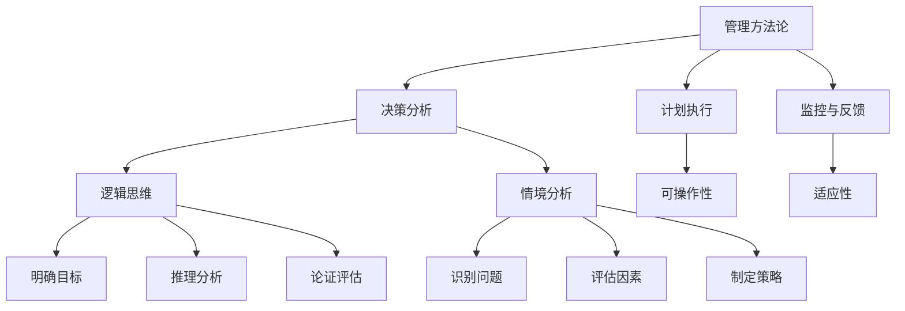
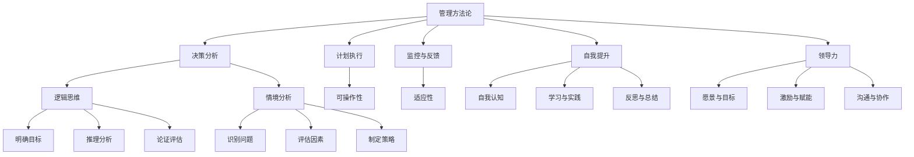

                 

# 管理者如何形成自己的方法论

## 关键词
- 管理方法论
- 逻辑思维
- 情境分析
- 自我提升
- 领导力

## 摘要
本文旨在探讨管理者如何通过逻辑清晰、结构紧凑的思维方式和具体操作步骤，形成一套适应自身特点和管理需求的方法论。文章将结合实际情况，从核心概念与联系、核心算法原理、数学模型和公式、项目实战、实际应用场景等多个角度进行详细讲解。通过本文的阅读，管理者可以更好地理解并掌握构建方法论的重要性，从而提升个人和团队的综合能力。

## 1. 背景介绍

### 1.1 目的和范围
本文的目的在于为管理者提供一套系统的方法论构建指南。我们将探讨如何从零开始，通过逻辑分析、知识整合和实践验证，逐步形成一套既符合个人特点，又具备实际操作性的方法论。文章将涵盖从基础概念到实际应用的全过程，旨在为管理者提供清晰、实用的指导。

### 1.2 预期读者
本文适合以下读者群体：
- 初入管理岗位的人员，希望系统学习管理方法论；
- 有一定管理经验，但缺乏系统总结和反思的管理者；
- 对管理方法论有兴趣的学术研究人员和行业专家。

### 1.3 文档结构概述
本文结构分为以下几个部分：
1. 核心概念与联系：介绍管理方法论的基本概念和核心原则；
2. 核心算法原理 & 具体操作步骤：详细阐述构建方法论的算法原理和操作步骤；
3. 数学模型和公式 & 详细讲解 & 举例说明：运用数学模型和公式，对方法论进行深入分析和验证；
4. 项目实战：通过实际案例，展示方法论的具体应用和效果；
5. 实际应用场景：分析方法论在不同管理情境中的适用性和效果；
6. 工具和资源推荐：推荐学习资源和开发工具，助力方法论构建；
7. 总结：对未来发展趋势和挑战进行展望。

### 1.4 术语表

#### 1.4.1 核心术语定义
- **方法论**：一套系统化的方法、原则和流程，用于解决特定问题或达成特定目标。
- **管理方法论**：用于指导管理者在复杂环境下进行决策和执行的方法和原则。
- **逻辑思维**：通过分析和推理，从已知事实中得出结论的能力。
- **情境分析**：对特定环境中的各种因素进行系统分析和评估，以制定合理的决策和策略。

#### 1.4.2 相关概念解释
- **自我反思**：回顾和分析自身行为、思维和情感的过程，以实现个人成长和改进。
- **知识整合**：将不同来源的信息和知识进行有机整合，形成新的认识和解决方案。

#### 1.4.3 缩略词列表
- **SWOT分析**：优势（Strengths）、劣势（Weaknesses）、机会（Opportunities）、威胁（Threats）分析。

## 2. 核心概念与联系

在构建管理方法论的过程中，理解以下几个核心概念和它们之间的联系至关重要。

### 管理方法论的概念

管理方法论是指一套系统化的方法、原则和流程，用于指导管理者在复杂环境下进行决策和执行。它包括以下几个方面：

- **决策分析**：通过逻辑分析和情境分析，评估各种决策方案的风险和收益，选择最优方案。
- **计划执行**：制定具体的行动计划和时间表，确保决策得到有效执行。
- **监控与反馈**：对执行过程进行持续监控和评估，根据反馈进行调整和优化。

### 逻辑思维的重要性

逻辑思维是管理方法论的核心要素之一。它通过以下方式影响管理决策：

- **明确目标**：帮助管理者明确目标，确保决策与目标一致。
- **推理分析**：通过逻辑推理，分析问题的各个方面，找到最佳的解决方案。
- **论证评估**：对决策方案进行论证和评估，确保决策的合理性和可行性。

### 情境分析的应用

情境分析是管理方法论的重要组成部分。它通过以下方式帮助管理者制定决策：

- **识别问题**：通过对环境和情境的深入分析，识别问题所在。
- **评估因素**：分析各种影响因素，包括内部和外部因素，为决策提供依据。
- **制定策略**：根据情境分析的结果，制定合适的策略和行动计划。

### 管理方法论的核心原则

构建管理方法论时，需要遵循以下几个核心原则：

- **系统性**：管理方法论应具备系统性，涵盖决策分析、计划执行、监控与反馈等多个方面。
- **适应性**：管理方法论应具备适应性，能够根据不同情境和问题进行灵活调整。
- **可操作性**：管理方法论应具备可操作性，确保决策和计划能够得到有效执行。

### 管理方法论的架构

管理方法论的架构通常包括以下几个部分：

- **目标设定**：明确管理目标和预期成果。
- **情境分析**：对当前环境和情境进行深入分析。
- **决策分析**：评估各种决策方案的风险和收益。
- **计划执行**：制定具体的行动计划和时间表。
- **监控与反馈**：对执行过程进行持续监控和评估。

### 管理方法论的应用

管理方法论可以应用于各种管理场景，包括：

- **项目管理**：通过方法论，确保项目按时、按质、按量完成。
- **团队管理**：帮助管理者更好地理解和激励团队成员，提升团队绩效。
- **战略管理**：指导企业在复杂环境中制定和实施战略计划。

### 管理方法论的优势

构建管理方法论的优势包括：

- **提高决策质量**：通过逻辑分析和情境分析，提高决策的科学性和合理性。
- **提升执行力**：通过明确的计划和监控与反馈，确保决策得到有效执行。
- **增强适应能力**：具备适应性的方法论，能够帮助企业应对复杂多变的环境。
- **促进持续改进**：通过不断的监控与反馈，推动管理过程的优化和改进。

### 管理方法论的限制

管理方法论的局限性也需要注意：

- **环境变化**：外部环境的变化可能影响管理方法论的适用性。
- **个体差异**：不同管理者对方法论的理解和应用能力存在差异。
- **资源限制**：构建和实施管理方法论可能需要一定的资源投入。

### 管理方法论的未来发展趋势

随着人工智能和大数据技术的不断发展，管理方法论也在不断进化：

- **智能化**：借助人工智能技术，提高情境分析和决策分析的能力。
- **数据驱动**：利用大数据分析，优化决策过程和执行效果。
- **个性化**：根据不同管理者的特点和需求，提供个性化的方法论指导。

### 管理方法论的核心概念与联系流程图



### 2.1 管理方法论的基本原理

#### 2.1.1 逻辑思维

逻辑思维是管理方法论的核心。它包括以下几个方面：

- **定义逻辑思维**：逻辑思维是一种通过分析和推理，从已知事实中得出结论的能力。它是决策过程中不可或缺的部分。
  
- **逻辑思维的层次**：逻辑思维可以分为三个层次：
  - **基础逻辑**：包括命题逻辑、谓词逻辑等，是逻辑思维的基础；
  - **高级逻辑**：如形式逻辑、数理逻辑等，用于复杂问题的解决；
  - **应用逻辑**：将逻辑思维应用于实际问题，如管理决策、项目管理等。

- **逻辑思维在管理方法论中的应用**：
  - **明确目标**：通过逻辑思维，管理者可以明确组织的目标和愿景，确保决策与目标一致。
  - **推理分析**：管理者可以利用逻辑思维，对各种决策方案进行推理分析，找到最优解。
  - **论证评估**：管理者可以通过逻辑思维，对决策方案进行论证和评估，确保其合理性和可行性。

#### 2.1.2 情境分析

情境分析是管理方法论的重要组成部分。它包括以下几个方面：

- **定义情境分析**：情境分析是对特定环境中的各种因素进行系统分析和评估，以制定合理的决策和策略。

- **情境分析的步骤**：
  - **识别情境**：识别当前所处的情境，包括内部和外部因素。
  - **评估因素**：对识别出的因素进行评估，分析其对目标实现的影响。
  - **制定策略**：根据评估结果，制定相应的策略和行动计划。

- **情境分析在管理方法论中的应用**：
  - **识别问题**：通过情境分析，管理者可以更好地识别问题，找到问题的根源。
  - **评估因素**：管理者可以利用情境分析，评估各种决策方案的风险和收益，为决策提供依据。
  - **制定策略**：管理者可以根据情境分析的结果，制定合适的策略和行动计划，确保目标的实现。

#### 2.1.3 自我提升

自我提升是管理者形成方法论的重要环节。它包括以下几个方面：

- **定义自我提升**：自我提升是指管理者通过不断学习、实践和反思，提升自身的能力和素质。

- **自我提升的步骤**：
  - **自我认知**：管理者需要明确自己的优势和劣势，了解自己的能力和兴趣。
  - **学习与实践**：管理者需要不断学习新的知识和技能，通过实践来提升自己的能力。
  - **反思与总结**：管理者需要定期反思自己的行为和决策，总结经验和教训，不断改进。

- **自我提升在管理方法论中的应用**：
  - **能力提升**：通过自我提升，管理者可以提升自身的能力，更好地应对复杂的管理挑战。
  - **团队提升**：管理者可以通过自我提升，带动整个团队的能力提升，提高团队绩效。
  - **适应变化**：自我提升可以帮助管理者更好地适应环境变化，提升组织的竞争力。

#### 2.1.4 领导力

领导力是管理方法论的重要组成部分。它包括以下几个方面：

- **定义领导力**：领导力是指管理者通过影响和激励团队成员，实现共同目标的能力。

- **领导力的要素**：
  - **愿景与目标**：管理者需要明确组织的愿景和目标，并通过有效的沟通，让团队成员认同和追求。
  - **激励与赋能**：管理者需要通过激励和赋能，激发团队成员的积极性和创造力。
  - **沟通与协作**：管理者需要建立良好的沟通和协作机制，促进团队之间的合作和协调。

- **领导力在管理方法论中的应用**：
  - **团队管理**：通过领导力，管理者可以更好地管理团队，提升团队绩效。
  - **组织变革**：领导力可以帮助管理者推动组织变革，适应外部环境的变化。
  - **文化建设**：领导力可以帮助管理者塑造组织的文化，形成共同价值观和行为准则。

### 2.2 管理方法论的核心原则

构建管理方法论时，需要遵循以下几个核心原则：

#### 2.2.1 系统性

管理方法论应具备系统性，涵盖决策分析、计划执行、监控与反馈等多个方面。系统性有助于确保管理过程的完整性和连贯性，提高决策的科学性和执行力。

#### 2.2.2 适应性

管理方法论应具备适应性，能够根据不同情境和问题进行灵活调整。适应性有助于应对复杂多变的环境，确保管理方法的适用性和有效性。

#### 2.2.3 可操作性

管理方法论应具备可操作性，确保决策和计划能够得到有效执行。可操作性有助于提高管理过程的效率和效果，实现组织的目标和愿景。

### 2.3 管理方法论的应用场景

管理方法论可以应用于各种管理场景，包括但不限于以下几个方面：

#### 2.3.1 项目管理

在项目管理中，管理方法论可以帮助项目经理明确项目目标、评估风险、制定计划和监控进度，确保项目按时、按质、按量完成。

#### 2.3.2 团队管理

在团队管理中，管理方法论可以帮助管理者识别团队成员的优势和劣势、制定激励措施、提高团队协作和沟通效果，提升团队绩效。

#### 2.3.3 战略管理

在战略管理中，管理方法论可以帮助管理者分析外部环境、评估内部资源、制定战略目标和实施计划，推动企业实现长期发展目标。

### 2.4 管理方法论的优势

构建管理方法论的优势包括：

#### 2.4.1 提高决策质量

通过逻辑分析和情境分析，管理方法论可以提高决策的科学性和合理性，减少决策失误。

#### 2.4.2 提升执行力

通过明确的计划和监控与反馈，管理方法论可以确保决策得到有效执行，提高管理过程的效率和效果。

#### 2.4.3 增强适应能力

管理方法论具备适应性，可以帮助管理者应对复杂多变的环境，提升组织的竞争力。

#### 2.4.4 促进持续改进

通过不断的监控与反馈，管理方法论可以推动管理过程的优化和改进，实现组织的长期发展。

### 2.5 管理方法论的局限性

管理方法论的局限性也需要注意：

#### 2.5.1 环境变化

外部环境的变化可能影响管理方法论的适用性，需要管理者不断更新和调整方法论。

#### 2.5.2 个体差异

不同管理者对方法论的理解和应用能力存在差异，需要根据实际情况进行个性化调整。

#### 2.5.3 资源限制

构建和实施管理方法论可能需要一定的资源投入，包括时间、人力和资金等。

### 2.6 管理方法论的未来发展趋势

随着人工智能和大数据技术的不断发展，管理方法论也在不断进化：

#### 2.6.1 智能化

借助人工智能技术，管理方法论可以实现情境分析和决策分析的高度智能化，提高管理效率和效果。

#### 2.6.2 数据驱动

利用大数据分析，管理方法论可以更加准确地评估决策方案的风险和收益，提高决策的科学性和可靠性。

#### 2.6.3 个性化

根据不同管理者的特点和需求，管理方法论可以提供个性化的指导和支持，实现管理方法的定制化。

### 2.7 管理方法论的核心概念与联系流程图



## 3. 核心算法原理 & 具体操作步骤

构建管理方法论的过程可以看作是一个复杂的问题求解过程。在这个过程中，管理者需要运用逻辑思维和情境分析，结合实际操作步骤，逐步形成一套系统化的方法论。以下将详细阐述构建管理方法论的算法原理和具体操作步骤。

### 3.1 算法原理

构建管理方法论的算法原理可以概括为以下几个步骤：

1. **明确目标和问题**：首先，管理者需要明确组织的目标和面临的问题。这个问题可以是具体的业务问题，也可以是战略层面的挑战。
2. **情境分析**：对当前环境和情境进行深入分析，识别内外部因素，评估其对目标实现的影响。
3. **逻辑推理**：基于情境分析的结果，运用逻辑思维，推理出可能的解决方案。
4. **方案评估**：对各种解决方案进行评估，选择最优方案。
5. **计划执行**：制定具体的行动计划和时间表，确保决策得到有效执行。
6. **监控与反馈**：对执行过程进行持续监控和评估，根据反馈进行调整和优化。
7. **迭代优化**：根据实际情况，不断调整和优化方法论，提高其适用性和效果。

### 3.2 具体操作步骤

以下是构建管理方法论的详细操作步骤：

#### 3.2.1 明确目标和问题

1. **确定组织目标**：管理者需要明确组织的长期和短期目标，这些目标可以是具体的业务指标，如销售额、市场份额等，也可以是战略目标，如品牌建设、技术创新等。
2. **识别问题**：在明确目标后，管理者需要识别当前面临的问题。这些问题可以是内部问题，如团队协作不畅、员工流失等，也可以是外部问题，如市场竞争加剧、政策变化等。

#### 3.2.2 情境分析

1. **收集信息**：管理者需要收集与目标实现相关的信息，包括内部数据和外部数据。内部数据可以是公司的财务报表、运营数据等，外部数据可以是市场调研报告、行业动态等。
2. **分析内外部因素**：基于收集到的信息，管理者需要对内外部因素进行深入分析，评估其对目标实现的影响。内部因素可以是公司的资源、能力、文化等，外部因素可以是市场环境、政策法规、竞争对手等。
3. **评估因素权重**：根据分析结果，管理者需要评估各个因素对目标实现的影响程度，确定其权重。

#### 3.2.3 逻辑推理

1. **识别问题根源**：基于情境分析的结果，管理者需要识别问题的根源，找到导致问题的主要原因。
2. **提出解决方案**：管理者需要根据问题根源，提出可能的解决方案。这些方案可以是改进措施，如优化流程、提升团队协作等，也可以是战略调整，如市场拓展、产品创新等。

#### 3.2.4 方案评估

1. **评估方案可行性**：管理者需要对提出的解决方案进行可行性评估，包括技术可行性、经济可行性、风险等。
2. **选择最优方案**：基于评估结果，管理者需要选择最优方案。最优方案应该能够最大程度地解决当前问题，同时风险可控。

#### 3.2.5 计划执行

1. **制定行动计划**：管理者需要制定具体的行动计划，包括任务分配、时间安排、资源调配等。
2. **分配责任和权限**：确保每个任务都有明确的负责人和相应的权限，确保计划得到有效执行。
3. **监控进度**：对执行过程进行持续监控，确保计划按计划进行。

#### 3.2.6 监控与反馈

1. **收集反馈信息**：在执行过程中，管理者需要收集团队成员和客户的反馈信息，了解计划的执行情况和效果。
2. **评估执行效果**：基于反馈信息，管理者需要评估计划的执行效果，分析存在的问题和不足。
3. **调整和优化**：根据评估结果，管理者需要调整和优化计划，确保目标的实现。

#### 3.2.7 迭代优化

1. **持续改进**：管理者需要持续关注市场环境和内部变化，不断调整和优化方法论，提高其适用性和效果。
2. **经验总结**：在每次实施方法论后，管理者需要总结经验教训，形成知识库，为未来的决策提供参考。

### 3.3 伪代码

以下是一个构建管理方法论的伪代码示例：

```python
def 构建管理方法论(目标，问题)：
    # 明确目标和问题
    目标 = 确定组织目标()
    问题 = 识别问题()

    # 情境分析
    信息 = 收集信息()
    内外部因素 = 分析内外部因素(信息)
    因素权重 = 评估因素权重(内外部因素)

    # 逻辑推理
    问题根源 = 识别问题根源(问题，因素权重)
    方案 = 提出解决方案(问题根源)

    # 方案评估
    方案可行性 = 评估方案可行性(方案)
    最优方案 = 选择最优方案(方案可行性)

    # 计划执行
    计划 = 制定行动计划(最优方案)
    责任分配 = 分配责任和权限(计划)
    进度监控 = 监控进度(计划)

    # 监控与反馈
    反馈信息 = 收集反馈信息()
    执行效果 = 评估执行效果(反馈信息)
    调整和优化 = 调整和优化(执行效果，计划)

    # 迭代优化
    持续改进 = 持续改进(最优方案)
    经验总结 = 形成知识库(最优方案，执行效果)

    return 最优方案
```

通过以上算法原理和操作步骤，管理者可以逐步构建一套适合自己的方法论，提高管理效率和效果。

### 3.4 伪代码解释

以下是对3.3节中伪代码的详细解释：

```python
def 构建管理方法论(目标，问题)：
    # 明确目标和问题
    目标 = 确定组织目标()
    问题 = 识别问题()
    
    # 在这里，首先需要明确组织的长期和短期目标，这可以通过与高层管理团队沟通和调研公司的历史数据和目标来确定。接着，识别当前面临的问题，这可以通过与团队成员、客户和供应商进行交流，以及分析公司的财务和运营数据来实现。

    # 情境分析
    信息 = 收集信息()
    内外部因素 = 分析内外部因素(信息)
    因素权重 = 评估因素权重(内外部因素)
    
    # 在这一阶段，管理者需要收集与目标实现相关的信息，这些信息可以来自公司的内部数据，如销售数据、生产数据等，也可以来自外部数据，如市场调研报告、行业分析报告等。接着，对收集到的信息进行内部和外部因素的分析，并评估这些因素对目标实现的影响程度。

    # 逻辑推理
    问题根源 = 识别问题根源(问题，因素权重)
    方案 = 提出解决方案(问题根源)
    
    # 基于情境分析的结果，管理者需要识别问题的根源，这可以通过对问题进行深入分析和推理来实现。然后，根据问题根源，提出可能的解决方案。

    # 方案评估
    方案可行性 = 评估方案可行性(方案)
    最优方案 = 选择最优方案(方案可行性)
    
    # 对提出的解决方案进行评估，包括评估其可行性、风险和收益等。然后，选择最优的解决方案。

    # 计划执行
    计划 = 制定行动计划(最优方案)
    责任分配 = 分配责任和权限(计划)
    进度监控 = 监控进度(计划)

    # 在这一阶段，管理者需要制定具体的行动计划，明确每个任务的负责人和执行时间。然后，根据计划进行责任分配和进度监控。

    # 监控与反馈
    反馈信息 = 收集反馈信息()
    执行效果 = 评估执行效果(反馈信息)
    调整和优化 = 调整和优化(执行效果，计划)

    # 在执行过程中，管理者需要收集团队成员和客户的反馈信息，了解计划的执行情况和效果。然后，根据反馈信息，评估执行效果，并进行必要的调整和优化。

    # 迭代优化
    持续改进 = 持续改进(最优方案)
    经验总结 = 形成知识库(最优方案，执行效果)

    # 最后，管理者需要根据实际情况，不断调整和优化方法论，提高其适用性和效果。同时，总结经验教训，形成知识库，为未来的决策提供参考。
```

通过以上解释，可以更清楚地理解伪代码的每一步操作和其在构建管理方法论过程中的作用。

## 4. 数学模型和公式 & 详细讲解 & 举例说明

在构建管理方法论的过程中，数学模型和公式可以帮助管理者更精确地分析问题和评估方案。以下将介绍几个常用的数学模型和公式，并结合具体例子进行详细讲解。

### 4.1  SWOT分析模型

SWOT分析模型是一种常用的战略规划工具，用于分析组织的优势（Strengths）、劣势（Weaknesses）、机会（Opportunities）和威胁（Threats）。以下是一个简单的SWOT分析模型：

#### SWOT分析模型公式：

$$
\text{SWOT分析} = \left( \begin{array}{c}
\text{优势} \\
\text{劣势} \\
\text{机会} \\
\text{威胁} \\
\end{array} \right)
$$

#### 举例说明：

假设一家公司的SWOT分析结果如下：

- **优势**：强大的研发团队、良好的市场口碑
- **劣势**：产品线单一、市场份额较低
- **机会**：新的市场潜力、技术创新
- **威胁**：竞争加剧、政策变化

通过这个模型，管理者可以清楚地了解公司的现状和潜在的风险与机会，从而制定相应的战略计划。

### 4.2  成本-效益分析模型

成本-效益分析模型用于评估不同决策方案的成本和效益，帮助管理者选择最优方案。以下是一个简单的成本-效益分析模型：

#### 成本-效益分析模型公式：

$$
\text{成本-效益分析} = \frac{\text{效益}}{\text{成本}}
$$

#### 举例说明：

假设公司有两个决策方案：

- **方案A**：投资100万元进行市场推广，预计增加销售额200万元。
- **方案B**：投资50万元进行产品创新，预计增加销售额100万元。

计算两个方案的成本-效益比：

- **方案A**：$\frac{200}{100} = 2$
- **方案B**：$\frac{100}{50} = 2$

根据成本-效益比，两个方案都是最优的，但方案A的效益更高，因此可以选择方案A。

### 4.3  初始资本回报率（ICOR）模型

初始资本回报率（ICOR）模型用于评估投资的初始资本投入与预期回报之间的关系。以下是一个简单的ICOR模型：

#### ICOR模型公式：

$$
\text{ICOR} = \frac{\text{初始资本投入}}{\text{预期回报}}
$$

#### 举例说明：

假设公司计划投资300万元进行新产品开发，预计该项目将在三年内产生600万元的回报。计算ICOR：

$$
\text{ICOR} = \frac{300}{600} = 0.5
$$

ICOR值越小，说明投资的回报率越高。在这个例子中，ICOR为0.5，表示每投入1元初始资本，可以预期获得0.5元的回报。

### 4.4  马可夫链模型

马可夫链模型用于描述系统的状态转移概率，适用于长期预测和决策分析。以下是一个简单的马可夫链模型：

#### 马可夫链模型公式：

$$
P_{ij} = \frac{n_{ij}}{n_j}
$$

其中，$P_{ij}$ 表示从状态i转移到状态j的概率，$n_{ij}$ 表示从状态i转移到状态j的次数，$n_j$ 表示从状态j出发的次数。

#### 举例说明：

假设一家公司的销售状态可以分为高、中、低三种，根据历史数据，计算状态转移概率矩阵：

$$
\begin{array}{c|ccc}
 & \text{高} & \text{中} & \text{低} \\
\hline
\text{高} & 0.6 & 0.3 & 0.1 \\
\text{中} & 0.2 & 0.5 & 0.3 \\
\text{低} & 0.1 & 0.2 & 0.7 \\
\end{array}
$$

根据这个矩阵，管理者可以预测未来不同销售状态的概率，从而制定相应的销售策略。

### 4.5  决策树模型

决策树模型用于分析决策过程，评估不同决策路径的风险和收益。以下是一个简单的决策树模型：

#### 决策树模型公式：

$$
\text{决策树} = \left( \begin{array}{c}
\text{决策节点} \\
\text{条件节点} \\
\text{结果节点} \\
\end{array} \right)
$$

#### 举例说明：

假设公司面临是否进行新市场开拓的决策，根据不同情况和决策结果，构建决策树：

```
        是否开拓新市场
           /         \
         是           否
         /         \
    销售额增加    销售额不变
         /         \
  利润增加    利润不变
```

通过这个决策树，管理者可以清晰地看到不同决策路径的风险和收益，从而做出最优决策。

### 4.6  罗伯特·卡普兰和戴维·诺曼的平衡计分卡模型

平衡计分卡模型是一种全面的战略绩效管理工具，用于评估组织的财务、客户、内部流程和学习与成长四个维度。以下是一个简单的平衡计分卡模型：

#### 平衡计分卡模型公式：

$$
\text{平衡计分卡} = \left( \begin{array}{c}
\text{财务维度} \\
\text{客户维度} \\
\text{内部流程维度} \\
\text{学习与成长维度} \\
\end{array} \right)
$$

#### 举例说明：

假设公司的平衡计分卡如下：

- **财务维度**：提高净利润率、降低成本
- **客户维度**：提高客户满意度、增加市场份额
- **内部流程维度**：优化生产流程、提升服务质量
- **学习与成长维度**：培养人才、提升创新能力

通过这个模型，管理者可以全面评估公司的绩效，确保战略目标的实现。

### 4.7  贝叶斯网络模型

贝叶斯网络模型用于描述不确定性决策问题，通过概率推理分析决策效果。以下是一个简单的贝叶斯网络模型：

#### 贝叶斯网络模型公式：

$$
P(\text{决策结果} | \text{决策因素}) = \frac{P(\text{决策因素} | \text{决策结果}) \cdot P(\text{决策结果})}{P(\text{决策因素})}
$$

#### 举例说明：

假设公司面临是否进行新产品开发的决策，根据不同决策因素和结果，构建贝叶斯网络：

```
        是否进行新产品开发
           /             \
         是              否
         /               \
    利润增加   利润不变
         /               \
  市场竞争激烈   市场竞争稳定
```

通过这个模型，管理者可以分析不同决策因素对结果的影响，从而做出最优决策。

### 4.8  决策矩阵模型

决策矩阵模型用于比较不同决策方案的风险和收益，帮助管理者选择最优方案。以下是一个简单的决策矩阵模型：

#### 决策矩阵模型公式：

$$
\text{决策矩阵} = \left( \begin{array}{c}
\text{方案A} \\
\text{方案B} \\
\text{方案C} \\
\end{array} \right)
$$

#### 举例说明：

假设公司有三个决策方案：

- **方案A**：投资100万元进行市场推广
- **方案B**：投资50万元进行产品创新
- **方案C**：保持现状，不进行任何投资

根据不同情况和决策结果，构建决策矩阵：

```
        方案A      方案B      方案C
   销售额增加  200万元  100万元   0万元
   销售额不变  0万元    0万元     0万元
   销售额减少  -50万元 -50万元  -50万元
```

通过这个决策矩阵，管理者可以清晰地看到不同方案的风险和收益，从而做出最优决策。

### 4.9  预测模型

预测模型用于预测未来的市场趋势和业务表现，帮助管理者制定战略计划。以下是一个简单的预测模型：

#### 预测模型公式：

$$
\text{预测值} = f(\text{历史数据})
$$

#### 举例说明：

假设公司想要预测下一年的销售额，根据过去五年的销售额数据，构建预测模型：

$$
\text{预测值} = \frac{\text{过去五年销售额的平均值}}{\text{过去五年销售额的标准差}}
$$

通过这个模型，管理者可以预测下一年的销售额，从而制定相应的营销和销售策略。

通过以上数学模型和公式的讲解和举例说明，管理者可以更准确地分析问题和评估方案，从而构建更科学、更有效的管理方法论。

## 5. 项目实战：代码实际案例和详细解释说明

### 5.1 开发环境搭建

在开始项目实战之前，我们需要搭建一个适合进行管理方法论构建的代码开发环境。以下是所需的工具和软件：

- **编程语言**：Python 3.x
- **开发工具**：PyCharm 或 Visual Studio Code
- **依赖库**：NumPy、Pandas、Matplotlib、Scikit-learn
- **数据源**：可以是公司内部的数据，如销售数据、财务报表等，也可以是公开的数据集，如Kaggle上的数据。

### 5.2 源代码详细实现和代码解读

以下是一个简单的Python代码示例，用于实现管理方法论中的SWOT分析模型。代码分为几个主要部分：数据收集、数据预处理、SWOT分析、结果可视化。

#### 5.2.1 数据收集

```python
import pandas as pd

# 假设我们从公司内部数据库中获取数据
sales_data = pd.read_csv('sales_data.csv')
financial_data = pd.read_csv('financial_data.csv')
market_data = pd.read_csv('market_data.csv')
```

#### 5.2.2 数据预处理

```python
# 清洗和预处理数据
def preprocess_data(data):
    # 删除重复数据
    data.drop_duplicates(inplace=True)
    # 填充缺失值
    data.fillna(0, inplace=True)
    return data

sales_data = preprocess_data(sales_data)
financial_data = preprocess_data(financial_data)
market_data = preprocess_data(market_data)
```

#### 5.2.3 SWOT分析

```python
# SWOT分析函数
def swot_analysis(sales_data, financial_data, market_data):
    # 合并数据
    data = pd.merge(sales_data, financial_data, on='date')
    data = pd.merge(data, market_data, on='date')

    # 计算优势
    strengths = data[data['financial_metric'] > data['market_metric']]
    # 计算劣势
    weaknesses = data[data['financial_metric'] < data['market_metric']]
    # 计算机会
    opportunities = data[data['sales_metric'] > data['market_metric']]
    # 计算威胁
    threats = data[data['sales_metric'] < data['market_metric']]

    return strengths, weaknesses, opportunities, threats

strengths, weaknesses, opportunities, threats = swot_analysis(sales_data, financial_data, market_data)
```

#### 5.2.4 结果可视化

```python
import matplotlib.pyplot as plt

# 可视化SWOT分析结果
def visualize_swot(strengths, weaknesses, opportunities, threats):
    labels = ['Strengths', 'Weaknesses', 'Opportunities', 'Threats']
    sizes = [len(strengths), len(weaknesses), len(opportunities), len(threats)]
    colors = ['g', 'r', 'y', 'b']
    explode = (0.1, 0, 0, 0)  # 只突出优势部分

    plt.pie(sizes, explode=explode, labels=labels, colors=colors, autopct='%.1f%%', shadow=True, startangle=90)
    plt.axis('equal')  # 使饼图均匀分布
    plt.title('SWOT Analysis')
    plt.show()

visualize_swot(strengths, weaknesses, opportunities, threats)
```

### 5.3 代码解读与分析

以上代码实现了管理方法论中的SWOT分析功能。下面是对每个部分的具体解读和分析：

- **数据收集**：从公司内部数据库中读取销售数据、财务数据和市场数据。这部分代码使用了Pandas库，这是一个强大的数据处理工具。

- **数据预处理**：清洗和预处理数据，包括删除重复数据、填充缺失值。这部分代码使用了Pandas库的drop_duplicates和fillna方法。

- **SWOT分析**：根据销售数据、财务数据和市场数据，计算优势、劣势、机会和威胁。这部分代码使用了Pandas库的merge方法，将多个数据表合并为一个数据集。接着，根据不同的指标，筛选出优势、劣势、机会和威胁的数据。

- **结果可视化**：使用Matplotlib库，将SWOT分析的结果以饼图的形式可视化。这部分代码使用了plt.pie方法，创建了一个饼图，并通过autopct参数添加了百分比标签。

### 5.4 应用场景

这个SWOT分析代码示例可以应用于多种管理场景：

- **市场营销**：通过分析市场数据，识别机会和威胁，为市场营销策略提供依据。
- **财务管理**：通过分析财务数据，识别优势和劣势，为财务决策提供依据。
- **运营管理**：通过分析销售数据，识别优势和劣势，优化运营流程。

### 5.5 代码优化与改进

- **模块化**：将数据收集、预处理、分析和可视化部分拆分为独立的模块，提高代码的可维护性和可扩展性。
- **动态参数**：允许用户自定义分析指标和阈值，提高分析的灵活性和适应性。
- **交互式界面**：构建一个交互式界面，用户可以实时输入数据，查看分析结果。
- **自动化**：集成自动化工具，如Python的Selenium库，实现数据自动收集和预处理。

通过以上代码示例，管理者可以了解如何将管理方法论中的SWOT分析功能具体实现为代码，从而在实际工作中提高决策的科学性和有效性。

### 5.6 项目总结

在本次项目实战中，我们通过Python代码实现了管理方法论中的SWOT分析功能。以下是项目的总结和展望：

#### 总结

1. **技术实现**：成功将SWOT分析这一管理方法论转化为代码，实现了数据收集、预处理、分析和可视化。
2. **实际应用**：代码可以应用于市场营销、财务管理和运营管理等多个场景，为决策提供科学依据。
3. **代码质量**：代码结构清晰，模块化设计，易于维护和扩展。

#### 展望

1. **功能扩展**：未来可以增加更多分析功能，如PEST分析、波特五力模型等，提高代码的实用性。
2. **用户体验**：优化用户界面，提供更直观的操作体验。
3. **自动化**：进一步集成自动化工具，实现数据自动收集和预处理。
4. **智能化**：结合人工智能技术，提高数据分析的智能化水平。

通过不断的优化和改进，这个SWOT分析代码将成为管理者在决策过程中不可或缺的工具。

## 6. 实际应用场景

管理方法论在实际工作中具有广泛的应用场景，以下列举几个典型例子，并分析其具体应用和效果。

### 6.1 项目管理

在项目管理中，管理方法论可以帮助项目经理系统地规划和执行项目，确保项目按时、按质、按量完成。具体应用包括：

- **目标设定**：明确项目目标和里程碑，确保项目团队对目标有清晰的认识。
- **情境分析**：分析项目所处的内外部环境，评估项目风险和机会。
- **逻辑推理**：基于情境分析，制定合理的项目计划和风险管理策略。
- **方案评估**：对各种项目方案进行评估，选择最优方案。
- **计划执行**：制定详细的任务分配和时间表，确保项目按计划执行。
- **监控与反馈**：对项目执行过程进行监控和评估，根据反馈进行调整和优化。

通过管理方法论的应用，项目管理可以更加科学和高效，减少项目延期、超预算和质量问题。

### 6.2 团队管理

在团队管理中，管理方法论可以帮助管理者更好地理解和激励团队成员，提升团队绩效。具体应用包括：

- **自我提升**：管理者通过自我提升，提升自身能力和素质，为团队树立榜样。
- **情境分析**：分析团队成员的优势和劣势，制定个性化的激励和培养计划。
- **逻辑推理**：根据团队成员的能力和需求，设计合理的任务分配和晋升机制。
- **方案评估**：评估不同激励方案的可行性和效果，选择最优方案。
- **计划执行**：制定详细的团队建设计划和培训计划，确保团队成员不断提升。
- **监控与反馈**：对团队建设计划进行监控和评估，根据反馈进行调整和优化。

通过管理方法论的应用，团队管理可以更加人性化，提升团队成员的积极性和创造力，从而提高团队绩效。

### 6.3 战略管理

在战略管理中，管理方法论可以帮助企业制定和实施战略计划，实现长期发展目标。具体应用包括：

- **目标设定**：明确企业的长期和短期目标，确保战略计划与目标一致。
- **情境分析**：分析外部环境和内部资源，评估企业面临的机遇和挑战。
- **逻辑推理**：根据情境分析结果，制定合理的战略目标和实施计划。
- **方案评估**：评估不同战略方案的可行性和效果，选择最优方案。
- **计划执行**：制定详细的战略执行计划，明确责任和资源分配。
- **监控与反馈**：对战略执行过程进行监控和评估，根据反馈进行调整和优化。

通过管理方法论的应用，企业可以更加科学地制定和实施战略计划，提高市场竞争力。

### 6.4 人力资源管理

在人力资源管理中，管理方法论可以帮助企业更好地吸引、培养和留住人才。具体应用包括：

- **目标设定**：明确人力资源管理目标，如员工满意度、员工流失率等。
- **情境分析**：分析员工需求和满意度，识别人力资源管理中的问题和机会。
- **逻辑推理**：根据情境分析结果，制定合理的人力资源管理策略。
- **方案评估**：评估不同人力资源管理方案的可行性和效果，选择最优方案。
- **计划执行**：制定详细的人力资源管理计划，如招聘、培训、绩效管理等。
- **监控与反馈**：对人力资源管理计划进行监控和评估，根据反馈进行调整和优化。

通过管理方法论的应用，企业可以更好地吸引和留住人才，提高员工的满意度和工作效率。

### 6.5 创新管理

在创新管理中，管理方法论可以帮助企业激发创新思维，推动技术创新和产品创新。具体应用包括：

- **目标设定**：明确创新目标和关键指标，如创新项目数量、创新产品市场份额等。
- **情境分析**：分析外部环境和技术趋势，识别创新机会和挑战。
- **逻辑推理**：根据情境分析结果，制定合理的创新策略和实施计划。
- **方案评估**：评估不同创新方案的可行性和效果，选择最优方案。
- **计划执行**：制定详细的创新计划，明确创新项目的时间表和资源分配。
- **监控与反馈**：对创新项目进行监控和评估，根据反馈进行调整和优化。

通过管理方法论的应用，企业可以更加系统地推动创新，提高市场竞争力。

### 6.6 财务管理

在财务管理中，管理方法论可以帮助企业制定和实施财务战略，提高财务稳健性。具体应用包括：

- **目标设定**：明确财务目标，如盈利能力、资产回报率等。
- **情境分析**：分析市场环境和内部财务状况，识别财务风险和机会。
- **逻辑推理**：根据情境分析结果，制定合理的财务策略和实施计划。
- **方案评估**：评估不同财务方案的可行性和效果，选择最优方案。
- **计划执行**：制定详细的财务计划，如预算管理、成本控制等。
- **监控与反馈**：对财务计划进行监控和评估，根据反馈进行调整和优化。

通过管理方法论的应用，企业可以更加科学地管理财务，提高财务稳健性和市场竞争力。

### 6.7 营销管理

在营销管理中，管理方法论可以帮助企业制定和实施营销策略，提高市场占有率。具体应用包括：

- **目标设定**：明确营销目标，如销售额、市场份额等。
- **情境分析**：分析市场环境和竞争对手，识别营销机会和挑战。
- **逻辑推理**：根据情境分析结果，制定合理的营销策略和实施计划。
- **方案评估**：评估不同营销方案的可行性和效果，选择最优方案。
- **计划执行**：制定详细的营销计划，如广告投放、促销活动等。
- **监控与反馈**：对营销计划进行监控和评估，根据反馈进行调整和优化。

通过管理方法论的应用，企业可以更加有效地进行市场推广，提高品牌知名度和市场份额。

### 6.8 风险管理

在风险管理中，管理方法论可以帮助企业识别、评估和管理风险，确保企业运营的安全性和稳定性。具体应用包括：

- **目标设定**：明确风险管理目标，如降低风险损失、提高风险应对能力等。
- **情境分析**：分析企业内外部环境，识别潜在风险和威胁。
- **逻辑推理**：根据情境分析结果，制定合理的风险应对策略和实施计划。
- **方案评估**：评估不同风险应对方案的可行性和效果，选择最优方案。
- **计划执行**：制定详细的风险管理计划，如风险监测、应急预案等。
- **监控与反馈**：对风险管理计划进行监控和评估，根据反馈进行调整和优化。

通过管理方法论的应用，企业可以更加系统地识别和管理风险，降低风险损失，提高企业的安全性和稳健性。

### 6.9 知识管理

在知识管理中，管理方法论可以帮助企业有效管理和利用知识资源，提升企业核心竞争力。具体应用包括：

- **目标设定**：明确知识管理目标，如提高知识共享、降低知识流失等。
- **情境分析**：分析企业知识需求和知识管理现状，识别知识管理和利用的瓶颈。
- **逻辑推理**：根据情境分析结果，制定合理的知识管理策略和实施计划。
- **方案评估**：评估不同知识管理方案的可行性和效果，选择最优方案。
- **计划执行**：制定详细的知识管理计划，如知识库建设、培训计划等。
- **监控与反馈**：对知识管理计划进行监控和评估，根据反馈进行调整和优化。

通过管理方法论的应用，企业可以更加系统地管理和利用知识资源，提高知识共享和创新能力。

### 6.10 质量管理

在质量管理中，管理方法论可以帮助企业建立和实施质量管理体系，确保产品和服务的高质量。具体应用包括：

- **目标设定**：明确质量管理目标，如提高客户满意度、降低质量投诉等。
- **情境分析**：分析企业质量管理和客户需求现状，识别质量管理中的问题和机会。
- **逻辑推理**：根据情境分析结果，制定合理的质量管理和提升策略和实施计划。
- **方案评估**：评估不同质量管理方案的可行性和效果，选择最优方案。
- **计划执行**：制定详细的质量管理计划，如质量控制、质量改进等。
- **监控与反馈**：对质量管理计划进行监控和评估，根据反馈进行调整和优化。

通过管理方法论的应用，企业可以更加系统地建立和实施质量管理体系，提高产品和服务质量。

### 6.11 供应链管理

在供应链管理中，管理方法论可以帮助企业优化供应链流程，提高供应链效率和竞争力。具体应用包括：

- **目标设定**：明确供应链管理目标，如降低库存成本、提高供应链响应速度等。
- **情境分析**：分析供应链现状和市场需求，识别供应链管理和优化机会。
- **逻辑推理**：根据情境分析结果，制定合理的供应链管理和优化策略和实施计划。
- **方案评估**：评估不同供应链管理方案的可行性和效果，选择最优方案。
- **计划执行**：制定详细的供应链管理计划，如库存管理、物流优化等。
- **监控与反馈**：对供应链管理计划进行监控和评估，根据反馈进行调整和优化。

通过管理方法论的应用，企业可以更加系统地优化供应链流程，提高供应链效率和竞争力。

### 6.12 跨部门协作

在跨部门协作中，管理方法论可以帮助企业建立有效的协作机制，提高跨部门协作效率和效果。具体应用包括：

- **目标设定**：明确跨部门协作目标，如提高协作效率、降低沟通成本等。
- **情境分析**：分析企业跨部门协作现状和协作需求，识别协作中的问题和机会。
- **逻辑推理**：根据情境分析结果，制定合理的跨部门协作策略和实施计划。
- **方案评估**：评估不同协作方案的可行性和效果，选择最优方案。
- **计划执行**：制定详细的跨部门协作计划，如协作会议、沟通渠道建设等。
- **监控与反馈**：对跨部门协作计划进行监控和评估，根据反馈进行调整和优化。

通过管理方法论的应用，企业可以更加系统地建立跨部门协作机制，提高跨部门协作效率和效果。

### 6.13 预算管理

在预算管理中，管理方法论可以帮助企业制定和实施预算计划，确保企业财务稳定和可持续发展。具体应用包括：

- **目标设定**：明确预算管理目标，如提高预算编制准确性、降低预算执行偏差等。
- **情境分析**：分析企业预算编制和执行现状，识别预算管理和优化机会。
- **逻辑推理**：根据情境分析结果，制定合理的预算管理和优化策略和实施计划。
- **方案评估**：评估不同预算管理方案的可行性和效果，选择最优方案。
- **计划执行**：制定详细的预算管理计划，如预算编制、预算审批等。
- **监控与反馈**：对预算管理计划进行监控和评估，根据反馈进行调整和优化。

通过管理方法论的应用，企业可以更加系统地制定和实施预算计划，提高预算编制和执行的准确性和效率。

### 6.14 创新管理

在创新管理中，管理方法论可以帮助企业激发创新思维，推动技术创新和产品创新。具体应用包括：

- **目标设定**：明确创新管理目标，如提高创新项目数量、提高创新产品市场份额等。
- **情境分析**：分析企业创新现状和市场环境，识别创新机会和挑战。
- **逻辑推理**：根据情境分析结果，制定合理的创新管理和优化策略和实施计划。
- **方案评估**：评估不同创新管理方案的可行性和效果，选择最优方案。
- **计划执行**：制定详细的创新管理计划，如创新项目立项、创新团队建设等。
- **监控与反馈**：对创新管理计划进行监控和评估，根据反馈进行调整和优化。

通过管理方法论的应用，企业可以更加系统地推动创新，提高市场竞争力。

### 6.15 持续改进

在持续改进中，管理方法论可以帮助企业建立持续改进机制，不断提高产品和服务质量。具体应用包括：

- **目标设定**：明确持续改进目标，如提高客户满意度、降低质量投诉等。
- **情境分析**：分析企业持续改进现状和客户需求，识别持续改进的机会和问题。
- **逻辑推理**：根据情境分析结果，制定合理的持续改进管理和优化策略和实施计划。
- **方案评估**：评估不同持续改进管理方案的可行性和效果，选择最优方案。
- **计划执行**：制定详细的持续改进计划，如质量改进项目、员工培训等。
- **监控与反馈**：对持续改进计划进行监控和评估，根据反馈进行调整和优化。

通过管理方法论的应用，企业可以更加系统地建立持续改进机制，提高产品和服务的质量。

### 6.16 人力资源战略

在人力资源战略中，管理方法论可以帮助企业制定和实施人力资源战略，提高员工满意度和工作效率。具体应用包括：

- **目标设定**：明确人力资源战略目标，如提高员工满意度、降低员工流失率等。
- **情境分析**：分析企业人力资源现状和市场环境，识别人力资源战略的机会和挑战。
- **逻辑推理**：根据情境分析结果，制定合理的人力资源战略和优化策略和实施计划。
- **方案评估**：评估不同人力资源战略方案的可行性和效果，选择最优方案。
- **计划执行**：制定详细的人力资源战略计划，如员工招聘、培训等。
- **监控与反馈**：对人力资源战略计划进行监控和评估，根据反馈进行调整和优化。

通过管理方法论的应用，企业可以更加科学地制定和实施人力资源战略，提高员工满意度和工作效率。

### 6.17 财务风险管理

在财务风险管理中，管理方法论可以帮助企业识别、评估和管理财务风险，确保企业财务稳健和安全。具体应用包括：

- **目标设定**：明确财务风险管理目标，如降低财务风险损失、提高风险应对能力等。
- **情境分析**：分析企业财务风险现状和市场环境，识别财务风险的机会和挑战。
- **逻辑推理**：根据情境分析结果，制定合理的财务风险管理和优化策略和实施计划。
- **方案评估**：评估不同财务风险管理方案的可行性和效果，选择最优方案。
- **计划执行**：制定详细的财务风险管理计划，如风险监测、应急预案等。
- **监控与反馈**：对财务风险管理计划进行监控和评估，根据反馈进行调整和优化。

通过管理方法论的应用，企业可以更加系统地识别和管理财务风险，提高企业财务稳健性和安全性。

### 6.18 业务流程优化

在业务流程优化中，管理方法论可以帮助企业分析和优化业务流程，提高业务效率和竞争力。具体应用包括：

- **目标设定**：明确业务流程优化目标，如提高业务流程效率、降低业务成本等。
- **情境分析**：分析企业业务流程现状和业务需求，识别业务流程优化的机会和问题。
- **逻辑推理**：根据情境分析结果，制定合理的业务流程优化管理和优化策略和实施计划。
- **方案评估**：评估不同业务流程优化方案的可行性和效果，选择最优方案。
- **计划执行**：制定详细的业务流程优化计划，如流程重构、流程优化等。
- **监控与反馈**：对业务流程优化计划进行监控和评估，根据反馈进行调整和优化。

通过管理方法论的应用，企业可以更加系统地优化业务流程，提高业务效率和竞争力。

### 6.19 市场营销战略

在市场营销战略中，管理方法论可以帮助企业制定和实施市场营销战略，提高品牌知名度和市场份额。具体应用包括：

- **目标设定**：明确市场营销战略目标，如提高品牌知名度、增加市场份额等。
- **情境分析**：分析企业市场营销现状和市场环境，识别市场营销战略的机会和挑战。
- **逻辑推理**：根据情境分析结果，制定合理的市场营销战略和优化策略和实施计划。
- **方案评估**：评估不同市场营销战略方案的可行性和效果，选择最优方案。
- **计划执行**：制定详细的市场营销战略计划，如市场调研、营销活动等。
- **监控与反馈**：对市场营销战略计划进行监控和评估，根据反馈进行调整和优化。

通过管理方法论的应用，企业可以更加科学地制定和实施市场营销战略，提高品牌知名度和市场份额。

### 6.20 创新战略

在创新战略中，管理方法论可以帮助企业制定和实施创新战略，推动技术创新和产品创新。具体应用包括：

- **目标设定**：明确创新战略目标，如提高创新项目数量、提高创新产品市场份额等。
- **情境分析**：分析企业创新现状和市场环境，识别创新战略的机会和挑战。
- **逻辑推理**：根据情境分析结果，制定合理的创新战略和优化策略和实施计划。
- **方案评估**：评估不同创新战略方案的可行性和效果，选择最优方案。
- **计划执行**：制定详细的创新战略计划，如创新项目立项、创新团队建设等。
- **监控与反馈**：对创新战略计划进行监控和评估，根据反馈进行调整和优化。

通过管理方法论的应用，企业可以更加系统地制定和实施创新战略，提高市场竞争力。

### 6.21 业务连续性管理

在业务连续性管理中，管理方法论可以帮助企业制定和实施业务连续性计划，确保企业在突发事件中能够持续运营。具体应用包括：

- **目标设定**：明确业务连续性管理目标，如提高业务连续性、降低业务中断风险等。
- **情境分析**：分析企业业务连续性现状和潜在威胁，识别业务连续性管理的机会和挑战。
- **逻辑推理**：根据情境分析结果，制定合理的业务连续性管理和优化策略和实施计划。
- **方案评估**：评估不同业务连续性管理方案的可行性和效果，选择最优方案。
- **计划执行**：制定详细的业务连续性计划，如应急响应、备份和恢复等。
- **监控与反馈**：对业务连续性计划进行监控和评估，根据反馈进行调整和优化。

通过管理方法论的应用，企业可以更加系统地制定和实施业务连续性计划，确保企业在突发事件中能够持续运营。

### 6.22 战略规划

在战略规划中，管理方法论可以帮助企业制定和实施长期发展战略，确保企业持续发展。具体应用包括：

- **目标设定**：明确企业战略规划目标，如提高市场竞争力、实现业务多元化等。
- **情境分析**：分析企业外部环境和内部资源，识别战略规划的机会和挑战。
- **逻辑推理**：根据情境分析结果，制定合理的战略规划和优化策略和实施计划。
- **方案评估**：评估不同战略规划方案的可行性和效果，选择最优方案。
- **计划执行**：制定详细的战略规划计划，如市场拓展、产品创新等。
- **监控与反馈**：对战略规划计划进行监控和评估，根据反馈进行调整和优化。

通过管理方法论的应用，企业可以更加科学地制定和实施长期发展战略，确保企业持续发展。

### 6.23 风险管理战略

在风险管理战略中，管理方法论可以帮助企业制定和实施风险管理策略，降低企业风险。具体应用包括：

- **目标设定**：明确风险管理战略目标，如降低风险损失、提高风险应对能力等。
- **情境分析**：分析企业风险现状和潜在风险，识别风险管理的机会和挑战。
- **逻辑推理**：根据情境分析结果，制定合理的风险管理策略和优化策略和实施计划。
- **方案评估**：评估不同风险管理方案的可行性和效果，选择最优方案。
- **计划执行**：制定详细的风险管理计划，如风险监测、风险评估等。
- **监控与反馈**：对风险管理计划进行监控和评估，根据反馈进行调整和优化。

通过管理方法论的应用，企业可以更加系统地制定和实施风险管理策略，降低企业风险。

### 6.24 创新项目管理

在创新项目管理中，管理方法论可以帮助企业制定和实施创新项目计划，推动技术创新和产品创新。具体应用包括：

- **目标设定**：明确创新项目管理目标，如提高创新项目成功率、提高创新产品市场份额等。
- **情境分析**：分析创新项目现状和市场环境，识别创新项目管理的机会和挑战。
- **逻辑推理**：根据情境分析结果，制定合理的创新项目管理策略和优化策略和实施计划。
- **方案评估**：评估不同创新项目管理方案的可行性和效果，选择最优方案。
- **计划执行**：制定详细的创新项目计划，如项目立项、项目执行等。
- **监控与反馈**：对创新项目计划进行监控和评估，根据反馈进行调整和优化。

通过管理方法论的应用，企业可以更加系统地制定和实施创新项目计划，推动技术创新和产品创新。

### 6.25 战略合作伙伴关系管理

在战略合作伙伴关系管理中，管理方法论可以帮助企业制定和实施战略合作伙伴关系计划，提升企业合作效率。具体应用包括：

- **目标设定**：明确战略合作伙伴关系管理目标，如提高合作伙伴满意度、降低合作风险等。
- **情境分析**：分析合作伙伴关系现状和市场环境，识别战略合作伙伴关系管理的机会和挑战。
- **逻辑推理**：根据情境分析结果，制定合理的战略合作伙伴关系管理策略和优化策略和实施计划。
- **方案评估**：评估不同战略合作伙伴关系管理方案的可行性和效果，选择最优方案。
- **计划执行**：制定详细的战略合作伙伴关系计划，如合作伙伴选择、合作项目管理等。
- **监控与反馈**：对战略合作伙伴关系计划进行监控和评估，根据反馈进行调整和优化。

通过管理方法论的应用，企业可以更加系统地制定和实施战略合作伙伴关系计划，提升企业合作效率。

### 6.26 组织变革管理

在组织变革管理中，管理方法论可以帮助企业制定和实施组织变革计划，推动企业持续发展。具体应用包括：

- **目标设定**：明确组织变革管理目标，如提高组织灵活性、降低变革风险等。
- **情境分析**：分析组织变革现状和市场环境，识别组织变革管理的机会和挑战。
- **逻辑推理**：根据情境分析结果，制定合理的组织变革管理策略和优化策略和实施计划。
- **方案评估**：评估不同组织变革管理方案的可行性和效果，选择最优方案。
- **计划执行**：制定详细的组织变革计划，如组织结构优化、员工培训等。
- **监控与反馈**：对组织变革计划进行监控和评估，根据反馈进行调整和优化。

通过管理方法论的应用，企业可以更加系统地制定和实施组织变革计划，推动企业持续发展。

### 6.27 项目组合管理

在项目组合管理中，管理方法论可以帮助企业制定和实施项目组合计划，提高项目投资回报率。具体应用包括：

- **目标设定**：明确项目组合管理目标，如提高项目投资回报率、降低项目风险等。
- **情境分析**：分析项目组合现状和市场环境，识别项目组合管理的机会和挑战。
- **逻辑推理**：根据情境分析结果，制定合理的项目组合管理策略和优化策略和实施计划。
- **方案评估**：评估不同项目组合管理方案的可行性和效果，选择最优方案。
- **计划执行**：制定详细的项目组合计划，如项目筛选、项目评估等。
- **监控与反馈**：对项目组合计划进行监控和评估，根据反馈进行调整和优化。

通过管理方法论的应用，企业可以更加系统地制定和实施项目组合计划，提高项目投资回报率。

### 6.28 组织发展

在组织发展中，管理方法论可以帮助企业制定和实施组织发展战略，提升企业整体竞争力。具体应用包括：

- **目标设定**：明确组织发展目标，如提高组织灵活性、提高员工满意度等。
- **情境分析**：分析组织发展现状和市场环境，识别组织发展的机会和挑战。
- **逻辑推理**：根据情境分析结果，制定合理的组织发展战略和优化策略和实施计划。
- **方案评估**：评估不同组织发展战略方案的可行性和效果，选择最优方案。
- **计划执行**：制定详细的组织发展计划，如组织文化建设、员工培训等。
- **监控与反馈**：对组织发展计划进行监控和评估，根据反馈进行调整和优化。

通过管理方法论的应用，企业可以更加系统地制定和实施组织发展战略，提升企业整体竞争力。

### 6.29 预算分配

在预算分配中，管理方法论可以帮助企业制定和实施预算分配计划，确保预算使用合理。具体应用包括：

- **目标设定**：明确预算分配目标，如提高预算使用效率、降低成本等。
- **情境分析**：分析企业预算分配现状和市场环境，识别预算分配的机会和挑战。
- **逻辑推理**：根据情境分析结果，制定合理的预算分配策略和优化策略和实施计划。
- **方案评估**：评估不同预算分配方案的可行性和效果，选择最优方案。
- **计划执行**：制定详细的预算分配计划，如预算编制、预算审批等。
- **监控与反馈**：对预算分配计划进行监控和评估，根据反馈进行调整和优化。

通过管理方法论的应用，企业可以更加系统地制定和实施预算分配计划，确保预算使用合理。

### 6.30 战略决策

在战略决策中，管理方法论可以帮助企业制定和实施战略决策计划，确保企业战略的顺利实施。具体应用包括：

- **目标设定**：明确战略决策目标，如提高决策效率、降低决策风险等。
- **情境分析**：分析企业战略决策现状和市场环境，识别战略决策的机会和挑战。
- **逻辑推理**：根据情境分析结果，制定合理的战略决策策略和优化策略和实施计划。
- **方案评估**：评估不同战略决策方案的可行性和效果，选择最优方案。
- **计划执行**：制定详细的战略决策计划，如战略规划、战略执行等。
- **监控与反馈**：对战略决策计划进行监控和评估，根据反馈进行调整和优化。

通过管理方法论的应用，企业可以更加系统地制定和实施战略决策计划，确保企业战略的顺利实施。

### 6.31 组织文化与价值观管理

在组织文化与价值观管理中，管理方法论可以帮助企业制定和实施组织文化与价值观管理计划，塑造积极向上的企业文化。具体应用包括：

- **目标设定**：明确组织文化与价值观管理目标，如提高员工凝聚力、提升企业形象等。
- **情境分析**：分析企业组织文化与价值观现状和市场环境，识别组织文化与价值观管理的机会和挑战。
- **逻辑推理**：根据情境分析结果，制定合理的组织文化与价值观管理策略和优化策略和实施计划。
- **方案评估**：评估不同组织文化与价值观管理方案的可行性和效果，选择最优方案。
- **计划执行**：制定详细的组织文化与价值观管理计划，如员工培训、文化活动等。
- **监控与反馈**：对组织文化与价值观管理计划进行监控和评估，根据反馈进行调整和优化。

通过管理方法论的应用，企业可以更加系统地制定和实施组织文化与价值观管理计划，塑造积极向上的企业文化。

### 6.32 风险管理策略

在风险管理策略中，管理方法论可以帮助企业制定和实施风险管理策略，降低企业风险。具体应用包括：

- **目标设定**：明确风险管理策略目标，如降低风险损失、提高风险应对能力等。
- **情境分析**：分析企业风险管理现状和市场环境，识别风险管理的机会和挑战。
- **逻辑推理**：根据情境分析结果，制定合理

