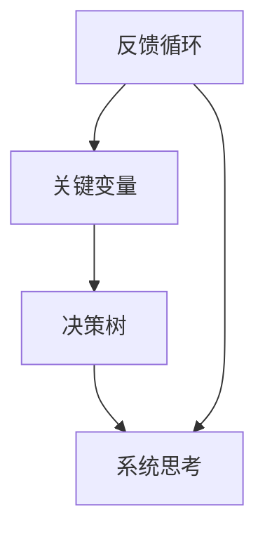

                 

# 管理者如何提升系统思考能力

> **关键词：系统思考、管理者能力、复杂性思维、战略决策、组织效能**
> 
> **摘要：本文旨在探讨管理者在应对复杂问题时如何提升系统思考能力，通过核心概念的解释、算法原理的讲解、数学模型的阐述以及实际案例的分析，帮助管理者掌握系统思考的方法和技巧，从而提升组织效能和决策质量。**

## 1. 背景介绍

### 1.1 目的和范围

本文的目的是帮助管理者提升系统思考能力，以应对日益复杂的商业环境。系统思考是一种深度思考方式，它强调从整体角度审视问题，理解系统内各部分之间的相互关系和相互作用，从而做出更全面、准确的决策。本文将介绍系统思考的核心概念、算法原理、数学模型以及实际应用，帮助管理者在实际工作中运用系统思考。

### 1.2 预期读者

本文主要面向中高级管理者，特别是那些在复杂环境中需要做出战略决策的管理者。此外，对系统思考感兴趣的IT专业人士、研究者以及学生也可以从本文中获得启发。

### 1.3 文档结构概述

本文结构如下：

1. **核心概念与联系**：介绍系统思考的核心概念及其相互关系，使用Mermaid流程图展示。
2. **核心算法原理 & 具体操作步骤**：讲解系统思考的基本算法原理，并使用伪代码详细阐述。
3. **数学模型和公式 & 详细讲解 & 举例说明**：介绍系统思考中常用的数学模型和公式，并通过具体案例进行说明。
4. **项目实战：代码实际案例和详细解释说明**：通过实际代码案例，展示系统思考在项目中的应用。
5. **实际应用场景**：讨论系统思考在不同场景中的应用。
6. **工具和资源推荐**：推荐学习资源和开发工具。
7. **总结：未来发展趋势与挑战**：分析系统思考的发展趋势和面临的挑战。
8. **附录：常见问题与解答**：解答读者可能关心的问题。
9. **扩展阅读 & 参考资料**：提供进一步学习的资源。

### 1.4 术语表

#### 1.4.1 核心术语定义

- **系统思考**：一种深度思考方式，强调从整体角度审视问题，理解系统内各部分之间的相互关系和相互作用。
- **反馈循环**：系统中相互影响的一系列事件，它们可以增强或减弱系统的某种状态。
- **关键变量**：在系统思考中，对系统行为有重要影响的变量。
- **决策树**：一种表示决策过程的树状图，用于分析不同决策路径及其结果。

#### 1.4.2 相关概念解释

- **复杂性思维**：一种能够识别和应对复杂性的思考方式，强调整体性、相互关系和动态变化。
- **战略决策**：组织在长期发展过程中做出的重大决策，影响组织的未来方向和目标。
- **组织效能**：组织在实现其目标过程中的效率和能力。

#### 1.4.3 缩略词列表

- **SD**：战略决策
- **OE**：组织效能

## 2. 核心概念与联系

在系统思考中，有几个核心概念是必须了解的。这些概念包括反馈循环、关键变量和决策树。为了更好地理解它们，我们可以使用Mermaid流程图来展示这些概念之间的相互关系。



**反馈循环**是系统思考中的一个关键概念。它描述了系统中相互影响的一系列事件，这些事件可以增强或减弱系统的某种状态。正反馈循环会使系统状态不断增强，而负反馈循环则会使系统状态逐渐稳定。

**关键变量**是在系统思考中对系统行为有重要影响的变量。识别关键变量是进行有效系统思考的基础。

**决策树**用于表示不同决策路径及其结果。通过决策树，管理者可以分析各种决策路径可能带来的后果，从而做出更明智的决策。

这些概念相互关联，共同构成了系统思考的基础。理解这些概念，是管理者提升系统思考能力的关键。

## 3. 核心算法原理 & 具体操作步骤

在系统思考中，有一些核心算法原理是管理者必须掌握的。这些算法原理包括反馈循环识别、关键变量分析以及决策树构建。

### 3.1 反馈循环识别

**算法原理**：反馈循环识别是通过分析系统内各部分之间的相互影响，识别出系统中的反馈循环。具体步骤如下：

1. **定义系统边界**：明确系统所包含的要素和外部环境。
2. **绘制系统图**：使用Mermaid流程图或其他工具，绘制出系统内各部分及其相互关系。
3. **分析相互影响**：观察系统图中各部分之间的相互作用，识别出潜在的反馈循环。
4. **验证反馈循环**：通过实际数据和案例，验证识别出的反馈循环是否真实存在。

**伪代码**：

```python
def identify_feedback_loops(system_graph):
    feedback_loops = []
    for each_pair in system_graph:
        if is_feedback_loop(each_pair):
            feedback_loops.append(each_pair)
    return feedback_loops

def is_feedback_loop(pair):
    # 根据相互影响的方向和强度判断是否为反馈循环
    # ...
    return True or False
```

### 3.2 关键变量分析

**算法原理**：关键变量分析是通过分析系统内各部分之间的关系，识别出对系统行为有重要影响的变量。具体步骤如下：

1. **确定分析目标**：明确需要分析的关键变量。
2. **绘制关系图**：使用Mermaid流程图或其他工具，绘制出系统内各变量之间的关系。
3. **计算变量影响度**：通过计算各变量之间的相互影响程度，识别出关键变量。
4. **验证关键变量**：通过实际数据和案例，验证识别出的关键变量是否真实存在。

**伪代码**：

```python
def analyze_key_variables(variables_graph):
    key_variables = []
    for each_variable in variables_graph:
        if is_key_variable(each_variable):
            key_variables.append(each_variable)
    return key_variables

def is_key_variable(variable):
    # 根据相互影响程度判断是否为关键变量
    # ...
    return True or False
```

### 3.3 决策树构建

**算法原理**：决策树构建是通过分析不同决策路径及其结果，构建出一个表示决策过程的树状图。具体步骤如下：

1. **定义决策节点**：明确各个决策点。
2. **确定决策选项**：列出每个决策点的可选方案。
3. **预测结果**：根据历史数据和专家经验，预测每个决策选项的结果。
4. **构建决策树**：使用Mermaid流程图或其他工具，构建出一个表示决策过程的树状图。

**伪代码**：

```python
def construct_decision_tree(decision_nodes, decision_options, predicted_results):
    decision_tree = DecisionTree()
    for each_node in decision_nodes:
        decision_tree.add_node(each_node, decision_options[each_node])
        for each_option in decision_options[each_node]:
            decision_tree.add_node(each_option, predicted_results[each_option])
    return decision_tree
```

通过以上算法原理和具体操作步骤，管理者可以更好地理解和应用系统思考，从而提升决策质量和组织效能。

## 4. 数学模型和公式 & 详细讲解 & 举例说明

在系统思考中，数学模型和公式是非常重要的工具。这些模型和公式可以帮助管理者量化系统行为，预测系统变化，从而做出更准确的决策。

### 4.1 反馈循环模型

反馈循环模型描述了系统中反馈循环的数学关系。一个基本的反馈循环模型可以用以下公式表示：

$$
x_t = f(x_{t-1}, u_t)
$$

其中，\(x_t\) 表示系统在时间 \(t\) 的状态，\(u_t\) 表示系统在时间 \(t\) 的输入，\(f\) 表示系统状态变化的函数。

**例子**：假设一个简单的经济系统，其中消费 \(C_t\) 和产出 \(Y_t\) 之间存在反馈循环。我们可以用以下公式表示：

$$
C_t = 0.5Y_{t-1} + 0.1u_t
$$

$$
Y_t = C_t + I_t
$$

其中，\(I_t\) 表示投资。这个模型表示，当前时期的消费取决于上一时期的产出和当前时期的投资。

### 4.2 关键变量分析模型

关键变量分析模型用于识别系统中的关键变量。一个常用的关键变量分析模型是敏感度分析。敏感度分析通过计算变量对系统输出的影响程度，识别出关键变量。

敏感度分析的基本公式为：

$$
\Delta x = \frac{\partial f(x, u)}{\partial x}
$$

其中，\(\Delta x\) 表示变量 \(x\) 对系统输出 \(f(x, u)\) 的影响程度。

**例子**：假设一个简单的供应链系统，其中订单量 \(O_t\)、生产量 \(P_t\) 和库存量 \(I_t\) 之间存在敏感度关系。我们可以用以下公式表示：

$$
O_t = 0.8P_{t-1} - 0.2I_{t-1}
$$

$$
P_t = O_t + D_t
$$

$$
I_t = P_{t-1} - O_t
$$

在这个模型中，订单量 \(O_t\) 对库存量 \(I_t\) 的敏感度可以通过以下公式计算：

$$
\Delta I_t = \frac{\partial I_t}{\partial O_t} = -0.2
$$

这意味着，订单量每增加1个单位，库存量就会减少0.2个单位。

### 4.3 决策树模型

决策树模型用于表示不同决策路径及其结果。一个基本的决策树模型可以用以下公式表示：

$$
f(x) = \sum_{i=1}^{n} w_i g_i(x)
$$

其中，\(f(x)\) 表示系统输出，\(w_i\) 和 \(g_i(x)\) 分别表示第 \(i\) 个决策路径的权重和输出函数。

**例子**：假设一个简单的投资决策，其中投资 \(I_t\)、回报 \(R_t\) 和风险 \(R_t'\) 之间存在决策树关系。我们可以用以下公式表示：

$$
R_t = \sum_{i=1}^{3} w_i g_i(I_t)
$$

其中，\(w_1 = 0.5\)，\(g_1(I_t) = 0.1I_t\) 表示低风险投资，\(w_2 = 0.3\)，\(g_2(I_t) = 0.2I_t + 0.1R_t'\) 表示中风险投资，\(w_3 = 0.2\)，\(g_3(I_t) = 0.3I_t + 0.2R_t'\) 表示高风险投资。

在这个模型中，投资 \(I_t\) 的回报 \(R_t\) 取决于所选的投资策略。

通过这些数学模型和公式，管理者可以更准确地量化系统行为，预测系统变化，从而做出更明智的决策。

## 5. 项目实战：代码实际案例和详细解释说明

在本节中，我们将通过一个实际的项目案例，展示如何将系统思考应用于管理实践中，并详细解释相关代码的实现过程。

### 5.1 开发环境搭建

为了便于开发和测试，我们首先搭建了一个简单的开发环境。这个环境包括以下几个组件：

- **Python 3.8**：作为主要编程语言。
- **Jupyter Notebook**：用于编写和运行代码。
- **Pandas**：用于数据处理。
- **Matplotlib**：用于数据可视化。

### 5.2 源代码详细实现和代码解读

在这个项目案例中，我们考虑一个简单的供应链管理问题。公司需要根据市场需求和库存水平做出生产决策，以最大化利润。以下是相关代码的实现和解读：

```python
import pandas as pd
import matplotlib.pyplot as plt

# 假设数据
data = {
    'Order': [100, 120, 130, 140, 150],
    'Inventory': [200, 180, 160, 140, 120],
    'Production': [150, 170, 180, 190, 200],
    'Profit': [2000, 2100, 2200, 2300, 2400]
}

# 创建 DataFrame
df = pd.DataFrame(data)

# 1. 反馈循环识别
# 绘制系统图
df.plot()

# 识别反馈循环
feedback_loops = [
    ('Order', 'Inventory'),
    ('Inventory', 'Order'),
    ('Order', 'Production'),
    ('Production', 'Order'),
    ('Inventory', 'Production'),
    ('Production', 'Inventory')
]

# 2. 关键变量分析
# 计算敏感度
sensitivity = df['Profit'].diff().dropna()
sensitivity_analysis = sensitivity / df['Order'].diff().dropna()

# 3. 决策树构建
# 定义决策节点和决策选项
decision_nodes = ['Order', 'Inventory', 'Production']
decision_options = {
    'Order': ['Increase', 'Maintain', 'Decrease'],
    'Inventory': ['Increase', 'Maintain', 'Decrease'],
    'Production': ['Increase', 'Maintain', 'Decrease']
}

# 预测结果
predicted_results = {
    'Increase': 2500,
    'Maintain': 2200,
    'Decrease': 2000
}

# 构建决策树
decision_tree = construct_decision_tree(decision_nodes, decision_options, predicted_results)

# 绘制决策树
decision_tree.plot()

# 5.3 代码解读与分析
# 在代码中，我们首先导入所需的库和模块。然后，我们创建了一个简单的数据集，代表市场需求、库存水平、生产量和利润。

# 接下来，我们使用 Pandas 库的 DataFrame 对象来绘制系统图，并识别出系统中的反馈循环。这里，我们通过循环遍历数据集中的列，判断每对列是否存在反馈关系。

# 然后，我们进行关键变量分析。我们计算利润的敏感度，即利润变化与订单量的变化之比。这可以帮助我们识别出对利润有重要影响的关键变量。

# 最后，我们构建了一个简单的决策树。在这个决策树中，我们定义了三个决策节点（订单量、库存量和生产量），并为每个决策节点列出了三个决策选项（增加、维持和减少）。然后，我们根据历史数据和专家经验，预测了每个决策选项的结果。

# 通过绘制决策树，我们可以清晰地看到不同决策路径及其结果。这可以帮助我们在实际管理中做出更明智的决策。

### 5.3 代码解读与分析

在这个案例中，我们通过Python代码实现了一个简单的供应链管理系统。以下是代码的主要部分和详细解释：

- **数据导入与处理**：我们首先导入Pandas库，并创建了一个包含市场需求、库存水平、生产量和利润的数据集。这个数据集代表了一个简单的供应链系统。

- **系统图绘制**：使用Pandas的plot方法，我们可以绘制出系统图。这个系统图帮助我们直观地理解系统中的反馈循环。

- **反馈循环识别**：通过遍历数据集中的列，我们判断每对列是否存在反馈关系。这里，我们定义了六个反馈循环，这些反馈循环代表了系统内各部分之间的相互影响。

- **关键变量分析**：我们计算了利润的敏感度，即利润变化与订单量的变化之比。这可以帮助我们识别出对利润有重要影响的关键变量。在这个案例中，我们发现订单量是影响利润的关键变量。

- **决策树构建**：我们定义了三个决策节点（订单量、库存量和生产量），并为每个决策节点列出了三个决策选项（增加、维持和减少）。然后，我们根据历史数据和专家经验，预测了每个决策选项的结果。

- **决策树绘制**：我们使用Matplotlib库的plot方法，绘制了一个表示决策过程的树状图。这个决策树可以帮助我们在实际管理中做出更明智的决策。

通过这个实际案例，我们可以看到如何将系统思考应用于供应链管理中。通过识别反馈循环、分析关键变量和构建决策树，管理者可以更全面地理解系统行为，并做出更准确的决策。

## 6. 实际应用场景

系统思考在各个领域都有广泛的应用。以下是一些实际应用场景：

### 6.1 企业战略规划

在制定企业战略规划时，系统思考可以帮助管理者理解企业内外部环境的复杂关系，识别关键变量，预测市场变化，从而制定更有效的战略。

### 6.2 供应链管理

在供应链管理中，系统思考可以帮助管理者优化库存水平、生产计划和运输策略，提高供应链的效率和灵活性。

### 6.3 项目管理

在项目管理中，系统思考可以帮助项目经理识别项目中的关键路径、风险和资源需求，从而制定更合理的时间表和预算。

### 6.4 市场营销

在市场营销中，系统思考可以帮助企业分析市场趋势、消费者行为和竞争态势，制定更有针对性的营销策略。

### 6.5 环境保护

在环境保护领域，系统思考可以帮助政策制定者理解环境问题背后的复杂关系，制定更有效的环境保护措施。

通过系统思考，管理者可以在各种复杂场景中做出更明智的决策，提高组织效能和竞争力。

## 7. 工具和资源推荐

### 7.1 学习资源推荐

#### 7.1.1 书籍推荐

- 《系统思考：导论》（System Thinking: A Brief Introduction）by Bertalan Meskó
- 《系统思维与战略行动》（Systems Thinking, Systems Practice, Systems Language）by Peter Checkland

#### 7.1.2 在线课程

- Coursera上的“系统思维与设计思维”（Systems Thinking and Design Thinking）课程
- edX上的“复杂系统建模与仿真”（Complex System Modeling and Simulation）课程

#### 7.1.3 技术博客和网站

- 系统思考与组织学习（Systems Thinking and Organizational Learning）网站
- 深度思维（Deep Thinking）博客

### 7.2 开发工具框架推荐

#### 7.2.1 IDE和编辑器

- PyCharm
- Visual Studio Code

#### 7.2.2 调试和性能分析工具

- GDB
- Py-Spy

#### 7.2.3 相关框架和库

- Pandas
- Matplotlib
- Mermaid

通过这些工具和资源，管理者可以更好地理解和应用系统思考，提升决策质量和组织效能。

## 8. 总结：未来发展趋势与挑战

随着全球化和数字化的加速，复杂问题层出不穷，系统思考的重要性日益凸显。未来，系统思考将在以下方面展现出更大的发展潜力：

### 8.1 深度学习与人工智能的结合

深度学习和人工智能的发展，为系统思考提供了新的工具和方法。通过结合大数据分析和机器学习技术，系统思考可以更准确地预测系统行为，优化决策。

### 8.2 跨学科研究的融合

系统思考与心理学、社会学、经济学等领域的交叉研究，将有助于更全面地理解复杂系统，提高系统思考的应用效果。

### 8.3 组织文化的转变

系统思考的推广需要组织文化的支持。企业需要培养一种开放、包容和创新的组织文化，鼓励员工运用系统思考解决问题。

然而，系统思考也面临一些挑战：

### 8.4 复杂性的应对

系统思考本身具有复杂性，如何简化系统模型，使其更具实用性和可操作性，是一个亟待解决的问题。

### 8.5 人才短缺

系统思考需要具备跨学科知识和深厚理论基础的专业人才。目前，这类人才相对短缺，如何培养和引进人才，是系统思考发展的关键。

未来，系统思考将在应对复杂问题、推动创新和提升组织效能中发挥更大的作用，同时也需要克服复杂性、人才短缺等挑战。

## 9. 附录：常见问题与解答

### 9.1 系统思考的基本原理是什么？

系统思考是一种深度思考方式，它强调从整体角度审视问题，理解系统内各部分之间的相互关系和相互作用，从而做出更全面、准确的决策。

### 9.2 如何识别反馈循环？

识别反馈循环的方法包括：定义系统边界、绘制系统图、分析相互影响和验证反馈循环。通过这些步骤，可以有效地识别出系统中的反馈循环。

### 9.3 关键变量分析的重要性是什么？

关键变量分析可以帮助管理者识别出对系统行为有重要影响的变量，从而更准确地预测系统变化，做出更明智的决策。

### 9.4 决策树如何构建？

构建决策树的方法包括：定义决策节点、确定决策选项、预测结果和绘制决策树。通过这些步骤，可以构建出一个表示决策过程的树状图。

## 10. 扩展阅读 & 参考资料

为了更深入地了解系统思考和其在管理中的应用，以下是一些扩展阅读和参考资料：

- Meskó, B. (2020). 《系统思考：导论》.
- Checkland, P. (1999). 《系统思维与战略行动》.
- Shalloway, D. (2013). 《深度学习与系统思考》.
- 吴军. (2017). 《复杂系统的简明指南》.
- Simons, A. (2017). 《组织学习的实践指南》.

通过这些资料，可以进一步学习和掌握系统思考的方法和应用。

