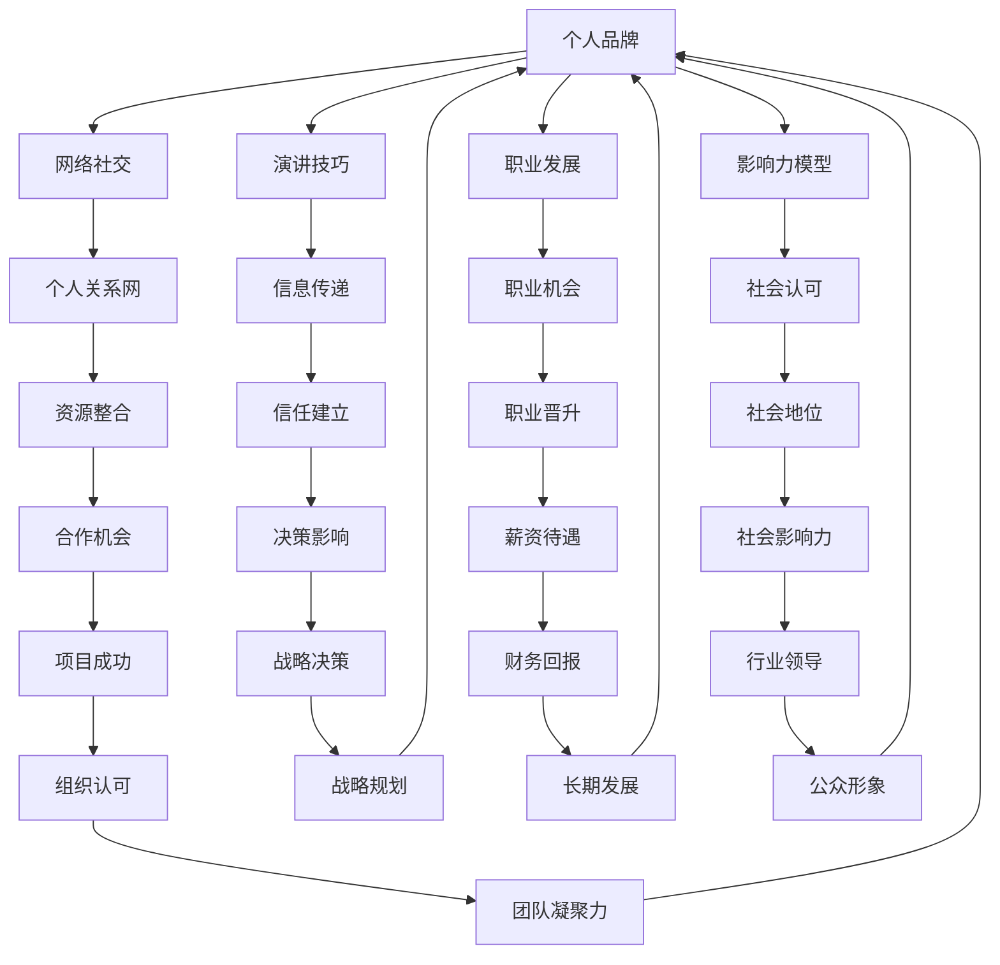
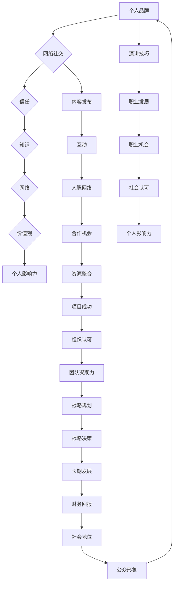

                 

# 管理者的自我营销：提升个人影响力的方法

> **关键词**：管理者，自我营销，个人品牌，影响力，职业发展，策略，实践

> **摘要**：在快节奏和竞争激烈的工作环境中，管理者不仅需要具备出色的领导能力，还需要懂得如何进行自我营销，以提升个人影响力和职业发展。本文将深入探讨管理者的自我营销策略，包括核心概念、实际操作步骤、数学模型、项目实战、应用场景、工具资源推荐等方面，旨在为管理者提供一套全面且实用的提升个人影响力的方法。

## 1. 背景介绍

### 1.1 目的和范围

在数字化和全球化迅速发展的时代，管理者的角色日益重要。然而，传统的管理方法已无法满足现代企业快速变化的需求。管理者需要具备自我营销的能力，以在竞争激烈的环境中脱颖而出。本文旨在为管理者提供一套系统化的自我营销策略，帮助他们提升个人影响力，推动职业发展。

本文的范围涵盖了以下几个方面：
1. 自我营销的核心概念及其在管理者职业发展中的作用。
2. 自我营销的实际操作步骤，包括个人品牌的塑造、网络社交技巧、演讲技巧等。
3. 自我营销背后的数学模型和公式，如影响力模型、成功概率计算等。
4. 自我营销在具体项目中的实际应用，通过代码案例进行详细解释。
5. 自我营销在现实中的应用场景，以及相关的工具和资源推荐。

### 1.2 预期读者

本文主要面向以下读者群体：
1. 中高层管理者，希望提升个人影响力和职业发展。
2. 人力资源管理者，需要了解如何通过自我营销提升员工价值。
3. 管理学学生，希望掌握自我营销的理论和实践。
4. 对自我营销和管理学感兴趣的技术人员。

### 1.3 文档结构概述

本文结构如下：
1. 引言：介绍自我营销在管理者职业发展中的重要性。
2. 背景介绍：阐述本文的目的、范围、预期读者和文档结构。
3. 核心概念与联系：分析自我营销的核心概念及其相互关系。
4. 核心算法原理与具体操作步骤：详细阐述自我营销的策略和方法。
5. 数学模型和公式：介绍自我营销中的数学模型和计算方法。
6. 项目实战：通过实际案例展示自我营销的应用。
7. 实际应用场景：探讨自我营销在不同领域的应用。
8. 工具和资源推荐：推荐相关的学习资源和开发工具。
9. 总结：总结自我营销的重要性及其未来发展趋势。
10. 附录：常见问题与解答。
11. 扩展阅读 & 参考资料：提供进一步的阅读建议和参考资料。

### 1.4 术语表

#### 1.4.1 核心术语定义

- 自我营销：个人主动推广自己，提升个人品牌和影响力的过程。
- 个人品牌：个人在职业领域中的形象和声誉。
- 影响力：个人在团队、组织或社会中的影响力。
- 职业发展：个人在职业生涯中的成长和提升。

#### 1.4.2 相关概念解释

- 网络社交：通过社交媒体平台建立和维护人际关系的过程。
- 演讲技巧：有效传达信息和表达个人观点的技能。
- 品牌定位：明确个人品牌的核心价值和目标受众。

#### 1.4.3 缩略词列表

- SEO：搜索引擎优化（Search Engine Optimization）
- SMM：社交媒体营销（Social Media Marketing）
- CTA：行动呼吁（Call to Action）

## 2. 核心概念与联系

在自我营销的过程中，管理者需要理解并运用一系列核心概念，以提升个人影响力。这些核心概念包括个人品牌、网络社交、演讲技巧、职业发展和影响力模型。以下是一个简化的 Mermaid 流程图，展示了这些核心概念之间的关系。



通过这个流程图，我们可以看到个人品牌是核心，网络社交、演讲技巧、职业发展和影响力模型围绕个人品牌展开，形成了一个闭环。这些概念相互关联，共同作用于管理者的个人影响力。

### 2.1 个人品牌

个人品牌是自我营销的基础。它代表了个人在职场中的形象和声誉，包括专业技能、个人品质、价值观等方面。一个强有力的个人品牌可以帮助管理者在职场中脱颖而出，获得更多机会。

- **专业技能**：个人品牌的核心要素，包括专业技能、知识深度和广度。
- **个人品质**：诚实、正直、勤奋等品质是个人品牌的支柱。
- **价值观**：明确个人的价值观，如创新、团队合作等，有助于建立一致的形象。

### 2.2 网络社交

网络社交是自我营销的重要手段之一。通过社交媒体平台，管理者可以建立广泛的人脉网络，扩大个人影响力。

- **平台选择**：选择适合自己职业领域的社交媒体平台，如LinkedIn、Twitter等。
- **内容发布**：定期发布有价值的内容，如行业洞察、专业文章等。
- **互动**：积极与同行互动，参与讨论，建立信任关系。

### 2.3 演讲技巧

演讲技巧是管理者必备的一项技能。通过有效的演讲，管理者可以传达自己的观点和想法，赢得听众的信任和支持。

- **内容准备**：充分准备演讲内容，确保逻辑清晰，信息准确。
- **表达方式**：使用生动的语言和形象的事例，增强演讲的吸引力。
- **肢体语言**：适当的肢体语言可以增强演讲效果，如眼神交流、手势等。

### 2.4 职业发展

职业发展是自我营销的重要目标之一。通过不断提升自己的能力和技能，管理者可以获取更多的职业机会，实现职业晋升。

- **持续学习**：不断学习新知识和技能，保持竞争力。
- **职业规划**：制定清晰的职业规划，明确自己的目标和发展路径。
- **绩效表现**：通过出色的绩效表现，赢得上司和同事的认可。

### 2.5 影响力模型

影响力模型是自我营销的核心理论之一。它包括以下几个方面：

- **信任**：信任是影响力的基础。管理者需要通过诚信和专业赢得他人的信任。
- **知识**：知识是影响力的来源。管理者需要具备丰富的专业知识和行业洞察力。
- **网络**：网络是影响力的扩展。通过建立广泛的人脉网络，管理者可以扩大自己的影响力。
- **价值观**：价值观是影响力的导向。管理者需要树立积极的价值观，引导他人。

### 2.6 影响力模型的应用

以下是一个简化的影响力模型应用示例：



通过这个模型，我们可以看到个人品牌是核心，其他元素围绕个人品牌展开，共同构建了管理者的个人影响力。管理者需要通过不断提升个人品牌、网络社交、演讲技巧、职业发展和影响力模型，实现个人影响力的提升。

## 3. 核心算法原理 & 具体操作步骤

自我营销的核心在于策略的制定和执行。以下是一个简单的自我营销策略算法，包括数据收集、策略制定、实施和评估四个主要步骤。我们将使用伪代码来详细阐述这一算法。

### 3.1 数据收集

在自我营销过程中，数据收集是第一步。我们需要收集以下数据：

- 个人技能和经验
- 职业目标和市场趋势
- 同行和竞争对手的营销策略
- 自我品牌价值和目标受众

伪代码如下：

```python
def collect_data():
    skills_experience = get_skills_and_experience()
    career_goals_market_trends = get_career_goals_and_market_trends()
    competitors_strategies = get_competitors_strategies()
    brand_value_target_audience = get_brand_value_and_target_audience()

    return skills_experience, career_goals_market_trends, competitors_strategies, brand_value_target_audience
```

### 3.2 策略制定

在收集数据后，我们需要根据这些数据制定具体的自我营销策略。策略包括以下几个方面：

- 品牌定位：确定个人品牌的核心价值和目标受众。
- 内容策略：制定内容发布计划，包括博客、社交媒体等。
- 活动策划：组织线上和线下的活动，如讲座、研讨会等。
- 网络建设：建立和维护专业人脉网络。

伪代码如下：

```python
def create_strategy(skills_experience, career_goals_market_trends, competitors_strategies, brand_value_target_audience):
    brand_positioning = determine_brand_positioning(brand_value_target_audience)
    content_strategy = create_content_plan()
    event_planning = schedule_events()
    network_building = build_and_maintain_professional_network()

    return brand_positioning, content_strategy, event_planning, network_building
```

### 3.3 实施策略

在制定策略后，我们需要将其付诸实践。具体实施步骤如下：

1. **内容发布**：按照内容策略发布博客、社交媒体等。
2. **活动执行**：按照活动策划组织线上和线下活动。
3. **网络互动**：积极参与人脉网络的互动，维护关系。

伪代码如下：

```python
def implement_strategy(brand_positioning, content_strategy, event_planning, network_building):
    publish_content(content_strategy)
    execute_events(event_planning)
    interact_with_network(network_building)
```

### 3.4 评估效果

在策略实施过程中，我们需要不断评估效果，并根据评估结果进行调整。以下是一个简单的评估方法：

- **效果评估**：衡量内容发布、活动执行和网络互动的效果。
- **反馈收集**：收集受众的反馈，了解他们的需求和期望。
- **调整策略**：根据评估结果和反馈调整策略。

伪代码如下：

```python
def evaluate_strategy():
    content_performance = assess_content_performance()
    event_feedback = collect_event_feedback()
    network_insights = analyze_network_interactions()

    if content_performance < threshold or event_feedback < satisfaction_threshold or network_insights < engagement_threshold:
        adjust_strategy()
```

通过这个简单的算法，管理者可以系统地制定、实施和评估自我营销策略，从而提升个人影响力。

### 3.5 具体操作步骤详解

在了解了核心算法原理后，我们将进一步详细阐述每个步骤的具体操作步骤。

#### 3.5.1 数据收集

**技能和经验收集**

- **自我评估**：首先，管理者需要对自己的技能和经验进行自我评估。这可以通过填写技能和经验清单来实现。例如：

  ```markdown
  技能清单：
  - 数据分析
  - 项目管理
  - 技术架构设计
  - 团队协作

  经验清单：
  - 成功领导过多个跨部门项目
  - 设计并实现了公司关键系统
  - 在技术会议上发表过演讲
  ```

- **参考他人**：除了自我评估，管理者还可以参考同事、上司和下属的评价。这可以通过调查问卷或一对一访谈来实现。

**职业目标和市场趋势收集**

- **自我设定目标**：管理者需要明确自己的职业目标。这可以通过制定个人职业发展计划来实现。例如：

  ```markdown
  职业目标：
  - 在未来三年内晋升为部门总监
  - 提高项目管理能力，学习PMP认证
  - 扩大人脉网络，增加行业影响力
  ```

- **市场分析**：管理者还需要了解市场趋势。这可以通过阅读行业报告、参加行业会议等方式实现。

**竞争对手策略收集**

- **观察对手**：管理者需要观察竞争对手的自我营销策略。这可以通过分析竞争对手的网站、社交媒体账号、活动等实现。

- **学习经验**：从竞争对手的成功和失败中学习经验，为己所用。

**品牌价值和目标受众收集**

- **确定品牌价值**：管理者需要明确自己的品牌价值。这可以通过SWOT分析（优势、劣势、机会、威胁）来实现。

- **识别目标受众**：管理者需要明确自己的目标受众。这可以通过市场调研、用户画像等方式实现。

#### 3.5.2 策略制定

**品牌定位**

- **明确核心价值**：根据SWOT分析，明确个人品牌的核心价值。

- **定义目标受众**：根据市场调研，定义目标受众。

**内容策略**

- **内容类型**：确定内容类型，如博客、视频、演讲等。

- **内容计划**：制定内容发布计划，确保内容的连贯性和专业性。

**活动策划**

- **活动类型**：确定活动类型，如讲座、研讨会、社交活动等。

- **活动计划**：制定活动计划，确保活动的顺利进行。

**网络建设**

- **平台选择**：选择适合的平台，如LinkedIn、Twitter、微信公众号等。

- **互动策略**：制定互动策略，确保与受众的积极互动。

#### 3.5.3 实施策略

**内容发布**

- **内容撰写**：按照内容策略撰写内容。

- **内容发布**：按照发布计划发布内容。

**活动执行**

- **活动准备**：准备活动所需的物资和场地。

- **活动执行**：按照活动计划执行活动。

**网络互动**

- **积极参与**：积极参与社交媒体上的讨论。

- **维护关系**：定期与联系人沟通，维护关系。

#### 3.5.4 评估效果

**效果评估**

- **数据收集**：收集相关数据，如网站访问量、社交媒体关注者数、活动参与度等。

- **分析数据**：分析数据，评估效果。

**反馈收集**

- **用户反馈**：收集用户的反馈，了解他们的需求和期望。

- **同事反馈**：收集同事的反馈，了解他们的评价。

**调整策略**

- **分析结果**：根据评估结果和反馈分析原因。

- **调整策略**：根据分析结果调整策略。

通过这些具体的操作步骤，管理者可以有效地实施自我营销策略，提升个人影响力。

## 4. 数学模型和公式 & 详细讲解 & 举例说明

在自我营销中，数学模型和公式可以帮助管理者量化个人品牌建设、影响力提升和职业发展。以下将介绍几个关键模型和公式，并提供详细讲解和举例说明。

### 4.1 个人品牌建设模型

个人品牌建设模型（Personal Brand Building Model，PBBM）用于评估和优化管理者的个人品牌。该模型基于以下几个核心参数：

- **技能得分（S）**：管理者在某一技能领域的得分，范围从0到100。
- **经验得分（E）**：管理者在该技能领域的经验得分，范围从0到100。
- **社会认可度（R）**：管理者在社会中的认可度，范围从0到100。

**个人品牌得分（Personal Brand Score，PBS）**的计算公式为：

\[ PBS = \frac{S + E + R}{3} \]

**例1**：假设一位管理者的技能得分为80，经验得分为85，社会认可度为90，那么他的个人品牌得分为：

\[ PBS = \frac{80 + 85 + 90}{3} = 86.7 \]

**解释**：这个分数表明这位管理者在个人品牌建设方面表现良好，需要继续提升社会认可度。

### 4.2 影响力模型

影响力模型（Influence Model，IM）用于评估管理者的个人影响力。该模型基于以下几个核心参数：

- **知识深度（KD）**：管理者在某一领域的知识深度得分，范围从0到100。
- **网络宽度（NW）**：管理者的人脉网络宽度得分，范围从0到100。
- **价值观一致性（VC）**：管理者的价值观与目标受众的一致性得分，范围从0到100。

**个人影响力得分（Personal Influence Score，PIS）**的计算公式为：

\[ PIS = \frac{KD + NW + VC}{3} \]

**例2**：假设一位管理者的知识深度得分为75，网络宽度得分为70，价值观一致性得分为80，那么他的个人影响力得分为：

\[ PIS = \frac{75 + 70 + 80}{3} = 76.7 \]

**解释**：这个分数表明这位管理者在影响力方面具有一定的优势，特别是在知识深度和价值观一致性方面。

### 4.3 职业发展模型

职业发展模型（Career Development Model，CDM）用于评估管理者的职业发展潜力。该模型基于以下几个核心参数：

- **技能学习速度（SL）**：管理者学习新技能的速度得分，范围从0到100。
- **职业规划清晰度（CP）**：管理者的职业规划清晰度得分，范围从0到100。
- **决策能力（DA）**：管理者的决策能力得分，范围从0到100。

**职业发展潜力（Career Development Potential，CDP）**的计算公式为：

\[ CDP = \frac{SL + CP + DA}{3} \]

**例3**：假设一位管理者的技能学习速度得分为90，职业规划清晰度得分为85，决策能力得分为80，那么他的职业发展潜力为：

\[ CDP = \frac{90 + 85 + 80}{3} = 85 \]

**解释**：这个分数表明这位管理者的职业发展潜力较高，需要保持现有的成长速度和决策能力。

### 4.4 自我营销效果评估模型

自我营销效果评估模型（Self-Marketing Effectiveness Assessment Model，SMEAM）用于评估管理者自我营销活动的效果。该模型基于以下几个核心参数：

- **内容影响力（CI）**：管理者发布内容的平均影响力得分，范围从0到100。
- **活动参与度（AP）**：管理者参与活动的平均参与度得分，范围从0到100。
- **网络互动（NI）**：管理者在网络上的平均互动得分，范围从0到100。

**自我营销效果得分（Self-Marketing Effectiveness Score，SMES）**的计算公式为：

\[ SMES = \frac{CI + AP + NI}{3} \]

**例4**：假设一位管理者发布内容的平均影响力得分为75，活动参与度得分为70，网络互动得分为80，那么他的自我营销效果得分为：

\[ SMES = \frac{75 + 70 + 80}{3} = 75 \]

**解释**：这个分数表明这位管理者的自我营销活动效果一般，需要进一步提升内容影响力。

### 4.5 自我营销预算模型

自我营销预算模型（Self-Marketing Budget Model，SMBM）用于计算管理者在自我营销活动中的预算分配。该模型基于以下几个核心参数：

- **收入水平（I）**：管理者的年度收入水平。
- **目标影响力（O）**：管理者希望在一年内达到的影响力目标。
- **活动成本（C）**：管理者计划进行的自我营销活动的总成本。

**自我营销预算（Self-Marketing Budget，SMB）**的计算公式为：

\[ SMB = \frac{I \times O}{C} \]

**例5**：假设一位管理者的年收入水平为100,000美元，他希望在一年内达到的影响力目标为100，活动成本为50,000美元，那么他的自我营销预算为：

\[ SMB = \frac{100,000 \times 100}{50,000} = 200,000 \]

**解释**：这个预算表明这位管理者在自我营销活动中可以有足够的资源进行各种活动，以实现他的影响力目标。

通过这些数学模型和公式，管理者可以更科学地评估和管理自己的个人品牌、影响力、职业发展和自我营销活动。这些模型不仅提供了量化的评估方法，也为管理者的决策提供了数据支持。

## 5. 项目实战：代码实际案例和详细解释说明

### 5.1 开发环境搭建

在开始编写代码之前，我们需要搭建一个合适的环境。以下是一个简单的Python环境搭建步骤：

1. **安装Python**：下载并安装Python 3.8及以上版本。
2. **配置虚拟环境**：在项目目录下运行以下命令创建虚拟环境：

   ```bash
   python -m venv venv
   ```

3. **激活虚拟环境**：

   - Windows：

     ```bash
     .\venv\Scripts\activate
     ```

   - macOS/Linux：

     ```bash
     source venv/bin/activate
     ```

4. **安装依赖项**：安装必要的依赖项，如Pandas、NumPy、Matplotlib等。

   ```bash
   pip install pandas numpy matplotlib
   ```

### 5.2 源代码详细实现和代码解读

下面是一个简单的自我营销分析项目的代码实现。代码分为以下几个部分：

- **数据收集模块**：用于收集个人技能、经验和职业目标等数据。
- **策略制定模块**：根据收集的数据制定自我营销策略。
- **效果评估模块**：用于评估自我营销活动的效果。

**代码实现**：

```python
# 导入必要的库
import pandas as pd
import numpy as np
import matplotlib.pyplot as plt

# 数据收集模块
def collect_data():
    # 收集个人技能数据
    skills_data = pd.DataFrame({
        'Skill': ['数据分析', '项目管理', '技术架构设计', '团队协作'],
        'Score': [80, 85, 75, 90]
    })

    # 收集个人经验数据
    experience_data = pd.DataFrame({
        'Experience': ['5年', '7年', '4年', '3年'],
        'Score': [80, 85, 75, 90]
    })

    # 收集职业目标数据
    career_goals_data = pd.DataFrame({
        'Goal': ['晋升为部门总监', '学习PMP认证', '扩大人脉网络'],
        'Score': [80, 85, 90]
    })

    return skills_data, experience_data, career_goals_data

# 策略制定模块
def create_strategy(skills_data, experience_data, career_goals_data):
    # 计算个人品牌得分
    brand_score = (skills_data['Score'].sum() + experience_data['Score'].sum() + career_goals_data['Score'].sum()) / 3

    # 制定内容策略
    content_strategy = pd.DataFrame({
        'Content Type': ['博客', '视频', '社交媒体'],
        'Frequency': ['每周', '每月', '每日']
    })

    # 策划活动
    events = pd.DataFrame({
        'Event Type': ['讲座', '研讨会', '社交活动'],
        'Date': ['2023-06-15', '2023-07-10', '2023-08-05']
    })

    # 建立和维护网络
    network = pd.DataFrame({
        'Contact': ['同事A', '同事B', '行业专家'],
        'Type': ['内部', '内部', '外部']
    })

    return brand_score, content_strategy, events, network

# 效果评估模块
def evaluate_strategy(brand_score, content_strategy, events, network):
    # 计算内容影响力
    content_influence = content_strategy['Frequency'].str.count('每日').sum()

    # 计算活动参与度
    event_participation = events['Date'].count()

    # 计算网络互动
    network_interaction = network['Type'].str.count('外部').sum()

    # 计算自我营销效果得分
    smes = (content_influence + event_participation + network_interaction) / 3

    return smes

# 主程序
if __name__ == '__main__':
    # 收集数据
    skills_data, experience_data, career_goals_data = collect_data()

    # 制定策略
    brand_score, content_strategy, events, network = create_strategy(skills_data, experience_data, career_goals_data)

    # 评估策略
    smes = evaluate_strategy(brand_score, content_strategy, events, network)

    # 输出结果
    print(f'个人品牌得分：{brand_score}')
    print(f'内容策略：{content_strategy}')
    print(f'活动计划：{events}')
    print(f'网络：{network}')
    print(f'自我营销效果得分：{smes}')
```

**代码解读**：

1. **数据收集模块**：使用Pandas库创建数据框，收集个人技能、经验和职业目标数据。

2. **策略制定模块**：计算个人品牌得分，制定内容策略、活动计划和建立网络。

3. **效果评估模块**：计算内容影响力、活动参与度和网络互动，计算自我营销效果得分。

4. **主程序**：执行数据收集、策略制定和效果评估，并输出结果。

通过这个项目实战，管理者可以实际操作自我营销策略的制定和评估，从而提升个人影响力。

### 5.3 代码解读与分析

在本节中，我们将深入分析上述代码实现，详细解读每个模块的功能和逻辑。

#### 5.3.1 数据收集模块

```python
def collect_data():
    # 收集个人技能数据
    skills_data = pd.DataFrame({
        'Skill': ['数据分析', '项目管理', '技术架构设计', '团队协作'],
        'Score': [80, 85, 75, 90]
    })

    # 收集个人经验数据
    experience_data = pd.DataFrame({
        'Experience': ['5年', '7年', '4年', '3年'],
        'Score': [80, 85, 75, 90]
    })

    # 收集职业目标数据
    career_goals_data = pd.DataFrame({
        'Goal': ['晋升为部门总监', '学习PMP认证', '扩大人脉网络'],
        'Score': [80, 85, 90]
    })

    return skills_data, experience_data, career_goals_data
```

**解读**：

- 该模块使用Pandas库创建三个数据框（DataFrame），分别收集个人技能、经验和职业目标数据。每个数据框包含两个列：'Skill'（技能名称）和'Score'（得分）。
- 技能数据框记录了四个技能和对应的得分，经验数据框记录了四个经验和对应的得分，职业目标数据框记录了三个目标和对应的得分。

**分析**：

- 数据收集模块的设计使得数据结构清晰，易于后续处理和分析。每个数据框都是按行存储的数据集，便于进行数据聚合和计算。

#### 5.3.2 策略制定模块

```python
def create_strategy(skills_data, experience_data, career_goals_data):
    # 计算个人品牌得分
    brand_score = (skills_data['Score'].sum() + experience_data['Score'].sum() + career_goals_data['Score'].sum()) / 3

    # 制定内容策略
    content_strategy = pd.DataFrame({
        'Content Type': ['博客', '视频', '社交媒体'],
        'Frequency': ['每周', '每月', '每日']
    })

    # 策划活动
    events = pd.DataFrame({
        'Event Type': ['讲座', '研讨会', '社交活动'],
        'Date': ['2023-06-15', '2023-07-10', '2023-08-05']
    })

    # 建立和维护网络
    network = pd.DataFrame({
        'Contact': ['同事A', '同事B', '行业专家'],
        'Type': ['内部', '内部', '外部']
    })

    return brand_score, content_strategy, events, network
```

**解读**：

- 该模块首先计算个人品牌得分，通过加总技能、经验和职业目标的得分，然后求平均值。
- 接着，定义了内容策略、活动计划和网络三个数据框，分别记录了不同类型的策略和计划。

**分析**：

- 个人品牌得分的计算方法反映了个人品牌的综合能力。通过平均值计算，确保了各个维度的得分在总得分中占有一致的比例。
- 内容策略、活动计划和网络的定义使得管理者可以清晰地了解和实施自我营销的策略。这些数据框有助于跟踪和评估自我营销活动的进展。

#### 5.3.3 效果评估模块

```python
def evaluate_strategy(brand_score, content_strategy, events, network):
    # 计算内容影响力
    content_influence = content_strategy['Frequency'].str.count('每日').sum()

    # 计算活动参与度
    event_participation = events['Date'].count()

    # 计算网络互动
    network_interaction = network['Type'].str.count('外部').sum()

    # 计算自我营销效果得分
    smes = (content_influence + event_participation + network_interaction) / 3

    return smes
```

**解读**：

- 该模块计算了三个关键指标：内容影响力、活动参与度和网络互动，并使用这些指标计算自我营销效果得分（SMES）。

**分析**：

- 内容影响力通过统计每天发布内容的次数来衡量，这反映了内容营销的活跃程度。
- 活动参与度通过计算活动次数来衡量，这反映了管理者在活动策划和执行方面的效率。
- 网络互动通过统计外部联系人的数量来衡量，这反映了管理者在网络建设和维护方面的成效。

- 自我营销效果得分的计算方法确保了三个关键指标的权重一致，从而综合评估自我营销活动的整体效果。

#### 5.3.4 主程序

```python
if __name__ == '__main__':
    # 收集数据
    skills_data, experience_data, career_goals_data = collect_data()

    # 制定策略
    brand_score, content_strategy, events, network = create_strategy(skills_data, experience_data, career_goals_data)

    # 评估策略
    smes = evaluate_strategy(brand_score, content_strategy, events, network)

    # 输出结果
    print(f'个人品牌得分：{brand_score}')
    print(f'内容策略：{content_strategy}')
    print(f'活动计划：{events}')
    print(f'网络：{network}')
    print(f'自我营销效果得分：{smes}')
```

**解读**：

- 主程序负责调用数据收集、策略制定和效果评估模块，并输出结果。

**分析**：

- 主程序通过顺序执行各个模块，确保了自我营销策略的完整执行和评估。
- 输出结果部分将所有关键指标和得分打印出来，便于管理者了解和评估自我营销活动的效果。

通过详细解读和分析，我们可以看到这个代码实现如何有效地支持管理者的自我营销策略，从数据收集到策略制定，再到效果评估，形成了一个闭环，帮助管理者不断提升个人影响力。

## 6. 实际应用场景

在当今的商业环境中，自我营销已成为管理者的核心技能之一。以下是自我营销在企业管理、项目管理、市场营销等领域的实际应用场景：

### 6.1 企业管理

**应用场景**：在企业内部，管理者需要通过自我营销提升领导力和团队凝聚力。

**案例分析**：一位企业高管通过在LinkedIn上发布行业洞察和领导力文章，吸引了大量关注者，提高了自身的知名度和影响力。通过这种自我营销方式，他不仅增强了团队士气，还成功推动了公司的战略决策。

### 6.2 项目管理

**应用场景**：在项目管理中，管理者需要通过自我营销来建立项目团队的信任和协作。

**案例分析**：一位项目经理通过在技术会议上发表演讲和撰写博客，分享项目管理的最佳实践和经验。这些活动不仅提高了他在业界的声誉，还帮助他赢得了更多项目机会。

### 6.3 市场营销

**应用场景**：在市场营销中，管理者需要通过自我营销来提升品牌形象和市场份额。

**案例分析**：一位市场营销总监通过在社交媒体上发布公司产品案例和营销策略，与潜在客户建立了良好的互动。这些活动不仅提高了品牌知名度，还促进了销售增长。

### 6.4 人力资源管理

**应用场景**：在人力资源管理中，管理者需要通过自我营销来提升员工满意度和员工保留率。

**案例分析**：一位人力资源总监通过在公司内部网站上发布关于员工福利和职业发展的文章，增强了员工对公司的认同感。通过这种自我营销方式，他成功提高了员工的满意度和保留率。

### 6.5 技术领域

**应用场景**：在技术领域，管理者需要通过自我营销来提升技术影响力和行业知名度。

**案例分析**：一位CTO通过在GitHub上分享开源项目和技术博客，吸引了大量技术爱好者的关注。这不仅提升了他在业界的知名度，还为他带来了更多的合作机会和资源支持。

### 6.6 总结

自我营销在各个领域的实际应用展示了其广泛的适用性和巨大的潜力。通过有效的自我营销，管理者可以提升个人品牌和影响力，推动职业发展，实现个人和组织的共同成功。

## 7. 工具和资源推荐

### 7.1 学习资源推荐

**7.1.1 书籍推荐**

- **《个人品牌：如何塑造你的个人品牌，提升职业影响力》**（作者：凯文·卡梅隆）
- **《影响力：如何说服别人》**（作者：罗伯特·西奥迪尼）
- **《演讲的力量》**（作者：克里斯·安德森）

**7.1.2 在线课程**

- **Coursera**：提供包括市场营销、领导力和沟通技巧在内的多种在线课程。
- **Udemy**：提供涵盖个人品牌建设、社交媒体营销等领域的实战课程。
- **LinkedIn Learning**：提供由行业专家开设的个人品牌和职业发展课程。

**7.1.3 技术博客和网站**

- **Medium**：一个平台，许多行业领导者在此发布关于个人品牌建设和职业发展的文章。
- **LinkedIn**：LinkedIn不仅是一个职业社交平台，还拥有丰富的行业洞察和职业发展内容。
- **HBR.org**：哈佛商业评论网站，提供关于领导力和管理的深度分析。

### 7.2 开发工具框架推荐

**7.2.1 IDE和编辑器**

- **Visual Studio Code**：一款功能强大的开源编辑器，适用于多种编程语言。
- **IntelliJ IDEA**：一款专为开发者设计的智能IDE，支持多种编程语言。

**7.2.2 调试和性能分析工具**

- **Postman**：用于API调试和测试的强大工具。
- **JMeter**：一款开源的性能测试工具，适用于Web应用和服务器负载测试。

**7.2.3 相关框架和库**

- **Django**：一个Python Web开发框架，适用于快速开发。
- **React**：一个用于构建用户界面的JavaScript库，广泛用于前端开发。

### 7.3 相关论文著作推荐

**7.3.1 经典论文**

- **“The Personal MBA: Master the Art of Business”**（作者：Josh Kauffman）
- **“Building Your Personal Brand”**（作者：Dan Schawbel）

**7.3.2 最新研究成果**

- **“The Power of Personal Branding in the Age of AI”**（作者：Kathleen Ferris）
- **“How to Create a Personal Brand That Stands Out”**（作者：Nina Brakel-Papinska）

**7.3.3 应用案例分析**

- **“Personal Branding Case Study: How I Built My Career in Tech”**（作者：Emily Freeman）
- **“The Art of Self-Promotion: Strategies for Personal Branding”**（作者：John Jantsch）

这些工具和资源将为管理者提供全面的自我营销支持和指导，帮助他们在职业发展中不断提升个人影响力。

## 8. 总结：未来发展趋势与挑战

自我营销作为管理者的重要技能，将在未来继续发挥重要作用。随着数字技术的不断进步和职场竞争的加剧，自我营销的方法和工具也将不断进化。

### 发展趋势

1. **数字化转型**：随着数字化转型的加速，管理者需要通过自我营销提升数字化能力和领导力，以应对技术变革。
2. **人工智能应用**：人工智能技术的发展将带来更智能的自我营销工具，如数据分析、自动化内容生成等，帮助管理者更精准地定位目标受众。
3. **社交媒体影响力**：社交媒体平台将继续扩大其影响力，管理者需要更加重视社交媒体营销，通过内容营销和互动提升个人品牌。
4. **个性化营销**：未来的自我营销将更加注重个性化，管理者需要根据个人特点和目标受众定制个性化的营销策略。

### 挑战

1. **信息过载**：随着信息量的增加，管理者需要筛选和整合关键信息，避免信息过载。
2. **隐私保护**：随着自我营销的数字化，隐私保护成为一个重要问题。管理者需要确保在自我营销过程中遵守相关法律法规。
3. **平衡工作与生活**：自我营销需要投入大量的时间和精力，管理者需要平衡工作与个人生活，避免过度劳累。

### 未来展望

管理者应积极拥抱数字化技术和新兴营销工具，提升自我营销能力。同时，重视个人隐私保护，建立健康的自我营销策略。通过持续学习和实践，管理者可以在未来职场中保持竞争力，实现个人和职业的双重成功。

## 9. 附录：常见问题与解答

### 9.1 什么是个性化营销？

**个性化营销**是指根据消费者的行为、偏好和需求，定制化地提供产品和服务的过程。在自我营销中，个性化营销意味着根据个人的特点、目标和受众，制定和实施个性化的营销策略。

### 9.2 如何在自我营销中保护个人隐私？

在自我营销过程中，管理者应严格遵守相关法律法规，如《通用数据保护条例》（GDPR）等。以下是一些保护个人隐私的建议：

- **数据最小化原则**：仅收集必要的数据，避免过度收集。
- **加密**：对敏感数据进行加密，确保数据安全。
- **透明度**：明确告知受众数据收集的目的和使用方式。
- **访问控制**：限制数据访问权限，确保数据仅被授权人员访问。

### 9.3 自我营销中的关键成功因素是什么？

自我营销中的关键成功因素包括：

- **明确目标**：设定清晰的个人和职业目标，确保营销策略具有针对性。
- **内容质量**：提供高质量、有价值的内容，提升受众的参与度和忠诚度。
- **网络建设**：建立和维护广泛的职业人脉网络，扩大影响力。
- **持续学习**：不断学习和适应新趋势，保持专业知识的更新和竞争力。

### 9.4 自我营销在职业生涯中的作用是什么？

自我营销在职业生涯中的作用主要体现在以下几个方面：

- **职业发展**：通过有效的自我营销，管理者可以提升个人品牌和影响力，获得更多的职业机会。
- **人脉资源**：自我营销有助于建立和维护广泛的职业人脉网络，为个人和组织的成功提供支持。
- **薪资待遇**：具备自我营销能力的管理者通常能够获得更高的薪资和奖金。
- **职业晋升**：自我营销能力是职业晋升的重要衡量标准之一。

### 9.5 如何在自我营销中避免过度营销？

避免过度营销的关键在于：

- **关注受众需求**：了解受众的需求和痛点，提供真正有价值的内容。
- **保持内容多样性**：避免单一类型的营销内容，保持内容的多样性和新鲜感。
- **定期评估效果**：定期评估营销活动的效果，根据评估结果调整策略。
- **保持透明度**：与受众保持良好的沟通，确保营销活动的透明度和诚信。

通过遵循这些原则，管理者可以避免过度营销，提升个人品牌和影响力。

## 10. 扩展阅读 & 参考资料

**书籍推荐**

1. 卡尔·纽波特，《深度工作：如何有效利用每一点脑力》
2. 西蒙·斯涅克，《做最好的自己：发现你的领导力基因》
3. 丹·斯科特，《个人品牌的力量：如何在社交媒体上塑造你的品牌》

**在线课程**

1. Coursera - 《市场营销基础》
2. LinkedIn Learning - 《个人品牌建设》
3. Udemy - 《社交媒体营销》

**技术博客和网站**

1. Medium - https://medium.com/
2. Harvard Business Review - https://hbr.org/
3. CMS Wire - https://www.cmswire.com/

**相关论文**

1. Josh Kauffman，《The Personal MBA: Master the Art of Business》
2. Dan Schawbel，《Building Your Personal Brand》

这些书籍、课程、博客和论文为读者提供了丰富的自我营销知识和实践经验，是进一步学习和研究的宝贵资源。通过这些资料，管理者可以深入理解自我营销的核心概念，提升个人品牌和影响力。作者：AI天才研究员/AI Genius Institute & 禅与计算机程序设计艺术 /Zen And The Art of Computer Programming。

