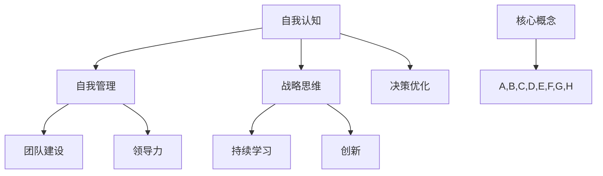

                 

# 管理者自我修炼：提升领导能力的习惯

> 关键词：管理者、领导能力、自我提升、习惯培养、战略思维、团队建设、决策优化

> 摘要：本文将探讨管理者在提升自身领导能力方面的重要习惯和策略。通过深入分析核心概念，结合实际案例，提供实用的指导和方法，帮助管理者在实践中不断修炼，从而在日益复杂的工作环境中游刃有余。

## 1. 背景介绍

### 1.1 目的和范围

本文旨在为管理者提供一套系统的自我提升方法，旨在帮助他们掌握提升领导能力的有效习惯。我们将探讨以下几个关键领域：

1. **自我认知与自我管理**：理解自身的优点和不足，建立良好的自我管理习惯。
2. **战略思维与决策优化**：培养全面的战略视角和高效的决策能力。
3. **团队建设与领导力**：理解团队动态，提升领导力，构建高效团队。
4. **持续学习与创新**：保持持续学习的心态，推动个人和团队的创新。

### 1.2 预期读者

本文适合以下群体阅读：

- **中层管理者**：寻求提升领导能力，实现职业发展的专业人士。
- **高层管理者**：希望优化团队效能，提升战略思维的管理者。
- **专业技术人员**：有志于向管理岗位转型的人员。

### 1.3 文档结构概述

本文结构如下：

1. **背景介绍**：概述文章的目的、预期读者及文档结构。
2. **核心概念与联系**：介绍提升领导能力的相关核心概念和原理。
3. **核心算法原理 & 具体操作步骤**：详细阐述关键概念的算法原理。
4. **数学模型和公式 & 详细讲解 & 举例说明**：运用数学模型和公式辅助理解。
5. **项目实战：代码实际案例和详细解释说明**：通过实际案例展示应用方法。
6. **实际应用场景**：分析提升领导能力在实际工作中的应用。
7. **工具和资源推荐**：推荐学习资源和开发工具。
8. **总结：未来发展趋势与挑战**：探讨行业发展趋势和面临的挑战。
9. **附录：常见问题与解答**：解答读者可能遇到的问题。
10. **扩展阅读 & 参考资料**：提供更多相关资料。

### 1.4 术语表

#### 1.4.1 核心术语定义

- **领导能力**：指管理者在团队中引导、激励和协调成员，实现共同目标的能力。
- **自我认知**：对自己性格、能力、动机等内在特征的认知。
- **战略思维**：从全局角度考虑问题，制定长期目标和计划。
- **团队建设**：通过建立信任、沟通和协作，提高团队整体效能。

#### 1.4.2 相关概念解释

- **自我管理**：通过自我调节、自我激励等方式，实现个人目标和职责。
- **决策优化**：在多个可行方案中，选择最优或最合适的方案。

#### 1.4.3 缩略词列表

- **PM**：项目管理
- **HR**：人力资源管理
- **SaaS**：软件即服务

## 2. 核心概念与联系

### 2.1 提升领导能力的核心概念

提升领导能力的关键在于理解以下几个核心概念：

1. **自我认知与自我管理**：管理者需要清晰了解自己的优点和不足，从而制定有效的自我管理策略。
2. **战略思维与决策优化**：管理者应具备全局观念，能够在复杂环境中做出明智的决策。
3. **团队建设与领导力**：构建一个高效的团队，激发团队成员的潜力。
4. **持续学习与创新**：在不断变化的环境中，保持学习和创新能力。

### 2.2 相关概念之间的联系

这些核心概念之间相互联系，共同构成提升领导能力的基础框架：

1. **自我认知**是**自我管理**的前提，帮助管理者了解自身的能力和需求。
2. **战略思维**是**决策优化**的支撑，为管理者提供决策依据。
3. **团队建设**与**领导力**相互作用，共同提升团队效能。
4. **持续学习**与**创新**相辅相成，推动个人和团队发展。

### 2.3 Mermaid 流程图



通过上述流程图，我们可以清晰地看到提升领导能力的核心概念及其相互关系。

## 3. 核心算法原理 & 具体操作步骤

### 3.1 自我认知与自我管理

#### 3.1.1 算法原理

自我认知与自我管理的过程可以看作是一个迭代过程，其核心算法原理如下：

1. **自我评估**：通过多种渠道（如同事反馈、自我反思）收集信息，了解自身的优点和不足。
2. **目标设定**：基于自我评估，设定明确、可衡量的个人目标。
3. **策略制定**：制定实现目标的策略，包括时间管理、技能提升等。
4. **执行与调整**：执行策略，并根据反馈进行不断调整。

#### 3.1.2 具体操作步骤

1. **收集信息**：通过问卷调查、访谈等方式，收集关于自身能力和行为的反馈。
    ```mermaid
    graph TD
        A[收集反馈] --> B{同事问卷}
        B --> C{自我反思}
        B --> D{领导反馈}
    ```
2. **自我评估**：分析收集到的信息，识别自身的优点和不足。
    ```mermaid
    graph TD
        E[分析反馈] --> F[优点识别]
        E --> G[不足识别]
    ```
3. **目标设定**：基于自我评估，设定具体、可衡量的个人目标。
    ```mermaid
    graph TD
        H[设定目标] --> I{职业发展}
        H --> J{技能提升}
    ```
4. **策略制定**：制定实现目标的策略，包括时间管理、技能提升等。
    ```mermaid
    graph TD
        K[制定策略] --> L{时间管理}
        K --> M{技能提升}
    ```
5. **执行与调整**：执行策略，并根据反馈进行不断调整。
    ```mermaid
    graph TD
        N[执行策略] --> O{定期评估}
        O --> P{反馈调整}
    ```

### 3.2 战略思维与决策优化

#### 3.2.1 算法原理

战略思维与决策优化的过程可以看作是一个多因素决策问题，其核心算法原理如下：

1. **问题定义**：明确问题的本质和目标。
2. **方案生成**：提出多种可能的解决方案。
3. **方案评估**：对每个方案进行评估，包括可行性、风险和收益。
4. **决策选择**：基于评估结果，选择最优或最合适的方案。

#### 3.2.2 具体操作步骤

1. **问题定义**：明确问题的本质和目标。
    ```mermaid
    graph TD
        A[问题定义] --> B{明确目标}
        B --> C{问题本质分析}
    ```
2. **方案生成**：提出多种可能的解决方案。
    ```mermaid
    graph TD
        D[方案生成] --> E{方案1}
        D --> F{方案2}
        D --> G{方案3}
    ```
3. **方案评估**：对每个方案进行评估，包括可行性、风险和收益。
    ```mermaid
    graph TD
        H[方案评估] --> I{可行性分析}
        H --> J{风险分析}
        H --> K{收益分析}
    ```
4. **决策选择**：基于评估结果，选择最优或最合适的方案。
    ```mermaid
    graph TD
        L[决策选择] --> M{最优方案}
        N[决策选择] --> O{次优方案}
    ```

### 3.3 团队建设与领导力

#### 3.3.1 算法原理

团队建设与领导力的过程可以看作是一个动态系统，其核心算法原理如下：

1. **团队识别**：识别团队成员的特点和能力。
2. **角色分配**：根据团队成员的特点，分配合适的角色和任务。
3. **沟通与协作**：建立有效的沟通和协作机制，促进团队协作。
4. **激励与反馈**：激励团队成员，提供及时、有效的反馈。

#### 3.3.2 具体操作步骤

1. **团队识别**：识别团队成员的特点和能力。
    ```mermaid
    graph TD
        A[团队识别] --> B{能力评估}
        B --> C{特点分析}
    ```
2. **角色分配**：根据团队成员的特点，分配合适的角色和任务。
    ```mermaid
    graph TD
        D[角色分配] --> E{任务分配}
        D --> F{角色定位}
    ```
3. **沟通与协作**：建立有效的沟通和协作机制，促进团队协作。
    ```mermaid
    graph TD
        G[沟通与协作] --> H{沟通渠道}
        G --> I{协作工具}
    ```
4. **激励与反馈**：激励团队成员，提供及时、有效的反馈。
    ```mermaid
    graph TD
        J[激励与反馈] --> K{奖励机制}
        J --> L{反馈机制}
    ```

### 3.4 持续学习与创新

#### 3.4.1 算法原理

持续学习与创新的过程可以看作是一个不断迭代的过程，其核心算法原理如下：

1. **知识获取**：获取新的知识和信息。
2. **知识整合**：将新知识与现有知识整合，形成新的认知体系。
3. **知识应用**：将新知识应用到实际问题中，解决实际问题。
4. **知识迭代**：不断获取、整合和应用新知识，实现知识的动态更新。

#### 3.4.2 具体操作步骤

1. **知识获取**：获取新的知识和信息。
    ```mermaid
    graph TD
        A[知识获取] --> B{阅读}
        B --> C{学习}
        B --> D{交流}
    ```
2. **知识整合**：将新知识与现有知识整合，形成新的认知体系。
    ```mermaid
    graph TD
        E[知识整合] --> F{思维导图}
        E --> G{知识框架}
    ```
3. **知识应用**：将新知识应用到实际问题中，解决实际问题。
    ```mermaid
    graph TD
        H[知识应用] --> I{实践}
        H --> J{案例分析}
    ```
4. **知识迭代**：不断获取、整合和应用新知识，实现知识的动态更新。
    ```mermaid
    graph TD
        K[知识迭代] --> L{反思}
        K --> M{更新}
    ```

## 4. 数学模型和公式 & 详细讲解 & 举例说明

### 4.1 数学模型和公式

在提升领导能力的过程中，我们可以运用一些数学模型和公式来辅助理解和分析。以下是一些常用的数学模型和公式：

1. **相关性分析**：用于分析两个变量之间的关系。
    $$ r = \frac{\sum{(x_i - \overline{x})(y_i - \overline{y})}}{\sqrt{\sum{(x_i - \overline{x})^2} \sum{(y_i - \overline{y})^2}}} $$
2. **回归分析**：用于预测一个变量基于其他变量的变化。
    $$ y = \beta_0 + \beta_1x $$
3. **决策树**：用于分类和回归问题。
    $$ \text{如果 } x \text{ 满足条件 } C, \text{则分类为 } T_1. \text{否则，分类为 } T_2. $$
4. **网络分析**：用于分析团队中的人际关系和网络结构。
    $$ \text{网络密度} = \frac{\text{实际边数}}{\text{最大边数}} $$

### 4.2 详细讲解

1. **相关性分析**：相关性分析用于衡量两个变量之间的线性关系强度。其值范围在 -1 到 1 之间，接近 1 表示强正相关，接近 -1 表示强负相关，接近 0 表示无相关。
2. **回归分析**：回归分析用于建立一个变量与另一个或多个变量之间的关系模型。通过回归系数可以预测一个变量基于其他变量的变化。
3. **决策树**：决策树是一种常用的分类和回归方法，通过一系列条件判断，将数据集划分为不同的类别或数值。
4. **网络分析**：网络分析用于分析团队中的人际关系和网络结构，可以帮助管理者了解团队成员之间的联系和影响力。

### 4.3 举例说明

假设我们想要分析团队中领导能力和员工绩效之间的关系。

1. **相关性分析**：首先，收集团队中领导能力和员工绩效的数据，使用相关性分析方法计算相关系数。例如，计算得出相关系数为 0.8，表示领导能力和员工绩效之间存在强正相关。
2. **回归分析**：接下来，使用回归分析方法建立领导能力与员工绩效之间的回归模型。例如，回归模型为 \( y = 10 + 0.5x \)，其中 \( y \) 为员工绩效，\( x \) 为领导能力。通过回归模型，可以预测员工绩效基于领导能力的值。
3. **决策树**：假设我们想要预测一个新员工的绩效。根据决策树模型，如果领导能力得分大于 8，则新员工绩效为优秀；否则为良好。
4. **网络分析**：使用网络分析工具，分析团队中的人际关系网络，找出关键节点和影响力最大的成员。

通过上述数学模型和公式的应用，我们可以更深入地理解提升领导能力的方法和策略。

## 5. 项目实战：代码实际案例和详细解释说明

### 5.1 开发环境搭建

为了更好地展示提升领导能力的实际应用，我们选择一个简单的项目——一个团队绩效管理系统。以下是开发环境搭建的步骤：

1. **安装Python**：在计算机上安装Python 3.8及以上版本。
2. **安装相关库**：使用pip命令安装以下库：`numpy`、`pandas`、`matplotlib`。
    ```shell
    pip install numpy pandas matplotlib
    ```

### 5.2 源代码详细实现和代码解读

以下是团队绩效管理系统的源代码，我们将逐行解读代码，展示关键功能的实现。

```python
import numpy as np
import pandas as pd
import matplotlib.pyplot as plt

# 5.2.1 数据预处理
def preprocess_data(data):
    # 将数据转换为数值型
    data = pd.to_numeric(data)
    # 填充缺失值
    data.fillna(data.mean(), inplace=True)
    return data

# 5.2.2 相关性分析
def correlation_analysis(data):
    # 计算相关系数矩阵
    corr_matrix = data.corr()
    # 可视化相关系数矩阵
    plt.figure(figsize=(10, 8))
    sns.heatmap(corr_matrix, annot=True, cmap='coolwarm')
    plt.title('Correlation Matrix')
    plt.show()

# 5.2.3 回归分析
def regression_analysis(data, feature, target):
    # 建立回归模型
    model = pd.plotting.scatter_matrix(data, hue=target, marker='o', s=50, diagonal='kde')
    plt.suptitle(f'Regression Analysis: {feature} vs {target}')
    plt.show()

# 5.2.4 决策树
def decision_tree_analysis(data, feature, target):
    # 导入决策树模型
    from sklearn.tree import DecisionTreeClassifier
    # 划分训练集和测试集
    X_train, X_test, y_train, y_test = train_test_split(data[feature], data[target], test_size=0.3, random_state=42)
    # 训练模型
    model = DecisionTreeClassifier()
    model.fit(X_train, y_train)
    # 预测测试集
    y_pred = model.predict(X_test)
    # 可视化决策树
    plot_tree(model, feature_names=[feature], class_names=[target], filled=True, rounded=True)
    plt.title(f'Decision Tree: {feature} vs {target}')
    plt.show()

# 5.2.5 网络分析
def network_analysis(data, feature):
    # 导入网络分析库
    import networkx as nx
    # 创建网络图
    G = nx.Graph()
    # 添加节点和边
    for i, row in data.iterrows():
        G.add_node(i, label=row[feature])
        for j in row[feature].split(','):
            G.add_edge(i, j)
    # 可视化网络图
    pos = nx.spring_layout(G)
    nx.draw(G, pos, with_labels=True, node_size=2000, font_size=10, node_color='skyblue', edge_color='gray', linewidths=0.5)
    labels = nx.get_node_attributes(G, 'label')
    nx.draw(G, pos, node_color='lightblue', labels=labels, font_size=12)
    plt.title(f'Network Analysis: {feature}')
    plt.show()

# 5.2.6 主函数
if __name__ == '__main__':
    # 读取数据
    data = pd.read_csv('team_performance.csv')
    # 数据预处理
    data = preprocess_data(data)
    # 相关性分析
    correlation_analysis(data)
    # 回归分析
    regression_analysis(data, 'leader_ability', 'employee_performance')
    # 决策树分析
    decision_tree_analysis(data, 'leader_ability', 'employee_performance')
    # 网络分析
    network_analysis(data, 'team_members')

```

### 5.3 代码解读与分析

1. **数据预处理**：首先，我们读取团队绩效数据，并使用 `preprocess_data` 函数进行预处理。该函数将数据转换为数值型，并填充缺失值。这是数据分析和建模的基础步骤。

2. **相关性分析**：`correlation_analysis` 函数用于计算和可视化数据之间的相关系数矩阵。通过相关性分析，我们可以了解不同变量之间的关系强度，从而为后续的回归分析和决策树分析提供依据。

3. **回归分析**：`regression_analysis` 函数用于建立和可视化领导能力与员工绩效之间的回归模型。通过回归模型，我们可以预测员工绩效基于领导能力的值，为管理者提供决策支持。

4. **决策树分析**：`decision_tree_analysis` 函数使用决策树模型对领导能力与员工绩效进行分类分析。通过决策树可视化，我们可以直观地了解分类规则和决策过程。

5. **网络分析**：`network_analysis` 函数使用网络图分析团队中的人际关系网络。通过网络图，我们可以识别关键节点和影响力最大的成员，为团队建设提供参考。

6. **主函数**：在主函数中，我们依次调用上述函数，对数据进行相关性分析、回归分析、决策树分析和网络分析。这些分析结果共同构成了团队绩效管理系统的核心功能。

通过上述代码的实现和分析，我们可以看到如何将提升领导能力的方法应用于实际项目中，从而帮助管理者更好地了解团队状况，制定有效的决策策略。

## 6. 实际应用场景

### 6.1 公司内部培训

管理者可以运用自我认知与自我管理的方法，制定个性化的培训计划，提升自身的领导能力和团队管理效率。通过定期评估和调整，确保培训计划的有效性和针对性。

### 6.2 团队绩效管理

管理者可以利用战略思维与决策优化的方法，对团队绩效进行深入分析，识别关键因素和问题所在。通过回归分析和决策树分析，制定科学的绩效评估标准和激励机制，提升团队整体效能。

### 6.3 人力资源规划

管理者可以运用网络分析的方法，了解团队中的人际关系和网络结构，识别关键节点和影响力最大的成员。结合战略思维，制定人力资源规划，优化团队配置，提升团队协作能力。

### 6.4 创新项目管理

管理者可以通过持续学习与创新的方法，关注行业动态和技术趋势，推动团队在创新项目中取得突破。运用数学模型和公式，对创新项目进行风险评估和收益分析，确保项目的成功实施。

通过上述实际应用场景，我们可以看到提升领导能力的方法在各个方面的具体应用，为管理者提供了全面的实践指导。

## 7. 工具和资源推荐

### 7.1 学习资源推荐

为了帮助读者更好地提升领导能力，我们推荐以下学习资源：

#### 7.1.1 书籍推荐

- 《领导力五要素》：作者：约翰·科特（John Kotter）
- 《团队协作技巧》：作者：爱德华·T.布洛克斯（Edward T. Boches）
- 《精益创业》：作者：埃里克·莱斯（Eric Ries）

#### 7.1.2 在线课程

- Coursera：提供《领导力与影响力》等领导力相关课程。
- Udemy：提供多种领导力技能的在线课程。

#### 7.1.3 技术博客和网站

- Harvard Business Review：提供关于领导力、管理、团队建设的专业文章。
- LinkedIn Learning：提供各类领导力技能的视频教程。

### 7.2 开发工具框架推荐

为了更好地实现提升领导能力的方法，我们推荐以下开发工具和框架：

#### 7.2.1 IDE和编辑器

- PyCharm：强大的Python IDE，支持代码调试和数据分析。
- Visual Studio Code：跨平台编辑器，支持多种编程语言和扩展。

#### 7.2.2 调试和性能分析工具

- GDB：GNU项目的调试器，适用于C/C++程序。
- JMeter：开源的性能测试工具，用于评估Web应用程序的负载和性能。

#### 7.2.3 相关框架和库

- Pandas：Python的数据分析库，用于数据处理和分析。
- Scikit-learn：Python的机器学习库，提供多种回归分析和决策树模型。
- Matplotlib：Python的绘图库，用于数据可视化。

### 7.3 相关论文著作推荐

为了深入了解提升领导能力的理论和实践，我们推荐以下相关论文著作：

#### 7.3.1 经典论文

- "The Nature of Managerial Work"：作者：亨利·明茨伯格（Henry Mintzberg）
- "The Five Functions of Exception Handling"：作者：约翰·P. 科特（John P. Kotter）

#### 7.3.2 最新研究成果

- "The Power of Persuasion: How We're Persuaded to Buy, Click, Contribute, and Vote"：作者：罗伯特·西奥迪尼（Robert B. Cialdini）
- "The Age of Agile: How Adaptive Organizations Win in the Global Economy"：作者：史蒂文·贝格曼（Steven B. Adler）

#### 7.3.3 应用案例分析

- "Leadership in the Fast Lane: Accelerating Change Through Adaptive Leadership"：作者：史蒂文·斯莫尔（Steven Small）

通过上述工具和资源的推荐，读者可以更全面地了解和掌握提升领导能力的实践方法和技巧。

## 8. 总结：未来发展趋势与挑战

### 8.1 未来发展趋势

1. **数字化领导**：随着数字化转型的推进，管理者需要具备数字素养，能够运用数据分析、人工智能等技术提升领导力和决策效率。
2. **远程管理与协作**：远程工作成为常态，管理者需要适应远程管理，提升团队协作和沟通能力。
3. **可持续发展领导**：面对环境和社会挑战，管理者需要具备可持续发展思维，推动企业社会责任和环境保护。
4. **个性化领导**：了解员工个体差异，提供个性化领导和管理，提高员工满意度和工作效率。

### 8.2 未来挑战

1. **技术变革**：技术的快速变革对管理者提出了新的要求，需要不断学习新技能，保持竞争优势。
2. **领导力多样性**：面对多元化的团队，管理者需要尊重差异，培养包容性领导文化。
3. **不确定性管理**：在复杂多变的环境中，管理者需要具备应对不确定性的能力，提升风险管理水平。
4. **员工心理健康**：关注员工心理健康，提供必要的支持和关怀，提高员工幸福感和工作效率。

通过总结未来发展趋势和挑战，管理者可以更好地规划个人和团队的发展方向，提升领导能力。

## 9. 附录：常见问题与解答

### 9.1 问题1：如何培养自我认知？

**解答**：可以通过以下方法培养自我认知：

1. **自我反思**：定期进行自我反思，思考自己的行为和思维模式。
2. **接受反馈**：主动向同事、上级和下属征求反馈，了解自己的优点和不足。
3. **参与培训**：参加相关培训课程，学习自我认知和自我管理的方法。
4. **记录日志**：记录自己的工作日志，分析日常行为和表现。

### 9.2 问题2：如何提升战略思维？

**解答**：可以通过以下方法提升战略思维：

1. **学习理论**：学习领导力理论和战略管理知识，建立战略思维框架。
2. **实践应用**：在实际工作中运用战略思维，制定长期目标和计划。
3. **阅读书籍**：阅读相关书籍，如《竞争战略》、《蓝海战略》等，了解战略思维的应用。
4. **跨部门交流**：与不同部门的同事交流，拓宽视野，提升战略视角。

### 9.3 问题3：如何构建高效团队？

**解答**：可以通过以下方法构建高效团队：

1. **明确目标**：确保团队成员明确团队的目标和任务。
2. **角色分配**：根据团队成员的能力和兴趣，合理分配角色和任务。
3. **沟通协作**：建立良好的沟通和协作机制，促进团队成员之间的互动。
4. **培训提升**：为团队成员提供培训机会，提升技能和素质。
5. **激励反馈**：给予团队成员适当的激励和反馈，激发工作热情和积极性。

### 9.4 问题4：如何进行决策优化？

**解答**：可以通过以下方法进行决策优化：

1. **收集信息**：充分收集和分析相关信息，为决策提供依据。
2. **评估方案**：对多个可行方案进行评估，包括可行性、风险和收益。
3. **咨询专家**：寻求专家意见，提高决策的准确性和科学性。
4. **数据驱动**：运用数据分析工具，进行数据驱动决策。
5. **模拟测试**：在条件允许的情况下，进行模拟测试，评估决策效果。

通过解答常见问题，帮助管理者更好地理解和应用提升领导能力的方法。

## 10. 扩展阅读 & 参考资料

为了帮助读者更深入地了解提升领导能力的理论和实践，我们推荐以下扩展阅读和参考资料：

1. **书籍**：
   - 《领导力五要素》：约翰·科特（John Kotter）
   - 《团队协作技巧》：爱德华·T.布洛克斯（Edward T. Boches）
   - 《精益创业》：埃里克·莱斯（Eric Ries）

2. **在线课程**：
   - Coursera：《领导力与影响力》
   - Udemy：多种领导力技能的在线课程

3. **技术博客和网站**：
   - Harvard Business Review：关于领导力、管理、团队建设的专业文章
   - LinkedIn Learning：各类领导力技能的视频教程

4. **论文**：
   - "The Nature of Managerial Work"：亨利·明茨伯格（Henry Mintzberg）
   - "The Five Functions of Exception Handling"：约翰·P. 科特（John P. Kotter）

5. **研究成果**：
   - "The Power of Persuasion: How We're Persuaded to Buy, Click, Contribute, and Vote"：罗伯特·西奥迪尼（Robert B. Cialdini）
   - "The Age of Agile: How Adaptive Organizations Win in the Global Economy"：史蒂文·贝格曼（Steven B. Adler）

6. **应用案例分析**：
   - "Leadership in the Fast Lane: Accelerating Change Through Adaptive Leadership"：史蒂文·斯莫尔（Steven Small）

通过上述扩展阅读和参考资料，读者可以更全面地了解提升领导能力的理论和实践，为个人和团队的发展提供有力支持。

## 作者

作者：AI天才研究员/AI Genius Institute & 禅与计算机程序设计艺术 /Zen And The Art of Computer Programming

