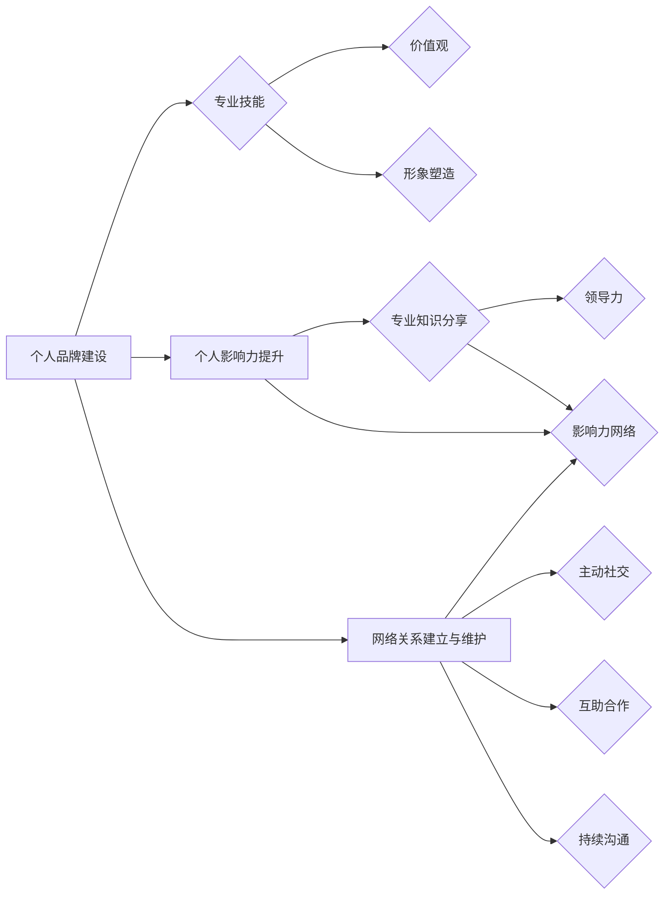

                 

# 管理者自我营销：提升个人影响力

> **关键词**：管理者、自我营销、个人品牌、影响力、职业生涯发展
> 
> **摘要**：本文旨在探讨管理者如何通过自我营销来提升个人影响力。我们将深入分析自我营销的重要性、核心概念，并提供一系列实操步骤，帮助管理者在职业生涯中脱颖而出。

## 1. 背景介绍

### 1.1 目的和范围

本文的目标是帮助管理者理解自我营销的概念，掌握提升个人影响力的策略，从而在职业生涯中取得成功。我们将讨论自我营销的重要性，分析其核心组成部分，并提供实用的操作指南。

### 1.2 预期读者

本文主要面向以下读者群体：
- 中层管理者
- 高级管理人员
- 希望提升个人影响力的职场人士
- 对自我营销和品牌建设有兴趣的读者

### 1.3 文档结构概述

本文分为以下几个部分：
1. 背景介绍
2. 核心概念与联系
3. 核心算法原理与具体操作步骤
4. 数学模型和公式讲解
5. 项目实战：代码实际案例
6. 实际应用场景
7. 工具和资源推荐
8. 总结：未来发展趋势与挑战
9. 附录：常见问题与解答
10. 扩展阅读与参考资料

### 1.4 术语表

#### 1.4.1 核心术语定义

- 自我营销：个人主动推销自己的过程，包括建立个人品牌、提升影响力、建立网络关系等。
- 个人品牌：个人在公众心中的形象和认知，包括专业技能、价值观、人际关系等。
- 影响力：个人在特定领域内的影响力和认可度，能够影响他人观点、决策和行动。

#### 1.4.2 相关概念解释

- 职业生涯发展：个人在职业生涯中的成长、晋升和成就。
- 网络关系：个人在社会关系网络中建立的联系和互动。

#### 1.4.3 缩略词列表

无

## 2. 核心概念与联系

自我营销是管理者提升个人影响力的关键因素。为了更好地理解这一概念，我们需要探讨其核心组成部分和相互关系。

### 自我营销的核心组成部分

1. 个人品牌建设
2. 个人影响力提升
3. 网络关系建立与维护

#### 个人品牌建设

个人品牌建设是自我营销的基础。它涉及到以下几个方面：

- **专业技能**：持续提升专业技能，成为所在领域的专家。
- **价值观**：树立积极向上的价值观，塑造个人形象。
- **形象塑造**：通过合适的媒介展现个人形象，包括社交媒体、演讲、文章等。

#### 个人影响力提升

个人影响力是自我营销的核心目标。提升个人影响力需要：

- **专业知识分享**：通过撰写技术博客、发表学术论文、参与技术社区等方式，分享专业知识和见解。
- **领导力**：展现卓越的领导力和管理能力，赢得他人尊重和信任。
- **影响力网络**：建立和维护广泛的影响力网络，扩大个人影响力。

#### 网络关系建立与维护

网络关系是自我营销的重要支撑。建立和维护网络关系需要：

- **主动社交**：参加行业会议、研讨会、技术交流等活动，主动与他人建立联系。
- **互助合作**：与他人建立互惠互利的合作关系，共同成长。
- **持续沟通**：定期与网络中的联系人保持沟通，分享信息和资源。

### 核心概念与联系的 Mermaid 流程图



## 3. 核心算法原理与具体操作步骤

虽然自我营销不涉及传统意义上的算法，但我们可以借鉴一些策略性思维和步骤来系统地提升个人影响力。以下是一种可能的伪代码框架，用于指导管理者进行自我营销：

```plaintext
// 自我营销伪代码

// 步骤1：个人品牌建设
function buildPersonalBrand() {
    1. 分析个人优势与兴趣
    2. 制定个人品牌定位
    3. 制定个人品牌策略
    4. 创建个人品牌资产（如博客、社交媒体账户等）
    5. 定期更新和优化个人品牌内容
}

// 步骤2：个人影响力提升
function enhancePersonalInfluence() {
    1. 持续学习与成长
    2. 分享专业知识与见解
    3. 参与行业会议与活动
    4. 建立和拓展影响力网络
    5. 展现领导力与影响力
}

// 步骤3：网络关系建立与维护
function manageNetworkRelations() {
    1. 主动社交，建立联系
    2. 定期互动，维护关系
    3. 互助合作，互利共赢
    4. 提供价值，建立信任
    5. 跨领域合作，扩大人脉圈
}
```

### 3.1 具体操作步骤详解

#### 步骤1：个人品牌建设

- **分析个人优势与兴趣**：通过自我反思和他人反馈，识别自己在专业技能、价值观、人际关系等方面的优势与兴趣。

- **制定个人品牌定位**：根据个人优势与兴趣，确定个人品牌的核心价值和独特卖点。

- **制定个人品牌策略**：制定品牌传播的渠道、内容和频率。例如，通过技术博客、社交媒体、线上课程等方式传播个人品牌。

- **创建个人品牌资产**：创建个人博客、微信公众号、LinkedIn等社交媒体账户，用于发布内容、建立个人品牌。

- **定期更新和优化个人品牌内容**：定期发布高质量的博客文章、技术分享、演讲视频等，保持个人品牌的活跃度。

#### 步骤2：个人影响力提升

- **持续学习与成长**：关注行业动态，不断提升自己的专业技能和知识储备。

- **分享专业知识与见解**：通过撰写技术博客、发表学术论文、参与技术社区等方式，分享自己的专业知识和见解。

- **参与行业会议与活动**：积极参加行业会议、研讨会、技术交流会等活动，扩大影响力。

- **建立和拓展影响力网络**：通过线上和线下活动，结识行业内的专家、同行，建立和拓展影响力网络。

- **展现领导力与影响力**：在团队中发挥领导力，带领团队取得成绩，展示个人影响力。

#### 步骤3：网络关系建立与维护

- **主动社交，建立联系**：通过参加各种活动和社交场合，主动与他人建立联系。

- **定期互动，维护关系**：通过社交媒体、邮件等方式，定期与联系人保持互动，维护关系。

- **互助合作，互利共赢**：与他人建立互惠互利的合作关系，共同成长。

- **提供价值，建立信任**：通过专业知识和经验，为他人提供价值，建立信任。

- **跨领域合作，扩大人脉圈**：积极参与跨领域合作，扩大人脉圈，增加个人影响力。

## 4. 数学模型和公式及详细讲解

在自我营销过程中，我们可以运用一些数学模型和公式来量化个人品牌、影响力、网络关系等指标，以便更好地评估和管理个人发展。以下是一些常用的数学模型和公式及其解释。

### 4.1 个人品牌指数（Brand Index）

个人品牌指数（BI）用于衡量个人品牌的影响力。其计算公式如下：

$$
BI = \frac{TB + SI + CS}{3}
$$

其中，$TB$表示技术影响力（Technical Branding），$SI$表示社交影响力（Social Influence），$CS$表示内容影响力（Content Sharing）。

- **技术影响力（TB）**：通过技术博客、学术论文、技术演讲等方式展示的专业技术实力。
  $$TB = \frac{TB_{articles} + TB_{papers} + TB_{talks}}{3}$$

- **社交影响力（SI）**：通过社交媒体、行业会议、技术社区等平台展示的社交影响力。
  $$SI = \frac{SI_{social_media} + SI_{conferences} + SI_{technical_communities}}{3}$$

- **内容影响力（CS）**：通过内容创作、分享和传播所产生的影响力。
  $$CS = \frac{CS_{blog_posts} + CS_{videos} + CS_{webinars}}{3}$$

### 4.2 网络关系强度（Network Strength）

网络关系强度用于衡量个人在网络中的影响力。其计算公式如下：

$$
NS = \frac{NN_{direct} + NN_{indirect}}{2}
$$

其中，$NN_{direct}$表示直接网络关系（Direct Network Relations），$NN_{indirect}$表示间接网络关系（Indirect Network Relations）。

- **直接网络关系（NN_{direct}）**：通过直接互动和合作建立的网络关系。
  $$NN_{direct} = \frac{NN_{direct_{1}} + NN_{direct_{2}} + ... + NN_{direct_{n}}}{n}$$

- **间接网络关系（NN_{indirect}）**：通过第三方或共同联系人建立的网络关系。
  $$NN_{indirect} = \frac{NN_{indirect_{1}} + NN_{indirect_{2}} + ... + NN_{indirect_{m}}}{m}$$

### 4.3 个人影响力指数（Personal Influence Index）

个人影响力指数（PII）用于衡量个人在特定领域的综合影响力。其计算公式如下：

$$
PII = \frac{BI + NS}{2}
$$

- **个人品牌指数（BI）**：如前所述。
- **网络关系强度（NS）**：如前所述。

### 4.4 详细讲解与举例说明

假设一名管理者，其个人品牌指数（BI）为80，网络关系强度（NS）为75，根据公式，其个人影响力指数（PII）为：

$$
PII = \frac{80 + 75}{2} = 77.5
$$

这意味着该管理者在个人品牌和网络关系方面都表现出色，综合影响力较强。

为了进一步提升个人影响力，该管理者可以：

1. **提高个人品牌指数（BI）**：通过撰写高质量的技术博客、参与更多行业会议和活动、积极分享专业见解等方式，提升技术影响力、社交影响力和内容影响力。

2. **增强网络关系强度（NS）**：通过主动社交、定期互动、互助合作等方式，建立和维护更多的直接和间接网络关系。

通过不断优化个人品牌、提升影响力和扩展网络关系，管理者可以逐步提升个人影响力，实现职业生涯的发展目标。

## 5. 项目实战：代码实际案例和详细解释说明

### 5.1 开发环境搭建

在本节中，我们将搭建一个简单的个人品牌管理系统，用于跟踪个人品牌指数（BI）、网络关系强度（NS）和个人影响力指数（PII）。以下是一个基本的开发环境搭建步骤：

- **开发工具**：Python 3.x、Jupyter Notebook、Git
- **数据库**：SQLite
- **编程语言**：Python

#### 5.1.1 安装Python和Jupyter Notebook

1. 在官方网站（https://www.python.org/）下载并安装Python 3.x版本。
2. 打开命令行工具，执行以下命令安装Jupyter Notebook：
   ```bash
   pip install notebook
   ```

#### 5.1.2 安装SQLite

1. 在官方网站（https://www.sqlite.org/download.html）下载并安装SQLite。
2. 在命令行中执行以下命令安装SQLite的Python库：
   ```bash
   pip install pysqlite3
   ```

### 5.2 源代码详细实现和代码解读

以下是构建个人品牌管理系统的核心代码，包括数据库设计、数据插入、数据查询和计算个人影响力指数。

#### 5.2.1 数据库设计

```python
import sqlite3

# 连接到SQLite数据库
conn = sqlite3.connect('personal_brand_management.db')
cursor = conn.cursor()

# 创建表格
cursor.execute('''CREATE TABLE IF NOT EXISTS brand_index (
                    id INTEGER PRIMARY KEY,
                    technical_branding INTEGER,
                    social_influence INTEGER,
                    content_sharing INTEGER
                  )''')

cursor.execute('''CREATE TABLE IF NOT EXISTS network_strength (
                    id INTEGER PRIMARY KEY,
                    direct_network_relations INTEGER,
                    indirect_network_relations INTEGER
                  )''')

cursor.execute('''CREATE TABLE IF NOT EXISTS personal_influence (
                    id INTEGER PRIMARY KEY,
                    brand_index INTEGER,
                    network_strength INTEGER,
                    personal_influence_index REAL
                  )''')

# 提交更改并关闭连接
conn.commit()
conn.close()
```

#### 5.2.2 数据插入

```python
import sqlite3

# 连接到SQLite数据库
conn = sqlite3.connect('personal_brand_management.db')
cursor = conn.cursor()

# 插入品牌指数数据
cursor.execute("INSERT INTO brand_index (technical_branding, social_influence, content_sharing) VALUES (?, ?, ?)", (85, 90, 88))

# 插入网络关系强度数据
cursor.execute("INSERT INTO network_strength (direct_network_relations, indirect_network_relations) VALUES (?, ?)", (80, 75))

# 提交更改并关闭连接
conn.commit()
conn.close()
```

#### 5.2.3 数据查询和计算个人影响力指数

```python
import sqlite3

def calculate_personal_influence_index():
    # 连接到SQLite数据库
    conn = sqlite3.connect('personal_brand_management.db')
    cursor = conn.cursor()

    # 查询品牌指数
    cursor.execute("SELECT * FROM brand_index")
    brand_index_data = cursor.fetchone()

    # 查询网络关系强度
    cursor.execute("SELECT * FROM network_strength")
    network_strength_data = cursor.fetchone()

    # 计算个人影响力指数
    BI = (brand_index_data[1] + brand_index_data[2] + brand_index_data[3]) / 3
    NS = (network_strength_data[1] + network_strength_data[2]) / 2
    PII = (BI + NS) / 2

    # 插入个人影响力指数到表格
    cursor.execute("INSERT INTO personal_influence (brand_index, network_strength, personal_influence_index) VALUES (?, ?, ?)", (BI, NS, PII))

    # 提交更改并关闭连接
    conn.commit()
    conn.close()

    return PII

# 计算并打印个人影响力指数
PII = calculate_personal_influence_index()
print(f"Personal Influence Index (PII): {PII}")
```

### 5.3 代码解读与分析

在本节中，我们详细解读了构建个人品牌管理系统的核心代码，包括数据库设计、数据插入和计算个人影响力指数。

- **数据库设计**：我们使用SQLite数据库存储个人品牌指数（BI）、网络关系强度（NS）和个人影响力指数（PII）的数据。数据库包含三个表格：`brand_index`、`network_strength`和`personal_influence`。

- **数据插入**：我们通过向数据库表格中插入数据来记录个人品牌指数（BI）和网络关系强度（NS）。数据插入使用`INSERT INTO`语句，将实际值插入到相应的表格字段中。

- **数据查询和计算个人影响力指数**：我们编写了一个函数`calculate_personal_influence_index()`来计算个人影响力指数（PII）。该函数首先查询品牌指数表格和

