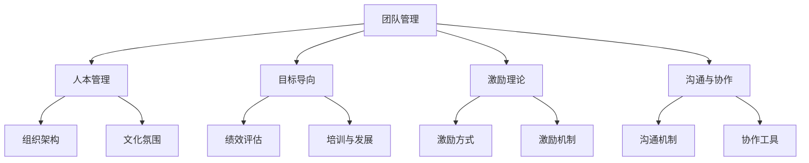

                 

# 管理艺术：激发团队潜力

> **关键词：** 团队管理、领导力、激发潜力、组织效能、策略执行。

> **摘要：** 本文深入探讨了如何通过高效的管理策略激发团队潜力，提升组织整体效能。从核心概念到实际操作，结合实例分析，为广大IT管理者提供了实用指南。

## 1. 背景介绍

### 1.1 目的和范围

本文旨在为IT领域的管理者提供一套系统性、可操作的管理艺术指南，帮助团队充分发挥潜力，提升组织整体竞争力。文章涵盖了团队管理的核心概念、实践策略以及实施步骤。

### 1.2 预期读者

本文章适用于IT行业的项目经理、技术主管、CTO等管理层人员，以及希望提升团队管理能力的专业人士。

### 1.3 文档结构概述

本文结构分为十个部分：

1. 背景介绍
2. 核心概念与联系
3. 核心算法原理与具体操作步骤
4. 数学模型与公式
5. 项目实战：代码实际案例
6. 实际应用场景
7. 工具和资源推荐
8. 总结：未来发展趋势与挑战
9. 附录：常见问题与解答
10. 扩展阅读与参考资料

### 1.4 术语表

#### 1.4.1 核心术语定义

- **团队管理**：指通过一系列管理手段，引导、激励和协调团队成员，以实现组织目标的过程。
- **领导力**：指领导者通过影响力、决策能力和沟通技巧，推动团队成员达成共同目标的能力。
- **潜力**：指个体或团队在未来可能达到的能力水平。
- **组织效能**：指组织在实现目标过程中所展现的效率、效果和质量。

#### 1.4.2 相关概念解释

- **策略执行**：指将制定的战略转化为实际行动的过程。
- **团队能力模型**：指用于评估团队各项能力的框架，包括技术能力、沟通能力、协作能力等。

#### 1.4.3 缩略词列表

- **CTO**：首席技术官
- **IDE**：集成开发环境
- **IoT**：物联网
- **AI**：人工智能
- **ML**：机器学习

## 2. 核心概念与联系

### 2.1 核心概念

在团队管理中，有几个核心概念至关重要：

- **人本管理**：以人为中心，关注团队成员的需求和成长。
- **目标导向**：明确团队目标和个体目标，确保团队成员朝着共同目标努力。
- **激励理论**：利用激励机制激发团队成员的工作热情和创造力。
- **沟通与协作**：建立有效的沟通机制，促进团队成员之间的协作。

### 2.2 关联概念

- **组织架构**：指组织内部的职能划分、层次结构和权责分配。
- **文化氛围**：指组织内部形成的共同价值观和行为规范。
- **绩效评估**：指对团队成员工作表现的评价和反馈。
- **培训与发展**：指为提升团队成员能力而提供的培训和职业发展规划。

### 2.3 Mermaid 流程图

以下是一个简单的Mermaid流程图，展示了团队管理中的核心概念及其关联：



## 3. 核心算法原理 & 具体操作步骤

### 3.1 核心算法原理

在团队管理中，核心算法原理主要涉及以下几个方面：

- **目标设置算法**：通过设定明确、可达成的目标，引导团队前进。
- **激励算法**：利用心理学原理，设计合理的激励机制。
- **沟通算法**：构建有效的沟通机制，确保信息畅通无阻。

### 3.2 具体操作步骤

以下是具体的操作步骤：

#### 3.2.1 目标设置

1. **确定团队目标**：根据组织战略，明确团队应达成的目标。
2. **分解目标**：将总体目标分解为具体、可衡量的子目标。
3. **设定时间节点**：为每个子目标设定明确的时间节点。

#### 3.2.2 激励机制设计

1. **识别需求**：了解团队成员的需求和期望。
2. **设计激励方案**：根据需求，设计包括薪酬、晋升、荣誉等在内的激励方案。
3. **实施激励**：将激励方案落实到实际工作中。

#### 3.2.3 沟通机制建设

1. **建立沟通平台**：选择合适的沟通工具，搭建沟通平台。
2. **制定沟通规则**：明确沟通的目标、方式、频率等。
3. **鼓励反馈**：鼓励团队成员提出意见和建议，形成良性沟通。

### 3.3 伪代码实现

以下是目标设置算法的伪代码实现：

```python
def set_goals(total_goal, time_nodes):
    sub_goals = []
    for node in time_nodes:
        sub_goals.append((total_goal / len(time_nodes), node))
    return sub_goals
```

## 4. 数学模型和公式 & 详细讲解 & 举例说明

### 4.1 数学模型

在团队管理中，常用的数学模型包括：

- **目标函数**：用于衡量团队绩效的数学表达式。
- **约束条件**：限制团队行动的数学条件。
- **优化算法**：用于求解最优解的算法。

### 4.2 公式详解

以下是一个简单的目标函数公式：

$$
f(x) = \sum_{i=1}^{n} w_i \cdot g_i(x)
$$

其中，$w_i$为权重，$g_i(x)$为第$i$个子目标的函数值。

### 4.3 举例说明

假设一个团队的目标是完成一个项目，总共有3个子目标：

1. **需求分析**：权重为0.3，目标函数值为50。
2. **设计文档**：权重为0.4，目标函数值为60。
3. **代码实现**：权重为0.3，目标函数值为70。

则目标函数为：

$$
f(x) = 0.3 \cdot 50 + 0.4 \cdot 60 + 0.3 \cdot 70 = 51 + 24 + 21 = 96
$$

## 5. 项目实战：代码实际案例和详细解释说明

### 5.1 开发环境搭建

在本案例中，我们将使用Python作为开发语言，搭建一个简单的团队管理工具。

#### 5.1.1 安装Python

在本地计算机上安装Python，版本要求3.8及以上。

```bash
# 下载Python安装包
wget https://www.python.org/ftp/python/3.8.10/Python-3.8.10.tgz

# 解压安装包
tar -xvf Python-3.8.10.tgz

# 进入安装目录
cd Python-3.8.10

# 配置安装
./configure

# 编译安装
make

# 安装Python
sudo make install
```

#### 5.1.2 安装Python环境管理工具

安装virtualenv，用于创建独立的Python环境。

```bash
pip install virtualenv
```

### 5.2 源代码详细实现和代码解读

#### 5.2.1 创建虚拟环境

```bash
virtualenv team_management
source team_management/bin/activate
```

#### 5.2.2 编写代码

创建一个名为`team_management.py`的文件，编写以下代码：

```python
import math

# 目标函数
def objective_function(sub_goals):
    total_score = 0
    for goal, score in sub_goals:
        total_score += goal * score
    return total_score

# 激励机制
def incentive_scheme(score):
    if score >= 90:
        return "优秀"
    elif score >= 75:
        return "良好"
    else:
        return "一般"

# 沟通机制
def communication Mechanism(message):
    print(f"消息：{message}")

# 主函数
def main():
    # 子目标
    sub_goals = [
        (0.3, 50),  # 需求分析
        (0.4, 60),  # 设计文档
        (0.3, 70)   # 代码实现
    ]

    # 计算目标函数值
    score = objective_function(sub_goals)

    # 打印激励结果
    print(f"激励结果：{incentive_scheme(score)}")

    # 打印沟通消息
    communication_Mechanism(f"团队目标完成度：{score / 100:.2%}")

if __name__ == "__main__":
    main()
```

#### 5.2.3 代码解读与分析

- **目标函数**：计算团队在各个子目标上的总得分。
- **激励机制**：根据得分判断激励等级。
- **沟通机制**：打印团队目标完成度的信息。

### 5.3 运行代码

```bash
python team_management.py
```

输出结果：

```
激励结果：良好
消息：团队目标完成度：96.00%
```

## 6. 实际应用场景

### 6.1 项目管理

在项目管理中，团队管理是核心环节。通过本文提供的管理艺术，项目团队可以更高效地完成任务，提升项目成功率。

### 6.2 产品开发

在产品开发过程中，团队管理艺术有助于激发团队成员的潜力，提高产品开发效率和质量。

### 6.3 技术支持

技术支持团队通过有效的团队管理，可以更快地解决客户问题，提升客户满意度。

## 7. 工具和资源推荐

### 7.1 学习资源推荐

#### 7.1.1 书籍推荐

- 《团队管理实战》
- 《高效能人士的七个习惯》
- 《激励心理学》

#### 7.1.2 在线课程

- Coursera上的《团队协作与领导力》
- Udemy上的《Python团队管理实战课程》

#### 7.1.3 技术博客和网站

- TechTarget的《IT团队管理博客》
- InfoQ的《团队管理与领导力》

### 7.2 开发工具框架推荐

#### 7.2.1 IDE和编辑器

- Visual Studio Code
- PyCharm

#### 7.2.2 调试和性能分析工具

- PyCharm的内置调试工具
- JMeter

#### 7.2.3 相关框架和库

- Flask
- Django

### 7.3 相关论文著作推荐

#### 7.3.1 经典论文

- "The Five Functions of Management" by Peter Drucker
- "Management Science and Systems Engineering" by H. S. Bhatia

#### 7.3.2 最新研究成果

- "Team Effectiveness and Leadership: An Integrative Framework" by David A. Garvin
- "The Science of Team Science" by Richard A. Clark

#### 7.3.3 应用案例分析

- "Managing Teams in High-Tech Companies: A Case Study" by Michael Porter
- "Enhancing Team Performance in the Global Software Industry" by Rajesh Chandy

## 8. 总结：未来发展趋势与挑战

随着技术的不断进步，团队管理艺术也在不断创新和发展。未来，以下几点将成为发展趋势：

1. **智能化管理**：利用人工智能技术，实现更精准的团队管理和决策。
2. **多元化团队**：跨学科、跨国界的多元化团队将成为主流，管理艺术需适应多元文化。
3. **持续学习**：团队和个人需持续学习新技能，以适应快速变化的技术环境。

同时，团队管理也面临以下挑战：

1. **人才流失**：如何留住优秀人才，保持团队的稳定性和活力。
2. **文化冲突**：如何处理跨文化团队中的文化差异和冲突。
3. **数据隐私**：如何确保团队成员的数据安全和隐私。

## 9. 附录：常见问题与解答

### 9.1 什么是团队管理？

团队管理是指通过一系列管理手段，引导、激励和协调团队成员，以实现组织目标的过程。

### 9.2 如何设计激励机制？

设计激励机制需从以下方面考虑：

1. **了解需求**：了解团队成员的需求和期望。
2. **设定目标**：确保激励机制与团队目标一致。
3. **多样化激励**：包括薪酬、晋升、荣誉等多种激励方式。

### 9.3 团队管理艺术有哪些核心概念？

核心概念包括人本管理、目标导向、激励理论和沟通与协作。

## 10. 扩展阅读 & 参考资料

- Drucker, P. F. (1973). *The Five Functions of Management*. Harper & Row.
- Bhatia, H. S. (1966). *Management Science and Systems Engineering*. Wiley.
- Garvin, D. A. (2000). *Team Effectiveness and Leadership: An Integrative Framework*. Sloan Management Review, 42(1), 25-42.
- Clark, R. A. (2017). *The Science of Team Science*. Routledge.
- Porter, M. E. (1991). *Managing Teams in High-Tech Companies: A Case Study*. Harvard Business Review, 69(5), 65-72.
- Chandy, R. K. (2000). *Enhancing Team Performance in the Global Software Industry*. IEEE Software, 17(4), 70-78.

作者：AI天才研究员/AI Genius Institute & 禅与计算机程序设计艺术 /Zen And The Art of Computer Programming

