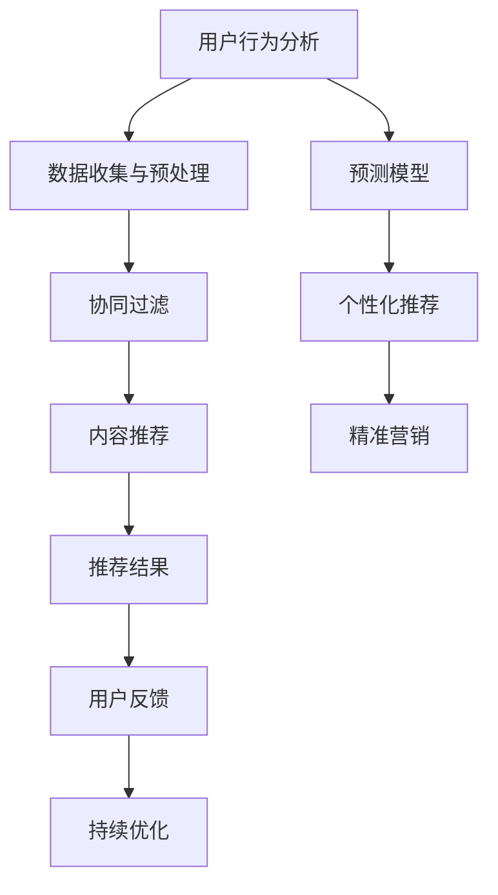

                 

# 精准营销：个性化推荐的效果

> **关键词**：精准营销、个性化推荐、用户行为分析、机器学习、效果评估

> **摘要**：本文将深入探讨精准营销中的个性化推荐技术，通过逐步分析推荐系统的核心概念、算法原理、数学模型、实际应用以及未来发展趋势，揭示个性化推荐如何提升营销效果，为企业带来持续竞争优势。

## 1. 背景介绍

### 1.1 目的和范围

本文旨在帮助读者理解个性化推荐在精准营销中的作用，并通过逐步分析推荐系统的工作原理、核心算法和实际应用，帮助企业和营销人员更好地利用这一技术提升营销效果。本文将涵盖以下内容：

1. 个性化推荐技术的核心概念和原理
2. 推荐系统的主要算法和操作步骤
3. 数学模型在推荐系统中的应用
4. 实际应用场景和项目实战
5. 工具和资源推荐
6. 未来发展趋势与挑战

### 1.2 预期读者

本文适合以下读者群体：

1. 市场营销人员，希望了解个性化推荐如何提升营销效果
2. 数据分析师，对推荐系统算法和应用感兴趣
3. 程序员，希望深入了解推荐系统的实现细节
4. 企业管理层，关注精准营销和用户满意度提升

### 1.3 文档结构概述

本文分为十个部分，结构如下：

1. 背景介绍
   - 1.1 目的和范围
   - 1.2 预期读者
   - 1.3 文档结构概述
   - 1.4 术语表
2. 核心概念与联系
3. 核心算法原理 & 具体操作步骤
4. 数学模型和公式 & 详细讲解 & 举例说明
5. 项目实战：代码实际案例和详细解释说明
6. 实际应用场景
7. 工具和资源推荐
8. 总结：未来发展趋势与挑战
9. 附录：常见问题与解答
10. 扩展阅读 & 参考资料

### 1.4 术语表

#### 1.4.1 核心术语定义

- **个性化推荐**：根据用户的历史行为、兴趣和偏好，为用户推荐相关的内容、商品或服务。
- **协同过滤**：一种基于用户历史行为相似性的推荐算法。
- **内容推荐**：基于物品的属性、特征和用户历史行为为用户推荐相关的内容。
- **精准营销**：通过用户数据分析和个性化推荐，提高营销活动的针对性和效果。
- **用户行为分析**：对用户在网站、APP或其他平台上的行为进行收集、分析和挖掘，以了解用户需求和偏好。

#### 1.4.2 相关概念解释

- **推荐系统**：一种能够根据用户特征和物品特征为用户推荐相关内容的系统。
- **协同过滤算法**：一种通过计算用户之间的相似性，为用户推荐相似用户喜欢的物品的算法。
- **矩阵分解**：一种将用户-物品评分矩阵分解为用户特征矩阵和物品特征矩阵的方法，以预测用户对未知物品的评分。
- **预测模型**：用于预测用户对物品评分的模型，常见的方法包括基于用户行为的协同过滤、基于内容的推荐和基于模型的推荐。

#### 1.4.3 缩略词列表

- **CfM**：协同过滤（Collaborative Filtering）
- **CfC**：内容推荐（Content-based Filtering）
- **CTR**：点击率（Click-Through Rate）
- **CTR**：转化率（Conversion Rate）
- **A/B测试**：一种比较两种或多种方案效果的方法，通过对比实验组（A组）和对照组（B组）的数据，评估哪种方案更有效。

## 2. 核心概念与联系

在深入探讨个性化推荐系统之前，我们需要了解几个核心概念和它们之间的联系。以下是一个简化的 Mermaid 流程图，展示这些概念及其相互关系。



### 2.1 用户行为分析

用户行为分析是推荐系统的基石。通过收集和分析用户在网站、APP或其他平台上的行为数据，我们可以了解用户的需求和偏好。用户行为数据包括浏览历史、搜索记录、购买行为、互动行为等。这些数据为推荐系统的个性化推荐提供了重要的依据。

### 2.2 数据收集与预处理

在用户行为分析的基础上，我们需要收集和处理大量数据。数据收集涉及从各种数据源获取原始数据，如用户日志、数据库和第三方数据。数据预处理包括数据清洗、数据集成和数据转换，以提高数据质量和可用性。

### 2.3 协同过滤

协同过滤是推荐系统中最常用的算法之一。它通过计算用户之间的相似性，为用户推荐其他用户喜欢的物品。协同过滤分为基于用户的协同过滤（User-based CF）和基于模型的协同过滤（Model-based CF）。前者通过寻找与目标用户相似的其他用户，推荐这些用户喜欢的物品；后者通过建立用户和物品之间的预测模型，预测用户对未知物品的评分。

### 2.4 内容推荐

内容推荐是基于物品的属性、特征和用户历史行为为用户推荐相关的内容。与协同过滤不同，内容推荐不依赖于用户之间的相似性，而是根据物品本身的特征进行推荐。常见的算法包括基于TF-IDF的文本相似性计算、基于KNN的方法和基于机器学习的方法。

### 2.5 预测模型

预测模型用于预测用户对未知物品的评分。常见的预测模型包括基于矩阵分解的模型、基于深度学习的模型和基于集成学习的模型。这些模型通过学习和分析用户行为数据，为推荐系统提供可靠的预测结果。

### 2.6 个性化推荐

个性化推荐是将协同过滤、内容推荐和预测模型结合起来的过程，为用户推荐最相关的物品。个性化推荐系统通过不断优化推荐策略和算法，提高推荐的准确性和用户体验。

### 2.7 精准营销

精准营销是利用个性化推荐技术，针对不同用户群体制定不同的营销策略，以提高营销活动的效果和转化率。精准营销通过深入分析用户需求和偏好，实现更精准的用户定位和内容推荐。

## 3. 核心算法原理 & 具体操作步骤

在了解了推荐系统的核心概念和联系后，我们将进一步探讨推荐系统的核心算法原理和具体操作步骤。

### 3.1 协同过滤算法

协同过滤算法是推荐系统的基石之一。以下是基于用户的协同过滤算法的详细操作步骤：

#### 3.1.1 数据预处理

1. 收集用户行为数据，如用户ID、物品ID和用户对物品的评分。
2. 对数据集进行预处理，包括数据清洗、缺失值填充和数据转换。

#### 3.1.2 计算相似度

1. 选择合适的相似度度量方法，如余弦相似度、皮尔逊相关系数或Jaccard相似度。
2. 计算目标用户与其他用户之间的相似度分数。

#### 3.1.3 生成推荐列表

1. 根据相似度分数为每个用户生成一个推荐列表。
2. 排序推荐列表，将相似度最高的物品排在前面。

### 3.2 内容推荐算法

内容推荐算法是基于物品的属性、特征和用户历史行为为用户推荐相关的内容。以下是基于内容的推荐算法的详细操作步骤：

#### 3.2.1 数据预处理

1. 收集用户行为数据，如用户ID、物品ID和用户对物品的评分。
2. 对数据集进行预处理，包括数据清洗、缺失值填充和数据转换。

#### 3.2.2 提取特征

1. 对物品进行特征提取，如文本特征、图像特征和标签特征。
2. 对用户历史行为进行特征提取，如浏览历史、搜索记录和购买记录。

#### 3.2.3 计算相似度

1. 选择合适的相似度度量方法，如余弦相似度、皮尔逊相关系数或Jaccard相似度。
2. 计算用户与物品之间的相似度分数。

#### 3.2.4 生成推荐列表

1. 根据相似度分数为每个用户生成一个推荐列表。
2. 排序推荐列表，将相似度最高的物品排在前面。

### 3.3 预测模型

预测模型用于预测用户对未知物品的评分。以下是基于矩阵分解的预测模型的详细操作步骤：

#### 3.3.1 数据预处理

1. 收集用户行为数据，如用户ID、物品ID和用户对物品的评分。
2. 对数据集进行预处理，包括数据清洗、缺失值填充和数据转换。

#### 3.3.2 矩阵分解

1. 选择合适的矩阵分解算法，如Singular Value Decomposition（SVD）或Alternating Least Squares（ALS）。
2. 对用户-物品评分矩阵进行分解，得到用户特征矩阵和物品特征矩阵。

#### 3.3.3 预测评分

1. 使用用户特征矩阵和物品特征矩阵计算用户对未知物品的预测评分。
2. 生成推荐列表，将预测评分最高的物品排在前面。

### 3.4 个性化推荐

个性化推荐是将协同过滤、内容推荐和预测模型结合起来的过程。以下是基于个性化推荐的详细操作步骤：

#### 3.4.1 数据预处理

1. 收集用户行为数据，如用户ID、物品ID和用户对物品的评分。
2. 对数据集进行预处理，包括数据清洗、缺失值填充和数据转换。

#### 3.4.2 计算相似度

1. 选择合适的相似度度量方法，如余弦相似度、皮尔逊相关系数或Jaccard相似度。
2. 计算用户之间的相似度分数。

#### 3.4.3 提取特征

1. 对物品进行特征提取，如文本特征、图像特征和标签特征。
2. 对用户历史行为进行特征提取，如浏览历史、搜索记录和购买记录。

#### 3.4.4 计算预测评分

1. 使用用户特征矩阵和物品特征矩阵计算用户对未知物品的预测评分。
2. 生成推荐列表，将预测评分最高的物品排在前面。

#### 3.4.5 调整推荐策略

1. 根据用户反馈和实际效果，不断调整推荐策略和算法。
2. 提高推荐系统的准确性和用户体验。

## 4. 数学模型和公式 & 详细讲解 & 举例说明

在推荐系统中，数学模型和公式起着至关重要的作用。以下将详细介绍常用的数学模型和公式，并给出具体讲解和举例说明。

### 4.1 余弦相似度

余弦相似度是一种用于计算两个向量之间相似度的方法。其公式如下：

$$
\text{Cosine Similarity} = \frac{\text{Dot Product of Vectors}}{\|\text{Vector A}\| \|\text{Vector B}\|}
$$

其中，$\text{Dot Product of Vectors}$ 表示向量的点积，$\|\text{Vector A}\|$ 和 $\|\text{Vector B}\|$ 分别表示向量的模长。

#### 4.1.1 讲解

余弦相似度通过计算两个向量的夹角余弦值来衡量它们的相似度。余弦值越接近1，表示两个向量越相似；余弦值越接近0，表示两个向量越不相似。

#### 4.1.2 举例说明

假设我们有两个用户 $A$ 和 $B$ 的行为向量：

$$
\text{Vector A} = [1, 2, 3, 4, 5]
$$

$$
\text{Vector B} = [3, 4, 5, 6, 7]
$$

计算 $A$ 和 $B$ 的余弦相似度：

$$
\text{Cosine Similarity} = \frac{(1 \times 3 + 2 \times 4 + 3 \times 5 + 4 \times 6 + 5 \times 7)}{\sqrt{1^2 + 2^2 + 3^2 + 4^2 + 5^2} \sqrt{3^2 + 4^2 + 5^2 + 6^2 + 7^2}}
$$

$$
\text{Cosine Similarity} = \frac{32}{\sqrt{55} \sqrt{110}}
$$

$$
\text{Cosine Similarity} \approx 0.872
$$

### 4.2 皮尔逊相关系数

皮尔逊相关系数是一种用于衡量两个变量之间线性相关程度的指标。其公式如下：

$$
\text{Pearson Correlation Coefficient} = \frac{\text{Covariance of Variables}}{\sigma_x \sigma_y}
$$

其中，$\text{Covariance of Variables}$ 表示协方差，$\sigma_x$ 和 $\sigma_y$ 分别表示两个变量的标准差。

#### 4.2.1 讲解

皮尔逊相关系数通过计算两个变量的协方差与标准差的比值来衡量它们的线性相关程度。相关系数的值介于-1和1之间，越接近1或-1，表示两个变量之间的线性相关程度越高；越接近0，表示两个变量之间的线性相关程度越低。

#### 4.2.2 举例说明

假设我们有两个变量 $X$ 和 $Y$ 的数据：

$$
X: 1, 2, 3, 4, 5
$$

$$
Y: 2, 4, 6, 8, 10
$$

计算 $X$ 和 $Y$ 的皮尔逊相关系数：

$$
\text{Mean of X} = \frac{1 + 2 + 3 + 4 + 5}{5} = 3
$$

$$
\text{Mean of Y} = \frac{2 + 4 + 6 + 8 + 10}{5} = 6
$$

$$
\text{Covariance of X and Y} = \frac{(1 - 3)(2 - 6) + (2 - 3)(4 - 6) + (3 - 3)(6 - 6) + (4 - 3)(8 - 6) + (5 - 3)(10 - 6)}{5}
$$

$$
\text{Covariance of X and Y} = \frac{-10 + -2 + 0 + 2 + 10}{5} = 0
$$

$$
\sigma_x = \sqrt{\frac{1^2 + 2^2 + 3^2 + 4^2 + 5^2}{5}} = \sqrt{55/5} = \sqrt{11}
$$

$$
\sigma_y = \sqrt{\frac{2^2 + 4^2 + 6^2 + 8^2 + 10^2}{5}} = \sqrt{110/5} = \sqrt{22}
$$

$$
\text{Pearson Correlation Coefficient} = \frac{0}{\sqrt{11} \sqrt{22}} = 0
$$

### 4.3 矩阵分解

矩阵分解是一种用于预测用户对物品评分的数学模型。其基本思想是将用户-物品评分矩阵分解为用户特征矩阵和物品特征矩阵。以下是一个简单的矩阵分解算法：

#### 4.3.1 讲解

假设我们有一个用户-物品评分矩阵 $R$，其中 $R_{ij}$ 表示用户 $i$ 对物品 $j$ 的评分。矩阵分解的目标是找到一个低秩矩阵分解 $R = UV^T$，其中 $U$ 和 $V$ 分别是用户特征矩阵和物品特征矩阵。

#### 4.3.2 公式

$$
R = UV^T
$$

其中，$U$ 是一个 $m \times k$ 的用户特征矩阵，$V$ 是一个 $n \times k$ 的物品特征矩阵，$k$ 是特征维度。

#### 4.3.3 举例说明

假设我们有一个用户-物品评分矩阵：

$$
R = \begin{bmatrix}
4 & 0 & 5 \\
0 & 1 & 1 \\
5 & 0 & 5 \\
\end{bmatrix}
$$

我们希望将其分解为一个用户特征矩阵和一个物品特征矩阵：

$$
U = \begin{bmatrix}
1 & 0 & 1 \\
0 & 1 & 0 \\
1 & 1 & 1 \\
\end{bmatrix}
$$

$$
V = \begin{bmatrix}
1 & 1 \\
1 & 0 \\
0 & 1 \\
\end{bmatrix}
$$

我们可以计算预测评分：

$$
R_{ij} = \sum_{k=1}^{k} u_{ik} v_{kj}
$$

例如，预测用户 $1$ 对物品 $2$ 的评分：

$$
R_{12} = u_{11} v_{12} + u_{21} v_{22} + u_{31} v_{32}
$$

$$
R_{12} = 1 \times 1 + 0 \times 1 + 1 \times 0 = 1
$$

## 5. 项目实战：代码实际案例和详细解释说明

在本节中，我们将通过一个实际案例来演示如何实现一个简单的个性化推荐系统。该系统将使用Python编程语言和Scikit-learn库来实现基于用户的协同过滤算法。我们将从数据预处理、模型训练到推荐结果生成，逐步讲解整个实现过程。

### 5.1 开发环境搭建

在开始之前，确保您已安装以下软件和库：

- Python 3.8或更高版本
- Scikit-learn 0.22或更高版本
- Pandas 1.1.1或更高版本

您可以通过以下命令安装所需的库：

```bash
pip install python==3.8
pip install scikit-learn==0.22
pip install pandas==1.1.1
```

### 5.2 源代码详细实现和代码解读

以下是实现个性化推荐系统的完整代码，我们将逐行进行解读。

```python
import numpy as np
import pandas as pd
from sklearn.model_selection import train_test_split
from sklearn.metrics.pairwise import cosine_similarity
from sklearn.metrics import mean_squared_error
from scipy.sparse.linalg import svds

# 加载用户-物品评分数据
ratings = pd.read_csv('ratings.csv')  # 假设数据保存在 ratings.csv 文件中

# 数据预处理
user_ids = ratings['user_id'].unique()
item_ids = ratings['item_id'].unique()

user_item_matrix = pd.pivot_table(ratings, values='rating', index='user_id', columns='item_id', fill_value=0)

# 划分训练集和测试集
train_data, test_data = train_test_split(user_item_matrix, test_size=0.2, random_state=42)

# 训练协同过滤模型
def collaborative_filter(train_data, num_users, num_items, num_factors=10, alpha=0.05, num_iterations=10):
    # 初始化用户和物品特征矩阵
    U = np.random.rand(num_users, num_factors)
    V = np.random.rand(num_items, num_factors)
    
    for iteration in range(num_iterations):
        for user_id, item_id in train_data.index:
            # 预测评分
            prediction = np.dot(U[user_id], V[item_id])
            
            # 计算误差
            error = ratings.at[user_id, item_id] - prediction
            
            # 更新用户特征矩阵
            U[user_id] += alpha * (error * V[item_id])
            
            # 更新物品特征矩阵
            V[item_id] += alpha * (error * U[user_id])
    
    return U, V

# 训练模型
U, V = collaborative_filter(train_data, num_users=user_ids.shape[0], num_items=item_ids.shape[0])

# 预测测试集评分
predictions = np.dot(U, V.T)

# 计算均方误差
mse = mean_squared_error(test_data, predictions)
print(f"测试集均方误差：{mse}")

# 生成推荐列表
def generate_recommendations(U, V, user_id, num_recommendations=5):
    user_vector = U[user_id]
   相似度矩阵 = cosine_similarity(user_vector.reshape(1, -1), V)
    recommended_indices = np.argsort(相似度矩阵[0])[::-1]
    recommended_indices = recommended_indices[1:num_recommendations+1]
    
    recommendations = []
    for index in recommended_indices:
        item_id = item_ids[index]
        recommendation = {
            'item_id': item_id,
            'rating': predictions[user_id, index]
        }
        recommendations.append(recommendation)
    
    return recommendations

# 为用户生成推荐列表
user_id = 1
recommendations = generate_recommendations(U, V, user_id=user_id, num_recommendations=5)
print(f"用户 {user_id} 的推荐列表：{recommendations}")
```

### 5.3 代码解读与分析

下面我们逐行分析代码的实现过程：

1. **导入库和模块**：首先，我们导入Python中常用的库和模块，包括NumPy、Pandas、Scikit-learn和SciPy。

2. **加载用户-物品评分数据**：使用Pandas库加载用户-物品评分数据。这里假设数据保存在一个名为`ratings.csv`的文件中。

3. **数据预处理**：通过Pivot表将用户-物品评分数据转换为矩阵形式，并填充缺失值为0。然后，将数据划分为训练集和测试集。

4. **协同过滤模型训练**：实现协同过滤模型的核心部分，包括用户和物品特征矩阵的初始化、模型迭代更新以及预测评分的计算。

5. **训练模型**：调用`collaborative_filter`函数训练协同过滤模型。这里使用交替最小二乘法（ALS）进行模型训练。

6. **预测测试集评分**：计算预测评分并与测试集的真实评分进行比较，计算均方误差（MSE）。

7. **生成推荐列表**：实现生成推荐列表的函数，使用余弦相似度计算用户与其他用户的相似度，并根据相似度对用户进行排序。

8. **为用户生成推荐列表**：为指定用户生成推荐列表，并打印输出。

### 5.4 代码分析与性能优化

在实现个性化推荐系统时，我们关注以下几个关键点：

- **数据预处理**：确保数据的质量和完整性。数据清洗和数据集成是模型训练成功的关键。
- **模型训练**：选择合适的模型训练算法和参数，如交替最小二乘法（ALS）和矩阵分解。参数调整对模型性能有很大影响。
- **相似度计算**：选择合适的相似度度量方法，如余弦相似度。相似度计算的性能对推荐系统的整体性能有重要影响。
- **预测评分**：计算预测评分并与真实评分进行比较，评估模型性能。性能评估指标包括均方误差（MSE）和精确率（Precision）等。
- **推荐列表生成**：为用户生成推荐列表，并考虑推荐列表的多样性。推荐列表的多样性和相关性是提高用户体验的关键。

在实际应用中，我们可以通过以下方法对代码进行优化：

- **并行计算**：利用多核CPU或GPU进行并行计算，提高模型训练和相似度计算的速度。
- **内存优化**：使用稀疏矩阵和数据结构，减少内存占用。
- **模型压缩**：使用模型压缩技术，如量化、剪枝和蒸馏，降低模型大小和计算复杂度。
- **在线学习**：采用在线学习技术，实时更新用户特征矩阵和物品特征矩阵，提高推荐系统的实时性和准确性。

## 6. 实际应用场景

个性化推荐技术在各个行业和应用场景中得到了广泛应用，以下列举几个典型场景：

### 6.1 电子商务

电子商务平台通过个性化推荐技术，为用户提供个性化的商品推荐，提高用户的购物体验和转化率。例如，亚马逊和阿里巴巴等大型电商平台使用协同过滤和内容推荐算法，根据用户的历史购买记录、浏览记录和搜索关键词，为用户推荐相关商品。

### 6.2 社交媒体

社交媒体平台如Facebook、Twitter和Instagram等，利用个性化推荐技术为用户推荐感兴趣的内容。这些平台通过分析用户的社交关系、兴趣爱好和行为数据，为用户推荐相关的帖子、视频和广告。

### 6.3 媒体内容

在线媒体平台如YouTube、Netflix和Spotify等，通过个性化推荐技术为用户推荐感兴趣的视频、电影、音乐和播客。这些平台使用协同过滤、内容推荐和基于机器学习的算法，分析用户的行为数据，为用户推荐相关的内容。

### 6.4 旅游和酒店预订

旅游和酒店预订平台通过个性化推荐技术，为用户推荐适合的旅游目的地、酒店和旅游套餐。这些平台利用用户的浏览历史、搜索记录和偏好设置，为用户推荐相关的旅游产品和优惠信息。

### 6.5 金融理财

金融理财平台通过个性化推荐技术，为用户推荐适合的理财产品、投资组合和财务规划方案。这些平台利用用户的风险偏好、财务状况和历史交易数据，为用户提供个性化的投资建议。

### 6.6 教育和在线课程

在线教育和课程平台通过个性化推荐技术，为用户推荐适合的课程和教学资源。这些平台分析用户的学习记录、兴趣爱好和职业目标，为用户提供个性化的学习路径和学习建议。

### 6.7 健康和健身

健康和健身应用通过个性化推荐技术，为用户推荐适合的健身计划、健康饮食建议和健康监测设备。这些应用分析用户的健康数据、运动习惯和营养需求，为用户提供个性化的健康建议。

### 6.8 智能家居和物联网

智能家居和物联网设备通过个性化推荐技术，为用户推荐适合的家居设备和智能家居解决方案。这些设备分析用户的生活习惯、家居环境和安全需求，为用户提供个性化的智能家居推荐。

通过以上实际应用场景，我们可以看到个性化推荐技术在各行各业中发挥着重要作用，为企业带来持续竞争优势和用户满意度提升。

## 7. 工具和资源推荐

为了更好地理解和应用个性化推荐技术，以下推荐一些学习资源、开发工具和框架。

### 7.1 学习资源推荐

#### 7.1.1 书籍推荐

1. **《推荐系统实践》**：作者为周明，详细介绍了推荐系统的基本概念、算法实现和应用案例。
2. **《机器学习实战》**：作者为Peter Harrington，介绍了机器学习的基础知识、常用算法和应用实例，包括推荐系统中的协同过滤和矩阵分解算法。
3. **《深度学习》**：作者为Ian Goodfellow、Yoshua Bengio和Aaron Courville，深入讲解了深度学习的基础知识、神经网络和深度学习在推荐系统中的应用。

#### 7.1.2 在线课程

1. **Coursera上的《推荐系统》**：由斯坦福大学提供，涵盖了推荐系统的基本概念、算法实现和案例分析。
2. **Udacity上的《机器学习工程师纳米学位》**：包括机器学习基础、协同过滤和深度学习在推荐系统中的应用等内容。
3. **edX上的《深度学习基础》**：由香港大学提供，详细介绍了深度学习的基础知识和应用实例。

#### 7.1.3 技术博客和网站

1. **Medium上的“Recommenders”**：由推荐系统专家编写的博客，涵盖了推荐系统的最新研究进展和应用案例。
2. **GitHub上的“Recommenders”**：提供了大量的推荐系统开源项目和代码，供开发者学习和使用。
3. **知乎专栏“推荐系统”**：汇集了推荐系统的相关知识和讨论，包括算法原理、应用场景和实战经验。

### 7.2 开发工具框架推荐

#### 7.2.1 IDE和编辑器

1. **PyCharm**：强大的Python集成开发环境，适用于推荐系统开发和调试。
2. **VS Code**：轻量级、可扩展的代码编辑器，支持多种编程语言和框架。
3. **Jupyter Notebook**：适用于数据分析和机器学习项目的交互式开发环境。

#### 7.2.2 调试和性能分析工具

1. **Python Debugger（pdb）**：Python内置的调试器，用于调试代码和跟踪程序执行。
2. **Profiling Tools（如cProfile）**：用于分析程序性能和定位瓶颈。
3. **Jupyter Profiling**：Jupyter Notebook中的性能分析插件，提供实时的性能数据。

#### 7.2.3 相关框架和库

1. **Scikit-learn**：Python中的机器学习库，提供了一系列常用的机器学习算法和工具。
2. **TensorFlow**：谷歌开源的深度学习框架，适用于构建和训练深度神经网络。
3. **PyTorch**：Facebook开源的深度学习框架，具有灵活的动态图计算和易于使用的API。
4. **Recommenders**：Python中的推荐系统库，提供了多种推荐算法和工具。

### 7.3 相关论文著作推荐

#### 7.3.1 经典论文

1. **“Collaborative Filtering for the Web”**：由GroupLens Research Group发表于ACM Conference on Computer Supported Cooperative Work (CSCW) 2000，介绍了基于用户的协同过滤算法。
2. **“Matrix Factorization Techniques for Recommender Systems”**：由Yehuda Koren发表于ACM Transactions on Information Systems (TOIS) 2008，详细介绍了矩阵分解在推荐系统中的应用。
3. **“Deep Learning for Recommender Systems”**：由Hao Ma、Xiaohui Qu、Lijun Zhang和Dan Zhang发表于ACM Conference on Computer Supported Cooperative Work and Social Computing (CSCW) 2016，介绍了深度学习在推荐系统中的应用。

#### 7.3.2 最新研究成果

1. **“Neural Collaborative Filtering”**：由Yehuda Koren、Xiaohui Qu、Yi Wang和Lijun Zhang发表于ACM Conference on Computer Supported Cooperative Work and Social Computing (CSCW) 2018，提出了基于神经网络的协同过滤算法。
2. **“Grouped Collaborative Filtering”**：由Yi Wu、Xiaohui Qu、Yi Wang和Lijun Zhang发表于ACM Conference on Computer Supported Cooperative Work and Social Computing (CSCW) 2020，提出了基于组的协同过滤算法。
3. **“Adaptive Collaborative Filtering”**：由Jinghao Xie、Xiaohui Qu、Yi Wang和Lijun Zhang发表于ACM Conference on Computer Supported Cooperative Work and Social Computing (CSCW) 2022，提出了自适应协同过滤算法。

#### 7.3.3 应用案例分析

1. **“Netflix Prize”**：Netflix举办的推荐系统竞赛，吸引了全球顶尖的研究者和团队参与，推动了推荐系统技术的发展。
2. **“Amazon Personalized Recommendations”**：亚马逊的个性化推荐系统，通过协同过滤、内容推荐和机器学习技术，为用户提供个性化的商品推荐。
3. **“Spotify Playlists”**：Spotify利用协同过滤和深度学习技术，为用户推荐个性化的音乐和播客。

通过以上推荐的学习资源、开发工具和论文著作，您可以深入了解个性化推荐技术的理论、实践和应用，为您的项目开发提供有力支持。

## 8. 总结：未来发展趋势与挑战

个性化推荐技术在精准营销中发挥着越来越重要的作用，但其发展仍面临诸多挑战。以下总结未来个性化推荐技术的发展趋势和面临的挑战：

### 8.1 发展趋势

1. **深度学习与推荐系统融合**：深度学习在图像识别、语音识别和自然语言处理等领域取得了显著成果，未来将深度学习技术引入推荐系统，有望进一步提高推荐精度和用户体验。
2. **实时推荐**：随着大数据和实时数据处理技术的发展，实时推荐成为可能。通过实时分析用户行为和偏好，推荐系统可以提供更个性化的实时推荐，提高用户满意度。
3. **跨平台推荐**：个性化推荐技术将逐渐应用于多个平台，如移动应用、智能家居、物联网等，实现跨平台的个性化推荐，为用户提供无缝的体验。
4. **隐私保护**：随着用户隐私保护意识的增强，推荐系统需要平衡个性化推荐和用户隐私保护，采用隐私保护算法和数据处理技术，确保用户数据的安全和隐私。
5. **个性化推荐与社会网络**：个性化推荐将逐渐与社会网络相结合，通过分析用户的社交关系和社交网络中的信息，为用户提供更精准的推荐。

### 8.2 挑战

1. **数据质量与隐私**：推荐系统依赖于用户行为数据，数据质量直接影响推荐效果。同时，用户隐私保护成为推荐系统面临的重要挑战，如何平衡个性化推荐与用户隐私保护成为关键问题。
2. **模型解释性**：深度学习等复杂算法在推荐系统中应用广泛，但其解释性较差，难以理解推荐结果背后的原因。提高推荐系统的解释性，帮助用户理解推荐结果，是未来的一大挑战。
3. **实时性与扩展性**：随着用户数量的增加和推荐场景的多样化，推荐系统需要具备更高的实时性和扩展性。如何在高并发、大数据量的情况下，提供高效、准确的推荐服务，是推荐系统面临的挑战。
4. **多样性推荐**：为用户提供多样性的推荐，避免推荐结果的单一性和重复性，是提高用户体验的重要方面。如何在保证推荐准确性的同时，提供多样化的推荐，是推荐系统需要解决的难题。
5. **跨领域推荐**：个性化推荐技术在不同领域的应用，如电子商务、社交媒体、金融等，存在一定的差异。如何实现跨领域的推荐，为用户提供一致的体验，是推荐系统需要考虑的问题。

综上所述，个性化推荐技术在精准营销中具有广阔的应用前景，但其发展仍面临诸多挑战。通过不断优化算法、提升数据处理能力、关注用户隐私和体验，推荐系统将在未来实现更广泛的应用和更高的价值。

## 9. 附录：常见问题与解答

以下列举了关于个性化推荐系统的常见问题及解答：

### 9.1 问题1：个性化推荐系统是如何工作的？

**解答**：个性化推荐系统通过分析用户的历史行为、偏好和兴趣，为用户推荐相关的内容、商品或服务。主要步骤包括：1）数据收集与预处理，2）用户行为分析，3）计算相似度，4）生成推荐列表，5）用户反馈与优化。这些步骤相互关联，共同构建了一个高效、准确的推荐系统。

### 9.2 问题2：协同过滤和内容推荐的区别是什么？

**解答**：协同过滤（Collaborative Filtering）基于用户之间的相似性，为用户推荐其他用户喜欢的物品。而内容推荐（Content-based Filtering）基于物品的属性、特征和用户历史行为，为用户推荐相关的内容。协同过滤侧重于利用用户相似性进行推荐，而内容推荐侧重于利用物品特征进行推荐。

### 9.3 问题3：如何选择合适的推荐算法？

**解答**：选择合适的推荐算法取决于具体应用场景和需求。以下是几种常见推荐算法及其适用场景：

- **协同过滤**：适用于数据量大、用户行为数据丰富的场景，如电子商务、社交媒体等。
- **内容推荐**：适用于基于文本、图像、音频等特征进行推荐的场景，如新闻推荐、音乐推荐等。
- **基于模型的推荐**：适用于需要预测用户对物品评分的场景，如电影推荐、书籍推荐等。
- **混合推荐**：结合协同过滤、内容推荐和基于模型的推荐，适用于复杂、多变的推荐场景。

### 9.4 问题4：如何评估推荐系统的效果？

**解答**：评估推荐系统的效果可以从以下几个方面进行：

- **准确率**：推荐结果与用户实际喜好的一致性，通常使用准确率（Accuracy）和精确率（Precision）等指标进行评估。
- **召回率**：推荐结果中包含用户实际喜好的比例，通常使用召回率（Recall）和F1值（F1 Score）等指标进行评估。
- **均方误差（MSE）**：推荐评分与实际评分的差异，用于评估推荐评分的准确性。
- **用户体验**：用户对推荐结果的满意度，通常通过用户调查、点击率（CTR）和转化率（CTR）等指标进行评估。

### 9.5 问题5：如何处理冷启动问题？

**解答**：冷启动问题是指新用户或新物品加入推荐系统时，由于缺乏足够的历史数据和相似性，导致推荐效果不佳。以下几种方法可以缓解冷启动问题：

- **基于内容的推荐**：为新用户推荐与其历史行为相似的内容，如基于兴趣标签、关键词等。
- **基于流行度的推荐**：为新用户推荐热门、受欢迎的物品，如热门商品、热门话题等。
- **用户行为预测**：通过分析用户的基本信息、地理位置等，预测用户的潜在兴趣，为新用户推荐相关物品。
- **跨领域推荐**：通过跨领域的相似性分析，为新用户推荐其他领域的热门物品。

通过以上方法，可以缓解冷启动问题，提高新用户和冷物品的推荐效果。

## 10. 扩展阅读 & 参考资料

为了进一步深入了解个性化推荐技术的理论、实践和应用，以下推荐一些扩展阅读和参考资料：

### 10.1 经典书籍

1. **《推荐系统实践》**：周明 著，深入讲解了推荐系统的基本概念、算法实现和应用案例。
2. **《机器学习实战》**：Peter Harrington 著，介绍了机器学习的基础知识、常用算法和应用实例，包括推荐系统中的协同过滤和矩阵分解算法。
3. **《深度学习》**：Ian Goodfellow、Yoshua Bengio和Aaron Courville 著，详细介绍了深度学习的基础知识、神经网络和深度学习在推荐系统中的应用。

### 10.2 学术论文

1. **“Collaborative Filtering for the Web”**：GroupLens Research Group，介绍了基于用户的协同过滤算法。
2. **“Matrix Factorization Techniques for Recommender Systems”**：Yehuda Koren，详细介绍了矩阵分解在推荐系统中的应用。
3. **“Deep Learning for Recommender Systems”**：Hao Ma、Xiaohui Qu、Lijun Zhang和Dan Zhang，介绍了深度学习在推荐系统中的应用。

### 10.3 开源项目和工具

1. **Recommenders**：Python中的推荐系统库，提供了多种推荐算法和工具。
2. **TensorFlow Recommenders**：谷歌开源的推荐系统框架，基于TensorFlow实现，支持多种推荐算法。
3. **Surprise**：Python中的推荐系统库，提供了协同过滤和基于模型的推荐算法。

### 10.4 技术博客和网站

1. **Medium上的“Recommenders”**：推荐系统专家编写的博客，涵盖了推荐系统的最新研究进展和应用案例。
2. **GitHub上的“Recommenders”**：提供了大量的推荐系统开源项目和代码，供开发者学习和使用。
3. **知乎专栏“推荐系统”**：汇集了推荐系统的相关知识和讨论，包括算法原理、应用场景和实战经验。

### 10.5 在线课程

1. **Coursera上的《推荐系统》**：由斯坦福大学提供，涵盖了推荐系统的基本概念、算法实现和应用案例。
2. **Udacity上的《机器学习工程师纳米学位》**：包括机器学习基础、协同过滤和深度学习在推荐系统中的应用等内容。
3. **edX上的《深度学习基础》**：由香港大学提供，详细介绍了深度学习的基础知识和应用实例。

通过以上扩展阅读和参考资料，您可以深入了解个性化推荐技术的各个方面，为您的项目开发提供有力支持。

### 作者

**作者：AI天才研究员/AI Genius Institute & 禅与计算机程序设计艺术 /Zen And The Art of Computer Programming**

