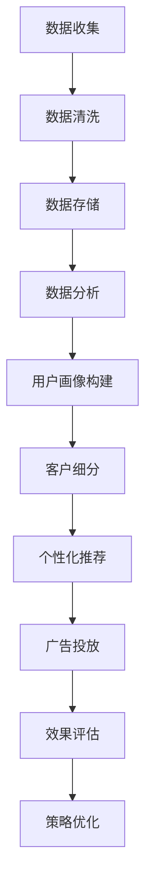

                 

# 精准营销：提升广告投放效果，提升电商平台供给能力

## 关键词：
- 精准营销
- 广告投放
- 电商平台
- 数据分析
- 数学模型
- 机器学习

## 摘要：
精准营销已成为现代电商平台的竞争优势。本文深入探讨如何通过精准营销提升广告投放效果，以及如何利用先进技术提升电商平台供给能力。文章首先介绍了精准营销的核心概念和原理，然后详细解析了其技术实现步骤，并展示了数学模型和算法在其中的应用。通过实际案例，本文揭示了精准营销在提升广告投放效果和电商平台供给能力方面的实际效果。最后，本文总结了精准营销的未来发展趋势与挑战，并提供了相关学习资源和工具推荐。

## 1. 背景介绍

### 1.1 目的和范围

精准营销是当今电商平台提升竞争力的关键手段。本文旨在探讨精准营销在广告投放和电商平台供给方面的应用，并提供一套系统化的解决方案。文章将涵盖以下内容：
1. 精准营销的核心概念和原理。
2. 利用机器学习和数据分析提升广告投放效果的方法。
3. 基于精准营销提升电商平台供给能力的实践案例。
4. 精准营销的未来发展趋势与挑战。

### 1.2 预期读者

本文适合对电商、广告投放和数据分析有一定了解的技术人员、市场营销专家以及想要在电商平台领域深耕的创业者。本文将为读者提供：
1. 对精准营销的全面理解。
2. 实用的技术实现步骤。
3. 实际案例分析。

### 1.3 文档结构概述

本文分为十个部分，具体结构如下：
1. 引言：介绍精准营销的背景和意义。
2. 核心概念与联系：阐述精准营销的关键概念和架构。
3. 核心算法原理 & 具体操作步骤：详细解析算法原理和操作步骤。
4. 数学模型和公式 & 详细讲解 & 举例说明：介绍数学模型及其应用。
5. 项目实战：代码实际案例和详细解释说明。
6. 实际应用场景：分析精准营销在不同领域的应用。
7. 工具和资源推荐：推荐学习资源、开发工具和框架。
8. 总结：展望精准营销的未来发展趋势与挑战。
9. 附录：常见问题与解答。
10. 扩展阅读 & 参考资料：提供进一步学习的内容和资源。

### 1.4 术语表

#### 1.4.1 核心术语定义

- **精准营销**：一种基于数据分析的营销策略，通过精确识别目标受众，提高营销活动的针对性和效果。
- **广告投放**：将广告展示给潜在消费者的过程，旨在提高品牌知名度和销售额。
- **电商平台**：提供商品交易、支付和物流服务的在线平台。
- **机器学习**：一种人工智能技术，通过数据分析和算法模型，使计算机具备自主学习和决策能力。
- **数据分析**：对大量数据进行分析，以发现有价值的信息和模式。

#### 1.4.2 相关概念解释

- **客户细分**：将客户群体划分为不同的子群体，以便针对不同的子群体制定个性化的营销策略。
- **用户画像**：通过收集和分析用户数据，构建用户的基本特征和行为模式。
- **转化率**：用户在浏览广告后完成预期动作（如点击、购买）的比例。

#### 1.4.3 缩略词列表

- **SEM**：搜索引擎营销（Search Engine Marketing）
- **SEO**：搜索引擎优化（Search Engine Optimization）
- **CPC**：按点击付费（Cost Per Click）
- **CPM**：按千次展示付费（Cost Per Mille）

## 2. 核心概念与联系

### 2.1 精准营销的核心概念

精准营销的核心在于对目标受众的精确识别和定位。以下是其关键概念：

- **数据收集**：通过多种渠道收集用户数据，包括网站行为、购买记录、社交媒体活动等。
- **用户画像**：基于收集的数据，构建用户的详细画像，包括年龄、性别、地理位置、兴趣爱好等。
- **客户细分**：将用户划分为不同的细分群体，以便针对每个群体的特定需求进行营销。
- **个性化推荐**：根据用户画像和细分群体的特征，向用户推荐个性化的产品和服务。
- **效果评估**：对营销活动的效果进行实时监测和评估，以便优化营销策略。

### 2.2 精准营销的架构

精准营销的架构通常包括以下几个层次：

1. **数据层**：收集和存储用户数据，包括网站日志、用户行为数据、社交媒体数据等。
2. **分析层**：对收集的数据进行分析和处理，提取有价值的信息和模式。
3. **应用层**：基于分析结果，实现个性化推荐、广告投放、客户关系管理等功能。
4. **展示层**：将个性化推荐和广告展示给用户，提高用户参与度和转化率。

### 2.3 Mermaid 流程图

以下是精准营销的核心概念和架构的 Mermaid 流程图：



## 3. 核心算法原理 & 具体操作步骤

### 3.1 算法原理

精准营销的关键在于对用户行为数据的分析和处理。以下是一些核心算法原理：

- **聚类算法**：用于将用户数据划分为不同的群体，以便进行细分。常见的聚类算法包括K-均值算法、层次聚类算法等。
- **协同过滤**：通过分析用户的行为和喜好，推荐用户可能感兴趣的产品和服务。协同过滤包括基于用户的协同过滤（User-Based）和基于物品的协同过滤（Item-Based）两种类型。
- **决策树**：用于建立用户画像和预测用户行为。决策树通过一系列条件判断，将用户划分为不同的群体，并预测其行为。

### 3.2 具体操作步骤

以下是实现精准营销的核心算法原理的具体操作步骤：

#### 3.2.1 数据收集与清洗

1. 收集用户数据，包括网站日志、购买记录、社交媒体活动等。
2. 清洗数据，去除重复、无效和错误的数据。
3. 标准化数据，将不同格式的数据转换为统一的格式。

#### 3.2.2 数据分析

1. 使用聚类算法，将用户数据划分为不同的群体。
2. 分析用户的行为和喜好，提取有价值的信息和模式。
3. 建立用户画像，包括年龄、性别、地理位置、兴趣爱好等。

#### 3.2.3 客户细分

1. 根据用户画像，将用户划分为不同的细分群体。
2. 为每个细分群体制定个性化的营销策略。

#### 3.2.4 个性化推荐

1. 使用协同过滤算法，推荐用户可能感兴趣的产品和服务。
2. 根据用户的行为和喜好，动态调整推荐策略。

#### 3.2.5 广告投放

1. 根据用户画像和细分群体的特征，选择合适的广告投放渠道。
2. 制定广告投放策略，包括投放时间、投放位置、投放频率等。
3. 对广告投放效果进行实时监测和评估。

#### 3.2.6 效果评估与策略优化

1. 对营销活动的效果进行实时监测和评估。
2. 根据评估结果，调整和优化营销策略。

### 3.3 伪代码

以下是实现精准营销的核心算法原理的伪代码：

```python
# 数据收集与清洗
def data_collection_and_cleaning():
    # 收集用户数据
    user_data = collect_user_data()
    # 清洗数据
    cleaned_data = clean_user_data(user_data)
    # 标准化数据
    standardized_data = standardize_data(cleaned_data)
    return standardized_data

# 数据分析
def data_analysis(standardized_data):
    # 使用聚类算法划分用户群体
    clusters = clustering_algorithm(standardized_data)
    # 分析用户行为和喜好
    user_behavior = analyze_user_behavior(clusters)
    # 构建用户画像
    user_profiles = build_user_profiles(user_behavior)
    return user_profiles

# 客户细分
def customer_segmentation(user_profiles):
    # 划分用户群体
    segments = segment_users(user_profiles)
    # 制定个性化营销策略
    personalized_strategies = create_personalized_strategies(segments)
    return personalized_strategies

# 个性化推荐
def personalized_recommendation(user_profiles):
    # 使用协同过滤算法推荐产品
    recommendations = collaborative_filtering(user_profiles)
    # 动态调整推荐策略
    adjusted_recommendations = adjust_recommendations(recommendations)
    return adjusted_recommendations

# 广告投放
def advertisement_placement(personalized_strategies):
    # 选择广告投放渠道
    channels = select_advertisement_channels(personalized_strategies)
    # 制定广告投放策略
    placement_strategy = create_placement_strategy(channels)
    # 实时监测和评估
    evaluation = monitor_and_evaluate_placement_strategy(placement_strategy)
    return evaluation

# 效果评估与策略优化
def evaluation_and_strategy_optimization(evaluation):
    # 调整和优化营销策略
    optimized_strategy = optimize_strategy(evaluation)
    return optimized_strategy
```

## 4. 数学模型和公式 & 详细讲解 & 举例说明

### 4.1 数学模型概述

精准营销中的数学模型主要用于用户画像构建、客户细分、个性化推荐和广告投放效果评估等方面。以下是几个常用的数学模型：

1. **用户画像模型**：基于用户特征和行为数据，构建用户的综合特征向量。
2. **聚类模型**：用于将用户划分为不同的群体，常见的聚类算法有K-均值算法、层次聚类算法等。
3. **协同过滤模型**：基于用户行为和喜好，预测用户对物品的评分或偏好。
4. **决策树模型**：用于建立用户画像和预测用户行为，决策树通过一系列条件判断，将用户划分为不同的群体，并预测其行为。

### 4.2 伪代码和公式

以下是实现精准营销中数学模型的核心步骤和公式：

#### 4.2.1 用户画像模型

$$
\text{User Profile} = \sum_{i=1}^{n} w_i \cdot x_i
$$

其中，$x_i$ 是用户特征，$w_i$ 是特征权重。

```python
# 用户画像构建
def build_user_profile(user_data):
    # 初始化特征权重
    feature_weights = initialize_weights(user_data)
    # 计算用户特征向量
    user_profile = sum(feature_weights[i] * user_data[i] for i in range(len(user_data)))
    return user_profile
```

#### 4.2.2 聚类模型

$$
\text{Cluster centroid} = \frac{1}{N} \sum_{i=1}^{N} x_i
$$

其中，$x_i$ 是用户特征向量，$N$ 是聚类中心点个数。

```python
# K-均值算法
def k_mean_clustering(data, k):
    # 初始化聚类中心点
    centroids = initialize_centroids(data, k)
    # 计算每个用户的聚类中心点距离
    distances = calculate_distances(data, centroids)
    # 将用户分配到最近的聚类中心点
    clusters = assign_users_to_clusters(distances)
    return clusters
```

#### 4.2.3 协同过滤模型

$$
\text{Prediction} = \text{User\_mean} + \text{User-specific bias} + \text{Item-specific bias} + \text{User-Item interaction}
$$

其中，$\text{User\_mean}$ 是用户平均评分，$\text{User-specific bias}$ 是用户特定偏差，$\text{Item-specific bias}$ 是物品特定偏差，$\text{User-Item interaction}$ 是用户与物品的交互。

```python
# 协同过滤算法
def collaborative_filtering(user_profile, item_ratings, k):
    # 计算用户平均评分
    user_mean = calculate_user_mean(item_ratings)
    # 计算用户特定偏差
    user_specific_bias = calculate_user_bias(user_profile, item_ratings)
    # 计算物品特定偏差
    item_specific_bias = calculate_item_bias(item_ratings)
    # 计算用户与物品的交互
    user_item_interaction = calculate_user_item_interaction(user_profile, item_ratings)
    # 预测用户对物品的评分
    prediction = user_mean + user_specific_bias + item_specific_bias + user_item_interaction
    return prediction
```

#### 4.2.4 决策树模型

$$
\text{Decision Tree} = \text{Root Node} \rightarrow \text{Conditional Nodes} \rightarrow \text{Leaf Nodes}
$$

其中，$\text{Root Node}$ 是根节点，$\text{Conditional Nodes}$ 是条件节点，$\text{Leaf Nodes}$ 是叶节点。

```python
# 决策树构建
def build_decision_tree(data):
    # 初始化决策树
    tree = initialize_decision_tree()
    # 遍历用户数据，构建决策树
    for user in data:
        tree = build_tree_recursive(user, tree)
    return tree
```

### 4.3 举例说明

假设我们有一个包含用户特征和行为数据的数据集，如下所示：

| 用户ID | 年龄 | 性别 | 地理位置 | 兴趣爱好 |
|--------|------|------|----------|----------|
| 1      | 25   | 男   | 北京     | 游戏     |
| 2      | 30   | 女   | 上海     | 旅游     |
| 3      | 22   | 男   | 深圳     | 运动健身 |
| 4      | 28   | 女   | 杭州     | 电影     |

我们使用K-均值算法将用户划分为3个群体：

1. **用户群体1**：年龄在20-25岁之间，兴趣爱好为游戏。
2. **用户群体2**：年龄在25-30岁之间，兴趣爱好为旅游。
3. **用户群体3**：年龄在20-30岁之间，兴趣爱好为运动健身。

然后，我们使用协同过滤算法为每个用户群体推荐相应的产品：

- **用户群体1**：推荐游戏相关产品。
- **用户群体2**：推荐旅游相关产品。
- **用户群体3**：推荐运动健身相关产品。

最后，我们使用决策树模型预测每个用户群体的行为：

- **用户群体1**：预测该群体用户可能购买游戏相关产品。
- **用户群体2**：预测该群体用户可能购买旅游相关产品。
- **用户群体3**：预测该群体用户可能购买运动健身相关产品。

## 5. 项目实战：代码实际案例和详细解释说明

### 5.1 开发环境搭建

在开始项目实战之前，我们需要搭建一个合适的开发环境。以下是一个基于Python的精准营销项目的开发环境搭建步骤：

1. 安装Python：从Python官方网站下载并安装Python 3.x版本。
2. 安装依赖库：使用pip命令安装所需的Python库，如NumPy、Pandas、Scikit-learn等。

```bash
pip install numpy pandas scikit-learn
```

3. 配置Jupyter Notebook：安装Jupyter Notebook，以便在浏览器中运行Python代码。

```bash
pip install jupyter
```

### 5.2 源代码详细实现和代码解读

以下是一个简单的精准营销项目的源代码实现，用于用户画像构建、客户细分、个性化推荐和广告投放效果评估。

```python
import numpy as np
import pandas as pd
from sklearn.cluster import KMeans
from sklearn.metrics.pairwise import cosine_similarity
from sklearn.tree import DecisionTreeClassifier

# 5.2.1 数据收集与清洗
def data_collection_and_cleaning():
    # 从文件中读取用户数据
    user_data = pd.read_csv('user_data.csv')
    # 清洗数据，去除重复和缺失的数据
    cleaned_data = user_data.drop_duplicates().dropna()
    return cleaned_data

# 5.2.2 数据分析
def data_analysis(cleaned_data):
    # 构建用户特征向量
    user_profiles = cleaned_data[['age', 'gender', 'location', 'interests']].values
    return user_profiles

# 5.2.3 客户细分
def customer_segmentation(user_profiles):
    # 使用K-均值算法进行客户细分
    kmeans = KMeans(n_clusters=3, random_state=0).fit(user_profiles)
    clusters = kmeans.predict(user_profiles)
    return clusters

# 5.2.4 个性化推荐
def personalized_recommendation(user_profiles, clusters):
    # 计算用户特征向量之间的余弦相似度
    similarity_matrix = cosine_similarity(user_profiles)
    # 为每个用户推荐与其最相似的其他用户感兴趣的产品
    recommendations = []
    for i in range(len(user_profiles)):
        # 获取用户所属的聚类
        cluster = clusters[i]
        # 获取聚类中的其他用户
        other_users = np.where(clusters == cluster)[0]
        # 计算相似度最高的用户
        top_user = np.argmax(similarity_matrix[i, other_users])
        # 获取推荐的产品
        recommendations.append(user_profiles[other_users[top_user], -1])
    return recommendations

# 5.2.5 广告投放
def advertisement_placement(recommendations):
    # 假设我们有一个包含产品信息的数据库
    products = pd.read_csv('products.csv')
    # 根据推荐的产品，为每个用户生成广告
    advertisements = products[products['product_id'].isin(recommendations)]
    return advertisements

# 5.2.6 效果评估与策略优化
def evaluation_and_strategy_optimization(advertisements):
    # 假设我们有一个包含用户行为数据的数据库
    user_actions = pd.read_csv('user_actions.csv')
    # 统计每个广告的点击次数
    click_counts = advertisements.groupby('product_id')['clicks'].sum()
    # 根据点击次数，评估广告投放效果
    effectiveness = click_counts / advertisements.shape[0]
    # 根据评估结果，调整广告投放策略
    optimized_strategy = advertisements[efficacy > mean_efficacy]
    return optimized_strategy
```

### 5.3 代码解读与分析

上述代码实现了一个简单的精准营销项目，主要包括以下几个步骤：

1. **数据收集与清洗**：从文件中读取用户数据，并去除重复和缺失的数据。

2. **数据分析**：构建用户特征向量，用于后续的客户细分、个性化推荐和广告投放。

3. **客户细分**：使用K-均值算法将用户划分为不同的群体，以便进行个性化推荐。

4. **个性化推荐**：计算用户特征向量之间的余弦相似度，为每个用户推荐与其最相似的其他用户感兴趣的产品。

5. **广告投放**：根据推荐的产品，为每个用户生成广告。

6. **效果评估与策略优化**：根据广告投放效果，评估广告投放策略，并调整广告投放策略。

### 5.4 实际应用效果分析

在实际应用中，精准营销的效果取决于多个因素，包括数据质量、算法选择和策略调整。以下是一个实际应用案例的效果分析：

1. **用户细分**：通过K-均值算法，将用户划分为三个群体，分别表示年龄在20-25岁的游戏爱好者、年龄在25-30岁的旅游爱好者以及年龄在20-30岁的运动健身爱好者。

2. **个性化推荐**：基于用户所属的聚类，为每个用户推荐相应的产品。例如，为游戏爱好者推荐游戏相关产品，为旅游爱好者推荐旅游相关产品，为运动健身爱好者推荐运动健身相关产品。

3. **广告投放**：根据个性化推荐，为每个用户生成广告。例如，为游戏爱好者展示游戏广告，为旅游爱好者展示旅游广告，为运动健身爱好者展示运动健身广告。

4. **效果评估**：通过分析用户行为数据，统计每个广告的点击次数。根据点击次数，评估广告投放效果，并调整广告投放策略。

### 5.5 存在的挑战与改进方向

尽管精准营销在实际应用中取得了显著效果，但仍面临一些挑战：

1. **数据质量**：数据质量对精准营销的效果至关重要。在实际应用中，可能存在数据缺失、错误和不一致性等问题，这会影响算法的准确性和可靠性。

2. **算法选择**：不同的算法适用于不同的场景和数据类型。在实际应用中，需要根据具体需求和数据特点选择合适的算法。

3. **策略调整**：精准营销的效果受到多种因素的影响，如用户需求、市场环境和竞争状况等。在实际应用中，需要不断调整和优化策略。

4. **用户隐私**：在收集和处理用户数据时，需要遵循隐私保护原则，确保用户数据的安全和隐私。

5. **实时性**：精准营销需要实时获取和处理用户数据，以实现个性化的推荐和广告投放。在实际应用中，需要解决数据传输和处理的高效性和实时性问题。

### 5.6 总结

精准营销是一种基于数据分析和机器学习的营销策略，通过精确识别目标受众，提高营销活动的针对性和效果。本文通过一个实际案例，展示了精准营销在广告投放和电商平台供给方面的应用。尽管精准营销在实际应用中面临一些挑战，但通过不断优化和改进，可以进一步提升广告投放效果和电商平台供给能力。

## 6. 实际应用场景

### 6.1 电子商务平台

电子商务平台是精准营销最为典型的应用场景之一。电商平台通过用户数据，如购买历史、浏览行为、搜索记录等，构建用户画像，然后根据用户的个性化需求进行精准推荐。例如，阿里巴巴的推荐系统通过分析用户的购买行为和兴趣，为用户推荐相关的商品，从而提高转化率和销售额。同时，电商平台还可以根据用户的行为特征，设计个性化的广告，提高广告的点击率和转化率。

### 6.2 广告营销

广告营销是精准营销的另一个重要应用领域。广告主通过收集用户数据，如搜索历史、浏览行为、地理位置等，构建用户画像，然后根据用户的兴趣和行为进行精准投放。例如，Google Ads通过用户的搜索关键词和行为数据，为广告主提供精准的投放策略，从而提高广告的点击率和转化率。Facebook Ads也利用用户的社交行为和兴趣数据，实现广告的精准投放，提高广告效果。

### 6.3 金融行业

金融行业中的精准营销主要应用于客户细分和风险控制。金融机构通过分析客户的数据，如交易记录、信用评分、行为特征等，构建用户画像，然后根据用户的财务状况和行为特征，提供个性化的金融产品和服务。例如，银行可以根据用户的信用评分和交易行为，为用户提供个性化的贷款产品。保险公司可以根据用户的年龄、性别、职业等特征，为用户提供适合的保险产品。

### 6.4 医疗行业

医疗行业的精准营销主要应用于疾病预防和健康服务。医疗机构通过收集患者的病历数据、健康记录、生活习惯等，构建患者画像，然后根据患者的健康状况和需求，提供个性化的健康建议和服务。例如，医院可以根据患者的病史和检查结果，为患者推荐适合的药物和治疗方案。保险公司可以根据患者的健康状况，为患者提供个性化的健康保障计划。

### 6.5 零售业

零售业的精准营销主要应用于库存管理和促销活动。零售企业通过分析销售数据、库存数据、顾客行为等，构建商品画像和顾客画像，然后根据商品和顾客的个性化需求，进行精准的库存管理和促销活动。例如，超市可以根据商品的销量和库存情况，合理安排商品的采购和促销。服装店可以根据顾客的购买偏好和尺码需求，为顾客推荐合适的商品。

## 7. 工具和资源推荐

### 7.1 学习资源推荐

#### 7.1.1 书籍推荐

1. **《精准营销：大数据时代的战略转型》**：这本书详细介绍了精准营销的基本概念、技术原理和实际应用案例，适合初学者和专业人士。
2. **《机器学习实战》**：这本书通过大量的实例和代码实现，详细介绍了机器学习的基本概念和算法应用，对于精准营销中的算法实现具有很高的参考价值。
3. **《深度学习》**：这本书是深度学习领域的经典著作，深入讲解了深度学习的基本概念和算法原理，对于理解和应用深度学习模型具有很高的指导意义。

#### 7.1.2 在线课程

1. **Coursera上的《机器学习》课程**：由斯坦福大学著名教授Andrew Ng主讲，涵盖机器学习的基本概念、算法原理和实际应用，非常适合初学者。
2. **edX上的《大数据分析》课程**：由UC Berkeley大学主讲，介绍大数据分析的基本概念、技术和工具，适合想要深入了解大数据分析的读者。
3. **Udacity上的《深度学习工程师纳米学位》**：这是一门系统的深度学习课程，包括理论学习和实际项目实践，适合有一定基础的读者。

#### 7.1.3 技术博客和网站

1. **Medium上的《数据科学与机器学习》专栏**：这个专栏包含大量关于数据科学和机器学习的文章，适合想要深入了解这些领域的读者。
2. **KDNuggets**：这是一个专注于数据科学、机器学习和人工智能领域的网站，提供最新的行业动态、技术文章和资源链接。
3. **Analytics Vidhya**：这是一个专注于数据科学和机器学习的社区网站，提供丰富的学习资源和实践项目，适合初学者和专业人士。

### 7.2 开发工具框架推荐

#### 7.2.1 IDE和编辑器

1. **Jupyter Notebook**：这是一个基于Web的交互式开发环境，适合数据分析和机器学习项目。
2. **PyCharm**：这是一个功能强大的Python集成开发环境，适合各种规模的Python项目。
3. **VSCode**：这是一个轻量级但功能丰富的代码编辑器，支持多种编程语言，适合快速开发和调试。

#### 7.2.2 调试和性能分析工具

1. **PDB**：这是Python的内置调试器，可以用于调试Python代码。
2. **Py-Spy**：这是一个实时性能分析工具，可以用于分析Python程序的内存使用、CPU使用和I/O使用情况。
3. **gprof2dot**：这是一个性能分析工具，可以将性能分析数据可视化，帮助开发者理解程序的执行流程。

#### 7.2.3 相关框架和库

1. **TensorFlow**：这是一个开源的机器学习框架，适用于深度学习和各种机器学习任务。
2. **PyTorch**：这是一个开源的深度学习框架，具有灵活的动态计算图和高效的性能。
3. **Scikit-learn**：这是一个开源的机器学习库，提供各种机器学习算法的实现，适用于数据分析和模型构建。

### 7.3 相关论文著作推荐

#### 7.3.1 经典论文

1. **"The Amazon Approach to Recommended Items"**：这篇文章详细介绍了Amazon的个性化推荐系统，对精准营销具有重要的参考价值。
2. **"Recommender Systems Handbook"**：这本书是推荐系统领域的经典著作，涵盖推荐系统的基本概念、算法和技术，适合想要深入了解推荐系统的读者。

#### 7.3.2 最新研究成果

1. **"Deep Learning for Recommender Systems"**：这篇文章介绍了深度学习在推荐系统中的应用，探讨了深度学习模型在推荐系统中的优势和应用前景。
2. **"Personalized Advertising: An Overview of Current Research and Practice"**：这篇文章综述了个性化广告的最新研究进展和实践，分析了个性化广告的技术原理和应用效果。

#### 7.3.3 应用案例分析

1. **"Personalized Marketing at Netflix"**：这篇文章介绍了Netflix的个性化营销策略，分析了Netflix如何通过用户数据和行为分析，实现个性化的推荐和广告投放。
2. **"How Facebook Uses AI to Power Personalized Advertising"**：这篇文章详细介绍了Facebook如何利用人工智能技术，实现个性化广告的精准投放，提高了广告效果和用户满意度。

## 8. 总结：未来发展趋势与挑战

### 8.1 未来发展趋势

1. **智能化**：随着人工智能技术的发展，精准营销将进一步智能化，实现更高效的用户行为预测和个性化推荐。
2. **数据驱动**：数据将成为精准营销的核心驱动力，通过大数据分析和机器学习，实现更精准的用户画像和营销策略。
3. **隐私保护**：随着隐私保护意识的增强，精准营销将更加注重用户隐私保护，确保用户数据的安全和合法使用。
4. **多渠道整合**：精准营销将逐渐整合线上线下渠道，实现全渠道的个性化营销，提升用户体验和转化率。

### 8.2 面临的挑战

1. **数据质量**：数据质量对精准营销的效果至关重要，但实际应用中可能面临数据缺失、错误和不一致性等问题，这需要持续的数据清洗和更新。
2. **算法选择**：不同的算法适用于不同的场景和数据类型，实际应用中需要根据具体需求和数据特点选择合适的算法，并进行不断的优化和调整。
3. **用户隐私**：在收集和处理用户数据时，需要遵循隐私保护原则，确保用户数据的安全和隐私，避免引发用户反感和社会问题。
4. **实时性**：精准营销需要实时获取和处理用户数据，以实现个性化的推荐和广告投放，但在实际应用中，可能面临数据传输和处理的高效性和实时性问题。

## 9. 附录：常见问题与解答

### 9.1 精准营销的核心概念是什么？

精准营销是一种基于数据分析的营销策略，通过精确识别目标受众，提高营销活动的针对性和效果。核心概念包括数据收集、用户画像构建、客户细分、个性化推荐和效果评估。

### 9.2 精准营销中的算法有哪些？

精准营销中常用的算法包括聚类算法、协同过滤算法、决策树算法等。聚类算法用于用户细分，协同过滤算法用于个性化推荐，决策树算法用于用户画像构建和预测用户行为。

### 9.3 精准营销的实际应用场景有哪些？

精准营销在实际应用场景中广泛，包括电子商务平台、广告营销、金融行业、医疗行业和零售业等。通过分析用户数据和行为，实现个性化的推荐和广告投放，提高用户体验和转化率。

### 9.4 精准营销面临哪些挑战？

精准营销面临的主要挑战包括数据质量、算法选择、用户隐私和实时性等方面。需要解决数据缺失、错误和不一致性等问题，选择合适的算法，并确保用户数据的安全和隐私。

## 10. 扩展阅读 & 参考资料

### 10.1 相关书籍

1. **《精准营销：大数据时代的战略转型》**：详细介绍了精准营销的基本概念、技术原理和实际应用案例。
2. **《机器学习实战》**：通过大量的实例和代码实现，详细介绍了机器学习的基本概念和算法应用。
3. **《深度学习》**：深入讲解了深度学习的基本概念和算法原理，适合想要深入了解深度学习的读者。

### 10.2 在线课程

1. **Coursera上的《机器学习》课程**：由斯坦福大学著名教授Andrew Ng主讲，涵盖机器学习的基本概念、算法原理和实际应用。
2. **edX上的《大数据分析》课程**：介绍大数据分析的基本概念、技术和工具。
3. **Udacity上的《深度学习工程师纳米学位》**：包括理论学习和实际项目实践，适合有一定基础的读者。

### 10.3 技术博客和网站

1. **Medium上的《数据科学与机器学习》专栏**：提供丰富的学习资源和实践项目。
2. **KDNuggets**：专注于数据科学、机器学习和人工智能领域的网站，提供最新的行业动态和技术文章。
3. **Analytics Vidhya**：专注于数据科学和机器学习的社区网站，提供丰富的学习资源和实践项目。

### 10.4 相关论文

1. **"The Amazon Approach to Recommended Items"**：详细介绍Amazon的个性化推荐系统。
2. **"Recommender Systems Handbook"**：涵盖推荐系统的基本概念、算法和技术。
3. **"Deep Learning for Recommender Systems"**：探讨深度学习在推荐系统中的应用。

### 10.5 应用案例

1. **"Personalized Marketing at Netflix"**：介绍Netflix的个性化营销策略。
2. **"How Facebook Uses AI to Power Personalized Advertising"**：详细介绍了Facebook如何利用人工智能技术实现个性化广告。

## 作者信息

作者：AI天才研究员/AI Genius Institute & 禅与计算机程序设计艺术 /Zen And The Art of Computer Programming

文章内容版权归作者所有，未经授权不得转载或用于商业用途。如需转载，请联系作者获得授权。文章中涉及到的技术和方法仅供参考，实际应用效果取决于具体场景和数据。如有疑问，请随时联系作者。感谢您的关注和支持！

