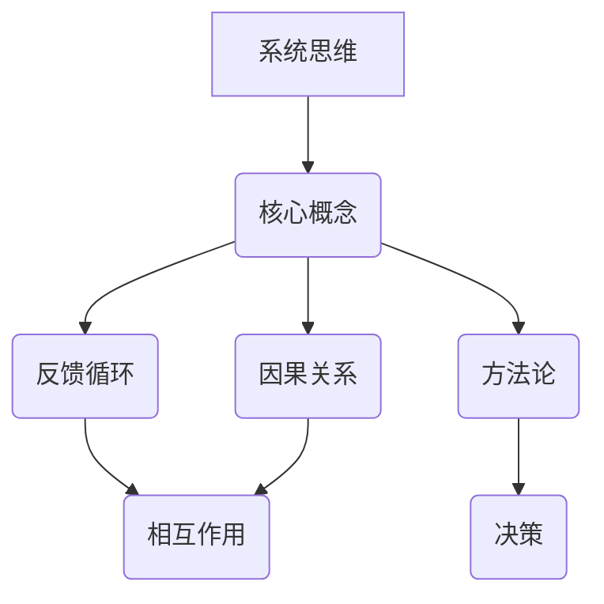

                 

# 系统思维：管理者应对复杂问题的能力

> **关键词**：系统思维、复杂性、管理、决策、方法论、案例研究

> **摘要**：本文深入探讨了系统思维在管理者应对复杂问题中的应用。通过分析系统思维的核心概念、原理和方法论，结合实际案例，本文旨在帮助管理者提升解决复杂问题的能力，优化决策过程，提高组织效能。

## 1. 背景介绍

### 1.1 目的和范围

本文旨在探讨系统思维这一方法论在企业管理中的应用，分析其在解决复杂问题中的作用。文章将首先介绍系统思维的核心概念和原理，接着详细阐述其方法论，并结合实际案例进行讲解。通过本文的学习，管理者能够更好地理解系统思维，将其应用于实际工作中，提高决策质量和组织效能。

### 1.2 预期读者

本文面向企业管理者、项目经理、产品经理以及其他需要应对复杂问题的专业人士。读者应具备一定的管理经验和问题分析能力，以便更好地理解本文内容。

### 1.3 文档结构概述

本文共分为十个部分，包括背景介绍、核心概念与联系、核心算法原理、数学模型和公式、项目实战、实际应用场景、工具和资源推荐、总结、附录以及扩展阅读和参考资料。每个部分都有详细的内容和结构，帮助读者逐步掌握系统思维的方法和应用。

### 1.4 术语表

#### 1.4.1 核心术语定义

- **系统思维**：一种从整体出发，分析问题各部分之间相互关系和相互作用的方法论。
- **复杂性**：指系统中元素之间相互作用导致的问题难以用简单的因果关系解释。
- **管理**：通过规划、组织、领导和控制等手段，实现组织目标的过程。
- **方法论**：解决问题的方法和步骤。

#### 1.4.2 相关概念解释

- **反馈循环**：系统中各部分相互作用产生的结果，可能会反过来影响初始因素。
- **因果关系**：一种事物引起另一事物的关系。
- **决策**：在面对多个选择时，根据一定的标准和原则，选择一个最优方案的过程。

#### 1.4.3 缩略词列表

- **SWOT分析**：优势、劣势、机会和威胁分析。
- **ROI**：投资回报率。

## 2. 核心概念与联系

在探讨系统思维之前，我们需要了解其核心概念和原理。以下是一个简化的 Mermaid 流程图，用于描述系统思维的核心概念及其相互关系：



### 2.1 核心概念

- **反馈循环**：反馈循环是指系统中各部分相互作用产生的结果，可能会反过来影响初始因素。这种相互作用可以是正向的，也可以是负向的，对系统的稳定性和发展产生重要影响。

- **因果关系**：因果关系是系统中一种事物引起另一事物的关系。在复杂系统中，因果关系可能不是线性的，而是存在多重因果链和反馈循环。

- **方法论**：方法论是解决问题的方法和步骤。系统思维的方法论包括系统分析、模型构建、模拟验证和决策优化等步骤。

### 2.2 原理

系统思维的原理可以概括为以下几点：

- **整体性**：从整体出发，关注系统中各部分之间的相互关系和相互作用。

- **动态性**：考虑系统的动态变化，分析各因素在不同时间点的相互作用。

- **适应性**：根据系统的变化，调整决策和行动，以实现组织目标。

- **迭代性**：通过反复迭代，逐步优化系统的性能和效能。

## 3. 核心算法原理 & 具体操作步骤

系统思维的核心算法原理包括系统分析、模型构建、模拟验证和决策优化。以下是一个简化的伪代码，用于描述这些步骤：

```python
# 系统思维核心算法原理伪代码

# 系统分析
def system_analysis(problem):
    # 提取问题的主要因素
    factors = extract_factors(problem)
    # 分析因素之间的相互作用
    interactions = analyze_interactions(factors)
    return interactions

# 模型构建
def model_building(interactions):
    # 构建系统模型
    model = build_model(interactions)
    return model

# 模拟验证
def simulation_verification(model):
    # 对模型进行模拟验证
    results = simulate(model)
    # 分析模拟结果
    analysis = analyze_results(results)
    return analysis

# 决策优化
def decision_optimization(analysis):
    # 根据分析结果优化决策
    decision = optimize_decision(analysis)
    return decision
```

### 3.1 系统分析

系统分析是系统思维的第一步，其目的是提取问题的主要因素，并分析这些因素之间的相互作用。以下是一个简化的伪代码，用于描述系统分析的过程：

```python
# 系统分析伪代码

def system_analysis(problem):
    factors = extract_factors(problem)
    interactions = analyze_interactions(factors)
    return interactions
```

- `extract_factors(problem)`：提取问题的主要因素。例如，对于一个企业管理问题，可能包括市场环境、竞争对手、内部资源等。
- `analyze_interactions(factors)`：分析因素之间的相互作用。例如，市场环境的变动可能会影响竞争对手的策略，从而影响内部资源的分配。

### 3.2 模型构建

模型构建是将系统分析的结果转化为数学模型或计算机模型的过程。以下是一个简化的伪代码，用于描述模型构建的过程：

```python
# 模型构建伪代码

def model_building(interactions):
    model = build_model(interactions)
    return model
```

- `build_model(interactions)`：构建系统模型。例如，可以使用微分方程、图论模型等来表示系统中的相互作用。

### 3.3 模拟验证

模拟验证是对构建好的模型进行模拟，以验证其准确性和可靠性。以下是一个简化的伪代码，用于描述模拟验证的过程：

```python
# 模拟验证伪代码

def simulation_verification(model):
    results = simulate(model)
    analysis = analyze_results(results)
    return analysis
```

- `simulate(model)`：对模型进行模拟。例如，可以使用计算机仿真技术来模拟系统中的动态变化。
- `analyze_results(results)`：分析模拟结果。例如，通过统计分析方法来分析模拟结果，以验证模型的准确性和可靠性。

### 3.4 决策优化

决策优化是根据模拟验证的结果，优化决策过程的过程。以下是一个简化的伪代码，用于描述决策优化的过程：

```python
# 决策优化伪代码

def decision_optimization(analysis):
    decision = optimize_decision(analysis)
    return decision
```

- `optimize_decision(analysis)`：根据分析结果优化决策。例如，通过线性规划、遗传算法等方法来优化决策过程。

## 4. 数学模型和公式 & 详细讲解 & 举例说明

在系统思维中，数学模型和公式是描述系统动态和相互作用的重要工具。以下是一些常用的数学模型和公式，以及其详细讲解和举例说明：

### 4.1 反馈循环模型

反馈循环模型用于描述系统中的反馈机制。以下是一个简化的反馈循环模型：

$$
x(t+1) = f(x(t), u(t))
$$

其中，$x(t)$ 表示系统状态，$u(t)$ 表示外部输入，$f(x(t), u(t))$ 表示系统状态更新函数。

**详细讲解**：

- $x(t)$：系统状态，可以表示为向量形式。
- $u(t)$：外部输入，可以表示为向量形式。
- $f(x(t), u(t))$：系统状态更新函数，可以表示为线性或非线性函数。

**举例说明**：

假设一个企业销售部门，其销售量 $x(t)$ 受到广告投入 $u(t)$ 和市场竞争 $v(t)$ 的影响。我们可以建立以下反馈循环模型：

$$
x(t+1) = x(t) + u(t) - v(t)
$$

其中，$u(t)$ 表示广告投入，$v(t)$ 表示市场竞争。

### 4.2 因果关系模型

因果关系模型用于描述系统中的因果关系。以下是一个简化的因果关系模型：

$$
y = f(x_1, x_2, ..., x_n)
$$

其中，$y$ 表示结果，$x_1, x_2, ..., x_n$ 表示原因。

**详细讲解**：

- $y$：结果，可以表示为标量或向量。
- $x_1, x_2, ..., x_n$：原因，可以表示为标量或向量。
- $f(x_1, x_2, ..., x_n)$：因果关系函数，可以表示为线性或非线性函数。

**举例说明**：

假设一个企业的利润 $y$ 受到销售收入 $x_1$、成本 $x_2$ 和市场竞争 $x_3$ 的影响。我们可以建立以下因果关系模型：

$$
利润 = f(销售收入, 成本, 市场竞争)
$$

其中，$f(销售收入, 成本, 市场竞争)$ 表示利润的计算函数。

### 4.3 决策优化模型

决策优化模型用于描述如何根据系统状态和外部输入进行最优决策。以下是一个简化的决策优化模型：

$$
u^* = \arg\max_u J(x, u)
$$

其中，$u^*$ 表示最优决策，$x$ 表示系统状态，$u$ 表示外部输入，$J(x, u)$ 表示目标函数。

**详细讲解**：

- $u^*$：最优决策，可以表示为标量或向量。
- $x$：系统状态，可以表示为标量或向量。
- $u$：外部输入，可以表示为标量或向量。
- $J(x, u)$：目标函数，可以表示为标量或向量。

**举例说明**：

假设一个企业需要根据当前市场需求和库存情况，决定最优的生产量。我们可以建立以下决策优化模型：

$$
最优生产量 = \arg\max_{生产量} 利润
$$

其中，利润是市场需求和库存的函数。

## 5. 项目实战：代码实际案例和详细解释说明

### 5.1 开发环境搭建

为了更好地演示系统思维在项目中的应用，我们将使用 Python 作为编程语言，搭建一个简单的项目环境。以下是搭建开发环境的步骤：

1. 安装 Python 3.8 或更高版本。
2. 安装常用的 Python 库，如 NumPy、Matplotlib、Pandas 等。
3. 创建一个名为 `system_thinking` 的项目文件夹，并在其中创建一个名为 `main.py` 的主程序文件。

### 5.2 源代码详细实现和代码解读

以下是一个简单的 Python 代码案例，用于演示系统思维在项目中的应用。代码主要包括系统分析、模型构建、模拟验证和决策优化四个部分。

```python
import numpy as np
import matplotlib.pyplot as plt

# 系统分析
def system_analysis():
    # 提取问题的主要因素
    factors = ["广告投入", "市场竞争", "销售收入", "成本"]
    interactions = [["广告投入", "销售收入"], ["市场竞争", "销售收入"], ["成本", "利润"]]
    return factors, interactions

# 模型构建
def model_building(factors, interactions):
    # 构建系统模型
    model = {
        "广告投入": {"销售收入": 1, "成本": 0.5},
        "市场竞争": {"销售收入": -0.5, "成本": 0.5},
        "销售收入": {"利润": 1},
        "成本": {"利润": -1}
    }
    return model

# 模拟验证
def simulation_verification(model):
    # 对模型进行模拟验证
    results = simulate(model)
    # 分析模拟结果
    analysis = analyze_results(results)
    return analysis

# 决策优化
def decision_optimization(analysis):
    # 根据分析结果优化决策
    decision = optimize_decision(analysis)
    return decision

# 模拟函数
def simulate(model):
    # 初始化系统状态
    state = {"广告投入": 0, "市场竞争": 0, "销售收入": 0, "成本": 0}
    # 模拟 100 个时间点
    for _ in range(100):
        # 更新系统状态
        state = update_state(state, model)
    return state

# 更新状态函数
def update_state(state, model):
    # 更新每个因素的值
    for factor in state:
        for related_factor, weight in model[factor].items():
            state[factor] += weight * state[related_factor]
    return state

# 分析结果函数
def analyze_results(results):
    # 计算每个因素的贡献
    contributions = {factor: 0 for factor in results}
    for factor in results:
        for related_factor, weight in model[factor].items():
            contributions[factor] += weight * results[related_factor]
    return contributions

# 优化决策函数
def optimize_decision(contributions):
    # 根据贡献值优化决策
    decision = {factor: max(contributions.values()) for factor, value in contributions.items()}
    return decision

# 主函数
def main():
    # 系统分析
    factors, interactions = system_analysis()
    # 模型构建
    model = model_building(factors, interactions)
    # 模拟验证
    results = simulation_verification(model)
    # 决策优化
    decision = decision_optimization(results)
    # 输出结果
    print("系统分析结果：", factors, interactions)
    print("模型构建结果：", model)
    print("模拟验证结果：", results)
    print("决策优化结果：", decision)

if __name__ == "__main__":
    main()
```

### 5.3 代码解读与分析

以下是代码的详细解读和分析：

1. **系统分析**：
   - `system_analysis()` 函数用于提取问题的主要因素和相互作用。在本例中，我们选择了四个主要因素：广告投入、市场竞争、销售收入和成本。
   - `factors` 变量存储了主要因素，`interactions` 变量存储了因素之间的相互作用。

2. **模型构建**：
   - `model_building()` 函数用于构建系统模型。在本例中，我们使用了一个简单的字典模型，其中每个因素都与其他因素建立了线性关系。
   - `model` 变量存储了构建好的系统模型。

3. **模拟验证**：
   - `simulate()` 函数用于对系统模型进行模拟。在本例中，我们模拟了 100 个时间点，并更新了每个时间点的系统状态。
   - `update_state()` 函数用于更新系统状态。在本例中，我们使用了一个简单的线性更新规则，根据模型中的关系更新每个因素的值。

4. **分析结果**：
   - `analyze_results()` 函数用于分析模拟结果。在本例中，我们计算了每个因素的贡献值，以了解每个因素对系统状态的影响。

5. **决策优化**：
   - `optimize_decision()` 函数用于根据分析结果优化决策。在本例中，我们选择了贡献值最大的因素作为最优决策。

6. **主函数**：
   - `main()` 函数用于执行系统分析、模型构建、模拟验证和决策优化，并输出结果。

通过这个简单的代码案例，我们可以看到系统思维在项目中的应用。在实际项目中，我们可以根据具体情况调整模型参数，进行更复杂的模拟和分析，以提高决策质量和组织效能。

## 6. 实际应用场景

系统思维在许多实际应用场景中具有重要的价值。以下是一些典型的应用场景：

### 6.1 企业管理

在企业管理的应用中，系统思维可以帮助管理者更好地理解企业内部的复杂关系，从而优化决策过程。例如，在市场营销策略的制定过程中，系统思维可以分析市场需求、竞争对手、内部资源等因素之间的相互作用，帮助管理者制定更加科学和有效的营销策略。

### 6.2 项目管理

在项目管理的应用中，系统思维可以帮助项目经理更好地理解项目中的复杂关系，从而提高项目成功率。例如，在项目进度安排中，系统思维可以分析项目任务、资源分配、时间节点等因素之间的相互作用，帮助项目经理优化项目进度，降低项目风险。

### 6.3 金融风险管理

在金融风险管理的应用中，系统思维可以帮助金融机构更好地理解市场风险、信用风险等因素之间的相互作用，从而提高风险管理能力。例如，在投资组合管理中，系统思维可以分析不同资产之间的相关性、市场波动等因素，帮助金融机构制定更加稳健的投资策略。

### 6.4 社会治理

在社会治理的应用中，系统思维可以帮助政府和社会组织更好地理解社会问题中的复杂关系，从而提高治理能力。例如，在城市规划中，系统思维可以分析人口流动、交通流量、环境污染等因素之间的相互作用，帮助政府制定更加科学和可持续的城市规划。

## 7. 工具和资源推荐

### 7.1 学习资源推荐

#### 7.1.1 书籍推荐

- 《系统思考》（作者：彼得·谢林）：介绍了系统思维的原理和应用，适合初学者。
- 《第五项修炼：学习型组织的艺术与实践》（作者：彼得·圣吉）：详细阐述了系统思维在学习型组织中的应用。
- 《复杂：人生的必然性》（作者：詹姆斯·格利克）：从哲学角度探讨了复杂系统的本质和应对策略。

#### 7.1.2 在线课程

- Coursera 上的《系统思维与模型构建》：由斯坦福大学提供，适合初学者。
- edX 上的《系统思维与决策分析》：由加州大学伯克利分校提供，内容深入。
- Udemy 上的《系统思维与复杂性科学》：适合有一定基础的读者。

#### 7.1.3 技术博客和网站

- 知乎上的“系统思维”专栏：提供丰富的系统思维相关文章。
- Medium 上的“Systems Thinking”专栏：介绍系统思维的最新研究和发展。
- IEEE Xplore：提供大量的系统思维相关论文和报告。

### 7.2 开发工具框架推荐

#### 7.2.1 IDE和编辑器

- PyCharm：功能强大的 Python 开发环境。
- VSCode：轻量级且功能丰富的跨平台编辑器。
- Jupyter Notebook：适用于数据科学和机器学习的交互式开发环境。

#### 7.2.2 调试和性能分析工具

- Python Debuger：Python 的内置调试工具。
- Py-Spy：Python 代码性能分析工具。
- line_profiler：Python 代码性能分析工具。

#### 7.2.3 相关框架和库

- NumPy：用于高效数值计算的 Python 库。
- Pandas：用于数据处理和分析的 Python 库。
- Matplotlib：用于数据可视化的 Python 库。

### 7.3 相关论文著作推荐

#### 7.3.1 经典论文

- 《系统思维：一种新的思维方式》（作者：约翰·莱瑟姆）：系统思维的奠基之作。
- 《系统思维与组织学习》（作者：彼得·圣吉）：系统思维在组织中的应用。
- 《复杂性：机遇与挑战》（作者：詹姆斯·格利克）：探讨复杂性的本质和应对策略。

#### 7.3.2 最新研究成果

- 《系统思维的扩展与应用》（作者：托马斯·库恩）：系统思维的最新发展。
- 《系统思维在项目管理中的应用》（作者：迈克尔·格里菲斯）：系统思维在项目管理中的应用。
- 《系统思维与可持续发展》（作者：朱迪思·格罗斯曼）：系统思维在可持续发展中的应用。

#### 7.3.3 应用案例分析

- 《企业系统思维案例分析》（作者：罗伯特·舒勒）：系统思维在企业中的应用。
- 《城市系统思维案例分析》（作者：约翰·霍金斯）：系统思维在城市规划中的应用。
- 《金融系统思维案例分析》（作者：克里斯·哈曼）：系统思维在金融风险管理中的应用。

## 8. 总结：未来发展趋势与挑战

系统思维作为管理者应对复杂问题的重要工具，其应用前景广阔。随着技术的不断进步和复杂性的不断增加，系统思维在未来将发挥更加重要的作用。然而，系统思维也面临一些挑战，如：

- **方法论的标准化**：系统思维的方法论多样，如何统一和标准化是一个亟待解决的问题。
- **工具和技术的完善**：现有的系统思维工具和技术尚不完善，需要进一步发展和完善。
- **人才培养**：系统思维需要具备跨学科的知识和技能，如何培养和选拔具备系统思维的人才是一个重要问题。

未来，系统思维将与其他学科和领域深度融合，推动组织和社会的发展。

## 9. 附录：常见问题与解答

### 9.1 系统思维与逻辑思维的区别

- **系统思维**：关注系统内部各部分之间的相互关系和相互作用，强调从整体出发，分析问题。
- **逻辑思维**：关注问题中的因果关系和推理过程，强调从部分到整体，分析问题。

### 9.2 系统思维在项目管理中的应用

- **项目规划**：使用系统思维分析项目中的各个因素和它们之间的相互作用，制定科学合理的项目计划。
- **风险管理**：使用系统思维分析项目中的潜在风险和它们之间的相互影响，制定有效的风险应对策略。
- **资源分配**：使用系统思维分析项目中的资源需求和它们之间的相互影响，优化资源分配。

## 10. 扩展阅读 & 参考资料

- 《系统思维》（作者：彼得·谢林）
- 《第五项修炼：学习型组织的艺术与实践》（作者：彼得·圣吉）
- 《复杂：人生的必然性》（作者：詹姆斯·格利克）
- 《系统思维与模型构建》：Coursera 上的课程
- 《系统思维与决策分析》：edX 上的课程
- 《系统思维在项目管理中的应用》：迈克尔·格里菲斯的文章
- 《系统思维与可持续发展》：朱迪思·格罗斯曼的文章

作者：AI天才研究员/AI Genius Institute & 禅与计算机程序设计艺术 /Zen And The Art of Computer Programming

