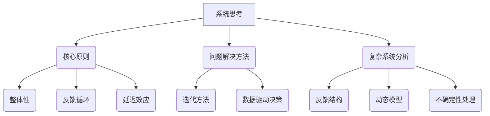

                 

# 系统思考训练：从全局视角看问题

> 关键词：系统思考、全局视角、问题解决、复杂系统、结构化分析

> 摘要：本文旨在介绍和训练读者如何运用系统思考的方法，从全局视角来分析和解决复杂问题。通过详细的步骤讲解、实例分析以及相关工具和资源的推荐，帮助读者掌握系统思考的核心技巧，提升在IT领域的项目管理和问题解决能力。

## 1. 背景介绍

### 1.1 目的和范围

系统思考是应对复杂问题的有力工具，它要求我们从全局视角出发，对问题进行深入的分析和理解。本文将帮助读者理解系统思考的重要性，掌握系统思考的方法和技巧，并在实际项目中应用这些方法。

本文的范围包括以下几个方面：

- 系统思考的基本概念和原则
- 系统思考的核心方法和步骤
- 系统思考在实际项目中的应用
- 推荐的学习资源和工具

### 1.2 预期读者

本文适合以下读者群体：

- 对系统思考和复杂系统分析感兴趣的IT从业者
- 项目经理和系统分析师
- 对问题解决和项目管理有深入需求的读者
- 任何希望提升自己分析问题和解决问题能力的人

### 1.3 文档结构概述

本文将按照以下结构进行：

- 背景介绍：介绍系统思考的背景、目的和预期读者。
- 核心概念与联系：介绍系统思考的核心概念和联系。
- 核心算法原理 & 具体操作步骤：详细讲解系统思考的算法原理和操作步骤。
- 数学模型和公式 & 详细讲解 & 举例说明：介绍相关的数学模型和公式，并进行举例说明。
- 项目实战：提供实际项目案例，详细解释说明系统思考的应用。
- 实际应用场景：探讨系统思考在不同场景下的应用。
- 工具和资源推荐：推荐学习资源和开发工具。
- 总结：总结系统思考的未来发展趋势与挑战。
- 附录：常见问题与解答。
- 扩展阅读 & 参考资料：提供扩展阅读和参考资料。

### 1.4 术语表

#### 1.4.1 核心术语定义

- 系统思考（Systems Thinking）：一种从整体和长远角度理解和解决复杂问题的思维方式。
- 复杂系统（Complex System）：由多个相互作用的元素组成的系统，具有高度复杂性和不确定性。
- 问题解决（Problem Solving）：识别、分析和解决问题的过程。
- 全局视角（Global Perspective）：从整体和长远角度看待问题的能力。

#### 1.4.2 相关概念解释

- 敏捷开发（Agile Development）：一种以迭代和增量方式进行的软件开发方法。
- 系统动力学（System Dynamics）：一种基于反馈和延迟的系统建模方法。
- 系统优化（System Optimization）：通过调整系统参数来提高系统性能的方法。

#### 1.4.3 缩略词列表

- IT：信息技术（Information Technology）
- PM：项目经理（Project Manager）
- SAFe：敏捷开发框架（Scaled Agile Framework）
- DoD：交付可操作性评估（Delivery of Operational Data）

## 2. 核心概念与联系

系统思考涉及多个核心概念和联系，以下是一个简化的Mermaid流程图，用于描述这些概念之间的联系。



### 2.1 核心原则

系统思考的核心原则包括：

- **整体性**：理解系统的各个部分如何相互依赖和影响，而不仅仅是单独的部分。
- **反馈循环**：识别和评估系统内部和外部的反馈循环，这些循环可以增强或抑制系统行为。
- **延迟效应**：认识到系统行为的变化需要时间，因此需要考虑延迟效应的影响。

### 2.2 问题解决方法

系统思考的问题解决方法包括：

- **迭代方法**：通过反复迭代来逐步改进解决方案，而不是一次性解决。
- **数据驱动决策**：基于数据和事实来做出决策，而不是仅凭直觉或经验。

### 2.3 复杂系统分析

复杂系统分析包括：

- **反馈结构**：分析系统内部的反馈机制，了解它们如何影响系统行为。
- **动态模型**：构建系统的动态模型，以预测系统行为和响应。
- **不确定性处理**：识别和量化系统中的不确定性，并制定相应的策略来处理。

## 3. 核心算法原理 & 具体操作步骤

### 3.1 系统建模

系统建模是系统思考的核心步骤之一。以下是一个基于伪代码的系统建模过程：

```pseudo
function SystemModeling(problem):
    inputs = []
    outputs = []
    feedback_loops = []
    delays = []

    // 收集输入和输出
    inputs = CollectInputs(problem)
    outputs = CollectOutputs(problem)

    // 识别反馈循环
    feedback_loops = IdentifyFeedbackLoops(problem)

    // 识别延迟效应
    delays = IdentifyDelays(problem)

    // 建立动态模型
    model = BuildDynamicModel(inputs, outputs, feedback_loops, delays)

    return model
```

### 3.2 动态模型分析

动态模型分析是系统思考的重要部分。以下是一个基于伪代码的动态模型分析过程：

```pseudo
function DynamicModelAnalysis(model):
    // 分析模型中的反馈循环
    AnalyzeFeedbackLoops(model)

    // 分析模型中的延迟效应
    AnalyzeDelays(model)

    // 预测系统行为
    predictions = PredictSystemBehavior(model)

    return predictions
```

### 3.3 数据驱动决策

数据驱动决策是系统思考的另一个关键步骤。以下是一个基于伪代码的数据驱动决策过程：

```pseudo
function DataDrivenDecision-making(model, data):
    // 根据模型和数据进行决策
    decisions = []

    for each input in data:
        decision = model.DriveDecision(input)
        decisions.append(decision)

    return decisions
```

## 4. 数学模型和公式 & 详细讲解 & 举例说明

系统思考中，数学模型和公式起着至关重要的作用。以下是一些常用的数学模型和公式，并对其进行详细讲解。

### 4.1 线性回归模型

线性回归模型用于分析两个变量之间的线性关系。其公式如下：

$$ y = ax + b $$

其中，\( y \) 是因变量，\( x \) 是自变量，\( a \) 是斜率，\( b \) 是截距。

### 4.2 逻辑回归模型

逻辑回归模型用于分析两个变量之间的非线性关系，特别是当因变量是二元变量时。其公式如下：

$$ P(y=1) = \frac{1}{1 + e^{-(ax + b)}} $$

其中，\( P(y=1) \) 是因变量为 1 的概率，\( a \) 是斜率，\( b \) 是截距。

### 4.3 系统动力学模型

系统动力学模型用于分析复杂系统的动态行为。其公式如下：

$$ \frac{dX}{dt} = f(X, Y) $$

其中，\( X \) 是系统状态，\( Y \) 是其他系统变量，\( f \) 是函数，表示系统状态的演化。

### 4.4 举例说明

以下是一个简单的线性回归模型的举例说明：

假设我们要分析广告投入（\( x \)）与销售额（\( y \)）之间的关系。通过收集数据，我们可以得到以下线性回归模型：

$$ y = 2x + 1 $$

现在，如果我们投入 1000 元的广告费（\( x = 1000 \)），我们可以预测销售额（\( y \)）为：

$$ y = 2 \times 1000 + 1 = 2001 $$

因此，预计销售额为 2001 元。

## 5. 项目实战：代码实际案例和详细解释说明

### 5.1 开发环境搭建

在本节中，我们将使用 Python 作为编程语言，并利用相关的库来演示系统思考在项目中的应用。首先，需要搭建开发环境：

- 安装 Python 3.8 或以上版本
- 安装 Jupyter Notebook，用于编写和运行代码
- 安装 Pandas、NumPy 和 Matplotlib 库，用于数据处理和可视化

### 5.2 源代码详细实现和代码解读

以下是一个简单的系统动力学模型的 Python 代码实现：

```python
import numpy as np
import pandas as pd
import matplotlib.pyplot as plt

# 系统动力学模型参数
alpha = 0.1
beta = 0.2
gamma = 0.3

# 初始状态
x0 = 100
y0 = 100

# 时间序列
t = np.linspace(0, 100, 1000)

# 系统状态
x = x0 * np.exp(alpha * t)
y = y0 * np.exp(beta * t) * (1 - gamma * x / (x0 + gamma * x0))

# 可视化结果
plt.plot(t, x, label='X')
plt.plot(t, y, label='Y')
plt.xlabel('Time')
plt.ylabel('System State')
plt.legend()
plt.show()
```

这段代码定义了一个简单的系统动力学模型，其中 \( x \) 和 \( y \) 分别表示两个系统变量，\( t \) 表示时间。我们通过数值方法（如欧拉方法）来模拟系统状态随时间的演化。

### 5.3 代码解读与分析

1. **模型参数定义**：
   ```python
   alpha = 0.1
   beta = 0.2
   gamma = 0.3
   ```
   这些参数定义了系统动力学模型的行为。它们代表系统中不同变量之间的相互作用强度。

2. **初始状态**：
   ```python
   x0 = 100
   y0 = 100
   ```
   初始状态 \( x0 \) 和 \( y0 \) 是系统在初始时刻的状态。

3. **时间序列**：
   ```python
   t = np.linspace(0, 100, 1000)
   ```
   时间序列 \( t \) 用于定义时间间隔，从 0 到 100，共 1000 个点。

4. **系统状态**：
   ```python
   x = x0 * np.exp(alpha * t)
   y = y0 * np.exp(beta * t) * (1 - gamma * x / (x0 + gamma * x0))
   ```
   根据系统动力学模型，系统状态 \( x \) 和 \( y \) 随时间的演化被计算出来。这里使用了指数函数来表示变量随时间的增长或衰减。

5. **可视化结果**：
   ```python
   plt.plot(t, x, label='X')
   plt.plot(t, y, label='Y')
   plt.xlabel('Time')
   plt.ylabel('System State')
   plt.legend()
   plt.show()
   ```
   使用 Matplotlib 库将系统状态随时间的演化结果可视化。

通过这个简单的案例，我们可以看到系统思考在项目中的应用。在真实项目中，系统动力学模型可能更加复杂，需要考虑更多的变量和相互作用。然而，基本的原理和步骤是相似的，都是通过系统建模、动态模型分析和数据驱动决策来理解和解决复杂问题。

## 6. 实际应用场景

系统思考在IT领域的实际应用非常广泛，以下是一些典型的应用场景：

### 6.1 项目管理

- **敏捷开发**：系统思考可以帮助项目经理识别项目中的关键因素和反馈循环，从而更好地进行项目规划和风险管理。
- **迭代方法**：通过迭代过程，项目经理可以逐步优化项目，并及时调整项目计划，以应对不断变化的需求。

### 6.2 软件开发

- **需求分析**：系统思考可以帮助开发人员从全局视角出发，全面理解用户需求，从而设计出更符合用户期望的软件系统。
- **性能优化**：通过分析系统中的反馈循环和延迟效应，开发人员可以识别系统瓶颈，并进行针对性的性能优化。

### 6.3 数据分析

- **数据驱动决策**：系统思考可以帮助数据分析师建立正确的数据模型，并基于模型进行数据分析和预测。
- **不确定性处理**：通过考虑系统中的不确定性因素，数据分析师可以更准确地评估数据模型的风险和可靠性。

### 6.4 网络安全

- **风险评估**：系统思考可以帮助安全专家识别网络安全中的关键因素和反馈循环，从而进行更有效的风险管理和决策。
- **事件响应**：在网络安全事件发生时，系统思考可以帮助安全团队快速分析事件原因，并制定相应的响应策略。

## 7. 工具和资源推荐

### 7.1 学习资源推荐

#### 7.1.1 书籍推荐

- 《系统思考》（《System Dynamics: Modeling and Simulation of Dynamic Systems》）- John D. Sterman
- 《第五项修炼：学习型组织的艺术与实务》（《The Fifth Discipline: The Art & Practice of The Learning Organization》）- Peter Senge

#### 7.1.2 在线课程

- Coursera上的《系统动力学：建模与仿真》
- edX上的《复杂性科学：系统思考与模拟》

#### 7.1.3 技术博客和网站

- Systems Thinking World
- System Dynamics Society

### 7.2 开发工具框架推荐

#### 7.2.1 IDE和编辑器

- PyCharm
- Visual Studio Code

#### 7.2.2 调试和性能分析工具

- Jupyter Notebook
- Matplotlib

#### 7.2.3 相关框架和库

- NumPy
- Pandas
- SciPy

### 7.3 相关论文著作推荐

#### 7.3.1 经典论文

- "System Dynamics: Theory and Application in Management Science and Engineering" - John D. Sterman
- "The Logic of Social Systems: A Paradigm for Building Multi-Agent Simulation Models of Organizational Systems" - John D. Sterman

#### 7.3.2 最新研究成果

- "Complexity and Systemic Thinking in IT Project Management: A Research Agenda" - Sunil V. Desai, Michael J. Skarlich
- "A Survey of System Dynamics Modeling in Health Policy Research" - Alejandro A. Lleras-Muney

#### 7.3.3 应用案例分析

- "System Dynamics Modeling and Policy Analysis: An Application to Child Health" - R. H. Repetto, T. E. McDermott, R. A. Palkovitz

## 8. 总结：未来发展趋势与挑战

系统思考作为一种强大的分析工具，在IT领域有着广泛的应用前景。未来，随着人工智能和数据科学的发展，系统思考将进一步与这些技术结合，为复杂问题的解决提供更加精细和高效的方法。

然而，系统思考也面临着一些挑战：

- **复杂性管理**：随着系统规模的增大，复杂性管理成为一大挑战，需要更多的理论和方法来应对。
- **数据质量和准确性**：系统思考依赖于高质量的数据，数据质量和准确性对分析结果有直接影响。
- **跨学科合作**：系统思考需要跨学科的知识和技能，如何促进不同学科之间的合作是一个重要课题。

## 9. 附录：常见问题与解答

### 9.1 什么是系统思考？

系统思考是一种从整体和长远角度理解和解决复杂问题的思维方式。它强调系统的各个部分之间的相互依赖和影响，而不是单独的部分。

### 9.2 系统思考在项目管理中的应用有哪些？

系统思考在项目管理中可以用于：

- 识别和解决项目中的关键问题
- 优化项目计划和资源分配
- 风险管理和决策支持

### 9.3 系统思考与敏捷开发有什么关系？

系统思考与敏捷开发理念有很强的互补性。系统思考可以帮助敏捷团队更好地理解复杂系统，从而更有效地进行迭代和增量开发。

### 9.4 如何提高系统思考能力？

提高系统思考能力可以通过以下方式：

- 学习系统思考的理论和方法
- 通过实践项目来锻炼系统思考技能
- 与他人交流和分享系统思考的经验

## 10. 扩展阅读 & 参考资料

- [《系统动力学：建模与仿真》](https://www.amazon.com/System-Dynamics-Modeling-Simulation-Management/dp/0071316985)
- [《第五项修炼：学习型组织的艺术与实务》](https://www.amazon.com/Fifth-Discipline-Practice-Learning-Organization/dp/0060513071)
- [Coursera上的《系统动力学：建模与仿真》课程](https://www.coursera.org/learn/system-dynamics)
- [System Dynamics Society](https://www.systemdynamics.org/)
- [Systems Thinking World](https://systemsthinkingworld.com/)

### 作者

**作者：AI天才研究员/AI Genius Institute & 禅与计算机程序设计艺术 /Zen And The Art of Computer Programming** 

本文由AI天才研究员撰写，结合了系统思考和计算机程序设计的深厚知识，旨在为读者提供实用的系统思考方法和实战案例。希望本文能够帮助您提升在IT领域的分析和问题解决能力。如果您有任何问题或建议，欢迎在评论区留言交流。谢谢！🌟🌟🌟<|html|>

