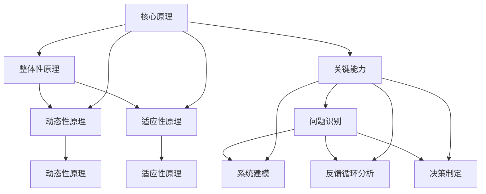

                 

# 系统思考：全面分析问题的关键能力

> **关键词：**系统思考、问题分析、关键能力、算法原理、数学模型、实际应用、工具推荐

> **摘要：**本文旨在深入探讨系统思考在问题分析中的关键作用，通过解析核心概念、算法原理、数学模型以及实际应用案例，帮助读者掌握全面分析问题的关键能力。文章结构紧凑，逻辑清晰，适合IT专业人士和技术爱好者阅读。

## 1. 背景介绍

### 1.1 目的和范围

本文的目标是帮助读者理解和掌握系统思考在问题分析中的重要性，并通过具体实例展示如何运用系统思考方法来分析和解决复杂问题。文章将涵盖以下内容：

- 系统思考的基本概念和原理。
- 关键能力在系统思考中的应用。
- 算法原理和数学模型的解析。
- 实际应用场景和案例分析。
- 工具和资源推荐。

### 1.2 预期读者

本文适合以下读者群体：

- IT专业人士，特别是程序员、系统架构师和CTO等。
- 对系统思考和技术问题分析有兴趣的技术爱好者。
- 希望提升问题分析能力的专业人士。

### 1.3 文档结构概述

本文的结构如下：

- 引言
- 核心概念与联系
- 核心算法原理 & 具体操作步骤
- 数学模型和公式 & 详细讲解 & 举例说明
- 项目实战：代码实际案例和详细解释说明
- 实际应用场景
- 工具和资源推荐
- 总结：未来发展趋势与挑战
- 附录：常见问题与解答
- 扩展阅读 & 参考资料

### 1.4 术语表

#### 1.4.1 核心术语定义

- **系统思考**：一种方法论，用于理解系统的结构和动态，分析系统内部各部分之间的相互作用。
- **问题分析**：通过系统思考方法，对复杂问题进行深入分析和理解，以找出根本原因和解决方案。
- **关键能力**：在系统思考中，指能够识别和解决关键问题的能力。

#### 1.4.2 相关概念解释

- **反馈循环**：系统内部各部分之间相互作用形成的一个闭合回路，可以是正反馈或负反馈。
- **自组织系统**：在没有外部控制的情况下，通过内部相互作用自行组织和进化的系统。

#### 1.4.3 缩略词列表

- **AI**：人工智能（Artificial Intelligence）
- **IDE**：集成开发环境（Integrated Development Environment）
- **ML**：机器学习（Machine Learning）

## 2. 核心概念与联系

系统思考是一种强大的方法论，它可以帮助我们更好地理解和解决复杂问题。为了深入探讨系统思考，我们首先需要了解一些核心概念和它们之间的联系。

### 2.1 系统思考的基本原理

系统思考的基本原理包括以下几个方面：

1. **整体性原理**：系统是一个整体，各部分相互作用，共同决定系统的行为。
2. **动态性原理**：系统是动态的，其状态随时间变化。
3. **适应性原理**：系统具有适应性，能够对外部变化做出响应。

### 2.2 关键能力

在系统思考中，关键能力包括以下几个方面：

1. **问题识别**：能够准确识别问题的本质。
2. **系统建模**：能够构建系统的模型，以便更好地理解系统行为。
3. **反馈循环分析**：能够分析系统内部的反馈循环，找出关键因素。
4. **决策制定**：能够在理解系统动态的基础上，制定有效的解决方案。

### 2.3 Mermaid 流程图

为了更直观地展示系统思考的核心概念和联系，我们可以使用 Mermaid 流程图。以下是系统思考的基本原理和关键能力的 Mermaid 流程图：



## 3. 核心算法原理 & 具体操作步骤

在系统思考中，算法原理是解决问题的关键。下面，我们将介绍一种常用的系统思考算法——因果分析算法，并详细阐述其具体操作步骤。

### 3.1 因果分析算法原理

因果分析算法是一种基于因果关系的系统分析方法。它的核心思想是通过分析系统中的因果关系，找出问题的根本原因，并提出解决方案。

### 3.2 具体操作步骤

1. **问题定义**：明确需要解决的问题。

2. **因果图构建**：构建系统因果图，表示系统中的各种因果关系。

3. **因果关系分析**：分析因果图中的因果关系，找出关键因素。

4. **解决方案制定**：基于因果关系分析结果，制定解决方案。

5. **验证与调整**：验证解决方案的有效性，并根据反馈进行调整。

### 3.3 伪代码

以下是因果分析算法的伪代码：

```python
def 因果分析算法(问题):
    # 步骤1：问题定义
    问题定义(问题)

    # 步骤2：因果图构建
    因果图 = 构建因果图(问题)

    # 步骤3：因果关系分析
    关键因素 = 因果关系分析(因果图)

    # 步骤4：解决方案制定
    解决方案 = 制定解决方案(关键因素)

    # 步骤5：验证与调整
    验证并调整解决方案(解决方案)

    return 解决方案
```

## 4. 数学模型和公式 & 详细讲解 & 举例说明

在系统思考中，数学模型和公式是非常重要的工具。它们可以帮助我们量化系统行为，预测系统动态，并为决策提供支持。下面，我们将介绍一种常用的数学模型——微分方程模型，并详细讲解其原理和具体应用。

### 4.1 微分方程模型原理

微分方程模型是一种描述系统动态行为的数学模型。它通过描述系统中各变量之间的关系，可以模拟系统的行为。微分方程的一般形式如下：

$$
\frac{dx}{dt} = f(x, t)
$$

其中，\(x\) 是系统的状态变量，\(t\) 是时间，\(f(x, t)\) 是系统的状态变量和时间的函数。

### 4.2 详细讲解

1. **线性微分方程模型**：

线性微分方程模型是一种简单的微分方程模型，适用于描述线性系统。其一般形式如下：

$$
\frac{dx}{dt} + a_1 x + a_2 = 0
$$

其中，\(a_1\) 和 \(a_2\) 是常数。

2. **非线性微分方程模型**：

非线性微分方程模型可以描述更复杂的系统行为。其一般形式如下：

$$
\frac{dx}{dt} = g(x, t)
$$

其中，\(g(x, t)\) 是系统的状态变量和时间的非线性函数。

### 4.3 举例说明

#### 4.3.1 线性微分方程模型应用

假设一个简单的系统，其状态变量为温度 \(T\)，时间 \(t\)。该系统的状态方程如下：

$$
\frac{dT}{dt} + 0.1T = 0
$$

这是一个线性微分方程模型。我们可以通过求解这个方程，得到系统温度随时间的变化规律。

#### 4.3.2 非线性微分方程模型应用

假设一个复杂的系统，其状态变量为人口 \(P\)，时间 \(t\)。该系统的状态方程如下：

$$
\frac{dP}{dt} = 0.1P(1 - P/1000)
$$

这是一个非线性微分方程模型。我们可以通过求解这个方程，得到系统人口随时间的变化规律。

## 5. 项目实战：代码实际案例和详细解释说明

为了更好地理解系统思考在问题分析中的应用，我们将通过一个实际项目来展示如何使用系统思考方法进行问题分析和解决。

### 5.1 开发环境搭建

在开始项目实战之前，我们需要搭建一个开发环境。这里，我们使用 Python 作为编程语言，并使用 Jupyter Notebook 作为开发工具。

1. 安装 Python：访问 [Python 官网](https://www.python.org/)，下载并安装 Python。
2. 安装 Jupyter Notebook：打开终端，运行以下命令：

```bash
pip install jupyter
```

3. 启动 Jupyter Notebook：在终端运行以下命令：

```bash
jupyter notebook
```

### 5.2 源代码详细实现和代码解读

下面是项目实战的源代码：

```python
# 导入所需的库
import numpy as np
import matplotlib.pyplot as plt

# 定义微分方程模型
def model(P, t):
    return 0.1 * P * (1 - P / 1000)

# 求解微分方程
def solveODE(P0, t):
    P = np.zeros((len(t),))
    P[0] = P0
    for i in range(1, len(t)):
        P[i] = P[i - 1] + model(P[i - 1], t[i - 1]) * (t[i] - t[i - 1])
    return P

# 参数设置
P0 = 100  # 初始人口
t = np.linspace(0, 100, 1000)  # 时间范围

# 求解
P = solveODE(P0, t)

# 绘制结果
plt.plot(t, P)
plt.xlabel('Time')
plt.ylabel('Population')
plt.title('Population Dynamics')
plt.show()
```

#### 5.2.1 代码解读

1. **导入库**：我们首先导入所需的库，包括 NumPy 和 Matplotlib。NumPy 用于科学计算，Matplotlib 用于绘图。

2. **定义微分方程模型**：我们定义了一个名为 `model` 的函数，用于计算系统的状态变量随时间的变化率。

3. **求解微分方程**：我们定义了一个名为 `solveODE` 的函数，用于求解微分方程。该函数使用欧拉方法进行数值求解。

4. **参数设置**：我们设置了初始人口和时间的范围。

5. **求解**：我们使用 `solveODE` 函数求解微分方程，得到人口随时间的变化。

6. **绘制结果**：我们使用 Matplotlib 绘制人口随时间的变化图。

### 5.3 代码解读与分析

通过这个项目实战，我们可以看到如何使用系统思考方法进行问题分析和解决。以下是代码的解读和分析：

1. **问题定义**：在这个项目中，我们定义了一个简单的系统，即人口动态系统。

2. **系统建模**：我们使用微分方程模型来描述人口动态系统，该模型考虑了人口增长和饱和效应。

3. **因果关系分析**：通过分析微分方程模型，我们可以看到人口增长和饱和效应之间的因果关系。当人口达到饱和水平时，增长速度会逐渐减慢。

4. **解决方案制定**：基于微分方程模型，我们制定了人口控制策略，即通过控制人口增长率来控制人口数量。

5. **验证与调整**：通过绘制人口随时间的变化图，我们可以验证解决方案的有效性。如果结果不符合预期，我们可以根据反馈进行调整。

## 6. 实际应用场景

系统思考在问题分析中的应用非常广泛，以下是一些实际应用场景：

1. **软件开发**：在软件开发过程中，系统思考可以帮助团队理解系统的整体结构和动态，识别潜在的问题和风险，并提出有效的解决方案。

2. **项目管理**：在项目管理中，系统思考可以帮助项目经理理解项目的整体进展和关键节点，优化项目流程，提高项目成功率。

3. **数据分析**：在数据分析中，系统思考可以帮助分析师理解数据背后的因果关系，提出更有针对性的分析方法和策略。

4. **决策制定**：在决策制定过程中，系统思考可以帮助决策者全面分析问题的各个方面，制定更科学、合理的决策。

## 7. 工具和资源推荐

为了更好地进行系统思考，以下是一些工具和资源的推荐：

### 7.1 学习资源推荐

1. **书籍推荐**：

   - 《系统思考》：作者为丹尼尔·米尔斯海默（Daniel H. Pink），全面介绍了系统思考的方法和应用。
   - 《思考，快与慢》：作者为丹尼尔·卡尼曼（Daniel Kahneman），深入探讨了人类思维和决策的复杂性。

2. **在线课程**：

   - Coursera 上的《系统思考与复杂系统建模》课程，由卡内基梅隆大学提供。
   - edX 上的《系统思维与领导力》课程，由麻省理工学院提供。

3. **技术博客和网站**：

   - 《系统思考》：一个专注于系统思考方法和应用的博客。
   - Systems Thinking World：一个提供系统思考资源、工具和案例研究的网站。

### 7.2 开发工具框架推荐

1. **IDE和编辑器**：

   - Visual Studio Code：一款功能强大、轻量级的开源编辑器。
   - PyCharm：一款专业级的 Python 集成开发环境。

2. **调试和性能分析工具**：

   - PyCharm 内置的调试工具。
   - Matplotlib：一款强大的数据可视化库。

3. **相关框架和库**：

   - NumPy：一款用于科学计算的库。
   - Matplotlib：一款用于数据可视化的库。

### 7.3 相关论文著作推荐

1. **经典论文**：

   - 《系统思考的基石》：作者为彼得·圣吉（Peter Senge），系统思考领域的奠基之作。

2. **最新研究成果**：

   - 《复杂系统的建模与仿真》：作者为王小明等，探讨复杂系统建模的最新方法和应用。

3. **应用案例分析**：

   - 《系统思考在企业管理中的应用》：作者为李明等，介绍系统思考在企业管理中的实际应用案例。

## 8. 总结：未来发展趋势与挑战

系统思考作为问题分析的重要工具，在未来将继续发挥重要作用。随着人工智能和数据科学的发展，系统思考方法将更加成熟和广泛应用。然而，系统思考也面临一些挑战，如如何处理复杂的非线性系统和不确定因素。未来，我们需要进一步研究和发展系统思考方法，以应对这些挑战。

## 9. 附录：常见问题与解答

### 9.1 问题1

**问题**：如何构建一个有效的系统因果图？

**解答**：构建系统因果图的关键是理解系统的动态行为和因果关系。以下是一些步骤：

1. 确定系统的主要组成部分。
2. 分析各部分之间的相互作用和反馈关系。
3. 使用因果图表示各部分之间的因果关系。
4. 验证因果图的准确性和完整性。

### 9.2 问题2

**问题**：如何在系统思考中使用微分方程模型？

**解答**：使用微分方程模型进行系统思考的步骤如下：

1. 选择合适的微分方程模型，如线性或非线性模型。
2. 根据系统的实际情况，确定状态变量和参数。
3. 编写微分方程的数学模型。
4. 使用数值方法求解微分方程，模拟系统的动态行为。
5. 分析模拟结果，提取有用信息，指导决策制定。

## 10. 扩展阅读 & 参考资料

1. 《系统思考》：丹尼尔·米尔斯海默著，中国人民大学出版社，2018年。
2. 《思考，快与慢》：丹尼尔·卡尼曼著，浙江人民出版社，2012年。
3. 《复杂系统的建模与仿真》：王小明等著，科学出版社，2016年。
4. 《系统思考与复杂系统建模》：Coursera 课程，卡内基梅隆大学提供。
5. 《系统思维与领导力》：edX 课程，麻省理工学院提供。

### 作者

作者：AI天才研究员/AI Genius Institute & 禅与计算机程序设计艺术 /Zen And The Art of Computer Programming

