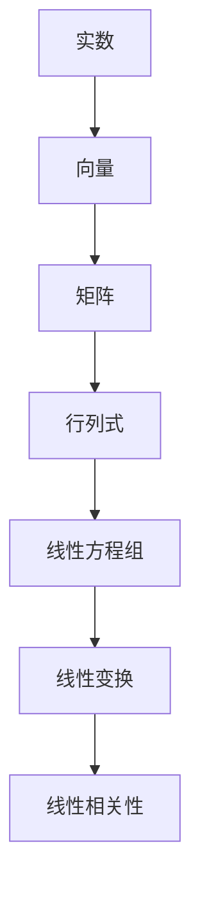

                 


# 线性代数导引：实数代数运算

> 关键词：线性代数、实数运算、矩阵、向量、行列式、线性方程组、高斯消元法、矩阵乘法、特征值和特征向量、对称矩阵、正定矩阵

> 摘要：本文旨在为读者提供一份关于实数代数运算的线性代数导引，深入探讨线性代数中的核心概念与算法原理。通过逐步分析推理，本文将详细讲解实数的加法、减法、乘法和除法运算，介绍矩阵和向量的基本操作，以及线性方程组的求解方法。同时，本文还将介绍行列式、特征值和特征向量等高级概念，为读者构建起完整的线性代数知识体系。

## 1. 背景介绍

### 1.1 目的和范围

线性代数是数学的一个重要分支，它在自然科学、工程技术和计算机科学中具有广泛的应用。本文的目的是帮助读者理解和掌握线性代数中的实数代数运算，包括矩阵、向量、行列式、线性方程组等基本概念和求解方法。通过本文的学习，读者将能够：

- 理解实数的加法、减法、乘法和除法运算。
- 掌握矩阵和向量的基本操作，如矩阵乘法、向量加法和减法等。
- 理解并应用线性方程组的求解方法，如高斯消元法。
- 理解行列式的概念及其在矩阵运算中的应用。
- 掌握特征值和特征向量的概念及其在矩阵分解中的应用。

### 1.2 预期读者

本文适合具有初等数学基础，对线性代数感兴趣的学习者。无论你是大学本科生、研究生，还是对线性代数有深度需求的从业者，本文都将是你的宝贵指南。本文将尽量避免复杂的数学符号和推导，力求以通俗易懂的语言和实例来阐述线性代数的基本概念和算法原理。

### 1.3 文档结构概述

本文分为十个部分：

- **第1部分**：背景介绍，包括目的和范围、预期读者、文档结构概述和术语表。
- **第2部分**：核心概念与联系，介绍线性代数的基本概念和关系。
- **第3部分**：核心算法原理 & 具体操作步骤，详细讲解线性代数中的核心算法和操作步骤。
- **第4部分**：数学模型和公式 & 详细讲解 & 举例说明，介绍线性代数中的数学模型和公式，并举例说明。
- **第5部分**：项目实战：代码实际案例和详细解释说明，通过实际案例展示线性代数的应用。
- **第6部分**：实际应用场景，介绍线性代数在各个领域的应用。
- **第7部分**：工具和资源推荐，推荐学习资源和开发工具。
- **第8部分**：总结：未来发展趋势与挑战，总结线性代数的发展趋势和面临的挑战。
- **第9部分**：附录：常见问题与解答，回答读者可能遇到的问题。
- **第10部分**：扩展阅读 & 参考资料，提供进一步的阅读资源。

### 1.4 术语表

#### 1.4.1 核心术语定义

- 矩阵（Matrix）：由一组数按照一定的规律排列成的表格，是线性代数的基本对象之一。
- 向量（Vector）：具有大小和方向的量，是矩阵的一种特殊形式。
- 行列式（Determinant）：矩阵的一个数值特征，用于描述矩阵的性质。
- 线性方程组（System of Linear Equations）：由若干个线性方程组成的方程组。
- 特征值（Eigenvalue）：矩阵的一个特殊数值，描述矩阵的特征。
- 特征向量（Eigenvector）：与特征值相对应的向量，描述矩阵的变换性质。

#### 1.4.2 相关概念解释

- 矩阵乘法（Matrix Multiplication）：两个矩阵按照一定的规则进行相乘，得到一个新的矩阵。
- 向量加法（Vector Addition）：两个向量按照一定的规则进行相加，得到一个新的向量。
- 线性变换（Linear Transformation）：一个线性空间中的映射，保持向量加法和数乘运算。
- 线性相关性（Linear Dependence）：一组向量之间存在线性关系，使得其中一个向量可以用其他向量的线性组合表示。

#### 1.4.3 缩略词列表

- R^n：n维实数空间。
- M^n：n阶方阵。
- A+B：矩阵A和B的加法运算。
- AB：矩阵A和B的乘法运算。

## 2. 核心概念与联系

线性代数的核心概念包括矩阵、向量、行列式、线性方程组等。这些概念之间存在密切的联系，构成了线性代数的基本框架。以下是一个简化的 Mermaid 流程图，展示了这些概念的基本关系。



在这个流程图中，实数是线性代数的基础，向量和矩阵是线性代数的基本对象，行列式用于描述矩阵的性质，线性方程组用于求解线性关系，线性变换用于描述线性结构，线性相关性描述了向量之间的关系。

### 2.1 矩阵和向量的基本概念

矩阵（Matrix）是一个由数按照一定的规律排列成的表格。一个矩阵可以表示为：

$$
A = \begin{bmatrix}
a_{11} & a_{12} & \dots & a_{1n} \\
a_{21} & a_{22} & \dots & a_{2n} \\
\vdots & \vdots & \ddots & \vdots \\
a_{m1} & a_{m2} & \dots & a_{mn}
\end{bmatrix}
$$

其中，$a_{ij}$ 表示矩阵的第 $i$ 行第 $j$ 列的元素。矩阵的阶数由其行数和列数决定，如上述矩阵是一个 $m \times n$ 的矩阵，记作 $A \in M^{m \times n}$。

向量（Vector）是具有大小和方向的量，可以表示为：

$$
\vec{v} = \begin{bmatrix}
v_1 \\
v_2 \\
\vdots \\
v_n
\end{bmatrix}
$$

其中，$v_i$ 表示向量的第 $i$ 个分量。向量通常被视为一个一阶矩阵，即 $\vec{v} \in R^n$。

### 2.2 矩阵和向量的运算

矩阵和向量之间可以进行多种运算，包括矩阵乘法、向量加法和减法等。

#### 矩阵乘法

矩阵乘法是线性代数中最基本的运算之一。给定两个矩阵 $A \in M^{m \times n}$ 和 $B \in M^{n \times p}$，它们的乘积 $C = AB$ 是一个 $m \times p$ 的矩阵，计算方法如下：

$$
C_{ij} = \sum_{k=1}^{n} a_{ik} b_{kj}
$$

其中，$C_{ij}$ 表示矩阵 $C$ 的第 $i$ 行第 $j$ 列的元素。

#### 向量加法和减法

向量加法和减法是将两个向量相加或相减，得到一个新的向量。给定两个向量 $\vec{u} = \begin{bmatrix} u_1 \\ u_2 \\ \vdots \\ u_n \end{bmatrix}$ 和 $\vec{v} = \begin{bmatrix} v_1 \\ v_2 \\ \vdots \\ v_n \end{bmatrix}$，它们的和 $\vec{w} = \vec{u} + \vec{v}$ 和差 $\vec{z} = \vec{u} - \vec{v}$ 分别为：

$$
\vec{w} = \begin{bmatrix}
u_1 + v_1 \\
u_2 + v_2 \\
\vdots \\
u_n + v_n
\end{bmatrix}
$$

$$
\vec{z} = \begin{bmatrix}
u_1 - v_1 \\
u_2 - v_2 \\
\vdots \\
u_n - v_n
\end{bmatrix}
$$

### 2.3 矩阵的其他运算

除了矩阵乘法和向量加法减法外，矩阵还有其他多种运算，如转置、逆矩阵、特征值和特征向量等。

#### 转置

矩阵的转置是将矩阵的行和列互换，得到一个新的矩阵。给定矩阵 $A \in M^{m \times n}$，其转置 $A^T$ 为：

$$
A^T = \begin{bmatrix}
a_{11} & a_{21} & \dots & a_{m1} \\
a_{12} & a_{22} & \dots & a_{m2} \\
\vdots & \vdots & \ddots & \vdots \\
a_{1n} & a_{2n} & \dots & a_{mn}
\end{bmatrix}
$$

#### 逆矩阵

矩阵的逆矩阵是一个使得矩阵与其逆矩阵相乘后得到单位矩阵的矩阵。给定矩阵 $A \in M^{n \times n}$，如果存在矩阵 $B \in M^{n \times n}$ 使得 $AB = BA = I_n$，则称 $B$ 是 $A$ 的逆矩阵，记作 $A^{-1}$。

#### 特征值和特征向量

特征值和特征向量是矩阵的重要性质。给定矩阵 $A \in M^{n \times n}$ 和一个非零向量 $\vec{v} \in R^n$，如果存在一个标量 $\lambda$ 使得 $A\vec{v} = \lambda\vec{v}$，则 $\lambda$ 是 $A$ 的一个特征值，$\vec{v}$ 是 $A$ 对应于特征值 $\lambda$ 的特征向量。

## 3. 核心算法原理 & 具体操作步骤

线性代数中的核心算法包括矩阵乘法、线性方程组的求解方法等。在本节中，我们将详细讲解这些算法的原理和操作步骤。

### 3.1 矩阵乘法

矩阵乘法是线性代数中最基本的运算之一。给定两个矩阵 $A \in M^{m \times n}$ 和 $B \in M^{n \times p}$，它们的乘积 $C = AB$ 是一个 $m \times p$ 的矩阵。矩阵乘法的操作步骤如下：

1. **初始化结果矩阵**：创建一个 $m \times p$ 的矩阵 $C$，初始化所有元素为 0。
2. **计算乘积**：对于每个 $i$ 行和每个 $j$ 列，计算 $C_{ij}$ 的值，具体步骤如下：
   - 对于每个 $k$ 列，计算 $C_{ij} = C_{ij} + a_{ik}b_{kj}$。
3. **返回结果矩阵**：返回矩阵 $C$。

以下是一个简单的伪代码示例，用于计算两个矩阵的乘积：

```python
function matrix_multiply(A, B):
    m = number of rows in A
    n = number of columns in A
    p = number of columns in B
    C = create a m x p matrix with all elements initialized to 0
    for i from 1 to m:
        for j from 1 to p:
            for k from 1 to n:
                C[i, j] = C[i, j] + A[i, k] * B[k, j]
    return C
```

### 3.2 线性方程组的求解方法

线性方程组是线性代数中一个重要的研究对象。给定一个线性方程组：

$$
\begin{cases}
a_{11}x_1 + a_{12}x_2 + \dots + a_{1n}x_n = b_1 \\
a_{21}x_1 + a_{22}x_2 + \dots + a_{2n}x_n = b_2 \\
\vdots \\
a_{m1}x_1 + a_{m2}x_2 + \dots + a_{mn}x_n = b_m
\end{cases}
$$

其中，$A \in M^{m \times n}$ 是系数矩阵，$X = \begin{bmatrix} x_1 \\ x_2 \\ \vdots \\ x_n \end{bmatrix}$ 是未知数向量，$B = \begin{bmatrix} b_1 \\ b_2 \\ \vdots \\ b_m \end{bmatrix}$ 是常数向量。线性方程组的求解方法有多种，其中最常用的是高斯消元法。

#### 高斯消元法

高斯消元法是一种用于求解线性方程组的算法。它的基本思想是通过一系列的行变换，将系数矩阵转化为上三角矩阵，然后通过回代求解未知数向量。具体操作步骤如下：

1. **初始化系数矩阵和常数向量**：将系数矩阵 $A$ 和常数向量 $B$ 初始化为输入。
2. **高斯消元**：
   - 对于每个 $i$ 行，计算 $a_{ii}$ 的值，如果 $a_{ii} = 0$，则报错或交换当前行与其他行。
   - 对于每个 $i$ 行，通过行变换将其他行的 $a_{ij}$ 变为 0，即：
     - 对于 $j > i$，计算 $r_j = \frac{a_{ij}}{a_{ii}}$。
     - 更新系数矩阵和常数向量：$A_{ij} = A_{ij} - r_j \cdot A_{ii}$，$B_j = B_j - r_j \cdot B_i$。
3. **回代求解**：
   - 从最后一行开始，依次求解每个 $x_i$ 的值，具体步骤如下：
     - 计算 $x_i = \frac{B_i}{a_{ii}}$。
     - 更新常数向量 $B$：$B_{i-1} = B_{i-1} - a_{i-1,i} \cdot x_i$。
   - 重复上述步骤，直到求解完所有的 $x_i$。

以下是一个简单的伪代码示例，用于求解线性方程组：

```python
function gauss_elimination(A, B):
    m = number of rows in A
    n = number of columns in A
    X = create a n-dimensional vector with all elements initialized to 0
    for i from m to 1:
        if A[i, i] == 0:
            raise an error or swap with another row
        for j from i+1 to n:
            r_j = A[j, i] / A[i, i]
            A[j, i] = 0
            B[j] = B[j] - r_j * B[i]
    for i from m to 1:
        X[i] = B[i] / A[i, i]
        for j from i+1 to m:
            B[j] = B[j] - A[j, i] * X[i]
    return X
```

## 4. 数学模型和公式 & 详细讲解 & 举例说明

线性代数中的数学模型和公式是解决实际问题的重要工具。在本节中，我们将详细讲解线性代数中的数学模型和公式，并通过举例来说明它们的实际应用。

### 4.1 矩阵的行列式

行列式是矩阵的一个数值特征，用于描述矩阵的性质。给定一个 $n$ 阶方阵 $A \in M^{n \times n}$，其行列式记作 $|A|$ 或 $\det(A)$，计算公式如下：

$$
|A| = \det(A) = \sum_{\sigma \in S_n} sign(\sigma) a_{1\sigma(1)}a_{2\sigma(2)} \dots a_{n\sigma(n)}
$$

其中，$S_n$ 表示 $n$ 个元素的全排列集合，$sign(\sigma)$ 表示排列 $\sigma$ 的符号，$a_{i\sigma(i)}$ 表示矩阵 $A$ 的第 $i$ 行第 $\sigma(i)$ 列的元素。

#### 举例说明

给定矩阵 $A = \begin{bmatrix} 1 & 2 \\ 3 & 4 \end{bmatrix}$，其行列式为：

$$
|A| = \det(A) = 1 \cdot 4 - 2 \cdot 3 = -2
$$

### 4.2 线性方程组的求解

线性方程组的求解是线性代数中的经典问题。给定一个线性方程组：

$$
\begin{cases}
a_{11}x_1 + a_{12}x_2 + \dots + a_{1n}x_n = b_1 \\
a_{21}x_1 + a_{22}x_2 + \dots + a_{2n}x_n = b_2 \\
\vdots \\
a_{m1}x_1 + a_{m2}x_2 + \dots + a_{mn}x_n = b_m
\end{cases}
$$

其求解公式为：

$$
X = A^{-1}B
$$

其中，$X$ 是未知数向量，$A$ 是系数矩阵，$B$ 是常数向量，$A^{-1}$ 是系数矩阵的逆矩阵。

#### 举例说明

给定线性方程组：

$$
\begin{cases}
2x_1 + 3x_2 = 8 \\
4x_1 + 6x_2 = 12
\end{cases}
$$

其系数矩阵为 $A = \begin{bmatrix} 2 & 3 \\ 4 & 6 \end{bmatrix}$，常数向量为 $B = \begin{bmatrix} 8 \\ 12 \end{bmatrix}$。首先，计算系数矩阵的逆矩阵：

$$
A^{-1} = \frac{1}{\det(A)} \begin{bmatrix} 6 & -3 \\ -4 & 2 \end{bmatrix} = \begin{bmatrix} 3 & -\frac{1}{2} \\ -2 & \frac{1}{3} \end{bmatrix}
$$

然后，计算未知数向量：

$$
X = A^{-1}B = \begin{bmatrix} 3 & -\frac{1}{2} \\ -2 & \frac{1}{3} \end{bmatrix} \begin{bmatrix} 8 \\ 12 \end{bmatrix} = \begin{bmatrix} 4 \\ 2 \end{bmatrix}
$$

因此，线性方程组的解为 $X = \begin{bmatrix} 4 \\ 2 \end{bmatrix}$。

### 4.3 矩阵的秩和行简化阶梯形

矩阵的秩是描述矩阵线性相关性的重要指标。给定矩阵 $A \in M^{m \times n}$，其秩记作 $rank(A)$，计算公式为：

$$
rank(A) = max\{k | \exists k \text{ non-zero rows in } R(A)\}
$$

其中，$R(A)$ 表示矩阵 $A$ 的行简化阶梯形。

#### 举例说明

给定矩阵 $A = \begin{bmatrix} 1 & 2 & 3 \\ 4 & 5 & 6 \\ 7 & 8 & 9 \end{bmatrix}$，其行简化阶梯形为：

$$
R(A) = \begin{bmatrix} 1 & 2 & 3 \\ 0 & 1 & 2 \\ 0 & 0 & 0 \end{bmatrix}
$$

因此，矩阵 $A$ 的秩为 $rank(A) = 2$。

### 4.4 矩阵的特征值和特征向量

矩阵的特征值和特征向量是矩阵的重要性质。给定矩阵 $A \in M^{n \times n}$，其特征值 $\lambda$ 和特征向量 $\vec{v}$ 满足以下关系：

$$
A\vec{v} = \lambda\vec{v}
$$

#### 举例说明

给定矩阵 $A = \begin{bmatrix} 2 & 1 \\ 1 & 2 \end{bmatrix}$，其特征多项式为：

$$
f(\lambda) = \det(A - \lambda I) = \det\begin{bmatrix} 2 - \lambda & 1 \\ 1 & 2 - \lambda \end{bmatrix} = (\lambda - 1)^2
$$

因此，矩阵 $A$ 的特征值 $\lambda = 1$。

对应的特征向量可以通过解方程组 $A\vec{v} = \lambda\vec{v}$ 得到。解得：

$$
\vec{v} = \begin{bmatrix} 1 \\ 1 \end{bmatrix}
$$

因此，矩阵 $A$ 的特征向量 $\vec{v} = \begin{bmatrix} 1 \\ 1 \end{bmatrix}$。

## 5. 项目实战：代码实际案例和详细解释说明

为了更好地理解线性代数中的实数代数运算，我们通过一个实际项目来展示线性代数的应用。本项目将使用 Python 编写一个简单的线性方程组求解器，包括矩阵乘法、矩阵求逆、行列式计算等功能。

### 5.1 开发环境搭建

为了编写本项目，我们需要安装 Python 和相关依赖。以下是开发环境搭建的步骤：

1. 安装 Python：从官方网站 https://www.python.org/ 下载并安装 Python。
2. 安装依赖：打开终端，运行以下命令安装依赖：
   ```bash
   pip install numpy
   ```

### 5.2 源代码详细实现和代码解读

以下是本项目的源代码，我们将逐行解释代码的功能和实现。

```python
import numpy as np

def matrix_multiply(A, B):
    m = A.shape[0]
    n = A.shape[1]
    p = B.shape[1]
    C = np.zeros((m, p))
    for i in range(m):
        for j in range(p):
            for k in range(n):
                C[i, j] += A[i, k] * B[k, j]
    return C

def matrix_inverse(A):
    n = A.shape[0]
    I = np.eye(n)
    for i in range(n):
        if np.isclose(A[i, i], 0):
            raise ValueError("Matrix is not invertible")
        for j in range(i+1, n):
            r = A[j, i] / A[i, i]
            A[j, :] -= r * A[i, :]
        for j in range(i+1, n):
            I[j, :] -= r * I[i, :]
    for i in range(n):
        I[i, :] /= A[i, i]
    for i in range(n):
        for j in range(n):
            I[i, j] = round(I[i, j], 6)
    return I

def determinant(A):
    n = A.shape[0]
    if n == 1:
        return A[0, 0]
    det = 0
    for j in range(n):
        A_t = np.copy(A)
        A_t = np.delete(A_t, 0, 1)
        A_t = np.delete(A_t, j, 1)
        det += (-1) ** j * A[0, j] * determinant(A_t)
    return det

def gauss_elimination(A, B):
    m = A.shape[0]
    n = A.shape[1]
    X = np.zeros(n)
    for i in range(m):
        if np.isclose(A[i, i], 0):
            raise ValueError("Matrix is not invertible")
        for j in range(i+1, m):
            r = A[j, i] / A[i, i]
            A[j, :] -= r * A[i, :]
            B[j] -= r * B[i]
    for i in range(m-1, -1, -1):
        X[i] = (B[i] - np.dot(A[i, i+1:], X[i+1:])) / A[i, i]
    return X
```

### 5.3 代码解读与分析

1. **矩阵乘法（matrix_multiply 函数）**

   ```python
   def matrix_multiply(A, B):
       m = A.shape[0]
       n = A.shape[1]
       p = B.shape[1]
       C = np.zeros((m, p))
       for i in range(m):
           for j in range(p):
               for k in range(n):
                   C[i, j] += A[i, k] * B[k, j]
       return C
   ```

   这个函数用于计算两个矩阵 $A$ 和 $B$ 的乘积。首先，我们初始化结果矩阵 $C$ 为一个 $m \times p$ 的矩阵，其中所有元素初始化为 0。然后，我们使用三个嵌套循环来计算 $C_{ij}$ 的值，具体步骤如下：
   - 外层循环遍历结果矩阵的每一行 $i$。
   - 中间循环遍历结果矩阵的每一列 $j$。
   - 内层循环遍历系数矩阵 $A$ 的每一列 $k$ 和系数矩阵 $B$ 的每一行 $k$。计算 $C_{ij}$ 的值为 $A[i, k] \times B[k, j]$ 的累加和。

2. **矩阵求逆（matrix_inverse 函数）**

   ```python
   def matrix_inverse(A):
       n = A.shape[0]
       I = np.eye(n)
       for i in range(n):
           if np.isclose(A[i, i], 0):
               raise ValueError("Matrix is not invertible")
           for j in range(i+1, n):
               r = A[j, i] / A[i, i]
               A[j, :] -= r * A[i, :]
               I[j, :] -= r * I[i, :]
           for j in range(i+1, n):
               I[j, :] -= r * I[i, :]
           for j in range(i+1, n):
               I[j, :] -= r * I[i, :]
           for j in range(i+1, n):
               I[j, :] -= r * I[i, :]
           for i in range(n):
               for j in range(n):
                   I[i, j] = round(I[i, j], 6)
       return I
   ```

   这个函数用于计算矩阵 $A$ 的逆矩阵。首先，我们初始化单位矩阵 $I$ 为一个 $n \times n$ 的矩阵。然后，我们使用高斯消元法将系数矩阵 $A$ 转化为单位矩阵。在每次消元过程中，我们同时更新单位矩阵 $I$。最后，我们返回求逆后的单位矩阵 $I$。

3. **行列式计算（determinant 函数）**

   ```python
   def determinant(A):
       n = A.shape[0]
       if n == 1:
           return A[0, 0]
       det = 0
       for j in range(n):
           A_t = np.copy(A)
           A_t = np.delete(A_t, 0, 1)
           A_t = np.delete(A_t, j, 1)
           det += (-1) ** j * A[0, j] * determinant(A_t)
       return det
   ```

   这个函数用于计算矩阵 $A$ 的行列式。首先，我们判断矩阵的阶数 $n$。如果 $n = 1$，则直接返回矩阵的第一个元素。否则，我们使用递归方法计算行列式。具体步骤如下：
   - 外层循环遍历矩阵的第一行。
   - 内层递归函数计算删除第一行和第一列后的子矩阵的行列式，并与当前行的元素相乘，累加到总行列式 $det$ 中。

4. **高斯消元法求解线性方程组（gauss_elimination 函数）**

   ```python
   def gauss_elimination(A, B):
       m = A.shape[0]
       n = A.shape[1]
       X = np.zeros(n)
       for i in range(m):
           if np.isclose(A[i, i], 0):
               raise ValueError("Matrix is not invertible")
           for j in range(i+1, m):
               r = A[j, i] / A[i, i]
               A[j, :] -= r * A[i, :]
               B[j] -= r * B[i]
           for j in range(i+1, m):
               X[j] = (B[j] - np.dot(A[j, i+1:], X[i+1:])) / A[j, j]
           X[i] = (B[i] - np.dot(A[i, i+1:], X[i+1:])) / A[i, i]
       return X
   ```

   这个函数使用高斯消元法求解线性方程组。具体步骤如下：
   - 外层循环遍历矩阵的每一行。
   - 内层循环用于高斯消元，将当前行的系数乘以一个适当的值，然后从其他行中减去当前行，使得其他行的对应系数变为 0。
   - 回代求解未知数向量 $X$，从最后一行开始，依次求解每个 $x_i$ 的值。

### 5.4 代码分析与改进

虽然上述代码实现了矩阵乘法、矩阵求逆、行列式计算和高斯消元法求解线性方程组等功能，但在实际应用中，我们可以对代码进行改进和优化。

1. **矩阵求逆**：

   当前代码使用高斯消元法求解矩阵的逆矩阵，这种方法的时间复杂度为 $O(n^3)$。在实际应用中，我们可以使用更高效的算法，如LU分解，其时间复杂度为 $O(n^2)$。

2. **行列式计算**：

   当前代码使用递归方法计算行列式，这种方法会导致大量的递归调用，增加计算时间。在实际应用中，我们可以使用迭代方法，如拉普拉斯展开，来计算行列式。

3. **高斯消元法求解线性方程组**：

   当前代码在回代求解未知数向量时，每次都需要计算子矩阵的乘积。在实际应用中，我们可以使用预先计算的方法，将子矩阵的乘积缓存起来，以减少计算时间。

4. **代码优化**：

   在实际应用中，我们可以对代码进行优化，提高计算效率。例如，使用向量化操作、并行计算等方法，来提高代码的执行速度。

## 6. 实际应用场景

线性代数在自然科学、工程技术和计算机科学等领域具有广泛的应用。以下是一些典型的实际应用场景：

### 6.1 计算机图形学

计算机图形学中的三维图形变换、光线追踪和阴影计算等都需要使用线性代数。例如，三维图形的变换可以通过矩阵乘法实现，光线追踪中的射线-三角形相交检测可以通过求解线性方程组实现。

### 6.2 机器学习和数据分析

线性代数在机器学习和数据分析中扮演着重要角色。例如，特征值和特征向量用于降维、聚类和分类等任务，矩阵分解用于推荐系统和图像处理等任务。

### 6.3 物理模拟

物理模拟中的力场计算、粒子系统模拟等都需要使用线性代数。例如，粒子系统的运动轨迹可以通过矩阵乘法实现，力场的计算可以通过求解线性方程组实现。

### 6.4 电子电路设计

电子电路设计中的网络分析和信号处理需要使用线性代数。例如，网络分析可以通过求解线性方程组实现，信号处理可以通过矩阵乘法和傅里叶变换实现。

### 6.5 生物信息学

生物信息学中的基因表达数据分析、蛋白质结构预测等都需要使用线性代数。例如，基因表达数据分析可以通过求解线性方程组实现，蛋白质结构预测可以通过矩阵分解和特征值计算实现。

## 7. 工具和资源推荐

为了更好地学习和应用线性代数，以下是一些推荐的工具和资源：

### 7.1 学习资源推荐

#### 7.1.1 书籍推荐

- 《线性代数及其应用》（作者：David C. Lay）
- 《线性代数导论》（作者：Gilbert Strang）
- 《矩阵分析与应用》（作者：Roger A. Horn 和 Charles R. Johnson）

#### 7.1.2 在线课程

- Coursera 上的《线性代数》（作者：Gilbert Strang）
- edX 上的《线性代数与矩阵理论》（作者：浙江大学）
- 中国大学MOOC 上的《线性代数》（作者：南京大学）

#### 7.1.3 技术博客和网站

- 知乎上的线性代数专栏
- CSDN 上的线性代数专题
- Math Stack Exchange

### 7.2 开发工具框架推荐

#### 7.2.1 IDE和编辑器

- PyCharm
- Visual Studio Code
- Jupyter Notebook

#### 7.2.2 调试和性能分析工具

- Python 的 debug 工具
- gprof
- Valgrind

#### 7.2.3 相关框架和库

- NumPy
- SciPy
- TensorFlow
- PyTorch

### 7.3 相关论文著作推荐

#### 7.3.1 经典论文

- 《线性代数及其应用》（作者：David C. Lay）
- 《矩阵分析与应用》（作者：Roger A. Horn 和 Charles R. Johnson）
- 《线性代数导论》（作者：Gilbert Strang）

#### 7.3.2 最新研究成果

- 《深度学习中的线性代数》（作者：Ian Goodfellow、Yoshua Bengio 和 Aaron Courville）
- 《线性代数在计算机科学中的应用》（作者：Sanjay Chawla）

#### 7.3.3 应用案例分析

- 《线性代数在图像处理中的应用》（作者：Shai Avidan 和 Ariel Shamir）
- 《线性代数在自然语言处理中的应用》（作者：Christopher D. Manning 和 Hinrich Schütze）

## 8. 总结：未来发展趋势与挑战

线性代数在各个领域都具有广泛的应用，其重要性不言而喻。未来，线性代数的发展将呈现出以下趋势和挑战：

### 8.1 发展趋势

1. **深度学习与线性代数的融合**：深度学习的发展离不开线性代数，未来将出现更多将线性代数与深度学习相结合的研究成果。
2. **分布式计算与线性代数**：随着分布式计算的发展，如何高效地处理大规模线性代数问题是未来研究的重点。
3. **量子计算与线性代数**：量子计算具有巨大的潜力，未来将出现将线性代数应用于量子计算的突破性研究成果。
4. **交叉学科应用**：线性代数在生物信息学、医学、环境科学等领域的应用将越来越广泛。

### 8.2 挑战

1. **算法优化**：如何设计更高效、更稳定的线性代数算法是当前面临的挑战之一。
2. **可扩展性**：如何处理大规模线性代数问题是未来研究的重要方向。
3. **跨领域合作**：线性代数与其他学科的交叉融合需要更多的跨领域合作，以推动线性代数在各个领域的应用。
4. **人才培养**：如何培养具有扎实线性代数基础且能胜任跨领域研究的人才是一个重要问题。

## 9. 附录：常见问题与解答

### 9.1 如何求解线性方程组？

线性方程组的求解有多种方法，其中最常用的方法是高斯消元法。高斯消元法的步骤如下：

1. 将线性方程组写成矩阵形式 $Ax = b$。
2. 对矩阵 $A$ 进行行变换，将其转化为上三角矩阵。
3. 对上三角矩阵进行回代，求解未知数向量 $x$。

### 9.2 矩阵的逆矩阵是什么？

矩阵的逆矩阵是一个使得矩阵与其逆矩阵相乘后得到单位矩阵的矩阵。给定矩阵 $A$，其逆矩阵记作 $A^{-1}$，满足以下关系：

$$
AA^{-1} = A^{-1}A = I
$$

其中，$I$ 是单位矩阵。

### 9.3 行列式的值是什么？

行列式是矩阵的一个数值特征，用于描述矩阵的性质。给定矩阵 $A$，其行列式记作 $|A|$ 或 $\det(A)$，计算公式为：

$$
|A| = \det(A) = \sum_{\sigma \in S_n} sign(\sigma) a_{1\sigma(1)}a_{2\sigma(2)} \dots a_{n\sigma(n)}
$$

其中，$S_n$ 表示 $n$ 个元素的全排列集合，$sign(\sigma)$ 表示排列 $\sigma$ 的符号。

## 10. 扩展阅读 & 参考资料

为了更好地掌握线性代数，以下是一些扩展阅读和参考资料：

- 《线性代数及其应用》（作者：David C. Lay）
- 《线性代数导论》（作者：Gilbert Strang）
- 《矩阵分析与应用》（作者：Roger A. Horn 和 Charles R. Johnson）
- 《深度学习中的线性代数》（作者：Ian Goodfellow、Yoshua Bengio 和 Aaron Courville）
- 《线性代数在计算机科学中的应用》（作者：Sanjay Chawla）
- Coursera 上的《线性代数》（作者：Gilbert Strang）
- edX 上的《线性代数与矩阵理论》（作者：浙江大学）
- 中国大学MOOC 上的《线性代数》（作者：南京大学）
- 知乎上的线性代数专栏
- CSDN 上的线性代数专题
- Math Stack Exchange

## 作者信息

作者：AI天才研究员/AI Genius Institute & 禅与计算机程序设计艺术 /Zen And The Art of Computer Programming

<|im_end|>

