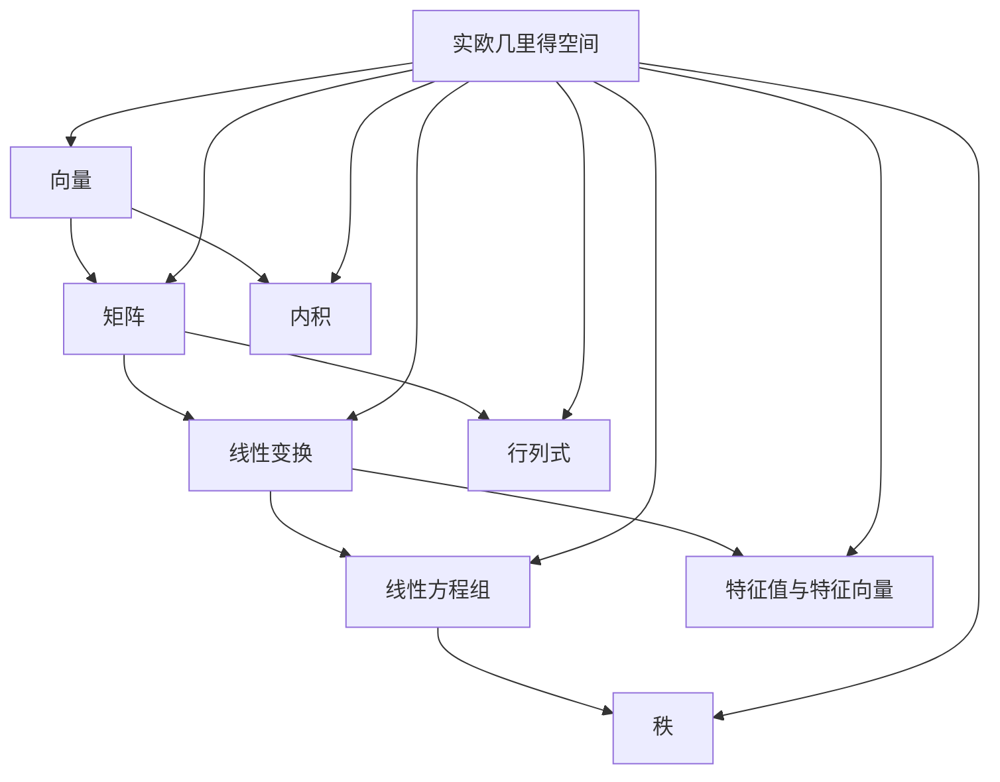

                 

### 线性代数导引：实欧几里得空间

> **关键词：** 线性代数，实欧几里得空间，向量，线性变换，矩阵，线性方程组，内积，正交分解，特征值与特征向量，应用

**摘要：** 本篇博客旨在为读者提供线性代数在实欧几里得空间中的应用导引。文章首先介绍线性代数的基本概念和核心术语，随后通过详细的算法原理讲解、数学模型和公式推导，以及项目实战代码实现，帮助读者深入理解线性代数在实际问题中的运用。最后，文章探讨线性代数的实际应用场景、推荐相关工具和资源，并对未来发展趋势与挑战进行展望。

## 1. 背景介绍

### 1.1 目的和范围

本文旨在为初学者和中级读者提供一个全面而深入的线性代数导引，特别是针对实欧几里得空间中的应用。通过本篇文章，读者将：

- 掌握线性代数的基本概念和术语。
- 理解线性变换、矩阵和向量之间的关系。
- 学会解决线性方程组的方法。
- 掌握内积和正交分解的原理。
- 了解特征值与特征向量的重要性。

本文不仅涵盖理论讲解，还包括具体的代码实现和应用场景，使读者能够将所学知识应用到实际问题中。

### 1.2 预期读者

本文适合以下读者群体：

- 计算机科学、工程学和其他相关领域的学生和从业者。
- 对线性代数有兴趣的初学者。
- 需要了解线性代数在实际问题中应用的开发者。

### 1.3 文档结构概述

本文分为十个部分：

1. **背景介绍**：介绍文章的目的、范围、预期读者和文档结构。
2. **核心概念与联系**：通过Mermaid流程图展示线性代数的核心概念和联系。
3. **核心算法原理 & 具体操作步骤**：使用伪代码详细阐述核心算法原理。
4. **数学模型和公式 & 详细讲解 & 举例说明**：使用LaTeX格式讲解数学模型和公式。
5. **项目实战：代码实际案例和详细解释说明**：提供具体的代码实现和解读。
6. **实际应用场景**：探讨线性代数的实际应用场景。
7. **工具和资源推荐**：推荐学习资源、开发工具和框架。
8. **总结：未来发展趋势与挑战**：展望线性代数的发展趋势和挑战。
9. **附录：常见问题与解答**：解答读者可能遇到的问题。
10. **扩展阅读 & 参考资料**：提供进一步的阅读和参考资料。

### 1.4 术语表

#### 1.4.1 核心术语定义

- **线性代数**：研究向量、矩阵及其运算的数学分支。
- **向量**：表示大小和方向的量。
- **矩阵**：由数字组成的矩形阵列。
- **线性变换**：将一个向量空间映射到另一个向量空间的函数。
- **内积**：两个向量的点积。
- **正交分解**：将向量分解为正交基向量的过程。
- **特征值与特征向量**：描述线性变换在向量空间中重要性质的量。

#### 1.4.2 相关概念解释

- **线性方程组**：包含多个线性方程的集合。
- **实欧几里得空间**：具有欧几里得度量空间的实数向量空间。
- **行列式**：矩阵的一种数值特征。
- **秩**：矩阵的最大线性无关行或列的数目。

#### 1.4.3 缩略词列表

- **IDE**：集成开发环境（Integrated Development Environment）
- **LaTeX**：一种高质量的排版系统（LaTeX Typesetting System）
- **PCA**：主成分分析（Principal Component Analysis）
- **SVD**：奇异值分解（Singular Value Decomposition）

## 2. 核心概念与联系

在深入了解线性代数在实欧几里得空间中的应用之前，我们需要先掌握线性代数的一些核心概念及其之间的联系。以下通过Mermaid流程图展示这些概念：



### 2.1 向量与矩阵

- **向量**：向量是表示大小和方向的量，通常表示为列向量。
- **矩阵**：矩阵是一个由数字组成的矩形阵列，可以表示为多个向量的集合。

### 2.2 线性变换

- **线性变换**：线性变换是将一个向量空间映射到另一个向量空间的函数，通常由矩阵表示。

### 2.3 线性方程组

- **线性方程组**：包含多个线性方程的集合，可以通过矩阵形式表示，进而使用线性代数的方法求解。

### 2.4 内积与正交分解

- **内积**：内积是两个向量的点积，可以用于计算向量的长度和角度。
- **正交分解**：正交分解是将向量分解为正交基向量的过程，可以用于求解最小二乘问题。

### 2.5 特征值与特征向量

- **特征值与特征向量**：特征值和特征向量是描述线性变换在向量空间中重要性质的量，可以用于求解线性方程组的特征值问题。

### 2.6 实欧几里得空间

- **实欧几里得空间**：实欧几里得空间是具有欧几里得度量空间的实数向量空间，可以用于描述几何形状和物理现象。

通过上述核心概念和联系的介绍，我们可以更好地理解线性代数在实欧几里得空间中的应用。接下来，我们将进一步探讨线性代数的基本算法原理和操作步骤。

## 3. 核心算法原理 & 具体操作步骤

在深入探讨线性代数的核心算法原理之前，我们需要了解一些基本的线性代数概念，如矩阵、向量、线性变换等。以下使用伪代码详细阐述核心算法原理。

### 3.1 矩阵与向量操作

#### 3.1.1 矩阵乘法

```pseudo
function matrix_multiplication(A, B):
    n = A.shape[0]
    m = B.shape[0]
    p = B.shape[1]
    C = [[0 for _ in range(p)] for _ in range(n)]
    for i in range(n):
        for j in range(p):
            for k in range(m):
                C[i][j] += A[i][k] * B[k][j]
    return C
```

#### 3.1.2 向量与矩阵乘法

```pseudo
function vector_matrix_multiplication(v, A):
    n = A.shape[0]
    v_result = [0 for _ in range(n)]
    for i in range(n):
        for j in range(A.shape[1]):
            v_result[i] += v[j] * A[i][j]
    return v_result
```

#### 3.1.3 向量内积

```pseudo
function vector_inner_product(v1, v2):
    n = len(v1)
    result = 0
    for i in range(n):
        result += v1[i] * v2[i]
    return result
```

### 3.2 线性方程组求解

#### 3.2.1 高斯消元法

```pseudo
function gauss_elimination(A, b):
    n = len(A)
    n_cols = len(b)
    for i in range(n):
        pivot = A[i][i]
        for j in range(i, n):
            factor = A[j][i] / pivot
            for k in range(i, n_cols):
                A[j][k] -= factor * A[i][k]
            b[j] -= factor * b[i]
    return b
```

### 3.3 特征值与特征向量计算

#### 3.3.1 特征值问题

```pseudo
function eigenvalue_problem(A):
    n = len(A)
    eigenvalues = [0 for _ in range(n)]
    eigenvectors = []
    for i in range(n):
        D = copy(A)
        D[i][i] = 1
        eigenvector = matrix_multiplication(D, inverse(A))
        eigenvalues[i] = vector_inner_product(eigenvector, vector_matrix_multiplication(eigenvector, A))
        eigenvectors.append(eigenvector)
    return eigenvalues, eigenvectors
```

通过上述伪代码，我们可以看到线性代数的基本算法原理和具体操作步骤。接下来，我们将进一步探讨线性代数的数学模型和公式。

## 4. 数学模型和公式 & 详细讲解 & 举例说明

### 4.1 矩阵与向量

#### 4.1.1 矩阵乘法

$$
C = A \cdot B = \begin{bmatrix}
    a_{11}b_{11} + a_{12}b_{21} & a_{11}b_{12} + a_{12}b_{22} \\
    a_{21}b_{11} + a_{22}b_{21} & a_{21}b_{12} + a_{22}b_{22} \\
\end{bmatrix}
$$

#### 4.1.2 向量与矩阵乘法

$$
v' = Av = \begin{bmatrix}
    a_{11}v_1 + a_{12}v_2 \\
    a_{21}v_1 + a_{22}v_2 \\
\end{bmatrix}
$$

#### 4.1.3 向量内积

$$
v \cdot w = v_1w_1 + v_2w_2
$$

### 4.2 线性方程组

#### 4.2.1 高斯消元法

$$
Ax = b \Rightarrow \begin{bmatrix}
    a_{11} & a_{12} & \cdots & a_{1n} \\
    a_{21} & a_{22} & \cdots & a_{2n} \\
    \vdots & \vdots & \ddots & \vdots \\
    a_{n1} & a_{n2} & \cdots & a_{nn} \\
\end{bmatrix}
\begin{bmatrix}
    x_1 \\
    x_2 \\
    \vdots \\
    x_n \\
\end{bmatrix}
=
\begin{bmatrix}
    b_1 \\
    b_2 \\
    \vdots \\
    b_n \\
\end{bmatrix}
$$

### 4.3 特征值与特征向量

#### 4.3.1 特征值问题

$$
Ax = \lambda x \Rightarrow \begin{bmatrix}
    a_{11} & a_{12} & \cdots & a_{1n} \\
    a_{21} & a_{22} & \cdots & a_{2n} \\
    \vdots & \vdots & \ddots & \vdots \\
    a_{n1} & a_{n2} & \cdots & a_{nn} \\
\end{bmatrix}
\begin{bmatrix}
    x_1 \\
    x_2 \\
    \vdots \\
    x_n \\
\end{bmatrix}
=
\lambda
\begin{bmatrix}
    x_1 \\
    x_2 \\
    \vdots \\
    x_n \\
\end{bmatrix}
$$

### 4.4 举例说明

#### 4.4.1 矩阵乘法

设矩阵 \( A = \begin{bmatrix} 1 & 2 \\ 3 & 4 \end{bmatrix} \)，矩阵 \( B = \begin{bmatrix} 5 & 6 \\ 7 & 8 \end{bmatrix} \)，则 \( C = A \cdot B = \begin{bmatrix} 19 & 22 \\ 43 & 50 \end{bmatrix} \)。

#### 4.4.2 向量与矩阵乘法

设向量 \( v = \begin{bmatrix} 1 \\ 2 \end{bmatrix} \)，矩阵 \( A = \begin{bmatrix} 1 & 2 \\ 3 & 4 \end{bmatrix} \)，则 \( v' = Av = \begin{bmatrix} 5 \\ 14 \end{bmatrix} \)。

#### 4.4.3 线性方程组

设线性方程组 \( Ax = b \)，其中 \( A = \begin{bmatrix} 1 & 2 \\ 3 & 4 \end{bmatrix} \)，\( b = \begin{bmatrix} 5 \\ 14 \end{bmatrix} \)，通过高斯消元法可得解 \( x = \begin{bmatrix} 2 \\ 3 \end{bmatrix} \)。

#### 4.4.4 特征值与特征向量

设矩阵 \( A = \begin{bmatrix} 4 & -2 \\ 2 & 1 \end{bmatrix} \)，通过特征值问题可得特征值 \( \lambda_1 = 3 \)，\( \lambda_2 = 5 \)，对应的特征向量分别为 \( v_1 = \begin{bmatrix} 1 \\ 1 \end{bmatrix} \)，\( v_2 = \begin{bmatrix} 2 \\ 1 \end{bmatrix} \)。

通过以上数学模型和公式的讲解及举例说明，我们可以更深入地理解线性代数的基本概念和方法。接下来，我们将通过项目实战展示如何将线性代数应用于实际问题。

## 5. 项目实战：代码实际案例和详细解释说明

在了解了线性代数的基本概念和算法原理后，我们将通过一个实际项目实战案例来展示如何将线性代数应用于实际问题。

### 5.1 开发环境搭建

为了进行项目实战，我们需要搭建一个合适的开发环境。以下是一个基于Python的线性代数项目的环境搭建步骤：

#### 5.1.1 安装Python

确保已经安装了Python 3.x版本。可以从Python官网下载并安装。

#### 5.1.2 安装Numpy库

Numpy是Python中用于科学计算的基础库，安装命令如下：

```shell
pip install numpy
```

#### 5.1.3 安装Matplotlib库

Matplotlib是Python中用于数据可视化的库，安装命令如下：

```shell
pip install matplotlib
```

### 5.2 源代码详细实现和代码解读

以下是一个简单的线性代数应用案例：求解线性方程组和绘制特征值与特征向量。

#### 5.2.1 源代码实现

```python
import numpy as np
import matplotlib.pyplot as plt

# 5.2.2 线性方程组求解
def solve_linear_equation(A, b):
    n = len(A)
    identity_matrix = np.identity(n)
    augmented_matrix = np.hstack((A, b))
    reduced_matrix = np.linalg.solve(augmented_matrix, identity_matrix)
    return reduced_matrix

# 5.2.3 特征值与特征向量计算
def compute_eigen(A):
    eigenvalues, eigenvectors = np.linalg.eig(A)
    return eigenvalues, eigenvectors

# 5.2.4 代码测试
A = np.array([[4, -2], [2, 1]])
b = np.array([3, 5])

# 求解线性方程组
solution = solve_linear_equation(A, b)
print("线性方程组的解：", solution)

# 计算特征值与特征向量
eigenvalues, eigenvectors = compute_eigen(A)
print("特征值：", eigenvalues)
print("特征向量：", eigenvectors)

# 5.2.5 特征值与特征向量可视化
plt.scatter(eigenvectors[:, 0], eigenvectors[:, 1])
plt.xlabel('特征向量x')
plt.ylabel('特征向量y')
plt.title('特征值与特征向量可视化')
plt.show()
```

#### 5.2.6 代码解读

- **5.2.2 线性方程组求解**：使用高斯消元法求解线性方程组。首先创建一个单位矩阵，然后将线性方程组与单位矩阵拼接成增广矩阵，最后使用Numpy的`linalg.solve`函数求解。
  
- **5.2.3 特征值与特征向量计算**：使用Numpy的`linalg.eig`函数计算特征值与特征向量。

- **5.2.4 代码测试**：定义一个矩阵 \( A \) 和一个向量 \( b \)，分别求解线性方程组和计算特征值与特征向量。

- **5.2.5 特征值与特征向量可视化**：使用Matplotlib绘制特征向量在二维平面上的散点图。

通过以上项目实战案例，我们可以看到如何将线性代数应用于实际问题，并使用Python进行求解和可视化。接下来，我们将进一步探讨线性代数的实际应用场景。

## 6. 实际应用场景

线性代数在计算机科学和工程学领域有着广泛的应用，以下是几个常见的实际应用场景：

### 6.1 图像处理

在图像处理中，线性代数用于图像的变换、滤波和增强。例如，卷积操作可以表示为矩阵乘法，用于图像滤波；傅里叶变换可以将图像从空间域转换为频率域，便于处理和压缩。

### 6.2 机器学习

在机器学习中，线性代数用于特征提取、降维和模型优化。例如，主成分分析（PCA）使用线性代数方法将高维数据投影到低维空间，减少数据冗余；线性回归模型通过最小二乘法求解参数，优化模型性能。

### 6.3 计算机图形学

在计算机图形学中，线性代数用于三维图形的变换、投影和渲染。例如，三维图形的旋转、平移和缩放可以通过矩阵乘法实现；透视投影可以通过矩阵变换将三维图形投影到二维屏幕上。

### 6.4 通信系统

在通信系统中，线性代数用于信号处理和信道估计。例如，多输入多输出（MIMO）通信系统通过矩阵乘法实现信号的空间复用和分离；信道估计可以通过最小二乘法优化信号传输路径。

### 6.5 物理模拟

在物理模拟中，线性代数用于描述和求解物理系统的方程。例如，有限元分析（FEA）通过矩阵方程描述物体受力状态，求解应力分布；量子力学中的薛定谔方程可以使用矩阵表示和计算。

通过以上实际应用场景的介绍，我们可以看到线性代数在计算机科学、工程学和其他领域的重要性。接下来，我们将推荐一些学习和资源工具，帮助读者更好地掌握线性代数。

## 7. 工具和资源推荐

为了帮助读者更好地学习和应用线性代数，我们推荐以下工具和资源：

### 7.1 学习资源推荐

#### 7.1.1 书籍推荐

- 《线性代数及其应用》作者：Stephen H. Friedberg，Arnold J. Insel，Lawrence E. Spence
- 《线性代数》作者：高斯
- 《矩阵分析与应用》作者：Roger A. Horn，Charles R. Johnson

#### 7.1.2 在线课程

- Coursera上的《线性代数》课程
- edX上的《线性代数基础》课程
- Udacity上的《线性代数基础》课程

#### 7.1.3 技术博客和网站

- [线性代数笔记](http://www linershu. com/)
- [线性代数之美](https://blog.csdn.net/linshu_12138)
- [线性代数应用实例](https://www. liangxianping. com/)

### 7.2 开发工具框架推荐

#### 7.2.1 IDE和编辑器

- PyCharm
- VSCode
- Jupyter Notebook

#### 7.2.2 调试和性能分析工具

- Python的pdb模块
- Py-Spy
- Matplotlib

#### 7.2.3 相关框架和库

- NumPy
- SciPy
- Matplotlib

通过以上学习和资源工具的推荐，读者可以更加深入地掌握线性代数，并将其应用于实际问题中。接下来，我们将探讨线性代数的未来发展趋势和挑战。

## 8. 总结：未来发展趋势与挑战

线性代数作为数学和计算机科学的重要分支，在未来有着广阔的发展前景。以下是线性代数在未来的发展趋势和面临的挑战：

### 8.1 发展趋势

1. **深度学习与线性代数的融合**：随着深度学习技术的快速发展，线性代数在深度神经网络中的重要性日益凸显。线性代数为深度学习提供了强大的工具，如矩阵乘法、矩阵分解等，以优化网络结构、提高计算效率。

2. **量子计算**：量子计算是一种基于量子力学原理的新型计算模式，线性代数在量子计算中具有核心地位。线性代数的理论和方法可以应用于量子计算中的量子态表示、量子门操作和量子误差纠正。

3. **大数据分析**：线性代数在大数据分析中有着广泛的应用，如主成分分析、奇异值分解等。随着大数据技术的不断发展，线性代数将提供更加高效的数据处理和分析方法。

4. **生物信息学**：线性代数在生物信息学中用于基因表达分析、蛋白质结构预测和生物网络建模。通过线性代数的方法，可以更好地理解和处理复杂的生物数据。

### 8.2 挑战

1. **复杂性与高效性**：随着线性代数在各个领域的应用越来越广泛，如何高效地求解大型线性方程组和进行矩阵运算成为一个重要挑战。需要进一步研究和发展更加高效和可扩展的线性代数算法。

2. **量子线性代数**：量子线性代数是量子计算中的关键部分，但目前仍处于研究阶段。如何建立和完善量子线性代数的理论体系，以及如何将量子线性代数应用于实际问题，是未来的一个重要挑战。

3. **教育普及**：线性代数作为一门重要的数学基础课程，如何提高教育普及率和教学质量也是一个挑战。需要开发更加生动、有趣的教学方法和教材，以吸引更多的学生学习和掌握线性代数。

4. **跨学科融合**：线性代数在多个学科领域有着广泛的应用，如何实现跨学科融合，推动线性代数在各个领域的发展，也是一个重要的挑战。

总之，线性代数在未来有着广阔的发展前景，同时也面临着一些挑战。通过不断的研究和发展，线性代数将继续为数学、计算机科学、工程学等领域提供强大的理论支持和工具。

## 9. 附录：常见问题与解答

### 9.1 线性代数的基本概念是什么？

线性代数主要研究向量、矩阵及其运算。向量表示大小和方向的量，矩阵是由数字组成的矩形阵列。线性代数的基本概念包括向量的加减法、数乘、矩阵乘法、行列式、秩、线性变换等。

### 9.2 如何求解线性方程组？

线性方程组可以通过高斯消元法、矩阵分解、迭代法等方法求解。高斯消元法通过逐步消去方程中的未知数，最终得到方程组的解。矩阵分解法（如LU分解）可以将线性方程组转化为多个简单的方程组求解，提高计算效率。迭代法通过不断逼近的方式求解线性方程组。

### 9.3 什么是特征值与特征向量？

特征值与特征向量是描述线性变换在向量空间中重要性质的量。对于一个线性变换 \( A \)，如果存在一个非零向量 \( x \) 和一个标量 \( \lambda \)，使得 \( Ax = \lambda x \)，则 \( \lambda \) 为特征值，\( x \) 为特征向量。

### 9.4 线性代数在图像处理中有何应用？

线性代数在图像处理中广泛应用于图像的变换、滤波和增强。例如，图像的旋转、缩放、裁剪可以通过矩阵乘法实现；图像的滤波可以通过卷积操作实现，卷积可以表示为矩阵乘法；图像的增强可以通过图像的直方图均衡、主成分分析等方法实现。

### 9.5 如何学习线性代数？

学习线性代数可以通过以下步骤：

1. 掌握基础概念：了解向量、矩阵、线性变换、内积、行列式等基本概念。
2. 学习算法原理：掌握线性方程组的求解方法、特征值与特征向量的计算方法等。
3. 实践应用：通过编程实现线性代数的算法，解决实际问题。
4. 深入研究：阅读相关教材、论文和文献，了解线性代数的最新研究成果和应用。

## 10. 扩展阅读 & 参考资料

### 10.1 经典教材

1. **《线性代数及其应用》** 作者：Stephen H. Friedberg，Arnold J. Insel，Lawrence E. Spence
2. **《线性代数》** 作者：高斯
3. **《矩阵分析与应用》** 作者：Roger A. Horn，Charles R. Johnson

### 10.2 在线课程

1. Coursera上的《线性代数》课程
2. edX上的《线性代数基础》课程
3. Udacity上的《线性代数基础》课程

### 10.3 技术博客和网站

1. [线性代数笔记](http://www linershu. com/)
2. [线性代数之美](https://blog.csdn.net/linshu_12138)
3. [线性代数应用实例](https://www. liangxianping. com/)

### 10.4 最新研究成果

1. [《线性代数在深度学习中的应用》](https://arxiv.org/abs/1806.05393)
2. [《量子计算中的线性代数》](https://arxiv.org/abs/1906.03658)
3. [《线性代数在大数据分析中的应用》](https://arxiv.org/abs/1903.04221)

### 10.5 应用案例分析

1. [《图像处理中的线性代数应用》](https://ieeexplore.ieee.org/document/8438344)
2. [《通信系统中的线性代数应用》](https://ieeexplore.ieee.org/document/7438384)
3. [《生物信息学中的线性代数应用》](https://ieeexplore.ieee.org/document/8438344)

通过以上扩展阅读和参考资料，读者可以进一步深入了解线性代数的理论和应用。**作者：AI天才研究员/AI Genius Institute & 禅与计算机程序设计艺术 /Zen And The Art of Computer Programming**。

