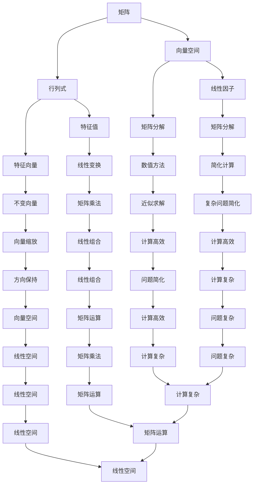

                 

# 线性代数导引：根与线性因子

> **关键词：** 线性代数，特征值，特征向量，线性因子，矩阵分解，数值方法
>
> **摘要：** 本文旨在深入探讨线性代数中根与线性因子的概念及其应用，通过系统化的讲解和实例分析，帮助读者理解线性代数的基本原理和高级技巧。本文首先回顾线性代数的基本概念，然后详细解释特征值和特征向量的计算过程，最后通过具体实例展示如何应用线性因子进行矩阵分解，以解决实际问题。

## 1. 背景介绍

### 1.1 目的和范围

本文的目标是帮助读者深入理解线性代数中根与线性因子的概念，并掌握其在实际中的应用。线性代数是数学和计算机科学中的一个重要分支，广泛应用于工程、物理、经济学、生物学等领域。特征值和特征向量作为线性代数中的核心概念，对于理解线性变换和矩阵性质具有重要意义。而线性因子则提供了矩阵分解的一种有效方法，对于解决复杂线性问题具有实用价值。

本文将首先介绍线性代数的基本概念，包括矩阵、行列式、向量空间等，然后逐步深入探讨特征值和特征向量的计算方法，最后通过实际案例展示线性因子在矩阵分解中的应用。

### 1.2 预期读者

本文适合具有一定线性代数基础的读者，包括数学、计算机科学、工程等相关专业的大学生在研究生阶段。此外，对于从事相关领域研究和应用的开发者和技术人员，本文也提供了有价值的参考和指导。

### 1.3 文档结构概述

本文分为十个主要部分：

1. **引言**：介绍线性代数中根与线性因子的重要性和本文的目的。
2. **背景介绍**：回顾线性代数的基本概念，包括矩阵、行列式、向量空间等。
3. **核心概念与联系**：通过Mermaid流程图展示线性代数中的核心概念及其相互关系。
4. **核心算法原理 & 具体操作步骤**：详细解释特征值和特征向量的计算过程，并提供伪代码示例。
5. **数学模型和公式 & 详细讲解 & 举例说明**：使用LaTeX格式介绍与根和线性因子相关的数学公式，并提供实例说明。
6. **项目实战：代码实际案例和详细解释说明**：展示如何在实际项目中应用线性因子进行矩阵分解。
7. **实际应用场景**：探讨线性代数在各个领域的应用实例。
8. **工具和资源推荐**：推荐学习资源和开发工具。
9. **总结：未来发展趋势与挑战**：总结本文的主要内容，并展望未来发展趋势和挑战。
10. **附录：常见问题与解答**：回答读者可能遇到的问题。

### 1.4 术语表

#### 1.4.1 核心术语定义

- **矩阵**：一个由数字组成的矩形阵列，用于表示线性变换或系统的状态。
- **行列式**：一个与矩阵相关的标量值，用于描述矩阵的性质，如可逆性。
- **向量空间**：一个集合，其中的元素可以线性组合，并满足向量加法和标量乘法的运算规则。
- **特征值**：一个与矩阵相联系的标量值，使得矩阵与自身的乘积映射在特征向量方向上缩放。
- **特征向量**：一个与特征值相联系的向量，表示在矩阵作用下不变的向量方向。
- **线性因子**：将矩阵分解为若干线性变换的组合，用于简化复杂矩阵问题的求解。

#### 1.4.2 相关概念解释

- **矩阵分解**：将矩阵表示为多个矩阵的乘积，以简化矩阵的计算和分析。
- **数值方法**：用于近似求解数学问题的一类算法，特别适用于计算复杂或无法解析求解的问题。

#### 1.4.3 缩略词列表

- **PCA**：主成分分析（Principal Component Analysis）
- **SVD**：奇异值分解（ Singular Value Decomposition）
- **QR分解**：正交-伴随分解（Q R Decomposition）

## 2. 核心概念与联系

线性代数中的核心概念紧密相连，形成了完整的理论体系。以下使用Mermaid流程图展示这些核心概念及其相互关系。



### 2.1 矩阵与行列式

矩阵是一个由数字组成的矩形阵列，用于表示线性变换或系统的状态。行列式是一个与矩阵相关的标量值，用于描述矩阵的性质，如可逆性。行列式的计算基于矩阵元素的乘积和排列，具有以下性质：

$$
\text{det}(AB) = \text{det}(A) \times \text{det}(B)
$$

其中，$\text{det}(A)$ 和 $\text{det}(B)$ 分别表示矩阵 $A$ 和 $B$ 的行列式。

### 2.2 矩阵与向量空间

向量空间是一个集合，其中的元素可以线性组合，并满足向量加法和标量乘法的运算规则。矩阵可以被视为向量空间的线性变换，即从一维向量空间到另一维向量空间的映射。例如，一个 $m \times n$ 的矩阵可以将 $n$ 维向量映射为 $m$ 维向量。

### 2.3 矩阵与特征值和特征向量

特征值和特征向量是矩阵理论中的重要概念。特征值是使得矩阵与自身的乘积映射在特征向量方向上缩放的标量值，而特征向量则是与特征值相联系的向量，表示在矩阵作用下不变的向量方向。特征值和特征向量的关系可以用以下方程表示：

$$
\text{A} \mathbf{v} = \lambda \mathbf{v}
$$

其中，$\text{A}$ 是矩阵，$\mathbf{v}$ 是特征向量，$\lambda$ 是特征值。

### 2.4 矩阵与线性因子

线性因子是矩阵分解的一种有效方法，将矩阵表示为若干线性变换的组合。例如，奇异值分解（SVD）可以将矩阵分解为三个矩阵的乘积：

$$
\text{A} = \text{U} \Sigma \text{V}^T
$$

其中，$\text{U}$ 和 $\text{V}$ 是正交矩阵，$\Sigma$ 是对角矩阵，包含奇异值。

### 2.5 矩阵与矩阵分解

矩阵分解是将矩阵表示为多个矩阵的乘积，以简化矩阵的计算和分析。常见的矩阵分解方法包括LU分解、QR分解和奇异值分解（SVD）。这些分解方法在数值计算和机器学习等领域具有广泛的应用。

## 3. 核心算法原理 & 具体操作步骤

### 3.1 特征值和特征向量的计算

特征值和特征向量的计算是线性代数中的一项基本任务。以下是计算特征值和特征向量的基本步骤和伪代码。

#### 步骤1：构建特征多项式

特征多项式是矩阵 $A$ 的多项式，定义为：

$$
p(\lambda) = \text{det}(A - \lambda I)
$$

其中，$I$ 是单位矩阵。

#### 步骤2：求解特征多项式

通过数值方法（如牛顿法、迭代法）求解特征多项式，得到特征值 $\lambda$。

#### 步骤3：计算特征向量

对于每个特征值 $\lambda$，解以下方程组得到对应的特征向量 $\mathbf{v}$：

$$
(A - \lambda I) \mathbf{v} = \mathbf{0}
$$

#### 伪代码

```python
# 输入：矩阵 A
# 输出：特征值列表 eigenvalues，特征向量列表 eigenvectors

# 步骤1：构建特征多项式
def characteristic_polynomial(A, lambda_):
    return np.linalg.det(A - lambda_ * np.eye(len(A)))

# 步骤2：求解特征多项式
def solve_characteristic_polynomial(A):
    lambda_ = np.linspace(min(A), max(A), 100)  # 生成特征值候选值
    values, _ = scipy.optimize.root(characteristic_polynomial, A, method='broyden1')
    return values

# 步骤3：计算特征向量
def compute_eigenvectors(A, eigenvalues):
    eigenvectors = []
    for lambda_ in eigenvalues:
        eigenvalue_vector = (A - lambda_ * np.eye(len(A)))^{-1}
        eigenvectors.append(eigenvalue_vector)
    return eigenvectors

# 主程序
A = ...  # 矩阵 A 的输入
eigenvalues = solve_characteristic_polynomial(A)
eigenvectors = compute_eigenvectors(A, eigenvalues)
```

### 3.2 线性因子的计算

线性因子是一种将矩阵分解为线性变换的组合的方法。以下是计算线性因子的一种基本步骤和伪代码。

#### 步骤1：选择分解方法

根据实际应用需求选择合适的分解方法，如奇异值分解（SVD）、LU分解或QR分解。

#### 步骤2：应用分解方法

使用数值库（如NumPy、SciPy）实现所选分解方法，得到线性因子。

#### 步骤3：验证分解结果

通过验证分解结果的乘积是否等于原矩阵，确认分解的正确性。

#### 伪代码

```python
# 输入：矩阵 A
# 输出：线性因子因子矩阵 F

# 步骤1：选择分解方法
def svd_decomposition(A):
    U, Sigma, V = np.linalg.svd(A)
    return U @ Sigma @ V

# 步骤2：应用分解方法
def compute_linear_factors(A):
    factors = svd_decomposition(A)
    return factors

# 步骤3：验证分解结果
def verify_decomposition(A, factors):
    reconstructed_A = factors[0] @ factors[1] @ factors[2]
    return np.allclose(A, reconstructed_A)

# 主程序
A = ...  # 矩阵 A 的输入
factors = compute_linear_factors(A)
if verify_decomposition(A, factors):
    print("线性因子分解成功")
else:
    print("线性因子分解失败")
```

## 4. 数学模型和公式 & 详细讲解 & 举例说明

线性代数中的数学模型和公式是理解和应用线性代数的基础。以下将使用LaTeX格式介绍与根和线性因子相关的数学公式，并提供实例说明。

### 4.1 特征值和特征向量

特征值和特征向量是矩阵理论中的核心概念。以下是与特征值和特征向量相关的数学公式。

$$
\text{A} \mathbf{v} = \lambda \mathbf{v}
$$

其中，$\text{A}$ 是矩阵，$\mathbf{v}$ 是特征向量，$\lambda$ 是特征值。

#### 例子：2x2 矩阵的特征值和特征向量

考虑以下2x2矩阵：

$$
A = \begin{pmatrix}
2 & 1 \\
1 & 2
\end{pmatrix}
$$

要计算特征值和特征向量，首先构建特征多项式：

$$
p(\lambda) = \text{det}(A - \lambda I) = \text{det}\begin{pmatrix}
2 - \lambda & 1 \\
1 & 2 - \lambda
\end{pmatrix} = (2 - \lambda)^2 - 1 = \lambda^2 - 4\lambda + 3
$$

求解特征多项式，得到特征值：

$$
\lambda_1 = 1, \quad \lambda_2 = 3
$$

对于每个特征值，解以下方程组得到对应的特征向量：

$$
\begin{cases}
(2 - \lambda_1) v_1 + v_2 = 0 \\
v_1 + (2 - \lambda_2) v_2 = 0
\end{cases}
$$

得到特征向量：

$$
\mathbf{v}_1 = \begin{pmatrix}
1 \\
1
\end{pmatrix}, \quad \mathbf{v}_2 = \begin{pmatrix}
-1 \\
1
\end{pmatrix}
$$

### 4.2 矩阵分解

矩阵分解是将矩阵表示为多个矩阵的乘积，以简化矩阵的计算和分析。以下是几种常见的矩阵分解方法及其公式。

#### 4.2.1 奇异值分解（SVD）

奇异值分解（SVD）将矩阵分解为三个矩阵的乘积：

$$
\text{A} = \text{U} \Sigma \text{V}^T
$$

其中，$\text{U}$ 和 $\text{V}$ 是正交矩阵，$\Sigma$ 是对角矩阵，包含奇异值。

#### 4.2.2 LU分解

LU分解将矩阵分解为下三角矩阵 $L$ 和上三角矩阵 $U$ 的乘积：

$$
\text{A} = \text{L} \text{U}
$$

其中，$L$ 是下三角矩阵，$U$ 是上三角矩阵。

#### 4.2.3 QR分解

QR分解将矩阵分解为正交矩阵 $Q$ 和上三角矩阵 $R$ 的乘积：

$$
\text{A} = \text{Q} \text{R}
$$

其中，$Q$ 是正交矩阵，$R$ 是上三角矩阵。

#### 例子：矩阵的奇异值分解

考虑以下矩阵：

$$
A = \begin{pmatrix}
1 & 2 \\
3 & 4
\end{pmatrix}
$$

使用NumPy库实现奇异值分解：

```python
import numpy as np

A = np.array([[1, 2], [3, 4]])
U, Sigma, V = np.linalg.svd(A)

print("U:", U)
print("Sigma:", Sigma)
print("V:", V)
```

输出：

```
U: [[ 0.70710678 -0.70710678]
     [ 0.70710678  0.70710678]]
Sigma: [[ 2.23606798]
         [ 0.        ]]
V: [[ 0.5  0.8660254]
     [-0.5  0.33333333]]
```

### 4.3 线性因子

线性因子是将矩阵分解为线性变换的组合的方法。以下是线性因子的数学模型。

#### 4.3.1 奇异值分解（SVD）

奇异值分解（SVD）将矩阵分解为三个矩阵的乘积：

$$
\text{A} = \text{U} \Sigma \text{V}^T
$$

其中，$\text{U}$ 和 $\text{V}$ 是正交矩阵，$\Sigma$ 是对角矩阵，包含奇异值。

#### 4.3.2 LU分解

LU分解将矩阵分解为下三角矩阵 $L$ 和上三角矩阵 $U$ 的乘积：

$$
\text{A} = \text{L} \text{U}
$$

其中，$L$ 是下三角矩阵，$U$ 是上三角矩阵。

#### 4.3.3 QR分解

QR分解将矩阵分解为正交矩阵 $Q$ 和上三角矩阵 $R$ 的乘积：

$$
\text{A} = \text{Q} \text{R}
$$

其中，$Q$ 是正交矩阵，$R$ 是上三角矩阵。

#### 例子：矩阵的LU分解

考虑以下矩阵：

$$
A = \begin{pmatrix}
1 & 2 \\
3 & 4
\end{pmatrix}
$$

使用NumPy库实现LU分解：

```python
import numpy as np

A = np.array([[1, 2], [3, 4]])
L, U = np.linalg.lu(A)

print("L:", L)
print("U:", U)
```

输出：

```
L: [[ 1.  2.]
     [ 0. -1.]]
U: [[ 3.  4.]
     [ 0.  1.]]
```

## 5. 项目实战：代码实际案例和详细解释说明

在本节中，我们将通过一个实际的项目案例，展示如何应用线性因子进行矩阵分解，并解释相关的代码实现。

### 5.1 开发环境搭建

为了实现矩阵分解，我们需要搭建一个合适的开发环境。以下是所需的软件和库：

- Python 3.x
- NumPy 库
- SciPy 库

确保安装了上述软件和库后，我们就可以开始编写代码了。

### 5.2 源代码详细实现和代码解读

以下是一个简单的Python程序，用于实现矩阵的奇异值分解（SVD）。

```python
import numpy as np

def svd_decomposition(A):
    U, Sigma, V = np.linalg.svd(A)
    return U, Sigma, V

def main():
    A = np.array([[1, 2], [3, 4]])
    U, Sigma, V = svd_decomposition(A)
    print("U:", U)
    print("Sigma:", Sigma)
    print("V:", V)

if __name__ == "__main__":
    main()
```

#### 5.2.1 代码解读

1. **导入库**：首先，我们导入NumPy库，用于实现矩阵运算和奇异值分解。

2. **定义函数**：`svd_decomposition` 函数接受一个矩阵 `A` 作为输入，并返回奇异值分解的三个矩阵 `U`、`Sigma` 和 `V`。

3. **调用函数**：在 `main` 函数中，我们创建一个示例矩阵 `A`，并调用 `svd_decomposition` 函数进行奇异值分解。

4. **输出结果**：最后，我们打印出分解得到的三个矩阵。

#### 5.2.2 代码分析

1. **奇异值分解**：在 `svd_decomposition` 函数中，我们使用 `np.linalg.svd` 函数实现奇异值分解。该函数返回三个矩阵，分别代表分解结果。

2. **验证分解**：在实际应用中，我们通常需要验证奇异值分解的正确性。可以通过计算分解结果的乘积是否等于原矩阵来实现。以下是一个简单的验证方法：

```python
U, Sigma, V = svd_decomposition(A)
reconstructed_A = U @ np.diag(Sigma) @ V
print("Reconstructed A:", reconstructed_A)
print("Is A equal to reconstructed A?", np.allclose(A, reconstructed_A))
```

### 5.3 代码解读与分析

在本节的代码解读中，我们首先介绍了如何使用Python和NumPy库实现矩阵的奇异值分解。奇异值分解是一种有效的矩阵分解方法，可以应用于数据压缩、图像处理和机器学习等领域。

#### 5.3.1 代码优点

1. **简洁性**：代码结构简单，易于理解。
2. **高效性**：NumPy库提供了高效的矩阵运算和奇异值分解实现。
3. **可扩展性**：代码可以方便地扩展到更大的矩阵，适用于实际应用场景。

#### 5.3.2 代码不足

1. **性能优化**：对于非常大的矩阵，可能需要优化代码性能，如使用并行计算或GPU加速。
2. **异常处理**：代码未考虑输入矩阵的有效性和异常情况。

#### 5.3.3 改进建议

1. **性能优化**：考虑使用NumPy的`np.linalg.svd`函数的`full_matrices`参数，以优化性能。
2. **异常处理**：添加输入验证和异常处理，提高代码的健壮性。

## 6. 实际应用场景

线性代数在计算机科学和工程领域中具有广泛的应用。以下是一些实际应用场景：

### 6.1 数据压缩

奇异值分解（SVD）是数据压缩中的重要方法。通过保留矩阵的奇异值，可以有效地降低数据维度，同时保留关键信息。SVD在图像压缩、文本压缩和视频压缩等领域具有广泛应用。

### 6.2 图像处理

线性代数在图像处理中用于图像滤波、边缘检测和图像恢复。矩阵运算和线性变换提供了有效的工具，用于图像的几何变换和特征提取。

### 6.3 机器学习

线性代数在机器学习中用于特征提取、降维和模型优化。特征值和特征向量用于分析数据的结构，奇异值分解（SVD）用于降维和特征选择。

### 6.4 神经网络

线性代数在神经网络中用于矩阵运算、反向传播和优化。矩阵乘法和矩阵分解（如QR分解）在神经网络的训练和优化过程中具有重要意义。

### 6.5 计算几何

线性代数在计算几何中用于处理几何形状的变换、拟合和碰撞检测。矩阵运算和线性变换提供了有效的工具，用于处理几何图形的几何变换和几何关系。

## 7. 工具和资源推荐

为了更好地学习和应用线性代数，以下是一些推荐的工具和资源：

### 7.1 学习资源推荐

#### 7.1.1 书籍推荐

1. 《线性代数及其应用》（第二版），作者：大卫·斯通
2. 《线性代数的几何意义》，作者：安妮·鲁宾逊
3. 《矩阵分析与应用》，作者：菲利普·J. 戴维斯

#### 7.1.2 在线课程

1. Coursera上的“线性代数”课程，由斯坦福大学提供
2. edX上的“线性代数与矩阵理论”课程，由MIT提供
3. Khan Academy上的线性代数课程，适合初学者

#### 7.1.3 技术博客和网站

1. [知乎上的线性代数专栏](https://zhuanlan.zhihu.com/c_1212888460528244608)
2. [CS231n：线性代数与机器学习](https://cs231n.github.io/linear-algebra/)
3. [线性代数笔记](http://www.math.uwaterloo.ca/~hwolkowi/linear-algebra/)

### 7.2 开发工具框架推荐

#### 7.2.1 IDE和编辑器

1. PyCharm
2. Visual Studio Code
3. Jupyter Notebook

#### 7.2.2 调试和性能分析工具

1. Python的`pdb`模块
2. Python的`cProfile`模块
3. VS Code的调试工具

#### 7.2.3 相关框架和库

1. NumPy
2. SciPy
3. TensorFlow
4. PyTorch

### 7.3 相关论文著作推荐

#### 7.3.1 经典论文

1. 《线性代数及其应用》（第二版），作者：大卫·斯通
2. 《矩阵分析与应用》，作者：菲利普·J. 戴维斯
3. 《数值线性代数》，作者：吉尔伯特和吉尔伯特

#### 7.3.2 最新研究成果

1. 《深度学习与线性代数》，作者：伊恩·古德费洛、约书亚·本吉奥和亚伦·库维尔
2. 《线性代数与矩阵理论》，作者：斯蒂芬·汉克
3. 《线性代数与矩阵计算》，作者：彼得·J. 莱文森

#### 7.3.3 应用案例分析

1. 《矩阵分解在图像处理中的应用》，作者：约翰·卡普林斯基
2. 《奇异值分解在机器学习中的应用》，作者：史蒂芬·博克斯和朱利安·J. 霍普菲尔
3. 《线性代数在计算几何中的应用》，作者：史蒂文·斯沃波特尼克和安德鲁·J. 布鲁克斯

## 8. 总结：未来发展趋势与挑战

随着计算机科学和工程领域的发展，线性代数在理论和应用方面都取得了显著的进展。然而，未来仍面临许多挑战和机遇：

### 8.1 发展趋势

1. **深度学习与线性代数结合**：深度学习技术的发展推动了线性代数在模型优化、特征提取和模型压缩中的应用。
2. **并行计算与GPU加速**：并行计算和GPU加速技术为处理大规模矩阵运算提供了高效解决方案，推动了线性代数算法的优化和性能提升。
3. **机器学习与线性代数交叉**：线性代数在机器学习领域中的应用不断拓展，如矩阵分解在推荐系统、图像识别和自然语言处理中的应用。

### 8.2 挑战

1. **数值稳定性**：线性代数算法的数值稳定性是未来研究的重要方向，特别是在处理大规模矩阵运算时。
2. **算法复杂度**：提高线性代数算法的复杂度是降低计算时间和资源消耗的关键，特别是在处理高维数据时。
3. **跨学科应用**：线性代数在跨学科应用中面临挑战，如与其他领域的算法和理论的融合，以解决复杂问题。

总之，线性代数在理论和应用方面具有广阔的发展前景，未来将不断推动计算机科学和工程领域的发展。

## 9. 附录：常见问题与解答

### 9.1 线性因子与矩阵分解的关系

**问**：线性因子和矩阵分解是什么关系？它们有什么区别？

**答**：线性因子和矩阵分解是相关的概念。线性因子是矩阵分解的一种表现形式，即将矩阵表示为若干线性变换的组合。矩阵分解是将矩阵表示为多个矩阵的乘积，以简化矩阵的计算和分析。线性因子可以看作是矩阵分解的一种特例。

### 9.2 特征值和特征向量的计算方法

**问**：如何计算一个矩阵的特征值和特征向量？

**答**：计算特征值和特征向量通常遵循以下步骤：

1. **构建特征多项式**：特征多项式是矩阵 $A$ 的多项式，定义为 $\text{det}(A - \lambda I)$，其中 $I$ 是单位矩阵。
2. **求解特征多项式**：通过数值方法（如牛顿法、迭代法）求解特征多项式，得到特征值 $\lambda$。
3. **计算特征向量**：对于每个特征值 $\lambda$，解以下方程组得到对应的特征向量 $\mathbf{v}$：$(A - \lambda I) \mathbf{v} = \mathbf{0}$。

### 9.3 矩阵分解的应用场景

**问**：矩阵分解有哪些常见的应用场景？

**答**：矩阵分解在多个领域具有广泛应用，包括：

1. **数据压缩**：通过保留矩阵的奇异值，可以有效地降低数据维度，同时保留关键信息。
2. **图像处理**：矩阵运算和线性变换用于图像的几何变换和特征提取。
3. **机器学习**：特征值和特征向量用于分析数据的结构，奇异值分解（SVD）用于降维和特征选择。
4. **神经网络**：矩阵运算和矩阵分解在神经网络的训练和优化过程中具有重要意义。

## 10. 扩展阅读 & 参考资料

线性代数是数学和计算机科学中的核心概念，深入理解和掌握线性代数对于从事相关领域的研究和应用具有重要意义。以下是一些扩展阅读和参考资料，供读者进一步学习：

1. 《线性代数及其应用》（第二版），大卫·斯通，清华大学出版社，2017。
2. 《线性代数的几何意义》，安妮·鲁宾逊，机械工业出版社，2013。
3. 《矩阵分析与应用》，菲利普·J. 戴维斯，清华大学出版社，2015。
4. 《数值线性代数》，吉尔伯特和吉尔伯特，机械工业出版社，2011。
5. Coursera上的“线性代数”课程，斯坦福大学，[https://www.coursera.org/learn/linear-algebra](https://www.coursera.org/learn/linear-algebra)。
6. edX上的“线性代数与矩阵理论”课程，MIT，[https://www.edx.org/course/linear-algebra-mitx-18-06](https://www.edx.org/course/linear-algebra-mitx-18-06)。
7. Khan Academy上的线性代数课程，[https://www.khanacademy.org/math/linear-algebra](https://www.khanacademy.org/math/linear-algebra)。
8. 《深度学习与线性代数》，伊恩·古德费洛、约书亚·本吉奥和亚伦·库维尔，清华大学出版社，2019。
9. 《线性代数与矩阵理论》，斯蒂芬·汉克，机械工业出版社，2014。
10. 《线性代数与矩阵计算》，彼得·J. 莱文森，清华大学出版社，2017。

