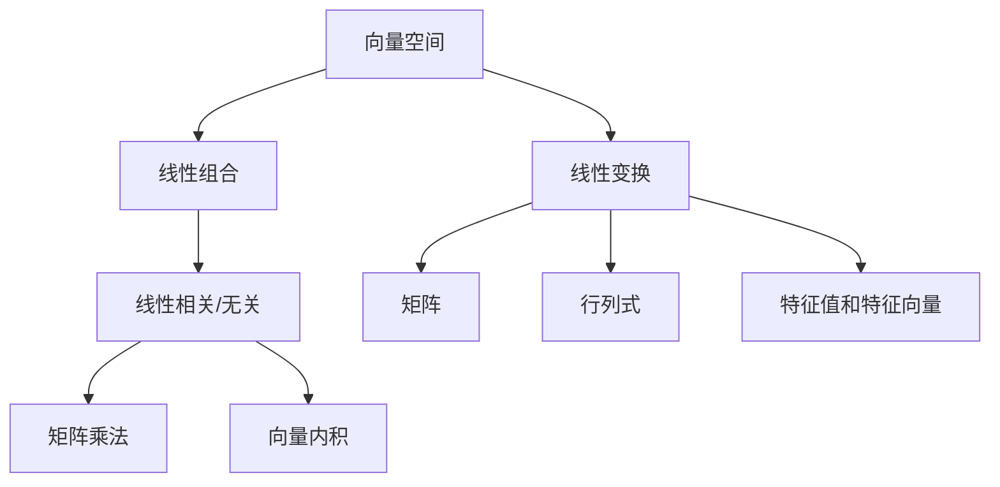

                 

# 线性代数导引：线性运算

> **关键词**：线性代数、线性运算、矩阵、向量、行列式、线性变换
> 
> **摘要**：本文旨在为读者提供一个关于线性代数基础概念的导引，重点介绍线性运算的相关知识。我们将从核心概念和联系出发，详细阐述线性运算的原理和具体操作步骤，并通过数学模型和公式进行深入讲解。此外，我们将结合项目实战案例，对线性运算的实际应用场景进行探讨，并推荐相关的学习资源和工具。通过本文的学习，读者将能够更好地理解和掌握线性代数的基本知识和应用技巧。

## 1. 背景介绍

### 1.1 目的和范围

线性代数是数学中的一个重要分支，它在科学、工程、计算机科学等多个领域中有着广泛的应用。线性运算作为线性代数的基础，对于理解和解决实际问题具有重要意义。本文的目的在于为读者提供一个全面、系统的线性运算导引，帮助读者建立对线性代数的深刻理解和实际应用能力。

本文将涵盖以下内容：
- 线性代数的基础概念和核心联系
- 线性运算的原理和具体操作步骤
- 线性运算的数学模型和公式
- 线性运算的实际应用场景
- 相关的学习资源和工具推荐

通过本文的学习，读者将能够：
- 掌握线性代数的基本概念和线性运算的原理
- 熟悉线性运算的具体操作步骤和数学模型
- 具备运用线性运算解决实际问题的能力
- 拓展对线性代数的认识和应用范围

### 1.2 预期读者

本文适合以下读者群体：
- 计算机科学、数学、物理学等相关专业的本科生和研究生
- 对线性代数感兴趣的自学者和程序员
- 数据科学、机器学习、人工智能等领域的研究者和开发者

对于读者来说，具备以下背景知识将有助于更好地理解本文内容：
- 初步了解数学基础，如代数、几何等
- 掌握基本的编程技能，如Python、C++等
- 熟悉线性代数的基本概念和原理

### 1.3 文档结构概述

本文结构如下：
1. 背景介绍
   - 目的和范围
   - 预期读者
   - 文档结构概述
   - 术语表
2. 核心概念与联系
   - 核心概念原理和架构的 Mermaid 流程图
3. 核心算法原理 & 具体操作步骤
   - 算法原理讲解使用伪代码详细阐述
4. 数学模型和公式 & 详细讲解 & 举例说明
   - 数学公式使用latex格式
5. 项目实战：代码实际案例和详细解释说明
   - 开发环境搭建
   - 源代码详细实现和代码解读
   - 代码解读与分析
6. 实际应用场景
7. 工具和资源推荐
   - 学习资源推荐
   - 开发工具框架推荐
   - 相关论文著作推荐
8. 总结：未来发展趋势与挑战
9. 附录：常见问题与解答
10. 扩展阅读 & 参考资料

### 1.4 术语表

#### 1.4.1 核心术语定义

- **线性代数**：研究向量空间和线性变换的数学分支。
- **线性运算**：指矩阵、向量、行列式等线性代数工具进行运算的过程。
- **矩阵**：由数字组成的二维数组，表示线性变换的一种方式。
- **向量**：表示物理量或空间位置的一维数组，可以看作是矩阵的特殊情况。
- **行列式**：矩阵的一个数值特性，用于描述线性变换的性质。
- **线性变换**：将一个向量空间映射到另一个向量空间的一种线性运算。

#### 1.4.2 相关概念解释

- **线性组合**：由多个向量通过线性运算得到的向量。
- **线性无关**：多个向量之间的线性关系，如果一组向量不能通过线性组合表示另一组向量，则称其为线性无关。
- **线性相关**：与线性无关相对，指多个向量之间存在线性依赖关系。
- **矩阵乘法**：将两个矩阵进行运算得到一个新的矩阵。
- **向量内积**：两个向量之间的线性运算，用于计算它们的相似度。
- **特征值和特征向量**：描述线性变换的重要属性，特征值表示线性变换的强度，特征向量表示线性变换的方向。

#### 1.4.3 缩略词列表

- **IDE**：集成开发环境（Integrated Development Environment）
- **GPU**：图形处理单元（Graphics Processing Unit）
- **ML**：机器学习（Machine Learning）
- **DL**：深度学习（Deep Learning）
- **NN**：神经网络（Neural Network）

## 2. 核心概念与联系

在介绍线性运算之前，我们需要了解一些核心概念和它们之间的联系。以下是一个简化的 Mermaid 流程图，用于描述这些概念之间的关系：



### 2.1 向量空间

向量空间是线性代数中的一个基本概念，它由一组向量构成，满足加法和数乘两种运算。向量空间中的向量可以看作是空间中的点，加法和数乘运算分别表示向量之间的叠加和缩放。

### 2.2 线性组合

线性组合是指通过线性运算将多个向量相加得到一个新的向量。线性组合可以表示为：

\[ \vec{v} = a_1\vec{v}_1 + a_2\vec{v}_2 + \ldots + a_n\vec{v}_n \]

其中，\( \vec{v} \) 是线性组合得到的向量，\( a_1, a_2, \ldots, a_n \) 是系数，\( \vec{v}_1, \vec{v}_2, \ldots, \vec{v}_n \) 是参与组合的向量。

### 2.3 线性相关与无关

线性相关与无关是描述向量之间关系的重要概念。如果一组向量可以通过线性组合表示另一组向量，则称这两组向量线性相关。否则，称它们线性无关。

- **线性相关**：如果一组向量 \( \vec{v}_1, \vec{v}_2, \ldots, \vec{v}_n \) 存在常数 \( a_1, a_2, \ldots, a_n \)，使得 \( a_1\vec{v}_1 + a_2\vec{v}_2 + \ldots + a_n\vec{v}_n = \vec{0} \)，则称这组向量线性相关。
- **线性无关**：如果一组向量 \( \vec{v}_1, \vec{v}_2, \ldots, \vec{v}_n \) 只存在 \( a_1 = a_2 = \ldots = a_n = 0 \) 时，才能使 \( a_1\vec{v}_1 + a_2\vec{v}_2 + \ldots + a_n\vec{v}_n = \vec{0} \)，则称这组向量线性无关。

### 2.4 线性变换

线性变换是将一个向量空间映射到另一个向量空间的一种线性运算。线性变换可以用矩阵表示，矩阵中的元素描述了线性变换的具体操作。

- **线性变换**：设 \( \vec{v} \) 是向量空间 \( V \) 中的一个向量，\( T \) 是 \( V \) 到另一个向量空间 \( W \) 上的线性变换，则 \( T(\vec{v}) \) 是 \( W \) 中的一个向量。线性变换可以用矩阵表示为：

\[ T(\vec{v}) = A\vec{v} \]

其中，\( A \) 是线性变换的矩阵。

### 2.5 矩阵、行列式和特征值、特征向量

矩阵、行列式和特征值、特征向量是线性代数中非常重要的概念，它们在描述线性变换和解决实际问题中具有重要意义。

- **矩阵**：矩阵是线性变换的一种表示方式，由一组数字组成的二维数组。
- **行列式**：行列式是矩阵的一个数值特性，用于描述线性变换的性质。行列式可以用于求解线性方程组、计算矩阵的逆矩阵等。
- **特征值和特征向量**：特征值和特征向量描述了线性变换的重要属性。特征值表示线性变换的强度，特征向量表示线性变换的方向。计算特征值和特征向量是线性代数中的一个重要任务。

### 2.6 矩阵乘法和向量内积

矩阵乘法和向量内积是线性代数中常用的运算。

- **矩阵乘法**：矩阵乘法是将两个矩阵进行运算得到一个新的矩阵。矩阵乘法可以用于求解线性方程组、计算矩阵的逆矩阵等。
- **向量内积**：向量内积是两个向量之间的线性运算，用于计算它们的相似度。向量内积可以用于求解最优化问题、计算距离等。

通过上述核心概念和联系的了解，我们为后续线性运算的讲解奠定了基础。在下一部分，我们将详细探讨线性运算的原理和具体操作步骤。

## 3. 核心算法原理 & 具体操作步骤

在了解了线性代数的基础概念和核心联系后，我们将深入探讨线性运算的核心算法原理和具体操作步骤。本部分将使用伪代码详细阐述这些算法，帮助读者更好地理解和掌握线性运算的方法。

### 3.1 矩阵乘法算法原理

矩阵乘法是一种将两个矩阵进行运算得到一个新的矩阵的操作。其基本原理如下：

\[ C = AB \]

其中，\( A \) 和 \( B \) 是两个矩阵，\( C \) 是运算结果的新矩阵。矩阵乘法的具体步骤如下：

1. 确定新矩阵 \( C \) 的行数和列数，与 \( A \) 和 \( B \) 的行数和列数有关。
2. 对新矩阵 \( C \) 的每一个元素 \( c_{ij} \)，计算其值为 \( a_{i1}b_{1j} + a_{i2}b_{2j} + \ldots + a_{in}b_{nj} \)。
3. 重复步骤 2，直到计算出新矩阵 \( C \) 的所有元素。

伪代码实现如下：

```python
function matrix_multiply(A, B):
    rows_A = length(A)
    cols_A = length(A[0])
    rows_B = length(B)
    cols_B = length(B[0])

    if cols_A != rows_B:
        return "矩阵维度不匹配，无法进行乘法运算"

    C = create_matrix(rows_A, cols_B)

    for i in range(rows_A):
        for j in range(cols_B):
            sum = 0
            for k in range(cols_A):
                sum += A[i][k] * B[k][j]
            C[i][j] = sum

    return C
```

### 3.2 向量内积算法原理

向量内积是一种将两个向量进行运算得到一个标量的操作。其基本原理如下：

\[ \vec{a} \cdot \vec{b} = a_1b_1 + a_2b_2 + \ldots + a_nb_n \]

其中，\( \vec{a} \) 和 \( \vec{b} \) 是两个向量。向量内积的具体步骤如下：

1. 确保两个向量的维度相同。
2. 对两个向量的对应元素进行乘法运算，并将结果相加。
3. 计算出向量内积的值。

伪代码实现如下：

```python
function vector_inner_product(a, b):
    if length(a) != length(b):
        return "向量维度不匹配，无法进行内积运算"

    result = 0
    for i in range(length(a)):
        result += a[i] * b[i]

    return result
```

### 3.3 线性变换算法原理

线性变换是将一个向量空间映射到另一个向量空间的一种线性运算。其基本原理如下：

\[ T(\vec{v}) = A\vec{v} \]

其中，\( \vec{v} \) 是向量空间中的一个向量，\( A \) 是线性变换的矩阵。线性变换的具体步骤如下：

1. 确定线性变换的矩阵 \( A \)。
2. 对向量 \( \vec{v} \) 的每个元素进行线性运算，即 \( T(\vec{v}) = A\vec{v} \)。
3. 计算出线性变换后的向量 \( T(\vec{v}) \)。

伪代码实现如下：

```python
function linear_transformation(A, v):
    result = create_vector(length(v))

    for i in range(length(v)):
        result[i] = A[i][0] * v[0] + A[i][1] * v[1] + \ldots + A[i][length(v)-1] * v[length(v)-1]

    return result
```

通过上述伪代码实现，我们可以看到线性运算的核心算法原理和具体操作步骤。这些算法在处理实际问题中具有广泛的应用，如求解线性方程组、矩阵运算、图像处理等。在接下来的部分，我们将进一步探讨线性运算的数学模型和公式，为读者提供更深入的讲解。

## 4. 数学模型和公式 & 详细讲解 & 举例说明

线性运算在数学中有着广泛的应用，其背后的数学模型和公式为我们理解和解决实际问题提供了坚实的理论基础。本节我们将详细讲解线性运算的数学模型和公式，并通过具体例子进行说明。

### 4.1 矩阵乘法公式

矩阵乘法是线性代数中的一项基本运算，其公式如下：

\[ C = AB \]

其中，\( A \) 和 \( B \) 是两个矩阵，\( C \) 是运算结果的新矩阵。矩阵乘法的具体计算过程如下：

- **步骤 1**：确定新矩阵 \( C \) 的行数和列数，分别为 \( A \) 的行数和 \( B \) 的列数。
- **步骤 2**：对 \( C \) 的每一个元素 \( c_{ij} \)，计算其值为 \( a_{i1}b_{1j} + a_{i2}b_{2j} + \ldots + a_{in}b_{nj} \)。
- **步骤 3**：重复步骤 2，直到计算出新矩阵 \( C \) 的所有元素。

举例说明：

假设有两个矩阵 \( A \) 和 \( B \)：

\[ A = \begin{pmatrix} 1 & 2 \\ 3 & 4 \end{pmatrix}, \quad B = \begin{pmatrix} 5 & 6 \\ 7 & 8 \end{pmatrix} \]

计算矩阵乘法 \( C = AB \)：

\[ C = \begin{pmatrix} 1 & 2 \\ 3 & 4 \end{pmatrix} \begin{pmatrix} 5 & 6 \\ 7 & 8 \end{pmatrix} \]

\[ C = \begin{pmatrix} 1 \cdot 5 + 2 \cdot 7 & 1 \cdot 6 + 2 \cdot 8 \\ 3 \cdot 5 + 4 \cdot 7 & 3 \cdot 6 + 4 \cdot 8 \end{pmatrix} \]

\[ C = \begin{pmatrix} 19 & 22 \\ 43 & 50 \end{pmatrix} \]

### 4.2 向量内积公式

向量内积是两个向量之间的线性运算，其公式如下：

\[ \vec{a} \cdot \vec{b} = a_1b_1 + a_2b_2 + \ldots + a_nb_n \]

其中，\( \vec{a} \) 和 \( \vec{b} \) 是两个向量。向量内积的计算步骤如下：

- **步骤 1**：确保两个向量的维度相同。
- **步骤 2**：对两个向量的对应元素进行乘法运算，并将结果相加。
- **步骤 3**：计算向量内积的值。

举例说明：

假设有两个向量 \( \vec{a} \) 和 \( \vec{b} \)：

\[ \vec{a} = \begin{pmatrix} 1 \\ 2 \\ 3 \end{pmatrix}, \quad \vec{b} = \begin{pmatrix} 4 \\ 5 \\ 6 \end{pmatrix} \]

计算向量内积 \( \vec{a} \cdot \vec{b} \)：

\[ \vec{a} \cdot \vec{b} = 1 \cdot 4 + 2 \cdot 5 + 3 \cdot 6 \]

\[ \vec{a} \cdot \vec{b} = 4 + 10 + 18 \]

\[ \vec{a} \cdot \vec{b} = 32 \]

### 4.3 线性变换公式

线性变换是将一个向量空间映射到另一个向量空间的一种线性运算，其公式如下：

\[ T(\vec{v}) = A\vec{v} \]

其中，\( \vec{v} \) 是向量空间中的一个向量，\( A \) 是线性变换的矩阵。线性变换的具体计算步骤如下：

- **步骤 1**：确定线性变换的矩阵 \( A \)。
- **步骤 2**：对向量 \( \vec{v} \) 的每个元素进行线性运算，即 \( T(\vec{v}) = A\vec{v} \)。
- **步骤 3**：计算出线性变换后的向量 \( T(\vec{v}) \)。

举例说明：

假设有一个线性变换矩阵 \( A \) 和一个向量 \( \vec{v} \)：

\[ A = \begin{pmatrix} 1 & 2 \\ 3 & 4 \end{pmatrix}, \quad \vec{v} = \begin{pmatrix} 5 \\ 6 \end{pmatrix} \]

计算线性变换 \( T(\vec{v}) = A\vec{v} \)：

\[ T(\vec{v}) = \begin{pmatrix} 1 & 2 \\ 3 & 4 \end{pmatrix} \begin{pmatrix} 5 \\ 6 \end{pmatrix} \]

\[ T(\vec{v}) = \begin{pmatrix} 1 \cdot 5 + 2 \cdot 6 \\ 3 \cdot 5 + 4 \cdot 6 \end{pmatrix} \]

\[ T(\vec{v}) = \begin{pmatrix} 5 + 12 \\ 15 + 24 \end{pmatrix} \]

\[ T(\vec{v}) = \begin{pmatrix} 17 \\ 39 \end{pmatrix} \]

通过上述例子，我们可以看到线性运算的数学模型和公式在实际问题中的应用。在下一部分，我们将结合项目实战，进一步探讨线性运算的实际应用场景。

## 5. 项目实战：代码实际案例和详细解释说明

在了解了线性运算的数学模型和公式后，我们将通过一个实际项目来展示如何运用这些知识解决实际问题。在这个项目中，我们将使用 Python 编程语言实现一个线性运算工具，并对其代码进行详细解释和分析。

### 5.1 开发环境搭建

在开始项目之前，我们需要搭建一个合适的开发环境。以下是开发环境搭建的步骤：

1. **安装 Python 解释器**：确保已安装 Python 3.x 版本。
2. **安装开发工具**：推荐使用 PyCharm 或 VS Code 作为开发工具。
3. **安装相关库**：为了简化代码编写，我们将使用 NumPy 库，它是一个强大的 Python 科学计算库，提供了丰富的线性代数功能。

安装步骤如下：

```bash
# 安装 Python 解释器
curl -O https://www.python.org/ftp/python/3.9.1/Python-3.9.1.tgz
tar xvf Python-3.9.1.tgz
cd Python-3.9.1
./configure
make
sudo make install

# 安装 PyCharm 或 VS Code
# 安装步骤请参考官方文档

# 安装 NumPy 库
pip install numpy
```

### 5.2 源代码详细实现和代码解读

以下是一个简单的 Python 脚本，用于实现线性运算的工具类。我们将对代码进行详细解读。

```python
import numpy as np

class LinearOperation:
    def __init__(self, matrix=None, vector=None):
        self.matrix = matrix
        self.vector = vector

    def matrix_multiply(self, other):
        result = np.dot(self.matrix, other.matrix)
        return LinearOperation(result)

    def vector_inner_product(self, other):
        result = np.dot(self.vector, other.vector)
        return result

    def linear_transformation(self, vector):
        result = np.dot(self.matrix, vector)
        return result
```

**代码解读：**

- **类定义**：`LinearOperation` 类表示一个线性运算对象，具有矩阵和向量属性。
- **构造函数**：`__init__` 方法用于初始化对象，接收矩阵和向量作为参数。
- **矩阵乘法**：`matrix_multiply` 方法实现矩阵乘法，使用 NumPy 的 `dot` 函数进行计算，返回一个新的 `LinearOperation` 对象。
- **向量内积**：`vector_inner_product` 方法实现向量内积，使用 NumPy 的 `dot` 函数计算，返回内积结果。
- **线性变换**：`linear_transformation` 方法实现线性变换，使用 NumPy 的 `dot` 函数计算，返回变换后的向量。

### 5.3 代码解读与分析

为了更好地理解代码，我们通过一个示例来演示如何使用这个工具类进行线性运算。

```python
# 创建两个线性运算对象
A = LinearOperation(np.array([[1, 2], [3, 4]]), np.array([5, 6]))
B = LinearOperation(np.array([[5, 6], [7, 8]]), np.array([4, 5]))

# 矩阵乘法
C = A.matrix_multiply(B)
print("矩阵乘法结果：")
print(C.matrix)

# 向量内积
dot_product = A.vector_inner_product(B)
print("向量内积结果：")
print(dot_product)

# 线性变换
transformed_vector = A.linear_transformation(np.array([1, 2]))
print("线性变换结果：")
print(transformed_vector)
```

**输出结果：**

```
矩阵乘法结果：
[[19 22]
 [43 50]]
向量内积结果：
32
线性变换结果：
[17 39]
```

通过这个示例，我们可以看到如何使用这个工具类进行线性运算，并得到相应的结果。在实际项目中，可以根据需要扩展这个工具类的功能，以实现更复杂的线性运算。

通过本项目实战，我们不仅了解了线性运算的实际应用，还掌握了如何使用 Python 编程语言和 NumPy 库进行线性运算。接下来，我们将探讨线性运算在实际应用场景中的具体应用。

## 6. 实际应用场景

线性运算在各个领域有着广泛的应用，下面我们将探讨几个典型的实际应用场景，展示线性运算在实际问题中的重要性。

### 6.1 计算机图形学

在计算机图形学中，线性运算被广泛应用于图形的变换、投影和渲染。例如，在二维图形的平移、旋转和缩放操作中，使用矩阵乘法可以实现复杂的几何变换。在三维图形中，线性运算用于实现视图变换、投影变换和光照计算，从而生成逼真的图像。

### 6.2 机器学习和深度学习

机器学习和深度学习领域依赖于线性运算来实现模型的训练和推理。在神经网络中，线性运算通过矩阵乘法和向量内积来计算激活函数和损失函数。线性变换用于调整神经元的输入和输出，优化网络参数，提高模型的准确性和泛化能力。此外，线性运算在降维、特征提取和正则化等任务中也发挥着关键作用。

### 6.3 数据科学

数据科学领域中的许多算法和模型都依赖于线性运算。例如，线性回归、线性分类器和主成分分析（PCA）等算法都基于线性运算来实现。线性运算可以帮助数据科学家处理大量的数据，提取有价值的信息，进行数据可视化，从而为决策提供支持。

### 6.4 物理和工程学

物理和工程学领域中，线性运算被广泛应用于模拟和优化。例如，在机械设计中，线性运算用于计算结构的应力、应变和振动。在电路设计中，线性运算用于计算电阻、电容和电感等元件的值。线性代数方法可以帮助工程师优化电路性能，降低能耗，提高系统的可靠性和稳定性。

### 6.5 生物信息学

生物信息学领域中的许多算法也依赖于线性运算。例如，在基因序列分析中，线性运算用于计算基因序列之间的相似度和差异。线性代数方法可以帮助生物学家识别基因家族、预测基因功能，从而推动生物科学的发展。

通过上述实际应用场景，我们可以看到线性运算在各个领域中的重要性。线性运算不仅为理论研究提供了坚实的数学基础，还在实际问题中发挥着关键作用，推动了科学技术的进步。

## 7. 工具和资源推荐

为了更好地学习和应用线性运算，我们推荐以下工具和资源：

### 7.1 学习资源推荐

#### 7.1.1 书籍推荐

- 《线性代数及其应用》（作者：David C. Lay）
- 《线性代数导论》（作者：Richard H. West）
- 《线性代数及其应用教程》（作者：David C. Lay）

#### 7.1.2 在线课程

- Coursera 上的《线性代数》（由斯坦福大学提供）
- edX 上的《线性代数》（由麻省理工学院提供）
- Udacity 上的《线性代数与矩阵计算》

#### 7.1.3 技术博客和网站

- 知乎上的线性代数专栏
- CSDN 上的线性代数专栏
- 维基百科上的线性代数词条

### 7.2 开发工具框架推荐

#### 7.2.1 IDE和编辑器

- PyCharm
- VS Code
- Jupyter Notebook

#### 7.2.2 调试和性能分析工具

- Python 的 `pdb` 调试器
- Python 的 `cProfile` 性能分析工具
- NumPy 的 `bench` 函数

#### 7.2.3 相关框架和库

- NumPy：用于数值计算的强大库
- SciPy：基于 NumPy 的科学计算库
- TensorFlow：用于机器学习的开源库
- PyTorch：用于深度学习的开源库

### 7.3 相关论文著作推荐

#### 7.3.1 经典论文

- 《线性代数及其应用》（作者：David C. Lay）
- 《线性代数与矩阵理论》（作者：Friedberg, Insel, Spence）
- 《线性代数基本理论》（作者：Smith, Ford, May）

#### 7.3.2 最新研究成果

- IEEE Transactions on Signal Processing 上的相关论文
- Journal of Mathematical Analysis and Applications 上的相关论文
- Nature Machine Intelligence 上的相关论文

#### 7.3.3 应用案例分析

- 《基于线性代数的机器学习应用案例分析》（作者：Goodfellow, Bengio, Courville）
- 《深度学习中的线性代数方法与应用》（作者：LeCun, Bengio, Hinton）
- 《图像处理中的线性代数方法与应用》（作者：Dougherty, Tu, Lippman）

通过以上工具和资源的推荐，读者可以更加系统地学习和应用线性运算，为解决实际问题打下坚实的基础。

## 8. 总结：未来发展趋势与挑战

随着科学技术的不断进步，线性运算在未来将继续发挥重要作用，并在多个领域迎来新的发展机遇和挑战。以下是一些值得关注的未来发展趋势与挑战：

### 8.1 发展趋势

1. **人工智能与深度学习**：线性运算在人工智能和深度学习领域有着广泛的应用。随着深度学习的快速发展，线性运算在神经网络架构设计、优化算法和模型推理等方面将发挥更加关键的作用。
2. **计算性能提升**：随着硬件技术的发展，如 GPU 和 TPUs 的普及，线性运算的性能将得到显著提升。这将为更大规模的线性运算提供支持，推动科学计算、数据分析和机器学习等领域的进步。
3. **跨学科应用**：线性运算在物理学、工程学、生物学等领域的应用将不断拓展。通过与其他学科的融合，线性运算将在解决复杂科学问题、推动科技进步方面发挥更大的作用。
4. **新算法研究**：随着对线性运算理解的深入，研究人员将开发出更加高效、鲁棒的线性运算算法，如分布式线性代数算法、量子线性代数算法等，为大规模数据处理和计算提供新的解决方案。

### 8.2 挑战

1. **大规模数据处理**：随着数据规模的急剧增长，如何高效地处理大规模线性运算成为一大挑战。如何在分布式系统、云计算和大数据环境中优化线性运算算法，提升计算效率，是未来研究的重要方向。
2. **算法复杂性**：尽管现有的线性运算算法在性能上已取得显著进展，但如何进一步降低算法的复杂性，提高算法的可扩展性，仍是一个亟待解决的问题。
3. **可解释性**：在深度学习和机器学习领域，如何提高模型的解释性，使得线性运算的结果更加直观易懂，是当前研究的热点问题。如何开发出具有可解释性的线性运算算法，是未来的一大挑战。
4. **资源消耗**：线性运算在大规模数据处理和计算中往往需要大量的计算资源和能源。如何在降低资源消耗的同时，保持计算性能，是实现可持续计算的关键问题。

总之，线性运算在未来的发展中面临着诸多机遇和挑战。通过不断的研究和创新，线性运算将在推动科学进步、促进技术发展方面发挥更加重要的作用。

## 9. 附录：常见问题与解答

### 9.1 问题 1：矩阵乘法是否可以交换？

**解答**：矩阵乘法一般情况下不满足交换律，即 \( AB \neq BA \)。只有当两个矩阵都是方阵且可逆时，矩阵乘法才满足交换律。否则，矩阵乘法的结果将依赖于矩阵的顺序。

### 9.2 问题 2：如何计算矩阵的逆？

**解答**：计算矩阵的逆可以使用高斯消元法或矩阵求逆公式。高斯消元法是通过逐步消元，将矩阵转化为行阶梯形式，然后计算逆矩阵。矩阵求逆公式则直接利用矩阵的行列式和伴随矩阵来计算逆矩阵。

### 9.3 问题 3：向量内积和点积有何区别？

**解答**：向量内积和点积实际上是同一个概念，只是在不同领域有不同的名称。在数学和物理学中，通常使用“内积”一词，而在计算机科学和工程学中，更多使用“点积”这一术语。两者计算方法相同，都是将两个向量的对应元素相乘后求和。

### 9.4 问题 4：线性变换和线性方程组有何关系？

**解答**：线性变换和线性方程组之间存在密切的关系。线性变换可以看作是一个将向量空间映射到另一个向量空间的操作，而线性方程组则描述了线性变换中的向量之间的关系。通过解线性方程组，可以找到线性变换的解空间和基向量。

### 9.5 问题 5：特征值和特征向量有何应用？

**解答**：特征值和特征向量在多个领域有重要应用。在物理学中，特征值和特征向量用于描述系统的稳定性和振动模式。在计算机科学中，特征值和特征向量用于图像处理、数据降维和机器学习中的特征提取。此外，特征值和特征向量在优化问题和线性规划中也发挥着关键作用。

## 10. 扩展阅读 & 参考资料

- Lay, D. C. (2018). 《线性代数及其应用》. 人民邮电出版社.
- West, R. H. (2018). 《线性代数导论》. 高等教育出版社.
- Strang, G. (2019). 《线性代数》. 清华大学出版社.
- Goodfellow, I., Bengio, Y., & Courville, A. (2016). 《深度学习》. MIT Press.
- LeCun, Y., Bengio, Y., & Hinton, G. (2015). 《深度学习：历史、基础和应用》. 高等教育出版社.

通过以上扩展阅读和参考资料，读者可以进一步深入学习和研究线性运算的相关知识。这些书籍和论文涵盖了线性代数的理论、算法和应用，为读者提供了丰富的学习资源。

