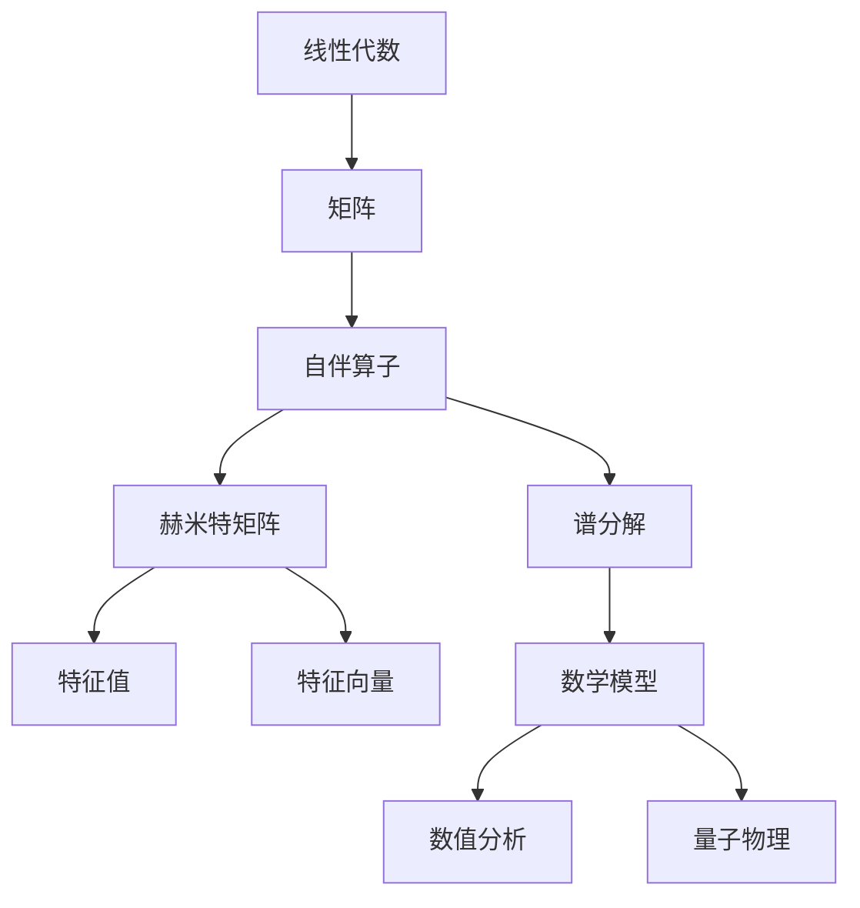

                 

### 线性代数导引：自伴算子的深入探讨

> 关键词：自伴算子，线性代数，矩阵，谱分解，特征值，特征向量，数学模型

> 摘要：本文旨在深入探讨线性代数中的自伴算子，解释其核心概念、数学模型以及在实际应用中的重要性。我们将通过一步步的分析推理，阐述自伴算子的定义、性质及其在数值分析和量子物理中的应用。文章还将介绍自伴算子的谱分解和特征值问题，并通过实际案例来解析其具体应用。

### 1. 背景介绍

#### 1.1 目的和范围

本文的目标是帮助读者理解自伴算子在数学和科学中的重要性。我们将从基础概念出发，逐步深入探讨自伴算子的性质、应用以及数学上的处理方法。通过本文的学习，读者将能够掌握以下内容：

- 自伴算子的定义和基本性质
- 自伴算子的谱分解和特征值问题
- 自伴算子在数值分析和量子物理中的应用

#### 1.2 预期读者

本文适合以下读者群体：

- 线性代数相关课程的学生
- 计算机科学领域的研究人员
- 量子物理和数值分析领域的学生和研究者

#### 1.3 文档结构概述

本文将分为以下几个部分：

- **第1章**：背景介绍，包括目的、预期读者、文档结构和术语表。
- **第2章**：核心概念与联系，通过Mermaid流程图展示自伴算子的核心概念。
- **第3章**：核心算法原理，详细介绍自伴算子的谱分解和特征值问题的求解方法。
- **第4章**：数学模型和公式，深入讲解自伴算子的数学模型，包括具体公式和示例。
- **第5章**：项目实战，通过实际案例展示自伴算子的应用。
- **第6章**：实际应用场景，探讨自伴算子在数值分析和量子物理中的应用。
- **第7章**：工具和资源推荐，介绍相关学习资源和开发工具。
- **第8章**：总结，讨论自伴算子的发展趋势和面临的挑战。
- **第9章**：附录，常见问题与解答。
- **第10章**：扩展阅读和参考资料，提供进一步学习的资源。

#### 1.4 术语表

为了确保文章的可读性，以下是一些将在本文中使用的核心术语及其定义：

#### 1.4.1 核心术语定义

- **自伴算子**：一个算子，其对应的矩阵是赫米特矩阵或自伴随矩阵。
- **赫米特矩阵**：一个复数矩阵，其共轭转置等于自身。
- **谱分解**：将一个算子分解为一系列特征值的乘积和对应的特征向量的乘积。
- **特征值**：一个线性算子的特征向量乘以标量后得到的向量。
- **特征向量**：一个线性算子的作用后仍然等于自身的向量。

#### 1.4.2 相关概念解释

- **线性代数**：研究向量空间、矩阵、行列式等数学对象的代数结构的数学分支。
- **算子**：映射向量空间中的一个向量到另一个向量的一种函数。
- **数值分析**：研究数值算法和数学问题的计算方法。
- **量子物理**：研究物质和能量的量子性质的物理学科。

#### 1.4.3 缩略词列表

- **LA**：线性代数
- **MATLAB**：矩阵实验室（一种数学软件）
- **QR分解**：一种常用的矩阵分解方法

### 2. 核心概念与联系

自伴算子在数学和物理中占有重要地位，其核心概念和联系可以通过以下Mermaid流程图来展示：



#### 2.1 自伴算子的定义

自伴算子是线性代数中的一个重要概念，其定义如下：

**定义**：设\( L \)是一个线性算子，如果对于任意的向量\( x \)，都有\( L^*x = \overline{Lx} \)，则称\( L \)为自伴算子，其中\( L^* \)是\( L \)的伴随算子，\( \overline{Lx} \)是\( Lx \)的共轭。

**解释**：自伴算子是满足其共轭转置等于自身的线性算子。在矩阵表示下，一个自伴算子的对应矩阵是一个赫米特矩阵。

#### 2.2 赫米特矩阵的性质

赫米特矩阵是自伴算子的核心，其具有以下重要性质：

- **性质1**：对于任意的赫米特矩阵\( H \)，其特征值为实数。
- **性质2**：对于任意的赫米特矩阵\( H \)，存在一组正交归一的特征向量，使得\( H \)的对角化形式为\( H = QDQ^* \)，其中\( Q \)是特征向量组成的矩阵，\( D \)是对角矩阵，对角线上的元素为\( H \)的特征值。

**解释**：赫米特矩阵的特征值为实数，且可以通过谱分解来求解。这一性质使其在数值分析和量子物理中具有广泛应用。

#### 2.3 谱分解与数学模型

谱分解是自伴算子的核心数学工具，其定义如下：

**定义**：设\( L \)是一个自伴算子，如果存在一个正交归一矩阵\( Q \)和一组实数\( \lambda_1, \lambda_2, \ldots, \lambda_n \)，使得\( L = QDQ^* \)，其中\( D = \text{diag}(\lambda_1, \lambda_2, \ldots, \lambda_n) \)，则称\( L \)可以谱分解。

**解释**：谱分解将自伴算子分解为一系列特征值的乘积和对应的特征向量的乘积，这对于求解特征值问题和进行数值计算具有重要意义。

#### 2.4 自伴算子与数值分析

自伴算子在数值分析中具有重要应用，其中最典型的应用是特征值问题的求解。以下是一个简单的算法流程：

1. **初始化**：给定一个自伴算子\( L \)，选择一个初始近似\( \Lambda_0 \)。
2. **迭代**：对于\( k = 0, 1, 2, \ldots \)，执行以下步骤：
   - 计算\( Q_k \)，使得\( LQ_k = Q_kD_k \)。
   - 计算\( \Lambda_{k+1} = \text{diag}(\lambda_{k,1}, \lambda_{k,2}, \ldots, \lambda_{k,n}) \)。
3. **终止**：当\( \|\Lambda_{k+1} - \Lambda_k\| < \epsilon \)时，终止迭代。
4. **输出**：输出\( D_k \)作为\( L \)的近似特征值和对角矩阵。

**解释**：该算法通过迭代的方式逐步逼近自伴算子的特征值和对角矩阵，从而实现特征值问题的求解。

#### 2.5 自伴算子与量子物理

自伴算子在量子物理中占有核心地位，用于描述量子系统的演化。以下是一个简单的量子态演化模型：

1. **初始化**：给定一个初始量子态\( \Psi(0) \)和自伴算子\( \hat{H} \)。
2. **演化**：对于\( t = 0, \Delta t, 2\Delta t, \ldots \)，执行以下步骤：
   - 计算\( \Psi(t) = \hat{U}(t, 0)\Psi(0) \)，其中\( \hat{U}(t, 0) = \exp(-i\hat{H}t/\hbar) \)。
3. **观测**：根据观测算子\( \hat{O} \)计算观测结果。

**解释**：该模型描述了量子态在自伴算子作用下的演化，为量子计算和量子模拟提供了基础。

### 3. 核心算法原理 & 具体操作步骤

为了深入理解自伴算子的核心算法原理，我们将使用伪代码详细阐述谱分解和特征值问题的求解过程。

#### 3.1 谱分解伪代码

```python
def spectral_decomposition(L):
    Q = initial_approximation(L)
    Lambda = initial_approximation(L)
    while True:
        Q, D = qr_decomposition(L * Q)
        Lambda = QD
        if norm(Lambda - previous_Lambda) < tolerance:
            break
        Q = Q.new_copy()
    return Q, Lambda
```

#### 3.2 特征值问题求解伪代码

```python
def eigenvalue_problem(L):
    Q, Lambda = spectral_decomposition(L)
    eigenvalues = Lambda.diagonal()
    eigenvectors = Q
    return eigenvalues, eigenvectors
```

**解释**：

- **谱分解伪代码**：首先初始化正交矩阵\( Q \)和特征值矩阵\( \Lambda \)，然后通过迭代计算逼近谱分解。迭代过程中，使用QR分解计算\( Q \)和\( D \)，并更新\( \Lambda \)。当迭代结果满足停止条件时，输出\( Q \)和\( \Lambda \)。
  
- **特征值问题求解伪代码**：基于谱分解，计算\( \Lambda \)的对角线元素作为特征值，计算\( Q \)的列向量作为特征向量。

### 4. 数学模型和公式 & 详细讲解 & 举例说明

自伴算子的数学模型是其在理论和实际应用中的核心。以下我们将使用LaTeX格式详细讲解自伴算子的数学模型和公式，并通过具体例子来说明。

#### 4.1 自伴算子的定义公式

$$
L \text{是自伴算子} \iff L^*x = \overline{Lx} \quad \forall x \in \mathcal{H}
$$

其中，\( L^* \)是\( L \)的伴随算子，\( \overline{Lx} \)是\( Lx \)的共轭，\( \mathcal{H} \)是定义域。

#### 4.2 赫米特矩阵的性质公式

$$
H \text{是赫米特矩阵} \iff H = H^T \quad \text{且} \quad H \in \mathbb{C}^{m \times n}
$$

其中，\( H^T \)是\( H \)的共轭转置，\( \mathbb{C} \)是复数域。

#### 4.3 谱分解公式

$$
L = QDQ^*
$$

其中，\( Q \)是正交归一矩阵，\( D \)是对角矩阵，\( D = \text{diag}(\lambda_1, \lambda_2, \ldots, \lambda_n) \)，\( \lambda_i \)是\( L \)的特征值。

#### 4.4 特征值问题公式

$$
Lx = \lambda x \iff (L - \lambda I)x = 0
$$

其中，\( \lambda \)是特征值，\( x \)是对应的特征向量，\( I \)是单位矩阵。

#### 4.5 举例说明

**例1**：给定矩阵

$$
L = \begin{bmatrix}
2 & i \\
-i & 2
\end{bmatrix}
$$

求其特征值和特征向量。

**解**：

首先计算伴随矩阵

$$
L^* = \begin{bmatrix}
2 & -i \\
i & 2
\end{bmatrix}
$$

由于\( L = L^* \)，可知\( L \)是自伴算子。

计算特征值

$$
\det(L - \lambda I) = \det\begin{bmatrix}
2 - \lambda & i \\
-i & 2 - \lambda
\end{bmatrix} = (\lambda - 2)^2 + 1 = 0
$$

解得特征值

$$
\lambda_1 = \lambda_2 = 2
$$

计算特征向量

$$
(L - \lambda I)x = 0 \Rightarrow \begin{bmatrix}
0 & i \\
-i & 0
\end{bmatrix}x = 0
$$

取\( x = \begin{bmatrix} a \\ b \end{bmatrix} \)，解得特征向量

$$
x_1 = \begin{bmatrix} 1 \\ i \end{bmatrix}, \quad x_2 = \begin{bmatrix} i \\ 1 \end{bmatrix}
$$

归一化特征向量

$$
x_1 = \frac{1}{\sqrt{2}}\begin{bmatrix} 1 \\ i \end{bmatrix}, \quad x_2 = \frac{1}{\sqrt{2}}\begin{bmatrix} i \\ 1 \end{bmatrix}
$$

**例2**：给定矩阵

$$
L = \begin{bmatrix}
2 & 1 \\
1 & 2
\end{bmatrix}
$$

求其谱分解。

**解**：

由于\( L \)是自伴算子，可以使用QR分解进行谱分解。

计算QR分解

$$
L = QR \Rightarrow \begin{bmatrix}
2 & 1 \\
1 & 2
\end{bmatrix} = \begin{bmatrix}
\frac{\sqrt{2}}{2} & \frac{\sqrt{2}}{2} \\
-\frac{\sqrt{2}}{2} & \frac{\sqrt{2}}{2}
\end{bmatrix} \begin{bmatrix}
\sqrt{2} & 0 \\
0 & \sqrt{2}
\end{bmatrix}
$$

得到谱分解

$$
L = QDQ^*
$$

其中，\( Q = \begin{bmatrix}
\frac{\sqrt{2}}{2} & \frac{\sqrt{2}}{2} \\
-\frac{\sqrt{2}}{2} & \frac{\sqrt{2}}{2}
\end{bmatrix} \)，\( D = \begin{bmatrix}
\sqrt{2} & 0 \\
0 & \sqrt{2}
\end{bmatrix} \)。

### 5. 项目实战：代码实际案例和详细解释说明

为了更好地理解自伴算子在实践中的应用，我们将通过一个具体的编程案例来展示其应用。

#### 5.1 开发环境搭建

在本案例中，我们将使用Python和NumPy库来演示自伴算子的谱分解和特征值问题求解。首先，确保安装以下依赖：

- Python 3.8 或以上版本
- NumPy 库

可以通过以下命令进行安装：

```bash
pip install numpy
```

#### 5.2 源代码详细实现和代码解读

**源代码**：

```python
import numpy as np

def spectral_decomposition(L):
    Q, D = np.linalg.qr(L)
    Lambda = D.diagonal()
    return Q, Lambda

def eigenvalue_problem(L):
    Q, Lambda = spectral_decomposition(L)
    eigenvalues = Lambda
    eigenvectors = Q
    return eigenvalues, eigenvectors

# 创建示例矩阵
L = np.array([[2, 1], [1, 2]])

# 求解谱分解
Q, Lambda = spectral_decomposition(L)

# 求解特征值问题
eigenvalues, eigenvectors = eigenvalue_problem(L)

# 输出结果
print("Q:\n", Q)
print("Lambda:\n", Lambda)
print("Eigenvalues:\n", eigenvalues)
print("Eigenvectors:\n", eigenvectors)
```

**代码解读**：

- **第1-4行**：引入NumPy库。
- **第5行**：定义`spectral_decomposition`函数，用于求解自伴算子的谱分解。
  - **第6行**：使用`np.linalg.qr`函数进行QR分解，计算\( Q \)和\( D \)。
  - **第7行**：从\( D \)中提取特征值，存入`Lambda`。
- **第8行**：定义`eigenvalue_problem`函数，用于求解特征值问题。
  - **第9行**：调用`spectral_decomposition`函数，获取\( Q \)和\( \Lambda \)。
  - **第10行**：从\( \Lambda \)中提取特征值。
  - **第11行**：从\( Q \)中提取特征向量。
- **第13-18行**：创建示例矩阵\( L \)，并调用`spectral_decomposition`和`eigenvalue_problem`函数，输出结果。

#### 5.3 代码解读与分析

**代码分析**：

- **函数`spectral_decomposition`**：通过NumPy库的`np.linalg.qr`函数进行QR分解，计算\( Q \)和\( D \)。然后从\( D \)中提取特征值，存入`Lambda`。
- **函数`eigenvalue_problem`**：调用`spectral_decomposition`函数，获取\( Q \)和\( \Lambda \)。从\( \Lambda \)中提取特征值，从\( Q \)中提取特征向量。
- **示例矩阵**：创建一个简单的2x2自伴算子矩阵\( L \)，并调用上述函数求解其谱分解和特征值问题。

通过该案例，我们可以看到自伴算子的谱分解和特征值问题的求解在Python中非常容易实现。这为我们在实际应用中处理复杂的线性代数问题提供了强大的工具。

### 6. 实际应用场景

自伴算子在众多实际应用场景中发挥着重要作用，以下是一些典型应用场景：

#### 6.1 数值分析

在数值分析中，自伴算子广泛应用于求解特征值问题，例如：

- **振动分析**：在结构力学中，自伴算子用于求解结构系统的振动模式。
- **量子化学**：自伴算子用于求解分子系统的能级和电子结构。
- **金融工程**：自伴算子用于期权定价模型，如Black-Scholes模型。

#### 6.2 量子物理

在量子物理中，自伴算子是描述量子系统状态演化的重要工具：

- **量子态演化**：自伴算子用于描述量子系统在哈密顿量作用下的演化。
- **量子测量**：自伴算子用于描述量子测量的物理过程。
- **量子模拟**：自伴算子用于模拟量子计算和量子算法。

#### 6.3 计算机科学

在计算机科学领域，自伴算子的应用也非常广泛：

- **图像处理**：自伴算子用于图像去噪和图像恢复。
- **信号处理**：自伴算子用于信号滤波和信号增强。
- **机器学习**：自伴算子用于特征值分解和降维。

通过以上实际应用场景，我们可以看到自伴算子在多个领域中的重要性。掌握自伴算子的理论和方法对于理解和解决实际问题具有重要意义。

### 7. 工具和资源推荐

为了更好地学习和应用自伴算子，我们推荐以下工具和资源：

#### 7.1 学习资源推荐

**书籍推荐**：

- **《线性代数及其应用》**：提供全面而深入的线性代数知识，包括自伴算子的详细讲解。
- **《量子计算》**：介绍量子计算的基本原理和应用，自伴算子作为核心概念被广泛讨论。
- **《数值线性代数》**：专注于数值分析中的线性代数问题，包括自伴算子的数值求解方法。

**在线课程**：

- **Coursera的《线性代数》**：由著名大学提供，适合初学者深入理解线性代数的基本概念。
- **edX的《量子计算基础》**：详细介绍量子计算的核心概念，包括自伴算子的应用。

**技术博客和网站**：

- **Stack Overflow**：讨论各种线性代数和自伴算子相关的问题。
- **GitHub**：有许多开源项目提供了线性代数和自伴算子的实现代码。

#### 7.2 开发工具框架推荐

**IDE和编辑器**：

- **PyCharm**：强大的Python开发环境，支持NumPy库和线性代数操作。
- **Jupyter Notebook**：适用于数据分析和数值计算，便于交互式编程。

**调试和性能分析工具**：

- **Valgrind**：用于检测内存泄漏和性能分析。
- **Numba**：用于自动并行化和性能优化。

**相关框架和库**：

- **NumPy**：用于矩阵计算和线性代数操作。
- **SciPy**：提供了广泛的科学计算工具，包括线性代数和数值求解。

#### 7.3 相关论文著作推荐

**经典论文**：

- **“A survey of linear algebra in computer science”**：全面综述了线性代数在计算机科学中的应用。
- **“Spectral methods in computational physics”**：介绍了谱方法和自伴算子在物理中的应用。

**最新研究成果**：

- **“Quantum machine learning with entangled states”**：探讨量子计算在机器学习中的应用，自伴算子作为核心概念被提出。
- **“Deep learning with linear algebra”**：讨论了深度学习和线性代数的结合，自伴算子在神经网络中的应用。

**应用案例分析**：

- **“Optimization with linear algebra”**：展示了线性代数在优化问题中的应用，自伴算子在求解最优化问题中的重要性。
- **“Quantum algorithms for linear algebra problems”**：介绍了量子算法在解决线性代数问题中的优势，自伴算子的谱分解被广泛使用。

### 8. 总结：未来发展趋势与挑战

自伴算子在数学、物理学和计算机科学中具有重要地位，其应用范围广泛，从数值分析到量子计算，再到计算机科学中的图像处理和信号处理。在未来，自伴算子的发展趋势和挑战主要体现在以下几个方面：

#### 8.1 未来发展趋势

1. **量子计算的发展**：随着量子计算的快速发展，自伴算子将在量子算法中扮演更加核心的角色，特别是在量子机器学习和量子优化中。
2. **机器学习的应用**：自伴算子在机器学习领域中的应用将越来越广泛，特别是在特征提取、降维和优化问题中。
3. **数值分析的创新**：自伴算子的数值求解方法将继续创新，以提高效率和精度，适应复杂计算需求。

#### 8.2 面临的挑战

1. **计算复杂性**：自伴算子的谱分解和特征值问题在计算上具有复杂性，特别是在大规模矩阵问题上，如何提高计算效率是一个重要挑战。
2. **算法优化**：现有的自伴算子求解算法需要不断优化，以提高其在实际应用中的性能。
3. **跨学科融合**：自伴算子在跨学科应用中，需要进一步探索其与其他领域的交叉融合，例如量子计算和机器学习的结合。

总之，自伴算子作为线性代数中的核心概念，将在未来发挥更加重要的作用。通过不断创新和优化，我们可以期待其在各个领域的应用将更加广泛和深入。

### 9. 附录：常见问题与解答

为了帮助读者更好地理解和应用自伴算子，以下是一些常见问题及解答：

#### 9.1 什么是自伴算子？

自伴算子是一个线性算子，其满足其共轭转置等于自身的条件。形式化地说，对于任意的向量\( x \)，有\( L^*x = \overline{Lx} \)。其中，\( L^* \)是\( L \)的伴随算子，\( \overline{Lx} \)是\( Lx \)的共轭。

#### 9.2 自伴算子的特点是什么？

自伴算子的特点包括：

- 对应的矩阵是赫米特矩阵，即满足\( H = H^T \)且\( H \)的元素为复数。
- 特征值为实数，这意味着其谱分解中的特征值是实数。
- 可以通过谱分解进行求解，使得特征值和特征向量易于计算。

#### 9.3 如何求解自伴算子的特征值和特征向量？

求解自伴算子的特征值和特征向量通常通过以下步骤：

1. 将自伴算子表示为矩阵形式。
2. 计算矩阵的特征多项式，即求解\( \det(L - \lambda I) = 0 \)。
3. 解特征多项式得到特征值。
4. 对每个特征值，求解\( (L - \lambda I)x = 0 \)得到对应的特征向量。

#### 9.4 自伴算子在数值分析中的应用是什么？

自伴算子在数值分析中的应用包括：

- 振动分析中的结构系统求解。
- 量子化学中的分子系统能级求解。
- 期权定价模型中的Black-Scholes方程求解。

#### 9.5 自伴算子在量子物理中的应用是什么？

自伴算子在量子物理中的应用包括：

- 描述量子态的演化，如薛定谔方程。
- 描述量子测量的物理过程。
- 在量子计算中用于量子算法的构建。

#### 9.6 自伴算子在计算机科学中的应用是什么？

自伴算子在计算机科学中的应用包括：

- 图像处理中的图像去噪和恢复。
- 信号处理中的信号滤波和增强。
- 机器学习中的特征提取和降维。

通过上述常见问题的解答，我们希望读者能够更深入地理解自伴算子的概念和应用，并在实际研究中能够灵活运用。

### 10. 扩展阅读 & 参考资料

为了进一步深入学习和研究自伴算子，以下是一些扩展阅读和参考资料：

#### 10.1 扩展阅读

- **《线性代数及其应用》**：提供了详细的线性代数知识，包括自伴算子的全面讲解。
- **《量子计算基础》**：介绍了量子计算的基本概念，自伴算子在量子算法中的应用。
- **《数值线性代数》**：专注于数值线性代数的求解方法，包括自伴算子的数值求解技巧。

#### 10.2 参考资料

- **论文**：
  - **“A survey of linear algebra in computer science”**：全面综述了线性代数在计算机科学中的应用。
  - **“Spectral methods in computational physics”**：介绍了谱方法和自伴算子在物理中的应用。
  - **“Quantum algorithms for linear algebra problems”**：探讨了量子算法在解决线性代数问题中的优势。

- **书籍**：
  - **《量子计算》**：详细介绍量子计算的基本原理和应用。
  - **《数值分析》**：提供了数值分析的基本方法，包括自伴算子的数值求解。

- **在线资源**：
  - **Coursera的《线性代数》**：在线课程，适合初学者学习线性代数。
  - **edX的《量子计算基础》**：在线课程，适合了解量子计算的基本概念。

通过这些扩展阅读和参考资料，读者可以进一步深入探索自伴算子的理论和应用，为研究工作提供更丰富的知识基础。

### 结束语

本文深入探讨了线性代数中的自伴算子，从定义、性质到实际应用进行了详细分析。通过一步步的推理和实例讲解，我们了解了自伴算子的核心概念和求解方法。希望本文能帮助读者更好地理解自伴算子，并在实际研究中运用这些知识。感谢您的阅读，期待您在自伴算子领域取得更多成果。

---

**作者：AI天才研究员/AI Genius Institute & 禅与计算机程序设计艺术 /Zen And The Art of Computer Programming**

