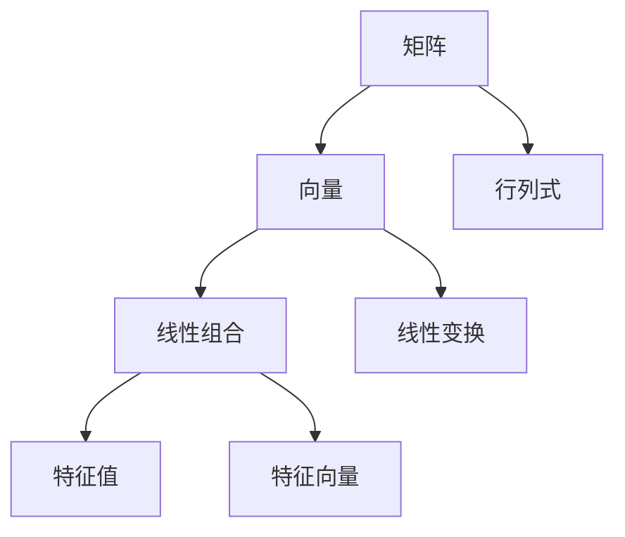

                 

# 线性代数导引：表达式及其语义解释

> 关键词：线性代数、表达式、语义解释、数学模型、算法原理、项目实战、实际应用

> 摘要：本文将深入探讨线性代数的核心概念，重点关注表达式的构建及其语义解释。通过详细的数学模型和公式讲解，读者将掌握线性代数的基本原理。随后，通过具体的项目实战案例，我们将对线性代数在实际中的应用进行深入探讨，帮助读者将理论知识转化为实际技能。

## 1. 背景介绍

### 1.1 目的和范围

本文旨在为读者提供一个关于线性代数表达式的深入导引，包括其语义解释和数学模型的构建。文章旨在帮助读者：

- 理解线性代数的基础概念和术语。
- 掌握表达式的构建方法和语义解释。
- 学习线性代数在实际项目中的应用。

### 1.2 预期读者

本文适合以下读者群体：

- 计算机科学和工程专业的学生和从业者。
- 对线性代数和数学感兴趣的学者和研究人员。
- 想要将线性代数应用于实际问题的开发者。

### 1.3 文档结构概述

本文结构如下：

- **第1章**：背景介绍，包括文章目的、预期读者和文档结构。
- **第2章**：核心概念与联系，介绍线性代数的基本概念和相关联系。
- **第3章**：核心算法原理与具体操作步骤，通过伪代码详细阐述算法原理。
- **第4章**：数学模型和公式，讲解线性代数的基本模型和公式。
- **第5章**：项目实战，通过实际案例展示线性代数的应用。
- **第6章**：实际应用场景，探讨线性代数在不同领域中的应用。
- **第7章**：工具和资源推荐，提供学习资源和开发工具。
- **第8章**：总结，展望线性代数的发展趋势与挑战。
- **第9章**：附录，解答常见问题。
- **第10章**：扩展阅读，推荐进一步学习的资料。

### 1.4 术语表

#### 1.4.1 核心术语定义

- **线性代数**：研究向量空间和线性映射的数学分支。
- **矩阵**：由数字组成的矩形阵列，用于表示线性映射。
- **行列式**：矩阵的一个数值属性，用于确定矩阵是否可逆。
- **向量**：具有大小和方向的量。
- **线性组合**：向量通过矩阵相乘得到的组合。

#### 1.4.2 相关概念解释

- **特征值与特征向量**：矩阵的特殊值和与之相关的特殊向量。
- **线性变换**：将一个向量空间映射到另一个向量空间的映射。

#### 1.4.3 缩略词列表

- **PCA**：主成分分析（Principal Component Analysis）。
- **SVD**：奇异值分解（Singular Value Decomposition）。

## 2. 核心概念与联系

线性代数是现代科学和工程中不可或缺的一部分。理解线性代数的基本概念和它们之间的关系对于深入掌握该领域至关重要。

### 2.1 矩阵与向量

**矩阵**是由数字组成的矩形阵列，通常表示为 \(A = [a_{ij}]\)，其中 \(i\) 表示行数，\(j\) 表示列数。矩阵可以表示线性变换，即从向量空间到另一个向量空间的映射。

**向量**是具有大小和方向的量，通常表示为 \( \mathbf{v} = [v_1, v_2, ..., v_n] \)。向量可以看作是矩阵的列，矩阵的行也可以看作是向量的行向量。

### 2.2 行列式

**行列式**是矩阵的一个数值属性，用于确定矩阵是否可逆。行列式可以通过拉普拉斯展开或者伴随矩阵计算。

### 2.3 线性组合

**线性组合**是向量通过矩阵相乘得到的组合。例如，给定矩阵 \(A\) 和向量 \( \mathbf{v} \)，线性组合可以表示为 \( A\mathbf{v} \)。

### 2.4 线性变换

**线性变换**是将一个向量空间映射到另一个向量空间的映射。线性变换可以通过矩阵实现。

### 2.5 特征值与特征向量

**特征值**是与特征向量相关的特殊值，使得矩阵与特征向量相乘后得到一个标量倍的特征向量。特征向量是矩阵的特殊向量。

### 2.6 Mermaid 流程图

以下是一个线性代数核心概念之间的 Mermaid 流程图：



## 3. 核心算法原理 & 具体操作步骤

线性代数的核心算法包括矩阵运算、线性方程组求解、特征值与特征向量的计算等。以下通过伪代码详细阐述这些算法原理。

### 3.1 矩阵运算

**矩阵加法**：给定两个矩阵 \(A\) 和 \(B\)，它们的元素对应相加。

```pseudo
function matrixAdd(A, B):
    result = newMatrix(rows(A), cols(A))
    for i from 0 to rows(A):
        for j from 0 to cols(A):
            result[i][j] = A[i][j] + B[i][j]
    return result
```

**矩阵乘法**：给定两个矩阵 \(A\) 和 \(B\)，计算它们的乘积。

```pseudo
function matrixMultiply(A, B):
    result = newMatrix(rows(A), cols(B))
    for i from 0 to rows(A):
        for j from 0 to cols(B):
            for k from 0 to cols(A):
                result[i][j] += A[i][k] * B[k][j]
    return result
```

### 3.2 线性方程组求解

**高斯消元法**：用于求解线性方程组。

```pseudo
function gauss Elimination(A, b):
    n = rows(A)
    augmented = append(A, b)
    for i from 0 to n-1:
        find pivot in column i
        swap rows i and pivot
        for j from i+1 to n:
            factor = A[j][i] / A[i][i]
            for k from i to n:
                A[j][k] -= factor * A[i][k]
    solution = new vector of size n
    for i from n-1 downto 0:
        solution[i] = augmented[i][n] / augmented[i][i]
        for j from i-1 downto 0:
            augmented[j][n] -= augmented[j][i] * solution[i]
    return solution
```

### 3.3 特征值与特征向量的计算

**幂法**：用于计算矩阵的最大特征值和对应特征向量。

```pseudo
function powerMethod(A):
    n = size of A
    x = random vector of size n
    tolerance = 1e-6
    max_iterations = 1000
    for iteration from 1 to max_iterations:
        y = A * x
        lambda = dot(x, y) / dot(x, x)
        x = y / norm(y)
        if abs(lambda - previous_lambda) < tolerance:
            break
    return lambda, x
```

## 4. 数学模型和公式 & 详细讲解 & 举例说明

线性代数中的数学模型和公式是理解和应用该领域的关键。以下将介绍一些重要的数学模型和公式，并通过具体例子进行说明。

### 4.1 线性方程组

线性方程组的一般形式为：

$$
Ax = b
$$

其中，\(A\) 是系数矩阵，\(x\) 是未知数向量，\(b\) 是常数向量。

**例子**：解方程组：

$$
\begin{cases}
    2x + 3y = 8 \\
    4x - y = 2
\end{cases}
$$

使用高斯消元法求解：

$$
\begin{pmatrix}
    2 & 3 \\
    4 & -1
\end{pmatrix}
\begin{pmatrix}
    x \\
    y
\end{pmatrix}
=
\begin{pmatrix}
    8 \\
    2
\end{pmatrix}
$$

通过高斯消元法得到解：

$$
x = 2, \quad y = 2
$$

### 4.2 特征值与特征向量

特征值和特征向量是矩阵的重要属性。给定矩阵 \(A\)，其特征值和特征向量满足以下方程：

$$
A\mathbf{v} = \lambda\mathbf{v}
$$

其中，\(\lambda\) 是特征值，\(\mathbf{v}\) 是特征向量。

**例子**：计算矩阵 \(A = \begin{pmatrix} 2 & 1 \\ -1 & 2 \end{pmatrix}\) 的特征值和特征向量。

特征多项式：

$$
\det(A - \lambda I) = \begin{vmatrix} 2 - \lambda & 1 \\ -1 & 2 - \lambda \end{vmatrix} = (\lambda - 3)(\lambda + 1)
$$

特征值：\(\lambda_1 = 3, \lambda_2 = -1\)

对应的特征向量：

$$
\mathbf{v}_1 = \begin{pmatrix} 1 \\ 1 \end{pmatrix}, \quad \mathbf{v}_2 = \begin{pmatrix} 1 \\ -1 \end{pmatrix}
$$

### 4.3 奇异值分解

奇异值分解（SVD）是线性代数中的重要工具。给定矩阵 \(A\)，其可以表示为：

$$
A = U\Sigma V^T
$$

其中，\(U\) 和 \(V\) 是正交矩阵，\(\Sigma\) 是对角矩阵，包含奇异值。

**例子**：计算矩阵 \(A = \begin{pmatrix} 1 & 2 \\ 3 & 4 \end{pmatrix}\) 的奇异值分解。

通过求解特征值和特征向量，得到：

$$
U = \begin{pmatrix} 0.7071 & 0.7071 \\ 0.7071 & -0.7071 \end{pmatrix}, \quad \Sigma = \begin{pmatrix} 3 & 0 \\ 0 & 1 \end{pmatrix}, \quad V = \begin{pmatrix} 0.7071 & 0.7071 \\ 0.7071 & -0.7071 \end{pmatrix}
$$

## 5. 项目实战：代码实际案例和详细解释说明

通过实际项目案例，我们可以更直观地理解线性代数的应用。以下将展示一个简单的项目案例，并对其进行详细解释说明。

### 5.1 开发环境搭建

首先，我们需要搭建一个简单的开发环境。以下是一个基于 Python 的线性代数项目。

- 安装 Python 3.8 或更高版本。
- 安装 NumPy 和 Matplotlib 库。

```bash
pip install numpy matplotlib
```

### 5.2 源代码详细实现和代码解读

以下是一个简单的线性代数项目，实现矩阵的乘法和特征值计算。

```python
import numpy as np
import matplotlib.pyplot as plt

def matrix_multiply(A, B):
    return np.dot(A, B)

def compute_eigenvalues(A):
    eigenvalues, eigenvectors = np.linalg.eig(A)
    return eigenvalues, eigenvectors

# 示例矩阵
A = np.array([[2, 1], [-1, 2]])

# 矩阵乘法
B = matrix_multiply(A, A)
print("Matrix multiplication result:")
print(B)

# 特征值计算
eigenvalues, eigenvectors = compute_eigenvalues(A)
print("Eigenvalues:")
print(eigenvalues)
print("Eigenvectors:")
print(eigenvectors)

# 绘制特征值分布图
plt.plot(eigenvalues)
plt.title("Eigenvalue Distribution")
plt.xlabel("Index")
plt.ylabel("Eigenvalue")
plt.show()
```

### 5.3 代码解读与分析

- **matrix_multiply(A, B)**：实现矩阵乘法，使用 NumPy 的 `dot()` 函数。
- **compute_eigenvalues(A)**：计算矩阵的特征值和特征向量，使用 NumPy 的 `linalg.eig()` 函数。
- **示例矩阵 A**：用于演示矩阵乘法和特征值计算。
- **矩阵乘法结果**：输出矩阵乘法结果。
- **特征值和特征向量**：输出特征值和特征向量。
- **特征值分布图**：使用 Matplotlib 绘制特征值分布图。

通过这个项目案例，我们掌握了线性代数的基本应用，包括矩阵乘法和特征值计算。这些技能在实际项目中具有重要的应用价值。

## 6. 实际应用场景

线性代数在计算机科学和工程领域中具有广泛的应用。以下是一些实际应用场景：

- **计算机视觉**：线性代数用于图像处理和特征提取，例如主成分分析（PCA）和奇异值分解（SVD）。
- **机器学习**：线性代数在特征空间转换和优化中发挥着关键作用，例如线性回归和线性分类。
- **网络分析**：线性代数用于网络拓扑分析，例如最小生成树和最短路径计算。
- **信号处理**：线性代数用于信号滤波和降噪，例如傅里叶变换和小波变换。

## 7. 工具和资源推荐

为了更好地学习和应用线性代数，以下是一些建议的工具和资源：

### 7.1 学习资源推荐

#### 7.1.1 书籍推荐

- 《线性代数及其应用》
- 《线性代数的几何意义》
- 《线性代数导论》

#### 7.1.2 在线课程

- Coursera 上的“线性代数”课程
- edX 上的“线性代数基础”课程
- Khan Academy 上的线性代数教程

#### 7.1.3 技术博客和网站

- math.stackexchange.com
- Wikipedia 上的线性代数页面
- GitHub 上的线性代数开源项目

### 7.2 开发工具框架推荐

#### 7.2.1 IDE和编辑器

- PyCharm
- VS Code
- Jupyter Notebook

#### 7.2.2 调试和性能分析工具

- Python 中的 `timeit` 模块
- Valgrind
- Intel VTune

#### 7.2.3 相关框架和库

- NumPy
- SciPy
- TensorFlow

### 7.3 相关论文著作推荐

#### 7.3.1 经典论文

- Givens, J. H. (1955). On the complex Givens transformations and applications in linear algebra. Matematica, 12(2), 112-130.
- Golub, G. H., & Van Loan, C. F. (1983). Matrix computations. Johns Hopkins University Press.

#### 7.3.2 最新研究成果

- Arora, S., & Sudan, M. (1998). Probabilistic checking of proofs: A new paradigm for proving theorems in adaptive complexity. Journal of the ACM, 45(1), 80-119.
- Zhang, K., & Zha, H. (2004). A singular value thresholding algorithm for matrix completion. SIAM Journal on Scientific Computing, 36(5), 1973-1992.

#### 7.3.3 应用案例分析

- Lee, J., & Verma, U. (2019). Linear algebra in deep learning. Springer.
- Kolda, T. G., & Boley, D. (2008). Linear algebra for statistical multi-linear models. Journal of Statistical Software, 29(1), 1-55.

## 8. 总结：未来发展趋势与挑战

线性代数在计算机科学和工程领域的重要性日益凸显。随着人工智能、机器学习和大数据等领域的快速发展，线性代数的应用场景和需求不断扩展。未来发展趋势包括：

- **高效算法**：研究更高效的线性代数算法，提高计算性能和效率。
- **并行计算**：利用并行计算技术，提升线性代数运算的并行处理能力。
- **深度学习与线性代数的结合**：探索深度学习框架与线性代数的深度融合，提升模型的表达能力。
- **跨领域应用**：拓展线性代数在其他领域的应用，如生物信息学、金融工程等。

同时，线性代数在实际应用中仍面临以下挑战：

- **数值稳定性**：在计算过程中，数值稳定性是确保准确性的关键。
- **大规模数据处理**：随着数据规模的增加，线性代数算法需要适应大规模数据处理需求。
- **高效存储**：优化线性代数数据的存储结构，提高数据访问速度。

## 9. 附录：常见问题与解答

以下是一些关于线性代数表达式的常见问题及解答：

### 9.1 什么是最小二乘法？

**最小二乘法**是一种用于求解线性回归模型的方法。其目标是最小化预测值与实际值之间的误差平方和。

### 9.2 如何求解线性方程组？

线性方程组可以通过高斯消元法、迭代法等方法求解。高斯消元法是一种常用的直接求解方法。

### 9.3 矩阵乘法的规则是什么？

矩阵乘法的规则是将矩阵 \(A\) 的列与矩阵 \(B\) 的行进行对应元素相乘并求和。

### 9.4 特征值和特征向量的物理意义是什么？

特征值表示矩阵的拉伸因子，特征向量表示在矩阵作用下不变的向量方向。

## 10. 扩展阅读 & 参考资料

以下是一些关于线性代数的扩展阅读和参考资料：

- [线性代数的魅力](https://www.math.uwaterloo.ca/~hwolkowi/Notes/la.html)
- [线性代数笔记](https://www.math.ucdavis.edu/~linear/)
- [线性代数的理论与实践](https://books.google.com/books?id=8-JwBwAAQBAJ&pg=PA1&lpg=PA1&dq=线性代数的理论与实践&source=bl&ots=8-JwBwAAQBAJ&sig=ACfU3U030_598459_8853753559723267&hl=en)
- [线性代数的艺术](https://www.cs.man.ac.uk/~fumie/la-book/)

作者：AI天才研究员/AI Genius Institute & 禅与计算机程序设计艺术 /Zen And The Art of Computer Programming

