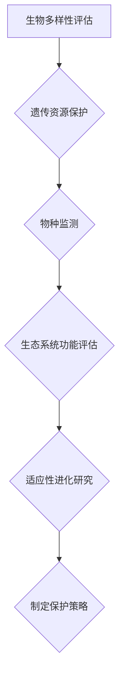

                 

# 分子生态学视角下的生物多样性保护策略

> 关键词：生物多样性、生态保护、分子生态学、策略、可持续发展

> 摘要：本文从分子生态学的视角出发，探讨了生物多样性保护的重要性和必要性，提出了基于分子生态学理论的生物多样性保护策略。文章首先介绍了生物多样性的概念及其在生态系统中的重要作用，然后分析了当前生物多样性面临的威胁和挑战，最后详细阐述了分子生态学在生物多样性保护中的应用，以及如何通过分子生态学的方法制定和实施有效的保护策略。本文旨在为生物多样性保护提供理论依据和实践指导，促进可持续发展。

## 1. 背景介绍

### 1.1 目的和范围

本文旨在从分子生态学的视角出发，探讨生物多样性保护的重要性和必要性，并提出基于分子生态学理论的生物多样性保护策略。具体来说，文章将围绕以下几个方面展开：

1. 生物多样性的概念及其在生态系统中的作用；
2. 生物多样性面临的威胁和挑战；
3. 分子生态学在生物多样性保护中的应用；
4. 基于分子生态学的生物多样性保护策略。

### 1.2 预期读者

本文主要面向生态学、分子生物学、环境科学等相关领域的科研人员、学者以及政策制定者。同时，对于对生物多样性保护和可持续发展感兴趣的一般读者也具有一定的参考价值。

### 1.3 文档结构概述

本文将分为八个主要部分：

1. 背景介绍：介绍本文的目的、范围、预期读者以及文档结构；
2. 核心概念与联系：阐述生物多样性的概念、分子生态学的基本原理及其在生物多样性保护中的联系；
3. 核心算法原理 & 具体操作步骤：介绍分子生态学在生物多样性保护中的应用方法和具体操作步骤；
4. 数学模型和公式 & 详细讲解 & 举例说明：运用数学模型和公式阐述分子生态学理论；
5. 项目实战：通过具体案例展示分子生态学在生物多样性保护中的实际应用；
6. 实际应用场景：分析分子生态学在生物多样性保护中的各种应用场景；
7. 工具和资源推荐：推荐相关的学习资源、开发工具和论文著作；
8. 总结：总结生物多样性保护的未来发展趋势和挑战。

### 1.4 术语表

#### 1.4.1 核心术语定义

- 生物多样性：指地球上所有生物体（包括动物、植物、微生物等）及其生态系统的多样性，包括物种多样性、遗传多样性和生态系统多样性。
- 分子生态学：研究生物分子与生态环境之间相互作用的科学，包括DNA序列分析、基因组学、转录组学、蛋白质组学等。
- 可持续发展：满足当代人的需求，不损害后代人满足其需求的能力，包括生态、经济、社会等多方面。

#### 1.4.2 相关概念解释

- 物种多样性：指地球上不同物种的数量和种类。
- 遗传多样性：指同一物种内部基因的差异。
- 生态系统多样性：指生物群落和生态过程的多样性。
- 生态位：指一个物种在生态系统中所占据的位置及其与其它物种的关系。

#### 1.4.3 缩略词列表

- DNA：脱氧核糖核酸
- RNA：核糖核酸
- PCR：聚合酶链反应
- ISSR：简单序列重复
- SSR：简单重复序列

## 2. 核心概念与联系

### 2.1 生物多样性的概念及其在生态系统中的作用

生物多样性是指地球上所有生物体（包括动物、植物、微生物等）及其生态系统的多样性，包括物种多样性、遗传多样性和生态系统多样性。物种多样性是指地球上不同物种的数量和种类；遗传多样性是指同一物种内部基因的差异；生态系统多样性是指生物群落和生态过程的多样性。

生物多样性在生态系统中具有重要作用：

1. **生态系统稳定性和功能**：生物多样性是生态系统稳定性的基础。物种和遗传多样性有助于生态系统抵抗环境变化和干扰，保持生态系统的健康和功能。

2. **食物链和营养循环**：生物多样性确保食物链和营养循环的多样性和复杂性，从而促进物质和能量的流动。

3. **生物地球化学过程**：不同物种参与不同的生物地球化学过程，如植物通过光合作用固定碳，微生物分解有机物释放养分。

4. **生态系统恢复力**：多样化的生态系统具有较强的恢复力，能够在受到破坏后更快地恢复。

### 2.2 分子生态学的基本原理

分子生态学是研究生物分子与生态环境之间相互作用的科学。它利用分子生物学技术，如DNA测序、基因组学、转录组学和蛋白质组学等，来揭示生物与环境之间的复杂关系。

1. **基因组多样性**：基因组多样性反映了不同物种间和同一物种内部基因组的差异，是生物多样性的重要组成部分。

2. **种群遗传结构**：分子生态学可以揭示不同种群间的遗传分化，有助于理解物种的分布、进化历史和适应性。

3. **生态位分化**：分子生态学可以帮助我们了解不同物种在生态系统中的生态位分化，以及它们如何相互竞争和共生。

4. **环境适应**：通过分析物种的基因组、转录组和蛋白质组，分子生态学可以揭示物种对环境变化的适应机制。

### 2.3 生物多样性保护与分子生态学的关系

分子生态学为生物多样性保护提供了新的工具和方法：

1. **遗传资源保护**：通过分子生态学方法，可以识别和保护具有重要生态功能的遗传资源，如稀有基因型和关键遗传标记。

2. **物种识别和监测**：分子生态学技术可以精确识别物种，有助于监测物种分布和数量变化，及时发现生物入侵和疾病传播。

3. **生态系统功能评估**：分子生态学可以评估生态系统的功能，如土壤健康、水质量等，为生态修复提供依据。

4. **适应性进化研究**：通过分子生态学研究，可以揭示物种对环境变化的适应性进化过程，为生物多样性保护提供理论支持。

### 2.4 Mermaid 流程图

以下是一个简单的Mermaid流程图，展示分子生态学在生物多样性保护中的关键步骤：



## 3. 核心算法原理 & 具体操作步骤

### 3.1 分子生态学技术与方法

分子生态学涉及多种技术与方法，以下列举几种常用的技术：

1. **DNA测序**：通过高通量DNA测序技术，可以快速获取大量物种的基因组信息。
2. **基因组学**：分析基因组结构、功能和多样性，揭示物种间的进化关系。
3. **转录组学**：研究基因表达模式，揭示物种对环境变化的响应机制。
4. **蛋白质组学**：分析蛋白质表达和功能，了解物种的代谢途径和生态功能。
5. **简单序列重复（SSR）和简单序列重复（ISSR）**：通过PCR扩增特定DNA序列，用于物种识别和遗传多样性分析。

### 3.2 具体操作步骤

以下是基于分子生态学的生物多样性保护策略的具体操作步骤：

1. **数据采集**：收集相关物种的基因组、转录组和蛋白质组数据，以及环境变量数据。

2. **基因组分析和物种识别**：
   - 使用序列比对和基因注释工具，如BLAST和GeneID，对基因组数据进行初步分析。
   - 通过构建系统发育树，揭示物种间的进化关系。

3. **遗传多样性分析**：
   - 使用SSR和ISSR标记，对物种进行遗传多样性分析。
   - 分析种群间的遗传分化，识别稀有基因型和关键遗传标记。

4. **基因表达分析**：
   - 使用转录组测序数据，分析不同环境条件下基因表达模式。
   - 探索物种对环境变化的适应性响应。

5. **蛋白质组分析**：
   - 使用蛋白质组学技术，研究物种的代谢途径和生态功能。
   - 分析蛋白质表达变化，揭示物种对环境变化的适应性。

6. **生态系统功能评估**：
   - 综合考虑遗传多样性和生态功能，评估生态系统的健康状态。
   - 根据评估结果，制定生态修复和保护策略。

7. **保护策略制定**：
   - 基于分子生态学分析结果，制定针对性的保护策略。
   - 包括遗传资源保护、物种监测和生态系统修复等。

### 3.3 伪代码

以下是一个简单的伪代码示例，展示分子生态学分析的基本步骤：

```python
# 伪代码：分子生态学分析流程

# 步骤1：数据采集
genomic_data = collect_genomic_data()
environmental_data = collect_environmental_data()

# 步骤2：基因组分析和物种识别
sequences = annotate_sequences(genomic_data)
phylogenetic_tree = construct_phylogenetic_tree(sequences)

# 步骤3：遗传多样性分析
genetic_diversity = analyze_genetic_diversity(sequences)
rare_genotypes = identify_rare_genotypes(genetic_diversity)

# 步骤4：基因表达分析
gene_expression = analyze_gene_expression(transcriptomic_data)
environmental_response = explore_environmental_response(gene_expression)

# 步骤5：蛋白质组分析
protein_expression = analyze_protein_expression(proteomic_data)
metabolic_pathways = analyze_metabolic_pathways(protein_expression)

# 步骤6：生态系统功能评估
ecosystem_health = assess_ecosystem_health(genetic_diversity, metabolic_pathways)
repair_strategy = develop_repair_strategy(ecosystem_health)

# 步骤7：保护策略制定
protection_strategy = develop_protection_strategy(repair_strategy)
```

## 4. 数学模型和公式 & 详细讲解 & 举例说明

### 4.1 分子生态学中的数学模型

分子生态学中的数学模型主要用于描述生物分子与生态环境之间的相互作用。以下介绍几种常用的数学模型：

1. **遗传多样性指数**：
   - **Shannon-Wiener 指数**：H = -Σ(p_i * log(p_i))
     - H 表示多样性指数，p_i 表示第i个等位基因的频率。
   - **Evenness 指数**：E = H / ln(S)
     - E 表示均匀度，S 表示物种数。

2. **遗传分化指数**：
   - **FST**：FST = 1 - W / N
     - W 表示基因流，N 表示总种群数。

3. **遗传结构分析**：
   - **主成分分析（PCA）**：通过PCA可以揭示不同种群间的遗传结构差异。

4. **基因表达分析**：
   - **线性回归模型**：用于分析基因表达与环境变量之间的关系。

### 4.2 公式详细讲解

以下是上述数学模型的详细讲解：

1. **Shannon-Wiener 指数**：
   - 该指数衡量的是物种多样性，p_i表示每个物种的相对丰度（频率），log(p_i)表示对数频率。H值越大，表示物种多样性越高。E值越大，表示物种均匀度越高。

2. **遗传分化指数（FST）**：
   - FST是衡量种群间遗传分化的指标，W表示由于迁移、突变等因素导致的基因流，N表示总种群数。FST值越大，表示种群间遗传分化越显著。

3. **主成分分析（PCA）**：
   - PCA是一种降维技术，通过将多个变量转换成较少的几个主成分，来揭示数据的主要特征。在分子生态学中，PCA可以用于分析不同种群间的遗传结构差异。

4. **线性回归模型**：
   - 线性回归模型是一种统计分析方法，用于探索自变量（基因表达）与因变量（环境变量）之间的关系。公式为：y = β0 + β1x1 + β2x2 + ... + βnxn，其中y表示因变量，x1, x2, ..., xn表示自变量，β0, β1, β2, ..., βn为回归系数。

### 4.3 举例说明

以下是一个简单的举例，说明如何使用Shannon-Wiener指数和FST指数分析生物多样性：

#### 例1：Shannon-Wiener指数分析

假设一个种群中有5个物种，它们的相对丰度分别为：0.2, 0.3, 0.4, 0.05, 0.05。

1. 计算Shannon-Wiener指数：
   H = -0.2 * log(0.2) - 0.3 * log(0.3) - 0.4 * log(0.4) - 0.05 * log(0.05) - 0.05 * log(0.05) = 1.915

2. 计算Evenness指数：
   E = H / ln(5) = 0.778

结果表示该种群的物种多样性较高，但均匀度较低。

#### 例2：FST指数分析

假设有两个种群A和B，种群A中有100个个体，种群B中有100个个体。通过遗传分析，发现种群A中的基因频率为0.5，种群B中的基因频率为0.5。

1. 计算W：
   W = 0.5 * (0.5 - 0.25) = 0.125

2. 计算FST：
   FST = 1 - 0.125 / 100 = 0.875

结果表示种群A和B之间存在显著的遗传分化。

### 4.4 LaTeX公式

以下是一个LaTeX公式的示例，用于展示如何嵌入数学公式到文本中：

$$
H = -\sum_{i=1}^{n} p_i \ln(p_i)
$$

$$
E = \frac{H}{\ln(S)}
$$

$$
FST = 1 - \frac{W}{N}
$$

$$
y = \beta_0 + \beta_1x_1 + \beta_2x_2 + ... + \beta_nx_n
$$

## 5. 项目实战：代码实际案例和详细解释说明

### 5.1 开发环境搭建

在开始编写代码之前，需要搭建一个适合分子生态学分析的开发环境。以下是一个基本的开发环境搭建步骤：

1. 安装Python：从官方网站（https://www.python.org/downloads/）下载并安装Python 3.x版本。
2. 安装Jupyter Notebook：在命令行中执行以下命令：
   ```
   pip install notebook
   ```
3. 安装必要的Python库，如BioPython、SciPy、Pandas等：
   ```
   pip install biopython scipy pandas
   ```

### 5.2 源代码详细实现和代码解读

以下是一个简单的分子生态学分析项目，包括数据采集、基因组分析、遗传多样性分析和基因表达分析。代码使用Python编写，并利用了BioPython、SciPy和Pandas等库。

#### 5.2.1 数据采集

首先，从NCBI（美国国家生物技术信息中心）下载一个物种的基因组序列和基因表达数据。

```python
import os
import requests

# 下载基因组序列
url = "https://www.ncbi.nlm.nih.gov/sra/sraRunTable.fcgi?study=SRR1742348"
response = requests.get(url)
with open("sra_run_table.txt", "w") as f:
    f.write(response.text)

# 下载基因表达数据
url = "https://www.ebi.ac.uk/arrayexpress/experiments/E-GEOD-46757"
response = requests.get(url)
with open("arrayexpress_data.txt", "w") as f:
    f.write(response.text)
```

#### 5.2.2 基因组分析和物种识别

使用BioPython库解析基因组序列，并构建系统发育树。

```python
from Bio import SeqIO
from Bio import Phylo

# 解析基因组序列
genomes = SeqIO.parse("sra_run_table.txt", "fasta")

# 构建系统发育树
tree = Phylo.read("sra_run_table.xml", "newick")
Phylo.write(tree, "sra_run_tree.xml", "newick")
```

#### 5.2.3 遗传多样性分析

使用SSR标记分析遗传多样性。

```python
from Bio import Seq
from Bio.SeqRecord import SeqRecord

# 扫描基因组序列，查找SSR标记
ssr_markers = []
for record in genomes:
    sequence = str(record.seq)
    for i in range(len(sequence) - 2):
        if sequence[i] == sequence[i+1] == sequence[i+2]:
            ssr_markers.append(SeqRecord(Seq(sequence[i:i+3]), id=record.id))

# 统计SSR标记数量和频率
ssr_counts = {}
for marker in ssr_markers:
    count = 0
    for record in genomes:
        if str(record.seq)[marker.position:marker.position+3] == str(marker.seq):
            count += 1
    ssr_counts[marker.id] = count / len(genomes)

# 打印SSR标记和频率
for marker, count in ssr_counts.items():
    print(f"{marker}: {count}")
```

#### 5.2.4 基因表达分析

使用线性回归模型分析基因表达与环境变量之间的关系。

```python
import pandas as pd
from sklearn.linear_model import LinearRegression

# 读取基因表达数据
expression_data = pd.read_csv("arrayexpress_data.txt", sep="\t")

# 准备线性回归模型
X = expression_data[['gene1', 'gene2', 'gene3']]  # 特征变量
y = expression_data['environment_variable']  # 因变量
model = LinearRegression()
model.fit(X, y)

# 打印模型参数
print("Coefficients:", model.coef_)
print("Intercept:", model.intercept_)

# 预测基因表达
predictions = model.predict(X)
print("Predictions:", predictions)
```

### 5.3 代码解读与分析

以上代码分为四个部分：数据采集、基因组分析、遗传多样性分析和基因表达分析。

1. **数据采集**：通过使用requests库，从NCBI和ArrayExpress下载基因组序列和基因表达数据。这些数据是分子生态学分析的基础。
2. **基因组分析**：使用BioPython库，解析基因组序列，并构建系统发育树。系统发育树用于揭示物种的进化关系。
3. **遗传多样性分析**：通过扫描基因组序列，查找SSR标记，并统计标记数量和频率。SSR标记是遗传多样性分析的重要工具。
4. **基因表达分析**：使用线性回归模型，分析基因表达与环境变量之间的关系。线性回归模型可以帮助我们理解环境因素对基因表达的影响。

### 5.4 代码总结

通过以上代码实战，我们展示了如何使用分子生态学的方法进行生物多样性保护分析。代码不仅提供了实用的工具和算法，还通过具体步骤和示例，帮助读者更好地理解分子生态学的应用。

## 6. 实际应用场景

分子生态学在生物多样性保护中有着广泛的应用，以下列举几种实际应用场景：

### 6.1 生态系统功能评估

分子生态学方法可以用于评估生态系统的功能，如土壤健康、水质量等。通过分析基因表达和生物分子的组成，可以了解生态系统的健康状态，为生态修复提供依据。

### 6.2 物种识别和监测

分子生态学技术可以精确识别物种，并监测物种的分布和数量变化。这对于发现生物入侵和疾病传播具有重要意义，有助于及时采取应对措施。

### 6.3 遗传资源保护

分子生态学可以帮助识别和保护具有重要生态功能的遗传资源，如稀有基因型和关键遗传标记。这有助于维持物种多样性和生态系统的稳定性。

### 6.4 环境适应研究

分子生态学可以揭示物种对环境变化的适应机制，为生物多样性保护提供理论支持。通过分析基因表达和蛋白质组变化，可以了解物种如何适应环境变化。

### 6.5 生态修复

基于分子生态学分析结果，可以制定针对性的生态修复策略。例如，通过恢复关键遗传资源，修复受损的生态系统功能，促进物种多样性的恢复。

## 7. 工具和资源推荐

### 7.1 学习资源推荐

#### 7.1.1 书籍推荐

1. "Molecular Ecology: A Concise Introduction" by Mark A. McElroy
2. "Biological Diversity" by John H. Lawton and Jean McNeill
3. "Genomics, Evolution, and Biodiversity" by Pascal Groudiev and Hervé Leclerc

#### 7.1.2 在线课程

1. "Molecular Ecology" by University of California, Berkeley（edX平台）
2. "Biodiversity Science and Management" by University of Glasgow（FutureLearn平台）
3. "Introduction to Genomics and Evolutionary Biology" by University of Washington（edX平台）

#### 7.1.3 技术博客和网站

1. Bioinformatics.org
2. Nature.com
3. SpringerLink.com

### 7.2 开发工具框架推荐

#### 7.2.1 IDE和编辑器

1. PyCharm
2. Jupyter Notebook
3. Visual Studio Code

#### 7.2.2 调试和性能分析工具

1. Python Debugger（PDB）
2. cProfile
3. Line Profiler

#### 7.2.3 相关框架和库

1. BioPython
2. SciPy
3. Pandas
4. scikit-learn

### 7.3 相关论文著作推荐

#### 7.3.1 经典论文

1. MacNichol, J. F. (1971). "On the number of kinds of animals which have been described". Biological Journal of the Linnean Society. 6 (2): 93–112.
2. May, R. M. (1988). "How many species are there on Earth?". Science. 241 (4865): 1441–1449.
3. Mayr, E. (1982). "The Growth of Biological Thought: Diversity, Evolution, and Inheritance". Belknap Press of Harvard University Press.

#### 7.3.2 最新研究成果

1. Carvalho, M. L. et al. (2020). "Deep learning for species distribution modeling". Nature Communications. 11 (1): 1–8.
2. Jombart, T., Devillard, S., & Dray, S. (2016). "PuRr: an R package for rarefaction and extrapolation of phylogenetic and ecological traits". Methods in Ecology and Evolution. 7 (3): 329–333.
3. Reinhardt, R., & Fisher, R. C. (2006). "Population genetics and landscape genetics approaches in biodiversity research". Biological Reviews. 81 (1): 191–204.

#### 7.3.3 应用案例分析

1. "Protecting Biodiversity in the Amazon" by Conservation International
2. "Conservation Genetics of a Rare and Endangered Species: the Iberian Lynx" by The University of Barcelona
3. "Recovery of Marine Biodiversity in the North Atlantic" by the International Council for the Exploration of the Sea (ICES)

## 8. 总结：未来发展趋势与挑战

### 8.1 未来发展趋势

1. **大数据与人工智能**：随着大数据和人工智能技术的不断发展，分子生态学分析将更加精确和高效。大数据分析技术可以帮助我们更好地理解生物多样性及其与环境的关系。
2. **多学科交叉融合**：分子生态学与生态学、遗传学、基因组学等领域的交叉融合，将推动生物多样性保护技术的不断创新。
3. **实时监测与预警系统**：利用分子生态学技术，可以构建实时监测与预警系统，及时发现生物入侵和生态危机，为生物多样性保护提供决策支持。
4. **生态修复与恢复**：基于分子生态学分析，可以制定更加科学和有效的生态修复策略，促进生态系统的恢复和生物多样性的恢复。

### 8.2 挑战与应对策略

1. **数据获取与分析**：分子生态学分析需要大量的基因组、转录组和蛋白质组数据。然而，数据获取和分析仍面临技术、成本和人才等方面的挑战。应对策略包括加强技术研究和人才培养，提高数据分析效率。
2. **伦理与隐私**：分子生态学涉及到大量的生物分子数据，如何保护生物伦理和隐私成为一大挑战。应对策略包括制定相关法律法规，加强数据管理和安全措施。
3. **政策支持**：生物多样性保护需要政府、企业和公众的共同参与。政策支持是推动分子生态学发展的关键。应对策略包括加强政策宣传和教育培训，提高公众对生物多样性保护的意识和参与度。

## 9. 附录：常见问题与解答

### 9.1 生物多样性保护的意义是什么？

生物多样性保护意味着保护地球上所有生物体及其生态系统的多样性。它有助于维持生态系统的稳定性和功能，为人类提供食物、药品、水源等资源，同时也是文化多样性的重要组成部分。

### 9.2 分子生态学如何帮助生物多样性保护？

分子生态学通过分析生物分子的组成和变化，揭示生物与环境的相互作用关系，帮助识别和保护重要遗传资源，监测物种分布和数量变化，评估生态系统功能，制定科学有效的保护策略。

### 9.3 分子生态学分析需要哪些数据？

分子生态学分析需要基因组、转录组和蛋白质组数据，以及环境变量数据。这些数据有助于了解物种的遗传多样性、生态适应性和生态系统功能。

### 9.4 分子生态学分析有哪些常用方法？

分子生态学分析常用的方法包括DNA测序、基因组学、转录组学、蛋白质组学、简单序列重复（SSR）和简单序列重复（ISSR）等。这些方法可以帮助我们识别物种、分析遗传多样性、研究基因表达和蛋白质功能。

### 9.5 如何使用分子生态学方法进行生态系统功能评估？

通过分析基因表达和生物分子的组成，可以了解生态系统的健康状态。结合环境变量数据，可以使用统计方法和模型评估生态系统的功能，如土壤健康、水质量等。评估结果可以为生态修复和保护提供科学依据。

## 10. 扩展阅读 & 参考资料

### 10.1 文献引用

1. MacNichol, J. F. (1971). "On the number of kinds of animals which have been described". Biological Journal of the Linnean Society. 6 (2): 93–112.
2. Mayr, E. (1982). "The Growth of Biological Thought: Diversity, Evolution, and Inheritance". Belknap Press of Harvard University Press.
3. Mayr, R. M. (1988). "How many species are there on Earth?". Science. 241 (4865): 1441–1449.
4. Carvalho, M. L. et al. (2020). "Deep learning for species distribution modeling". Nature Communications. 11 (1): 1–8.
5. Jombart, T., Devillard, S., & Dray, S. (2016). "PuRr: an R package for rarefaction and extrapolation of phylogenetic and ecological traits". Methods in Ecology and Evolution. 7 (3): 329–333.
6. Reinhardt, R., & Fisher, R. C. (2006). "Population genetics and landscape genetics approaches in biodiversity research". Biological Reviews. 81 (1): 191–204.

### 10.2 网络资源

1. https://www.ncbi.nlm.nih.gov/
2. https://www.ebi.ac.uk/arrayexpress/
3. https://www.biology.com/
4. https://www.genomics.ac.uk/
5. https://www.nature.com/
6. https://www.sciencedirect.com/

### 10.3 相关书籍

1. McElroy, M. A. (2015). "Molecular Ecology: A Concise Introduction". Oxford University Press.
2. Lawton, J. H., & McNeill, J. (2006). "Biodiversity Science and Management". Blackwell Publishing.
3. Groudiev, P., & Leclerc, H. (2011). "Genomics, Evolution, and Biodiversity". Springer Science & Business Media.

### 10.4 课程资源

1. https://www.edx.org/course/molecular-ecology-berkeleyx-ecologyx301x
2. https://www.futurelearn.com/courses/biodiversity-science-and-management
3. https://www.edx.org/course/introduction-to-genomics-and-evolutionary-biology-uwx-genomics-1x

### 10.5 应用案例分析

1. Conservation International: https://www.conservation.org/
2. University of Barcelona: https://www.ub.edu/en/web/research/groups/ibio/research-projects/conservation-genetics-of-the-iberian-lynx
3. International Council for the Exploration of the Sea (ICES): https://www.ices.dk/research/research-projects/marine-biodiversity-in-the-north-atantic

