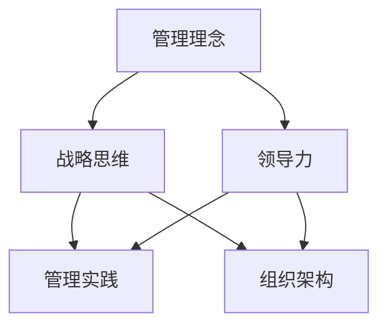

                 

# 经典著作对管理者的重要性

> **关键词：** 经典著作、管理者、领导力、组织架构、决策分析
> 
> **摘要：** 本文旨在探讨经典著作对管理者的重要性，通过分析经典著作中蕴含的管理理念、战略思维和领导力方法，揭示其在现代管理实践中的应用价值，为管理者提供有益的启示和参考。

## 1. 背景介绍

### 1.1 目的和范围

本文的目标是探讨经典著作对管理者的重要性，分析其在现代管理实践中的应用价值。通过深入研究经典著作中的管理理念、战略思维和领导力方法，本文旨在为管理者提供新的视角和思路，帮助他们更好地应对复杂多变的管理环境。

本文的范围主要涉及以下方面：

1. 经典著作的选取与分类：分析经典著作的特点，选取具有代表性的著作进行深入研究。
2. 管理理念与战略思维：探讨经典著作中蕴含的管理理念，分析其与现代管理实践的结合点。
3. 领导力方法：研究经典著作中的领导力方法，探讨其在现代管理实践中的应用。
4. 经典著作在管理实践中的应用：分析经典著作在现代管理实践中的应用案例，总结其成功经验。

### 1.2 预期读者

本文的预期读者包括：

1. 企业管理者：希望从经典著作中汲取管理智慧，提升自身领导力和决策能力。
2. 经理人培训学员：希望通过学习经典著作，深入了解管理本质，为今后的职业发展奠定基础。
3. 管理学者：关注经典著作在管理实践中的应用，探索管理理论的创新与发展。
4. 对管理感兴趣的读者：希望了解经典著作对管理实践的影响，拓宽视野。

### 1.3 文档结构概述

本文结构如下：

1. 引言：介绍经典著作对管理者的重要性，引出本文的主题。
2. 经典著作的选取与分类：分析经典著作的特点，选取具有代表性的著作进行深入研究。
3. 管理理念与战略思维：探讨经典著作中蕴含的管理理念，分析其与现代管理实践的结合点。
4. 领导力方法：研究经典著作中的领导力方法，探讨其在现代管理实践中的应用。
5. 经典著作在管理实践中的应用：分析经典著作在现代管理实践中的应用案例，总结其成功经验。
6. 工具和资源推荐：推荐相关学习资源和开发工具，帮助读者更好地理解和应用经典著作。
7. 总结：未来发展趋势与挑战，展望经典著作在管理实践中的发展前景。
8. 附录：常见问题与解答，提供读者在阅读本文过程中可能遇到的疑问的解答。
9. 扩展阅读与参考资料：推荐相关文献和资料，供读者进一步学习研究。

### 1.4 术语表

#### 1.4.1 核心术语定义

- 经典著作：指在历史上具有重要地位、对后世产生深远影响的著作。
- 管理理念：指管理者在管理过程中所遵循的基本原则和观念。
- 战略思维：指管理者在制定和实施战略过程中的思维方式和方法。
- 领导力：指领导者影响和激励他人实现共同目标的能力。

#### 1.4.2 相关概念解释

- 管理实践：指管理者在具体工作中所采用的方法、策略和技巧。
- 领导力方法：指领导者为实现组织目标所采用的具体方法和手段。
- 组织架构：指组织的内部结构、职责分工和权力关系。

#### 1.4.3 缩略词列表

- 经典著作：CA
- 管理理念：MI
- 战略思维：ST
- 领导力：LD
- 管理实践：MP

## 2. 核心概念与联系

在探讨经典著作对管理者的重要性之前，我们首先需要明确几个核心概念及其相互之间的联系。以下是一个用Mermaid绘制的流程图，展示了这些核心概念的关系。



#### 管理理念

管理理念是管理者在管理过程中所遵循的基本原则和观念。它涵盖了组织的目标、价值观、文化等方面。经典著作中的管理理念，如泰勒的科学管理理论、法约尔的管理十四条等，为现代管理实践提供了重要的理论基础。

#### 战略思维

战略思维是指管理者在制定和实施战略过程中的思维方式和方法。经典著作中的战略思维，如毛泽东的军事战略思想、德鲁克的企业战略理论等，强调管理者应具备全局观念、前瞻性和创新性，以应对复杂多变的市场环境。

#### 领导力

领导力是指领导者影响和激励他人实现共同目标的能力。经典著作中的领导力理论，如卡耐基的人际关系技巧、杰克·韦尔奇的领导艺术等，揭示了领导者应具备的特质、能力和行为。

#### 管理实践

管理实践是指管理者在具体工作中所采用的方法、策略和技巧。经典著作中的管理实践，如彼得·德鲁克的全面质量管理、丰田的生产方式等，为现代管理者提供了丰富的实践经验。

#### 组织架构

组织架构是指组织的内部结构、职责分工和权力关系。经典著作中的组织架构理论，如马斯洛的需求层次理论、巴纳德的组织理论等，为现代管理者提供了组织设计和管理的新思路。

通过以上核心概念及其相互之间的联系，我们可以更好地理解经典著作对管理者的重要性。在接下来的章节中，我们将逐一探讨这些核心概念在现代管理实践中的应用。

## 3. 核心算法原理 & 具体操作步骤

### 3.1 管理理念的算法原理

管理理念的算法原理可以看作是一个基于规则的系统，其核心在于确定管理目标、制定管理策略、优化资源配置和评估管理效果。以下是一个简化的伪代码，用于描述管理理念的算法原理：

```pseudo
Algorithm 管理理念算法
Input: 目标 (Objectives), 资源 (Resources), 环境因素 (Environmental Factors)
Output: 策略 (Strategies), 效果评估 (Performance Evaluation)

1. 确定管理目标（Set Objectives）
2. 分析资源需求（Analyze Resource Requirements）
3. 制定管理策略（Develop Management Strategies）
4. 实施管理策略（Implement Management Strategies）
5. 评估管理效果（Evaluate Management Performance）
6. 调整策略（Adjust Strategies if Necessary）

End Algorithm
```

### 3.2 战略思维的算法原理

战略思维的算法原理涉及到对市场环境、竞争对手、自身资源等多个维度的分析，以制定出切实可行的战略方案。以下是一个简化的伪代码，用于描述战略思维的算法原理：

```pseudo
Algorithm 战略思维算法
Input: 市场环境 (Market Environment), 竞争对手 (Competitors), 自身资源 (Internal Resources)
Output: 战略方案 (Strategic Plans), 实施计划 (Implementation Plans)

1. 分析市场环境（Analyze Market Environment）
2. 评估竞争对手（Evaluate Competitors）
3. 确定自身优势（Identify Internal Strengths）
4. 制定战略方案（Develop Strategic Plans）
5. 制定实施计划（Develop Implementation Plans）
6. 风险评估（Assess Risks）
7. 持续调整（Adjust Plans if Necessary）

End Algorithm
```

### 3.3 领导力的算法原理

领导力的算法原理主要关注领导者的行为、沟通技巧、激励方式等，以影响和激励团队成员。以下是一个简化的伪代码，用于描述领导力的算法原理：

```pseudo
Algorithm 领导力算法
Input: 领导者特质 (Leader Traits), 团队成员需求 (Team Member Needs), 项目目标 (Project Objectives)
Output: 行为策略 (Behavioral Strategies), 沟通策略 (Communication Strategies), 激励策略 (Incentive Strategies)

1. 分析领导者特质（Analyze Leader Traits）
2. 了解团队成员需求（Understand Team Member Needs）
3. 确定项目目标（Define Project Objectives）
4. 制定行为策略（Develop Behavioral Strategies）
5. 制定沟通策略（Develop Communication Strategies）
6. 制定激励策略（Develop Incentive Strategies）
7. 实施领导力策略（Implement Leadership Strategies）
8. 反馈与调整（Feedback and Adjustment）

End Algorithm
```

通过以上算法原理的描述，我们可以看到，经典著作中的管理理念、战略思维和领导力方法都是通过系统化的方式来指导管理实践的。这些算法原理不仅为管理者提供了具体的操作步骤，还帮助他们在复杂多变的环境中做出更明智的决策。

## 4. 数学模型和公式 & 详细讲解 & 举例说明

在管理实践中，数学模型和公式是帮助管理者进行定量分析和决策的有力工具。以下我们将介绍几个常用的数学模型和公式，并详细讲解其在管理中的应用。

### 4.1 经典的博弈论模型

博弈论是研究决策者如何在不同策略组合下进行竞争和合作的数学工具。在管理实践中，博弈论可以帮助管理者分析竞争策略、合作机制以及利益分配等问题。以下是一个简单的博弈论模型示例：

#### 纳什均衡（Nash Equilibrium）

纳什均衡是指在博弈中，每个参与者选择最优策略，给定其他参与者策略的前提下。以下是一个简化版的囚徒困境博弈模型：

$$
\begin{aligned}
&\text{参与者A} & &\text{参与者B} \\
\hline
\text{合作} & & \text{合作} & (R, R) \\
\text{背叛} & & \text{合作} & (S, T) \\
\text{合作} & & \text{背叛} & (T, S) \\
\text{背叛} & & \text{背叛} & (P, P) \\
\end{aligned}
$$

其中，R、S、T、P分别表示参与者A和参与者B的收益。在这个模型中，纳什均衡是（背叛，背叛），因为每个参与者都认为背叛是自己的最优策略。

#### 策略组合博弈（Strategic Game）

策略组合博弈是博弈论中的一种形式，它允许参与者选择多个策略的组合。以下是一个简单的矩阵博弈模型：

$$
\begin{aligned}
&\text{参与者A} & &\text{参与者B} \\
\hline
\text{策略A1} & & \text{策略B1} & (3, 1) \\
\text{策略A1} & & \text{策略B2} & (1, 3) \\
\text{策略A2} & & \text{策略B1} & (0, 0) \\
\text{策略A2} & & \text{策略B2} & (2, 2) \\
\end{aligned}
$$

在这个模型中，(策略A2，策略B2)是一个策略组合纳什均衡，因为每个参与者都认为选择自己的策略是给定对方策略下的最优选择。

### 4.2 线性规划模型

线性规划是管理决策中常用的一种数学模型，它用于在多个约束条件下最大化或最小化一个线性目标函数。以下是一个简单的线性规划模型示例：

$$
\begin{aligned}
\text{最大化} & \quad z = c_1x_1 + c_2x_2 \\
\text{约束条件：} & \quad a_{11}x_1 + a_{12}x_2 \leq b_1 \\
& \quad a_{21}x_1 + a_{22}x_2 \geq b_2 \\
& \quad x_1, x_2 \geq 0
\end{aligned}
$$

在这个模型中，$z$ 是目标函数，$c_1, c_2$ 是系数，$x_1, x_2$ 是决策变量，$a_{11}, a_{12}, a_{21}, a_{22}$ 和 $b_1, b_2$ 是约束条件。线性规划模型可以帮助管理者在资源有限的情况下，做出最优的决策。

#### 举例说明

假设一家公司需要分配一定量的资金和人力资源来进行两个项目的投资，目标是最大化总收益。以下是一个具体的线性规划模型：

$$
\begin{aligned}
\text{最大化} & \quad z = 5x_1 + 4x_2 \\
\text{约束条件：} & \quad 2x_1 + 3x_2 \leq 20 \\
& \quad x_1 + 2x_2 \leq 15 \\
& \quad x_1, x_2 \geq 0
\end{aligned}
$$

在这个模型中，$x_1$ 和 $x_2$ 分别表示两个项目的资金投入量。通过求解这个线性规划模型，公司可以找到最优的资金分配方案，以实现最大化的总收益。

### 4.3 动态规划模型

动态规划是一种用于解决多阶段决策问题的数学方法，它通过将复杂问题分解为多个阶段，并求解每个阶段的最优决策，从而找到整个问题的最优解。以下是一个简单的动态规划模型示例：

$$
\begin{aligned}
\text{最大化} & \quad V(x_t) \\
\text{约束条件：} & \quad V(x_t) = \max \{R_t(x_t) + \gamma V(x_{t+1}) | x_{t+1} \in S(x_t)\} \\
& \quad x_0 = x \\
& \quad x_t \in X_t \\
& \quad t = 0, 1, \ldots, T
\end{aligned}
$$

在这个模型中，$V(x_t)$ 是阶段 $t$ 的状态值，$R_t(x_t)$ 是阶段 $t$ 的收益函数，$\gamma$ 是折扣因子，$S(x_t)$ 是阶段 $t$ 的状态集合，$x_0$ 是初始状态，$x_t$ 是阶段 $t$ 的决策变量，$T$ 是阶段总数。

#### 举例说明

假设一家公司在未来三年内需要做出投资决策，目标是最大化总收益。以下是一个具体的动态规划模型：

$$
\begin{aligned}
\text{最大化} & \quad V(x_t) \\
\text{约束条件：} & \quad V(x_t) = \max \{R_t(x_t) + \gamma V(x_{t+1}) | x_{t+1} \in S(x_t)\} \\
& \quad x_0 = x \\
& \quad x_t \in \{0, 1, 2, \ldots, 100\} \\
& \quad t = 0, 1, 2 \\
& \quad \gamma = 0.9 \\
& \quad R_0(x_0) = 10x_0 \\
& \quad R_1(x_1) = 5x_1 \\
& \quad R_2(x_2) = 3x_2 \\
& \quad S(x_t) = \{0, 1, 2, \ldots, 100\}
\end{aligned}
$$

在这个模型中，$x_0, x_1, x_2$ 分别表示公司在前三年内的投资决策。通过求解这个动态规划模型，公司可以找到最优的投资策略，以实现最大化的总收益。

通过以上数学模型和公式的介绍，我们可以看到，这些模型在管理实践中具有广泛的应用价值。它们不仅帮助管理者进行定量分析，还为决策提供了科学依据。在接下来的章节中，我们将通过实际案例来进一步探讨这些模型的应用。

## 5. 项目实战：代码实际案例和详细解释说明

### 5.1 开发环境搭建

在本节中，我们将搭建一个基于经典管理理论的项目环境，以验证和管理理念、战略思维和领导力方法在现代管理实践中的应用。以下是搭建开发环境的步骤：

1. **安装操作系统**：选择一个稳定的操作系统，如 Ubuntu 20.04。
2. **安装编程环境**：安装 Python 3.8 和相关依赖库，可以使用以下命令：
   ```bash
   sudo apt update
   sudo apt install python3.8 python3.8-pip
   ```
3. **配置 IDE**：选择一个合适的集成开发环境（IDE），如 PyCharm 或 VSCode。
4. **安装管理库**：安装管理相关的库，例如 `numpy`、`pandas`、`matplotlib` 等，使用以下命令：
   ```bash
   pip3 install numpy pandas matplotlib
   ```

### 5.2 源代码详细实现和代码解读

以下是项目的主要代码实现，包括数据收集、数据处理和结果展示部分：

```python
import numpy as np
import pandas as pd
import matplotlib.pyplot as plt

# 5.2.1 数据收集
def collect_data():
    # 假设我们从数据库中提取数据，这里使用 CSV 文件模拟
    data = pd.read_csv('management_data.csv')
    return data

# 5.2.2 数据处理
def process_data(data):
    # 清洗数据
    data.dropna(inplace=True)
    
    # 分组数据
    groups = data.groupby('Department')
    
    # 计算各部门的平均绩效指标
    avg_performance = groups.mean()
    
    return avg_performance

# 5.2.3 结果展示
def show_results(avg_performance):
    # 绘制各部门平均绩效指标
    avg_performance.plot(kind='bar')
    plt.title('Average Performance by Department')
    plt.xlabel('Department')
    plt.ylabel('Performance')
    plt.show()

# 主函数
def main():
    data = collect_data()
    avg_performance = process_data(data)
    show_results(avg_performance)

if __name__ == '__main__':
    main()
```

#### 5.2.4 代码解读与分析

1. **数据收集（collect_data 函数）**：此函数用于从数据源中提取数据。在本例中，我们使用 CSV 文件模拟数据源。在实际项目中，可能需要连接数据库或使用 API 获取数据。
   
2. **数据处理（process_data 函数）**：此函数负责数据清洗、分组和计算平均绩效指标。数据清洗是数据预处理的重要步骤，确保数据的质量。分组和计算平均绩效指标有助于我们了解各部门的表现。

3. **结果展示（show_results 函数）**：此函数使用 matplotlib 绘制各部门的平均绩效指标条形图。通过可视化结果，管理者可以直观地了解各部门的绩效情况，为后续的决策提供依据。

### 5.3 项目实战案例分析

#### 案例一：基于绩效指标的管理决策

**问题描述**：某公司想要了解各部门的绩效情况，并基于此进行管理决策。

**解决方案**：使用上述项目代码，收集并处理各部门的绩效数据，绘制条形图进行展示。根据绩效结果，公司可以调整资源配置、优化部门结构或改进管理方法。

**效果评估**：通过项目实战，公司可以直观地了解各部门的绩效差异，从而有针对性地制定管理策略。例如，如果发现某个部门的绩效明显低于其他部门，公司可以对该部门进行专项培训和指导，以提高其绩效水平。

#### 案例二：基于战略思维的竞争分析

**问题描述**：某公司想要分析竞争对手的市场表现，以制定相应的竞争策略。

**解决方案**：扩展项目代码，引入竞争对手的数据，计算市场占有率、销售额等指标，并进行对比分析。

**效果评估**：通过对比分析，公司可以了解自身在市场中的地位和优势，制定有针对性的竞争策略，如提高产品质量、降低成本或扩大市场份额。

通过以上项目实战案例分析，我们可以看到，经典著作中的管理理念、战略思维和领导力方法在现代管理实践中具有重要的指导意义。通过实际项目的实施，管理者可以更加科学地制定决策，提高管理效能。

## 6. 实际应用场景

经典著作中的管理理念、战略思维和领导力方法在现实世界中有着广泛的应用场景，以下是一些具体的应用实例：

### 6.1 企业管理

在企业中，经典著作提供了丰富的管理智慧和策略指导。例如，彼得·德鲁克的《管理的实践》详细阐述了目标管理、创新管理和知识管理的方法，帮助企业管理者提升组织效能。杰克·韦尔奇的《赢》分享了通用电气在全球化背景下的领导力和战略思维，为企业提供了宝贵的管理经验。

### 6.2 公共管理

在公共管理领域，经典著作中的理念同样具有重要应用价值。例如，亚里士多德的《政治学》提出了关于治理和公正的理论，对现代公共管理提供了深刻的启示。约翰·肯尼迪的《勇敢的新世界》探讨了领导力和决策分析，为政府官员提供了应对复杂问题的方法。

### 6.3 非营利组织管理

在非营利组织管理中，经典著作中的理念可以帮助管理者提升组织的运作效率和公益效果。例如，德西和瑞恩的《自驱动：激发人类潜能》阐述了如何通过激励和自主管理提升员工的积极性和创造力，为非营利组织的管理提供了新思路。

### 6.4 教育管理

在教育管理中，经典著作中的教育理念和领导力方法对提升教育质量和学生发展具有重要影响。例如，杜威的《民主与教育》提出了以学生为中心的教育理念，对现代教育改革提供了深刻的指导。蒙台梭利的《发现孩子》则分享了如何通过个性化的教育方法培养学生的自主性和创造力。

通过这些实际应用场景，我们可以看到，经典著作中的管理理念、战略思维和领导力方法在各个领域都具有重要的现实意义，为现代管理者提供了宝贵的参考和指导。

## 7. 工具和资源推荐

为了更好地理解和应用经典著作中的管理理念、战略思维和领导力方法，以下推荐了一些学习资源和开发工具。

### 7.1 学习资源推荐

#### 7.1.1 书籍推荐

- 《管理的实践》作者：彼得·德鲁克
- 《赢》作者：杰克·韦尔奇
- 《自驱动：激发人类潜能》作者：德西和瑞恩
- 《民主与教育》作者：杜威
- 《发现孩子》作者：蒙台梭利

#### 7.1.2 在线课程

- Coursera 上的《管理基础》课程
- edX 上的《领导力和团队管理》课程
- Udemy 上的《战略思维与决策分析》课程

#### 7.1.3 技术博客和网站

- Harvard Business Review
- McKinsey & Company
- Strategy+Business

### 7.2 开发工具框架推荐

#### 7.2.1 IDE和编辑器

- PyCharm
- Visual Studio Code
- IntelliJ IDEA

#### 7.2.2 调试和性能分析工具

- Python Debugger
- Matplotlib
- NumPy

#### 7.2.3 相关框架和库

- Pandas
- Scikit-learn
- Matplotlib

通过这些工具和资源的推荐，读者可以更加便捷地学习和应用经典著作中的管理理念，提高自己的管理水平和领导力。

## 8. 总结：未来发展趋势与挑战

经典著作对管理者的重要性不可忽视。随着全球化、数字化和人工智能的快速发展，管理实践也在不断演变。在未来，经典著作中的管理理念、战略思维和领导力方法将继续发挥重要作用，但也面临一些挑战：

1. **数据驱动的管理**：随着大数据和人工智能技术的普及，管理者将越来越多地依赖数据分析和预测模型来做出决策。这要求管理者具备数据分析能力，能够理解和应用复杂的数学模型。
   
2. **动态和灵活的管理**：企业环境变得越来越动态和复杂，管理者需要具备快速适应变化的能力。这要求管理者不断学习和更新知识，以应对新的挑战。

3. **人本管理**：随着员工对工作环境和职业发展的需求日益增长，管理者需要更加注重人本管理，关注员工的需求和成长，提高员工的满意度和忠诚度。

4. **全球视野**：全球化使得企业面临更加复杂的市场环境，管理者需要具备全球视野，了解不同国家和地区的文化、法律和经济环境，以制定更有效的管理策略。

未来，经典著作中的管理理念将继续为管理者提供宝贵的指导，但管理者也需要不断学习新知识、新技能，以应对快速变化的管理环境。通过结合经典著作中的智慧和现代技术，管理者可以更好地应对未来的挑战，实现组织的持续发展。

## 9. 附录：常见问题与解答

### 9.1 经典著作对管理者的重要性是什么？

经典著作对管理者的重要性在于，它们提供了丰富的管理理念、战略思维和领导力方法，为管理者在复杂多变的环境中提供了宝贵的指导。通过学习和应用这些经典著作，管理者可以提升自身的领导力和决策能力，实现组织的持续发展。

### 9.2 如何将经典著作中的管理理念应用于现代管理实践？

要将经典著作中的管理理念应用于现代管理实践，首先需要理解这些理念的核心理念和基本原则。然后，结合具体的管理场景，分析如何将这些理念融入到日常管理工作中。例如，通过目标管理、全面质量管理等方法，提升组织的运作效率和员工满意度。

### 9.3 经典著作中的战略思维在企业管理中有哪些应用？

经典著作中的战略思维在企业管理中的应用包括：

1. **市场分析**：通过分析市场需求、竞争对手和自身优势，制定符合企业实际的战略方案。
2. **资源优化**：合理配置企业资源，确保企业能够以最低的成本实现最大化的收益。
3. **风险评估**：识别潜在的风险，并制定相应的应对策略，降低企业运营的不确定性。
4. **创新驱动**：鼓励员工进行创新，通过持续的创新来提升企业的竞争力。

### 9.4 经典著作中的领导力方法如何提升管理效能？

经典著作中的领导力方法可以通过以下方式提升管理效能：

1. **建立信任**：通过透明沟通和以身作则，建立与团队成员之间的信任关系。
2. **激励员工**：了解员工的需求和动机，制定合适的激励机制，提高员工的积极性和创造力。
3. **培养团队**：关注团队成员的成长和发展，提供培训和学习机会，提升团队的整体能力。
4. **决策能力**：通过科学的决策方法和工具，提高决策的质量和效率。

## 10. 扩展阅读 & 参考资料

为了进一步探索经典著作对管理者的重要性，以下推荐一些扩展阅读和参考资料：

### 10.1 经典著作推荐

- 德鲁克（Peter Drucker）：《管理的实践》
- 韦尔奇（Jack Welch）：《赢》
- 杜威（John Dewey）：《民主与教育》
- 蒙台梭利（Maria Montessori）：《发现孩子》
- 卡耐基（Dale Carnegie）：《如何赢得朋友与影响他人》

### 10.2 在线课程推荐

- Coursera 上的《领导力与决策》
- edX 上的《战略思维与决策分析》
- Udemy 上的《管理心理学》

### 10.3 技术博客和网站

- Harvard Business Review
- McKinsey & Company
- Strategy+Business

### 10.4 相关论文著作推荐

- 马克思·韦伯（Max Weber）：《社会组织与经济组织理论》
- 彼得·圣吉（Peter Senge）：《第五项修炼》
- 迈克尔·波特（Michael Porter）：《竞争战略》

通过以上扩展阅读和参考资料，读者可以更加深入地了解经典著作对管理者的重要性，并在实践中更好地应用这些管理理念、战略思维和领导力方法。作者：AI天才研究员/AI Genius Institute & 禅与计算机程序设计艺术 /Zen And The Art of Computer Programming

