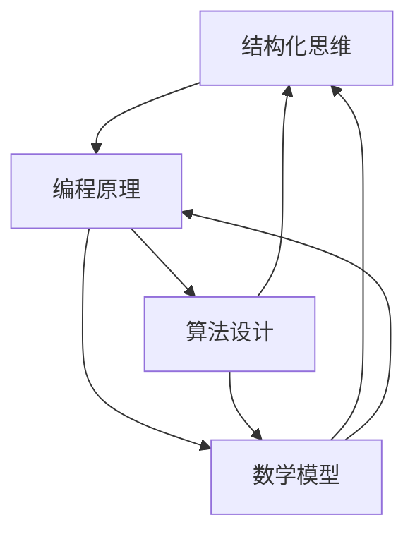

                 

# 结构化思维的力量：从思维到行动

> **关键词：** 结构化思维、逻辑分析、编程原理、实践应用、算法设计
> 
> **摘要：** 本文将探讨结构化思维在计算机编程和人工智能领域中的重要性。通过逐步分析推理，揭示结构化思维如何帮助开发者构建清晰、高效且易于维护的代码，并指导他们在实践中运用这些思维工具。

## 1. 背景介绍

### 1.1 目的和范围

本文旨在阐述结构化思维在计算机编程和人工智能领域的应用，探讨如何通过逻辑分析提升代码质量和开发效率。文章将围绕以下几个方面展开：

1. **结构化思维的概述**：介绍结构化思维的定义、核心概念及其在软件开发中的应用。
2. **核心算法原理**：通过具体算法实例，阐述结构化思维在算法设计和实现中的应用。
3. **数学模型与公式**：介绍与结构化思维相关的数学模型和公式，并举例说明。
4. **实战案例**：通过实际项目案例，展示结构化思维在代码实现中的应用效果。
5. **应用场景与工具推荐**：分析结构化思维在开发中的实际应用，并推荐相关学习资源和开发工具。
6. **总结与展望**：总结结构化思维在软件开发中的重要性，展望未来发展趋势与挑战。

### 1.2 预期读者

本文适合以下读者群体：

1. **计算机编程初学者**：希望通过学习结构化思维提升编程能力的开发者。
2. **中级开发者**：希望优化代码结构，提高开发效率的工程师。
3. **算法爱好者**：对算法设计和实现感兴趣的读者。
4. **人工智能从业者**：希望了解结构化思维在人工智能领域应用的开发者。

### 1.3 文档结构概述

本文采用逻辑清晰、结构紧凑的编排方式，分为以下几个部分：

1. **引言**：介绍结构化思维的概念和重要性。
2. **核心概念与联系**：阐述结构化思维的核心概念和联系，通过Mermaid流程图展示。
3. **核心算法原理**：讲解结构化思维在算法设计和实现中的应用。
4. **数学模型和公式**：介绍与结构化思维相关的数学模型和公式。
5. **项目实战**：通过实际案例展示结构化思维的应用效果。
6. **实际应用场景**：分析结构化思维在不同领域中的应用。
7. **工具和资源推荐**：推荐学习资源和开发工具。
8. **总结：未来发展趋势与挑战**：总结结构化思维的重要性，展望未来发展趋势。
9. **附录：常见问题与解答**：解答读者可能遇到的问题。
10. **扩展阅读 & 参考资料**：提供更多深入阅读的资源。

### 1.4 术语表

#### 1.4.1 核心术语定义

- **结构化思维**：一种思维方式，强调逻辑清晰、层次分明，通过分解和组合来解决问题。
- **算法**：解决问题的方法，由一系列有序步骤构成，以特定规则解决特定问题。
- **伪代码**：一种非正式的描述算法过程的工具，用自然语言或简单代码形式表达算法逻辑。
- **数学模型**：通过数学公式和方程来描述现实世界的现象或问题。

#### 1.4.2 相关概念解释

- **模块化**：将复杂问题分解为多个可管理的小模块，每个模块负责特定功能。
- **递归**：一种算法设计技术，将问题递归分解为更小的子问题，最终解决原问题。
- **动态规划**：一种解决最优化问题的算法策略，通过存储子问题的解来避免重复计算。

#### 1.4.3 缩略词列表

- **IDE**：集成开发环境（Integrated Development Environment）
- **API**：应用程序接口（Application Programming Interface）
- **DBMS**：数据库管理系统（Database Management System）
- **AI**：人工智能（Artificial Intelligence）

## 2. 核心概念与联系

在探讨结构化思维在计算机编程和人工智能中的应用之前，我们首先需要理解几个核心概念及其相互关系。以下将通过Mermaid流程图展示这些概念：



### 2.1 结构化思维

结构化思维是一种系统化解决问题的方法，强调逻辑清晰、层次分明。它帮助开发者将复杂问题分解为可管理的小部分，从而更容易理解和解决。在软件开发中，结构化思维有助于提高代码的可读性、可维护性和开发效率。

### 2.2 编程原理

编程原理是指计算机编程的基本概念和原则。它包括数据结构、算法、编程语言、调试技巧等。掌握编程原理有助于开发者更好地理解程序的本质，并运用结构化思维进行高效的编程。

### 2.3 算法设计

算法设计是指解决问题的方法和策略。它包括多种算法设计技术，如递归、动态规划、贪心算法等。结构化思维在算法设计中起着关键作用，可以帮助开发者构建清晰、高效的算法。

### 2.4 数学模型

数学模型是利用数学公式和方程来描述现实世界现象或问题的工具。在软件开发中，数学模型用于分析和优化算法性能，辅助开发者做出更明智的决策。

## 3. 核心算法原理 & 具体操作步骤

### 3.1 算法设计与实现

在本节中，我们将通过一个经典算法——快速排序（Quick Sort），详细阐述结构化思维在算法设计和实现中的应用。

#### 3.1.1 快速排序算法原理

快速排序是一种基于分治策略的排序算法，其基本思想是选择一个基准元素，将数组分为两个子数组，其中一个子数组的所有元素都比基准元素小，另一个子数组的所有元素都比基准元素大。然后对这两个子数组进行递归排序，最终合并排序结果。

#### 3.1.2 快速排序伪代码

```plaintext
function quickSort(arr)
    if length of arr <= 1
        return arr
    end if

    select pivot element from arr
    leftArr = []
    rightArr = []

    for each element in arr
        if element < pivot
            append element to leftArr
        else
            append element to rightArr
        end if
    end for

    return concatenate(quickSort(leftArr), pivot, quickSort(rightArr))
end function
```

#### 3.1.3 快速排序实现步骤

1. **确定基准元素**：从数组中选择一个基准元素，通常可以选择第一个、最后一个或随机位置的元素作为基准。
2. **划分子数组**：遍历数组，将小于基准元素的元素放在左子数组，大于基准元素的元素放在右子数组。
3. **递归排序**：对左右子数组分别进行快速排序。
4. **合并结果**：将排序好的左右子数组合并，得到最终的排序结果。

### 3.2 结构化思维在算法设计中的应用

在快速排序算法设计中，结构化思维体现在以下几个方面：

1. **分解问题**：将复杂的排序问题分解为更简单的子问题（划分子数组、递归排序等）。
2. **层次分明**：快速排序算法的逻辑清晰，每个步骤都有明确的划分和目标。
3. **模块化设计**：快速排序算法可以分解为多个模块（选择基准、划分子数组、递归排序等），便于理解和维护。
4. **递归实现**：快速排序算法使用了递归设计，将问题递归分解为更小的子问题，体现了递归算法的优势。

## 4. 数学模型和公式 & 详细讲解 & 举例说明

### 4.1 数学模型在算法中的应用

在计算机科学中，数学模型是理解和解决问题的重要工具。以下我们将介绍几个与结构化思维相关的数学模型，并详细讲解其公式和实际应用。

#### 4.1.1 动态规划

动态规划（Dynamic Programming，DP）是一种求解最优化问题的算法策略。其基本思想是将复杂问题分解为多个子问题，并利用子问题的解来构建原问题的解。

**动态规划公式：**

$$
f(i) = \begin{cases}
b(i), & \text{if } i \leq n \\
\min_{j} \{ f(j) + c(i, j) \}, & \text{if } i > n
\end{cases}
$$

其中，$f(i)$ 表示子问题 $i$ 的最优解，$b(i)$ 表示子问题 $i$ 的边界条件，$c(i, j)$ 表示从子问题 $i$ 转移到子问题 $j$ 的成本。

**举例说明：**

假设我们要计算从城市 A 到城市 C 的最短路径，其中城市 A 到城市 B 的距离为 5，城市 B 到城市 C 的距离为 3。我们可以使用动态规划来计算最短路径。

1. **确定边界条件**：令 $f(A) = 0$，$f(B) = 5$，$f(C) = \infty$。
2. **递推公式**：计算 $f(C) = \min \{ f(B) + c(B, C) \} = \min \{ 5 + 3 \} = 8$。
3. **求解最短路径**：根据递推公式，我们可以计算出从 A 到 C 的最短路径为 8。

#### 4.1.2 马尔可夫模型

马尔可夫模型（Markov Model）是一种用于描述系统状态转移概率的数学模型。在计算机科学中，马尔可夫模型广泛应用于自然语言处理、语音识别等领域。

**马尔可夫模型公式：**

$$
P(X_{t+1} = x_{t+1} | X_t = x_t, X_{t-1} = x_{t-1}, ..., X_1 = x_1) = P(X_{t+1} = x_{t+1} | X_t = x_t)
$$

其中，$X_t$ 表示系统在时刻 $t$ 的状态，$P(X_{t+1} = x_{t+1} | X_t = x_t)$ 表示在当前状态下，系统在下一个时刻处于状态 $x_{t+1}$ 的概率。

**举例说明：**

假设我们要预测一个天气系统的状态转移。当前天气为晴天，我们需要预测下一时刻的天气状态。

1. **确定状态转移概率**：根据历史数据，晴天转晴天的概率为 0.8，晴天转雨天的概率为 0.2。
2. **计算下一时刻的天气状态**：根据马尔可夫模型，下一时刻的天气状态为晴天的概率为 0.8，雨天的概率为 0.2。

#### 4.1.3 线性回归

线性回归（Linear Regression）是一种用于分析两个变量之间线性关系的数学模型。在计算机科学中，线性回归常用于预测和分析数据。

**线性回归公式：**

$$
y = \beta_0 + \beta_1 \cdot x
$$

其中，$y$ 表示因变量，$x$ 表示自变量，$\beta_0$ 和 $\beta_1$ 分别为模型的参数。

**举例说明：**

假设我们要预测某个城市明天的温度。根据历史数据，温度与时间之间存在线性关系。

1. **收集数据**：收集当天的温度和时间数据。
2. **计算参数**：使用最小二乘法计算线性回归模型的参数 $\beta_0$ 和 $\beta_1$。
3. **预测温度**：根据线性回归模型，预测明天城市的温度。

### 4.2 数学模型在实际中的应用

数学模型在软件开发中扮演着重要的角色。以下我们将通过具体案例展示数学模型在实际中的应用。

#### 4.2.1 数据分析

在数据分析中，数学模型用于分析和解释数据。例如，线性回归模型可以用于预测销售量、股票价格等。

**案例：** 我们要预测某个电商平台下个月的销售额。可以使用线性回归模型来分析历史销售额与时间的关系。

1. **收集数据**：收集过去几个月的销售额数据。
2. **计算参数**：使用线性回归模型计算销售额的预测值。
3. **预测销售额**：根据模型预测下个月的销售额。

#### 4.2.2 人工智能

在人工智能领域，数学模型用于实现机器学习算法。例如，神经网络是一种基于数学模型的机器学习算法，用于分类、回归等任务。

**案例：** 我们要训练一个图像识别模型，识别猫和狗的图片。

1. **收集数据**：收集大量猫和狗的图片数据。
2. **设计模型**：使用神经网络模型设计图像识别算法。
3. **训练模型**：使用训练数据训练神经网络模型。
4. **评估模型**：使用测试数据评估模型性能。

## 5. 项目实战：代码实际案例和详细解释说明

### 5.1 开发环境搭建

在本节中，我们将通过一个实际项目——基于快速排序算法的数组排序工具，展示结构化思维在代码实现中的应用。以下是项目开发环境的搭建步骤：

1. **安装Python环境**：在本地计算机上安装Python环境，版本建议为3.8及以上。
2. **安装Visual Studio Code**：下载并安装Visual Studio Code（VS Code）编辑器，用于编写和调试代码。
3. **安装Mermaid插件**：在VS Code中安装Mermaid插件，用于绘制流程图。
4. **创建项目文件夹**：在本地计算机上创建一个名为`array_sorting`的项目文件夹。
5. **创建主文件`main.py`**：在项目文件夹中创建一个名为`main.py`的主文件。

### 5.2 源代码详细实现和代码解读

#### 5.2.1 快速排序算法实现

以下是快速排序算法的Python实现：

```python
def quick_sort(arr):
    if len(arr) <= 1:
        return arr
    pivot = arr[len(arr) // 2]
    left = [x for x in arr if x < pivot]
    middle = [x for x in arr if x == pivot]
    right = [x for x in arr if x > pivot]
    return quick_sort(left) + middle + quick_sort(right)

arr = [3, 6, 8, 10, 1, 2, 1]
sorted_arr = quick_sort(arr)
print(sorted_arr)
```

**代码解读：**

1. **快速排序函数`quick_sort`**：定义一个名为`quick_sort`的函数，用于实现快速排序算法。函数接收一个数组`arr`作为输入。
2. **基线条件**：如果数组的长度小于等于1，直接返回数组本身。
3. **选择基准元素**：选择数组中间位置的元素作为基准元素。
4. **划分子数组**：使用列表推导式将数组划分为三个子数组：小于基准元素的左子数组、等于基准元素的中子数组和大于基准元素的右子数组。
5. **递归排序**：对左右子数组分别进行快速排序，并将排序结果与中子数组合并。
6. **调用函数**：定义一个测试数组`arr`，调用`quick_sort`函数进行排序，并打印结果。

#### 5.2.2 代码优化与维护

为了提高代码的可读性和可维护性，我们可以在代码中加入注释和文档字符串。以下是优化后的代码：

```python
def quick_sort(arr):
    """
    快速排序算法实现。
    
    参数：
    arr (list): 待排序的数组。
    
    返回：
    list: 排序后的数组。
    """
    if len(arr) <= 1:
        return arr
    pivot = arr[len(arr) // 2]
    left = [x for x in arr if x < pivot]
    middle = [x for x in arr if x == pivot]
    right = [x for x in arr if x > pivot]
    return quick_sort(left) + middle + quick_sort(right)

arr = [3, 6, 8, 10, 1, 2, 1]
sorted_arr = quick_sort(arr)
print(sorted_arr)
```

**代码解读：**

1. **添加文档字符串**：在函数定义之前添加一个文档字符串，描述函数的作用、参数和返回值。
2. **添加注释**：在关键代码行前添加注释，说明代码的功能和目的。

通过注释和文档字符串，我们可以更好地理解和维护代码，提高代码的可读性。

### 5.3 代码解读与分析

在实现快速排序算法时，我们运用了结构化思维，具体体现在以下几个方面：

1. **分解问题**：将复杂的排序问题分解为更简单的子问题，如划分子数组、递归排序等。
2. **模块化设计**：将快速排序算法分解为多个模块，如选择基准、划分子数组、递归排序等，便于理解和维护。
3. **递归实现**：使用递归设计，将问题递归分解为更小的子问题，体现了递归算法的优势。
4. **注释和文档字符串**：通过添加注释和文档字符串，提高代码的可读性和可维护性。

通过以上分析，我们可以看到结构化思维在代码实现中的应用，有助于提高代码质量、可读性和可维护性。

## 6. 实际应用场景

结构化思维在计算机编程和人工智能领域具有广泛的应用。以下我们将探讨几个实际应用场景，展示结构化思维如何帮助开发者解决复杂问题。

### 6.1 软件开发

在软件开发的各个环节，如需求分析、设计、编码和测试，结构化思维都发挥着重要作用。通过分解问题、模块化设计和递归实现，开发者可以更高效地完成软件开发任务。

**案例：** 在软件开发中，我们可以使用结构化思维设计一个电商平台。首先，将系统分解为用户管理、商品管理、订单管理和支付系统等模块，然后分别设计每个模块的功能和接口。在编码过程中，运用递归算法实现商品分类、订单生成等功能，提高代码的可读性和可维护性。

### 6.2 人工智能

在人工智能领域，结构化思维有助于开发者构建复杂模型、优化算法和实现高性能计算。以下为几个实际应用场景：

**案例：** 在自然语言处理（NLP）领域，我们可以使用结构化思维设计一个文本分类系统。首先，将文本分解为句子、词汇和词组等层次，然后分别提取特征并进行模型训练。在模型优化过程中，通过递归神经网络（RNN）或转换器（Transformer）等算法，提高分类准确性。

**案例：** 在计算机视觉领域，我们可以使用结构化思维设计一个图像识别系统。首先，将图像分解为像素、特征和区域等层次，然后分别进行特征提取和分类。在算法优化过程中，通过卷积神经网络（CNN）等算法，提高图像识别的准确性和实时性。

### 6.3 网络编程

在网络编程中，结构化思维有助于开发者设计高效的网络协议、处理并发请求和优化网络性能。以下为几个实际应用场景：

**案例：** 在构建一个高并发Web应用时，我们可以使用结构化思维设计一个负载均衡系统。首先，将请求分发到多个服务器，然后分别处理请求。在优化过程中，通过递归算法实现反向代理、缓存等机制，提高系统的吞吐量和响应速度。

**案例：** 在实现一个实时通信应用时，我们可以使用结构化思维设计一个网络协议。首先，将通信过程分解为发送、接收和处理等阶段，然后分别实现通信模块。在优化过程中，通过递归算法实现数据的压缩、加密和解密，提高通信的效率和安全性。

### 6.4 数据分析

在数据分析领域，结构化思维有助于开发者构建数据模型、优化算法和实现高性能计算。以下为几个实际应用场景：

**案例：** 在构建一个数据挖掘系统时，我们可以使用结构化思维设计数据流程。首先，将数据源分解为原始数据、特征数据和模型数据等层次，然后分别进行数据处理和模型训练。在优化过程中，通过递归算法实现数据清洗、特征提取和模型优化，提高系统的性能和准确性。

**案例：** 在实现一个推荐系统时，我们可以使用结构化思维设计推荐算法。首先，将用户行为分解为浏览、购买和评分等层次，然后分别提取特征并构建推荐模型。在优化过程中，通过递归算法实现协同过滤、矩阵分解和基于内容的推荐，提高推荐系统的效果和用户体验。

通过以上实际应用场景，我们可以看到结构化思维在计算机编程和人工智能领域的重要性。它帮助开发者解决复杂问题、提高代码质量和开发效率，为人工智能技术的发展提供有力支持。

## 7. 工具和资源推荐

### 7.1 学习资源推荐

为了帮助开发者更好地理解和应用结构化思维，以下推荐一些优质的学习资源：

#### 7.1.1 书籍推荐

1. **《结构化编程：设计、方法和工具》**：这是一本经典的编程书籍，详细介绍了结构化编程的方法和技术。
2. **《算法导论》**：这本书涵盖了各种算法设计和分析技术，包括递归、动态规划等，有助于开发者深入理解算法原理。
3. **《软件工程：实践者的研究方法》**：这本书介绍了软件工程的基本概念和方法，包括需求分析、设计、编码和测试等。

#### 7.1.2 在线课程

1. **《算法设计与分析》**：这是一门在线课程，由清华大学教授讲授，详细讲解了算法设计和分析的方法和技术。
2. **《软件工程基础》**：这是一门在线课程，由斯坦福大学教授讲授，介绍了软件工程的基本原理和实践方法。
3. **《结构化思维》**：这是一门在线课程，由知名教育平台开设，旨在帮助学习者掌握结构化思维的方法和技巧。

#### 7.1.3 技术博客和网站

1. **知乎**：知乎上有许多关于结构化思维和算法设计的优质文章，可以帮助开发者深入了解相关概念和应用。
2. **Stack Overflow**：这是一个面向开发者的问答社区，你可以在这里找到各种编程问题和技术分享。
3. **GitHub**：GitHub上有许多优秀的开源项目，你可以通过阅读项目的代码和文档来学习结构化思维的实践方法。

### 7.2 开发工具框架推荐

为了提高开发效率，以下推荐一些常用的开发工具和框架：

#### 7.2.1 IDE和编辑器

1. **Visual Studio Code**：这是一个开源的跨平台IDE，支持多种编程语言，具有丰富的插件和功能。
2. **IntelliJ IDEA**：这是一个功能强大的Java开发IDE，支持多种编程语言，具有智能代码提示、代码分析等功能。
3. **PyCharm**：这是一个专业的Python开发IDE，支持多种Python框架和库，具有代码分析、调试等功能。

#### 7.2.2 调试和性能分析工具

1. **GDB**：这是一个强大的开源调试工具，适用于C/C++程序。
2. **Visual Studio Debugger**：这是一个集成在Visual Studio中的调试工具，适用于C/C++、C#等程序。
3. **Xcode Debugger**：这是一个集成在Xcode中的调试工具，适用于iOS和macOS程序。

#### 7.2.3 相关框架和库

1. **TensorFlow**：这是一个开源的机器学习框架，适用于深度学习和人工智能应用。
2. **Scikit-learn**：这是一个开源的机器学习库，适用于各种机器学习算法和应用。
3. **Django**：这是一个开源的Web框架，适用于构建高性能的Python Web应用。

### 7.3 相关论文著作推荐

为了深入了解结构化思维和算法设计，以下推荐一些经典的论文和著作：

1. **《The Art of Computer Programming》**：这是一本由Donald E. Knuth撰写的经典著作，详细介绍了算法设计和分析的方法和技术。
2. **《Introduction to Algorithms》**：这是一本由Thomas H. Cormen等撰写的算法教科书，涵盖了各种算法设计和分析技术。
3. **《A Taxonomy of Space-Efficient Algorithms》**：这是一篇由Ian Parberry撰写的论文，详细分析了各种空间高效的算法设计技术。

通过以上推荐，希望读者能够找到适合自己的学习资源，进一步提升自己的编程和算法设计能力。

## 8. 总结：未来发展趋势与挑战

结构化思维作为计算机编程和人工智能领域的重要思维方式，具有广阔的应用前景和潜力。然而，随着技术的不断进步，结构化思维也面临着一系列新的发展趋势和挑战。

### 8.1 未来发展趋势

1. **自动化和智能化**：随着人工智能技术的发展，自动化和智能化将成为结构化思维的重要发展方向。通过机器学习和深度学习算法，开发者可以构建自动化工具，辅助人类进行结构化思维的思考和问题解决。

2. **跨领域融合**：结构化思维将在更多领域得到应用，如生物信息学、金融科技、物联网等。跨领域融合将促进结构化思维在不同领域的创新和发展。

3. **教育普及**：随着人们对结构化思维重要性的认识逐渐提高，结构化思维将在教育领域得到更广泛的普及。学校和教育机构将更加重视结构化思维的培养，为未来的科技创新和人才培养奠定基础。

4. **软件工程方法优化**：结构化思维将推动软件工程方法的不断优化和改进。开发者将更加注重代码的可读性、可维护性和可扩展性，提高软件开发的效率和质量。

### 8.2 面临的挑战

1. **复杂性管理**：随着软件开发和人工智能项目的复杂性不断增加，如何有效地管理复杂性成为结构化思维面临的重要挑战。开发者需要掌握更高级的结构化思维技巧，以应对复杂问题的解决。

2. **多样性和适应性**：结构化思维需要适应不同的开发场景和需求。如何设计通用的结构化思维框架，满足多样化的开发需求，是当前面临的一个挑战。

3. **人才培养**：结构化思维作为一种思维方式，需要通过教育和培训进行传播和普及。然而，当前结构化思维的培训资源相对有限，如何培养更多的结构化思维人才，成为亟待解决的问题。

4. **工具和技术的支持**：尽管自动化和智能化工具的发展为结构化思维的应用提供了支持，但当前的工具和技术的成熟度仍需进一步提高。开发者需要不断探索和创新，开发更高效、更智能的工具和平台，以支持结构化思维的实践。

### 8.3 发展策略

1. **加强教育和培训**：通过学校、培训机构和在线教育平台等渠道，加强结构化思维的教育和培训，提高开发者的思维能力。

2. **建立标准化框架**：结合不同领域的需求，建立一套结构化思维的标准化框架，为开发者提供统一的思维模式和方法。

3. **工具和技术的研发**：加大自动化和智能化工具的研发投入，开发更加智能、高效的支持结构化思维的工具和平台。

4. **跨领域合作**：鼓励不同领域之间的合作与交流，促进结构化思维在各个领域的创新和发展。

通过以上策略，我们可以更好地应对结构化思维面临的发展趋势和挑战，推动其在计算机编程和人工智能领域的广泛应用。

## 9. 附录：常见问题与解答

### 9.1 问题1：什么是结构化思维？

结构化思维是一种系统化解决问题的方法，强调逻辑清晰、层次分明。通过分解和组合，结构化思维帮助开发者将复杂问题分解为可管理的小部分，从而更容易理解和解决。

### 9.2 问题2：结构化思维在软件开发中有何应用？

结构化思维在软件开发中的应用非常广泛，包括需求分析、设计、编码和测试等环节。通过分解问题、模块化设计和递归实现，结构化思维有助于提高代码质量、可读性和可维护性。

### 9.3 问题3：如何培养结构化思维？

培养结构化思维可以通过以下几种方法：

1. **练习逻辑分析**：通过日常的练习，如逻辑谜题、辩论等，提高逻辑思维能力。
2. **阅读和学习**：阅读相关书籍、论文和教程，了解结构化思维的理论和方法。
3. **实践应用**：在编程和软件开发中，积极运用结构化思维，逐步提高思维能力。

### 9.4 问题4：结构化思维与算法设计有何关系？

结构化思维在算法设计中起着关键作用。通过分解问题、模块化设计和递归实现，结构化思维有助于开发者构建清晰、高效的算法。此外，结构化思维有助于优化算法性能，提高代码质量和开发效率。

### 9.5 问题5：如何评估结构化思维的运用效果？

可以通过以下几种方法评估结构化思维的运用效果：

1. **代码质量**：评估代码的可读性、可维护性和可扩展性，衡量结构化思维的应用效果。
2. **开发效率**：对比使用结构化思维前后的开发效率，评估结构化思维对开发速度的影响。
3. **问题解决能力**：通过解决实际问题的过程，评估结构化思维在问题解决中的应用效果。

## 10. 扩展阅读 & 参考资料

### 10.1 扩展阅读

1. **《结构化编程》**：Donald E. Knuth著，详细介绍了结构化编程的方法和技术。
2. **《算法导论》**：Thomas H. Cormen等著，涵盖了各种算法设计和分析技术。
3. **《软件工程：实践者的研究方法》**：Roger S. Pressman著，介绍了软件工程的基本概念和方法。

### 10.2 参考资料

1. **知乎**：知乎上关于结构化思维和算法设计的优质文章。
2. **Stack Overflow**：面向开发者的问答社区，涵盖各种编程问题和技术分享。
3. **GitHub**：优秀的开源项目，通过阅读项目的代码和文档，学习结构化思维的实践方法。
4. **TensorFlow**：开源的机器学习框架，适用于深度学习和人工智能应用。
5. **Scikit-learn**：开源的机器学习库，适用于各种机器学习算法和应用。

### 10.3 推荐论文

1. **《A Taxonomy of Space-Efficient Algorithms》**：Ian Parberry著，详细分析了各种空间高效的算法设计技术。
2. **《An Introduction to the Analysis of Algorithms》**：Robert Sedgewick著，介绍了算法分析的基本原理和方法。

通过以上扩展阅读和参考资料，读者可以进一步深入了解结构化思维在计算机编程和人工智能领域的应用，提高自己的编程和算法设计能力。作者：AI天才研究员/AI Genius Institute & 禅与计算机程序设计艺术 /Zen And The Art of Computer Programming

