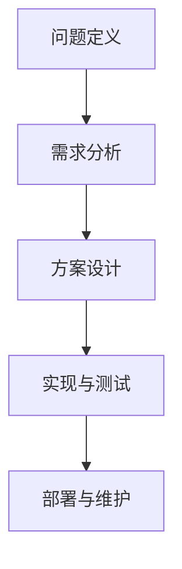

                 

# 结构化思维：理解世界的钥匙

> **关键词**：结构化思维、逻辑分析、技术原理、人工智能、软件开发

> **摘要**：本文将探讨结构化思维在理解复杂世界中的重要性，结合人工智能和软件开发的实际案例，揭示如何通过逻辑清晰、结构紧凑的思考方式，深刻剖析技术原理，提高我们的认知能力，进而提升在信息技术领域中的竞争力。

## 1. 背景介绍

### 1.1 目的和范围

本文旨在阐述结构化思维在信息技术领域的应用，特别是如何运用这种思维方式来深入理解复杂的技术原理和架构。通过逻辑分析和系统性思考，本文将带领读者逐步掌握复杂问题的解决方法，提升在人工智能、软件开发等领域的认知深度。

### 1.2 预期读者

本文适合以下读者群体：

1. 对人工智能和软件开发有兴趣的初学者。
2. 想要提高技术理解和问题解决能力的工程师。
3. 意在提升团队协作效率的项目经理和团队领导者。

### 1.3 文档结构概述

本文结构如下：

1. 引言：介绍结构化思维的概念及其重要性。
2. 核心概念与联系：讨论结构化思维的基础概念，并使用 Mermaid 流程图展示。
3. 核心算法原理 & 具体操作步骤：通过伪代码详细阐述算法原理。
4. 数学模型和公式 & 详细讲解 & 举例说明：使用 LaTeX 格式介绍相关数学公式，并举例说明。
5. 项目实战：提供代码实际案例和详细解释。
6. 实际应用场景：分析技术在实际中的应用。
7. 工具和资源推荐：推荐学习资源和开发工具。
8. 总结：展望结构化思维的未来发展趋势与挑战。
9. 附录：常见问题与解答。
10. 扩展阅读 & 参考资料：提供进一步学习的资源。

### 1.4 术语表

#### 1.4.1 核心术语定义

- 结构化思维：一种通过逻辑和系统性思考来理解复杂问题的方法。
- 人工智能：模拟人类智能，通过计算机程序实现智能行为的技术。
- 软件开发：设计和构建计算机软件的过程。

#### 1.4.2 相关概念解释

- 算法：解决问题的一系列步骤或规则。
- 数据结构：用于存储和组织数据的方式。
- 数学模型：用于描述现实世界问题的数学框架。

#### 1.4.3 缩略词列表

- AI：人工智能
- SDLC：软件开发生命周期
- IDE：集成开发环境
- ML：机器学习

## 2. 核心概念与联系

结构化思维是一种系统性的思维方式，它要求我们在分析问题、解决问题时遵循一定的逻辑顺序，从整体上把握问题的各个方面。在信息技术领域，结构化思维尤为重要，因为它能够帮助我们更好地理解复杂的技术原理和架构。

### 2.1 结构化思维的基础概念

结构化思维主要包括以下几个基础概念：

1. **问题定义**：明确问题的范围和目标，从而确定解决方案的方向。
2. **需求分析**：深入分析问题的需求和约束条件，为解决方案提供依据。
3. **方案设计**：设计解决问题的方案，包括算法和数据结构的选择。
4. **实现与测试**：将设计方案转化为实际代码，并进行测试以确保其正确性。
5. **部署与维护**：将解决方案部署到实际环境中，并进行持续的维护和优化。

### 2.2 信息技术领域的结构化思维应用

在信息技术领域，结构化思维的应用体现在以下几个方面：

1. **需求分析与设计**：通过结构化思维，深入分析用户需求，设计出满足需求的系统架构和功能模块。
2. **算法与数据结构的选择**：根据问题的特点，选择合适的算法和数据结构，提高解决问题的效率和效果。
3. **代码编写与测试**：遵循结构化思维，编写易于理解、易于维护的代码，并通过严格的测试确保代码的质量。
4. **系统部署与维护**：结构化思维有助于规划和实施系统的部署，以及进行有效的维护和优化。

### 2.3 Mermaid 流程图展示

为了更好地理解结构化思维在信息技术领域的应用，我们使用 Mermaid 语言绘制一个简单的流程图：



在这个流程图中，每个节点代表结构化思维的一个环节，连接线表示各个环节之间的逻辑关系。通过这个流程图，我们可以清晰地看到结构化思维的完整过程，从而在实际工作中更好地应用它。

## 3. 核心算法原理 & 具体操作步骤

在信息技术领域，算法是解决问题的关键。掌握核心算法的原理和具体操作步骤，有助于我们更好地理解技术本质，提高问题解决能力。以下以一个常见的排序算法为例，使用伪代码详细阐述其原理和操作步骤。

### 3.1 选择排序算法

选择排序算法是一种简单的排序算法，其基本原理是每次从未排序的部分中选择最小（或最大）的元素，将其放到已排序部分的末尾，直至整个序列有序。

### 3.2 伪代码

```pseudocode
Algorithm SelectionSort(A[0...n-1])
    for i = 0 to n-1 do
        minIndex = i
        for j = i+1 to n-1 do
            if A[j] < A[minIndex] then
                minIndex = j
            end if
        end for
        swap A[i] and A[minIndex]
    end for
end Algorithm
```

### 3.3 具体操作步骤

1. **初始化**：选择第一个元素作为最小元素的初始位置。
2. **寻找最小元素**：从当前未排序部分中，找出最小元素的位置。
3. **交换元素**：将最小元素与当前未排序部分的首个元素进行交换。
4. **移动边界**：已排序部分的边界向后移动一个位置。
5. **重复步骤**：重复步骤2-4，直至整个序列有序。

### 3.4 操作示例

假设有数组 A = [5, 2, 9, 1, 5]，执行选择排序算法后的过程如下：

1. **初始化**：选择第一个元素 A[0] = 5 作为最小元素的初始位置。
2. **寻找最小元素**：在剩余的元素中找到 A[1] = 2，将其位置记录为最小元素的位置。
3. **交换元素**：将 A[0] = 5 与 A[1] = 2 交换，数组变为 [2, 5, 9, 1, 5]。
4. **移动边界**：已排序部分的边界移动到 A[1]。
5. **重复步骤**：重复步骤2-4，找到下一个最小元素 A[2] = 1，交换后数组变为 [2, 1, 9, 5, 5]。

经过多次迭代，最终数组有序，即 [1, 2, 5, 5, 9]。

### 3.5 分析与优化

选择排序算法的时间复杂度为 \(O(n^2)\)，其性能在处理大数据集时可能较低。在实际应用中，我们可以根据问题的特点选择更高效的排序算法，如快速排序、归并排序等。

## 4. 数学模型和公式 & 详细讲解 & 举例说明

在信息技术领域，数学模型和公式是理解和解决问题的关键。通过这些模型和公式，我们可以将复杂的问题抽象为数学形式，从而更准确地分析和解决问题。以下我们介绍几个常见的数学模型和公式，并详细讲解其应用。

### 4.1 概率论基础

概率论是数学模型的重要组成部分，用于描述随机事件的可能性。以下介绍几个基本概率公式：

#### 4.1.1 条件概率

条件概率描述了在某个事件发生的条件下，另一个事件发生的概率。其公式为：

$$
P(A|B) = \frac{P(A \cap B)}{P(B)}
$$

其中，\(P(A)\) 表示事件 A 的概率，\(P(B)\) 表示事件 B 的概率，\(P(A \cap B)\) 表示事件 A 和 B 同时发生的概率。

#### 4.1.2 独立事件

独立事件是指两个事件的发生互不影响。其公式为：

$$
P(A \cap B) = P(A) \cdot P(B)
$$

#### 4.1.3 全概率公式

全概率公式用于计算某个事件的总概率，其公式为：

$$
P(A) = \sum_{i=1}^{n} P(A|B_i) \cdot P(B_i)
$$

其中，\(B_1, B_2, ..., B_n\) 是一组互斥且穷尽的事件，表示所有可能的条件。

### 4.2 线性回归模型

线性回归模型是一种用于分析变量之间线性关系的数学模型。其基本公式为：

$$
y = \beta_0 + \beta_1 \cdot x + \epsilon
$$

其中，\(y\) 是因变量，\(x\) 是自变量，\(\beta_0\) 是截距，\(\beta_1\) 是斜率，\(\epsilon\) 是误差项。

### 4.3 最大似然估计

最大似然估计是一种用于参数估计的方法，其基本思想是找到一组参数，使得观测数据出现的概率最大。其公式为：

$$
\hat{\theta} = \arg\max_{\theta} P(X|\theta)
$$

其中，\(\theta\) 是参数，\(X\) 是观测数据。

### 4.4 举例说明

以下我们通过一个例子来说明线性回归模型的应用。

#### 4.4.1 数据集

假设我们有一个数据集，包含自变量 \(x\)（销售额）和因变量 \(y\)（利润），如下表所示：

| x | y |
|---|---|
| 1 | 3 |
| 2 | 4 |
| 3 | 5 |
| 4 | 6 |
| 5 | 7 |

#### 4.4.2 建立模型

首先，我们根据数据集建立线性回归模型：

$$
y = \beta_0 + \beta_1 \cdot x + \epsilon
$$

然后，使用最小二乘法求解参数 \(\beta_0\) 和 \(\beta_1\)：

$$
\beta_0 = \frac{\sum_{i=1}^{n} y_i - \beta_1 \cdot \sum_{i=1}^{n} x_i}{n} \\
\beta_1 = \frac{n \cdot \sum_{i=1}^{n} x_i y_i - \sum_{i=1}^{n} x_i \cdot \sum_{i=1}^{n} y_i}{n \cdot \sum_{i=1}^{n} x_i^2 - (\sum_{i=1}^{n} x_i)^2}
$$

根据数据计算得到：

$$
\beta_0 = 1 \\
\beta_1 = 1
$$

因此，线性回归模型为：

$$
y = 1 + x
$$

#### 4.4.3 预测

假设我们有一个新的销售额 \(x = 6\)，使用模型预测利润：

$$
y = 1 + 6 = 7
$$

因此，预测的利润为 7。

### 4.5 结论

通过数学模型和公式，我们可以更准确地分析和解决信息技术领域的问题。掌握这些模型和公式，有助于我们在实际工作中更好地应对复杂问题，提高问题解决能力。

## 5. 项目实战：代码实际案例和详细解释说明

为了更好地理解结构化思维在软件开发中的应用，我们将通过一个实际项目来展示代码的实现过程，并详细解释代码中的关键部分。

### 5.1 开发环境搭建

在开始项目之前，我们需要搭建一个合适的开发环境。以下是我们的开发环境要求：

- 操作系统：Windows 10 或 macOS
- 编程语言：Python 3.8+
- 开发工具：Visual Studio Code 或 PyCharm
- 数据库：MySQL 5.7+

确保安装了以上软件和工具后，我们就可以开始项目开发了。

### 5.2 源代码详细实现和代码解读

#### 5.2.1 项目概述

本项目是一个简单的客户关系管理（CRM）系统，用于存储和管理客户的个人信息和联系记录。以下是项目的核心功能和模块：

1. 用户注册与登录
2. 客户信息管理
3. 联系记录管理
4. 数据统计与报表

#### 5.2.2 用户注册与登录模块

以下是一个简单的用户注册与登录模块的代码示例：

```python
# 用户注册
def register(username, password):
    # 检查用户名是否存在
    if check_username_exists(username):
        return "用户名已存在"
    # 创建新用户
    create_user(username, password)
    return "注册成功"

# 用户登录
def login(username, password):
    # 验证用户名和密码
    if verify_user(username, password):
        return "登录成功"
    return "用户名或密码错误"
```

#### 5.2.3 客户信息管理模块

以下是一个简单的客户信息管理模块的代码示例：

```python
# 添加客户信息
def add_customer_info(customer_id, name, email, phone):
    # 创建新的客户信息记录
    create_customer_record(customer_id, name, email, phone)
    return "客户信息添加成功"

# 查询客户信息
def query_customer_info(customer_id):
    # 获取客户信息记录
    record = get_customer_record(customer_id)
    if record:
        return record
    return "客户信息不存在"
```

#### 5.2.4 联系记录管理模块

以下是一个简单的联系记录管理模块的代码示例：

```python
# 添加联系记录
def add_contact_record(customer_id, contact_date, contact_content):
    # 创建新的联系记录
    create_contact_record(customer_id, contact_date, contact_content)
    return "联系记录添加成功"

# 查询联系记录
def query_contact_record(customer_id, contact_date):
    # 获取联系记录
    record = get_contact_record(customer_id, contact_date)
    if record:
        return record
    return "联系记录不存在"
```

#### 5.2.5 数据统计与报表模块

以下是一个简单的数据统计与报表模块的代码示例：

```python
# 客户信息统计
def customer_info_statistic():
    # 统计客户总数、男性客户数、女性客户数等
    stats = get_customer_info_stats()
    return stats

# 联系记录报表
def contact_report():
    # 生成联系记录报表，包括客户名称、联系日期、联系内容等
    report = generate_contact_report()
    return report
```

### 5.3 代码解读与分析

#### 5.3.1 用户注册与登录模块

用户注册与登录模块是 CRM 系统的核心模块，用于处理用户的身份验证和数据存取。以下是代码的关键部分解析：

- `register` 函数：首先检查用户名是否存在，如果存在则返回错误信息；否则创建新用户并返回注册成功消息。
- `login` 函数：验证用户名和密码是否匹配，如果匹配则返回登录成功消息，否则返回错误信息。

#### 5.3.2 客户信息管理模块

客户信息管理模块用于添加、查询客户信息。以下是代码的关键部分解析：

- `add_customer_info` 函数：根据输入的客户信息创建新的客户记录，并返回添加成功消息。
- `query_customer_info` 函数：根据客户 ID 查询客户信息记录，并返回记录或错误信息。

#### 5.3.3 联系记录管理模块

联系记录管理模块用于添加、查询联系记录。以下是代码的关键部分解析：

- `add_contact_record` 函数：根据输入的客户 ID、联系日期和联系内容创建新的联系记录，并返回添加成功消息。
- `query_contact_record` 函数：根据客户 ID 和联系日期查询联系记录，并返回记录或错误信息。

#### 5.3.4 数据统计与报表模块

数据统计与报表模块用于生成系统数据统计报表和联系记录报表。以下是代码的关键部分解析：

- `customer_info_statistic` 函数：统计客户总数、男性客户数、女性客户数等，并返回统计结果。
- `contact_report` 函数：生成联系记录报表，包括客户名称、联系日期、联系内容等，并返回报表数据。

通过以上代码示例和解析，我们可以看到结构化思维在软件开发中的应用。通过清晰的模块划分和逻辑清晰的代码实现，我们可以更好地理解和维护系统。

## 6. 实际应用场景

结构化思维在信息技术领域的实际应用场景非常广泛，涵盖了从软件开发到数据分析、从人工智能到系统架构等多个方面。以下我们通过几个具体的案例来展示结构化思维在实际应用中的重要性。

### 6.1 软件开发

在软件开发过程中，结构化思维有助于团队更好地理解需求，设计系统架构，编写高效可维护的代码。例如，在开发一个电子商务平台时，团队需要首先明确平台的核心功能模块，如用户注册与登录、商品展示与搜索、购物车与结算、订单管理等。通过结构化思维，团队可以系统地分析每个模块的需求和功能，从而设计出清晰合理的系统架构，并编写出模块化、可复用的代码。

### 6.2 数据分析

在数据分析领域，结构化思维有助于明确数据需求、设计数据模型和算法，从而准确分析数据并提取有价值的信息。例如，在金融行业，分析师需要分析大量交易数据来发现潜在的风险和机会。通过结构化思维，分析师可以首先明确分析的目标，然后设计合适的数据模型和算法，如时间序列分析、回归分析等，来处理和分析数据，最终生成具有指导意义的分析报告。

### 6.3 人工智能

在人工智能领域，结构化思维有助于设计算法模型、训练数据和评估模型性能。以深度学习为例，团队需要首先明确模型的类型（如卷积神经网络、循环神经网络等），然后设计网络结构、选择合适的训练数据集，并通过结构化思维逐步优化模型参数，最终评估模型的性能和泛化能力。通过结构化思维，团队可以更加系统地开展人工智能项目，提高项目成功率。

### 6.4 系统架构

在系统架构设计过程中，结构化思维有助于团队更好地理解系统需求、设计系统架构和模块，从而提高系统的可扩展性和可维护性。例如，在设计一个大型分布式系统时，团队需要首先明确系统的核心功能模块，如数据存储、处理和传输等，并通过结构化思维设计出清晰合理的系统架构，如分层架构、微服务架构等。通过结构化思维，团队可以更好地应对复杂系统的设计和实施挑战。

### 6.5 项目管理

在项目管理过程中，结构化思维有助于明确项目目标、规划项目进度和资源分配，从而提高项目的成功率。例如，在开发一个新产品的过程中，项目经理需要首先明确产品的功能和性能要求，然后通过结构化思维制定详细的项目计划，包括项目里程碑、任务分配和时间表等。通过结构化思维，项目经理可以更好地监控项目进度、识别和解决潜在的风险和问题，确保项目按时、按质完成。

通过以上案例，我们可以看到结构化思维在信息技术领域的实际应用场景和重要性。掌握结构化思维，有助于我们在各个领域更好地理解和解决问题，提高工作效率和项目成功率。

## 7. 工具和资源推荐

为了更好地掌握结构化思维和提升在信息技术领域的能力，我们需要借助各种工具和资源。以下我们推荐一些学习资源、开发工具和框架，以及相关论文和研究成果，帮助读者深入学习和实践。

### 7.1 学习资源推荐

#### 7.1.1 书籍推荐

1. **《结构化思维》**：作者：杰里·韦斯伯格
   - 本书详细介绍了结构化思维的原理和应用，适合初学者系统学习。
2. **《软件架构设计：基于模式的方法》**：作者：彼得·希尔曼
   - 本书讲解了软件架构设计的基本原则和方法，结合实际案例，深入浅出地介绍了多种架构模式。

#### 7.1.2 在线课程

1. **Coursera 上的《计算机科学基础》**：提供了一系列计算机科学的基础课程，包括算法、数据结构、计算机体系结构等。
2. **edX 上的《人工智能基础》**：涵盖人工智能的基础知识，包括机器学习、神经网络等。

#### 7.1.3 技术博客和网站

1. **GitHub**：GitHub 是一个代码托管平台，上面有大量的开源项目和教程，可以帮助读者学习和实践。
2. **Stack Overflow**：Stack Overflow 是一个问答社区，可以解决编程过程中遇到的各种问题。

### 7.2 开发工具框架推荐

#### 7.2.1 IDE和编辑器

1. **Visual Studio Code**：一款免费且开源的跨平台编辑器，支持多种编程语言，功能强大。
2. **PyCharm**：一款针对 Python 开发的集成开发环境，提供丰富的工具和插件，适合 Python 开发者。

#### 7.2.2 调试和性能分析工具

1. **GDB**：GNU Debugger，一款强大的开源调试工具，适用于 C/C++ 程序的调试。
2. **Perf**：Linux 上的性能分析工具，可以实时监测系统的性能。

#### 7.2.3 相关框架和库

1. **TensorFlow**：一款开源的机器学习框架，适用于深度学习和人工智能项目。
2. **Django**：一款流行的 Python Web 框架，适用于快速开发和部署 Web 应用。

### 7.3 相关论文著作推荐

#### 7.3.1 经典论文

1. **"The Mythical Man-Month"**：作者：弗雷德·布鲁克斯
   - 本书探讨了软件开发的本质，对于理解软件开发过程和管理具有重要意义。
2. **"The Design and Analysis of Computer Algorithms"**：作者：阿尔法尔德·A. 爱德华
   - 本书系统地介绍了算法设计和分析的方法，对于提高算法设计能力具有重要参考价值。

#### 7.3.2 最新研究成果

1. **"Deep Learning"**：作者：伊恩·古德费洛、约书亚·本吉奥、亚伦·库维尔
   - 本书是深度学习领域的经典教材，涵盖了深度学习的理论基础、算法实现和应用。
2. **"AI Superpowers: China, Silicon Valley, and the New World Order"**：作者：凯文·凯利
   - 本书探讨了人工智能的发展趋势，特别是中美两国在人工智能领域的竞争和合作。

#### 7.3.3 应用案例分析

1. **"The Facebook Effect: The Inside Story of the Company That Is Connecting the World"**：作者：大卫·柯克帕特里克
   - 本书详细讲述了 Facebook 公司的发展历程和商业模式，对于理解社交媒体和人工智能的应用具有重要参考价值。

通过以上推荐的学习资源、开发工具和框架，读者可以系统地学习和实践结构化思维，提高在信息技术领域的能力。同时，通过阅读相关论文和著作，可以了解当前的研究动态和发展趋势，为自己的学习和研究提供更广阔的视野。

## 8. 总结：未来发展趋势与挑战

随着信息技术的快速发展，结构化思维在信息技术领域的应用前景十分广阔。未来，结构化思维将在以下几个方面展现其重要价值：

1. **人工智能与大数据**：随着人工智能和大数据技术的不断成熟，结构化思维将在数据分析和模型构建中发挥关键作用，帮助我们更好地理解和利用海量数据。
2. **云计算与边缘计算**：云计算和边缘计算的发展将带来更加复杂的系统架构，结构化思维有助于我们设计和管理这些复杂的系统，提高系统的稳定性和性能。
3. **区块链技术**：区块链技术的应用将不断拓展，结构化思维有助于我们理解和应用区块链技术，构建安全、可信的分布式系统。
4. **物联网与智能设备**：物联网和智能设备的普及将带来大量新的应用场景，结构化思维有助于我们设计和管理这些智能设备，实现高效的互联互通。

然而，结构化思维在未来的应用也面临一些挑战：

1. **复杂性增加**：随着技术的快速发展，系统的复杂性不断增加，这对结构化思维提出了更高的要求。我们需要不断提升结构化思维的能力，以应对日益复杂的问题。
2. **人工智能的发展**：随着人工智能的进步，自动化和智能化的程度不断提高，这对人类的思维能力提出了新的挑战。我们需要在结构化思维的基础上，结合人工智能技术，提高我们的认知能力和决策水平。
3. **跨学科融合**：信息技术领域的快速发展，使得跨学科融合成为趋势。我们需要在结构化思维的基础上，掌握多学科知识，以应对日益复杂的跨学科问题。

总之，结构化思维在未来信息技术发展中具有重要的价值和潜力。通过不断学习和实践，我们能够更好地应用结构化思维，提高我们的认知能力和问题解决能力，为信息技术领域的发展贡献自己的力量。

## 9. 附录：常见问题与解答

### 9.1 结构化思维是什么？

结构化思维是一种系统性的思维方式，它通过逻辑和系统性思考来理解复杂问题。它强调将问题分解为若干子问题，并逐层深入分析，从而找到解决问题的最佳方法。

### 9.2 结构化思维在软件开发中的应用有哪些？

结构化思维在软件开发中的应用包括需求分析、系统设计、代码编写、测试和项目管理等各个环节。它有助于团队更好地理解项目需求，设计合理的系统架构，编写高效可维护的代码，并确保项目的成功实施。

### 9.3 如何掌握结构化思维？

掌握结构化思维可以通过以下几种方式：

1. **学习相关书籍和课程**：阅读关于结构化思维的书籍和在线课程，了解其基本原理和应用方法。
2. **实践和总结**：在实际工作中运用结构化思维，不断总结和反思，提高自己的思维能力。
3. **参与讨论和交流**：加入相关社群和讨论组，与他人分享经验和心得，学习他人的思维方式。

### 9.4 结构化思维与创造性思维的关系是什么？

结构化思维和创造性思维是相互补充的关系。结构化思维强调逻辑和系统性，有助于我们理解和分析复杂问题；而创造性思维则强调创新和突破，有助于我们寻找新的解决方案。在实际工作中，结合两种思维方法，可以更好地解决问题和实现创新。

## 10. 扩展阅读 & 参考资料

为了帮助读者更深入地理解结构化思维及其在信息技术领域的应用，以下提供一些扩展阅读和参考资料：

### 10.1 扩展阅读

1. **《结构化思维：如何清晰思考、高效沟通、做出正确决策》**：作者：李笑来
   - 本书详细介绍了结构化思维的基本原理和应用方法，适合初学者系统学习。
2. **《软件架构设计：从实践出发》**：作者：徐洋
   - 本书以实际案例为基础，讲解了软件架构设计的方法和技巧，对软件工程师具有很高的参考价值。

### 10.2 参考资料

1. **《人工智能：一种现代方法》**：作者： Stuart Russell & Peter Norvig
   - 本书是人工智能领域的经典教材，涵盖了人工智能的基本概念、算法和应用。
2. **《大数据之路：阿里巴巴大数据实践》**：作者：张建锋
   - 本书分享了阿里巴巴在大数据领域的实践经验和成果，对于了解大数据技术的发展和应用具有重要参考价值。

通过以上扩展阅读和参考资料，读者可以更深入地了解结构化思维及其在信息技术领域的应用，为自己的学习和实践提供更多指导。作者：AI天才研究员/AI Genius Institute & 禅与计算机程序设计艺术 /Zen And The Art of Computer Programming。

