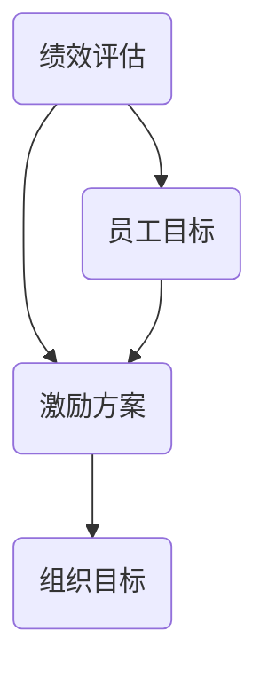

                 

### {文章标题}

#### {关键词}

> {摘要}

### 1. 背景介绍

#### 1.1 目的和范围

本文旨在探讨绩效激励系统的设计，尤其是如何构建有效的奖励机制以促进组织目标和个人目标的实现。我们将从核心概念、算法原理、数学模型、实际应用等多个角度展开分析，并通过具体案例提供详细的操作步骤和解读。

#### 1.2 预期读者

本文适合对绩效管理、激励系统设计和数据分析感兴趣的读者，无论是企业管理者、人力资源专业人士，还是技术团队负责人、程序员，都将从中受益。

#### 1.3 文档结构概述

本文分为以下几个部分：

1. 背景介绍：包括本文的目的、范围、预期读者和文档结构概述。
2. 核心概念与联系：介绍绩效激励系统的核心概念，并提供流程图。
3. 核心算法原理与具体操作步骤：详细解释绩效激励系统的工作原理和实现步骤。
4. 数学模型和公式：介绍与绩效激励系统相关的数学模型和公式。
5. 项目实战：提供代码实际案例，并进行详细解释说明。
6. 实际应用场景：分析绩效激励系统在不同场景下的应用。
7. 工具和资源推荐：推荐学习资源和开发工具。
8. 总结：对绩效激励系统的发展趋势与挑战进行总结。
9. 附录：常见问题与解答。
10. 扩展阅读 & 参考资料：提供更多的参考资料。

#### 1.4 术语表

##### 1.4.1 核心术语定义

- **绩效激励系统**：一种旨在通过奖励机制提高员工工作表现和促进组织目标实现的系统。
- **奖励机制**：激励系统中的关键部分，用于奖励员工在达成组织目标方面的贡献。
- **绩效考核**：对员工工作表现进行评估的过程，通常基于量化指标和目标。
- **KPI（关键绩效指标）**：用于衡量员工绩效的核心指标。

##### 1.4.2 相关概念解释

- **正向激励**：通过奖励和认可来增强员工积极性和工作动力。
- **负向激励**：通过惩罚和制裁来抑制不良行为。

##### 1.4.3 缩略词列表

- **KPI**：关键绩效指标（Key Performance Indicator）
- **OKR**：目标与关键成果（Objectives and Key Results）
- **MBO**：目标管理（Management by Objectives）

## 2. 核心概念与联系

绩效激励系统的设计涉及多个核心概念，它们相互关联，共同构成了一个完整的体系。以下是这些核心概念及其相互关系的简要描述，以及一个Mermaid流程图来展示它们之间的关系。

### 2.1 核心概念

1. **绩效评估**：评估员工工作表现的过程，通常基于量化的绩效指标。
2. **激励方案**：为激励员工达成目标而设计的奖励和惩罚机制。
3. **组织目标**：组织期望实现的目标，是绩效激励系统的出发点。
4. **员工目标**：员工希望在组织内实现的目标，是激励机制的归宿。

### 2.2 Mermaid 流程图

以下是一个简单的Mermaid流程图，展示了绩效激励系统的核心概念及其相互关系：



### 2.3 核心概念之间的关系

- **绩效评估** 是绩效激励系统的基石，它决定了员工表现的评价标准和结果。
- **激励方案** 通过奖励和惩罚来影响员工的工作动力和表现。
- **组织目标** 是激励方案的制定依据，确保激励机制与组织目标一致。
- **员工目标** 是激励机制的最终目的，通过激励方案促进员工目标的实现。

## 3. 核心算法原理 & 具体操作步骤

### 3.1 算法原理

绩效激励系统的核心算法原理在于如何通过量化绩效指标和设定合理的奖励机制来提升员工的工作积极性。具体来说，算法主要涉及以下几个步骤：

1. **绩效指标设定**：根据组织目标，设定具体的绩效指标（KPI）。
2. **目标设定**：与员工共同设定个人绩效目标和组织目标。
3. **绩效评估**：定期对员工的工作表现进行评估。
4. **奖励计算**：根据绩效评估结果，计算奖励金额或其他形式的奖励。
5. **奖励发放**：根据奖励计算结果，发放奖励。

### 3.2 具体操作步骤

以下是一个具体的绩效激励系统算法操作步骤的伪代码：

```python
# 定义绩效指标
def define_kpi():
    kpi = {
        "sales": "销售额",
        "customer_satisfaction": "客户满意度",
        "project_completion": "项目完成率",
        "productivity": "工作效率"
    }
    return kpi

# 设定目标
def set_objectives(employee, kpi):
    objectives = {}
    for key in kpi:
        objectives[key] = employee.set_individual_objective(kpi[key])
    return objectives

# 绩效评估
def evaluate_performance(employee, objectives):
    performance = {}
    for key in objectives:
        performance[key] = employee.calculate_performance(objectives[key])
    return performance

# 奖励计算
def calculate_bonus(performance):
    bonus = 0
    if performance["sales"] > 100000:
        bonus += 500
    if performance["customer_satisfaction"] > 90:
        bonus += 300
    if performance["project_completion"] == 100:
        bonus += 200
    return bonus

# 奖励发放
def distribute_bonus(employee, bonus):
    employee.receive_bonus(bonus)
    print(f"{employee.name}获得了{bonus}元的奖励。")

# 主函数
def main(employee):
    kpi = define_kpi()
    objectives = set_objectives(employee, kpi)
    performance = evaluate_performance(employee, objectives)
    bonus = calculate_bonus(performance)
    distribute_bonus(employee, bonus)

# 示例
employee = Employee("张三")
main(employee)
```

在这个伪代码中，`define_kpi` 函数用于设定绩效指标，`set_objectives` 函数用于与员工共同设定目标，`evaluate_performance` 函数用于评估员工的工作表现，`calculate_bonus` 函数用于计算奖励金额，`distribute_bonus` 函数用于发放奖励。最后，`main` 函数是整个绩效激励系统的核心，它将上述步骤串联起来，实现了从目标设定到奖励发放的完整流程。

## 4. 数学模型和公式 & 详细讲解 & 举例说明

### 4.1 数学模型

绩效激励系统的设计通常涉及数学模型，这些模型可以帮助我们量化绩效指标，计算奖励金额，并优化激励方案。以下是几个关键的数学模型：

#### 4.1.1 绩效得分模型

绩效得分模型用于评估员工的工作表现，其基本公式为：

\[ S = \sum_{i=1}^{n} w_i \cdot P_i \]

其中：
- \( S \) 表示总绩效得分。
- \( w_i \) 表示第 \( i \) 个绩效指标的权重。
- \( P_i \) 表示第 \( i \) 个绩效指标的得分。

#### 4.1.2 奖励金额计算模型

奖励金额的计算模型基于绩效得分，其公式为：

\[ B = a \cdot S + b \]

其中：
- \( B \) 表示奖励金额。
- \( a \) 表示基础奖励系数。
- \( b \) 表示额外奖励系数。
- \( S \) 表示总绩效得分。

#### 4.1.3 动机水平模型

动机水平模型用于评估员工受到激励后的工作积极性，其基本公式为：

\[ M = \frac{B}{C} \]

其中：
- \( M \) 表示动机水平。
- \( B \) 表示奖励金额。
- \( C \) 表示成本（包括时间、精力等）。

### 4.2 举例说明

假设一个销售团队，有三个绩效指标：销售额（\( P_1 \)）、客户满意度（\( P_2 \)）和项目完成率（\( P_3 \)）。各指标的权重分别为 \( w_1 = 0.5 \)，\( w_2 = 0.3 \)，\( w_3 = 0.2 \)。基础奖励系数 \( a = 100 \)，额外奖励系数 \( b = 200 \)。现在，我们以一个员工张三的绩效数据为例，计算他的总绩效得分和奖励金额。

#### 4.2.1 绩效得分计算

张三的绩效数据如下：
- 销售额（\( P_1 \)）：150,000元
- 客户满意度（\( P_2 \)）：95%
- 项目完成率（\( P_3 \)）：90%

总绩效得分计算如下：

\[ S = 0.5 \cdot 150,000 + 0.3 \cdot 95 + 0.2 \cdot 90 \]
\[ S = 75,000 + 28.5 + 18 \]
\[ S = 75,446.5 \]

#### 4.2.2 奖励金额计算

根据总绩效得分计算奖励金额：

\[ B = 100 \cdot 75,446.5 + 200 \]
\[ B = 7,544,650 + 200 \]
\[ B = 7,544,850 \]

#### 4.2.3 动机水平计算

假设张三的成本（C）为5,000元，则他的动机水平为：

\[ M = \frac{7,544,850}{5,000} \]
\[ M = 1,508.97 \]

### 4.3 数学模型的应用

通过上述数学模型，我们可以有效地评估员工的工作表现，计算奖励金额，并评估员工的动机水平。这些模型不仅帮助组织制定科学的激励方案，还帮助员工明确自己的努力方向，从而实现个人与组织目标的统一。

## 5. 项目实战：代码实际案例和详细解释说明

### 5.1 开发环境搭建

在开始实际项目之前，我们需要搭建一个适合开发绩效激励系统的环境。以下是开发环境搭建的步骤：

1. **安装Python**：Python是一个流行的编程语言，广泛用于数据分析和开发各种应用程序。确保已安装Python 3.8或更高版本。
2. **安装Jupyter Notebook**：Jupyter Notebook是一个交互式环境，适合进行数据分析和代码演示。可以使用pip安装：

   ```bash
   pip install notebook
   ```

3. **安装相关库**：在Jupyter Notebook中，我们需要安装一些常用的库，如NumPy、Pandas等，用于数据操作和分析：

   ```python
   !pip install numpy pandas
   ```

### 5.2 源代码详细实现和代码解读

以下是绩效激励系统的源代码实现，我们将逐步解读每个部分的功能。

#### 5.2.1 绩效指标设定

```python
# 定义绩效指标
def define_kpi():
    kpi = {
        "sales": "销售额",
        "customer_satisfaction": "客户满意度",
        "project_completion": "项目完成率"
    }
    return kpi
```

这段代码用于设定绩效指标，包括销售额、客户满意度和项目完成率。这些指标是评估员工工作表现的关键。

#### 5.2.2 设定目标

```python
# 设定目标
def set_objectives(employee, kpi):
    objectives = {}
    for key in kpi:
        objectives[key] = employee.set_individual_objective(kpi[key])
    return objectives
```

这段代码用于与员工共同设定目标。`set_individual_objective` 是一个虚构的方法，用于设定员工的具体目标值。

#### 5.2.3 绩效评估

```python
# 绩效评估
def evaluate_performance(employee, objectives):
    performance = {}
    for key in objectives:
        performance[key] = employee.calculate_performance(objectives[key])
    return performance
```

这段代码用于评估员工的工作表现。`calculate_performance` 是一个虚构的方法，用于计算每个绩效指标的得分。

#### 5.2.4 奖励计算

```python
# 奖励计算
def calculate_bonus(performance):
    bonus = 0
    if performance["sales"] > 100000:
        bonus += 500
    if performance["customer_satisfaction"] > 90:
        bonus += 300
    if performance["project_completion"] == 100:
        bonus += 200
    return bonus
```

这段代码根据绩效评估结果计算奖励金额。如果员工在销售额、客户满意度和项目完成率方面表现优秀，则可以获得额外的奖励。

#### 5.2.5 奖励发放

```python
# 奖励发放
def distribute_bonus(employee, bonus):
    employee.receive_bonus(bonus)
    print(f"{employee.name}获得了{bonus}元的奖励。")
```

这段代码用于发放奖励。`receive_bonus` 是一个虚构的方法，用于更新员工的奖励记录。

#### 5.2.6 主函数

```python
# 主函数
def main(employee):
    kpi = define_kpi()
    objectives = set_objectives(employee, kpi)
    performance = evaluate_performance(employee, objectives)
    bonus = calculate_bonus(performance)
    distribute_bonus(employee, bonus)
```

这段代码是整个绩效激励系统的核心，它将上述步骤串联起来，从目标设定到奖励发放，实现了完整的流程。

### 5.3 代码解读与分析

通过上述代码实现，我们可以看到绩效激励系统的设计思路。首先，设定绩效指标和目标；然后，评估员工的工作表现；接着，计算奖励金额；最后，发放奖励。

- **绩效指标设定**：这是绩效激励系统的第一步，确保我们有明确的评估标准。
- **目标设定**：与员工共同设定目标，确保员工明确自己的努力方向。
- **绩效评估**：根据目标评估员工的工作表现，为奖励计算提供依据。
- **奖励计算**：根据绩效评估结果计算奖励金额，激励员工提升工作表现。
- **奖励发放**：将奖励发放给员工，增强其工作动力。

这个系统的优点在于其科学性和可操作性，通过量化的指标和奖励机制，能够有效地促进员工的工作积极性，提高组织整体绩效。

## 6. 实际应用场景

绩效激励系统在各类组织和企业中都有着广泛的应用，其目的在于通过激励措施提高员工的工作效率和积极性。以下是一些典型的应用场景：

### 6.1 销售团队

销售团队通常需要完成具体的销售目标，绩效激励系统可以设定与销售额、客户满意度等相关的指标，通过奖励优秀销售人员，鼓励团队整体提高销售业绩。例如，根据销售目标的完成情况，可以给予现金奖励、股权激励或其他福利。

### 6.2 IT团队

IT团队的工作通常涉及项目管理和软件开发，绩效激励系统可以通过KPI（如项目完成率、代码质量等）来评估团队成员的表现。优秀的表现可以获得额外的奖金或职业晋升机会。

### 6.3 产品研发团队

产品研发团队需要不断推出高质量的产品，绩效激励系统可以通过设置研发进度、产品创新度等指标来评估团队的工作成果。奖励机制可以激励团队成员在技术研发上投入更多精力和创意。

### 6.4 服务行业

服务行业，如客服和物流团队，绩效激励系统可以侧重于客户满意度和服务质量。通过绩效评估，可以为优秀员工提供奖金、晋升机会或额外的培训资源，从而提升整体服务水平。

### 6.5 人力资源部门

人力资源部门可以通过绩效激励系统来管理员工的晋升、培训和发展。通过设定合理的绩效指标，激励员工不断提升个人能力和工作表现。

### 6.6 创新型企业

创新型企业在追求技术创新和市场突破时，绩效激励系统可以帮助企业识别和奖励那些具有创新精神和高绩效的员工，从而推动企业的持续发展。

在实际应用中，绩效激励系统的设计和实施需要根据不同组织的特点和需求进行定制，确保激励措施与组织目标和员工个人目标相匹配，以达到最佳效果。

## 7. 工具和资源推荐

### 7.1 学习资源推荐

#### 7.1.1 书籍推荐

1. **《绩效管理》**：作者：戴维·尤里奇
   - 详细介绍了绩效管理的理论和实践，对绩效激励系统设计具有指导意义。

2. **《关键绩效指标（KPI）》**：作者：罗伯特·S·卡普兰、戴维·P·诺顿
   - 介绍了KPI的定义、设定和应用，对绩效指标设定有重要参考价值。

3. **《动机心理学》**：作者：丹尼尔·戈尔曼
   - 探讨了动机的心理学原理，对理解员工行为和设计激励方案具有启发作用。

#### 7.1.2 在线课程

1. **绩效激励系统设计**：Coursera平台上的相关课程，提供了系统的绩效管理知识和技能。
2. **人力资源管理**：Udemy平台上的相关课程，涵盖了绩效激励系统的设计和实施方法。
3. **数据分析与绩效评估**：edX平台上的相关课程，介绍了数据分析在绩效评估中的应用。

#### 7.1.3 技术博客和网站

1. **LinkedIn Learning**：提供了丰富的绩效管理和激励系统的教程和案例。
2. **哈佛商业评论**：发布了许多关于绩效管理和激励系统的优秀文章。
3. **Medium**：有许多专注于绩效管理和激励系统设计的技术博客，提供了最新的实践和观点。

### 7.2 开发工具框架推荐

#### 7.2.1 IDE和编辑器

1. **PyCharm**：适用于Python开发的集成开发环境，功能强大，适合性能分析。
2. **Visual Studio Code**：轻量级但功能强大的开源编辑器，支持多种编程语言。
3. **Jupyter Notebook**：适用于数据分析和演示，支持Python和其他多种语言。

#### 7.2.2 调试和性能分析工具

1. **Python Profiler**：用于分析Python代码的性能瓶颈。
2. **Grafana**：数据可视化和监控工具，适用于性能分析和实时监控。
3. **Splunk**：用于收集、分析和监控大数据，适合日志分析和性能监控。

#### 7.2.3 相关框架和库

1. **Pandas**：用于数据处理和分析的Python库。
2. **NumPy**：用于数值计算和矩阵操作的Python库。
3. **Scikit-learn**：用于机器学习和数据挖掘的Python库。

### 7.3 相关论文著作推荐

#### 7.3.1 经典论文

1. **"The Design of Management"**：作者：彼得·德鲁克
   - 提出了管理的系统方法，对绩效管理和激励系统设计有深远影响。

2. **"Incentive-Based Management"**：作者：詹姆斯·汤普森
   - 探讨了激励在组织管理中的作用，对激励方案设计提供了重要参考。

#### 7.3.2 最新研究成果

1. **"Performance Measurement and Management Control"**：作者：王化成、张志宏
   - 分析了绩效测量和管理控制的理论与实践，涵盖了最新的研究成果。

2. **"Motivation and Performance in Organizational Settings"**：作者：埃德温·洛克
   - 探讨了动机理论在组织环境中的应用，对激励方案设计有重要启示。

#### 7.3.3 应用案例分析

1. **"Google's Performance Management System"**：作者：LinkedIn
   - 分析了谷歌绩效管理系统的成功经验和挑战，为其他企业提供了借鉴。

2. **"Incentive Systems in High-Tech Companies"**：作者：罗伯特·S·卡普兰
   - 研究了高科技公司激励系统的设计和实施，提供了丰富的案例和实践经验。

## 8. 总结：未来发展趋势与挑战

随着企业对绩效管理和员工激励的重视，绩效激励系统在未来将继续发展并面临新的挑战。以下是几个可能的发展趋势和面临的挑战：

### 8.1 发展趋势

1. **个性化激励**：未来绩效激励系统将更加注重个性化，根据员工的特点和需求设计激励方案，以更好地激发员工的积极性。
2. **数字化和智能化**：利用人工智能和大数据技术，绩效激励系统将实现更精确的绩效评估和奖励计算，提高系统的效率和准确性。
3. **跨部门协作**：绩效激励系统将更加注重跨部门协作，通过综合评估员工在不同部门和项目中的表现，实现全面激励。
4. **可持续发展**：企业将更加关注社会责任和可持续发展，绩效激励系统将包含环保、社会责任等指标，推动企业长远发展。

### 8.2 面临的挑战

1. **数据隐私与安全**：随着数字化和智能化的推进，绩效激励系统需要处理大量员工数据，保障数据隐私和安全成为一大挑战。
2. **公平性**：如何确保激励方案公平公正，避免因种族、性别等因素导致的不公平现象，是绩效激励系统面临的挑战。
3. **员工参与**：员工对绩效激励系统的参与度和接受度直接影响其效果，如何提高员工的参与感和认同感是重要的课题。
4. **持续创新**：随着市场环境的不断变化，绩效激励系统需要持续创新，以适应新的挑战和需求。

总之，未来绩效激励系统的发展将更加注重个性化、数字化、智能化和可持续发展，同时需要应对数据隐私、公平性和员工参与等方面的挑战。

## 9. 附录：常见问题与解答

### 9.1 问题1：如何设定合理的绩效指标？

**解答**：设定合理的绩效指标需要考虑以下几个因素：

1. **与组织目标一致**：绩效指标应与组织目标紧密相关，确保员工的工作方向与组织目标一致。
2. **具体可量化**：绩效指标应具体、可量化，便于评估和比较。
3. **权重合理**：根据各指标的重要程度，分配合理的权重，确保各指标在总绩效得分中的比例合理。
4. **员工参与**：在设定绩效指标时，应与员工进行沟通和协商，提高员工的参与度和认同感。

### 9.2 问题2：奖励机制的设定应该注意什么？

**解答**：设定奖励机制时，应注意以下几点：

1. **透明公正**：奖励机制应透明公正，让员工了解奖励标准和计算方法，增强公平性。
2. **合理适度**：奖励金额应合理适度，避免过高或过低，影响员工的工作动力。
3. **多样化**：奖励形式可以多样化，除了现金奖励，还可以包括职业发展机会、培训资源等。
4. **及时性**：奖励应与绩效评估结果及时关联，让员工感受到自己的努力得到了认可和回报。

### 9.3 问题3：如何确保绩效激励系统的有效性？

**解答**：为确保绩效激励系统的有效性，可以从以下几个方面入手：

1. **定期评估与反馈**：定期对绩效激励系统进行评估和反馈，及时发现和解决存在的问题。
2. **持续优化**：根据反馈和评估结果，不断优化绩效指标和奖励机制，确保其与组织目标和员工需求相匹配。
3. **员工参与**：鼓励员工参与绩效激励系统的设计和实施，提高其认同感和参与度。
4. **数据驱动**：利用数据分析和反馈，制定科学的激励方案，确保奖励与绩效紧密关联。

### 9.4 问题4：数字化和智能化对绩效激励系统的影响？

**解答**：数字化和智能化对绩效激励系统的影响主要体现在以下几个方面：

1. **精确度提升**：利用大数据和人工智能技术，可以提高绩效评估和奖励计算的精确度，确保激励方案的科学性和有效性。
2. **实时性增强**：数字化和智能化技术可以实现实时绩效监控和奖励发放，提高系统的响应速度和灵活性。
3. **个性化定制**：通过分析员工数据和行为模式，可以实现个性化激励，提高员工的满意度和忠诚度。
4. **跨部门协作**：数字化和智能化技术有助于跨部门协作和整合，实现更全面的绩效评估和奖励方案。

## 10. 扩展阅读 & 参考资料

为了深入了解绩效激励系统的设计和实施，以下是一些建议的扩展阅读和参考资料：

### 10.1 相关书籍

1. **《绩效管理实践指南》**：作者：李宏民
   - 详细介绍了绩效管理的理论、方法和实践案例，对绩效激励系统设计有实际指导意义。

2. **《绩效导向的领导力》**：作者：约翰·P·科特、詹姆斯·M·赫斯克特
   - 探讨了绩效导向的领导力如何影响员工行为和绩效，对激励系统设计提供了新的视角。

3. **《组织行为学》**：作者：斯蒂芬·罗宾斯
   - 系统介绍了组织行为学的基本理论和实践，对理解员工行为和设计激励方案具有重要参考价值。

### 10.2 技术博客和网站

1. **[LinkedIn Learning](https://www.linkedin.com/learning/)**
   - 提供了大量关于绩效管理和激励系统的教程和案例分析。

2. **[哈佛商业评论](https://hbr.org/)**
   - 发表了许多关于企业管理和激励系统的深度文章。

3. **[Medium](https://medium.com/)** 
   - 有许多专注于绩效管理和激励系统设计的技术博客和观点文章。

### 10.3 在线课程

1. **[Coursera](https://www.coursera.org/)**
   - 提供了多门关于绩效管理、激励系统设计和数据分析的在线课程。

2. **[Udemy](https://www.udemy.com/)**
   - 有大量关于绩效激励系统的实践课程，适合不同层次的学习者。

3. **[edX](https://www.edx.org/)**
   - 提供了多门与绩效管理、数据分析相关的课程，适合学术和实践需求。

### 10.4 学术期刊和论文

1. **《管理科学学报》**
   - 发表了关于绩效管理和激励系统设计的学术论文，具有很高的学术价值。

2. **《中国人力资源开发》**
   - 探讨了绩效激励系统的最新研究成果和实践经验。

3. **《管理世界》**
   - 发表了关于企业管理和激励系统的深度研究和案例分析。

### 10.5 论文著作

1. **《动机与绩效：组织行为学新视野》**：作者：唐纳德·克利夫顿
   - 探讨了动机理论和绩效管理的关系，对激励方案设计提供了重要参考。

2. **《绩效管理系统设计与应用》**：作者：刘玉明、张丽
   - 介绍了绩效管理系统的设计原则和应用方法，适合企业管理者和人力资源专业人士阅读。

这些扩展阅读和参考资料将帮助您更深入地了解绩效激励系统的设计和实施，为您的实际工作提供有力支持。

