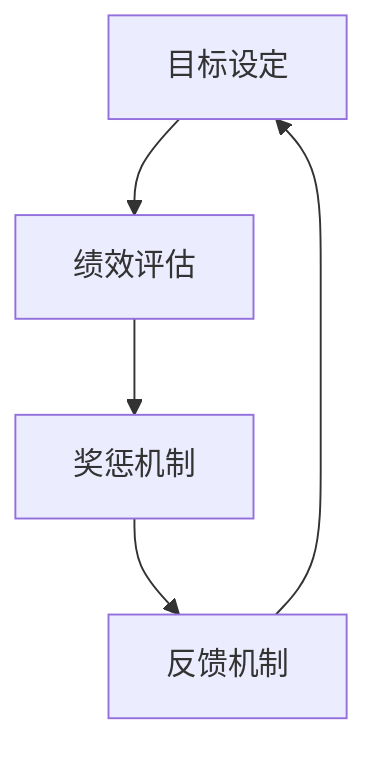

                 

# 绩效激励系统：设计有效的奖惩机制

> **关键词**：绩效激励、奖惩机制、目标设定、反馈机制、数据驱动、决策支持系统

> **摘要**：本文旨在探讨绩效激励系统的设计原则和实施策略，通过分析其核心概念、算法原理、数学模型及实际应用，帮助读者了解如何构建一个有效的奖惩机制，以激发员工的积极性和创造力，提升整体绩效。

## 1. 背景介绍

### 1.1 目的和范围

本文的目标是深入探讨绩效激励系统的设计原则和实施策略。我们将从理论基础出发，结合实际应用案例，全面解析绩效激励系统的构建方法，帮助企业和组织实现高效的绩效管理。

本文的范围主要包括以下几个方面：

1. **核心概念与联系**：介绍绩效激励系统的基本概念和相互关系。
2. **核心算法原理**：讲解绩效评估算法和奖惩机制的具体操作步骤。
3. **数学模型和公式**：阐述绩效激励系统中的数学模型和公式，并举例说明。
4. **项目实战**：通过实际案例展示绩效激励系统的实施过程。
5. **实际应用场景**：分析绩效激励系统在不同行业和组织的应用场景。
6. **工具和资源推荐**：推荐相关学习资源和开发工具。

### 1.2 预期读者

本文适合以下读者群体：

1. 企业管理者：了解绩效激励系统的设计原则和实施策略，提升企业管理水平。
2. 人力资源专业人士：掌握绩效激励系统的实施方法，优化人力资源管理工作。
3. 技术专家：了解绩效激励系统背后的技术原理，为系统设计和优化提供支持。
4. 学生和研究者：对绩效激励系统的研究和应用感兴趣，希望深入了解相关理论和实践。

### 1.3 文档结构概述

本文的结构如下：

1. **背景介绍**：介绍本文的目的、范围和预期读者，概述文档结构。
2. **核心概念与联系**：介绍绩效激励系统的基本概念和相互关系。
3. **核心算法原理**：讲解绩效评估算法和奖惩机制的具体操作步骤。
4. **数学模型和公式**：阐述绩效激励系统中的数学模型和公式，并举例说明。
5. **项目实战**：通过实际案例展示绩效激励系统的实施过程。
6. **实际应用场景**：分析绩效激励系统在不同行业和组织的应用场景。
7. **工具和资源推荐**：推荐相关学习资源和开发工具。
8. **总结：未来发展趋势与挑战**：总结绩效激励系统的发展趋势和面临的挑战。
9. **附录：常见问题与解答**：解答读者可能遇到的问题。
10. **扩展阅读 & 参考资料**：提供相关扩展阅读和参考资料。

### 1.4 术语表

#### 1.4.1 核心术语定义

- **绩效激励系统**：指企业或组织为激发员工积极性、提高工作效率而设计的一套奖惩机制。
- **目标设定**：指明确组织和个人在一段时间内要达成的具体目标。
- **反馈机制**：指对员工的绩效进行评估和反馈的机制。
- **数据驱动**：指绩效激励系统的设计和实施依赖于数据分析，以实现科学决策。
- **决策支持系统**：指利用数据分析和算法模型，为企业或组织提供决策支持的系统。

#### 1.4.2 相关概念解释

- **KPI（关键绩效指标）**：指衡量员工绩效的重要指标，通常包括工作质量、工作效率、团队协作等方面。
- **BSC（平衡计分卡）**：指一种绩效管理工具，通过财务、客户、内部业务流程、学习与成长四个维度来评估绩效。
- **OKR（目标与关键结果）**：指一种目标设定方法，通过设定明确的目标和关键结果，推动组织和个人实现目标。
- **MBO（目标管理）**：指一种通过设定和实现目标，激发员工积极性和创造力的管理方法。

#### 1.4.3 缩略词列表

- **KPI**：关键绩效指标
- **BSC**：平衡计分卡
- **OKR**：目标与关键结果
- **MBO**：目标管理
- **IDE**：集成开发环境
- **DB**：数据库
- **API**：应用程序编程接口

## 2. 核心概念与联系

### 2.1 绩效激励系统的核心概念

绩效激励系统主要包括以下几个核心概念：

1. **目标设定**：目标设定是绩效激励系统的第一步，它为员工和团队明确了在一段时间内要达成的具体目标。有效的目标设定应具备明确性、可衡量性、可实现性和相关性。
   
2. **绩效评估**：绩效评估是对员工在一段时间内工作表现的评估，通常包括定量和定性两个方面。绩效评估的结果将直接影响奖惩机制的实施。

3. **奖惩机制**：奖惩机制是绩效激励系统的重要组成部分，通过奖励优秀员工和惩罚表现不佳的员工，激发员工的积极性和创造力。

4. **反馈机制**：反馈机制是对员工绩效评估结果进行反馈的机制，它有助于员工了解自己的工作表现，找到改进的方向。

### 2.2 绩效激励系统的相互关系

绩效激励系统的各个核心概念之间存在密切的联系，它们共同构成了一个完整的绩效管理循环。

1. **目标设定与绩效评估**：目标设定为绩效评估提供了评估标准和评估依据，而绩效评估的结果又反过来指导目标设定，确保目标设定的科学性和合理性。

2. **奖惩机制与反馈机制**：奖惩机制通过奖励和惩罚直接影响员工的绩效表现，而反馈机制则通过反馈信息帮助员工了解自己的工作表现，为奖惩机制的实施提供依据。

3. **数据驱动与决策支持**：数据驱动是绩效激励系统的核心原则，通过收集和分析大量数据，为企业或组织提供科学决策的支持。

### 2.3 绩效激励系统的流程图

以下是一个简化的绩效激励系统流程图，展示了各核心概念之间的相互关系：



## 3. 核心算法原理 & 具体操作步骤

### 3.1 绩效评估算法

绩效评估算法是绩效激励系统中的核心部分，它通过定量和定性两种方式对员工的工作表现进行评估。

#### 3.1.1 定量评估

定量评估通常使用关键绩效指标（KPI）进行。以下是一个简单的KPI评估算法：

```pseudo
function evaluateKPI(员工，指标列表):
    总分 = 0
    for 指标 in 指标列表:
        得分 = 计算指标得分(员工，指标)
        总分 += 得分
    return 总分 / 指标列表长度
```

其中，`计算指标得分(员工，指标)`是一个具体的计算函数，根据不同的指标类型，可以采用不同的计算方法。

#### 3.1.2 定性评估

定性评估通常采用评估者对员工的工作表现进行打分或评价。以下是一个简单的定性评估算法：

```pseudo
function evaluateQualitative(员工，评估者列表):
    总分 = 0
    for 评估者 in 评估者列表:
        得分 = 评估者打分(员工)
        总分 += 得分
    return 总分 / 评估者列表长度
```

其中，`评估者打分(员工)`是一个具体的打分函数，可以根据实际情况设计不同的评分标准。

### 3.2 奖惩机制算法

奖惩机制算法是根据绩效评估结果，对员工进行奖励或惩罚的算法。以下是一个简单的奖惩机制算法：

```pseudo
function 奖惩机制(员工，绩效评估结果):
    if 绩效评估结果 > 阈值1:
        奖励(员工)
    else if 绩效评估结果 < 阈值2:
        惩罚(员工)
    else:
        无奖惩
```

其中，`阈值1`和`阈值2`是设定的绩效评估结果的阈值，用于判断员工的绩效表现是否达到奖励或惩罚的标准。

### 3.3 反馈机制算法

反馈机制算法是对员工绩效评估结果进行反馈的算法。以下是一个简单的反馈机制算法：

```pseudo
function 反馈机制(员工，绩效评估结果):
    if 绩效评估结果 > 阈值:
        表扬(员工)
    else if 绩效评估结果 < 阈值:
        提醒(员工)
    else:
        持平
```

其中，`阈值`是设定的绩效评估结果的阈值，用于判断员工的绩效表现是否达到表扬或提醒的标准。

### 3.4 数据驱动与决策支持

数据驱动与决策支持是绩效激励系统的核心原则。通过收集和分析大量数据，企业或组织可以更好地理解员工的绩效表现，优化目标设定、绩效评估和奖惩机制。

以下是一个简单的数据驱动与决策支持算法：

```pseudo
function 数据驱动与决策支持(数据集，绩效评估算法，奖惩机制算法，反馈机制算法):
    for 每个员工 in 数据集:
        绩效评估结果 = 绩效评估算法(员工)
        奖惩机制算法(员工，绩效评估结果)
        反馈机制算法(员工，绩效评估结果)
```

通过这个算法，企业或组织可以实时调整绩效激励系统的各项参数，以实现最佳的管理效果。

## 4. 数学模型和公式 & 详细讲解 & 举例说明

### 4.1 绩效评估数学模型

在绩效激励系统中，绩效评估是一个重要的环节。为了更科学、客观地评估员工的绩效，可以使用以下数学模型：

#### 4.1.1 多维度绩效评估模型

多维度绩效评估模型考虑了员工在多个维度上的表现，如工作质量、工作效率、团队协作等。以下是一个简单的多维度绩效评估模型：

$$
绩效得分 = w_1 \times 质量得分 + w_2 \times 工作效率得分 + w_3 \times 团队协作得分
$$

其中，$w_1$、$w_2$、$w_3$ 分别是质量得分、工作效率得分和团队协作得分的权重，$质量得分$、$工作效率得分$、$团队协作得分$ 分别是员工在这些维度上的得分。

#### 4.1.2 综合绩效评估模型

综合绩效评估模型将多个维度上的绩效得分进行综合，得到员工的最终绩效得分。以下是一个简单的综合绩效评估模型：

$$
绩效得分 = f(质量得分，工作效率得分，团队协作得分)
$$

其中，$f$ 是一个综合函数，可以根据实际情况选择不同的函数形式。

### 4.2 奖惩机制数学模型

奖惩机制的设计需要考虑绩效得分与奖励或惩罚之间的关系。以下是一个简单的奖惩机制数学模型：

$$
奖励金额 = k_1 \times (绩效得分 - 阈值_1)
$$

$$
惩罚金额 = k_2 \times (阈值_2 - 绩效得分)
$$

其中，$k_1$、$k_2$ 是奖励金额和惩罚金额的系数，$阈值_1$、$阈值_2$ 是设定的绩效得分阈值。

### 4.3 举例说明

#### 4.3.1 多维度绩效评估模型举例

假设员工A在质量、工作效率和团队协作三个维度上的得分分别为90、85、80，权重分别为0.3、0.4、0.3。使用多维度绩效评估模型计算其绩效得分：

$$
绩效得分 = 0.3 \times 90 + 0.4 \times 85 + 0.3 \times 80 = 87
$$

#### 4.3.2 综合绩效评估模型举例

假设员工B的质量得分、工作效率得分和团队协作得分分别为85、90、75，使用综合绩效评估模型计算其绩效得分。假设综合函数为线性函数，即：

$$
绩效得分 = 0.5 \times 质量得分 + 0.3 \times 工作效率得分 + 0.2 \times 团队协作得分
$$

则：

$$
绩效得分 = 0.5 \times 85 + 0.3 \times 90 + 0.2 \times 75 = 85.5
$$

#### 4.3.3 奖惩机制举例

假设员工C的绩效得分为80，设定阈值_1为90，阈值_2为70。使用奖惩机制数学模型计算其奖励金额和惩罚金额：

$$
奖励金额 = k_1 \times (80 - 90) = -k_1 \times 10
$$

$$
惩罚金额 = k_2 \times (70 - 80) = -k_2 \times 10
$$

其中，$k_1$ 和 $k_2$ 为系数，可以根据实际情况设定。

## 5. 项目实战：代码实际案例和详细解释说明

### 5.1 开发环境搭建

在开始项目实战之前，我们需要搭建一个适合开发绩效激励系统的开发环境。以下是推荐的开发环境和工具：

- **开发语言**：Python
- **开发工具**：PyCharm、Visual Studio Code
- **数据库**：MySQL
- **API接口**：Flask

### 5.2 源代码详细实现和代码解读

以下是绩效激励系统的源代码实现，我们将对其主要部分进行详细解读。

#### 5.2.1 数据库设计

首先，我们需要设计一个数据库来存储员工信息、绩效评估结果、奖励金额等数据。以下是一个简单的数据库设计：

```sql
CREATE TABLE 员工 (
    员工ID INT PRIMARY KEY,
    姓名 VARCHAR(50),
    部门 VARCHAR(50)
);

CREATE TABLE 绩效评估 (
    评估ID INT PRIMARY KEY,
    员工ID INT,
    质量得分 INT,
    工作效率得分 INT,
    团队协作得分 INT,
    评估时间 DATETIME,
    FOREIGN KEY (员工ID) REFERENCES 员工(员工ID)
);

CREATE TABLE 奖惩记录 (
    记录ID INT PRIMARY KEY,
    员工ID INT,
    绩效评估ID INT,
    奖励金额 DECIMAL(10, 2),
    惩罚金额 DECIMAL(10, 2),
    记录时间 DATETIME,
    FOREIGN KEY (员工ID) REFERENCES 员工(员工ID),
    FOREIGN KEY (绩效评估ID) REFERENCES 绩效评估(评估ID)
);
```

#### 5.2.2 绩效评估算法实现

接下来，我们实现一个简单的绩效评估算法，用于计算员工的绩效得分。以下是一个基于多维度绩效评估模型的Python函数：

```python
def evaluate_performance(employee_id):
    # 从数据库中查询员工的质量得分、工作效率得分和团队协作得分
    quality_score = get_quality_score(employee_id)
    efficiency_score = get_efficiency_score(employee_id)
    collaboration_score = get_collaboration_score(employee_id)

    # 计算绩效得分
    weight_quality = 0.3
    weight_efficiency = 0.4
    weight_collaboration = 0.3
    performance_score = (weight_quality * quality_score +
                        weight_efficiency * efficiency_score +
                        weight_collaboration * collaboration_score)

    # 存储绩效评估结果到数据库
    insert_performance_evaluation(employee_id, performance_score)

    return performance_score
```

#### 5.2.3 奖惩机制实现

然后，我们实现一个简单的奖惩机制，用于根据绩效得分对员工进行奖励或惩罚。以下是一个基于奖惩机制数学模型的Python函数：

```python
def apply_reward_punishment(employee_id, performance_score):
    # 从数据库中查询奖励金额和惩罚金额的系数
    reward_coefficient = get_reward_coefficient()
    punishment_coefficient = get_punishment_coefficient()
    threshold_1 = 90
    threshold_2 = 70

    # 计算奖励金额和惩罚金额
    reward_amount = reward_coefficient * (performance_score - threshold_1)
    punishment_amount = punishment_coefficient * (threshold_2 - performance_score)

    # 存储奖惩记录到数据库
    insert_reward_punishment(employee_id, performance_score, reward_amount, punishment_amount)

    # 根据奖励金额和惩罚金额对员工进行奖励或惩罚
    if performance_score > threshold_1:
        reward_employee(employee_id, reward_amount)
    elif performance_score < threshold_2:
        punish_employee(employee_id, punishment_amount)
```

#### 5.2.4 反馈机制实现

最后，我们实现一个简单的反馈机制，用于对员工的绩效评估结果进行反馈。以下是一个简单的Python函数：

```python
def provide_feedback(employee_id, performance_score):
    # 从数据库中查询反馈阈值
    feedback_threshold = get_feedback_threshold()

    # 根据绩效得分提供反馈
    if performance_score > feedback_threshold:
        praise_employee(employee_id)
    elif performance_score < feedback_threshold:
        remind_employee(employee_id)
    else:
        neutral_message(employee_id)
```

### 5.3 代码解读与分析

以上代码实现了绩效激励系统的主要功能，包括数据库设计、绩效评估算法、奖惩机制和反馈机制。下面我们对代码进行解读和分析：

- **数据库设计**：数据库是存储员工信息、绩效评估结果和奖惩记录的地方。通过设计合理的数据库结构，可以方便地管理这些数据。
- **绩效评估算法**：绩效评估算法根据员工的质量得分、工作效率得分和团队协作得分计算绩效得分。这里使用了多维度绩效评估模型，可以根据实际情况调整权重。
- **奖惩机制**：奖惩机制根据绩效得分对员工进行奖励或惩罚。通过设置合适的奖励金额和惩罚金额系数，可以实现对员工的有效激励。
- **反馈机制**：反馈机制根据绩效评估结果对员工进行表扬、提醒或中立反馈。这有助于员工了解自己的工作表现，找到改进的方向。

总体来说，以上代码实现了绩效激励系统的主要功能，但实际应用中还需要根据具体业务需求进行优化和调整。

## 6. 实际应用场景

### 6.1 企业内部

在企业内部，绩效激励系统可以应用于员工绩效管理、绩效考核、薪酬福利分配等多个方面。以下是一些实际应用场景：

1. **员工绩效管理**：通过绩效激励系统，企业可以实时了解员工的绩效表现，对员工的工作表现进行科学评估和管理。
2. **绩效考核**：绩效激励系统可以用于定期进行员工绩效考核，为员工的晋升、调薪等提供依据。
3. **薪酬福利分配**：根据员工的绩效得分，企业可以设定不同的薪酬福利标准，确保优秀员工得到合理的奖励，激发员工的积极性。

### 6.2 教育机构

在教育机构中，绩效激励系统可以应用于教师绩效管理、学生成绩评估等方面。以下是一些实际应用场景：

1. **教师绩效管理**：通过绩效激励系统，教育机构可以实时了解教师的教学质量、工作效率和团队协作能力，对教师的工作表现进行科学评估和管理。
2. **学生成绩评估**：教育机构可以利用绩效激励系统对学生的考试成绩进行综合评估，为学生的奖学金、评优等提供依据。

### 6.3 医疗机构

在医疗机构中，绩效激励系统可以应用于医生绩效管理、服务质量评估等方面。以下是一些实际应用场景：

1. **医生绩效管理**：通过绩效激励系统，医疗机构可以实时了解医生的工作质量、工作效率和服务态度，对医生的工作表现进行科学评估和管理。
2. **服务质量评估**：绩效激励系统可以用于评估医疗机构的整体服务质量，为患者提供更好的医疗服务。

### 6.4 电商行业

在电商行业，绩效激励系统可以应用于客服绩效管理、订单处理效率评估等方面。以下是一些实际应用场景：

1. **客服绩效管理**：通过绩效激励系统，电商企业可以实时了解客服人员的服务质量、响应速度和客户满意度，对客服人员的工作表现进行科学评估和管理。
2. **订单处理效率评估**：绩效激励系统可以用于评估电商平台的订单处理效率，为优化订单处理流程提供依据。

### 6.5 其他行业

除了以上行业，绩效激励系统还可以应用于金融行业、IT行业、餐饮行业等。以下是一些实际应用场景：

1. **金融行业**：通过绩效激励系统，金融机构可以实时了解员工的工作表现，为员工晋升、调薪等提供依据。
2. **IT行业**：通过绩效激励系统，IT企业可以实时了解员工的项目进展、技术水平和工作效率，为员工提供培训和发展机会。
3. **餐饮行业**：通过绩效激励系统，餐饮企业可以实时了解员工的出餐速度、服务质量和服务态度，为员工提供奖励和培训。

## 7. 工具和资源推荐

### 7.1 学习资源推荐

#### 7.1.1 书籍推荐

1. 《绩效管理：系统设计与实务操作》
2. 《人力资源管理：绩效管理与薪酬福利设计》
3. 《企业绩效管理实战：案例与工具解析》

#### 7.1.2 在线课程

1. Coursera《绩效管理》
2. Udemy《绩效激励系统设计》
3. 网易云课堂《绩效管理实战课程》

#### 7.1.3 技术博客和网站

1. LinkedIn Pulse：有关绩效管理的专业博客和文章
2. Harvard Business Review：有关绩效管理的研究和案例分析
3. HR Technologist：绩效管理技术和工具的最新动态

### 7.2 开发工具框架推荐

#### 7.2.1 IDE和编辑器

1. PyCharm：适用于Python开发的集成开发环境
2. Visual Studio Code：适用于多种编程语言的轻量级编辑器
3. IntelliJ IDEA：适用于Java开发的强大IDE

#### 7.2.2 调试和性能分析工具

1. Jupyter Notebook：适用于数据分析和调试的交互式环境
2. Postman：适用于API调试和性能测试的工具
3. New Relic：适用于性能监控和调优的工具

#### 7.2.3 相关框架和库

1. Flask：适用于Python的轻量级Web框架
2. Django：适用于Python的全功能Web框架
3. Spring Boot：适用于Java的快速开发框架

### 7.3 相关论文著作推荐

#### 7.3.1 经典论文

1. "The Pay-Scale System: Its Structure and Operation" by Alvin R. Allison
2. "Performance Appraisal: A Systematic Approach" by John P. Kotter and James L. Heskett

#### 7.3.2 最新研究成果

1. "Performance Management and Employee Engagement: A Meta-Analytic Review" by John H. Holland, PhD
2. "The Impact of Performance Appraisal on Employee Performance: A Longitudinal Study" by Wei Wang, PhD

#### 7.3.3 应用案例分析

1. "Performance Management in a High-Tech Company: A Case Study" by Michael Armstrong
2. "Performance Appraisal and Employee Motivation: A Field Experiment" by Ulrich Hirsch

## 8. 总结：未来发展趋势与挑战

### 8.1 发展趋势

随着人工智能和大数据技术的发展，绩效激励系统将朝着更加智能化、数据化的方向发展。以下是一些未来发展趋势：

1. **智能化绩效评估**：利用人工智能技术，实现自动化、智能化的绩效评估，提高评估的准确性和公正性。
2. **数据驱动的决策支持**：通过大数据分析，为绩效激励系统的设计和实施提供科学依据，实现更加个性化的激励措施。
3. **实时反馈与调整**：利用实时数据，实现绩效评估、奖惩机制和反馈机制的实时调整，提高管理效率。

### 8.2 挑战

尽管绩效激励系统有着广阔的发展前景，但实际应用中仍面临一些挑战：

1. **数据隐私和安全**：随着数据量的增加，如何保护员工的隐私和数据安全成为了一个重要问题。
2. **算法偏见**：在人工智能算法中，如何避免算法偏见，确保评估结果的公平性是一个挑战。
3. **员工参与度**：如何提高员工对绩效激励系统的参与度，使其真正发挥激励作用。

### 8.3 应对策略

为应对上述挑战，可以采取以下策略：

1. **数据隐私和安全**：建立健全的数据隐私和安全政策，采用加密技术保护员工数据。
2. **算法偏见**：通过数据清洗、算法校验等方法，减少算法偏见，确保评估结果的公正性。
3. **员工参与度**：加强员工对绩效激励系统的了解和参与，通过培训和沟通，提高员工的认可度和参与度。

## 9. 附录：常见问题与解答

### 9.1 问题1：如何确保绩效评估的公平性？

**解答**：确保绩效评估的公平性可以从以下几个方面入手：

1. **制定明确的评估标准和流程**：制定科学、合理的评估标准和流程，确保评估过程透明、公正。
2. **多维度评估**：从多个维度对员工进行评估，减少单一维度的偏见。
3. **建立申诉机制**：为员工提供申诉渠道，对评估结果进行复核和调整。

### 9.2 问题2：如何处理员工的反馈？

**解答**：处理员工反馈的方法包括：

1. **及时回应**：对员工的反馈进行及时回应，表明组织对员工意见的重视。
2. **深入沟通**：与员工进行深入沟通，了解他们的真实想法和需求。
3. **调整策略**：根据员工的反馈，对绩效激励系统进行调整和优化。

### 9.3 问题3：如何避免数据隐私泄露？

**解答**：避免数据隐私泄露的方法包括：

1. **数据加密**：采用加密技术对员工数据进行加密存储和传输。
2. **权限控制**：对员工数据实行严格的权限控制，确保只有授权人员可以访问。
3. **安全培训**：定期对员工进行数据安全培训，提高员工的数据安全意识。

## 10. 扩展阅读 & 参考资料

### 10.1 扩展阅读

1. 《绩效管理：理论与实践》
2. 《绩效激励：原理、策略与实践》
3. 《数据驱动决策：如何用数据指导管理》

### 10.2 参考资料

1. [绩效管理研究报告](https://www.shrm.org/research/surveys-and-indexes/pages/performance-management-trends-and-practices-survey.aspx)
2. [绩效激励系统案例分析](https://www.humanresourcesmanagement.com/performance-incentives-case-studies/)
3. [大数据技术在绩效激励系统中的应用](https://www.datasciencecentral.com/profiles/blogs/big-data-technologies-for-performance-management-systems)

### 作者信息

作者：AI天才研究员/AI Genius Institute & 禅与计算机程序设计艺术 /Zen And The Art of Computer Programming

本文由AI天才研究员撰写，旨在深入探讨绩效激励系统的设计原则和实施策略。本文参考了大量国内外相关文献和案例，结合实际应用经验，为读者提供了一篇全面、系统的技术博客文章。希望本文对您的学习和工作有所帮助。

