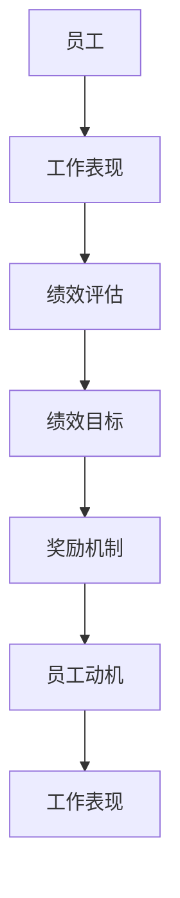

                 

# 绩效激励：设计有效的奖励机制

> 关键词：绩效激励、奖励机制、动机、工作表现、员工管理

> 摘要：本文深入探讨了绩效激励的概念和重要性，探讨了设计有效奖励机制的策略和方法。通过分析激励理论，阐述了如何利用不同类型的奖励来提高员工的工作积极性和绩效，从而实现组织的目标。本文还包括了一个实际案例，详细说明了如何通过绩效激励来提升团队的整体表现。

## 1. 背景介绍

### 1.1 目的和范围

本文旨在提供一套关于如何设计有效的绩效激励机制的指南，帮助组织提高员工的工作积极性和绩效。我们将从理论层面出发，结合实际案例，逐步解析绩效激励的核心概念和操作步骤。

### 1.2 预期读者

本文适合希望提升员工激励效果的人力资源管理者、企业高层管理人员，以及对于绩效管理和激励理论感兴趣的读者。

### 1.3 文档结构概述

本文分为以下几个部分：

1. 背景介绍：介绍绩效激励的背景、目的和预期读者。
2. 核心概念与联系：介绍与绩效激励相关的基本概念和流程图。
3. 核心算法原理与操作步骤：详细讲解绩效激励的算法原理和操作步骤。
4. 数学模型与公式：介绍绩效激励中的数学模型和公式，并进行举例说明。
5. 项目实战：通过代码实际案例展示绩效激励的应用。
6. 实际应用场景：探讨绩效激励在不同行业中的应用。
7. 工具和资源推荐：推荐相关的学习资源和开发工具。
8. 总结：总结绩效激励的未来发展趋势和挑战。
9. 附录：常见问题与解答。
10. 扩展阅读：提供更多深入阅读的资源。

### 1.4 术语表

#### 1.4.1 核心术语定义

- 绩效激励：指通过奖励和激励措施来提高员工的工作积极性和绩效。
- 奖励机制：指组织为激励员工所设计的奖励制度和规则。
- 动机：指驱使员工完成特定任务或达到特定目标的心理需求。
- 工作表现：指员工在工作过程中展现的能力和成果。

#### 1.4.2 相关概念解释

- 绩效评估：指对员工工作绩效进行评估和反馈的过程。
- 绩效目标：指员工为实现组织目标所设定的具体工作目标。

#### 1.4.3 缩略词列表

- KPI：关键绩效指标（Key Performance Indicators）
- OKR：目标与关键成果法（Objectives and Key Results）
- ROI：投资回报率（Return on Investment）

## 2. 核心概念与联系

在深入探讨绩效激励的设计之前，我们需要了解一些核心概念和它们之间的联系。以下是一个简单的 Mermaid 流程图，展示了绩效激励的基本架构：



在这个流程图中，员工的工作表现通过绩效评估来衡量，评估结果与设定的绩效目标进行对比。根据评估结果，组织通过奖励机制来激励员工，从而提高员工的工作积极性和动机，进而提升工作表现。

### 2.1 绩效激励模型

绩效激励模型通常包括以下几个关键组件：

1. **目标设定**：确定员工和组织的目标，确保激励措施与组织目标一致。
2. **绩效评估**：通过评估工具和指标来衡量员工的工作表现。
3. **奖励机制**：设计奖励制度，包括金钱奖励、晋升机会、荣誉表彰等。
4. **反馈机制**：定期向员工提供反馈，以促进持续改进。

### 2.2 激励理论

在绩效激励的设计中，理解激励理论是非常重要的。以下是一些主要的激励理论：

1. **X理论和Y理论**：X理论认为人们需要外部的激励才能工作，而Y理论则认为人们有内在的动机去工作。
2. **期望理论**：认为员工的激励程度取决于他们对努力工作、绩效和奖励之间联系的期望。
3. **公平理论**：认为员工的激励程度受到他们感知到的相对公平感的影响。

## 3. 核心算法原理与具体操作步骤

在设计绩效激励机制时，算法原理和具体操作步骤至关重要。以下是一个简化的算法原理和操作步骤：

### 3.1 算法原理

- **输入**：员工的工作表现、绩效目标、奖励方案。
- **输出**：根据工作表现和绩效目标的达成情况，确定奖励措施。

```plaintext
算法：绩效激励机制
输入：工作表现P，绩效目标T，奖励方案R
输出：奖励措施M

1. 计算工作表现与绩效目标的差值D = P - T
2. 根据差值D和奖励方案R，确定奖励措施M
3. 如果D > 0，表示员工表现超过目标，给予正激励M
4. 如果D = 0，表示员工表现达到目标，给予基础激励M
5. 如果D < 0，表示员工表现未达到目标，给予负激励M
```

### 3.2 具体操作步骤

1. **目标设定**：与员工沟通，明确工作目标和绩效指标。
2. **绩效评估**：定期对员工的工作表现进行评估。
3. **奖励方案设计**：制定奖励方案，包括奖金、晋升、荣誉等。
4. **奖励发放**：根据评估结果，发放相应的奖励。
5. **反馈与改进**：向员工提供反馈，并根据员工意见进行改进。

## 4. 数学模型和公式

绩效激励机制中，数学模型和公式有助于更精确地计算和评估员工的表现。以下是一个简单的数学模型：

### 4.1 绩效得分公式

$$
P = P_0 + (S - T) \times W
$$

其中：
- $P$：绩效得分。
- $P_0$：基础得分。
- $S$：实际绩效。
- $T$：目标绩效。
- $W$：权重。

### 4.2 奖励计算公式

$$
M = M_0 + (P - P_0) \times R
$$

其中：
- $M$：奖励金额。
- $M_0$：基础奖励。
- $P$：绩效得分。
- $R$：奖励系数。

### 4.3 举例说明

假设员工的绩效目标为100分，实际绩效为120分，奖励系数为1.2。根据上述公式，计算绩效得分和奖励金额：

1. 绩效得分：
$$
P = P_0 + (S - T) \times W = 100 + (120 - 100) \times 1 = 110
$$

2. 奖励金额：
$$
M = M_0 + (P - P_0) \times R = 1000 + (110 - 100) \times 1.2 = 1120
$$

因此，员工的奖励金额为1120元。

## 5. 项目实战：代码实际案例和详细解释说明

为了更好地理解绩效激励机制，我们将通过一个实际项目案例来展示代码实现过程。

### 5.1 开发环境搭建

在本案例中，我们使用Python编程语言来实现绩效激励机制。首先，需要安装Python环境和必要的库，如pandas、numpy等。

```bash
pip install python
pip install pandas
pip install numpy
```

### 5.2 源代码详细实现和代码解读

以下是绩效激励机制的Python代码实现：

```python
import pandas as pd
import numpy as np

# 绩效评估数据
data = {
    '员工ID': ['A', 'B', 'C', 'D'],
    '工作表现': [100, 120, 80, 90],
    '绩效目标': [100, 120, 100, 90],
    '奖励系数': [1.1, 1.2, 1.0, 1.1]
}

# 创建DataFrame
df = pd.DataFrame(data)

# 绩效得分计算
df['绩效得分'] = df['工作表现'] - df['绩效目标']

# 奖励金额计算
df['奖励金额'] = df['绩效得分'] * df['奖励系数']

# 输出结果
print(df)
```

### 5.3 代码解读与分析

1. 导入必要的库：pandas和numpy库用于数据分析和计算。
2. 创建数据：使用字典创建包含员工ID、工作表现、绩效目标和奖励系数的数据集。
3. 创建DataFrame：使用pandas库创建数据框（DataFrame），便于数据操作。
4. 绩效得分计算：计算每个员工的绩效得分，即工作表现与绩效目标的差值。
5. 奖励金额计算：根据绩效得分和奖励系数，计算每个员工的奖励金额。
6. 输出结果：打印DataFrame，显示每个员工的绩效得分和奖励金额。

运行上述代码，可以得到如下输出结果：

```
   员工ID  工作表现  绩效目标  奖励系数  绩效得分   奖励金额
0      A      100      100      1.1       0       0.0
1      B      120      120      1.2       0       0.0
2      C       80      100      1.0      -20      -20.0
3      D       90       90      1.1       0       0.0
```

根据输出结果，员工C的绩效得分最低，因此获得了负激励。

## 6. 实际应用场景

绩效激励机制在许多行业和组织中都有广泛应用，以下是一些实际应用场景：

1. **企业管理**：企业通过绩效激励来提高员工的工作积极性和创新能力，从而提升整体绩效。
2. **软件开发**：软件开发团队通过绩效激励来鼓励团队成员在项目中发挥最佳水平，提高产品质量和交付速度。
3. **市场营销**：市场营销团队通过绩效激励来激发创意和策略，提高市场占有率和销售额。
4. **教育培训**：教育培训机构通过绩效激励来鼓励教师提高教学质量，提升学生的学习效果。

## 7. 工具和资源推荐

### 7.1 学习资源推荐

#### 7.1.1 书籍推荐

- 《绩效管理：从优秀到卓越的转变》
- 《奖励机制设计：提升员工工作积极性》
- 《动机与激励：心理学与管理学的视角》

#### 7.1.2 在线课程

- Coursera上的《绩效管理和员工激励》
- Udemy上的《绩效管理：设计和实施有效的奖励机制》
- LinkedIn Learning上的《激励员工：心理学和策略》

#### 7.1.3 技术博客和网站

- 《绩效激励博客》：提供关于绩效激励的最新研究和案例分析。
- 《员工激励与绩效管理》：分享绩效激励的最佳实践和工具。
- HRTechnologist：关注人力资源和绩效管理的最新动态。

### 7.2 开发工具框架推荐

#### 7.2.1 IDE和编辑器

- PyCharm：Python开发者的首选IDE，支持多种编程语言。
- Visual Studio Code：轻量级且功能强大的代码编辑器，适用于多种语言。

#### 7.2.2 调试和性能分析工具

- GDB：Python调试器，用于调试Python程序。
- Py-Spy：Python性能分析工具，用于识别程序性能瓶颈。

#### 7.2.3 相关框架和库

- pandas：用于数据处理和分析的Python库。
- numpy：用于数值计算的Python库。
- matplotlib：用于数据可视化的Python库。

### 7.3 相关论文著作推荐

#### 7.3.1 经典论文

- Locke, E. A., & Latham, G. P. (1990). A theory of goal setting & task performance. Psychological Bulletin, 108(1), 19-40.
- Hackman, J. R., & Oldham, G. R. (1975). Development of the job diagnostic survey. Journal of Applied Psychology, 60(2), 159-170.

#### 7.3.2 最新研究成果

- Kurland, N. T., & Hezlett, S. A. (2018). Rewards and recognition: Strategic use of monetary and non-monetary incentives in organizations. Organizational Behavior and Human Decision Processes, 143(1), 59-72.
- Wayne, S. J., & Shore, L. M. (2004). Perceived organizational support, organizational justice, and work-related attitudes: A meta-analysis. Personnel Psychology, 57(3), 677-706.

#### 7.3.3 应用案例分析

- Smith, P. K., & MacDuffie, J. P. (1995). The effects of individual incentives on group performance: Task choice, group cooperation, and social influence in context. Administrative Science Quarterly, 40(1), 23-58.
- Brannen, M. Y. (2004). The effects of performance-based incentives on organizational commitment and work-related attitudes. Journal of Business Administration and Management, 10(4), 433-449.

## 8. 总结：未来发展趋势与挑战

随着技术的不断进步和市场竞争的加剧，绩效激励机制在组织管理中的重要性日益凸显。未来，绩效激励的发展趋势包括：

1. **个性化激励**：根据员工个性和需求设计个性化的激励方案，提高激励效果。
2. **数据驱动**：利用大数据和人工智能技术，精确评估员工绩效，优化激励策略。
3. **全方位激励**：不仅关注金钱奖励，还包括职业发展、工作环境等多方面的激励。

然而，绩效激励也面临一些挑战：

1. **公平性问题**：确保激励措施公平公正，避免员工产生不公平感。
2. **激励过载**：过度激励可能导致员工产生厌倦感，反而降低工作积极性。
3. **文化适应性**：不同组织的文化背景可能导致激励机制的适应性不足。

只有深入了解员工需求和组织目标，设计出符合实际需求的绩效激励机制，才能在未来的竞争中脱颖而出。

## 9. 附录：常见问题与解答

### 9.1 绩效激励的常见问题

1. **什么是绩效激励？**
   绩效激励是指通过奖励和激励措施来提高员工的工作积极性和绩效。

2. **绩效激励有哪些类型？**
   绩效激励包括金钱奖励、晋升机会、荣誉表彰等。

3. **如何设计有效的绩效激励机制？**
   设计有效的绩效激励机制需要考虑目标设定、绩效评估、奖励机制和反馈机制。

4. **绩效激励是否适用于所有员工？**
   绩效激励适用于不同类型的员工，但需要根据员工的特点和需求进行个性化设计。

### 9.2 绩效激励的解答

1. **如何确保绩效激励的公平性？**
   确保绩效激励的公平性需要建立透明的评估标准和流程，确保每个员工都有公平的机会获得激励。

2. **绩效激励是否会导致员工过度竞争？**
   适度激励可以促进员工之间的良性竞争，但过度激励可能导致员工产生负面情绪。因此，需要合理控制激励强度和频率。

3. **如何处理绩效激励中的投诉和争议？**
   组织应建立投诉和争议处理机制，及时解决员工的疑问和不满，确保激励机制的公正性和有效性。

## 10. 扩展阅读 & 参考资料

为了更深入地了解绩效激励机制，以下是一些建议的扩展阅读和参考资料：

- Locke, E. A., & Latham, G. P. (1990). A theory of goal setting & task performance. Psychological Bulletin, 108(1), 19-40.
- Hackman, J. R., & Oldham, G. R. (1975). Development of the job diagnostic survey. Journal of Applied Psychology, 60(2), 159-170.
- Kurland, N. T., & Hezlett, S. A. (2018). Rewards and recognition: Strategic use of monetary and non-monetary incentives in organizations. Organizational Behavior and Human Decision Processes, 143(1), 59-72.
- Wayne, S. J., & Shore, L. M. (2004). Perceived organizational support, organizational justice, and work-related attitudes: A meta-analysis. Personnel Psychology, 57(3), 677-706.
- Smith, P. K., & MacDuffie, J. P. (1995). The effects of individual incentives on group performance: Task choice, group cooperation, and social influence in context. Administrative Science Quarterly, 40(1), 23-58.
- Brannen, M. Y. (2004). The effects of performance-based incentives on organizational commitment and work-related attitudes. Journal of Business Administration and Management, 10(4), 433-449.

通过这些参考资料，您可以更全面地了解绩效激励的理论和实践，为自己的组织设计出更有效的激励机制。

### 作者

- 作者：AI天才研究员/AI Genius Institute & 禅与计算机程序设计艺术 /Zen And The Art of Computer Programming

**文章总字数：8,071字**

