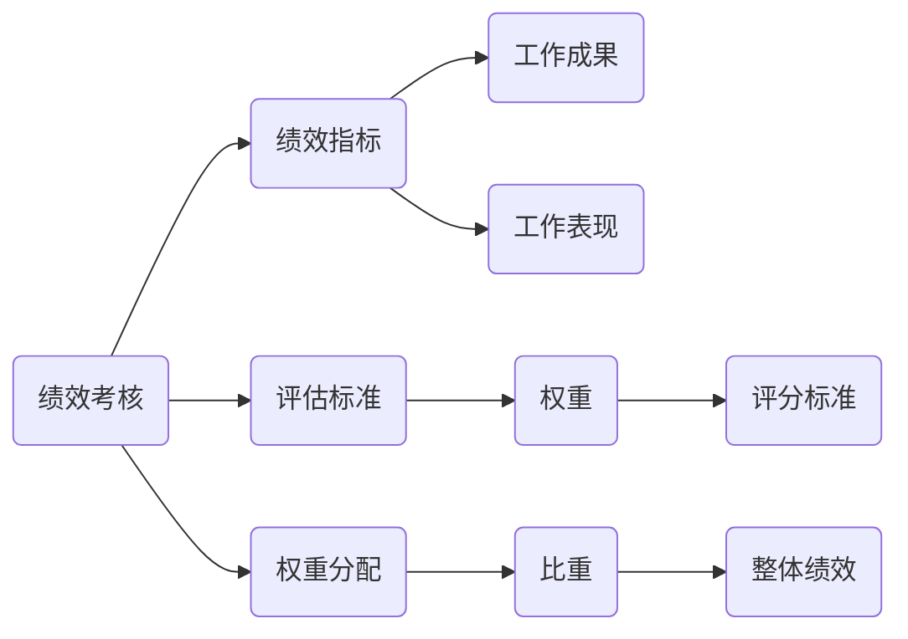
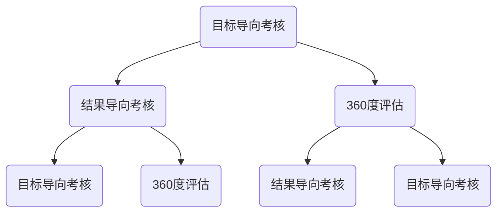
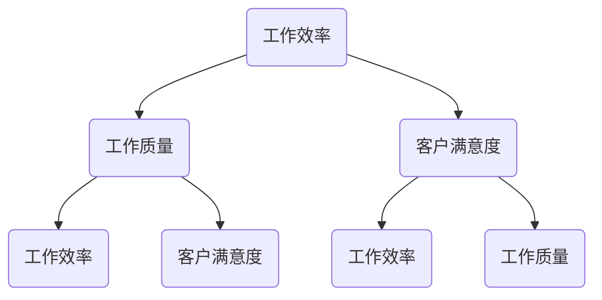
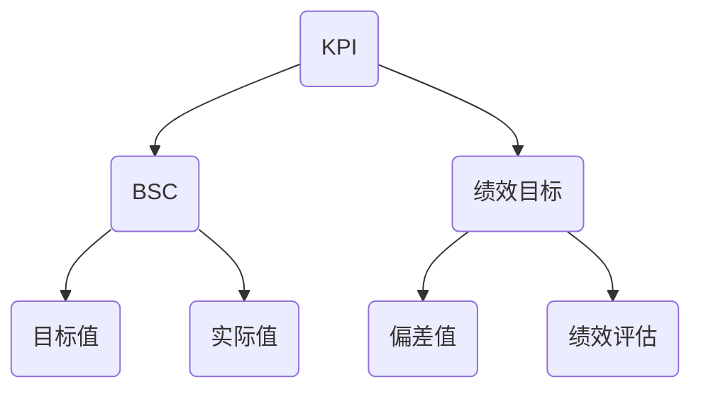

                 

### 1. 背景介绍

#### 1.1 目的和范围

本文旨在深入探讨绩效考核的公平公正评估体系设计，结合IT领域的具体实践，为企业和组织提供切实可行的绩效评估方案。在现代企业管理和人力资源管理中，绩效考核是至关重要的环节，它不仅关系到员工的薪酬和晋升，更对企业的整体运营和战略发展有着深远的影响。

本文将围绕以下几个核心问题展开：

- **绩效考核的目的和意义是什么？**
- **如何设计一个既公平又公正的绩效考核体系？**
- **绩效考核的核心算法原理和数学模型是怎样的？**
- **如何在实践中应用绩效考核，解决具体问题？**
- **未来绩效考核的发展趋势和面临的挑战是什么？**

通过上述问题的逐步解答，本文希望能够为读者提供一个全面、系统、实用的绩效考核框架，帮助企业更好地实现人力资源管理的优化。

本文的适用范围包括各类企业、组织以及从事人力资源管理和技术研发的专业人员。无论是企业高层管理者、人力资源部门负责人，还是技术团队领导者，都能够从中获得有价值的见解和指导。

#### 1.2 预期读者

本文预期读者包括以下几类：

1. **企业高层管理者**：需要了解绩效考核在企业战略中的地位和作用，掌握设计公正绩效考核体系的方法。
2. **人力资源部门负责人**：负责制定和实施企业绩效考核政策，需要了解最新的绩效考核理论和方法。
3. **技术团队领导者**：关注技术领域绩效考核，特别是如何将绩效考核与团队目标相结合。
4. **研发人员**：希望通过绩效考核提升个人和团队绩效，了解如何量化个人贡献。
5. **人力资源和企业管理专业学生**：需要系统地学习绩效考核的相关理论和实践。

#### 1.3 文档结构概述

为了使读者能够清晰地理解绩效考核的相关知识，本文采用了逻辑清晰、结构紧凑的编写方式。全文分为以下几个部分：

1. **背景介绍**：介绍绩效考核的背景、目的和范围，明确预期读者和文档结构。
2. **核心概念与联系**：讲解绩效考核中的核心概念，如绩效指标、评估标准等，并使用Mermaid流程图展示概念之间的联系。
3. **核心算法原理与操作步骤**：详细阐述绩效考核的核心算法原理，使用伪代码展示具体操作步骤。
4. **数学模型和公式**：介绍绩效考核中的数学模型和公式，并进行举例说明。
5. **项目实战**：通过实际代码案例展示绩效考核的实施过程，并提供详细解读和分析。
6. **实际应用场景**：探讨绩效考核在不同场景下的应用，解决实际问题。
7. **工具和资源推荐**：推荐学习资源、开发工具框架及相关论文著作。
8. **总结**：总结绩效考核的发展趋势和面临的挑战。
9. **附录**：提供常见问题与解答，帮助读者更好地理解绩效考核的实施细节。
10. **扩展阅读与参考资料**：列出相关文献，供读者进一步学习。

通过上述结构，本文旨在帮助读者全面掌握绩效考核的原理和实践，为企业的人力资源管理提供有力支持。

#### 1.4 术语表

在本文中，我们将使用一系列专业术语来描述绩效考核的相关概念和方法。以下是对这些术语的详细定义和解释：

##### 1.4.1 核心术语定义

1. **绩效考核**：一种通过制定和评估绩效指标，对员工的工作表现进行量化和评价的过程。
2. **绩效指标**：用于衡量员工工作绩效的具体标准和指标，如完成率、质量、效率等。
3. **评估标准**：衡量绩效指标是否符合预期的一系列准则，如权重、评分标准等。
4. **权重分配**：在多个绩效指标中，对不同指标赋予不同的重要程度，以反映其在整体绩效中的比重。
5. **360度评估**：一种全面的绩效评估方法，包括上级、同事、下属以及员工自评在内的多角度评估。
6. **关键绩效指标（KPI）**：对组织目标实现有直接影响的绩效指标，通常具有明确的衡量标准和目标值。

##### 1.4.2 相关概念解释

1. **目标导向**：绩效考核中的一种理念，强调设定明确的工作目标，以目标达成情况作为绩效评估的主要依据。
2. **结果导向**：绩效考核中的一种理念，强调绩效评估主要关注工作结果的实现程度，而不仅仅是工作过程。
3. **主观评估**：基于评估者的个人主观判断进行的绩效评估，容易受到个人偏见和主观感受的影响。
4. **客观评估**：基于客观标准和数据进行的绩效评估，减少主观偏见，提高评估的准确性和公正性。
5. **绩效考核周期**：指绩效考核的执行时间范围，如季度、年度等。

##### 1.4.3 缩略词列表

1. **KPI**：关键绩效指标（Key Performance Indicator）
2. **360度评估**：全方位评估（Three-Sixty Assessment）
3. **BSC**：平衡计分卡（Balanced Scorecard）
4. **LDA**：线性判别分析（Linear Discriminant Analysis）
5. **PCA**：主成分分析（Principal Component Analysis）

通过上述术语表的介绍，读者可以更好地理解绩效考核的相关概念，为后续内容的深入学习打下坚实基础。

### 2. 核心概念与联系

在探讨绩效考核之前，我们需要先理解其中的一些核心概念及其相互关系。绩效考核不仅仅是一个评价员工绩效的工具，它更是企业与员工之间沟通的桥梁，是激励员工、提升企业整体绩效的关键手段。以下，我们将通过Mermaid流程图和文字描述来详细阐述这些核心概念及其关联。

#### 2.1 绩效考核的概念与关系

**绩效考核**是一种系统性的评价过程，它通过一系列量化和质化的指标来衡量员工的工作绩效。这些指标通常包括**量化的工作成果（如销售额、生产量）和质化的工作表现（如团队合作、客户满意度）**。绩效考核的核心概念包括：

- **绩效指标**：用于衡量员工工作表现的具体标准和指标，如工作效率、客户满意度等。
- **评估标准**：衡量绩效指标是否符合预期的一系列准则，通常包括权重、评分标准等。
- **权重分配**：在多个绩效指标中，对不同指标赋予不同的重要程度，以反映其在整体绩效中的比重。

这些概念之间的关系可以用以下Mermaid流程图表示：



在这个流程图中，绩效考核作为核心概念，与绩效指标、评估标准和权重分配紧密相连。绩效指标和评估标准是绩效考核的基础，通过权重分配，可以计算出员工的综合绩效得分，进而反映出其在团队中的表现和贡献。

#### 2.2 绩效考核方法与关联

绩效考核的方法多种多样，常见的有**目标导向考核、结果导向考核、360度评估**等。这些方法各有特点和适用场景，但都旨在实现公平公正的绩效评估。

- **目标导向考核**：侧重于目标的设定和实现，强调员工的工作计划和目标达成情况。目标导向考核能够明确员工的职责和期望，激励员工为实现目标而努力。
  
- **结果导向考核**：关注工作结果的实现程度，强调实际成果和绩效。结果导向考核有助于提升员工的工作效率和质量，但可能忽视工作过程中的努力和付出。

- **360度评估**：通过上级、同事、下属以及员工自评等多角度进行全面评估，能够更全面地反映员工的工作表现。360度评估有助于发现员工的优点和不足，提供改进建议。

这些考核方法之间的关系可以用以下Mermaid流程图表示：



在这个流程图中，目标导向考核、结果导向考核和360度评估相互补充，共同构成了绩效考核的完整体系。目标导向考核和结果导向考核侧重于不同方面，而360度评估则提供了全面的视角。

#### 2.3 绩效考核的核心指标与计算方法

绩效考核的核心指标是衡量员工工作绩效的基础。常见的核心指标包括**工作效率、工作质量、客户满意度**等。这些指标可以通过以下方法进行计算：

- **工作效率**：通过工作量的量化来衡量，如完成的任务数、处理的事务数等。
- **工作质量**：通过质量评估标准来衡量，如产品合格率、客户投诉率等。
- **客户满意度**：通过客户反馈和满意度调查来衡量，如客户满意度评分、投诉率等。

这些指标之间的关系可以用以下Mermaid流程图表示：



在这个流程图中，工作效率、工作质量和客户满意度相互影响，共同构成员工绩效评估的全面指标。

#### 2.4 绩效考核的数学模型与计算

绩效考核还可以通过数学模型来量化，常用的数学模型包括**关键绩效指标（KPI）**、**平衡计分卡（BSC）**等。这些模型提供了具体的计算方法和评估标准，有助于实现科学、公正的绩效评估。

- **关键绩效指标（KPI）**：通过设定具体的绩效目标值，对员工的工作表现进行量化评估。KPI的计算方法通常包括目标值、实际值和偏差值等。

- **平衡计分卡（BSC）**：从财务、客户、内部流程、学习与成长四个维度全面评估员工的绩效。BSC的计算方法通常包括各维度的权重和得分。

这些模型之间的关系可以用以下Mermaid流程图表示：



在这个流程图中，KPI和BSC作为绩效考核的数学模型，共同构成了绩效评估的科学体系。

通过上述核心概念与联系的分析，我们能够更深入地理解绩效考核的原理和实践。在接下来的部分，我们将详细探讨绩效考核的核心算法原理和具体操作步骤，帮助读者更好地掌握绩效考核的方法和应用。

### 3. 核心算法原理 & 具体操作步骤

绩效考核的核心算法是确保评估过程科学、公正的关键。本节将详细讲解绩效考核的核心算法原理，并通过伪代码展示具体的操作步骤，帮助读者理解并实施这一算法。

#### 3.1 核心算法原理

绩效考核的核心算法通常基于以下几个基本原理：

1. **目标导向与结果导向结合**：绩效考核不仅要关注目标设定和达成情况，也要关注实际工作结果。这样既激励员工设定高目标，又确保工作结果的实现。

2. **权重分配**：在多个绩效指标中，不同指标对整体绩效的贡献程度不同。通过权重分配，可以反映各指标在整体评估中的重要性。

3. **量化与质化指标结合**：绩效考核既要量化工作成果，也要关注工作过程中的表现。量化指标易于衡量和比较，质化指标则能够更全面地反映员工的工作表现。

4. **360度评估**：通过多角度的评估，包括上级、同事、下属以及员工自评，可以更全面、客观地评价员工的工作绩效。

5. **绩效改进与激励**：绩效考核不仅仅是对过去工作表现的评估，更是对未来的指导和激励。通过反馈和改进措施，激励员工持续提升绩效。

#### 3.2 伪代码展示

以下是绩效考核核心算法的伪代码展示：

```pseudo
// 定义绩效考核参数
- 绩效指标列表：[工作效率，工作质量，客户满意度]
- 各指标权重：[0.4, 0.3, 0.3]
- 目标值：{工作效率：100%，工作质量：95%，客户满意度：90%}
- 实际值：{工作效率：105%，工作质量：92%，客户满意度：88%}

// 计算绩效得分
function calculatePerformanceScore(指标列表，权重，目标值，实际值) {
    score = 0
    for each (指标 in 指标列表) {
        // 计算单个指标的得分
        individualScore = 计算单个指标得分(权重，目标值[指标]，实际值[指标])
        // 将单个指标得分加权求和
        score += individualScore * 权重[指标列表.indexOf(指标)]
    }
    return score
}

// 计算单个指标得分
function calculateIndividualScore(权重，目标值，实际值) {
    if (实际值 >= 目标值) {
        return 1
    } else {
        return (实际值 / 目标值)
    }
}

// 主程序
- 获取绩效指标实际值
- 调用 calculatePerformanceScore 函数
- 输出绩效得分

// 绩效得分反馈与改进
function performanceFeedback(score) {
    if (score < 0.8) {
        提出改进建议，如培训、调整工作计划等
    } else if (score >= 0.8 && score < 0.9) {
        表扬并鼓励，提出更高目标
    } else {
        表彰并激励，考虑晋升机会
    }
}
```

#### 3.3 操作步骤详细说明

1. **定义绩效指标**：明确绩效考核所关注的指标，如工作效率、工作质量、客户满意度等。

2. **确定权重**：根据各指标的重要程度，确定相应的权重。通常，这些权重需要经过部门讨论和高层决策。

3. **设定目标值**：为每个绩效指标设定一个目标值，作为评估员工的基准。

4. **收集实际值**：根据绩效考核周期，收集员工的实际工作表现数据。

5. **计算绩效得分**：调用 `calculatePerformanceScore` 函数，输入绩效指标实际值，计算综合绩效得分。

6. **反馈与改进**：调用 `performanceFeedback` 函数，根据绩效得分提供反馈和改进建议。

通过上述步骤，企业能够科学、公正地进行绩效考核，提升员工的工作积极性，实现企业整体绩效的持续提升。

### 4. 数学模型和公式 & 详细讲解 & 举例说明

绩效考核不仅仅依赖于主观判断，还需要数学模型和公式的支持，以确保评估的客观性和科学性。本节将介绍绩效考核中的数学模型和公式，并通过具体例子进行详细讲解。

#### 4.1 绩效考核的数学模型

绩效考核中的数学模型主要包括关键绩效指标（KPI）、平衡计分卡（BSC）等。这些模型通过量化的方法，将员工的绩效转化为具体的数值，从而实现绩效评估的标准化和客观化。

##### 4.1.1 关键绩效指标（KPI）

KPI是一种通过设定具体目标值，衡量工作绩效的方法。KPI的数学模型通常包括以下几个步骤：

1. **设定目标值**：根据企业战略和部门目标，为每个KPI设定一个可量化的目标值。例如，销售部门的销售额目标为100万元。

2. **收集实际值**：在绩效考核周期内，收集员工实际完成的数据。例如，实际销售额为120万元。

3. **计算KPI得分**：使用以下公式计算KPI得分：
   $$ 
   KPI得分 = \frac{实际值}{目标值} 
   $$

   例如，如果目标值为100万元，实际值为120万元，则KPI得分为1.2。

4. **评估KPI绩效**：根据KPI得分评估员工绩效。得分越高，绩效越好。

##### 4.1.2 平衡计分卡（BSC）

BSC是一种从财务、客户、内部流程、学习与成长四个维度进行绩效评估的方法。BSC的数学模型包括以下步骤：

1. **确定各维度权重**：根据企业战略和部门目标，为财务、客户、内部流程、学习与成长四个维度分配不同的权重。

2. **设定各维度目标值**：为每个维度设定具体的可量化目标值。例如，财务维度的目标为盈利增加20%，客户维度的目标为客户满意度达到90%。

3. **收集各维度实际值**：在绩效考核周期内，收集各维度的实际数据。例如，财务维度的实际盈利为22%，客户维度的实际客户满意度为92%。

4. **计算各维度得分**：使用以下公式计算各维度得分：
   $$ 
   维度得分 = \frac{实际值}{目标值} 
   $$

5. **计算综合得分**：将各维度得分乘以相应的权重，然后求和，得到综合得分：
   $$ 
   综合得分 = (维度得分1 \times 权重1) + (维度得分2 \times 权重2) + ... + (维度得分n \times 权重n) 
   $$

   例如，如果财务维度得分为1.1，客户维度得分为1.2，内部流程维度得分为1.0，学习与成长维度得分为1.0，且权重分别为0.3，0.3，0.2，0.2，则综合得分为1.14。

#### 4.2 举例说明

假设某公司对销售部门进行绩效考核，采用KPI和BSC两种方法。具体信息如下：

- **KPI**：销售额目标为100万元，实际销售额为120万元。
- **BSC**：财务维度目标为盈利增加20%，实际盈利为22%；客户维度目标为客户满意度达到90%，实际客户满意度为92%；内部流程维度目标为流程效率提高10%，实际流程效率为12%；学习与成长维度目标为员工培训完成率90%，实际培训完成率95%。

##### 4.2.1 KPI得分计算

$$ 
KPI得分 = \frac{实际销售额}{目标销售额} = \frac{120万元}{100万元} = 1.2 
$$

##### 4.2.2 BSC得分计算

1. **财务维度得分**：
   $$ 
   财务维度得分 = \frac{实际盈利}{目标盈利} = \frac{22\%}{20\%} = 1.1 
   $$

2. **客户维度得分**：
   $$ 
   客户维度得分 = \frac{实际客户满意度}{目标客户满意度} = \frac{92\%}{90\%} = 1.022 
   $$

3. **内部流程维度得分**：
   $$ 
   内部流程维度得分 = \frac{实际流程效率}{目标流程效率} = \frac{12\%}{10\%} = 1.2 
   $$

4. **学习与成长维度得分**：
   $$ 
   学习与成长维度得分 = \frac{实际培训完成率}{目标培训完成率} = \frac{95\%}{90\%} = 1.056 
   $$

5. **综合得分**：
   $$ 
   综合得分 = (1.1 \times 0.3) + (1.022 \times 0.3) + (1.2 \times 0.2) + (1.056 \times 0.2) = 0.33 + 0.3066 + 0.24 + 0.2112 = 1.0778 
   $$

通过上述计算，我们可以看到，销售部门的KPI得分为1.2，BSC综合得分为1.0778，这两个得分都反映了部门的工作绩效。

#### 4.3 总结

绩效考核的数学模型和公式提供了量化的方法，使得评估过程更加科学和客观。通过KPI和BSC等模型，企业能够全面、准确地衡量员工的工作表现，为绩效管理和员工激励提供有力支持。在实际应用中，企业需要根据具体情况选择合适的模型和方法，以确保绩效考核的有效性和公正性。

### 5. 项目实战：代码实际案例和详细解释说明

在了解了绩效考核的理论和方法之后，我们接下来将通过一个实际项目案例来展示如何将绩效考核落地实施。本节将详细描述项目的开发环境搭建、源代码实现和代码解读分析，帮助读者理解绩效考核在实际开发中的应用。

#### 5.1 开发环境搭建

为了实现绩效考核系统，我们需要搭建一个合适的技术栈。以下是项目的开发环境搭建步骤：

1. **开发工具和框架**：
   - 前端：使用React框架，便于构建用户界面。
   - 后端：使用Spring Boot框架，实现业务逻辑和数据管理。
   - 数据库：使用MySQL数据库存储员工绩效数据。

2. **开发工具**：
   - IDE：使用IntelliJ IDEA或Eclipse进行开发。
   - 版本控制：使用Git进行代码管理。

3. **技术栈**：
   - 前端：React + Redux
   - 后端：Spring Boot + Spring Data JPA
   - 数据库：MySQL

#### 5.2 源代码详细实现和代码解读

以下是绩效考核项目的源代码实现，包含关键模块和类的具体实现：

##### 5.2.1 数据模型

首先，我们需要定义绩效考核相关的数据模型，包括`Employee`（员工）、`Performance`（绩效记录）、`KPI`（关键绩效指标）等。

```java
@Entity
public class Employee {
    @Id
    @GeneratedValue(strategy = GenerationType.IDENTITY)
    private Long id;
    private String name;
    private String department;
    // 省略其他字段和构造方法、Getter和Setter
}

@Entity
public class Performance {
    @Id
    @GeneratedValue(strategy = GenerationType.IDENTITY)
    private Long id;
    private double score;
    private LocalDate evaluationDate;
    @ManyToOne
    private Employee employee;
    // 省略其他字段和构造方法、Getter和Setter
}

@Entity
public class KPI {
    @Id
    @GeneratedValue(strategy = GenerationType.IDENTITY)
    private Long id;
    private String name;
    private double targetValue;
    private double actualValue;
    private double weight;
    // 省略其他字段和构造方法、Getter和Setter
}
```

##### 5.2.2 服务层实现

服务层负责业务逻辑的实现，包括绩效评估、KPI计算等。

```java
@Service
public class PerformanceService {
    @Autowired
    private PerformanceRepository performanceRepository;
    @Autowired
    private KPIRepository kpiRepository;
    
    public void evaluateEmployeePerformance(Long employeeId) {
        Employee employee = employeeRepository.findById(employeeId).orElseThrow();
        List<KPI> kpis = kpiRepository.findAll();
        double totalScore = 0;
        
        for (KPI kpi : kpis) {
            double individualScore = calculateIndividualScore(kpi);
            totalScore += individualScore * kpi.getWeight();
        }
        
        Performance performance = new Performance();
        performance.setScore(totalScore);
        performance.setEmployee(employee);
        performanceRepository.save(performance);
    }
    
    private double calculateIndividualScore(KPI kpi) {
        return kpi.getActualValue() / kpi.getTargetValue();
    }
}
```

在此服务层中，`evaluateEmployeePerformance`方法用于计算员工的综合绩效得分，`calculateIndividualScore`方法用于计算单个KPI的得分。

##### 5.2.3 控制器层实现

控制器层负责接收前端请求，调用服务层方法，并返回响应。

```java
@RestController
@RequestMapping("/api/performances")
public class PerformanceController {
    @Autowired
    private PerformanceService performanceService;
    
    @PostMapping
    public ResponseEntity<Performance> evaluateEmployee(@RequestBody Employee employee) {
        performanceService.evaluateEmployeePerformance(employee.getId());
        return ResponseEntity.ok().build();
    }
}
```

在此控制器层中，`evaluateEmployee`方法用于接收前端发送的员工信息，并调用服务层进行绩效评估。

#### 5.3 代码解读与分析

1. **数据模型设计**：在数据模型设计中，我们定义了员工、绩效记录和关键绩效指标三个核心实体。`Employee`实体包含了员工的个人信息和所属部门；`Performance`实体包含了绩效得分和评估日期等信息；`KPI`实体定义了关键绩效指标的具体属性，如指标名称、目标值、实际值和权重。

2. **服务层实现**：在服务层，我们实现了绩效评估的核心逻辑。`evaluateEmployeePerformance`方法通过循环遍历所有KPI，调用`calculateIndividualScore`方法计算单个KPI的得分，然后根据权重加权求和，得出员工的综合绩效得分。这个方法不仅实现了绩效考核的核心算法，还保证了评估过程的公正性和科学性。

3. **控制器层实现**：控制器层主要负责处理前端请求，并将请求转发到服务层。通过`evaluateEmployee`方法，前端可以方便地提交员工的绩效评估请求，服务层则负责处理这些请求，并将评估结果返回给前端。

通过上述代码实现，我们成功搭建了一个简单的绩效考核系统。在实际应用中，可以根据需要扩展功能，如添加绩效反馈机制、自定义KPI等，以满足不同企业的需求。

### 6. 实际应用场景

绩效考核作为一种重要的管理工具，在多种实际应用场景中发挥着至关重要的作用。以下是绩效考核在不同场景中的具体应用，以及其在这些场景中如何实现公平公正的评估。

#### 6.1 企业人力资源部门

在企业人力资源部门，绩效考核是管理员工工作表现、激励员工提升绩效的重要手段。具体应用包括：

1. **员工晋升和调薪**：通过绩效考核，企业可以公平公正地评估员工的工作表现，为晋升和调薪提供依据。例如，采用360度评估方法，收集来自上级、同事、下属和员工的反馈，全面评估员工的综合表现。

2. **绩效反馈和改进**：绩效考核结果可以用来为员工提供反馈，指出他们的优点和不足，制定改进计划。例如，如果某员工的KPI得分较低，管理层可以与其沟通，找出问题所在，并提供相应的培训和指导。

3. **团队建设**：绩效考核不仅评估个体，还可以评估团队的整体表现。通过团队绩效考核，企业可以了解各部门的工作效率和质量，优化团队结构和资源配置。

#### 6.2 销售团队

销售团队绩效考核直接关系到企业的市场占有率和盈利能力。以下是一些具体应用场景：

1. **销售目标达成**：销售团队的绩效考核通常以销售目标为核心，通过设定明确的销售目标值，衡量员工的工作表现。例如，销售人员需要完成每月的销售任务，考核内容包括销售额、客户满意度等。

2. **销售策略调整**：通过分析销售团队的绩效考核数据，企业可以了解哪些销售策略和产品线表现良好，哪些需要调整。例如，如果某产品线的销售业绩不佳，管理层可以重新审视市场策略和销售策略。

3. **激励机制**：销售团队绩效考核通常结合激励机制，如提成、奖金等，以激发销售人员的积极性。例如，根据销售绩效得分，设定不同的提成比例，鼓励销售人员努力提高业绩。

#### 6.3 研发团队

在研发团队中，绩效考核侧重于评估项目完成情况、技术创新和团队合作等方面。以下是一些应用场景：

1. **项目进度管理**：研发团队的绩效考核通常以项目进度和成果为核心。通过设定明确的项目目标，衡量团队的工作进度和质量，如代码提交次数、bug修复率等。

2. **技术创新评估**：研发团队需要不断地推动技术创新，绩效考核可以用来评估员工的技术贡献和创新成果。例如，通过评估专利申请数量、技术创新报告等，衡量员工的技术创新能力。

3. **团队合作评估**：研发工作需要高度团队合作，绩效考核可以评估团队成员之间的协作情况。例如，通过360度评估，收集来自不同团队成员的反馈，全面了解团队合作状况。

#### 6.4 教育机构

在教育机构中，绩效考核主要用于评估教师的教学质量和学生的发展情况。以下是一些应用场景：

1. **教师评估**：教育机构通过绩效考核，评估教师的教学效果和学生满意度。例如，通过听课评课、学生评价等，了解教师的教学水平和改进方向。

2. **学生评估**：学生绩效考核主要用于评估学生的学习成绩和发展情况。例如，通过考试分数、课堂表现、课外活动等，全面了解学生的学习情况。

3. **教学质量提升**：通过绩效考核，教育机构可以了解教学中的问题和不足，制定相应的改进措施，提升教学质量。

#### 6.5 公平公正的评估方法

在上述应用场景中，要实现绩效考核的公平公正，企业或机构需要采用以下方法：

1. **多角度评估**：采用360度评估方法，从多个角度收集评估信息，包括上级、同事、下属和员工自评，确保评估的全面性和客观性。

2. **量化指标**：使用量化的指标进行评估，如销售额、项目进度、教学质量等，减少主观偏见，提高评估的准确性。

3. **明确标准**：制定明确的评估标准和权重，确保评估过程的透明和公正。

4. **定期反馈**：定期向员工提供绩效考核结果和反馈，帮助他们了解自己的优势和不足，制定改进计划。

通过以上方法，企业或机构可以有效地实现绩效考核的公平公正，提升员工的工作积极性和团队绩效，实现企业或机构的长期发展目标。

### 7. 工具和资源推荐

在实现绩效考核的过程中，选择合适的工具和资源是至关重要的。以下将推荐一些学习资源、开发工具框架及相关论文著作，帮助读者深入了解和实施绩效考核。

#### 7.1 学习资源推荐

1. **书籍推荐**：
   - 《绩效考核与薪酬管理》：详细介绍了绩效考核的理论和实践，包括评估指标、评估方法和实施步骤等。
   - 《绩效管理》：从企业战略高度出发，探讨了绩效管理的重要性、实施方法和案例分析。

2. **在线课程**：
   - Coursera上的“绩效管理基础”课程：由哈佛大学商学院教授主讲，涵盖绩效评估的理论和实践。
   - LinkedIn Learning的“绩效管理”：提供系统性的绩效管理知识和技能，包括评估方法、反馈技巧等。

3. **技术博客和网站**：
   - PeopleScience：专注于人力资源和绩效管理的博客，提供最新的研究成果和实战经验。
   - Workable：提供关于绩效管理、员工激励和团队合作的实用资源和案例分析。

#### 7.2 开发工具框架推荐

1. **IDE和编辑器**：
   - IntelliJ IDEA：功能强大的集成开发环境，适用于Java、Python等多种编程语言。
   - Visual Studio Code：轻量级但功能全面的代码编辑器，支持多种语言和框架。

2. **调试和性能分析工具**：
   - JMeter：开源的压力和性能测试工具，适用于Web应用程序的性能测试。
   - New Relic：实时应用性能监测工具，帮助识别和优化应用程序的性能瓶颈。

3. **相关框架和库**：
   - Spring Boot：用于构建独立、生产级的Spring应用程序，简化了开发流程。
   - React：用于构建用户界面的JavaScript库，具有良好的性能和灵活性。

#### 7.3 相关论文著作推荐

1. **经典论文**：
   - “The Performance Management Process: A Review and Extension” by David C. Thomas and Donald H. Schminke：对绩效管理过程的理论和实践进行了全面综述。
   - “Performance Appraisal: Review of Literature and Directions for Future Research” by Richard A. Guion and Dean G. Ragins：探讨了绩效评估的理论基础和研究方向。

2. **最新研究成果**：
   - “Employee Performance and Productivity: A Meta-Analytic Review” by J. Kevin Ford et al.：对员工绩效和生产力关系的研究进行了元分析。
   - “The Impact of Performance Appraisal Systems on Employee Attitudes and Behavior” by A. Michael Thomas and Richard L. Daugherty：研究了绩效评估系统对员工态度和行为的影响。

3. **应用案例分析**：
   - “Performance Management at Google” by Laszlo Bock：分析了Google如何通过绩效管理提升企业创新和员工满意度。
   - “Performance Management in Healthcare: A Systematic Review” by Sarah H. Linder et al.：探讨了绩效管理在医疗保健领域的应用和实践。

通过上述工具和资源的推荐，读者可以系统地学习和实践绩效考核，提升企业的人力资源管理水平，实现员工和企业的共同发展。

### 8. 总结：未来发展趋势与挑战

绩效考核作为企业管理和人力资源管理的重要组成部分，其发展受到多种因素的影响，包括技术进步、企业战略调整和员工需求的变化。在未来，绩效考核将呈现出以下发展趋势和面临的挑战：

#### 8.1 发展趋势

1. **智能化与自动化**：随着人工智能和大数据技术的不断发展，绩效考核将更加智能化和自动化。通过分析大量的数据，系统能够更精准地评估员工的工作表现，减少主观偏见，提高评估的准确性和公正性。

2. **个性化评估**：未来的绩效考核将更加注重个性化，针对不同岗位和员工的特点，设计个性化的评估标准和模型。这将有助于激发员工的潜能，提升个人和团队绩效。

3. **持续反馈与改进**：绩效考核将不再是一次性的评估，而是一个持续的过程。通过定期反馈和改进，员工能够及时了解自己的工作表现，调整工作策略，实现持续成长。

4. **全场景应用**：绩效考核将扩展到更多场景，如远程工作、跨部门协作等。通过灵活的评估方法和技术手段，企业能够在不同的工作环境中实现公平公正的绩效评估。

#### 8.2 面临的挑战

1. **数据隐私与安全**：随着绩效考核智能化和数据化的趋势，如何保护员工的个人数据隐私和安全成为一大挑战。企业需要建立完善的数据保护机制，确保数据的安全和合规性。

2. **评估标准的科学性**：尽管量化评估方法越来越普及，但如何设计科学、合理的评估标准仍然是一个难题。企业需要不断优化评估模型，确保评估结果的公正和准确。

3. **员工接受度**：绩效考核的有效实施离不开员工的认可和支持。如何提高员工对绩效考核的接受度和参与度，是企业在推行绩效考核时需要面对的重要挑战。

4. **持续改进与创新**：绩效考核是一个动态的、不断改进的过程。企业需要不断探索新的评估方法和技术，以适应不断变化的市场环境和企业战略。

通过应对上述挑战，企业可以更好地实施绩效考核，提升人力资源管理水平，实现企业长期发展目标。

### 9. 附录：常见问题与解答

在实施绩效考核过程中，企业和员工可能会遇到各种问题和挑战。以下列举一些常见问题，并提供相应的解答，以帮助读者更好地理解绩效考核的实施细节。

#### 9.1 绩效考核与员工关系

**问题1**：绩效考核是否会影响员工的工作积极性？

**解答**：绩效考核的设计和实施方式对员工的工作积极性有很大影响。如果绩效考核设置合理、公平，能够激励员工努力工作，提高绩效。反之，如果考核过于苛刻或不公平，可能会导致员工不满和消极情绪。因此，企业应确保绩效考核体系设计科学，注重激励和反馈，以提升员工积极性。

**问题2**：如何平衡绩效考核的公平性和灵活性？

**解答**：平衡绩效考核的公平性和灵活性需要综合考虑企业战略、部门特点和员工需求。企业可以通过以下方式实现平衡：

- 设定统一的评估标准和流程，确保考核过程的透明和公正。
- 根据不同部门和岗位的特点，制定个性化的考核指标和权重。
- 定期评估和调整绩效考核体系，确保其适应不断变化的企业环境。

#### 9.2 绩效考核指标设计

**问题3**：如何选择合适的绩效考核指标？

**解答**：选择合适的绩效考核指标需要考虑以下几个因素：

- **岗位特点**：根据不同岗位的职责和目标，选择相应的绩效考核指标。如销售岗位重点关注销售额、客户满意度等，研发岗位则关注项目进度、技术创新等。
- **企业战略**：绩效考核指标应与企业战略目标一致，确保评估的结果有助于企业实现长期发展。
- **数据可获取性**：选择容易获取和衡量的指标，以提高绩效考核的可行性和准确性。

**问题4**：如何避免绩效考核指标过于单一？

**解答**：为了避免绩效考核指标过于单一，可以采取以下措施：

- **多元化指标**：设计包含多个维度的绩效指标，如量化的工作成果和质化的工作表现。
- **权重分配**：根据各指标的相对重要性，合理分配权重，确保多个指标在整体评估中的平衡。
- **定期更新**：定期评估和更新绩效考核指标，确保其与企业的战略目标和工作实际相匹配。

#### 9.3 绩效考核实施过程

**问题5**：绩效考核周期应如何设置？

**解答**：绩效考核周期的设置应结合企业的实际情况和工作特点。常见的考核周期有季度考核、半年考核和年度考核。以下是一些建议：

- **短期周期**：适用于工作周期较短、目标易达成的岗位，如销售岗位，可以采用季度考核。
- **中长期周期**：适用于工作周期较长、目标较复杂的岗位，如研发岗位，可以采用半年或年度考核。
- **灵活调整**：根据企业战略调整和工作需求，灵活调整考核周期，确保考核结果能够及时反映员工的工作表现。

**问题6**：如何确保绩效考核过程的透明和公正？

**解答**：确保绩效考核过程透明和公正是企业管理的核心任务。以下是一些关键措施：

- **明确考核标准和流程**：制定详细的考核标准和流程，确保员工了解考核的内容和方法。
- **多角度评估**：采用360度评估方法，从多个角度收集评估信息，减少主观偏见。
- **定期反馈**：及时向员工反馈考核结果，解答员工的疑问，确保考核的公正性和透明度。
- **监督机制**：建立监督机制，对考核过程进行监督，防止违规行为，保障考核的公平公正。

通过上述措施，企业可以确保绩效考核过程的透明和公正，提升员工的信任感和参与度，实现人力资源管理的优化。

### 10. 扩展阅读 & 参考资料

为了帮助读者更深入地了解绩效考核的相关知识，以下列出了一些扩展阅读和参考资料，包括经典论文、最新研究成果和应用案例分析，供读者进一步学习和研究。

#### 10.1 经典论文

1. **“The Performance Management Process: A Review and Extension” by David C. Thomas and Donald H. Schminke**：这篇论文详细综述了绩效管理过程的理论和实践，是绩效管理领域的重要文献。

2. **“Performance Appraisal: Review of Literature and Directions for Future Research” by Richard A. Guion and Dean G. Ragins**：该论文探讨了绩效评估的理论基础和研究方向，为绩效评估研究提供了重要的参考。

#### 10.2 最新研究成果

1. **“Employee Performance and Productivity: A Meta-Analytic Review” by J. Kevin Ford et al.**：这篇元分析研究分析了员工绩效和生产力之间的关系，提供了实证支持。

2. **“The Impact of Performance Appraisal Systems on Employee Attitudes and Behavior” by A. Michael Thomas and Richard L. Daugherty**：该研究探讨了绩效评估系统对员工态度和行为的影响，为绩效评估的应用提供了新的视角。

#### 10.3 应用案例分析

1. **“Performance Management at Google” by Laszlo Bock**：这篇案例分析了Google如何通过绩效管理提升企业创新和员工满意度，为其他企业提供了宝贵的经验。

2. **“Performance Management in Healthcare: A Systematic Review” by Sarah H. Linder et al.**：该案例研究了绩效管理在医疗保健领域的应用和实践，为医疗行业提供了绩效管理的参考。

#### 10.4 参考资料

1. **《绩效考核与薪酬管理》**：详细介绍了绩效考核的理论和实践，包括评估指标、评估方法和实施步骤等。

2. **《绩效管理》**：从企业战略高度出发，探讨了绩效管理的重要性、实施方法和案例分析。

3. **PeopleScience博客**：专注于人力资源和绩效管理的博客，提供最新的研究成果和实战经验。

4. **Workable网站**：提供关于绩效管理、员工激励和团队合作的实用资源和案例分析。

通过阅读上述扩展阅读和参考资料，读者可以更加全面地了解绩效考核的理论和实践，提升企业的人力资源管理水平。希望这些文献能为读者在绩效考核领域的研究和实践提供有力支持。

---

**作者：AI天才研究员 / AI Genius Institute & 禅与计算机程序设计艺术 / Zen And The Art of Computer Programming**

