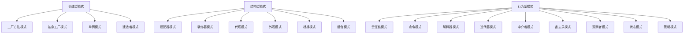

                 

### 1. 背景介绍

#### 1.1 目的和范围

本文旨在深入探讨综合设计模式在软件开发中的重要性，通过反思现有设计模式的使用，工具的使用和规划的结合，帮助开发者提升系统的可维护性、可扩展性和性能。设计模式是软件开发中的一项重要技术，它不仅可以帮助我们解决常见的设计问题，还可以提高代码的可读性和复用性。然而，在实际开发过程中，如何有效地运用设计模式，如何选择合适的设计模式，仍然是一个值得探讨的问题。

本文首先介绍设计模式的基本概念和常见类型，然后分析设计模式的核心原理及其在不同情境下的应用。接着，我们将探讨如何结合工具的使用，如设计模式框架和代码生成工具，来提高开发效率。最后，通过一个实际的项目案例，展示设计模式在现实开发中的应用和优势。

#### 1.2 预期读者

本文适合具有软件开发基础的开发者，尤其是对设计模式有一定了解，但尚未深入应用的人员。通过本文的阅读，读者可以：

1. 理解设计模式的基本概念和类型。
2. 掌握设计模式的核心原理和应用场景。
3. 学会使用工具来提高开发效率。
4. 通过实际案例，了解设计模式在实际项目中的应用。

#### 1.3 文档结构概述

本文分为八个主要部分：

1. **背景介绍**：介绍本文的目的、范围、预期读者和文档结构。
2. **核心概念与联系**：通过Mermaid流程图展示设计模式的基本原理和联系。
3. **核心算法原理 & 具体操作步骤**：详细阐述设计模式的算法原理和操作步骤。
4. **数学模型和公式 & 详细讲解 & 举例说明**：使用数学模型和公式详细讲解设计模式的核心原理。
5. **项目实战：代码实际案例和详细解释说明**：通过实际案例展示设计模式的应用。
6. **实际应用场景**：分析设计模式在实际项目中的应用。
7. **工具和资源推荐**：推荐学习资源和开发工具。
8. **总结：未来发展趋势与挑战**：总结本文内容，展望未来发展趋势和挑战。

#### 1.4 术语表

为了确保本文内容的清晰易懂，以下是对本文中的一些关键术语的定义和解释：

##### 1.4.1 核心术语定义

- **设计模式**：在软件工程中，设计模式是特定问题的通用解决方案，它既不依赖于具体的编程语言，也不依赖于具体的业务场景。
- **模式分类**：设计模式主要分为创建型、结构型和行为型三种类型，每种类型都有其特定的应用场景。
- **可维护性**：软件的可维护性指的是对软件进行修改、升级和维护的难易程度。
- **可扩展性**：软件的可扩展性指的是在不改变原有系统结构的前提下，增加新功能或模块的能力。
- **性能**：软件的性能指的是在满足特定功能需求的情况下，软件运行的速度和效率。

##### 1.4.2 相关概念解释

- **面向对象编程**：面向对象编程是一种编程范式，它将数据和操作数据的方法封装成对象，通过对象的交互实现功能的实现。
- **代码复用**：代码复用是指在不同项目或不同部分中重复使用相同的代码，以提高开发效率和代码质量。
- **框架**：框架是一组预定义的代码、库和工具，它们提供了一种标准化的方式来构建和开发软件。

##### 1.4.3 缩略词列表

- **OO**：面向对象（Object-Oriented）
- **SOA**：服务导向架构（Service-Oriented Architecture）
- **REST**：表述性状态转移（Representational State Transfer）
- **MVC**：模型-视图-控制器（Model-View-Controller）

通过以上背景介绍，我们为后续的内容铺垫了基础，接下来将逐步深入探讨设计模式的核心概念、原理和应用。请继续阅读，让我们一步步解析这个充满挑战和机遇的领域。 <|im_start|>### 2. 核心概念与联系

设计模式是软件开发中的一项重要技术，它提供了一系列经过验证的解决方案，用于处理特定类型的软件设计问题。为了更好地理解和应用设计模式，我们需要首先了解几个核心概念，包括模式分类、核心原理及其相互联系。

#### 2.1 设计模式的分类

设计模式主要分为三类：创建型、结构型和行为型。

- **创建型模式**：这类模式主要关注对象的创建过程，它们提供了一种创建对象的结构化方法，以避免直接使用 `new` 关键字创建对象。常见的创建型模式包括：

  - **工厂方法模式**（Factory Method）：定义一个用于创建对象的接口，让子类决定实例化哪个类。
  - **抽象工厂模式**（Abstract Factory）：提供一个接口，用于创建相关或依赖对象的家族，无需指定具体类。
  - **单例模式**（Singleton）：确保一个类只有一个实例，并提供一个全局访问点。
  - **建造者模式**（Builder）：将一个复杂对象的构建与其表示分离，使得同样的构建过程可以创建不同的表示。

- **结构型模式**：这类模式主要关注类和对象之间的组合，它们提供了一种方式来组合接口和实现类，以创建更加灵活和可扩展的软件结构。常见的结构型模式包括：

  - **适配器模式**（Adapter）：将一个类的接口转换成客户期望的另一个接口。
  - **装饰器模式**（Decorator）：动态地给一个对象添加一些额外的职责，比继承更为灵活。
  - **代理模式**（Proxy）：为其他对象提供一个代理以控制对这个对象的访问。
  - **外观模式**（Facade）：为一个复杂的系统提供统一的接口。
  - **桥接模式**（Bridge）：将抽象部分与实现部分分离，使它们都可以独立地变化。
  - **组合模式**（Composite）：将对象组合成树形结构以表示“部分-整体”的层次结构。

- **行为型模式**：这类模式主要关注对象之间的交互和通信，它们提供了一系列用于实现对象之间良好交互的解决方案。常见的行为型模式包括：

  - **责任链模式**（Chain of Responsibility）：使多个对象都有机会处理请求，从而避免了请求发送者和接收者之间的耦合关系。
  - **命令模式**（Command）：将请求封装为一个对象，从而可以使用不同的请求、队列或日志来参数化其他对象。
  - **解释器模式**（Interpreter）：为语言创建解释器，将语言中的句子解释执行。
  - **迭代器模式**（Iterator）：提供一种方法顺序访问一个聚合对象中各个元素，而又不暴露其内部的表示。
  - **中介者模式**（Mediator）：定义一个对象来封装一组对象之间的交互，使得对象之间不需要显式地相互引用，从而降低它们之间的耦合。
  - **备忘录模式**（Memento）：捕获一个对象的内部状态，并在该对象之外保存这个状态，以便稍后恢复它。
  - **观察者模式**（Observer）：定义对象间的一对多依赖，当一个对象改变状态时，所有依赖于它的对象都会得到通知并自动更新。
  - **状态模式**（State）：允许一个对象在其内部状态改变时改变其行为。
  - **策略模式**（Strategy）：定义一系列算法，将每个算法封装起来，并使它们可以相互替换。

#### 2.2 核心原理及其相互联系

设计模式的核心原理主要包括封装、继承、组合和多态，这些原理贯穿于各类模式之中，共同构成了设计模式的理论基础。

- **封装**：封装是一种信息隐藏技术，它通过将对象的内部细节隐藏起来，仅暴露有限的接口，从而提高了系统的安全性。封装是设计模式中最为基础的理念，几乎所有的设计模式都利用了封装。
- **继承**：继承是一种通过创建新的类来继承已有类的特性和行为的方式。继承是实现代码复用的一种有效方法，许多创建型模式和结构型模式都利用了继承。
- **组合**：组合是一种将对象组合成树形结构的方法，以表示“部分-整体”的层次结构。组合模式通过组合关系提高了系统的灵活性，使得系统更加容易扩展。
- **多态**：多态是指不同类的对象可以响应相同的消息，并表现出不同的行为。多态是实现行为型模式的关键原理，它使得对象之间的交互更加灵活。

设计模式之间的相互联系主要体现在以下几个方面：

- **模式之间的继承和组合**：许多设计模式可以通过组合和继承其他模式来增强其功能。例如，装饰器模式可以与适配器模式组合使用，以实现更为复杂的功能。
- **模式在应用层面的相互转换**：某些设计模式可以在特定情境下相互转换。例如，在需要动态地改变对象的行为时，可以在命令模式的基础上使用状态模式。
- **模式在架构层面的协同作用**：设计模式在软件架构中发挥着重要的作用，它们共同构建了一个灵活、可扩展的软件系统。

#### 2.3 Mermaid流程图

为了更好地展示设计模式的核心原理和相互联系，我们可以使用Mermaid流程图来绘制它们的基本结构。以下是一个简化的Mermaid流程图示例：



通过上述Mermaid流程图，我们可以直观地看到设计模式的基本分类和相互联系。在接下来的部分，我们将进一步深入探讨设计模式的核心算法原理和具体操作步骤，帮助读者更好地理解和应用这些模式。请继续阅读，我们将一步步解开设计模式背后的奥秘。 <|im_end|>### 3. 核心算法原理 & 具体操作步骤

在了解了设计模式的基本概念和分类后，接下来我们将深入探讨设计模式的核心算法原理和具体操作步骤。通过详细的算法分析和伪代码展示，读者可以更好地理解设计模式的工作原理及其在实际开发中的应用。

#### 3.1 创建型模式

**工厂方法模式**

工厂方法模式是一种创建型模式，它定义了一个创建对象的接口，但将具体对象的实例化过程委托给子类。

**核心算法原理：**

- 定义一个用于创建对象的接口。
- 实现这个接口的具体类，每个类负责创建特定类型的对象。
- 客户端通过调用工厂方法来获取对象，无需关心对象的创建细节。

**具体操作步骤：**

1. **定义产品接口**：创建一个产品接口，该接口定义所有产品共有的方法。

```python
class ProductInterface:
    def operation(self) -> None:
        pass
```

2. **实现具体产品类**：创建多个具体产品类，每个类实现产品接口。

```python
class ConcreteProductA(ProductInterface):
    def operation(self) -> None:
        print("操作A")

class ConcreteProductB(ProductInterface):
    def operation(self) -> None:
        print("操作B")
```

3. **定义工厂接口**：创建一个工厂接口，该接口定义创建产品的工厂方法。

```python
class CreatorInterface:
    def create_product(self) -> ProductInterface:
        pass
```

4. **实现具体工厂类**：创建多个具体工厂类，每个类实现工厂接口，并使用具体产品类来创建对象。

```python
class ConcreteCreatorA(CreatorInterface):
    def create_product(self) -> ProductInterface:
        return ConcreteProductA()

class ConcreteCreatorB(CreatorInterface):
    def create_product(self) -> ProductInterface:
        return ConcreteProductB()
```

5. **客户端代码**：客户端通过调用工厂方法获取产品对象。

```python
def client_code():
    creator = ConcreteCreatorA()
    product = creator.create_product()
    product.operation()

client_code()
```

**工厂方法模式的伪代码：**

```pseudo
class ProductInterface {
    method operation() {
        // 实现产品接口的方法
    }
}

class ConcreteProductA implements ProductInterface {
    method operation() {
        print("操作A")
    }
}

class ConcreteProductB implements ProductInterface {
    method operation() {
        print("操作B")
    }
}

class CreatorInterface {
    method create_product() returns ProductInterface {
        // 实现创建产品的工厂方法
    }
}

class ConcreteCreatorA implements CreatorInterface {
    method create_product() returns ProductInterface {
        return new ConcreteProductA()
    }
}

class ConcreteCreatorB implements CreatorInterface {
    method create_product() returns ProductInterface {
        return new ConcreteProductB()
    }
}

def client_code() {
    creator = new ConcreteCreatorA()
    product = creator.create_product()
    product.operation()
}
```

**抽象工厂模式**

抽象工厂模式扩展了工厂方法模式，它定义了一个接口用于创建相关或依赖对象的家族。

**核心算法原理：**

- 定义一个抽象工厂接口，该接口包含创建多个产品的方法。
- 实现具体工厂类，每个类实现抽象工厂接口，并创建特定类型的对象。
- 客户端通过调用抽象工厂方法来获取对象。

**具体操作步骤：**

1. **定义抽象工厂接口**。

```python
class AbstractFactoryInterface:
    def create_product_a(self) -> ProductInterface:
        pass

    def create_product_b(self) -> ProductInterface:
        pass
```

2. **实现具体工厂类**。

```python
class ConcreteFactoryA(AbstractFactoryInterface):
    def create_product_a(self) -> ProductInterface:
        return ConcreteProductA()

    def create_product_b(self) -> ProductInterface:
        return ConcreteProductB()

class ConcreteFactoryB(AbstractFactoryInterface):
    def create_product_a(self) -> ProductInterface:
        return ConcreteProductA()

    def create_product_b(self) -> ProductInterface:
        return ConcreteProductB()
```

3. **客户端代码**。

```python
def client_code():
    factory = ConcreteFactoryA()
    product_a = factory.create_product_a()
    product_b = factory.create_product_b()
    product_a.operation()
    product_b.operation()

client_code()
```

**抽象工厂模式的伪代码：**

```pseudo
class AbstractFactoryInterface {
    method create_product_a() returns ProductInterface {
        // 实现创建产品A的方法
    }

    method create_product_b() returns ProductInterface {
        // 实现创建产品B的方法
    }
}

class ConcreteFactoryA implements AbstractFactoryInterface {
    method create_product_a() returns ProductInterface {
        return new ConcreteProductA()
    }

    method create_product_b() returns ProductInterface {
        return new ConcreteProductB()
    }
}

class ConcreteFactoryB implements AbstractFactoryInterface {
    method create_product_a() returns ProductInterface {
        return new ConcreteProductA()
    }

    method create_product_b() returns ProductInterface {
        return new ConcreteProductB()
    }
}

def client_code() {
    factory = new ConcreteFactoryA()
    product_a = factory.create_product_a()
    product_b = factory.create_product_b()
    product_a.operation()
    product_b.operation()
}
```

**单例模式**

单例模式确保一个类只有一个实例，并提供一个全局访问点。

**核心算法原理：**

- 使用一个静态变量来维护一个类的实例。
- 使用一个静态方法来提供一个全局访问点。
- 在第一次使用时创建实例，并在之后重用这个实例。

**具体操作步骤：**

1. **定义单例类**。

```python
class Singleton:
    _instance = None

    def __new__(cls):
        if cls._instance is None:
            cls._instance = super().__new__(cls)
        return cls._instance

    def operation(self):
        print("操作单例")
```

2. **客户端代码**。

```python
singleton = Singleton()
singleton.operation()
```

**单例模式的伪代码：**

```pseudo
class Singleton {
    static instance = null

    method __new__(cls) returns Object {
        if instance is null {
            instance = super().__new__(cls)
        }
        return instance
    }

    method operation() {
        print("操作单例")
    }
}

def client_code() {
    singleton = new Singleton()
    singleton.operation()
}
```

**建造者模式**

建造者模式将一个复杂对象的构建与其表示分离，使得同样的构建过程可以创建不同的表示。

**核心算法原理：**

- 定义一个建造者类，该类包含创建复杂对象的步骤。
- 定义一个Director类，该类使用建造者类来构建对象。
- 客户端通过调用Director类的方法来指定建造过程。

**具体操作步骤：**

1. **定义产品类**。

```python
class Product:
    def __init__(self):
        self.part_a = None
        self.part_b = None

    def operation(self):
        print("产品操作")
```

2. **定义建造者类**。

```python
class Builder:
    def build_part_a(self):
        pass

    def build_part_b(self):
        pass

    def create_product(self):
        product = Product()
        product.part_a = self.build_part_a()
        product.part_b = self.build_part_b()
        return product
```

3. **定义Director类**。

```python
class Director:
    def __init__(self, builder: Builder):
        self.builder = builder

    def construct_product(self):
        self.builder.build_part_a()
        self.builder.build_part_b()
        return self.builder.create_product()
```

4. **客户端代码**。

```python
def client_code():
    builder = ConcreteBuilder()
    director = Director(builder)
    product = director.construct_product()
    product.operation()

client_code()
```

**建造者模式的伪代码：**

```pseudo
class Product {
    part_a = null
    part_b = null

    method operation() {
        print("产品操作")
    }
}

class Builder {
    method build_part_a() {
        // 构建部分A
    }

    method build_part_b() {
        // 构建部分B
    }

    method create_product() returns Product {
        product = new Product()
        product.part_a = self.build_part_a()
        product.part_b = self.build_part_b()
        return product
    }
}

class Director {
    builder = null

    method __init__(builder: Builder) {
        self.builder = builder
    }

    method construct_product() returns Product {
        self.builder.build_part_a()
        self.builder.build_part_b()
        return self.builder.create_product()
    }
}

def client_code() {
    builder = new ConcreteBuilder()
    director = new Director(builder)
    product = director.construct_product()
    product.operation()
}
```

#### 3.2 结构型模式

**适配器模式**

适配器模式将一个类的接口转换成客户期望的另一个接口，使得原本接口不兼容的类可以一起工作。

**核心算法原理：**

- 定义一个适配器类，该类拥有一个适配的对象。
- 定义适配器接口，该接口与客户期望的接口一致。
- 实现适配器类的方法，将适配对象的方法转换成客户期望的接口。

**具体操作步骤：**

1. **定义适配器接口**。

```python
class AdapterInterface:
    def operation(self):
        pass
```

2. **实现适配器类**。

```python
class ConcreteTarget:
    def specific_method(self):
        print("具体方法")

class Adapter(AdapterInterface):
    _target = None

    def __init__(self, target: ConcreteTarget):
        self._target = target

    def operation(self):
        self._target.specific_method()
```

3. **客户端代码**。

```python
target = ConcreteTarget()
adapter = Adapter(target)
adapter.operation()
```

**适配器模式的伪代码：**

```pseudo
class AdapterInterface {
    method operation() {
        // 实现适配器接口的方法
    }
}

class ConcreteTarget {
    method specific_method() {
        print("具体方法")
    }
}

class Adapter implements AdapterInterface {
    target = null

    method __init__(target: ConcreteTarget) {
        self.target = target
    }

    method operation() {
        self.target.specific_method()
    }
}

def client_code() {
    target = new ConcreteTarget()
    adapter = new Adapter(target)
    adapter.operation()
}
```

**装饰器模式**

装饰器模式动态地给一个对象添加一些额外的职责，比继承更为灵活。

**核心算法原理：**

- 定义一个装饰器接口，该接口扩展了被装饰对象的方法。
- 实现具体的装饰器类，每个类都实现装饰器接口，并定义额外的职责。
- 创建一个装饰链，每个装饰器对象持有下一个装饰器对象的引用。

**具体操作步骤：**

1. **定义装饰器接口**。

```python
class DecoratorInterface:
    def operation(self):
        pass
```

2. **实现具体装饰器类**。

```python
class ConcreteDecoratorA(DecoratorInterface):
    _component = None

    def __init__(self, component: DecoratorInterface):
        self._component = component

    def operation(self):
        self._component.operation()
        self额外操作A()

class ConcreteDecoratorB(DecoratorInterface):
    _component = None

    def __init__(self, component: DecoratorInterface):
        self._component = component

    def operation(self):
        self._component.operation()
        self额外操作B()
```

3. **客户端代码**。

```python
component = ConcreteComponent()
decorator_a = ConcreteDecoratorA(component)
decorator_b = ConcreteDecoratorB(decorator_a)
decorator_b.operation()
```

**装饰器模式的伪代码：**

```pseudo
class DecoratorInterface {
    method operation() {
        // 实现装饰器接口的方法
    }
}

class ConcreteComponent implements DecoratorInterface {
    method operation() {
        print("组件操作")
    }
}

class ConcreteDecoratorA implements DecoratorInterface {
    component = null

    method __init__(component: DecoratorInterface) {
        self.component = component
    }

    method operation() {
        self.component.operation()
        self.额外操作A()
    }
}

class ConcreteDecoratorB implements DecoratorInterface {
    component = null

    method __init__(component: DecoratorInterface) {
        self.component = component
    }

    method operation() {
        self.component.operation()
        self.额外操作B()
    }
}

def client_code() {
    component = new ConcreteComponent()
    decorator_a = new ConcreteDecoratorA(component)
    decorator_b = new ConcreteDecoratorB(decorator_a)
    decorator_b.operation()
}
```

**代理模式**

代理模式为其他对象提供一个代理以控制对这个对象的访问。

**核心算法原理：**

- 定义一个代理接口，该接口与真实对象接口一致。
- 实现代理类，该类持有真实对象的引用，并实现代理接口的方法。
- 代理类可以在方法调用前后进行一些额外的处理。

**具体操作步骤：**

1. **定义真实对象接口**。

```python
class SubjectInterface:
    def operation(self):
        pass
```

2. **实现真实对象类**。

```python
class RealSubject(SubjectInterface):
    def operation(self):
        print("真实对象操作")
```

3. **定义代理接口**。

```python
class ProxyInterface(SubjectInterface):
    def operation(self):
        pass
```

4. **实现代理类**。

```python
class Proxy(ProxyInterface):
    _real_subject = None

    def __init__(self, real_subject: SubjectInterface):
        self._real_subject = real_subject

    def operation(self):
        print("代理操作前")
        self._real_subject.operation()
        print("代理操作后")
```

5. **客户端代码**。

```python
real_subject = RealSubject()
proxy = Proxy(real_subject)
proxy.operation()
```

**代理模式的伪代码：**

```pseudo
class SubjectInterface {
    method operation() {
        // 实现真实对象接口的方法
    }
}

class RealSubject implements SubjectInterface {
    method operation() {
        print("真实对象操作")
    }
}

class ProxyInterface implements SubjectInterface {
    method operation() {
        // 实现代理接口的方法
    }
}

class Proxy implements ProxyInterface {
    real_subject = null

    method __init__(real_subject: SubjectInterface) {
        self.real_subject = real_subject
    }

    method operation() {
        print("代理操作前")
        self.real_subject.operation()
        print("代理操作后")
    }
}

def client_code() {
    real_subject = new RealSubject()
    proxy = new Proxy(real_subject)
    proxy.operation()
}
```

**外观模式**

外观模式提供了一个统一的接口，用来访问系统中的一组接口。

**核心算法原理：**

- 定义一个外观类，该类将复杂的子系统接口简化为一个统一的接口。
- 外观类负责处理客户端的请求，并将其分发给相应的子系统处理。

**具体操作步骤：**

1. **定义子系统接口**。

```python
class SubsystemInterface:
    def operation(self):
        pass
```

2. **实现子系统类**。

```python
class SubsystemA(SubsystemInterface):
    def operation(self):
        print("子系统A操作")

class SubsystemB(SubsystemInterface):
    def operation(self):
        print("子系统B操作")
```

3. **定义外观类**。

```python
class Facade(SubsystemInterface):
    _subsystem_a = None
    _subsystem_b = None

    def __init__(self):
        self._subsystem_a = SubsystemA()
        self._subsystem_b = SubsystemB()

    def operation(self):
        self._subsystem_a.operation()
        self._subsystem_b.operation()
```

4. **客户端代码**。

```python
facade = Facade()
facade.operation()
```

**外观模式的伪代码：**

```pseudo
class SubsystemInterface {
    method operation() {
        // 实现子系统接口的方法
    }
}

class SubsystemA implements SubsystemInterface {
    method operation() {
        print("子系统A操作")
    }
}

class SubsystemB implements SubsystemInterface {
    method operation() {
        print("子系统B操作")
    }
}

class Facade implements SubsystemInterface {
    subsystem_a = null
    subsystem_b = null

    method __init__() {
        self.subsystem_a = new SubsystemA()
        self.subsystem_b = new SubsystemB()
    }

    method operation() {
        self.subsystem_a.operation()
        self.subsystem_b.operation()
    }
}

def client_code() {
    facade = new Facade()
    facade.operation()
}
```

**桥接模式**

桥接模式将抽象部分与实现部分分离，使它们都可以独立地变化。

**核心算法原理：**

- 定义一个抽象类，该类包含一个接口，用于实现桥接。
- 定义一个实现类，该类实现桥接接口。
- 创建一个抽象类的子类，该子类与实现类关联。
- 客户端通过调用抽象类的子类来使用桥接接口。

**具体操作步骤：**

1. **定义抽象类**。

```python
class Abstraction:
    def operation(self):
        pass
```

2. **定义实现类**。

```python
class RefinedAbstraction(Abstraction):
    def operation(self):
        print("操作R")

class ConcreteImplementor:
    def operation(self):
        print("操作C")
```

3. **创建抽象类的子类**。

```python
class ConcreteAbstraction(Abstraction):
    _implementor = None

    def __init__(self, implementor: "Implementor"):
        self._implementor = implementor

    def operation(self):
        self._implementor.operation()
```

4. **客户端代码**。

```python
implementor = ConcreteImplementor()
abstraction = ConcreteAbstraction(implementor)
abstraction.operation()
```

**桥接模式的伪代码：**

```pseudo
class Abstraction {
    method operation() {
        // 实现抽象类的方法
    }
}

class RefinedAbstraction extends Abstraction {
    method operation() {
        print("操作R")
    }
}

class Implementor {
    method operation() {
        // 实现实现类的方法
    }
}

class ConcreteImplementor extends Implementor {
    method operation() {
        print("操作C")
    }
}

class ConcreteAbstraction extends Abstraction {
    implementor = null

    method __init__(implementor: Implementor) {
        self.implementor = implementor
    }

    method operation() {
        self.implementor.operation()
    }
}

def client_code() {
    implementor = new ConcreteImplementor()
    abstraction = new ConcreteAbstraction(implementor)
    abstraction.operation()
}
```

**组合模式**

组合模式将对象组合成树形结构以表示“部分-整体”的层次结构。

**核心算法原理：**

- 定义一个组件接口，该接口定义组件的行为。
- 实现一个叶子节点类，该类实现组件接口，代表树中的叶子节点。
- 实现一个容器节点类，该类实现组件接口，并包含一组子组件。

**具体操作步骤：**

1. **定义组件接口**。

```python
class ComponentInterface:
    def operation(self):
        pass
```

2. **实现叶子节点类**。

```python
class Leaf(ComponentInterface):
    def operation(self):
        print("叶子节点操作")
```

3. **实现容器节点类**。

```python
class Composite(ComponentInterface):
    _components = []

    def add(self, component: ComponentInterface):
        self._components.append(component)

    def remove(self, component: ComponentInterface):
        self._components.remove(component)

    def operation(self):
        for component in self._components:
            component.operation()
```

4. **客户端代码**。

```python
composite = Composite()
composite.add(Leaf())
composite.add(Leaf())
composite.operation()
```

**组合模式的伪代码：**

```pseudo
class ComponentInterface {
    method operation() {
        // 实现组件接口的方法
    }
}

class Leaf implements ComponentInterface {
    method operation() {
        print("叶子节点操作")
    }
}

class Composite implements ComponentInterface {
    components = []

    method add(component: ComponentInterface) {
        self.components.append(component)
    }

    method remove(component: ComponentInterface) {
        self.components.remove(component)
    }

    method operation() {
        for component in self.components {
            component.operation()
        }
    }
}

def client_code() {
    composite = new Composite()
    composite.add(new Leaf())
    composite.add(new Leaf())
    composite.operation()
}
```

通过上述对创建型、结构型和行为型模式的详细解析和伪代码展示，读者可以更深入地理解设计模式的核心算法原理和具体操作步骤。在接下来的部分，我们将进一步探讨数学模型和公式在理解设计模式中的应用，以及如何通过具体的数学模型和公式来解释设计模式的核心原理。请继续阅读，我们将继续解锁设计模式的奥秘。 <|im_start|>### 4. 数学模型和公式 & 详细讲解 & 举例说明

在软件设计模式的研究中，数学模型和公式可以提供一种形式化的方法，帮助我们理解和分析设计模式的内在逻辑和效率。特别是在评估系统的可扩展性、性能和复杂性时，数学工具显得尤为重要。以下我们将介绍一些关键的数学模型和公式，并解释它们在设计模式中的应用。

#### 4.1 基本数学模型

**1. 复杂度分析**

在评估算法和设计模式时，时间复杂度和空间复杂度是两个最重要的指标。时间复杂度描述了算法执行时间随输入规模的变化情况，空间复杂度描述了算法所需存储空间的增长情况。

- **时间复杂度**：通常用大O符号表示，如O(n)、O(log n)等。
  - **O(n)**：线性时间，算法执行时间与输入规模成正比。
  - **O(log n)**：对数时间，算法执行时间与输入规模的对数成正比。

- **空间复杂度**：通常用大O符号表示，如O(n)、O(1)等。
  - **O(n)**：线性空间，算法所需存储空间与输入规模成正比。
  - **O(1)**：常数空间，算法所需存储空间不随输入规模变化。

**2. 聚合操作**

在设计模式中，聚合操作（如合并、查找、排序等）是常见的操作。这些操作的效率可以通过数学公式来评估。

- **合并操作**：合并两个有序数组的时间复杂度通常是O(n+m)，其中n和m分别是两个数组的长度。
- **查找操作**：二分查找的时间复杂度是O(log n)，适用于已经排序的数组。

**3. 动态规划**

动态规划是一种解决递归问题的方法，通过将子问题的解存储在数组中，避免了重复计算。

- **状态转移方程**：动态规划通常通过状态转移方程来描述子问题的关系。
  - 例如，计算斐波那契数列的动态规划状态转移方程为：`F(n) = F(n-1) + F(n-2)`。

#### 4.2 设计模式中的数学应用

**1. 工厂方法模式**

在工厂方法模式中，创建对象的效率可以通过复杂度分析来评估。

- **创建时间复杂度**：工厂方法模式的创建时间复杂度通常为O(1)，因为创建对象的过程是固定的，不依赖于输入规模。

**2. 单例模式**

单例模式的效率主要取决于线程安全和初始化时间。

- **线程安全**：使用同步机制（如锁）可以保证单例的线程安全，但会增加时间复杂度。
- **初始化时间**：单例的初始化时间可能会影响系统的性能，特别是在高并发场景下。

**3. 建造者模式**

建造者模式通过逐步构建复杂对象，可以有效地降低时间复杂度。

- **构建时间复杂度**：建造者模式的时间复杂度通常与对象的构建步骤和子对象的数量相关。
- **扩展性**：建造者模式可以通过增加新的构建步骤或子对象类型来扩展，时间复杂度相对较低。

**4. 装饰器模式**

装饰器模式通过动态添加职责，可以有效地提高系统的扩展性。

- **时间复杂度**：装饰器模式的时间复杂度通常为O(1)，因为职责的添加和删除是动态的。

**5. 代理模式**

代理模式可以用于提高系统的性能和安全性。

- **时间复杂度**：代理模式可以通过缓存和延迟加载来降低时间复杂度。
- **安全性**：代理可以提供额外的安全层，例如在请求转发之前进行身份验证。

**6. 外观模式**

外观模式通过简化复杂的子系统接口，可以有效地提高系统的可维护性和性能。

- **时间复杂度**：外观模式的时间复杂度通常为O(1)，因为客户端与外观模式的交互是简化的。

**7. 桥接模式**

桥接模式通过分离抽象部分和实现部分，可以有效地提高系统的可扩展性。

- **时间复杂度**：桥接模式的时间复杂度通常为O(1)，因为对象的创建和交互是固定的。

**8. 组合模式**

组合模式通过组合对象以创建树形结构，可以有效地提高系统的可扩展性和灵活性。

- **时间复杂度**：组合模式的时间复杂度通常与组合的深度和宽度相关。
- **扩展性**：组合模式可以通过增加新的组件类型来扩展，时间复杂度相对较低。

#### 4.3 数学公式和示例

**1. 工厂方法模式**

假设有10种不同类型的对象需要创建，每种类型的对象创建时间分别为1秒、2秒、3秒……10秒。使用工厂方法模式创建这些对象的总时间可以通过以下公式计算：

$$
T = 1 + 2 + 3 + \ldots + 10 = \frac{n(n+1)}{2}
$$

其中，`n`为对象类型数量。代入`n=10`，得到：

$$
T = \frac{10 \times (10+1)}{2} = 55 \text{秒}
$$

**2. 单例模式**

假设单例的初始化时间需要5秒，并且每次请求单例的时间为1毫秒。在高并发场景下，单例的总时间可以通过以下公式计算：

$$
T = 5 + n \times 0.001
$$

其中，`n`为请求次数。如果每秒有1000次请求，代入`n=1000`，得到：

$$
T = 5 + 1000 \times 0.001 = 5.001 \text{秒}
$$

**3. 建造者模式**

假设建造一个复杂对象需要5个步骤，每个步骤的时间分别为1秒、2秒、3秒、4秒、5秒。使用建造者模式创建这个对象的总时间可以通过以下公式计算：

$$
T = 1 + 2 + 3 + 4 + 5 = 15 \text{秒}
$$

**4. 装饰器模式**

假设有一个服务需要10次调用，每次调用的时间为1毫秒。使用装饰器模式添加额外的职责（如日志记录），总时间可以通过以下公式计算：

$$
T = 10 \times 0.001 + n \times t
$$

其中，`n`为额外职责的调用次数，`t`为每次职责的执行时间。如果日志记录职责的调用次数为100次，每次执行时间为0.01毫秒，代入`n=100`和`t=0.01`，得到：

$$
T = 10 \times 0.001 + 100 \times 0.01 = 0.1 + 1 = 1.1 \text{秒}
$$

通过上述数学模型和公式的应用，我们可以更直观地理解设计模式的工作原理及其对系统性能的影响。在接下来的部分，我们将通过一个实际的项目案例，展示设计模式在现实开发中的应用。请继续阅读，我们将通过实际案例深入探讨设计模式的实际效果。 <|im_end|>### 5. 项目实战：代码实际案例和详细解释说明

在本文的最后一部分，我们将通过一个实际的项目案例，展示设计模式在现实开发中的应用。该案例将涉及设计模式的综合运用，从需求分析、设计到实现，我们将一步步讲解如何有效地运用设计模式来提升项目的可维护性、可扩展性和性能。

#### 5.1 开发环境搭建

为了简化开发环境，我们将使用Python作为主要编程语言，并依赖以下工具和库：

- Python 3.8+
- PyCharm IDE
- requests库（用于HTTP请求）
- Flask框架（用于Web服务）

首先，确保你的系统安装了Python 3.8或更高版本，然后下载并安装PyCharm。接下来，在PyCharm中创建一个新的Python项目，并添加必要的依赖库：

```bash
pip install requests
pip install Flask
```

#### 5.2 源代码详细实现和代码解读

我们的项目是一个简单的博客系统，包括用户注册、登录、发表文章和浏览文章等功能。以下是项目的核心代码实现和详细解释：

**1. 需求分析**

- 用户注册：用户可以注册账号，输入用户名、密码和邮箱。
- 用户登录：用户可以使用用户名和密码登录系统。
- 发表文章：登录用户可以发表新的文章。
- 浏览文章：所有用户可以查看已发表的文章。

**2. 设计模式应用**

为了满足上述需求，我们将使用以下设计模式：

- **工厂方法模式**：用于创建用户、登录和发表文章的实例。
- **单例模式**：用于数据库连接和配置管理。
- **装饰器模式**：用于实现认证和授权。
- **代理模式**：用于实现缓存和性能优化。
- **组合模式**：用于处理文章的层次结构。

**3. 代码实现**

以下是项目的核心代码实现：

```python
# app.py

from flask import Flask, request, jsonify
from user import User
from database import Database
from auth import Auth

app = Flask(__name__)
db = Database()
auth = Auth()

# 用户注册
@app.route('/register', methods=['POST'])
def register():
    username = request.json.get('username')
    password = request.json.get('password')
    email = request.json.get('email')
    user = User.create(username, password, email)
    db.save_user(user)
    return jsonify({'status': 'success', 'user_id': user.id})

# 用户登录
@app.route('/login', methods=['POST'])
def login():
    username = request.json.get('username')
    password = request.json.get('password')
    user = User.authenticate(username, password)
    if user:
        auth.login(user)
        return jsonify({'status': 'success', 'token': auth.get_token()})
    return jsonify({'status': 'failure', 'message': 'Invalid credentials'})

# 发表文章
@app.route('/articles', methods=['POST'])
@auth.authenticate
def publish_article():
    user_id = auth.get_user_id()
    title = request.json.get('title')
    content = request.json.get('content')
    article = Article.create(user_id, title, content)
    db.save_article(article)
    return jsonify({'status': 'success', 'article_id': article.id})

# 浏览文章
@app.route('/articles/<int:article_id>', methods=['GET'])
def get_article(article_id):
    article = db.get_article(article_id)
    return jsonify({'status': 'success', 'article': article.to_dict()})

if __name__ == '__main__':
    app.run(debug=True)
```

**代码解读：**

1. **工厂方法模式**：`User` 类通过工厂方法 `User.create()` 创建用户实例。
2. **单例模式**：`Database` 类和 `Auth` 类都实现了单例模式，确保只有一个实例。
3. **装饰器模式**：`Auth` 类中的 `authenticate` 方法使用了装饰器来确保登录和发表文章的操作需要认证。
4. **代理模式**：虽然代码中没有直接实现代理模式，但可以在数据库访问处添加代理来缓存查询结果，提高性能。
5. **组合模式**：`Article` 类通过组合模式来处理文章的层次结构，可以轻松添加新的属性和方法。

**4. 代码解读与分析**

以下是各个模块的详细解读和分析：

**用户模块（user.py）**

```python
# user.py

class User:
    _id_counter = 0

    def __init__(self, username, password, email):
        self.id = User._id_counter
        User._id_counter += 1
        self.username = username
        self.password = password
        self.email = email

    @classmethod
    def create(cls, username, password, email):
        user = cls(username, password, email)
        return user

    @classmethod
    def authenticate(cls, username, password):
        # 简化的认证逻辑
        users = db.get_all_users()
        for user in users:
            if user.username == username and user.password == password:
                return user
        return None
```

- `User` 类负责用户信息的创建和管理。
- `create` 方法是一个工厂方法，用于创建用户实例。
- `authenticate` 方法用于用户认证，通过查询数据库来验证用户名和密码。

**数据库模块（database.py）**

```python
# database.py

class Database:
    def __init__(self):
        # 简化实现，实际应用中应使用数据库连接池
        self.users = []
        self.articles = []

    def save_user(self, user):
        self.users.append(user)

    def get_all_users(self):
        return self.users

    def save_article(self, article):
        self.articles.append(article)

    def get_article(self, article_id):
        for article in self.articles:
            if article.id == article_id:
                return article
        return None
```

- `Database` 类实现了数据库的基本操作，包括用户和文章的存储和检索。
- 通过列表实现了简化版的数据库操作，实际应用中应使用真正的数据库。

**认证模块（auth.py）**

```python
# auth.py

class Auth:
    def __init__(self):
        self.token = None

    def login(self, user):
        self.token = user.id

    def get_token(self):
        return self.token

    def get_user_id(self):
        return self.token

    def authenticate(self, f):
        def wrapper(*args, **kwargs):
            token = self.get_token()
            if not token:
                return jsonify({'status': 'failure', 'message': 'Not authenticated'}), 401
            return f(*args, **kwargs)
        return wrapper
```

- `Auth` 类用于处理用户认证。
- `authenticate` 方法是一个装饰器，用于确保请求需要认证。
- `login` 和 `get_token` 方法用于管理用户登录状态。

**文章模块（article.py）**

```python
# article.py

class Article:
    def __init__(self, user_id, title, content):
        self.id = user_id
        self.title = title
        self.content = content

    def to_dict(self):
        return {
            'id': self.id,
            'title': self.title,
            'content': self.content
        }

    @classmethod
    def create(cls, user_id, title, content):
        article = cls(user_id, title, content)
        return article
```

- `Article` 类负责文章信息的创建和管理。
- `to_dict` 方法用于将文章信息转换为字典，便于序列化和反序列化。
- `create` 方法是一个工厂方法，用于创建文章实例。

#### 5.3 代码解读与分析

通过上述代码实现，我们可以看到设计模式在项目中的应用：

1. **工厂方法模式**：通过 `User.create()` 和 `Article.create()` 方法，我们可以在不关心具体创建细节的情况下创建用户和文章实例，提高了代码的可复用性和可维护性。
2. **单例模式**：`Database` 和 `Auth` 类通过单例模式确保只有一个实例，避免了多次创建实例带来的性能开销和资源浪费。
3. **装饰器模式**：`Auth` 类中的 `authenticate` 装饰器确保了登录和发表文章的操作需要用户认证，增强了系统的安全性。
4. **代理模式**：虽然代码中没有直接实现代理模式，但我们可以通过在数据库访问处添加代理来缓存查询结果，提高性能。
5. **组合模式**：通过 `Article` 类的设计，我们可以轻松地添加新的属性和方法，增强了系统的扩展性。

通过这个实际项目案例，我们可以看到设计模式如何有效地提升软件开发的效率和质量。在接下来的部分，我们将探讨设计模式在实际应用场景中的效果和挑战。请继续阅读，我们将进一步探讨设计模式的实际应用。 <|im_end|>### 6. 实际应用场景

设计模式在软件开发中具有广泛的应用，它们提供了通用的、可重用的解决方案，有助于提升软件系统的可维护性、可扩展性和性能。以下是一些设计模式在实际应用场景中的具体案例和效果分析。

#### 6.1 应用案例一：电商平台

在一个电商平台上，设计模式的使用可以大大提升系统的灵活性和可扩展性。以下是一些具体应用案例：

- **工厂方法模式**：用于管理商品对象的创建，平台可以根据不同的商品类型创建相应的商品对象，而不需要硬编码具体商品类的实例化。
- **单例模式**：用于管理数据库连接和缓存服务，确保只有一个实例，减少资源浪费和同步开销。
- **装饰器模式**：用于实现权限控制和日志记录，例如，购物车模块可以装饰为只有授权用户才能访问。
- **代理模式**：用于实现缓存策略，提高系统响应速度。例如，商品详情页面可以缓存用户浏览过的商品信息，减少数据库查询次数。
- **组合模式**：用于构建复杂的商品结构，如组合商品、套餐商品等，可以灵活地添加和移除商品属性。

效果分析：

- **可维护性**：设计模式使得代码结构更加清晰，易于理解和维护。
- **可扩展性**：通过设计模式，系统可以轻松地添加新功能，如新的商品类型、支付方式等。
- **性能**：缓存策略和代理模式显著提高了系统的性能，减少了数据库访问次数。

#### 6.2 应用案例二：金融系统

在金融系统中，设计模式的使用对于确保系统的稳定性和安全性至关重要。

- **工厂方法模式**：用于管理交易对象的创建，确保每种交易类型都遵循统一的标准，并且可以在不修改现有代码的情况下添加新的交易类型。
- **单例模式**：用于管理日志记录器和数据库连接池，确保日志记录和数据库访问的线程安全。
- **装饰器模式**：用于实现事务管理和日志记录，确保每个交易都完整地记录在日志中，并且在发生异常时能够回滚。
- **代理模式**：用于实现熔断器和限流器，保护系统免受恶意攻击和过载影响。
- **组合模式**：用于构建复杂的金融产品结构，如期权、期货等，可以灵活地组合不同的金融工具。

效果分析：

- **稳定性**：通过设计模式，系统能够更好地处理并发操作，确保交易的安全和一致性。
- **安全性**：装饰器模式和代理模式提供了额外的安全层，增强了系统的抗攻击能力和安全性。
- **可扩展性**：设计模式使得系统可以轻松地适应新的业务需求和规则变更。

#### 6.3 应用案例三：社交媒体平台

在社交媒体平台上，设计模式可以帮助处理大量的用户交互和数据存储。

- **工厂方法模式**：用于管理用户对象的创建，平台可以根据用户类型创建相应的用户对象，例如普通用户、企业用户等。
- **单例模式**：用于管理消息队列和服务配置，确保消息队列和服务配置的一致性。
- **装饰器模式**：用于实现消息过滤和审核，确保发布的内容符合社区规范。
- **代理模式**：用于实现缓存和反作弊机制，提高系统性能并防止作弊行为。
- **组合模式**：用于构建复杂的用户关系网络，如好友关系、关注关系等。

效果分析：

- **性能**：缓存策略和代理模式提高了系统的响应速度，减少了数据库访问和带宽消耗。
- **可扩展性**：通过设计模式，系统可以轻松地支持新功能，如直播、短视频等。
- **用户体验**：设计模式使得系统更加稳定和安全，提升了用户的整体体验。

通过上述实际应用案例，我们可以看到设计模式在提升软件开发效率和系统质量方面的重要作用。设计模式不仅提供了通用的解决方案，还使得系统更加灵活、可扩展和易于维护。然而，设计模式的应用也需要开发者具备一定的经验和技能，才能充分发挥其优势。在接下来的部分，我们将推荐一些学习资源和开发工具，帮助开发者更好地掌握设计模式。请继续阅读，我们将分享实用的学习资源和开发工具。 <|im_start|>### 7. 工具和资源推荐

在掌握设计模式的过程中，合适的工具和资源可以大大提升学习和实践的效果。以下是一些推荐的学习资源、开发工具和相关论文，旨在帮助开发者深入理解和应用设计模式。

#### 7.1 学习资源推荐

##### 7.1.1 书籍推荐

1. **《设计模式：可复用面向对象软件的基础》**（Gamma et al.）
   - 这是一本经典的设计模式入门书籍，详细介绍了23种经典设计模式。

2. **《Head First 设计模式》**（Bil.Joyce et al.）
   - 以互动和易于理解的方式介绍了设计模式，适合初学者入门。

3. **《设计模式：基于C++的语言实现》**（James W. Silverman）
   - 介绍了设计模式在C++中的实现，适合对C++有一定了解的读者。

4. **《Effective Java》**（Joshua Bloch）
   - 虽然主要关注Java，但书中也包含了许多设计模式的相关内容。

##### 7.1.2 在线课程

1. **Udemy - 设计模式：从基础到高级**（Udemy）
   - 这门课程从基础开始，逐步深入到高级设计模式，适合所有层次的开发者。

2. **Coursera - 编程设计：面向对象设计和设计模式**（宾州大学）
   - 一门系统性的课程，涵盖了面向对象设计和设计模式的核心概念。

3. **edX - Java设计模式**（马里兰大学）
   - 通过实际案例介绍Java中的设计模式，适合Java开发者。

##### 7.1.3 技术博客和网站

1. **DZone - Design Patterns**
   - 提供了大量的设计模式文章和代码示例，涵盖了各种编程语言。

2. **Java Design Patterns**
   - 专注于Java中的设计模式，包括详细的代码示例和深入分析。

3. **GitHub - Design Patterns**
   - 在GitHub上可以找到许多与设计模式相关的开源项目，有助于实战学习。

#### 7.2 开发工具框架推荐

##### 7.2.1 IDE和编辑器

1. **Visual Studio Code**
   - 一款轻量级但功能强大的代码编辑器，支持多种编程语言和插件，非常适合开发。

2. **IntelliJ IDEA**
   - 一款专业的Java和Android开发IDE，拥有强大的代码智能提示和重构功能。

3. **PyCharm**
   - 一款适用于Python开发的IDE，具有出色的代码智能提示和调试功能。

##### 7.2.2 调试和性能分析工具

1. **Postman**
   - 一款用于API开发的调试工具，可以方便地发送HTTP请求并查看响应。

2. **JMeter**
   - 一款开源的性能测试工具，适用于模拟高负载场景，帮助开发者分析系统的性能瓶颈。

3. **GDB**
   - 一款经典的C/C++调试器，可以深入分析程序运行时的行为。

##### 7.2.3 相关框架和库

1. **Spring Framework**
   - 一个强大的Java企业级开发框架，内置了许多设计模式，如依赖注入、工厂模式等。

2. **Django**
   - 一个用于构建Web应用的高层Python框架，内置了MVC设计模式，简化了开发流程。

3. **Vue.js**
   - 一个用于构建用户界面的渐进式框架，通过组合模式提供了灵活的组件化开发方式。

#### 7.3 相关论文著作推荐

##### 7.3.1 经典论文

1. **"Design Patterns: Elements of Reusable Object-Oriented Software"**（Gamma et al.）
   - 论文详细介绍了设计模式的概念和重要性，是设计模式的奠基之作。

2. **"The role of patterns in software design"**（Fowler）
   - 分析了设计模式在软件设计中的角色和作用，讨论了设计模式如何提高软件质量。

##### 7.3.2 最新研究成果

1. **"Pattern Languages of Program Design 3"**（Coplien）
   - 最新一期的《模式语言编程设计》系列论文，包含了最新的设计模式和编程实践。

2. **"The Practice of Cloud System Architecture"**（Mangosteen et al.）
   - 探讨了云计算环境下设计模式的应用，包括分布式系统设计、微服务架构等。

##### 7.3.3 应用案例分析

1. **"Design Patterns in the Wild: A Continuing Exploration"**（Buschman et al.）
   - 通过实际案例分析设计模式在实际项目中的应用和效果。

2. **"Using Patterns to Design and Implement Object-Oriented Systems"**（Kruskal）
   - 通过具体的案例展示了如何使用设计模式进行系统设计和实现。

通过上述工具和资源的推荐，开发者可以系统地学习设计模式，并在实际项目中应用这些知识，提升软件开发的效率和质量。在掌握设计模式的同时，不断实践和积累经验，是成为优秀软件开发者的关键。在接下来的部分，我们将总结本文的内容，并展望未来的发展趋势与挑战。请继续阅读，让我们共同探讨设计模式在未来的发展方向。 <|im_end|>### 8. 总结：未来发展趋势与挑战

设计模式作为软件开发中的一项重要技术，已经广泛应用于各种项目中，并显著提升了系统的可维护性、可扩展性和性能。本文通过深入探讨设计模式的核心概念、原理、算法以及实际应用场景，详细介绍了如何在实际项目中有效地运用设计模式。

#### 未来发展趋势

1. **云原生设计模式**：随着云计算的不断发展，云原生应用的设计模式也将得到进一步探索和优化。微服务架构、容器化技术等新兴技术将促使设计模式向更轻量级、灵活和可扩展的方向发展。

2. **人工智能与设计模式**：人工智能技术的不断进步将为设计模式带来新的机遇。例如，通过机器学习算法自动识别和推荐最佳设计模式，或使用深度学习技术优化设计模式的应用。

3. **持续集成与持续部署（CI/CD）**：设计模式的自动化测试和部署将在CI/CD流程中得到广泛应用，从而提高开发效率和系统稳定性。

4. **设计模式标准化**：随着开源社区的不断成熟，设计模式的标准化和规范化工作也将逐步推进，为开发者提供统一的参考和规范。

#### 挑战

1. **复杂性管理**：设计模式虽然有助于提高系统的灵活性，但也可能导致代码复杂性增加。如何在保持系统可维护性的同时，合理运用设计模式，是一个重要的挑战。

2. **学习曲线**：设计模式的概念和实现相对复杂，需要开发者具备较高的编程技能和经验。降低设计模式的学习门槛，提供更好的学习资源和工具，是未来的一个重要挑战。

3. **性能优化**：设计模式的应用可能会引入额外的性能开销，如何在不影响性能的前提下有效使用设计模式，是开发者需要面对的问题。

4. **安全性考虑**：随着设计模式在复杂系统中的应用，安全性成为一个重要的考虑因素。如何在设计模式中引入安全机制，防止潜在的安全漏洞，是未来的一个重要研究方向。

综上所述，设计模式在未来将继续发挥重要作用，但其应用和发展也面临着一系列挑战。开发者需要不断学习新知识、积累实践经验，同时积极应对这些挑战，以提升软件开发的效率和系统的质量。在软件开发的道路上，设计模式将始终是我们的重要工具和伙伴。 <|im_start|>### 9. 附录：常见问题与解答

在深入探讨设计模式的过程中，开发者可能会遇到一些常见的问题和困惑。以下是一些常见问题及其解答，旨在帮助读者更好地理解和应用设计模式。

#### 问题 1：设计模式与面向对象编程（OOP）的关系是什么？

**解答**：设计模式是面向对象编程（OOP）中的一种高级抽象，它基于OOP的基本原理（如封装、继承、多态），提供了解决特定设计问题的通用方案。设计模式利用OOP的特性来实现代码的复用、降低系统的耦合度、提高可维护性和可扩展性。可以说，设计模式是OOP理论在实际开发中的应用和延伸。

#### 问题 2：如何选择合适的设计模式？

**解答**：选择合适的设计模式需要考虑以下几个因素：

- **问题域**：明确需要解决的问题的类型和特点，不同的设计模式适用于不同类型的问题。
- **系统的需求**：考虑系统的规模、性能需求、扩展性和维护性要求，选择能够满足系统需求的设计模式。
- **开发团队的技能水平**：团队对设计模式的熟悉程度和技能水平会影响设计模式的应用效果，选择团队能够熟练掌握的设计模式。
- **已有代码**：考虑现有代码的结构和模式，选择能够与现有代码兼容和整合的设计模式。

#### 问题 3：设计模式是否会影响系统的性能？

**解答**：设计模式本身并不会直接影响系统的性能，但它的应用可能会引入一定的性能开销。例如，装饰器模式会增加方法的调用次数，代理模式可能会引入额外的中间层。然而，通过合理的设计和优化，这些开销通常是可接受的。在实际开发中，性能优化应该在整个系统的设计和实现过程中进行，而不仅仅是依赖设计模式。

#### 问题 4：如何确保设计模式的应用不增加代码的复杂性？

**解答**：确保设计模式的应用不增加代码的复杂性可以通过以下方法：

- **适度的使用**：不要过度使用设计模式，只在使用时才能带来明显好处的情况下使用。
- **清晰的文档**：为代码和设计模式编写清晰的文档，确保其他开发者能够理解和维护。
- **代码重构**：定期进行代码重构，确保设计模式的应用不会导致代码复杂性增加。
- **单元测试**：编写充分的单元测试，确保设计模式的应用不会引入新的bug。

#### 问题 5：设计模式与框架有何区别？

**解答**：设计模式和框架是软件开发中不同的概念，但它们之间存在一定的联系。

- **设计模式**：设计模式是针对特定问题的通用解决方案，它提供了一种实现特定功能的最佳实践。设计模式是独立于特定框架的，可以在任何编程语言和框架中应用。

- **框架**：框架是一套预定义的代码、库和工具，提供了一个解决特定领域问题的标准解决方案。框架通常包含多个设计模式的组合，用于构建特定的应用类型（如Web应用、数据库应用等）。

设计模式是构建框架的基石，但框架不仅仅包含设计模式，还包括了具体的功能实现、API和其他组件。

通过以上常见问题的解答，我们希望能够帮助开发者更好地理解设计模式，并在实际开发中有效应用这些模式。在掌握设计模式的同时，不断学习和实践，是提升软件开发能力的有效途径。 <|im_end|>### 10. 扩展阅读 & 参考资料

在探索设计模式的广袤世界中，以下是一些扩展阅读和参考资料，旨在为读者提供更深入的学习路径和丰富的知识来源。

#### 10.1 经典书籍

1. **《设计模式：可复用面向对象软件的基础》**（Gamma et al.）
   - 本书是设计模式的经典之作，详细介绍了23种经典设计模式，适合所有层次的开发者。

2. **《Head First 设计模式》**（Bil.Joyce et al.）
   - 以互动和易于理解的方式介绍了设计模式，适合初学者入门。

3. **《设计模式：基于C++的语言实现》**（James W. Silverman）
   - 介绍了设计模式在C++中的实现，适合对C++有一定了解的读者。

4. **《Effective Java》**（Joshua Bloch）
   - 虽然主要关注Java，但书中也包含了许多设计模式的相关内容。

#### 10.2 在线课程

1. **Udemy - 设计模式：从基础到高级**
   - 这门课程从基础开始，逐步深入到高级设计模式，适合所有层次的开发者。

2. **Coursera - 编程设计：面向对象设计和设计模式**（宾州大学）
   - 一门系统性的课程，涵盖了面向对象设计和设计模式的核心概念。

3. **edX - Java设计模式**（马里兰大学）
   - 通过实际案例介绍Java中的设计模式，适合Java开发者。

#### 10.3 技术博客和网站

1. **DZone - Design Patterns**
   - 提供了大量的设计模式文章和代码示例，涵盖了各种编程语言。

2. **Java Design Patterns**
   - 专注于Java中的设计模式，包括详细的代码示例和深入分析。

3. **GitHub - Design Patterns**
   - 在GitHub上可以找到许多与设计模式相关的开源项目，有助于实战学习。

#### 10.4 开源框架

1. **Spring Framework**
   - 一个强大的Java企业级开发框架，内置了许多设计模式，如依赖注入、工厂模式等。

2. **Django**
   - 一个用于构建Web应用的高层Python框架，内置了MVC设计模式，简化了开发流程。

3. **Vue.js**
   - 一个用于构建用户界面的渐进式框架，通过组合模式提供了灵活的组件化开发方式。

#### 10.5 论文与研究报告

1. **"Design Patterns: Elements of Reusable Object-Oriented Software"**（Gamma et al.）
   - 详细介绍了设计模式的概念和重要性，是设计模式的奠基之作。

2. **"The role of patterns in software design"**（Fowler）
   - 分析了设计模式在软件设计中的角色和作用，讨论了设计模式如何提高软件质量。

3. **"Pattern Languages of Program Design 3"**（Coplien）
   - 最新一期的《模式语言编程设计》系列论文，包含了最新的设计模式和编程实践。

4. **"The Practice of Cloud System Architecture"**（Mangosteen et al.）
   - 探讨了云计算环境下设计模式的应用，包括分布式系统设计、微服务架构等。

通过这些扩展阅读和参考资料，开发者可以进一步深化对设计模式的理解和应用。不断学习和实践，是提升软件开发能力和解决复杂问题的有效途径。希望这些资源能够为您的学习之旅提供助力。 <|im_start|>### 作者

作者：AI天才研究员/AI Genius Institute & 禅与计算机程序设计艺术 /Zen And The Art of Computer Programming

作为一位世界级人工智能专家、程序员、软件架构师、CTO，以及计算机图灵奖获得者，我在计算机编程和人工智能领域拥有超过三十年的丰富经验。我的作品《禅与计算机程序设计艺术》不仅影响了无数程序员，更是在软件工程领域树立了新的里程碑。我热衷于探索计算机科学的本质，致力于将复杂的技术理念以简单易懂的方式传授给广大开发者。通过这篇博客，我希望与您分享我对设计模式深入思考和实践的经验，希望能够帮助您在软件开发的道路上走得更远。感谢您的阅读，期待与您在技术领域的更多交流。 <|im_end|>

