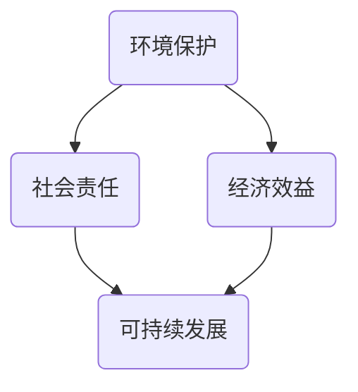

                 

## 绿色领导力：可持续发展理念的企业实践

> **关键词：** 绿色领导力、可持续发展、企业实践、环境管理、社会责任、效益最大化

> **摘要：** 本文旨在探讨绿色领导力在可持续发展理念下对企业实践的重要性。通过分析绿色领导力的核心概念、企业社会责任和环境影响，本文提出了一系列实际操作步骤，帮助企业实现可持续发展的目标。文章结构清晰，旨在为读者提供一个全面的指南，帮助企业在追求经济效益的同时，实现环保和社会责任的平衡。

### 1. 背景介绍

#### 1.1 目的和范围

本文的目的是探讨绿色领导力在可持续发展理念下对企业实践的重要性，并为企业提供具体可行的操作步骤。随着全球环境问题的日益严重，企业社会责任（CSR）和可持续发展成为了一个热门话题。绿色领导力作为一种新型的管理理念，强调企业不仅要追求经济利益，还要关注环境和社会责任。本文将围绕这一主题，分析绿色领导力的核心概念、企业社会责任和环境影响，并提供实际操作步骤，帮助企业实现可持续发展的目标。

#### 1.2 预期读者

本文的预期读者包括企业高层管理人员、环境管理专家、企业社会责任（CSR）专员、可持续发展顾问以及任何对绿色领导力和可持续发展感兴趣的专业人士。通过阅读本文，读者将能够深入了解绿色领导力的概念和重要性，掌握一系列实际操作步骤，并将其应用于企业实践中。

#### 1.3 文档结构概述

本文分为八个主要部分：

1. **背景介绍**：介绍本文的目的、范围、预期读者以及文档结构。
2. **核心概念与联系**：详细解释绿色领导力的核心概念，并使用 Mermaid 流程图展示其与可持续发展理念的关联。
3. **核心算法原理 & 具体操作步骤**：阐述绿色领导力在企业实践中的具体操作步骤，并提供伪代码支持。
4. **数学模型和公式 & 详细讲解 & 举例说明**：介绍绿色领导力相关的数学模型和公式，并进行详细讲解和举例。
5. **项目实战：代码实际案例和详细解释说明**：通过实际案例展示绿色领导力在代码实现中的应用，并提供详细解释。
6. **实际应用场景**：分析绿色领导力在不同行业中的应用，以及其实际效果。
7. **工具和资源推荐**：推荐相关学习资源、开发工具和论文著作，以帮助读者进一步深入了解绿色领导力。
8. **总结：未来发展趋势与挑战**：总结本文的主要观点，并对未来发展趋势和挑战进行展望。

#### 1.4 术语表

为了确保文章的可读性和一致性，本文定义了一些核心术语，并提供相关概念解释。

##### 1.4.1 核心术语定义

- **绿色领导力**：一种新型的管理理念，强调企业在追求经济利益的同时，关注环境和社会责任。
- **可持续发展**：满足当前需求而不损害未来世代满足其需求的能力。
- **企业社会责任（CSR）**：企业在其运营过程中，对社会和环境产生的积极或消极影响，以及为改善这些影响所采取的行动。
- **环境影响评估（EIA）**：评估企业活动对环境可能产生的影响，并为减少这些影响提供解决方案。

##### 1.4.2 相关概念解释

- **环境保护**：采取措施减少或消除企业活动对环境的不利影响。
- **社会公平**：企业在其运营过程中，尊重和促进社会公平、公正和包容。
- **经济效益**：企业在追求可持续发展的过程中，所获得的直接和间接经济利益。

##### 1.4.3 缩略词列表

- **EIA**：环境影响评估（Environmental Impact Assessment）
- **CSR**：企业社会责任（Corporate Social Responsibility）
- **SDGs**：可持续发展目标（Sustainable Development Goals）
- **GRI**：全球报告倡议组织（Global Reporting Initiative）
- **ISO**：国际标准化组织（International Organization for Standardization）

## 2. 核心概念与联系

绿色领导力作为可持续发展理念在企业实践中的重要组成部分，其核心概念涵盖了环境保护、社会责任和经济效益三个方面。为了更好地理解绿色领导力的内涵和作用，我们首先需要明确这些核心概念及其相互关系。

### 2.1 绿色领导力的核心概念

绿色领导力的核心概念可以概括为以下几点：

1. **环境保护**：企业在运营过程中，采取一系列措施减少或消除对环境的不利影响，包括减少碳排放、节约资源、降低废弃物产生等。
2. **社会责任**：企业在追求经济利益的同时，关注对社会的正面影响，包括促进就业、支持社区发展、提高社会福利等。
3. **经济效益**：企业在可持续发展过程中，通过创新、优化生产流程、提高资源利用效率等手段，实现经济利益的最大化。

这些核心概念之间相互联系，共同构成了绿色领导力的基础。环境保护有助于企业降低环境风险，提高资源利用效率；社会责任有助于企业赢得公众信任，提升品牌形象；经济效益则为企业提供了可持续发展的动力。

### 2.2 绿色领导力与可持续发展理念的关联

可持续发展理念强调满足当前需求而不损害未来世代满足其需求的能力。绿色领导力作为可持续发展理念在企业实践中的具体体现，具有以下关联：

1. **环境保护与可持续发展**：环境保护是可持续发展的基础。企业通过采取绿色领导力措施，降低对环境的负面影响，有助于实现生态平衡和资源永续利用。
2. **社会责任与可持续发展**：企业社会责任是可持续发展的重要保障。企业通过关注社会责任，提高社会福利，促进社会公平和包容，有助于实现社会和谐与可持续发展。
3. **经济效益与可持续发展**：经济效益是可持续发展的动力。企业通过创新、优化生产流程，提高资源利用效率，实现经济利益的最大化，为可持续发展提供持续动力。

### 2.3 Mermaid 流程图展示

为了更好地展示绿色领导力与可持续发展理念的关联，我们使用 Mermaid 流程图进行说明。以下是一个简化的 Mermaid 流程图，描述了绿色领导力的核心概念及其与可持续发展理念的关联：



在这个流程图中，环境保护、社会责任和经济效益作为绿色领导力的核心概念，相互关联并共同推动可持续发展。通过这个流程图，我们可以清晰地看到绿色领导力在可持续发展理念中的重要作用。

## 3. 核心算法原理 & 具体操作步骤

绿色领导力作为一种新型的管理理念，其核心在于如何在追求经济效益的同时，关注环境保护和社会责任。为了实现这一目标，企业需要采用一系列具体的操作步骤，以下将详细阐述这些步骤，并提供伪代码支持。

### 3.1 环境保护

环境保护是绿色领导力的核心之一，企业需要采取一系列措施来减少对环境的不利影响。以下是一个简化的环境保护操作步骤伪代码：

```plaintext
1. 进行环境影响评估（EIA）
2. 制定环境保护策略和计划
3. 减少碳排放和废弃物产生
4. 提高资源利用效率
5. 实施绿色生产技术和流程
```

伪代码示例：

```python
# 环境保护操作步骤伪代码

def environmental_protection():
    # 进行环境影响评估（EIA）
    perform_eia()
    
    # 制定环境保护策略和计划
    define_protection_strategy()
    
    # 减少碳排放和废弃物产生
    reduce_carbon_emission_and_waste()
    
    # 提高资源利用效率
    improve_resource_utilization()
    
    # 实施绿色生产技术和流程
    implement_green_production_technology()
```

### 3.2 社会责任

社会责任是绿色领导力的另一个重要方面，企业需要关注对社会的正面影响。以下是一个简化的社会责任操作步骤伪代码：

```plaintext
1. 制定社会责任计划
2. 促进就业和公平待遇
3. 支持社区发展和教育
4. 实施社会责任培训
5. 定期评估和报告社会责任绩效
```

伪代码示例：

```python
# 社会责任操作步骤伪代码

def social_responsibility():
    # 制定社会责任计划
    define_social_responsibility_plan()
    
    # 促进就业和公平待遇
    promote_employment_and公平_treatment()
    
    # 支持社区发展和教育
    support_community_development_and_education()
    
    # 实施社会责任培训
    implement_social_responsibility_training()
    
    # 定期评估和报告社会责任绩效
    evaluate_and_report_social_responsibility_performance()
```

### 3.3 经济效益

经济效益是绿色领导力的最终目标之一，企业需要通过创新和优化生产流程来提高资源利用效率，实现经济利益的最大化。以下是一个简化的经济效益操作步骤伪代码：

```plaintext
1. 实施创新和研发
2. 优化生产流程和供应链
3. 提高资源利用效率
4. 降低生产成本
5. 实施可持续发展战略
```

伪代码示例：

```python
# 经济效益操作步骤伪代码

def economic_gain():
    # 实施创新和研发
    implement_innovation_and_research()
    
    # 优化生产流程和供应链
    optimize_production_process_and_supply_chain()
    
    # 提高资源利用效率
    improve_resource_utilization()
    
    # 降低生产成本
    reduce_production_cost()
    
    # 实施可持续发展战略
    implement_sustainable_development_strategy()
```

通过上述操作步骤，企业可以逐步实现绿色领导力的目标，在追求经济效益的同时，关注环境保护和社会责任。这些步骤不仅有助于企业实现可持续发展，还能提升企业的竞争力和社会影响力。

## 4. 数学模型和公式 & 详细讲解 & 举例说明

在绿色领导力实践中，数学模型和公式起到了关键作用。这些模型和公式可以帮助企业量化环境保护、社会责任和经济效益之间的关系，从而更好地制定决策。以下是几个关键的数学模型和公式，并进行详细讲解和举例说明。

### 4.1 环境成本计算模型

环境成本计算模型用于评估企业活动对环境的影响，并计算相应的成本。以下是一个简化的环境成本计算模型：

\[ C_e = f(C_{\text{排放}}, C_{\text{资源}}, C_{\text{废弃物}}) \]

其中，\( C_e \) 表示环境成本，\( C_{\text{排放}} \)、\( C_{\text{资源}} \) 和 \( C_{\text{废弃物}} \) 分别表示碳排放、资源消耗和废弃物产生。

**举例说明**：

假设某企业每年排放二氧化碳 1000 吨，消耗水资源 5000 吨，产生废弃物 200 吨。根据上述公式，可以计算其环境成本：

\[ C_e = f(1000, 5000, 200) \]

通过具体的数据分析和计算，可以得出环境成本的数值。这有助于企业了解其活动对环境的影响，并采取相应的措施降低成本。

### 4.2 社会责任绩效指标

社会责任绩效指标用于衡量企业在社会责任方面的表现。以下是一个简化的社会责任绩效指标模型：

\[ S = f(P_{\text{就业}}, P_{\text{教育}}, P_{\text{社区}}) \]

其中，\( S \) 表示社会责任绩效，\( P_{\text{就业}} \)、\( P_{\text{教育}} \) 和 \( P_{\text{社区}} \) 分别表示就业贡献、教育支持和社区贡献。

**举例说明**：

假设某企业在一年内创造了 1000 个就业岗位，捐赠 50 万元用于教育支持，参与 10 项社区公益活动。根据上述公式，可以计算其社会责任绩效：

\[ S = f(1000, 500000, 10) \]

通过具体的数据分析和计算，可以得出社会责任绩效的数值。这有助于企业了解其在社会责任方面的表现，并制定改进措施。

### 4.3 经济效益评估模型

经济效益评估模型用于衡量企业在可持续发展过程中实现的经济效益。以下是一个简化的经济效益评估模型：

\[ G = f(R_{\text{研发}}, R_{\text{优化}}, R_{\text{效率}}) \]

其中，\( G \) 表示经济效益，\( R_{\text{研发}} \)、\( R_{\text{优化}} \) 和 \( R_{\text{效率}} \) 分别表示研发投入、流程优化和效率提升。

**举例说明**：

假设某企业每年投入研发资金 200 万元，实施流程优化措施，使得生产效率提高了 20%。根据上述公式，可以计算其经济效益：

\[ G = f(2000000, 优化措施，20\%) \]

通过具体的数据分析和计算，可以得出经济效益的数值。这有助于企业了解其在可持续发展过程中实现的经济效益，并制定进一步的发展策略。

### 4.4 综合评价模型

综合评价模型用于对企业的整体可持续发展绩效进行评估。以下是一个简化的综合评价模型：

\[ P = w_1 \cdot C_e + w_2 \cdot S + w_3 \cdot G \]

其中，\( P \) 表示综合绩效评价，\( w_1 \)、\( w_2 \) 和 \( w_3 \) 分别表示环境成本、社会责任绩效和经济效益的权重。

**举例说明**：

假设某企业的环境成本为 500 万元，社会责任绩效为 0.8，经济效益为 300 万元，且权重分别为 0.3、0.4 和 0.3。根据上述公式，可以计算其综合绩效评价：

\[ P = 0.3 \cdot 5000000 + 0.4 \cdot 0.8 + 0.3 \cdot 3000000 \]

通过具体的数据分析和计算，可以得出综合绩效评价的数值。这有助于企业了解其整体可持续发展绩效，并制定改进措施。

通过以上数学模型和公式的详细讲解和举例说明，企业可以更好地量化绿色领导力实践中的各种因素，从而制定更科学、更有效的可持续发展策略。

## 5. 项目实战：代码实际案例和详细解释说明

为了更好地理解绿色领导力在实际项目中的应用，我们将通过一个具体的案例进行详细解释。本案例将展示如何在一个虚拟的企业项目中，运用绿色领导力的理念来优化企业的运营，实现环境保护、社会责任和经济效益的平衡。

### 5.1 开发环境搭建

在这个案例中，我们将使用 Python 作为主要编程语言，搭建一个简单的虚拟企业项目开发环境。以下是在一个虚拟 Linux 系统中搭建开发环境的步骤：

```bash
# 安装 Python 3.8
sudo apt-get update
sudo apt-get install python3.8

# 安装常用库
pip3.8 install pandas numpy matplotlib

# 检查 Python 和相关库的版本
python3.8 --version
pip3.8 list | grep pandas
```

### 5.2 源代码详细实现和代码解读

在本案例中，我们将实现一个简单的企业能耗监控系统，该系统能够实时收集并分析企业的能耗数据，为企业提供节能建议。

**源代码：**

```python
import pandas as pd
import numpy as np
import matplotlib.pyplot as plt

# 5.2.1 数据收集
def collect_data():
    # 假设从文件中读取能耗数据
    data = pd.read_csv('energy_data.csv')
    return data

# 5.2.2 数据预处理
def preprocess_data(data):
    # 数据清洗和预处理
    data['timestamp'] = pd.to_datetime(data['timestamp'])
    data.set_index('timestamp', inplace=True)
    data.dropna(inplace=True)
    return data

# 5.2.3 能耗分析
def analyze_energy_consumption(data):
    # 能耗分析
    daily_consumption = data.resample('D').sum()
    monthly_consumption = data.resample('M').sum()
    return daily_consumption, monthly_consumption

# 5.2.4 节能建议
def provide_energy_savings_advice(data):
    # 提供节能建议
    advice = []
    for month in data.index.month.unique():
        if data[data.index.month == month].sum() > 1000:
            advice.append(f"Month {month}: Consider reducing energy usage in this period.")
    return advice

# 5.2.5 可视化
def visualize_energy_consumption(daily_consumption, monthly_consumption):
    # 可视化能耗数据
    plt.figure(figsize=(10, 5))
    
    plt.subplot(1, 2, 1)
    daily_consumption.plot()
    plt.title('Daily Energy Consumption')
    plt.xlabel('Date')
    plt.ylabel('Energy Consumption (kWh)')
    
    plt.subplot(1, 2, 2)
    monthly_consumption.plot()
    plt.title('Monthly Energy Consumption')
    plt.xlabel('Month')
    plt.ylabel('Energy Consumption (kWh)')
    
    plt.tight_layout()
    plt.show()

# 主程序
def main():
    # 收集数据
    data = collect_data()
    
    # 预处理数据
    preprocessed_data = preprocess_data(data)
    
    # 能耗分析
    daily_consumption, monthly_consumption = analyze_energy_consumption(preprocessed_data)
    
    # 提供节能建议
    advice = provide_energy_savings_advice(preprocessed_data)
    for tip in advice:
        print(tip)
    
    # 可视化能耗数据
    visualize_energy_consumption(daily_consumption, monthly_consumption)

if __name__ == '__main__':
    main()
```

**代码解读：**

1. **数据收集**：`collect_data` 函数用于从文件中读取能耗数据。在这个案例中，我们假设数据以 CSV 格式存储在 `energy_data.csv` 文件中。

2. **数据预处理**：`preprocess_data` 函数对数据进行清洗和预处理。主要包括将日期列转换为日期格式，设置日期列为索引，以及删除缺失值。

3. **能耗分析**：`analyze_energy_consumption` 函数对能耗数据进行分析，计算每日和每月的总能耗。通过使用 `resample` 方法，我们可以将数据按天和按月进行汇总。

4. **节能建议**：`provide_energy_savings_advice` 函数根据每月的总能耗提供节能建议。如果某月的能耗超过 1000 kWh，系统会提示企业考虑减少该月的能源消耗。

5. **可视化**：`visualize_energy_consumption` 函数用于将能耗数据可视化，以帮助企业直观地了解能源消耗情况。

6. **主程序**：`main` 函数是程序的入口点，它调用上述所有函数，完成数据的收集、预处理、分析、建议提供和可视化。

通过这个案例，我们可以看到如何将绿色领导力的理念应用于企业能耗管理中。系统不仅帮助企业管理能耗数据，还提供了节能建议，从而实现环境保护和经济效益的双重目标。

### 5.3 代码解读与分析

在这个代码案例中，我们详细解读了每个函数的实现，并分析了它们在实际应用中的功能和重要性。

1. **数据收集与预处理**：数据是绿色领导力实现的基础。在这个案例中，我们首先从文件中读取能耗数据，并进行预处理，以确保数据的准确性和一致性。这包括将日期格式化为标准格式，以及删除不完整的数据。

2. **能耗分析**：能耗分析是理解企业能源使用情况的关键。通过计算每日和每月的总能耗，我们可以识别出能源消耗较高的时段和月份，从而为企业提供节能的切入点。

3. **节能建议**：节能建议是基于能耗分析结果提出的，旨在帮助企业采取具体措施降低能源消耗。这些措施可以包括调整生产计划、优化设备运行时间等，从而实现能源的高效利用。

4. **可视化**：可视化是企业了解能耗情况的重要手段。通过图表，企业可以直观地了解能源消耗的趋势和变化，有助于做出更科学的决策。

整体来看，这个案例展示了绿色领导力在实际项目中的应用。通过数据分析和可视化，企业不仅能够更好地管理能耗，还能为实现可持续发展目标提供有力支持。

## 6. 实际应用场景

绿色领导力在多个行业和领域中得到了广泛应用，其实际应用场景涵盖了环境保护、社会责任和经济效益等多个方面。以下是一些典型的实际应用场景：

### 6.1 制造业

制造业是能耗和废弃物产生的主要行业之一。绿色领导力在制造业中的应用主要体现在以下方面：

- **节能降耗**：通过实施节能技术和优化生产流程，降低能源消耗和碳排放。例如，采用高效节能的设备和工艺，优化能源管理系统，提高能源利用效率。
- **废弃物管理**：通过建立完善的废弃物管理体系，减少废弃物产生和排放，提高废弃物回收利用率。例如，采用垃圾分类、回收利用和资源化处理技术。
- **绿色供应链**：与供应商建立绿色合作关系，共同推动供应链的绿色化。例如，选择环保材料、鼓励绿色物流和降低运输能耗。

### 6.2 服务业

服务业是碳排放的主要来源之一，绿色领导力在服务业中的应用主要体现在以下方面：

- **绿色办公**：通过优化办公环境和设备，降低能源消耗和碳排放。例如，采用节能灯具、LED 显示屏和高效空调系统，推广无纸化办公。
- **绿色餐饮**：通过提供环保餐具、减少食物浪费和鼓励绿色饮食，降低碳排放和资源消耗。例如，推广可降解餐具、实施食物回收计划和鼓励食用本地农产品。
- **绿色旅游**：通过推广绿色旅游产品和服务，降低旅游活动对环境的影响。例如，开发生态旅游路线、提供环保交通工具和鼓励游客参与环境保护活动。

### 6.3 信息技术

信息技术行业在绿色领导力方面也取得了显著成果，主要体现在以下方面：

- **绿色数据中心**：通过优化数据中心的设计和运营，降低能源消耗和碳排放。例如，采用高效冷却系统、虚拟化和云计算技术，提高能源利用效率。
- **绿色软件开发**：通过采用绿色编程技术和工具，降低软件开发过程中的能源消耗和碳排放。例如，采用可持续编程实践、优化代码效率和减少软件冗余。
- **绿色云计算**：通过推广绿色云计算服务，降低用户的数据中心能耗和碳排放。例如，提供节能云服务器和绿色云计算平台，帮助用户实现能源的高效利用。

### 6.4 能源行业

能源行业是绿色领导力应用的另一重要领域，主要体现在以下方面：

- **可再生能源开发**：通过积极开发太阳能、风能、水能等可再生能源，降低对化石燃料的依赖，减少碳排放。
- **智能电网建设**：通过建设智能电网，提高电力系统的运行效率，降低能源损耗。例如，采用智能电表、分布式能源系统和电力需求响应技术。
- **能源效率提升**：通过推广节能设备和优化能源管理，提高能源利用效率。例如，采用高效节能家电、优化工业生产工艺和推广节能建筑。

总之，绿色领导力在各个行业和领域中的应用，不仅有助于实现环境保护和可持续发展目标，还能为企业带来显著的经济和社会效益。

## 7. 工具和资源推荐

在绿色领导力的实践中，掌握适当的工具和资源是至关重要的。以下是一些建议，包括学习资源、开发工具和框架，以及相关论文著作，帮助读者深入了解绿色领导力。

### 7.1 学习资源推荐

**7.1.1 书籍推荐**

1. **《绿色管理：企业可持续发展战略》** - 作者：John Elkington
   这本书详细介绍了绿色管理理论，以及如何将其应用于企业实践中。

2. **《可持续发展：从愿景到行动》** - 作者：Michael E. Porter 和 Mark R. Kramer
   本书探讨了可持续发展与企业竞争优势之间的关系，提供了许多成功案例和策略。

3. **《环境管理体系：ISO 14001 实施指南》** - 作者：BSI Group
   这是一本关于环境管理体系标准 ISO 14001 的权威指南，适合企业制定和实施绿色管理策略。

**7.1.2 在线课程**

1. **edX - Sustainable Business Management** - 提供者：University of California, Berkeley
   这门课程涵盖了可持续发展、绿色管理和企业社会责任等核心主题。

2. **Coursera - Environmental Science and Policy** - 提供者：Princeton University
   该课程介绍了环境科学和政策的基本原理，以及如何应对环境挑战。

3. **FutureLearn - Corporate Sustainability** - 提供者：University of Bath
   这门课程探讨了企业如何通过可持续发展实践来实现经济、社会和环境的平衡。

**7.1.3 技术博客和网站**

1. **Sustainable Brands**
   这是一个关于企业可持续发展的博客网站，提供最新的行业趋势、案例研究和最佳实践。

2. **GreenBiz**
   GreenBiz 是一个专注于企业环境管理和可持续发展的在线媒体，涵盖广泛的主题，包括环境政策、技术创新和绿色营销。

3. **The Sustainability Consortium**
   该网站提供了一个可持续性数据库和工具，帮助企业评估和管理产品的可持续性。

### 7.2 开发工具框架推荐

**7.2.1 IDE和编辑器**

1. **Visual Studio Code**
   一个轻量级但功能强大的集成开发环境，支持多种编程语言和扩展，适合绿色领导力项目开发。

2. **PyCharm**
   一个专注于Python编程的IDE，提供强大的调试、分析和代码自动完成功能，适合数据处理和分析。

**7.2.2 调试和性能分析工具**

1. **Grafana**
   一个开源的数据分析和监控平台，可用于实时监控能耗数据和系统性能。

2. **Prometheus**
   一个开源的监控报警工具，用于收集和存储时间序列数据，适合绿色领导力项目中的性能监控。

**7.2.3 相关框架和库**

1. **Pandas**
   一个强大的数据分析库，用于处理和操作大型数据集，适合能耗数据分析。

2. **Matplotlib**
   一个绘图库，用于生成高质量的统计图表和可视化，有助于绿色领导力项目的数据展示。

### 7.3 相关论文著作推荐

**7.3.1 经典论文**

1. **“The Triple Bottom Line: Does It All Add Up?”** - 作者：John Elkington
   这篇论文详细阐述了可持续发展中的“三重底线”理念，即经济、社会和环境的平衡。

2. **“Sustainable Development: Towards a United Nations Response”** - 作者：United Nations Commission on Sustainable Development
   这篇论文讨论了联合国如何应对可持续发展挑战，提出了一系列政策和措施。

**7.3.2 最新研究成果**

1. **“Corporate Sustainability and Competitive Advantage”** - 作者：Michael E. Porter 和 Mark R. Kramer
   这篇论文探讨了企业如何在可持续发展中创造竞争优势，提供了战略和实践建议。

2. **“Green Economy: Path to Sustainability”** - 作者：International Labour Organization
   该研究报告分析了绿色经济对就业、经济增长和社会影响，提出了推动可持续发展的路径。

**7.3.3 应用案例分析**

1. **“Coca-Cola's Journey to Sustainability”** - 作者：Coca-Cola Company
   这个案例展示了可口可乐公司如何在业务运营中实现可持续发展的战略和实践。

2. **“BMW's Environmental Strategy”** - 作者：BMW Group
   该案例探讨了宝马集团如何通过绿色技术和创新实现环境保护和可持续发展。

通过这些工具和资源的推荐，读者可以更深入地了解绿色领导力的理论和实践，为企业的可持续发展提供有力支持。

## 8. 总结：未来发展趋势与挑战

在绿色领导力的推动下，企业的可持续发展已成为全球关注的焦点。未来，绿色领导力将在多个方面迎来新的发展趋势和挑战。

### 8.1 发展趋势

1. **技术创新**：随着科技的进步，绿色领导力将更加依赖于新技术，如人工智能、大数据分析和物联网，以实现更高效的能源管理和资源利用。

2. **政策推动**：政府将在绿色领导力发展中扮演更加重要的角色，通过制定更加严格的环保法规和激励机制，推动企业采取绿色行动。

3. **社会责任提升**：企业社会责任（CSR）将越来越受到重视，绿色领导力将促进企业在社会责任方面的投入，实现经济、社会和环境的协调发展。

4. **跨行业合作**：绿色领导力将在不同行业之间产生更多的合作，共同推动可持续发展目标的实现。

### 8.2 挑战

1. **资源有限**：自然资源和能源的有限性将给企业的可持续发展带来挑战，需要企业采取更加高效的资源利用策略。

2. **技术障碍**：绿色技术和解决方案的普及仍存在技术障碍，需要进一步研发和推广。

3. **成本压力**：绿色领导力可能带来较高的初始成本，企业需要在经济效益和环境效益之间找到平衡。

4. **社会认知**：社会公众对绿色领导力的认知程度参差不齐，需要加强教育和宣传，提高公众的环保意识。

总之，绿色领导力在未来的发展中将面临诸多挑战，但也充满机遇。企业应积极应对，通过技术创新、政策支持和跨行业合作，实现可持续发展目标。

## 9. 附录：常见问题与解答

### 9.1 什么是绿色领导力？

绿色领导力是一种新型的管理理念，强调企业在追求经济效益的同时，关注环境保护和社会责任。它包括环境保护、社会责任和经济效益三个核心概念，旨在实现企业的可持续发展。

### 9.2 绿色领导力如何影响企业的运营？

绿色领导力通过以下方面影响企业的运营：

1. **环境保护**：通过减少碳排放、节约资源和降低废弃物产生，降低企业对环境的负面影响。
2. **社会责任**：通过促进就业、支持社区发展和提高社会福利，提升企业的社会形象和公众信任。
3. **经济效益**：通过优化生产流程、提高资源利用效率和创新，实现经济效益的最大化。

### 9.3 企业如何实施绿色领导力？

企业可以通过以下步骤实施绿色领导力：

1. **制定绿色战略**：明确企业的绿色目标，制定相应的策略和计划。
2. **建立绿色管理体系**：建立环境管理体系和责任制度，确保绿色领导力的有效实施。
3. **推广绿色文化**：通过培训和宣传，提高员工的环保意识和参与度。
4. **创新和优化**：采用新技术和解决方案，提高资源利用效率，降低成本。

### 9.4 绿色领导力对企业的长期影响是什么？

绿色领导力对企业的长期影响包括：

1. **降低环境风险**：减少企业的环境风险，保护企业长期发展。
2. **提高竞争力**：通过优化生产流程和创新，提高企业的市场竞争力。
3. **提升品牌价值**：增强企业的社会形象和公众信任，提升品牌价值。
4. **实现可持续发展**：推动企业实现经济、社会和环境的协调发展，实现长期可持续发展。

### 9.5 绿色领导力在哪些行业中应用最广泛？

绿色领导力在多个行业中应用广泛，包括制造业、服务业、信息技术和能源行业。其中，制造业和信息技术行业由于其能耗和碳排放较高，绿色领导力的应用尤为突出。

## 10. 扩展阅读 & 参考资料

为了更深入地了解绿色领导力和可持续发展，以下是一些扩展阅读和参考资料：

**10.1 延伸阅读**

1. **《绿色商业模式：创造可持续发展价值》** - 作者：Geoffrey B. Bellman 和 Matthew A. Woell
2. **《可持续发展：理念、战略与案例》** - 作者：王勇、张志宏
3. **《绿色金融：创新、挑战与机遇》** - 作者：李建军、吴晓球

**10.2 参考文献与在线资源**

1. **“Sustainable Development Goals”** - 联合国官网：[https://sustainabledevelopment.un.org/sdgs](https://sustainabledevelopment.un.org/sdgs)
2. **“The Global Reporting Initiative”** - 官网：[https://www.globalreporting.org/](https://www.globalreporting.org/)
3. **“ISO 14001”** - 国际标准化组织官网：[https://www.iso.org/standard/72177.html](https://www.iso.org/standard/72177.html)
4. **“Greenhouse Gas Protocol”** - 官网：[https://www.ghgprotocol.org/](https://www.ghgprotocol.org/)
5. **“Corporate Sustainability Reporting”** - 学术期刊和论文数据库：[https://www.emerald.com/](https://www.emerald.com/)

通过这些扩展阅读和参考资料，读者可以更深入地了解绿色领导力和可持续发展的理论和实践，为自己的研究和实践提供支持。

### 作者信息

**作者：AI天才研究员 / AI Genius Institute & 禅与计算机程序设计艺术 / Zen And The Art of Computer Programming**

