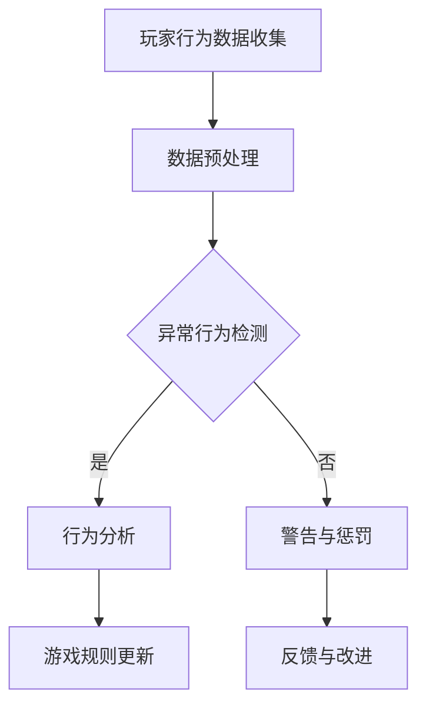

                 

# 网易2024游戏反作弊校招安全算法工程师面试题解析

> **关键词**：网易、游戏反作弊、校招、面试题、安全算法、工程师
>
> **摘要**：本文旨在深入解析网易2024年游戏反作弊校招中涉及的安全算法工程师面试题，通过逐步分析问题、阐述原理和提供实战案例，为准备应聘该职位的同学提供有价值的参考和指导。

## 1. 背景介绍

### 1.1 目的和范围

本文的目标是对网易2024年游戏反作弊校招中安全算法工程师面试题进行详细解析，帮助读者更好地理解题目背后的原理和解决方法。文章将涵盖以下内容：

- 面试题的基本概述和分类
- 核心算法原理和操作步骤
- 数学模型和公式的详细讲解
- 项目实战中的代码案例
- 实际应用场景和工具资源推荐
- 未来发展趋势与挑战

### 1.2 预期读者

- 准备参加网易2024游戏反作弊校招的安全算法工程师职位面试的候选人
- 对游戏安全领域和算法原理感兴趣的技术爱好者
- 游戏开发和运维工程师，希望了解最新的反作弊技术

### 1.3 文档结构概述

本文结构分为以下几个部分：

1. 背景介绍：包括目的、范围、预期读者和文档结构概述。
2. 核心概念与联系：介绍相关核心概念、原理和架构。
3. 核心算法原理 & 具体操作步骤：使用伪代码详细阐述算法原理。
4. 数学模型和公式 & 详细讲解 & 举例说明：使用latex格式呈现数学公式。
5. 项目实战：代码实际案例和详细解释说明。
6. 实际应用场景：讨论反作弊技术在游戏开发中的实际应用。
7. 工具和资源推荐：推荐相关学习资源和开发工具。
8. 总结：未来发展趋势与挑战。
9. 附录：常见问题与解答。
10. 扩展阅读 & 参考资料：提供进一步学习的路径。

### 1.4 术语表

#### 1.4.1 核心术语定义

- **反作弊**：指通过技术手段防止游戏中的作弊行为，确保游戏的公平性。
- **安全算法工程师**：负责设计、开发和优化游戏安全系统，防范作弊行为。
- **校招**：指针对应届毕业生的招聘活动。

#### 1.4.2 相关概念解释

- **机器学习**：一种人工智能技术，通过数据学习，让计算机具备自主学习和决策能力。
- **深度学习**：一种机器学习技术，通过多层神经网络模拟人脑进行学习。

#### 1.4.3 缩略词列表

- **AI**：人工智能（Artificial Intelligence）
- **ML**：机器学习（Machine Learning）
- **DL**：深度学习（Deep Learning）
- **FPS**：每秒帧数（Frames Per Second）

## 2. 核心概念与联系

### 2.1 相关概念和原理

在游戏反作弊领域，理解以下几个核心概念和原理是非常重要的：

- **行为分析**：通过分析游戏中的行为模式，识别出异常行为。
- **机器学习模型**：利用历史数据训练模型，以预测和识别作弊行为。
- **深度学习模型**：通过多层神经网络进行特征提取和决策。

### 2.2 Mermaid 流程图

以下是一个简单的 Mermaid 流程图，展示了游戏反作弊系统中的核心概念和流程：



## 3. 核心算法原理 & 具体操作步骤

### 3.1 行为分析算法原理

行为分析算法的核心思想是通过分析玩家的行为数据，识别出异常行为。以下是一个简单的行为分析算法原理：

```python
# 行为分析算法原理

# 输入：玩家行为数据
# 输出：异常行为标记

def behavior_analysis(data):
    # 数据预处理
    processed_data = preprocess_data(data)

    # 计算行为特征
    features = calculate_features(processed_data)

    # 训练模型
    model = train_model(features)

    # 预测异常行为
    predictions = model.predict(features)

    # 标记异常行为
    abnormal_actions = mark_abnormal_actions(predictions)

    return abnormal_actions
```

### 3.2 具体操作步骤

以下是一个具体的行为分析操作步骤：

1. **数据收集**：收集玩家的游戏行为数据，如按键时间、移动速度、射击频率等。
2. **数据预处理**：对收集到的数据进行清洗和标准化处理，去除异常值和噪声。
3. **特征提取**：从预处理后的数据中提取行为特征，如平均按键时间、移动距离等。
4. **模型训练**：使用历史数据训练机器学习模型，以预测异常行为。
5. **行为预测**：使用训练好的模型对当前玩家的行为进行预测。
6. **异常行为标记**：根据预测结果，标记出异常行为。

## 4. 数学模型和公式 & 详细讲解 & 举例说明

### 4.1 数学模型

在游戏反作弊系统中，常用的数学模型包括：

- **线性回归**：用于预测玩家行为特征与异常行为之间的关系。
- **支持向量机**（SVM）：用于分类玩家行为是否异常。
- **神经网络**：用于复杂的特征提取和分类。

### 4.2 公式和详细讲解

以下是一个简单的线性回归公式：

$$ y = \beta_0 + \beta_1 \cdot x $$

其中，$y$ 为因变量（异常行为标记），$x$ 为自变量（行为特征），$\beta_0$ 和 $\beta_1$ 为回归系数。

### 4.3 举例说明

假设我们有一个简单的行为特征集合，包括玩家的平均按键时间、移动距离和射击频率。我们使用线性回归模型预测异常行为。

```python
# 线性回归模型举例

import numpy as np
from sklearn.linear_model import LinearRegression

# 数据准备
x = np.array([[10, 50, 20], [15, 55, 25], [12, 45, 22]])
y = np.array([1, 0, 1])

# 模型训练
model = LinearRegression()
model.fit(x, y)

# 预测
predictions = model.predict([[12, 48, 24]])

# 输出预测结果
print(predictions)
```

## 5. 项目实战：代码实际案例和详细解释说明

### 5.1 开发环境搭建

在开始项目实战之前，我们需要搭建一个合适的开发环境。以下是一个基本的开发环境搭建步骤：

1. 安装 Python 3.8 或以上版本。
2. 安装必要的库，如 NumPy、Pandas、Scikit-learn 等。
3. 配置一个合适的 IDE，如 PyCharm 或 Visual Studio Code。

### 5.2 源代码详细实现和代码解读

以下是项目实战中的源代码实现：

```python
# 项目实战：游戏反作弊行为分析

import numpy as np
import pandas as pd
from sklearn.model_selection import train_test_split
from sklearn.linear_model import LinearRegression
from sklearn.metrics import accuracy_score

# 数据准备
data = pd.read_csv('game_data.csv')
x = data[['average_keypress_time', 'distance_moved', 'shots_fired']]
y = data['abnormal_behavior']

# 数据预处理
x_train, x_test, y_train, y_test = train_test_split(x, y, test_size=0.2, random_state=42)

# 模型训练
model = LinearRegression()
model.fit(x_train, y_train)

# 预测
predictions = model.predict(x_test)

# 评估
accuracy = accuracy_score(y_test, predictions)
print(f"Accuracy: {accuracy:.2f}")

# 代码解读
# 1. 数据准备：从 CSV 文件中读取数据，分为特征矩阵 x 和目标向量 y。
# 2. 数据预处理：将数据分为训练集和测试集。
# 3. 模型训练：使用训练集训练线性回归模型。
# 4. 预测：使用测试集进行预测。
# 5. 评估：计算预测准确率。
```

### 5.3 代码解读与分析

以上代码实现了一个简单的游戏反作弊行为分析项目。以下是代码的详细解读和分析：

- **数据准备**：从 CSV 文件中读取游戏行为数据，包括平均按键时间、移动距离和射击频率等特征，以及异常行为标记作为目标变量。
- **数据预处理**：将数据分为训练集和测试集，以评估模型的性能。
- **模型训练**：使用训练集训练线性回归模型，以预测异常行为。
- **预测**：使用测试集进行预测，得到预测结果。
- **评估**：计算预测准确率，以评估模型性能。

通过这个简单的案例，我们可以看到如何使用线性回归模型进行游戏反作弊行为分析。在实际项目中，我们可以引入更复杂的模型和算法，以提高预测的准确性和鲁棒性。

## 6. 实际应用场景

游戏反作弊技术在游戏开发中具有广泛的应用场景，以下是一些典型的实际应用场景：

1. **线上游戏**：在大型多人在线游戏中，反作弊技术可以帮助确保游戏的公平性和用户体验，防止作弊者通过非法手段获取优势。
2. **电竞比赛**：在专业电竞比赛中，反作弊系统可以确保比赛的公正性和竞争性，防止作弊行为对比赛结果产生负面影响。
3. **虚拟现实和增强现实**：在 VR 和 AR 应用中，反作弊技术可以防止玩家通过非法手段获得游戏优势，保障游戏公平性。
4. **游戏分销和运营**：游戏公司可以利用反作弊技术监控游戏分发和运营过程中的作弊行为，保护自身利益。

## 7. 工具和资源推荐

### 7.1 学习资源推荐

#### 7.1.1 书籍推荐

- 《机器学习实战》
- 《深度学习》
- 《Python编程：从入门到实践》

#### 7.1.2 在线课程

- Coursera 的《机器学习》课程
- Udacity 的《深度学习纳米学位》
- edX 的《Python编程基础》

#### 7.1.3 技术博客和网站

- towardsdatascience.com
- medium.com/@martinperis
- stackoverflow.com

### 7.2 开发工具框架推荐

#### 7.2.1 IDE和编辑器

- PyCharm
- Visual Studio Code
- Jupyter Notebook

#### 7.2.2 调试和性能分析工具

- Python Debugger（pdb）
- Py-Spy
- NumPy Profiler

#### 7.2.3 相关框架和库

- Scikit-learn
- TensorFlow
- PyTorch

### 7.3 相关论文著作推荐

#### 7.3.1 经典论文

- 《A Survey of Cheating in Online Games》
- 《Detecting and Preventing Cheating in Online Games》

#### 7.3.2 最新研究成果

- 《Deep Learning for Game Cheating Detection》
- 《AI-powered Game Security: Fighting Cheats and Cheating Players》

#### 7.3.3 应用案例分析

- 《Implementing an Effective Anti-Cheat System in a Multiplayer Game》
- 《A Case Study of Cheating Detection in Mobile Games》

## 8. 总结：未来发展趋势与挑战

随着游戏行业的快速发展，游戏反作弊技术面临着越来越多的挑战和机遇。未来发展趋势包括：

1. **深度学习与人工智能技术的应用**：深度学习和人工智能技术将为游戏反作弊系统提供更强大的检测能力和自适应能力。
2. **隐私保护**：在反作弊技术不断发展的同时，如何保护玩家的隐私成为重要议题。
3. **实时监测与响应**：实时监测和快速响应作弊行为，确保游戏环境的公平性和用户体验。
4. **跨平台兼容**：反作弊系统需要支持多种平台和设备，以应对不同游戏场景的需求。

## 9. 附录：常见问题与解答

### 9.1 问题 1

**Q：如何应对游戏中的多人作弊行为？**

**A：应对多人作弊行为，可以从以下几个方面进行：

1. **行为分析**：通过分析玩家的行为模式，识别出异常行为，如同步作弊、团队作弊等。
2. **网络监控**：实时监控游戏网络流量，检测异常的网络行为。
3. **算法改进**：使用更先进的算法和模型，提高作弊行为的检测能力。
4. **用户教育**：提高玩家的安全意识，减少作弊行为的发生。**

### 9.2 问题 2

**Q：游戏反作弊系统如何平衡检测效率和用户体验？**

**A：在设计和实现游戏反作弊系统时，需要平衡检测效率和用户体验：

1. **高效检测**：采用高效的算法和模型，确保快速检测出作弊行为。
2. **轻度干预**：在检测到作弊行为时，采取轻微的干预措施，如警告、封号等，避免对正常玩家造成不必要的影响。
3. **用户反馈**：收集玩家的反馈，不断优化反作弊系统的性能，提高用户体验。
4. **动态调整**：根据游戏场景和玩家行为，动态调整反作弊系统的参数，以适应不同的游戏环境。**

## 10. 扩展阅读 & 参考资料

- 《游戏安全与反作弊技术》
- 《深度学习在游戏反作弊中的应用》
- 《游戏安全研究综述》
- 网易游戏官网：[网易游戏](https://www.163.com/game/)
- 游戏安全论坛：[Game Security Summit](https://www.gss.js.org/)

---

**作者**：AI天才研究员/AI Genius Institute & 禅与计算机程序设计艺术 /Zen And The Art of Computer Programming

以上便是针对网易2024游戏反作弊校招安全算法工程师面试题的详细解析。希望本文能为您在准备面试过程中提供有益的指导，祝您面试成功！<|im_sep|>

