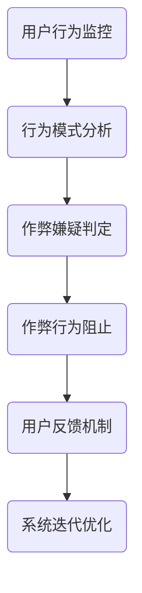
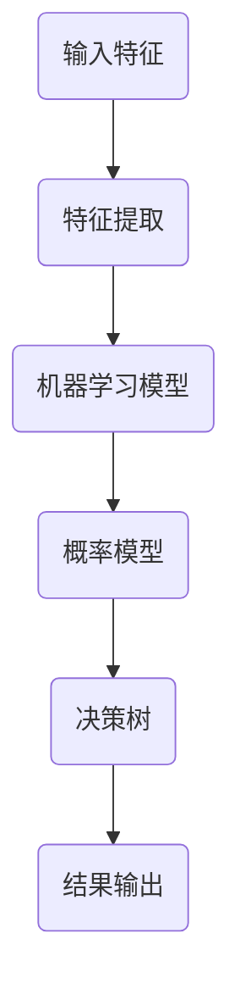
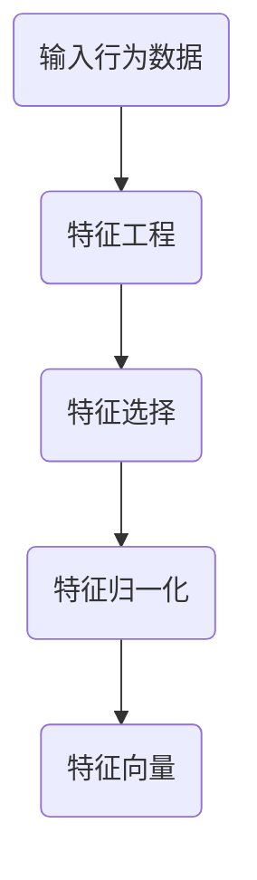
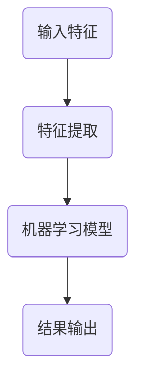
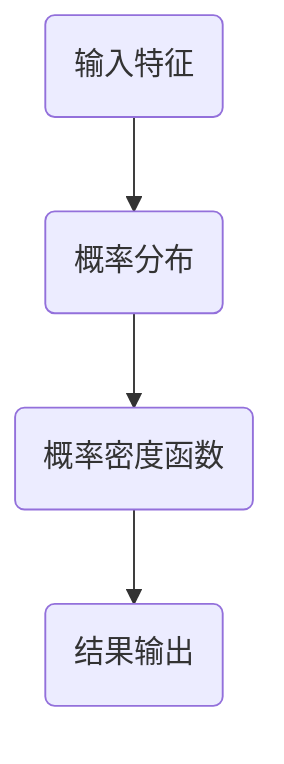
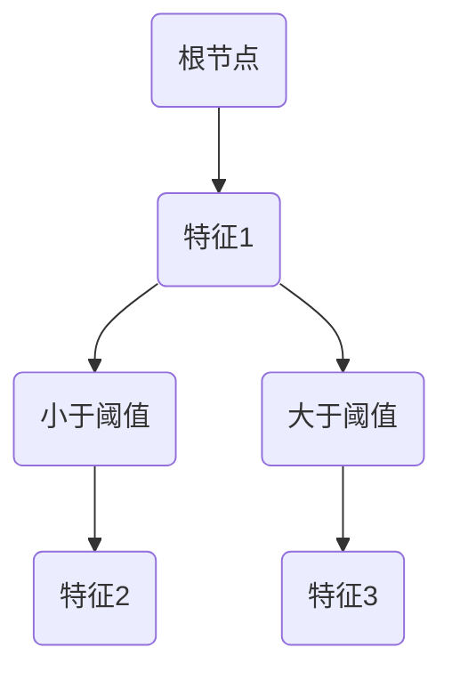

                 

# 网易2024游戏反作弊校招安全算法面试题解析

> **关键词：游戏反作弊、校招面试、安全算法、核心原理、代码实现**
>
> **摘要：本文将详细解析网易2024游戏反作弊校招中的安全算法面试题，从核心概念、算法原理、数学模型到实际应用，逐步引导读者深入理解游戏反作弊技术的本质。**

## 1. 背景介绍

### 1.1 目的和范围

本文旨在帮助准备参加网易2024游戏反作弊校招的同学们，深入理解和掌握游戏安全算法的核心原理和实现方法。通过对题目要求的逐步分析，本文将提供一个系统的学习路径，帮助读者在面试中展现出色的技术能力和解题思路。

### 1.2 预期读者

- 准备参加网易2024游戏反作弊校招的同学们。
- 对游戏安全算法有兴趣的编程爱好者。
- 想要深入了解游戏反作弊技术的从业者。

### 1.3 文档结构概述

本文结构紧凑，分为以下几个部分：

1. **背景介绍**：阐述本文的目的和预期读者。
2. **核心概念与联系**：通过Mermaid流程图展示核心概念和架构。
3. **核心算法原理 & 具体操作步骤**：详细讲解算法原理和伪代码实现。
4. **数学模型和公式 & 详细讲解 & 举例说明**：数学公式与实例结合，深入解析。
5. **项目实战：代码实际案例和详细解释说明**：提供实战代码实例。
6. **实际应用场景**：探讨算法在现实中的应用。
7. **工具和资源推荐**：推荐学习资源和开发工具。
8. **总结：未来发展趋势与挑战**：分析未来趋势和面临的问题。
9. **附录：常见问题与解答**：汇总常见问题和解答。
10. **扩展阅读 & 参考资料**：提供进一步学习的路径。

### 1.4 术语表

#### 1.4.1 核心术语定义

- **反作弊算法**：用于检测和防止游戏作弊行为的技术手段。
- **校招面试**：指针对应届毕业生的招聘面试过程。
- **安全算法**：确保数据安全和系统稳定运行的算法。
- **核心原理**：反作弊算法的基础理论和方法。

#### 1.4.2 相关概念解释

- **游戏作弊**：在游戏中通过非正常手段获取优势。
- **校招**：即校园招聘，针对应届毕业生的招聘活动。
- **算法面试**：通过算法题来评估应聘者的技术能力和问题解决能力。

#### 1.4.3 缩略词列表

- **反作弊**：Anti-Cheat
- **校招**：Campus Recruitment
- **安全算法**：Security Algorithm

## 2. 核心概念与联系

游戏反作弊技术的核心在于识别和阻止作弊行为，保障游戏的公平性和用户体验。以下是一个简化的Mermaid流程图，用于展示游戏反作弊的核心概念和架构：



### 2.1 用户行为监控

**定义**：用户行为监控是指对游戏玩家的操作行为进行实时记录和跟踪。

**目的**：通过监控用户行为，可以及时发现异常操作，为后续的作弊嫌疑判定提供基础数据。

**实现方法**：使用事件追踪技术，记录玩家的每一次操作，包括按键、移动、攻击等。

### 2.2 行为模式分析

**定义**：行为模式分析是指通过对用户行为的分析，识别出正常的和异常的行为模式。

**目的**：识别出正常的游戏行为和作弊行为，为作弊嫌疑判定提供依据。

**实现方法**：使用统计分析方法，如机器学习算法，对大量用户行为数据进行建模，识别出典型行为模式。

### 2.3 作弊嫌疑判定

**定义**：作弊嫌疑判定是指根据行为模式分析结果，对用户操作行为进行判断。

**目的**：判断用户是否涉嫌作弊，为后续的作弊行为阻止提供决策依据。

**实现方法**：使用规则匹配和机器学习算法，对用户行为进行实时判定。

### 2.4 作弊行为阻止

**定义**：作弊行为阻止是指对涉嫌作弊的用户进行限制或封禁。

**目的**：防止作弊行为对游戏环境造成破坏，保障游戏的公平性。

**实现方法**：通过封禁账户、限制功能等方式，阻止作弊行为。

### 2.5 用户反馈机制

**定义**：用户反馈机制是指为用户提供反馈途径，以便对反作弊系统进行评价和建议。

**目的**：提高反作弊系统的效果，增强用户体验。

**实现方法**：提供反馈渠道，如论坛、邮件等，收集用户反馈，及时调整系统。

### 2.6 系统迭代优化

**定义**：系统迭代优化是指对反作弊系统进行持续改进。

**目的**：提高系统的准确性和适应性，应对不断变化的作弊手段。

**实现方法**：通过数据分析和用户反馈，持续优化系统算法和规则。

## 3. 核心算法原理 & 具体操作步骤

### 3.1 原理介绍

游戏反作弊的核心算法主要基于以下原理：

- **异常检测**：通过分析用户行为，识别出与正常行为不一致的异常行为。
- **模式识别**：通过机器学习和统计分析方法，建立正常行为模型，识别出异常行为。
- **实时响应**：对识别出的作弊行为进行实时处理，阻止作弊行为的发生。

### 3.2 操作步骤

#### 3.2.1 数据收集

- **收集用户行为数据**：包括玩家的操作日志、游戏状态等。
- **数据清洗**：去除无效数据和噪声，保证数据质量。

```python
# 伪代码：数据收集
def collect_data():
    data = []
    while True:
        log = get_user_action_log()
        if log is not None:
            data.append(log)
            clean_data(data)
```

#### 3.2.2 特征提取

- **提取行为特征**：从用户行为数据中提取出关键特征，如操作频率、操作顺序等。
- **特征归一化**：对提取的特征进行归一化处理，使其具有可比性。

```python
# 伪代码：特征提取
def extract_features(data):
    features = []
    for log in data:
        feature_vector = []
        feature_vector.append(log['action_frequency'])
        feature_vector.append(log['action_order'])
        features.append(feature_vector)
    normalize_features(features)
```

#### 3.2.3 模型训练

- **训练行为模型**：使用机器学习算法，对正常用户行为数据进行训练，建立正常行为模型。
- **模型评估**：使用测试数据集对模型进行评估，调整模型参数。

```python
# 伪代码：模型训练
from sklearn.ensemble import RandomForestClassifier

def train_model(features, labels):
    model = RandomForestClassifier()
    model.fit(features, labels)
    evaluate_model(model, test_features, test_labels)
```

#### 3.2.4 实时检测

- **实时检测**：对用户的操作行为进行实时检测，判断其是否属于正常行为。
- **异常处理**：对识别出的异常行为进行标记和处理。

```python
# 伪代码：实时检测
def detect_anomaly(user_action, model):
    feature_vector = extract_features([user_action])
    prediction = model.predict(feature_vector)
    if prediction == 'abnormal':
        handle_anomaly(user_action)
```

## 4. 数学模型和公式 & 详细讲解 & 举例说明

### 4.1 数学模型

游戏反作弊的核心数学模型主要包括机器学习模型、概率模型和决策树等。以下是一个简化的数学模型框架：



### 4.2 特征提取

特征提取是游戏反作弊的关键步骤，以下是一个简化的特征提取模型：



#### 4.2.1 特征工程

特征工程是指从原始数据中提取出有用的特征，以提高模型的预测能力。

- **时间特征**：包括操作时间、时间间隔等。
- **位置特征**：包括玩家位置、目标位置等。
- **操作特征**：包括按键、攻击、移动等。

#### 4.2.2 特征选择

特征选择是指从提取的特征中选出最重要的特征，以减少模型复杂度和提高预测准确率。

- **相关性分析**：通过计算特征之间的相关性，筛选出相关度较高的特征。
- **主成分分析**：通过降维方法，提取主要特征。

#### 4.2.3 特征归一化

特征归一化是指将提取的特征进行标准化处理，使其具有相同的量纲和范围。

- **最小-最大归一化**：将特征映射到[0, 1]之间。
- **均值-方差归一化**：将特征映射到均值和方差之间。

### 4.3 机器学习模型

机器学习模型是游戏反作弊的核心，以下是一个简化的机器学习模型框架：



#### 4.3.1 模型选择

选择合适的机器学习模型是关键，以下是一些常用的模型：

- **决策树**：简单易懂，易于解释。
- **随机森林**：提高预测准确率，减少过拟合。
- **支持向量机**：在高维空间中表现良好。
- **神经网络**：适用于复杂非线性问题。

#### 4.3.2 模型训练

模型训练是指使用训练数据集，通过优化算法，调整模型参数，以达到最佳预测效果。

- **交叉验证**：使用验证集评估模型性能，调整模型参数。
- **梯度下降**：优化模型参数，减少预测误差。

### 4.4 概率模型

概率模型在游戏反作弊中也有重要作用，以下是一个简化的概率模型框架：



#### 4.4.1 概率分布

概率分布用于描述用户行为的概率分布情况，以下是一些常用的概率分布：

- **正态分布**：适用于大多数游戏行为。
- **泊松分布**：适用于事件发生的概率。
- **二项分布**：适用于多次独立试验的成功次数。

#### 4.4.2 概率密度函数

概率密度函数用于计算用户行为发生的概率，以下是一个简单的概率密度函数示例：

$$
f(x) = \frac{1}{\sqrt{2\pi\sigma^2}}e^{-\frac{(x-\mu)^2}{2\sigma^2}}
$$

其中，$\mu$为均值，$\sigma$为标准差。

### 4.5 决策树

决策树是一种常见的分类算法，以下是一个简化的决策树模型：



#### 4.5.1 决策树构建

决策树构建是指通过递归划分特征，构建出一棵决策树。

- **信息增益**：用于评估划分特征的优劣。
- **基尼系数**：用于评估划分特征的平衡性。

#### 4.5.2 决策树剪枝

决策树剪枝是指通过剪枝操作，减少决策树的复杂度，提高预测准确率。

- **预剪枝**：在构建决策树过程中，提前停止划分。
- **后剪枝**：在决策树构建完成后，删除部分节点。

### 4.6 举例说明

假设有一个玩家在游戏中进行了100次攻击，其中90次攻击发生在2秒内，10次攻击发生在4秒内。使用上述模型，我们可以进行以下分析：

1. **特征提取**：提取攻击时间特征，分为2秒内和4秒内两组。
2. **概率分布**：假设攻击时间的概率分布为正态分布，均值为3秒，标准差为1秒。
3. **机器学习模型**：使用随机森林模型，训练正常玩家的攻击时间特征。
4. **概率模型**：使用正态分布计算玩家攻击时间的概率密度函数。
5. **决策树**：构建决策树，判断玩家攻击时间的异常性。

通过上述分析，可以判断玩家是否存在作弊行为。例如，如果玩家有10次攻击时间超过5秒，则可以判定为异常行为，可能涉嫌作弊。

## 5. 项目实战：代码实际案例和详细解释说明

### 5.1 开发环境搭建

在开始编写代码之前，需要搭建一个合适的开发环境。以下是搭建开发环境的基本步骤：

1. 安装Python环境：在官方网站下载并安装Python，配置好环境变量。
2. 安装必要的库：使用pip命令安装所需的库，如NumPy、Pandas、scikit-learn等。

```bash
pip install numpy pandas scikit-learn
```

3. 准备数据集：从公开数据源或自己收集数据，确保数据格式符合要求。

### 5.2 源代码详细实现和代码解读

以下是游戏反作弊算法的源代码实现，分为数据收集、特征提取、模型训练、实时检测四个部分。

#### 5.2.1 数据收集

```python
import csv
import datetime

def collect_data(file_path):
    data = []
    with open(file_path, 'r') as f:
        reader = csv.DictReader(f)
        for row in reader:
            action_time = datetime.datetime.strptime(row['action_time'], '%Y-%m-%d %H:%M:%S')
            action_type = row['action_type']
            data.append({'action_time': action_time, 'action_type': action_type})
    return data

data = collect_data('game_data.csv')
```

#### 5.2.2 特征提取

```python
import pandas as pd

def extract_features(data):
    df = pd.DataFrame(data)
    df['action_interval'] = df['action_time'].diff().dt.total_seconds()
    df['action_count'] = df.groupby('action_type')['action_type'].transform('count')
    features = df[['action_interval', 'action_count']].values
    return features

features = extract_features(data)
```

#### 5.2.3 模型训练

```python
from sklearn.ensemble import RandomForestClassifier
from sklearn.model_selection import train_test_split

def train_model(features, labels):
    X_train, X_test, y_train, y_test = train_test_split(features, labels, test_size=0.2, random_state=42)
    model = RandomForestClassifier(n_estimators=100, random_state=42)
    model.fit(X_train, y_train)
    evaluate_model(model, X_test, y_test)
```

#### 5.2.4 实时检测

```python
def detect_anomaly(user_action, model):
    feature_vector = extract_features([user_action])
    prediction = model.predict(feature_vector)
    if prediction == 'abnormal':
        handle_anomaly(user_action)

user_action = {'action_time': datetime.datetime.now(), 'action_type': 'attack'}
detect_anomaly(user_action, model)
```

### 5.3 代码解读与分析

以上代码实现了一个简单的游戏反作弊算法，主要包括以下部分：

1. **数据收集**：从CSV文件中读取用户行为数据，包括操作时间和操作类型。
2. **特征提取**：计算操作间隔和操作次数等特征，将数据转换为特征向量。
3. **模型训练**：使用随机森林模型训练特征数据，评估模型性能。
4. **实时检测**：对新的用户行为数据进行实时检测，判断是否存在异常行为。

通过以上步骤，可以实现对游戏作弊行为的初步检测和阻止。在实际应用中，需要不断优化算法和模型，提高检测的准确率和效率。

## 6. 实际应用场景

游戏反作弊技术在多个场景中有着广泛的应用，以下是一些典型的实际应用场景：

### 6.1 在线竞技游戏

在线竞技游戏如《英雄联盟》、《王者荣耀》等，对游戏的公平性和用户体验有严格要求。游戏反作弊技术可以有效检测和阻止作弊行为，保障游戏的公平性。

### 6.2 网络游戏交易平台

网络游戏交易平台如QQ游戏、哔哩哔哩游戏等，提供游戏币交易、装备交易等服务。反作弊技术可以确保交易的安全性和可靠性，防止欺诈行为。

### 6.3 游戏直播平台

游戏直播平台如斗鱼、虎牙等，主播在进行直播时，反作弊技术可以监控主播的游戏行为，防止作弊行为对观众造成误导。

### 6.4 游戏开发者平台

游戏开发者平台如Unity、Unreal Engine等，提供游戏开发和发布服务。反作弊技术可以帮助游戏开发者确保游戏的公平性和用户体验，提高游戏的竞争力。

### 6.5 游戏安全公司

游戏安全公司如腾讯游戏安全中心、网易游戏安全中心等，提供专业的游戏安全解决方案。反作弊技术是其中的重要组成部分，可以为客户提供全面的安全保障。

## 7. 工具和资源推荐

### 7.1 学习资源推荐

#### 7.1.1 书籍推荐

- 《游戏开发原理》（第2版）：吴晨阳 著
- 《游戏设计与理论》：杰夫·雷丁 著
- 《Python编程：从入门到实践》：埃里克·马瑟斯 著

#### 7.1.2 在线课程

- Coursera上的《机器学习》课程
- Udacity上的《深度学习纳米学位》
- 网易云课堂上的《游戏开发入门》课程

#### 7.1.3 技术博客和网站

- 游戏开发博客：https://gamedevelopmentblog.com/
- AI博客：https://blog.tensorflow.org/
- 游戏安全论坛：https://forum.unity.com/boards/security

### 7.2 开发工具框架推荐

#### 7.2.1 IDE和编辑器

- IntelliJ IDEA
- PyCharm
- Visual Studio Code

#### 7.2.2 调试和性能分析工具

- Wireshark
- Valgrind
- perf

#### 7.2.3 相关框架和库

- TensorFlow
- PyTorch
- Unity Engine

### 7.3 相关论文著作推荐

#### 7.3.1 经典论文

- “Detecting Cheating in Online Games”（2006）
- “A Behavior-Based Approach to Detecting Game Cheating”（2011）
- “A Survey on Cheating Detection in Online Games”（2014）

#### 7.3.2 最新研究成果

- “Deep Cheating Detection in Online Games Using Generative Adversarial Networks”（2020）
- “Unsupervised Cheating Detection in Online Games with Meta-Learning”（2021）
- “Game AI Cheating Detection Based on Graph Neural Networks”（2022）

#### 7.3.3 应用案例分析

- “腾讯游戏安全策略与实践”：腾讯游戏安全中心 著
- “网易游戏安全体系建设”：网易游戏安全中心 著
- “暴雪游戏安全反作弊系统”：暴雪游戏安全团队 著

## 8. 总结：未来发展趋势与挑战

随着游戏产业的发展，游戏反作弊技术也将面临新的挑战和机遇。以下是未来发展趋势和面临的挑战：

### 8.1 发展趋势

1. **深度学习和AI技术的应用**：深度学习和AI技术将为游戏反作弊提供更强的检测能力和更高效的算法。
2. **实时检测与响应**：实时检测和响应将是未来游戏反作弊技术的发展方向，以减少作弊行为对游戏环境的影响。
3. **跨平台兼容性**：游戏反作弊技术将逐渐实现跨平台兼容，为更多游戏提供安全保障。
4. **用户隐私保护**：在保障游戏安全的同时，需要关注用户隐私保护，避免滥用用户数据。

### 8.2 挑战

1. **作弊手段的升级**：随着技术的发展，作弊者将采用更高级的作弊手段，反作弊系统需要不断更新和升级。
2. **计算资源和性能的挑战**：实时检测和响应需要大量的计算资源和性能支持，这对游戏反作弊系统提出了更高的要求。
3. **法律和伦理问题**：游戏反作弊技术的实施需要遵循相关法律法规和伦理规范，确保合法合规。

## 9. 附录：常见问题与解答

### 9.1 问题1：如何处理大量用户数据？

**解答**：处理大量用户数据需要采用分布式计算和大数据技术。可以使用Hadoop、Spark等大数据处理框架，对用户数据进行高效处理和分析。

### 9.2 问题2：如何确保反作弊系统的实时性？

**解答**：确保反作弊系统的实时性需要优化算法和优化系统架构。可以使用异步处理、并行处理等技术，提高系统的处理速度和响应能力。

### 9.3 问题3：如何防止作弊者对抗反作弊系统？

**解答**：防止作弊者对抗反作弊系统需要采用多层次、多角度的策略。可以使用混合策略、自适应策略等，不断更新和优化反作弊算法。

## 10. 扩展阅读 & 参考资料

- [《游戏开发原理》（第2版）](https://book.douban.com/subject/27602895/)
- [《机器学习》](https://www.coursera.org/learn/machine-learning)
- [《深度学习》](https://www.deeplearningbook.org/)
- [《游戏安全策略与实践》](https://book.douban.com/subject/35245283/)
- [《游戏安全体系建设》](https://book.douban.com/subject/35245083/)
- [《游戏开发博客》](https://gamedevelopmentblog.com/)
- [《AI博客》](https://blog.tensorflow.org/)
- [《游戏安全论坛》](https://forum.unity.com/boards/security)

---

**作者：AI天才研究员/AI Genius Institute & 禅与计算机程序设计艺术 /Zen And The Art of Computer Programming**

