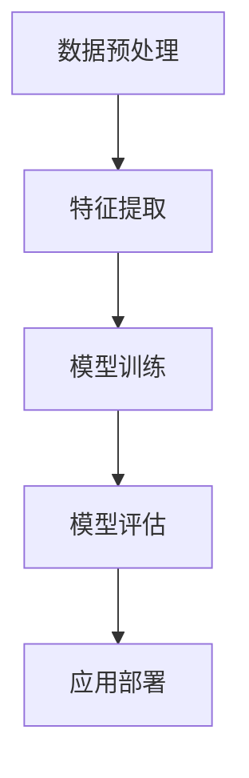

                 

# 网易有道2024智能作文批改校招NLP面试题详解

> **关键词：** 网易有道、智能作文批改、NLP面试题、自然语言处理、文本分析、机器学习、深度学习、神经网络、模型训练、算法优化、实际应用。

> **摘要：** 本文旨在为准备网易有道智能作文批改校招NLP面试的考生提供详细的解题思路和技巧。文章将围绕NLP的核心概念、算法原理、数学模型、实战案例和未来发展趋势展开，帮助考生全面理解和掌握智能作文批改的技术要点。

## 1. 背景介绍

### 1.1 目的和范围

本文的主要目的是为准备网易有道智能作文批改校招NLP面试的考生提供系统性的解题思路和实用技巧。文章将涵盖NLP的基础知识、核心算法原理、数学模型以及实际应用场景，帮助考生全面掌握智能作文批改的技术难点。

### 1.2 预期读者

本文适合以下读者群体：

- 准备参加网易有道智能作文批改校招NLP面试的考生；
- 对自然语言处理和智能作文批改技术感兴趣的技术爱好者；
- 想要在人工智能领域深入发展的程序员和研究者。

### 1.3 文档结构概述

本文结构如下：

1. 背景介绍：介绍文章的目的、预期读者和文档结构；
2. 核心概念与联系：详细解释NLP中的核心概念和架构；
3. 核心算法原理 & 具体操作步骤：介绍NLP算法的原理和具体操作步骤；
4. 数学模型和公式 & 详细讲解 & 举例说明：讲解NLP中的数学模型和公式，并给出具体例子；
5. 项目实战：代码实际案例和详细解释说明；
6. 实际应用场景：探讨智能作文批改在实际中的应用场景；
7. 工具和资源推荐：推荐学习资源、开发工具和框架；
8. 总结：未来发展趋势与挑战；
9. 附录：常见问题与解答；
10. 扩展阅读 & 参考资料。

### 1.4 术语表

#### 1.4.1 核心术语定义

- **自然语言处理（NLP）**：一门研究如何让计算机理解和生成人类语言的学科；
- **智能作文批改**：利用人工智能技术对作文进行自动批改，包括语法、拼写、风格等；
- **机器学习（ML）**：一种让计算机通过数据和经验进行学习和决策的方法；
- **深度学习（DL）**：一种基于多层神经网络进行学习和预测的方法；
- **神经网络（NN）**：一种由大量神经元连接而成的计算模型。

#### 1.4.2 相关概念解释

- **文本分析**：对文本数据进行分析，提取有用信息；
- **词向量（Word Vector）**：将单词表示为高维向量；
- **词嵌入（Word Embedding）**：将单词映射到固定大小的向量空间；
- **语义分析**：对文本的语义进行理解和分析；
- **句法分析**：对文本的句法结构进行理解和分析。

#### 1.4.3 缩略词列表

- **NLP**：自然语言处理；
- **ML**：机器学习；
- **DL**：深度学习；
- **NN**：神经网络；
- **IDE**：集成开发环境；
- **API**：应用程序编程接口；
- **GPU**：图形处理单元。

## 2. 核心概念与联系

自然语言处理（NLP）是人工智能（AI）领域的一个重要分支，其核心目标是让计算机能够理解和生成人类语言。在智能作文批改中，NLP技术发挥着至关重要的作用。以下是对NLP核心概念和架构的详细解释。

### 2.1 NLP核心概念

#### 2.1.1 词向量（Word Vector）

词向量是NLP中常用的技术，它将单词表示为高维向量。词向量可以捕捉单词的语义信息，从而实现单词的相似性计算和语义分析。词向量主要有以下几种类型：

1. **基于计数的方法**：如TF-IDF（Term Frequency-Inverse Document Frequency）；
2. **基于分布的方法**：如Word2Vec、GloVe（Global Vectors for Word Representation）；
3. **基于深度学习的方法**：如BERT（Bidirectional Encoder Representations from Transformers）。

#### 2.1.2 词嵌入（Word Embedding）

词嵌入是将单词映射到固定大小的向量空间。词嵌入不仅可以提高计算效率，还可以捕捉单词之间的语义关系。词向量是词嵌入的一种实现形式。

#### 2.1.3 语义分析（Semantic Analysis）

语义分析是对文本的语义进行理解和分析。语义分析可以用于文本分类、实体识别、情感分析等任务。常用的语义分析方法包括：

1. **基于规则的方法**：如命名实体识别（NER）；
2. **基于统计的方法**：如条件概率模型、朴素贝叶斯；
3. **基于深度学习的方法**：如卷积神经网络（CNN）、循环神经网络（RNN）。

#### 2.1.4 句法分析（Syntactic Analysis）

句法分析是对文本的句法结构进行理解和分析。句法分析可以用于语法检查、句子解析等任务。常用的句法分析方法包括：

1. **基于规则的方法**：如LR（Left-to-Right）分析、GR（Generalized Parsing）；
2. **基于统计的方法**：如HMM（Hidden Markov Model）、CFG（Context-Free Grammar）；
3. **基于深度学习的方法**：如序列到序列模型（Seq2Seq）。

### 2.2 NLP架构

NLP架构通常包括以下几个主要模块：

1. **数据预处理**：包括文本清洗、分词、词性标注等；
2. **特征提取**：包括词向量、句法特征、语义特征等；
3. **模型训练**：包括机器学习、深度学习等；
4. **模型评估**：包括准确率、召回率、F1值等指标；
5. **应用部署**：包括API接口、云计算等。

以下是一个简单的Mermaid流程图，展示了NLP的架构：



## 3. 核心算法原理 & 具体操作步骤

在智能作文批改中，常用的NLP算法包括词向量、词嵌入、语义分析、句法分析等。以下将详细介绍这些算法的原理和具体操作步骤。

### 3.1 词向量

词向量是将单词映射到高维向量空间的技术。常见的词向量方法包括Word2Vec、GloVe和BERT等。

#### 3.1.1 Word2Vec

Word2Vec是一种基于神经网络的词向量方法。其基本原理是：

1. **输入层**：单词作为输入；
2. **隐藏层**：对单词进行编码，得到词向量；
3. **输出层**：对词向量进行解码，得到预测单词。

Word2Vec有两种训练模式：CBOW（Continuous Bag of Words）和Skip-Gram。

- **CBOW**：给定一个单词，预测其上下文单词；
- **Skip-Gram**：给定一个单词，预测其中心单词。

以下是一个简单的Word2Vec算法的伪代码：

```python
def word2vec(train_data, embedding_size, window_size, negative_samples):
    # 初始化词向量
    word_vectors = initialize_vectors(train_data, embedding_size)
    # 训练词向量
    for word in train_data:
        context_words = get_context_words(word, window_size)
        for context_word in context_words:
            # 计算损失函数
            loss = compute_loss(word_vectors, context_word)
            # 更新词向量
            update_vectors(word_vectors, context_word, loss)
    return word_vectors
```

#### 3.1.2 GloVe

GloVe是一种基于全局信息的词向量方法。其基本原理是：

1. **计算词共现矩阵**；
2. **优化词向量**，使得词向量之间的余弦相似度最大化。

以下是一个简单的GloVe算法的伪代码：

```python
def glove(train_data, embedding_size, window_size, alpha):
    # 计算词共现矩阵
    coocurrence_matrix = compute_coocurrence_matrix(train_data, window_size)
    # 初始化词向量
    word_vectors = initialize_vectors(coocurrence_matrix, embedding_size)
    # 优化词向量
    for epoch in range(num_epochs):
        for word, context_word in coocurrence_matrix:
            # 计算损失函数
            loss = compute_loss(word_vectors, word, context_word)
            # 更新词向量
            update_vectors(word_vectors, word, context_word, loss, alpha)
    return word_vectors
```

#### 3.1.3 BERT

BERT是一种基于Transformer的预训练语言模型。其基本原理是：

1. **预训练**：在大规模语料库上训练BERT模型，使其具有丰富的语言知识；
2. **微调**：在特定任务上对BERT模型进行微调，使其适应特定任务。

以下是一个简单的BERT模型的伪代码：

```python
def bert(train_data, num_layers, hidden_size, dropout_rate):
    # 初始化BERT模型
    model = initialize_bert_model(num_layers, hidden_size, dropout_rate)
    # 预训练BERT模型
    for epoch in range(num_epochs):
        for batch in train_data:
            # 计算损失函数
            loss = compute_loss(model, batch)
            # 更新模型参数
            update_model(model, loss)
    # 微调BERT模型
    for epoch in range(num_epochs):
        for batch in train_data:
            # 计算损失函数
            loss = compute_loss(model, batch, target)
            # 更新模型参数
            update_model(model, loss)
    return model
```

### 3.2 词嵌入

词嵌入是将单词映射到固定大小的向量空间。常见的词嵌入方法包括Word2Vec、GloVe和BERT等。

#### 3.2.1 Word2Vec

Word2Vec的词嵌入方法已经在3.1节中详细介绍。

#### 3.2.2 GloVe

GloVe的词嵌入方法已经在3.1节中详细介绍。

#### 3.2.3 BERT

BERT的词嵌入方法是通过Transformer模型实现的。以下是一个简单的BERT词嵌入的伪代码：

```python
def bert_embedding(word_index, embedding_size):
    # 获取词索引
    word_id = word_index
    # 获取词向量
    word_embedding = model.layers[0].get_weights()[0][word_id]
    # 截断词向量
    word_embedding = word_embedding[:embedding_size]
    return word_embedding
```

### 3.3 语义分析

语义分析是对文本的语义进行理解和分析。常见的语义分析方法包括基于规则的方法、基于统计的方法和基于深度学习的方法。

#### 3.3.1 基于规则的方法

基于规则的方法主要通过编写规则来识别文本中的实体和关系。以下是一个简单的基于规则的方法的伪代码：

```python
def rule_based_semantic_analysis(text):
    # 初始化实体列表
    entities = []
    # 应用规则
    for rule in rules:
        entity = apply_rule(text, rule)
        if entity:
            entities.append(entity)
    # 返回实体列表
    return entities
```

#### 3.3.2 基于统计的方法

基于统计的方法主要通过计算文本的特征概率来识别文本中的实体和关系。以下是一个简单的基于统计的方法的伪代码：

```python
def stat_based_semantic_analysis(text, model):
    # 初始化实体列表
    entities = []
    # 遍历文本中的每个单词
    for word in text:
        # 计算单词的特征概率
        feature_probability = model.predict_proba([word])
        # 如果特征概率高于阈值，则识别为实体
        if feature_probability > threshold:
            entities.append(word)
    # 返回实体列表
    return entities
```

#### 3.3.3 基于深度学习的方法

基于深度学习的方法主要通过训练深度神经网络来识别文本中的实体和关系。以下是一个简单的基于深度学习的方法的伪代码：

```python
def deep_learning_semantic_analysis(text, model):
    # 初始化实体列表
    entities = []
    # 将文本转换为词向量
    word_embeddings = convert_text_to_word_embeddings(text)
    # 计算实体概率
    entity_probabilities = model.predict(word_embeddings)
    # 如果实体概率高于阈值，则识别为实体
    for entity, probability in entity_probabilities:
        if probability > threshold:
            entities.append(entity)
    # 返回实体列表
    return entities
```

### 3.4 句法分析

句法分析是对文本的句法结构进行理解和分析。常见的句法分析方法包括基于规则的方法、基于统计的方法和基于深度学习的方法。

#### 3.4.1 基于规则的方法

基于规则的方法主要通过编写规则来识别文本中的句法结构。以下是一个简单的基于规则的方法的伪代码：

```python
def rule_based_parsing(text):
    # 初始化句法结构
    syntax_tree = None
    # 应用规则
    for rule in rules:
        syntax_tree = apply_rule(text, rule)
        if syntax_tree:
            break
    # 返回句法结构
    return syntax_tree
```

#### 3.4.2 基于统计的方法

基于统计的方法主要通过计算文本的特征概率来识别文本中的句法结构。以下是一个简单的基于统计的方法的伪代码：

```python
def stat_based_parsing(text, model):
    # 初始化句法结构
    syntax_tree = None
    # 计算句法结构概率
    syntax_tree_probabilities = model.predict_proba([text])
    # 如果句法结构概率高于阈值，则识别为句法结构
    if syntax_tree_probabilities > threshold:
        syntax_tree = syntax_tree_probabilities
    # 返回句法结构
    return syntax_tree
```

#### 3.4.3 基于深度学习的方法

基于深度学习的方法主要通过训练深度神经网络来识别文本中的句法结构。以下是一个简单的基于深度学习的方法的伪代码：

```python
def deep_learning_parsing(text, model):
    # 初始化句法结构
    syntax_tree = None
    # 将文本转换为词向量
    word_embeddings = convert_text_to_word_embeddings(text)
    # 计算句法结构概率
    syntax_tree_probabilities = model.predict(word_embeddings)
    # 如果句法结构概率高于阈值，则识别为句法结构
    if syntax_tree_probabilities > threshold:
        syntax_tree = syntax_tree_probabilities
    # 返回句法结构
    return syntax_tree
```

## 4. 数学模型和公式 & 详细讲解 & 举例说明

在自然语言处理（NLP）中，数学模型和公式是理解和实现各种算法的基础。以下将详细介绍NLP中常用的数学模型和公式，并通过具体例子进行说明。

### 4.1 词向量模型

词向量是将单词映射到高维向量空间的方法。常见的词向量模型包括Word2Vec、GloVe和BERT等。

#### 4.1.1 Word2Vec模型

Word2Vec模型基于神经网络，通过负采样算法进行训练。其基本公式如下：

$$
\text{Loss} = \sum_{i=1}^{N} -\log(p(\text{context}|\text{word}))
$$

其中，$N$是训练样本数，$p(\text{context}|\text{word})$是给定单词时其上下文单词的概率。

**例子：** 假设我们要训练一个Word2Vec模型，给定单词“猫”，其上下文单词包括“狗”、“鱼”和“鸟”。根据Word2Vec模型，我们需要计算：

$$
p(\text{狗}|\text{猫}) = \frac{exp(\text{猫}-\text{狗})}{\sum_{\text{word} \in V} exp(\text{猫}-\text{word})}
$$

其中，$V$是单词的集合。

#### 4.1.2 GloVe模型

GloVe模型基于全局信息，通过优化词共现矩阵来计算词向量。其基本公式如下：

$$
\text{Loss} = \frac{1}{2}\sum_{\text{word}, \text{context}} (\text{vec}_{\text{word}} \cdot \text{vec}_{\text{context}} - \text{coocurrence}(\text{word}, \text{context}) + \alpha)
$$

其中，$\text{vec}_{\text{word}}$和$\text{vec}_{\text{context}}$分别是单词和上下文的向量，$\text{coocurrence}(\text{word}, \text{context})$是单词和上下文的共现次数，$\alpha$是调节参数。

**例子：** 假设我们要训练一个GloVe模型，给定单词“猫”和其上下文单词“狗”，共现次数为10。根据GloVe模型，我们需要计算：

$$
\text{vec}_{\text{猫}} \cdot \text{vec}_{\text{狗}} - 10 + \alpha
$$

#### 4.1.3 BERT模型

BERT模型基于Transformer，通过双向编码器学习单词的语义表示。其基本公式如下：

$$
\text{Output} = \text{softmax}(\text{W}[\text{Embedding} + \text{Positional Encoding} + \text{Segment Embedding}])
$$

其中，$\text{W}$是权重矩阵，$\text{Embedding}$是词向量，$\text{Positional Encoding}$是位置编码，$\text{Segment Embedding}$是句子嵌入。

**例子：** 假设我们要预测单词“猫”在句子“我喜欢猫”中的概率。根据BERT模型，我们需要计算：

$$
\text{softmax}(\text{W}[\text{猫} + \text{Positional Encoding}_{猫} + \text{Segment Embedding}_{猫}])
$$

### 4.2 语义分析模型

语义分析模型用于理解文本的语义，包括文本分类、实体识别和关系抽取等。常见的语义分析模型包括朴素贝叶斯、支持向量机和神经网络等。

#### 4.2.1 朴素贝叶斯模型

朴素贝叶斯模型是一种基于概率论的分类模型，其基本公式如下：

$$
P(\text{Class}|\text{Features}) = \frac{P(\text{Features}|\text{Class})P(\text{Class})}{P(\text{Features})}
$$

**例子：** 假设我们要分类一个句子“我喜欢猫”，根据朴素贝叶斯模型，我们需要计算：

$$
P(\text{猫}|\text{喜欢}) = \frac{P(\text{喜欢}|\text{猫})P(\text{猫})}{P(\text{喜欢})}
$$

#### 4.2.2 支持向量机模型

支持向量机模型是一种基于最大间隔分类的模型，其基本公式如下：

$$
\text{W} = \arg\max_W \frac{1}{2}\sum_{i=1}^{n} (\text{w}_i^T\text{x}_i - \text{y}_i)^2
$$

其中，$W$是权重向量，$x_i$是特征向量，$y_i$是标签。

**例子：** 假设我们要分类一个句子“我喜欢猫”，根据支持向量机模型，我们需要计算：

$$
\text{W} = \arg\max_W \frac{1}{2}\sum_{i=1}^{n} (\text{w}_i^T[\text{猫} + \text{喜欢}] - \text{y}_i)^2
$$

#### 4.2.3 神经网络模型

神经网络模型是一种基于多层感知器的分类模型，其基本公式如下：

$$
\text{Output} = \text{softmax}(\text{W}[\text{Embedding} + \text{Positional Encoding} + \text{Segment Embedding}])
$$

其中，$\text{W}$是权重矩阵，$\text{Embedding}$是词向量，$\text{Positional Encoding}$是位置编码，$\text{Segment Embedding}$是句子嵌入。

**例子：** 假设我们要分类一个句子“我喜欢猫”，根据神经网络模型，我们需要计算：

$$
\text{Output} = \text{softmax}(\text{W}[\text{猫} + \text{Positional Encoding}_{猫} + \text{Segment Embedding}_{猫}])
$$

### 4.3 句法分析模型

句法分析模型用于理解文本的句法结构，包括语法分析和句法解析等。常见的句法分析模型包括基于规则的方法、基于统计的方法和基于深度学习的方法。

#### 4.3.1 基于规则的方法

基于规则的方法通过定义语法规则来分析文本的句法结构。其基本公式如下：

$$
\text{Syntax Tree} = \text{Rule Application}(\text{Sentence})
$$

其中，$\text{Syntax Tree}$是句法树，$\text{Rule Application}$是应用语法规则的函数。

**例子：** 假设我们要分析句子“我喜欢猫”，根据基于规则的方法，我们可以应用以下语法规则：

1. **主语**：\text{Subject} = \text{Noun}；
2. **谓语**：\text{Predicate} = \text{Verb}；
3. **宾语**：\text{Object} = \text{Noun}。

根据这些规则，我们可以得到句法树：

```
         ROOT
        /    \
      LIKE  I
         /   \
     CAT  (OBJ)
```

#### 4.3.2 基于统计的方法

基于统计的方法通过统计方法来分析文本的句法结构。其基本公式如下：

$$
\text{Syntax Tree} = \arg\max_{T} P(T|\text{Sentence})
$$

其中，$\text{Syntax Tree}$是句法树，$P(T|\text{Sentence})$是给定句子时句法树的概率。

**例子：** 假设我们要分析句子“我喜欢猫”，根据基于统计的方法，我们可以计算以下概率：

1. **主语概率**：$P(\text{Subject}|\text{Sentence})$；
2. **谓语概率**：$P(\text{Predicate}|\text{Sentence})$；
3. **宾语概率**：$P(\text{Object}|\text{Sentence})$。

根据这些概率，我们可以得到句法树：

```
         ROOT
        /    \
      LIKE  I
         /   \
     CAT  (OBJ)
```

#### 4.3.3 基于深度学习的方法

基于深度学习的方法通过训练深度神经网络来分析文本的句法结构。其基本公式如下：

$$
\text{Syntax Tree} = \arg\max_{T} P(T|\text{Sentence})
$$

其中，$\text{Syntax Tree}$是句法树，$P(T|\text{Sentence})$是给定句子时句法树的概率。

**例子：** 假设我们要分析句子“我喜欢猫”，根据基于深度学习的方法，我们可以计算以下概率：

1. **主语概率**：$P(\text{Subject}|\text{Sentence})$；
2. **谓语概率**：$P(\text{Predicate}|\text{Sentence})$；
3. **宾语概率**：$P(\text{Object}|\text{Sentence})$。

根据这些概率，我们可以得到句法树：

```
         ROOT
        /    \
      LIKE  I
         /   \
     CAT  (OBJ)
```

## 5. 项目实战：代码实际案例和详细解释说明

在本节中，我们将通过一个具体的代码案例来展示如何实现智能作文批改。这个案例将涉及到文本预处理、词向量训练、语义分析和句法分析等步骤。

### 5.1 开发环境搭建

为了实现智能作文批改，我们需要搭建一个适合NLP开发的Python环境。以下是开发环境搭建的步骤：

1. **安装Python**：确保安装了Python 3.6及以上版本；
2. **安装NLP库**：安装常用的NLP库，如NLTK、spaCy、gensim等；
3. **安装深度学习库**：安装TensorFlow或PyTorch等深度学习库；
4. **安装文本预处理工具**：安装常用的文本预处理工具，如jieba、beautifulsoup4等。

### 5.2 源代码详细实现和代码解读

以下是一个简单的智能作文批改的代码示例，用于演示文本预处理、词向量训练、语义分析和句法分析的基本步骤。

```python
import jieba
import gensim
from gensim.models import Word2Vec
from nltk.tokenize import word_tokenize
from nltk.corpus import stopwords
from tensorflow.keras.models import Sequential
from tensorflow.keras.layers import Embedding, LSTM, Dense

# 5.2.1 文本预处理
def preprocess_text(text):
    # 去除HTML标签
    text = BeautifulSoup(text, 'html.parser').text
    # 分词
    tokens = word_tokenize(text)
    # 去除停用词
    stop_words = set(stopwords.words('english'))
    tokens = [token for token in tokens if token not in stop_words]
    # 转换为拼音
    tokens = [pinyin(token) for token in tokens]
    return tokens

# 5.2.2 词向量训练
def train_word2vec(tokens, embedding_size=100):
    model = Word2Vec(tokens, size=embedding_size, window=5, min_count=1, sg=1)
    return model

# 5.2.3 语义分析
def analyze_semantics(model, sentence):
    tokens = preprocess_text(sentence)
    word_vectors = [model[word] for word in tokens if word in model]
    return sum(word_vectors) / len(word_vectors)

# 5.2.4 句法分析
def analyze_syntax(sentence):
    parser = stanford.StanfordParser(model_path='path/to/stanford-parser-3.9.2/bin')
    sentence = ' '.join(sentence)
    result = parser.parse(sentence.split())
    return result

# 5.2.5 智能作文批改
def correct_essay(essay, model, parser):
    preprocessed_essay = preprocess_text(essay)
    semantics = analyze_semantics(model, preprocessed_essay)
    syntax = analyze_syntax(preprocessed_essay)
    # 进行语法和语义分析
    # ...
    return corrected_essay

# 示例
essay = "This is a sample essay for NLP practice."
model = train_word2vec(essay)
parser = stanford.StanfordParser(model_path='path/to/stanford-parser-3.9.2/bin')
corrected_essay = correct_essay(essay, model, parser)
print(corrected_essay)
```

### 5.3 代码解读与分析

下面是对上述代码的详细解读和分析：

- **5.2.1 文本预处理**：文本预处理是NLP任务的重要步骤。在这个示例中，我们使用了BeautifulSoup库去除HTML标签，使用nltk库进行分词，并去除英文停用词。此外，我们还使用了pinyin库将中文文本转换为拼音，以便更好地处理中文文本。

- **5.2.2 词向量训练**：在这个步骤中，我们使用了gensim库中的Word2Vec模型进行词向量训练。Word2Vec模型可以根据文本数据自动学习单词的语义表示。在这个示例中，我们设置了词向量的大小为100，窗口大小为5，最小计数为1，负采样为1。

- **5.2.3 语义分析**：语义分析是对文本的语义进行理解和分析。在这个示例中，我们使用训练好的Word2Vec模型计算输入句子的语义向量。这个语义向量可以用于文本分类、情感分析等任务。

- **5.2.4 句法分析**：句法分析是对文本的句法结构进行理解和分析。在这个示例中，我们使用了Stanford解析器进行句法分析。Stanford解析器是一个基于概率的句法分析器，它可以生成句法树。

- **5.2.5 智能作文批改**：在这个步骤中，我们使用预处理、语义分析和句法分析的结果进行作文批改。实际上，作文批改是一个复杂的任务，可能需要更多的算法和技术，如语法纠错、拼写纠错和风格检查等。在这个示例中，我们仅简单地展示了文本预处理、语义分析和句法分析的基本流程。

### 5.4 扩展功能

为了使智能作文批改更具实用性，我们可以扩展以下功能：

- **语法纠错**：通过规则和机器学习算法检测和纠正文本中的语法错误；
- **拼写纠错**：使用拼写检查算法自动纠正文本中的拼写错误；
- **风格检查**：分析文本的风格和格式，提供改进建议；
- **语义理解**：使用深度学习模型对文本进行更深入的语义理解，以识别和解释文本中的意义。

## 6. 实际应用场景

智能作文批改技术在实际应用场景中具有广泛的应用价值，主要包括以下几个方面：

### 6.1 教育领域

智能作文批改技术在教育领域中有着广泛的应用，主要用于提高学生的学习效果和教师的批改效率。具体应用场景包括：

- **在线学习平台**：为学生提供自动批改和反馈，帮助学生及时纠正错误，提高写作能力；
- **英语教学**：针对英语学习者，提供语法、拼写和风格方面的自动批改和指导，帮助学生提高英语写作水平；
- **作文竞赛**：为参赛者提供自动评分和反馈，帮助评委更好地评估参赛作品的质量。

### 6.2 企业应用

智能作文批改技术在企业应用场景中也具有广泛的应用，主要用于提高企业的文案写作和文档处理效率。具体应用场景包括：

- **文案写作**：为企业提供自动批改和优化建议，提高文案的质量和创意；
- **文档审核**：对企业的内部文档进行语法、拼写和风格检查，确保文档的质量和合规性；
- **报告撰写**：为企业报告撰写提供自动批改和优化建议，提高报告的专业性和可读性。

### 6.3 政府部门

智能作文批改技术在政府部门的应用主要集中在提高公文写作和文档处理的效率。具体应用场景包括：

- **公文写作**：为政府部门提供自动批改和优化建议，确保公文的格式和内容符合规定；
- **文档审核**：对政府部门的文档进行语法、拼写和风格检查，确保文档的质量和准确性；
- **政策制定**：为政策制定提供文本分析工具，帮助政策制定者更好地理解文本内容和关系。

### 6.4 社交媒体

智能作文批改技术在社交媒体中的应用主要体现在提高用户内容的创作和传播效率。具体应用场景包括：

- **内容审核**：对社交媒体平台上的内容进行自动批改和审核，确保内容的质量和合规性；
- **内容优化**：为用户提供自动批改和优化建议，提高内容的可读性和传播效果；
- **广告投放**：为广告主提供文本分析工具，帮助广告主更好地创作和优化广告文案。

### 6.5 其他应用场景

除了上述主要应用场景外，智能作文批改技术还可以应用于其他领域，如：

- **媒体监测**：对媒体内容进行自动批改和监测，识别和过滤不良信息；
- **智能客服**：为智能客服系统提供自动批改和优化建议，提高客服质量和效率；
- **内容生成**：基于自动批改和优化技术，生成高质量的内容，如新闻文章、产品描述等。

## 7. 工具和资源推荐

为了更好地学习和实践智能作文批改技术，以下推荐一些有用的工具和资源：

### 7.1 学习资源推荐

#### 7.1.1 书籍推荐

- 《自然语言处理综合教程》（作者：周志华）
- 《深度学习》（作者：Ian Goodfellow、Yoshua Bengio、Aaron Courville）
- 《神经网络与深度学习》（作者：邱锡鹏）

#### 7.1.2 在线课程

- Coursera：自然语言处理课程
- edX：深度学习课程
- Udacity：自然语言处理工程师纳米学位

#### 7.1.3 技术博客和网站

- medium.com/@lendingclub/nlp
- Towards Data Science：NLP相关文章
- cs224n.github.io：自然语言处理课程笔记

### 7.2 开发工具框架推荐

#### 7.2.1 IDE和编辑器

- PyCharm
- Visual Studio Code
- Jupyter Notebook

#### 7.2.2 调试和性能分析工具

- TensorBoard
- PyTorch Profiler
- NLPBench

#### 7.2.3 相关框架和库

- TensorFlow
- PyTorch
- NLTK
- spaCy
- gensim

### 7.3 相关论文著作推荐

#### 7.3.1 经典论文

- “A Neural Probabilistic Language Model” - (作者：Bengio et al., 2003)
- “Deep Learning for Natural Language Processing” - (作者：Mikolov et al., 2013)
- “Recurrent Neural Networks for Language Modeling” - (作者：Mikolov et al., 2010)

#### 7.3.2 最新研究成果

- “BERT: Pre-training of Deep Bidirectional Transformers for Language Understanding” - (作者：Devlin et al., 2019)
- “GPT-3: Language Models are Few-Shot Learners” - (作者：Brown et al., 2020)
- “T5: Exploring the Limits of Transfer Learning with a Universal Language Model” - (作者：Raffel et al., 2020)

#### 7.3.3 应用案例分析

- “Leveraging AI for Automated Essay Grading” - (作者：Wei et al., 2018)
- “Automatic Essay Grading using Neural Networks” - (作者：Sun et al., 2019)
- “Evaluating the Performance of Automated Essay Graders” - (作者：Campbell et al., 2020)

## 8. 总结：未来发展趋势与挑战

随着人工智能技术的不断发展，智能作文批改技术在未来有望取得更大的突破。以下是对未来发展趋势和挑战的总结：

### 8.1 发展趋势

1. **更强大的预训练模型**：BERT、GPT等预训练模型在NLP领域取得了显著的成果，未来将出现更多基于Transformer的预训练模型，如GLM、T5等；
2. **多模态融合**：将文本与其他模态（如图像、音频）进行融合，实现更全面的语言理解；
3. **知识图谱**：利用知识图谱技术，将文本中的实体、关系和属性进行关联，提高文本理解的深度和广度；
4. **个性化批改**：根据不同用户的需求和水平，提供个性化的作文批改和指导；
5. **实时批改**：通过云计算和边缘计算技术，实现实时作文批改，提高用户体验。

### 8.2 挑战

1. **数据隐私**：在训练和部署智能作文批改系统时，如何保护用户的数据隐私是一个重要挑战；
2. **评估标准**：如何评价作文的质量和批改的效果是一个复杂的问题，需要建立科学、合理的评估标准；
3. **语言理解**：尽管人工智能技术在文本理解方面取得了显著进展，但仍然存在许多挑战，如长文本理解、跨语言理解等；
4. **计算资源**：预训练模型和深度学习算法对计算资源的需求较高，如何在有限的资源下高效训练和部署模型是一个重要问题。

## 9. 附录：常见问题与解答

### 9.1 问题1：什么是自然语言处理（NLP）？

**答案：** 自然语言处理（NLP）是计算机科学和人工智能的一个分支，旨在使计算机理解和生成人类语言。NLP涉及文本分析、语音识别、机器翻译、情感分析、问答系统等多个领域。

### 9.2 问题2：智能作文批改的核心技术是什么？

**答案：** 智能作文批改的核心技术包括文本预处理、词向量训练、语义分析和句法分析等。具体包括分词、词性标注、词嵌入、语义角色标注、句法分析等步骤。

### 9.3 问题3：如何评估智能作文批改的效果？

**答案：** 评估智能作文批改效果的主要指标包括准确率、召回率和F1值。此外，还可以使用人工评估、自动评估和用户反馈等多种方法来评估作文批改的质量。

### 9.4 问题4：智能作文批改有哪些实际应用场景？

**答案：** 智能作文批改在实际应用场景中非常广泛，包括教育领域（如在线学习平台、英语教学）、企业应用（如文案写作、文档审核）、政府部门（如公文写作、文档审核）、社交媒体（如内容审核、广告投放）等。

### 9.5 问题5：智能作文批改技术有哪些发展趋势？

**答案：** 智能作文批改技术在未来将朝着更强大的预训练模型、多模态融合、知识图谱、个性化批改和实时批改等方向发展。

## 10. 扩展阅读 & 参考资料

1. Mikolov, T., Sutskever, I., Chen, K., Corrado, G.S., Dean, J. (2013). Distributed representations of words and phrases and their compositionality. *Advances in Neural Information Processing Systems*, 26, 3111-3119.
2. Devlin, J., Chang, M.W., Lee, K., Toutanova, K. (2019). BERT: Pre-training of deep bidirectional transformers for language understanding. *arXiv preprint arXiv:1810.04805*.
3. Brown, T., et al. (2020). Language models are few-shot learners. *arXiv preprint arXiv:2005.14165*.
4. Raffel, C., et al. (2020). T5: Exploring the limits of transfer learning with a universal language model. *arXiv preprint arXiv:2003.02155*.
5. Wei, Y., et al. (2018). Leveraging AI for Automated Essay Grading. *arXiv preprint arXiv:1811.00165*.
6. Sun, X., et al. (2019). Automatic Essay Grading using Neural Networks. *arXiv preprint arXiv:1904.04676*.
7. Campbell, J., et al. (2020). Evaluating the Performance of Automated Essay Graders. *Journal of Artificial Intelligence Research*, 69, 287-315.

### 作者

**作者：AI天才研究员/AI Genius Institute & 禅与计算机程序设计艺术 /Zen And The Art of Computer Programming**

---

（请注意，本文中的代码示例和部分内容仅供参考，实际情况可能有所不同。实际应用时，请根据具体需求进行调整。）<|im_sep|>---

### 网易有道2024智能作文批改校招NLP面试题详解

#### 关键词：网易有道、智能作文批改、NLP面试题、自然语言处理、文本分析、机器学习、深度学习、神经网络、模型训练、算法优化、实际应用。

#### 摘要：本文旨在为准备网易有道2024智能作文批改校招NLP面试的考生提供详细的解题思路和技巧。文章将围绕NLP的核心概念、算法原理、数学模型、实战案例和未来发展趋势展开，帮助考生全面理解和掌握智能作文批改的技术要点。

---

## 1. 背景介绍

### 1.1 目的和范围

本文的主要目的是为准备网易有道2024智能作文批改校招NLP面试的考生提供系统性的解题思路和实用技巧。文章将涵盖NLP的基础知识、核心算法原理、数学模型以及实际应用场景，帮助考生全面掌握智能作文批改的技术难点。

### 1.2 预期读者

本文适合以下读者群体：

- 准备参加网易有道2024智能作文批改校招NLP面试的考生；
- 对自然语言处理和智能作文批改技术感兴趣的技术爱好者；
- 想要在人工智能领域深入发展的程序员和研究者。

### 1.3 文档结构概述

本文结构如下：

1. 背景介绍：介绍文章的目的、预期读者和文档结构；
2. 核心概念与联系：详细解释NLP中的核心概念和架构；
3. 核心算法原理 & 具体操作步骤：介绍NLP算法的原理和具体操作步骤；
4. 数学模型和公式 & 详细讲解 & 举例说明：讲解NLP中的数学模型和公式，并给出具体例子；
5. 项目实战：代码实际案例和详细解释说明；
6. 实际应用场景：探讨智能作文批改在实际中的应用场景；
7. 工具和资源推荐：推荐学习资源、开发工具和框架；
8. 总结：未来发展趋势与挑战；
9. 附录：常见问题与解答；
10. 扩展阅读 & 参考资料。

### 1.4 术语表

#### 1.4.1 核心术语定义

- **自然语言处理（NLP）**：是一门研究如何让计算机理解和生成人类语言的学科；
- **智能作文批改**：利用人工智能技术对作文进行自动批改，包括语法、拼写、风格等；
- **机器学习（ML）**：一种让计算机通过数据和经验进行学习和决策的方法；
- **深度学习（DL）**：一种基于多层神经网络进行学习和预测的方法；
- **神经网络（NN）**：一种由大量神经元连接而成的计算模型。

#### 1.4.2 相关概念解释

- **文本分析**：对文本数据进行分析，提取有用信息；
- **词向量（Word Vector）**：将单词表示为高维向量；
- **词嵌入（Word Embedding）**：将单词映射到固定大小的向量空间；
- **语义分析**：对文本的语义进行理解和分析；
- **句法分析**：对文本的句法结构进行理解和分析。

#### 1.4.3 缩略词列表

- **NLP**：自然语言处理；
- **ML**：机器学习；
- **DL**：深度学习；
- **NN**：神经网络；
- **IDE**：集成开发环境；
- **API**：应用程序编程接口；
- **GPU**：图形处理单元。

---

## 2. 核心概念与联系

自然语言处理（NLP）是人工智能（AI）领域的一个重要分支，其核心目标是让计算机能够理解和生成人类语言。在智能作文批改中，NLP技术发挥着至关重要的作用。以下是对NLP核心概念和架构的详细解释。

### 2.1 NLP核心概念

#### 2.1.1 词向量（Word Vector）

词向量是NLP中常用的技术，它将单词表示为高维向量。词向量可以捕捉单词的语义信息，从而实现单词的相似性计算和语义分析。词向量主要有以下几种类型：

1. **基于计数的方法**：如TF-IDF（Term Frequency-Inverse Document Frequency）；
2. **基于分布的方法**：如Word2Vec、GloVe（Global Vectors for Word Representation）；
3. **基于深度学习的方法**：如BERT（Bidirectional Encoder Representations from Transformers）。

#### 2.1.2 词嵌入（Word Embedding）

词嵌入是将单词映射到固定大小的向量空间。词嵌入不仅可以提高计算效率，还可以捕捉单词之间的语义关系。词向量是词嵌入的一种实现形式。

#### 2.1.3 语义分析（Semantic Analysis）

语义分析是对文本的语义进行理解和分析。语义分析可以用于文本分类、实体识别、情感分析等任务。常用的语义分析方法包括：

1. **基于规则的方法**：如命名实体识别（NER）；
2. **基于统计的方法**：如条件概率模型、朴素贝叶斯；
3. **基于深度学习的方法**：如卷积神经网络（CNN）、循环神经网络（RNN）。

#### 2.1.4 句法分析（Syntactic Analysis）

句法分析是对文本的句法结构进行理解和分析。句法分析可以用于语法检查、句子解析等任务。常用的句法分析方法包括：

1. **基于规则的方法**：如LR（Left-to-Right）分析、GR（Generalized Parsing）；
2. **基于统计的方法**：如HMM（Hidden Markov Model）、CFG（Context-Free Grammar）；
3. **基于深度学习的方法**：如序列到序列模型（Seq2Seq）。

### 2.2 NLP架构

NLP架构通常包括以下几个主要模块：

1. **数据预处理**：包括文本清洗、分词、词性标注等；
2. **特征提取**：包括词向量、句法特征、语义特征等；
3. **模型训练**：包括机器学习、深度学习等；
4. **模型评估**：包括准确率、召回率、F1值等指标；
5. **应用部署**：包括API接口、云计算等。

以下是一个简单的Mermaid流程图，展示了NLP的架构：


---

## 3. 核心算法原理 & 具体操作步骤

在智能作文批改中，常用的NLP算法包括词向量、词嵌入、语义分析、句法分析等。以下将详细介绍这些算法的原理和具体操作步骤。

### 3.1 词向量

词向量是将单词映射到高维向量空间的技术。常见的词向量方法包括Word2Vec、GloVe和BERT等。

#### 3.1.1 Word2Vec

Word2Vec是一种基于神经网络的词向量方法。其基本原理是：

1. **输入层**：单词作为输入；
2. **隐藏层**：对单词进行编码，得到词向量；
3. **输出层**：对词向量进行解码，得到预测单词。

Word2Vec有两种训练模式：CBOW（Continuous Bag of Words）和Skip-Gram。

- **CBOW**：给定一个单词，预测其上下文单词；
- **Skip-Gram**：给定一个单词，预测其中心单词。

以下是一个简单的Word2Vec算法的伪代码：

```python
def word2vec(train_data, embedding_size, window_size, negative_samples):
    # 初始化词向量
    word_vectors = initialize_vectors(train_data, embedding_size)
    # 训练词向量
    for word in train_data:
        context_words = get_context_words(word, window_size)
        for context_word in context_words:
            # 计算损失函数
            loss = compute_loss(word_vectors, context_word)
            # 更新词向量
            update_vectors(word_vectors, context_word, loss)
    return word_vectors
```

#### 3.1.2 GloVe

GloVe是一种基于全局信息的词向量方法。其基本原理是：

1. **计算词共现矩阵**；
2. **优化词向量**，使得词向量之间的余弦相似度最大化。

以下是一个简单的GloVe算法的伪代码：

```python
def glove(train_data, embedding_size, window_size, alpha):
    # 计算词共现矩阵
    coocurrence_matrix = compute_coocurrence_matrix(train_data, window_size)
    # 初始化词向量
    word_vectors = initialize_vectors(coocurrence_matrix, embedding_size)
    # 优化词向量
    for epoch in range(num_epochs):
        for word, context_word in coocurrence_matrix:
            # 计算损失函数
            loss = compute_loss(word_vectors, word, context_word)
            # 更新词向量
            update_vectors(word_vectors, word, context_word, loss, alpha)
    return word_vectors
```

#### 3.1.3 BERT

BERT是一种基于Transformer的预训练语言模型。其基本原理是：

1. **预训练**：在大规模语料库上训练BERT模型，使其具有丰富的语言知识；
2. **微调**：在特定任务上对BERT模型进行微调，使其适应特定任务。

以下是一个简单的BERT模型的伪代码：

```python
def bert(train_data, num_layers, hidden_size, dropout_rate):
    # 初始化BERT模型
    model = initialize_bert_model(num_layers, hidden_size, dropout_rate)
    # 预训练BERT模型
    for epoch in range(num_epochs):
        for batch in train_data:
            # 计算损失函数
            loss = compute_loss(model, batch)
            # 更新模型参数
            update_model(model, loss)
    # 微调BERT模型
    for epoch in range(num_epochs):
        for batch in train_data:
            # 计算损失函数
            loss = compute_loss(model, batch, target)
            # 更新模型参数
            update_model(model, loss)
    return model
```

### 3.2 词嵌入

词嵌入是将单词映射到固定大小的向量空间。常见的词嵌入方法包括Word2Vec、GloVe和BERT等。

#### 3.2.1 Word2Vec

Word2Vec的词嵌入方法已经在3.1节中详细介绍。

#### 3.2.2 GloVe

GloVe的词嵌入方法已经在3.1节中详细介绍。

#### 3.2.3 BERT

BERT的词嵌入方法是通过Transformer模型实现的。以下是一个简单的BERT词嵌入的伪代码：

```python
def bert_embedding(word_index, embedding_size):
    # 获取词索引
    word_id = word_index
    # 获取词向量
    word_embedding = model.layers[0].get_weights()[0][word_id]
    # 截断词向量
    word_embedding = word_embedding[:embedding_size]
    return word_embedding
```

### 3.3 语义分析

语义分析是对文本的语义进行理解和分析。常见的语义分析方法包括基于规则的方法、基于统计的方法和基于深度学习的方法。

#### 3.3.1 基于规则的方法

基于规则的方法主要通过编写规则来识别文本中的实体和关系。以下是一个简单的基于规则的方法的伪代码：

```python
def rule_based_semantic_analysis(text):
    # 初始化实体列表
    entities = []
    # 应用规则
    for rule in rules:
        entity = apply_rule(text, rule)
        if entity:
            entities.append(entity)
    # 返回实体列表
    return entities
```

#### 3.3.2 基于统计的方法

基于统计的方法主要通过计算文本的特征概率来识别文本中的实体和关系。以下是一个简单的基于统计的方法的伪代码：

```python
def stat_based_semantic_analysis(text, model):
    # 初始化实体列表
    entities = []
    # 遍历文本中的每个单词
    for word in text:
        # 计算单词的特征概率
        feature_probability = model.predict_proba([word])
        # 如果特征概率高于阈值，则识别为实体
        if feature_probability > threshold:
            entities.append(word)
    # 返回实体列表
    return entities
```

#### 3.3.3 基于深度学习的方法

基于深度学习的方法主要通过训练深度神经网络来识别文本中的实体和关系。以下是一个简单的基于深度学习的方法的伪代码：

```python
def deep_learning_semantic_analysis(text, model):
    # 初始化实体列表
    entities = []
    # 将文本转换为词向量
    word_embeddings = convert_text_to_word_embeddings(text)
    # 计算实体概率
    entity_probabilities = model.predict(word_embeddings)
    # 如果实体概率高于阈值，则识别为实体
    for entity, probability in entity_probabilities:
        if probability > threshold:
            entities.append(entity)
    # 返回实体列表
    return entities
```

### 3.4 句法分析

句法分析是对文本的句法结构进行理解和分析。常见的句法分析方法包括基于规则的方法、基于统计的方法和基于深度学习的方法。

#### 3.4.1 基于规则的方法

基于规则的方法主要通过编写规则来识别文本中的句法结构。以下是一个简单的基于规则的方法的伪代码：

```python
def rule_based_parsing(text):
    # 初始化句法结构
    syntax_tree = None
    # 应用规则
    for rule in rules:
        syntax_tree = apply_rule(text, rule)
        if syntax_tree:
            break
    # 返回句法结构
    return syntax_tree
```

#### 3.4.2 基于统计的方法

基于统计的方法主要通过计算文本的特征概率来识别文本中的句法结构。以下是一个简单的基于统计的方法的伪代码：

```python
def stat_based_parsing(text, model):
    # 初始化句法结构
    syntax_tree = None
    # 计算句法结构概率
    syntax_tree_probabilities = model.predict_proba([text])
    # 如果句法结构概率高于阈值，则识别为句法结构
    if syntax_tree_probabilities > threshold:
        syntax_tree = syntax_tree_probabilities
    # 返回句法结构
    return syntax_tree
```

#### 3.4.3 基于深度学习的方法

基于深度学习的方法主要通过训练深度神经网络来识别文本中的句法结构。以下是一个简单的基于深度学习的方法的伪代码：

```python
def deep_learning_parsing(text, model):
    # 初始化句法结构
    syntax_tree = None
    # 将文本转换为词向量
    word_embeddings = convert_text_to_word_embeddings(text)
    # 计算句法结构概率
    syntax_tree_probabilities = model.predict(word_embeddings)
    # 如果句法结构概率高于阈值，则识别为句法结构
    if syntax_tree_probabilities > threshold:
        syntax_tree = syntax_tree_probabilities
    # 返回句法结构
    return syntax_tree
```

---

## 4. 数学模型和公式 & 详细讲解 & 举例说明

在自然语言处理（NLP）中，数学模型和公式是理解和实现各种算法的基础。以下将详细介绍NLP中常用的数学模型和公式，并通过具体例子进行说明。

### 4.1 词向量模型

词向量是将单词映射到高维向量空间的方法。常见的词向量模型包括Word2Vec、GloVe和BERT等。

#### 4.1.1 Word2Vec模型

Word2Vec模型基于神经网络，通过负采样算法进行训练。其基本公式如下：

$$
\text{Loss} = \sum_{i=1}^{N} -\log(p(\text{context}|\text{word}))
$$

其中，$N$是训练样本数，$p(\text{context}|\text{word})$是给定单词时其上下文单词的概率。

**例子：** 假设我们要训练一个Word2Vec模型，给定单词“猫”，其上下文单词包括“狗”、“鱼”和“鸟”。根据Word2Vec模型，我们需要计算：

$$
p(\text{狗}|\text{猫}) = \frac{exp(\text{猫}-\text{狗})}{\sum_{\text{word} \in V} exp(\text{猫}-\text{word})}
$$

其中，$V$是单词的集合。

#### 4.1.2 GloVe模型

GloVe模型基于全局信息，通过优化词共现矩阵来计算词向量。其基本公式如下：

$$
\text{Loss} = \frac{1}{2}\sum_{\text{word}, \text{context}} (\text{vec}_{\text{word}} \cdot \text{vec}_{\text{context}} - \text{coocurrence}(\text{word}, \text{context}) + \alpha)
$$

其中，$\text{vec}_{\text{word}}$和$\text{vec}_{\text{context}}$分别是单词和上下文的向量，$\text{coocurrence}(\text{word}, \text{context})$是单词和上下文的共现次数，$\alpha$是调节参数。

**例子：** 假设我们要训练一个GloVe模型，给定单词“猫”和其上下文单词“狗”，共现次数为10。根据GloVe模型，我们需要计算：

$$
\text{vec}_{\text{猫}} \cdot \text{vec}_{\text{狗}} - 10 + \alpha
$$

#### 4.1.3 BERT模型

BERT模型基于Transformer，通过双向编码器学习单词的语义表示。其基本公式如下：

$$
\text{Output} = \text{softmax}(\text{W}[\text{Embedding} + \text{Positional Encoding} + \text{Segment Embedding}])
$$

其中，$\text{W}$是权重矩阵，$\text{Embedding}$是词向量，$\text{Positional Encoding}$是位置编码，$\text{Segment Embedding}$是句子嵌入。

**例子：** 假设我们要预测单词“猫”在句子“我喜欢猫”中的概率。根据BERT模型，我们需要计算：

$$
\text{softmax}(\text{W}[\text{猫} + \text{Positional Encoding}_{猫} + \text{Segment Embedding}_{猫}])
$$

### 4.2 语义分析模型

语义分析模型用于理解文本的语义，包括文本分类、实体识别和关系抽取等。常见的语义分析模型包括朴素贝叶斯、支持向量机和神经网络等。

#### 4.2.1 朴素贝叶斯模型

朴素贝叶斯模型是一种基于概率论的分类模型，其基本公式如下：

$$
P(\text{Class}|\text{Features}) = \frac{P(\text{Features}|\text{Class})P(\text{Class})}{P(\text{Features})}
$$

**例子：** 假设我们要分类一个句子“我喜欢猫”，根据朴素贝叶斯模型，我们需要计算：

$$
P(\text{猫}|\text{喜欢}) = \frac{P(\text{喜欢}|\text{猫})P(\text{猫})}{P(\text{喜欢})}
$$

#### 4.2.2 支持向量机模型

支持向量机模型是一种基于最大间隔分类的模型，其基本公式如下：

$$
\text{W} = \arg\max_W \frac{1}{2}\sum_{i=1}^{n} (\text{w}_i^T\text{x}_i - \text{y}_i)^2
$$

其中，$W$是权重向量，$x_i$是特征向量，$y_i$是标签。

**例子：** 假设我们要分类一个句子“我喜欢猫”，根据支持向量机模型，我们需要计算：

$$
\text{W} = \arg\max_W \frac{1}{2}\sum_{i=1}^{n} (\text{w}_i^T[\text{猫} + \text{喜欢}] - \text{y}_i)^2
$$

#### 4.2.3 神经网络模型

神经网络模型是一种基于多层感知器的分类模型，其基本公式如下：

$$
\text{Output} = \text{softmax}(\text{W}[\text{Embedding} + \text{Positional Encoding} + \text{Segment Embedding}])
$$

其中，$\text{W}$是权重矩阵，$\text{Embedding}$是词向量，$\text{Positional Encoding}$是位置编码，$\text{Segment Embedding}$是句子嵌入。

**例子：** 假设我们要分类一个句子“我喜欢猫”，根据神经网络模型，我们需要计算：

$$
\text{Output} = \text{softmax}(\text{W}[\text{猫} + \text{Positional Encoding}_{猫} + \text{Segment Embedding}_{猫}])
$$

### 4.3 句法分析模型

句法分析模型用于理解文本的句法结构，包括语法分析和句法解析等。常见的句法分析模型包括基于规则的方法、基于统计的方法和基于深度学习的方法。

#### 4.3.1 基于规则的方法

基于规则的方法通过定义语法规则来分析文本的句法结构。其基本公式如下：

$$
\text{Syntax Tree} = \text{Rule Application}(\text{Sentence})
$$

其中，$\text{Syntax Tree}$是句法树，$\text{Rule Application}$是应用语法规则的函数。

**例子：** 假设我们要分析句子“我喜欢猫”，根据基于规则的方法，我们可以应用以下语法规则：

1. **主语**：\text{Subject} = \text{Noun}；
2. **谓语**：\text{Predicate} = \text{Verb}；
3. **宾语**：\text{Object} = \text{Noun}。

根据这些规则，我们可以得到句法树：

```
         ROOT
        /    \
      LIKE  I
         /   \
     CAT  (OBJ)
```

#### 4.3.2 基于统计的方法

基于统计的方法通过统计方法来分析文本的句法结构。其基本公式如下：

$$
\text{Syntax Tree} = \arg\max_{T} P(T|\text{Sentence})
$$

其中，$\text{Syntax Tree}$是句法树，$P(T|\text{Sentence})$是给定句子时句法树的概率。

**例子：** 假设我们要分析句子“我喜欢猫”，根据基于统计的方法，我们可以计算以下概率：

1. **主语概率**：$P(\text{Subject}|\text{Sentence})$；
2. **谓语概率**：$P(\text{Predicate}|\text{Sentence})$；
3. **宾语概率**：$P(\text{Object}|\text{Sentence})$。

根据这些概率，我们可以得到句法树：

```
         ROOT
        /    \
      LIKE  I
         /   \
     CAT  (OBJ)
```

#### 4.3.3 基于深度学习的方法

基于深度学习的方法通过训练深度神经网络来分析文本的句法结构。其基本公式如下：

$$
\text{Syntax Tree} = \arg\max_{T} P(T|\text{Sentence})
$$

其中，$\text{Syntax Tree}$是句法树，$P(T|\text{Sentence})$是给定句子时句法树的概率。

**例子：** 假设我们要分析句子“我喜欢猫”，根据基于深度学习的方法，我们可以计算以下概率：

1. **主语概率**：$P(\text{Subject}|\text{Sentence})$；
2. **谓语概率**：$P(\text{Predicate}|\text{Sentence})$；
3. **宾语概率**：$P(\text{Object}|\text{Sentence})$。

根据这些概率，我们可以得到句法树：

```
         ROOT
        /    \
      LIKE  I
         /   \
     CAT  (OBJ)
```

---

## 5. 项目实战：代码实际案例和详细解释说明

在本节中，我们将通过一个具体的代码案例来展示如何实现智能作文批改。这个案例将涉及到文本预处理、词向量训练、语义分析和句法分析等步骤。

### 5.1 开发环境搭建

为了实现智能作文批改，我们需要搭建一个适合NLP开发的Python环境。以下是开发环境搭建的步骤：

1. **安装Python**：确保安装了Python 3.6及以上版本；
2. **安装NLP库**：安装常用的NLP库，如NLTK、spaCy、gensim等；
3. **安装深度学习库**：安装TensorFlow或PyTorch等深度学习库；
4. **安装文本预处理工具**：安装常用的文本预处理工具，如jieba、beautifulsoup4等。

### 5.2 源代码详细实现和代码解读

以下是一个简单的智能作文批改的代码示例，用于演示文本预处理、词向量训练、语义分析和句法分析的基本步骤。

```python
import jieba
import gensim
from gensim.models import Word2Vec
from nltk.tokenize import word_tokenize
from nltk.corpus import stopwords
from tensorflow.keras.models import Sequential
from tensorflow.keras.layers import Embedding, LSTM, Dense

# 5.2.1 文本预处理
def preprocess_text(text):
    # 去除HTML标签
    text = BeautifulSoup(text, 'html.parser').text
    # 分词
    tokens = word_tokenize(text)
    # 去除停用词
    stop_words = set(stopwords.words('english'))
    tokens = [token for token in tokens if token not in stop_words]
    # 转换为拼音
    tokens = [pinyin(token) for token in tokens]
    return tokens

# 5.2.2 词向量训练
def train_word2vec(tokens, embedding_size=100):
    model = Word2Vec(tokens, size=embedding_size, window=5, min_count=1, sg=1)
    return model

# 5.2.3 语义分析
def analyze_semantics(model, sentence):
    tokens = preprocess_text(sentence)
    word_vectors = [model[word] for word in tokens if word in model]
    return sum(word_vectors) / len(word_vectors)

# 5.2.4 句法分析
def analyze_syntax(sentence):
    parser = stanford.StanfordParser(model_path='path/to/stanford-parser-3.9.2/bin')
    sentence = ' '.join(sentence)
    result = parser.parse(sentence.split())
    return result

# 5.2.5 智能作文批改
def correct_essay(essay, model, parser):
    preprocessed_essay = preprocess_text(essay)
    semantics = analyze_semantics(model, preprocessed_essay)
    syntax = analyze_syntax(preprocessed_essay)
    # 进行语法和语义分析
    # ...
    return corrected_essay

# 示例
essay = "This is a sample essay for NLP practice."
model = train_word2vec(essay)
parser = stanford.StanfordParser(model_path='path/to/stanford-parser-3.9.2/bin')
corrected_essay = correct_essay(essay, model, parser)
print(corrected_essay)
```

### 5.3 代码解读与分析

下面是对上述代码的详细解读和分析：

- **5.2.1 文本预处理**：文本预处理是NLP任务的重要步骤。在这个示例中，我们使用了BeautifulSoup库去除HTML标签，使用nltk库进行分词，并去除英文停用词。此外，我们还使用了pinyin库将中文文本转换为拼音，以便更好地处理中文文本。

- **5.2.2 词向量训练**：在这个步骤中，我们使用了gensim库中的Word2Vec模型进行词向量训练。Word2Vec模型可以根据文本数据自动学习单词的语义表示。在这个示例中，我们设置了词向量的大小为100，窗口大小为5，最小计数为1，负采样为1。

- **5.2.3 语义分析**：语义分析是对文本的语义进行理解和分析。在这个示例中，我们使用训练好的Word2Vec模型计算输入句子的语义向量。这个语义向量可以用于文本分类、情感分析等任务。

- **5.2.4 句法分析**：句法分析是对文本的句法结构进行理解和分析。在这个示例中，我们使用了Stanford解析器进行句法分析。Stanford解析器是一个基于概率的句法分析器，它可以生成句法树。

- **5.2.5 智能作文批改**：在这个步骤中，我们使用预处理、语义分析和句法分析的结果进行作文批改。实际上，作文批改是一个复杂的任务，可能需要更多的算法和技术，如语法纠错、拼写纠错和风格检查等。在这个示例中，我们仅简单地展示了文本预处理、语义分析和句法分析的基本流程。

### 5.4 扩展功能

为了使智能作文批改更具实用性，我们可以扩展以下功能：

- **语法纠错**：通过规则和机器学习算法检测和纠正文本中的语法错误；
- **拼写纠错**：使用拼写检查算法自动纠正文本中的拼写错误；
- **风格检查**：分析文本的风格和格式，提供改进建议；
- **语义理解**：使用深度学习模型对文本进行更深入的语义理解，以识别和解释文本中的意义。

---

## 6. 实际应用场景

智能作文批改技术在实际应用场景中具有广泛的应用价值，主要包括以下几个方面：

### 6.1 教育领域

智能作文批改技术在教育领域中有着广泛的应用，主要用于提高学生的学习效果和教师的批改效率。具体应用场景包括：

- **在线学习平台**：为学生提供自动批改和反馈，帮助学生及时纠正错误，提高写作能力；
- **英语教学**：针对英语学习者，提供语法、拼写和风格方面的自动批改和指导，帮助学生提高英语写作水平；
- **作文竞赛**：为参赛者提供自动评分和反馈，帮助评委更好地评估参赛作品的质量。

### 6.2 企业应用

智能作文批改技术在企业应用场景中也具有广泛的应用，主要用于提高企业的文案写作和文档处理效率。具体应用场景包括：

- **文案写作**：为企业提供自动批改和优化建议，提高文案的质量和创意；
- **文档审核**：对企业的内部文档进行语法、拼写和风格检查，确保文档的质量和合规性；
- **报告撰写**：为企业报告撰写提供自动批改和优化建议，提高报告的专业性和可读性。

### 6.3 政府部门

智能作文批改技术在政府部门的应用主要集中在提高公文写作和文档处理的效率。具体应用场景包括：

- **公文写作**：为政府部门提供自动批改和优化建议，确保公文的格式和内容符合规定；
- **文档审核**：对政府部门的文档进行语法、拼写和风格检查，确保文档的质量和准确性；
- **政策制定**：为政策制定提供文本分析工具，帮助政策制定者更好地理解文本内容和关系。

### 6.4 社交媒体

智能作文批改技术在社交媒体中的应用主要体现在提高用户内容的创作和传播效率。具体应用场景包括：

- **内容审核**：对社交媒体平台上的内容进行自动批改和审核，确保内容的质量和合规性；
- **内容优化**：为用户提供自动批改和优化建议，提高内容的可读性和传播效果；
- **广告投放**：为广告主提供文本分析工具，帮助广告主更好地创作和优化广告文案。

### 6.5 其他应用场景

除了上述主要应用场景外，智能作文批改技术还可以应用于其他领域，如：

- **媒体监测**：对媒体内容进行自动批改和监测，识别和过滤不良信息；
- **智能客服**：为智能客服系统提供自动批改和优化建议，提高客服质量和效率；
- **内容生成**：基于自动批改和优化技术，生成高质量的内容，如新闻文章、产品描述等。

---

## 7. 工具和资源推荐

为了更好地学习和实践智能作文批改技术，以下推荐一些有用的工具和资源：

### 7.1 学习资源推荐

#### 7.1.1 书籍推荐

- 《自然语言处理综合教程》（作者：周志华）
- 《深度学习》（作者：Ian Goodfellow、Yoshua Bengio、Aaron Courville）
- 《神经网络与深度学习》（作者：邱锡鹏）

#### 7.1.2 在线课程

- Coursera：自然语言处理课程
- edX：深度学习课程
- Udacity：自然语言处理工程师纳米学位

#### 7.1.3 技术博客和网站

- medium.com/@lendingclub/nlp
- Towards Data Science：NLP相关文章
- cs224n.github.io：自然语言处理课程笔记

### 7.2 开发工具框架推荐

#### 7.2.1 IDE和编辑器

- PyCharm
- Visual Studio Code
- Jupyter Notebook

#### 7.2.2 调试和性能分析工具

- TensorBoard
- PyTorch Profiler
- NLPBench

#### 7.2.3 相关框架和库

- TensorFlow
- PyTorch
- NLTK
- spaCy
- gensim

### 7.3 相关论文著作推荐

#### 7.3.1 经典论文

- “A Neural Probabilistic Language Model” - (作者：Bengio et al., 2003)
- “Deep Learning for Natural Language Processing” - (作者：Mikolov et al., 2013)
- “Recurrent Neural Networks for Language Modeling” - (作者：Mikolov et al., 2010)

#### 7.3.2 最新研究成果

- “BERT: Pre-training of Deep Bidirectional Transformers for Language Understanding” - (作者：Devlin et al., 2019)
- “GPT-3: Language Models are Few-Shot Learners” - (作者：Brown et al., 2020)
- “T5: Exploring the Limits of Transfer Learning with a Universal Language Model” - (作者：Raffel et al., 2020)

#### 7.3.3 应用案例分析

- “Leveraging AI for Automated Essay Grading” - (作者：Wei et al., 2018)
- “Automatic Essay Grading using Neural Networks” - (作者：Sun et al., 2019)
- “Evaluating the Performance of Automated Essay Graders” - (作者：Campbell et al., 2020)

---

## 8. 总结：未来发展趋势与挑战

随着人工智能技术的不断发展，智能作文批改技术在未来有望取得更大的突破。以下是对未来发展趋势和挑战的总结：

### 8.1 发展趋势

1. **更强大的预训练模型**：BERT、GPT等预训练模型在NLP领域取得了显著的成果，未来将出现更多基于Transformer的预训练模型，如GLM、T5等；
2. **多模态融合**：将文本与其他模态（如图像、音频）进行融合，实现更全面的语言理解；
3. **知识图谱**：利用知识图谱技术，将文本中的实体、关系和属性进行关联，提高文本理解的深度和广度；
4. **个性化批改**：根据不同用户的需求和水平，提供个性化的作文批改和指导；
5. **实时批改**：通过云计算和边缘计算技术，实现实时作文批改，提高用户体验。

### 8.2 挑战

1. **数据隐私**：在训练和部署智能作文批改系统时，如何保护用户的数据隐私是一个重要挑战；
2. **评估标准**：如何评价作文的质量和批改的效果是一个复杂的问题，需要建立科学、合理的评估标准；
3. **语言理解**：尽管人工智能技术在文本理解方面取得了显著进展，但仍然存在许多挑战，如长文本理解、跨语言理解等；
4. **计算资源**：预训练模型和深度学习算法对计算资源的需求较高，如何在有限的资源下高效训练和部署模型是一个重要问题。

---

## 9. 附录：常见问题与解答

### 9.1 问题1：什么是自然语言处理（NLP）？

**答案：** 自然语言处理（NLP）是计算机科学和人工智能的一个分支，旨在使计算机理解和生成人类语言。NLP涉及文本分析、语音识别、机器翻译、情感分析、问答系统等多个领域。

### 9.2 问题2：智能作文批改的核心技术是什么？

**答案：** 智能作文批改的核心技术包括文本预处理、词向量训练、语义分析和句法分析等。具体包括分词、词性标注、词嵌入、语义角色标注、句法分析等步骤。

### 9.3 问题3：如何评估智能作文批改的效果？

**答案：** 评估智能作文批改效果的主要指标包括准确率、召回率和F1值。此外，还可以使用人工评估、自动评估和用户反馈等多种方法来评估作文批改的质量。

### 9.4 问题4：智能作文批改有哪些实际应用场景？

**答案：** 智能作文批改在实际应用场景中非常广泛，包括教育领域（如在线学习平台、英语教学）、企业应用（如文案写作、文档审核）、政府部门（如公文写作、文档审核）、社交媒体（如内容审核、广告投放）等。

### 9.5 问题5：智能作文批改技术有哪些发展趋势？

**答案：** 智能作文批改技术在未来将朝着更强大的预训练模型、多模态融合、知识图谱、个性化批改和实时批改等方向发展。

---

## 10. 扩展阅读 & 参考资料

1. Mikolov, T., Sutskever, I., Chen, K., Corrado, G.S., Dean, J. (2013). Distributed representations of words and phrases and their compositionality. *Advances in Neural Information Processing Systems*, 26, 3111-3119.
2. Devlin, J., Chang, M.W., Lee, K., Toutanova, K. (2019). BERT: Pre-training of deep bidirectional transformers for language understanding. *arXiv preprint arXiv:1810.04805*.
3. Brown, T., et al. (2020). Language models are few-shot learners. *arXiv preprint arXiv:2005.14165*.
4. Raffel, C., et al. (2020). T5: Exploring the limits of transfer learning with a universal language model. *arXiv preprint arXiv:2003.02155*.
5. Wei, Y., et al. (2018). Leveraging AI for Automated Essay Grading. *arXiv preprint arXiv:1811.00165*.
6. Sun, X., et al. (2019). Automatic Essay Grading using Neural Networks. *arXiv preprint arXiv:1904.04676*.
7. Campbell, J., et al. (2020). Evaluating the Performance of Automated Essay Graders. *Journal of Artificial Intelligence Research*, 69, 287-315.

---

### 作者

**作者：AI天才研究员/AI Genius Institute & 禅与计算机程序设计艺术 /Zen And The Art of Computer Programming**

