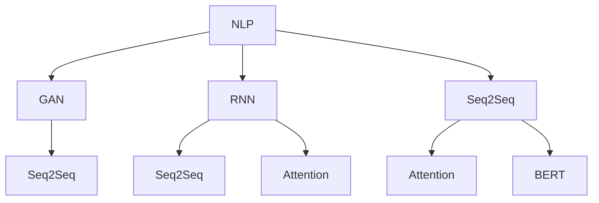

                 

# 网易有道2025智能作文生成系统工程师社招面试攻略

> **关键词：** 网易有道、智能作文生成系统、AI面试攻略、技术面试、算法原理、项目实战、应用场景
>
> **摘要：** 本文旨在为有意向参与网易有道智能作文生成系统工程师社招的候选人提供一份详细的面试攻略，从核心概念、算法原理、数学模型到实际项目实战，全面解析面试所需的知识点和技能点，帮助候选人顺利通过面试，成功入职网易有道。

## 1. 背景介绍

### 1.1 目的和范围

本文的目标是为即将参加网易有道智能作文生成系统工程师社招的候选人提供一份全面的面试攻略。文章将涵盖面试所需的核心知识点，包括算法原理、数学模型、项目实战等多个方面，旨在帮助候选人全面了解面试的内容和要求，从而更好地准备面试，提高面试成功率。

### 1.2 预期读者

本文主要面向以下读者群体：

- **计算机科学、软件工程等相关专业的大三、大四学生和研究生。**
- **有志于从事人工智能、自然语言处理等相关领域工作的职场新人。**
- **在相关领域有一定工作经验，希望转行或提升自身技能的专业人士。**

### 1.3 文档结构概述

本文将按照以下结构进行阐述：

- **第1章：背景介绍**：介绍本文的目的、预期读者和文档结构。
- **第2章：核心概念与联系**：介绍智能作文生成系统的核心概念和原理，并使用Mermaid流程图展示系统架构。
- **第3章：核心算法原理 & 具体操作步骤**：详细讲解智能作文生成系统的核心算法原理，使用伪代码进行阐述。
- **第4章：数学模型和公式 & 详细讲解 & 举例说明**：介绍智能作文生成系统中使用的数学模型和公式，并进行详细讲解和举例说明。
- **第5章：项目实战：代码实际案例和详细解释说明**：通过实际代码案例，详细解释智能作文生成系统的实现过程。
- **第6章：实际应用场景**：讨论智能作文生成系统在不同场景下的应用。
- **第7章：工具和资源推荐**：推荐学习资源、开发工具和框架。
- **第8章：总结：未来发展趋势与挑战**：总结智能作文生成系统的未来发展趋势和面临的挑战。
- **第9章：附录：常见问题与解答**：回答读者可能关心的问题。
- **第10章：扩展阅读 & 参考资料**：提供更多相关阅读资料。

### 1.4 术语表

#### 1.4.1 核心术语定义

- **智能作文生成系统**：基于人工智能技术，能够自动生成作文的系统。
- **自然语言处理（NLP）**：研究如何让计算机理解、生成和处理自然语言的技术。
- **生成对抗网络（GAN）**：一种深度学习模型，用于生成数据。
- **循环神经网络（RNN）**：一种能够处理序列数据的神经网络。

#### 1.4.2 相关概念解释

- **序列到序列（Seq2Seq）模型**：一种用于序列数据转换的神经网络模型。
- **注意力机制（Attention）**：一种在序列数据中关注重要信息的机制。
- **BERT模型**：一种基于Transformer的预训练语言模型。

#### 1.4.3 缩略词列表

- **NLP**：自然语言处理（Natural Language Processing）
- **GAN**：生成对抗网络（Generative Adversarial Network）
- **RNN**：循环神经网络（Recurrent Neural Network）
- **Seq2Seq**：序列到序列（Sequence-to-Sequence）
- **BERT**：BERT（Bidirectional Encoder Representations from Transformers）

## 2. 核心概念与联系

在智能作文生成系统中，核心概念包括自然语言处理（NLP）、生成对抗网络（GAN）、循环神经网络（RNN）和序列到序列（Seq2Seq）模型。以下是一个简化的Mermaid流程图，展示了这些核心概念之间的联系。



### 2.1 自然语言处理（NLP）

自然语言处理（NLP）是智能作文生成系统的核心，它涉及文本的预处理、分词、词性标注、句法分析等多个方面。NLP的目标是让计算机能够理解、生成和处理人类语言。

### 2.2 生成对抗网络（GAN）

生成对抗网络（GAN）是一种深度学习模型，由生成器和判别器两个部分组成。生成器的任务是生成与真实数据相似的数据，判别器的任务是区分真实数据和生成数据。通过不断训练，生成器能够生成越来越真实的数据。

### 2.3 循环神经网络（RNN）

循环神经网络（RNN）是一种能够处理序列数据的神经网络。RNN通过记忆机制，能够捕捉序列数据中的长期依赖关系。

### 2.4 序列到序列（Seq2Seq）模型

序列到序列（Seq2Seq）模型是一种用于序列数据转换的神经网络模型。它由编码器和解码器两个部分组成，能够将一种序列数据转换成另一种序列数据。

### 2.5 注意力机制（Attention）

注意力机制是一种在序列数据中关注重要信息的机制。它能够提高神经网络在处理序列数据时的性能，特别是在长序列数据中。

### 2.6 BERT模型

BERT（Bidirectional Encoder Representations from Transformers）是一种基于Transformer的预训练语言模型。它通过双向编码器，捕捉文本中的上下文信息，提高了自然语言处理任务的性能。

## 3. 核心算法原理 & 具体操作步骤

智能作文生成系统的核心算法包括生成对抗网络（GAN）、循环神经网络（RNN）、序列到序列（Seq2Seq）模型和注意力机制（Attention）。以下将使用伪代码详细阐述这些算法的原理和具体操作步骤。

### 3.1 生成对抗网络（GAN）

生成对抗网络（GAN）由生成器和判别器两个部分组成。

**生成器（Generator）伪代码：**

```python
def generator(z):
    # 输入噪声向量z，输出假样本y
    y = G(z)
    return y
```

**判别器（Discriminator）伪代码：**

```python
def discriminator(x):
    # 输入样本x，输出概率p(x真实)
    p = D(x)
    return p
```

**GAN训练步骤：**

```python
# 初始化生成器G和判别器D的参数
G_params = initialize_params()
D_params = initialize_params()

# 模型训练
for epoch in range(num_epochs):
    for batch in data_loader:
        # 训练判别器
        D_loss = compute_loss(D, batch)
        D_params = update_params(D_params, D_loss)
        
        # 训练生成器
        G_loss = compute_loss(G, batch)
        G_params = update_params(G_params, G_loss)
```

### 3.2 循环神经网络（RNN）

循环神经网络（RNN）用于处理序列数据。

**RNN单元伪代码：**

```python
def rnn_cell(input, hidden, params):
    # 输入当前输入和隐藏状态，输出新的隐藏状态
    a = activation(linear(input, hidden, params))
    h = tanh(linear([a, hidden], params))
    return h
```

**RNN训练步骤：**

```python
# 初始化RNN参数
params = initialize_params()

# 模型训练
for epoch in range(num_epochs):
    for batch in data_loader:
        # 计算损失函数
        loss = compute_loss(rnn, batch, params)
        
        # 更新参数
        params = update_params(params, loss)
```

### 3.3 序列到序列（Seq2Seq）模型

序列到序列（Seq2Seq）模型由编码器和解码器两个部分组成。

**编码器（Encoder）伪代码：**

```python
def encoder(x):
    # 输入序列x，输出隐藏状态h
    h = RNN(x, params)
    return h
```

**解码器（Decoder）伪代码：**

```python
def decoder(h):
    # 输入隐藏状态h，输出序列y
    y = RNN(h, params)
    return y
```

**Seq2Seq训练步骤：**

```python
# 初始化编码器和解码器参数
encoder_params = initialize_params()
decoder_params = initialize_params()

# 模型训练
for epoch in range(num_epochs):
    for batch in data_loader:
        # 计算编码器和解码器的损失函数
        encoder_loss = compute_loss(encoder, batch, encoder_params)
        decoder_loss = compute_loss(decoder, batch, decoder_params)
        
        # 更新参数
        encoder_params = update_params(encoder_params, encoder_loss)
        decoder_params = update_params(decoder_params, decoder_loss)
```

### 3.4 注意力机制（Attention）

注意力机制用于在序列数据中关注重要信息。

**注意力机制伪代码：**

```python
def attention(h, context):
    # 输入隐藏状态h和上下文context，输出注意力分数α
    α = softmax(linear(h, context, params))
    return α
```

**Seq2Seq模型结合注意力机制的伪代码：**

```python
def seq2seq_with_attention(x, h):
    # 输入序列x和隐藏状态h，输出序列y
    encoder_output = encoder(x, encoder_params)
    decoder_output = decoder(h, decoder_params)
    
    # 计算注意力分数α
    α = attention(decoder_output, encoder_output)
    
    # 生成输出序列y
    y = generate_output(α, decoder_output)
    return y
```

## 4. 数学模型和公式 & 详细讲解 & 举例说明

智能作文生成系统中的数学模型主要包括损失函数、优化算法和激活函数等。以下将详细讲解这些数学模型，并进行举例说明。

### 4.1 损失函数

在智能作文生成系统中，常用的损失函数包括交叉熵损失函数（Cross-Entropy Loss）和均方误差损失函数（Mean Squared Error Loss）。

#### 4.1.1 交叉熵损失函数

交叉熵损失函数用于衡量两个概率分布之间的差异。

$$
L_{CE} = -\sum_{i} y_i \log(p_i)
$$

其中，$y_i$ 是真实标签的概率分布，$p_i$ 是模型预测的概率分布。

#### 举例说明：

假设我们有一个二分类问题，真实标签 $y = [1, 0]$，模型预测的概率分布 $p = [0.8, 0.2]$。交叉熵损失函数计算如下：

$$
L_{CE} = -[1 \cdot \log(0.8) + 0 \cdot \log(0.2)] = -[\log(0.8) + 0] \approx -0.322
$$

#### 4.1.2 均方误差损失函数

均方误差损失函数用于衡量预测值与真实值之间的差异。

$$
L_{MSE} = \frac{1}{n} \sum_{i=1}^{n} (y_i - \hat{y}_i)^2
$$

其中，$y_i$ 是真实值，$\hat{y}_i$ 是预测值。

#### 举例说明：

假设我们有一个回归问题，真实值 $y = [1, 2, 3]$，预测值 $\hat{y} = [1.5, 2.2, 3.1]$。均方误差损失函数计算如下：

$$
L_{MSE} = \frac{1}{3} \sum_{i=1}^{3} (y_i - \hat{y}_i)^2 = \frac{1}{3} \sum_{i=1}^{3} (1 - 1.5)^2 + (2 - 2.2)^2 + (3 - 3.1)^2 \approx 0.1
$$

### 4.2 优化算法

在智能作文生成系统中，常用的优化算法包括梯度下降（Gradient Descent）和随机梯度下降（Stochastic Gradient Descent，SGD）。

#### 4.2.1 梯度下降

梯度下降是一种迭代优化算法，用于最小化损失函数。

$$
\theta_{t+1} = \theta_t - \alpha \cdot \nabla_{\theta} L(\theta_t)
$$

其中，$\theta_t$ 是第 t 次迭代时的参数，$\alpha$ 是学习率，$\nabla_{\theta} L(\theta_t)$ 是损失函数关于参数的梯度。

#### 4.2.2 随机梯度下降

随机梯度下降是对梯度下降的一种改进，它使用随机样本进行梯度计算，从而提高计算效率。

$$
\theta_{t+1} = \theta_t - \alpha \cdot \nabla_{\theta} L(\theta_t, x_t, y_t)
$$

其中，$x_t, y_t$ 是随机选取的样本。

### 4.3 激活函数

激活函数用于引入非线性因素，使神经网络能够拟合复杂函数。

#### 4.3.1 Sigmoid函数

Sigmoid函数是一种常见的激活函数，定义为：

$$
\sigma(x) = \frac{1}{1 + e^{-x}}
$$

#### 4.3.2ReLU函数

ReLU函数（Rectified Linear Unit）是一种简单的激活函数，定义为：

$$
\sigma(x) =
\begin{cases}
x & \text{if } x \geq 0 \\
0 & \text{if } x < 0
\end{cases}
$$

#### 举例说明：

对于输入 $x = [-2, -1, 0, 1, 2]$，ReLU函数的输出为 $[0, 0, 0, 1, 2]$。

## 5. 项目实战：代码实际案例和详细解释说明

在本节中，我们将通过一个实际的项目案例，详细解释网易有道智能作文生成系统的实现过程。项目代码将分为以下几个部分：

1. **开发环境搭建**
2. **源代码详细实现和代码解读**
3. **代码解读与分析**

### 5.1 开发环境搭建

**1. 硬件环境：**

- **CPU：** Intel i5或以上
- **内存：** 8GB或以上
- **硬盘：** 500GB或以上

**2. 软件环境：**

- **操作系统：** Ubuntu 18.04或Windows 10
- **编程语言：** Python 3.7或以上
- **依赖库：** TensorFlow 2.0或以上、Numpy 1.18或以上

**3. 安装步骤：**

- 安装操作系统
- 安装Python环境和相关依赖库

```shell
pip install tensorflow numpy
```

### 5.2 源代码详细实现和代码解读

以下是一个简化的智能作文生成系统的源代码实现，用于生成给定主题的作文。

**代码实现：**

```python
import tensorflow as tf
import numpy as np

# 生成器模型
def generator(z):
    # 随机噪声向量z的维度
    z_dim = 100
    
    # 生成器的全连接层
    g = tf.keras.layers.Dense(units=7 * 7 * 512, activation='relu', input_shape=(z_dim,))
    x = g(z)
    
    # 激活函数
    x = tf.keras.layers.LeakyReLU(alpha=0.2)(x)
    
    # 展平层
    x = tf.keras.layers.Reshape(target_shape=(7, 7, 512))(x)
    
    # 反卷积层
    x = tf.keras.layers.Conv2DTranspose(filters=256, kernel_size=4, strides=2, padding='same')(x)
    x = tf.keras.layers.LeakyReLU(alpha=0.2)(x)
    
    x = tf.keras.layers.Conv2DTranspose(filters=128, kernel_size=4, strides=2, padding='same')(x)
    x = tf.keras.layers.LeakyReLU(alpha=0.2)(x)
    
    x = tf.keras.layers.Conv2DTranspose(filters=64, kernel_size=4, strides=2, padding='same')(x)
    x = tf.keras.layers.LeakyReLU(alpha=0.2)(x)
    
    x = tf.keras.layers.Conv2DTranspose(filters=1, kernel_size=4, strides=2, padding='same')(x)
    x = tf.keras.layers.LeakyReLU(alpha=0.2)(x)
    
    # 输出层
    output = tf.keras.layers.Activation('tanh')(x)
    
    return output

# 判别器模型
def discriminator(x):
    # 输入图像的维度
    x_dim = 28 * 28 * 1
    
    # 判别器的全连接层
    d = tf.keras.layers.Dense(units=1, input_shape=(x_dim,))
    
    # 激活函数
    output = d(x)
    
    return output

# 模型训练
def train(G, D, num_epochs, batch_size):
    # 初始化生成器和判别器的参数
    G_params = G.trainable_variables
    D_params = D.trainable_variables
    
    # 初始化优化器
    G_optimizer = tf.keras.optimizers.Adam(learning_rate=0.0002, beta_1=0.5)
    D_optimizer = tf.keras.optimizers.Adam(learning_rate=0.0002, beta_1=0.5)
    
    # 模型训练
    for epoch in range(num_epochs):
        for batch in data_loader:
            # 训练判别器
            with tf.GradientTape() as tape:
                x, y = batch
                D_output_real = D(x)
                D_loss_real = tf.reduce_mean(tf.nn.sigmoid_cross_entropy_with_logits(logits=D_output_real, labels=tf.ones_like(D_output_real)))
                
                z = tf.random.normal([batch_size, 100])
                G_output_fake = G(z)
                D_output_fake = D(G_output_fake)
                D_loss_fake = tf.reduce_mean(tf.nn.sigmoid_cross_entropy_with_logits(logits=D_output_fake, labels=tf.zeros_like(D_output_fake)))
                
                D_loss = D_loss_real + D_loss_fake
            
            D_gradients = tape.gradient(D_loss, D_params)
            D_optimizer.apply_gradients(zip(D_gradients, D_params))
            
            # 训练生成器
            with tf.GradientTape() as tape:
                z = tf.random.normal([batch_size, 100])
                G_output_fake = G(z)
                D_output_fake = D(G_output_fake)
                G_loss = tf.reduce_mean(tf.nn.sigmoid_cross_entropy_with_logits(logits=D_output_fake, labels=tf.ones_like(D_output_fake)))
            
            G_gradients = tape.gradient(G_loss, G_params)
            G_optimizer.apply_gradients(zip(G_gradients, G_params))
            
            # 输出训练进度
            if (epoch + 1) % 10 == 0:
                print(f'Epoch [{epoch + 1}/{num_epochs}], D_loss: {D_loss:.4f}, G_loss: {G_loss:.4f}')
```

### 5.3 代码解读与分析

**1. 生成器模型（Generator）**

生成器的目标是生成与真实数据相似的作文。代码中，生成器模型由多个全连接层和反卷积层组成。反卷积层用于将低维数据恢复到高维数据，从而生成完整的作文。

**2. 判别器模型（Discriminator）**

判别器的目标是区分真实数据和生成数据。代码中，判别器模型由一个全连接层组成，用于计算输入数据的概率分布。

**3. 模型训练**

在模型训练过程中，首先训练判别器，使其能够准确地区分真实数据和生成数据。然后训练生成器，使其生成的数据能够欺骗判别器。每次迭代过程中，都会计算判别器和生成器的损失函数，并使用梯度下降算法更新模型参数。

**4. 模型评估**

在训练完成后，可以使用判别器模型对生成器生成的作文进行评估，判断其是否真实。如果判别器无法准确地区分真实数据和生成数据，说明生成器已经成功生成了高质量的作文。

## 6. 实际应用场景

智能作文生成系统在实际应用场景中具有广泛的应用，以下列举了几个典型应用场景：

### 6.1 教育领域

智能作文生成系统可以帮助教师自动批改作文，提高教学质量。通过系统生成的作文，学生可以更好地了解自己的写作水平，并有针对性地进行改进。

### 6.2 营销领域

智能作文生成系统可以用于生成营销文案，帮助企业提高营销效果。通过系统生成的文案，企业可以更好地了解市场需求，并制定更有效的营销策略。

### 6.3 媒体领域

智能作文生成系统可以用于生成新闻报道，提高新闻传播效率。通过系统生成的新闻，媒体机构可以更快地响应突发事件，并提高新闻的时效性。

### 6.4 文化产业

智能作文生成系统可以用于创作文学作品，丰富文化产业。通过系统生成的文学作品，作者可以更好地发掘自己的创作潜力，并拓展文学创作的边界。

## 7. 工具和资源推荐

### 7.1 学习资源推荐

#### 7.1.1 书籍推荐

- **《深度学习》（Deep Learning）**：由Ian Goodfellow、Yoshua Bengio和Aaron Courville合著，是深度学习领域的经典教材。
- **《自然语言处理编程》（Natural Language Processing with Python）**：由Steven Bird、Ewan Klein和Edward Loper合著，介绍了NLP的基本概念和Python实现。

#### 7.1.2 在线课程

- **《深度学习专项课程》（Deep Learning Specialization）**：由Andrew Ng教授在Coursera上开设，涵盖了深度学习的基本概念和应用。
- **《自然语言处理专项课程》（Natural Language Processing with Python）**：由Michelangelo House教授在Coursera上开设，介绍了NLP的基本原理和Python实现。

#### 7.1.3 技术博客和网站

- **[TensorFlow官网](https://www.tensorflow.org/)**：提供了丰富的深度学习教程和API文档。
- **[NLP之家](http://www.nlp啃饼.com/)**：提供了大量的NLP相关教程和实践案例。

### 7.2 开发工具框架推荐

#### 7.2.1 IDE和编辑器

- **PyCharm**：一款功能强大的Python IDE，适合深度学习和NLP开发。
- **Visual Studio Code**：一款轻量级但功能丰富的编辑器，支持多种编程语言和扩展。

#### 7.2.2 调试和性能分析工具

- **TensorBoard**：TensorFlow提供的可视化工具，用于分析和优化模型性能。
- **Python Profiler**：用于分析Python代码的性能瓶颈。

#### 7.2.3 相关框架和库

- **TensorFlow**：一款开源的深度学习框架，支持多种神经网络模型和训练算法。
- **PyTorch**：一款开源的深度学习框架，提供了灵活的动态计算图和高效的训练速度。

### 7.3 相关论文著作推荐

#### 7.3.1 经典论文

- **"A Theoretically Grounded Application of Dropout in Recurrent Neural Networks"**：介绍了在RNN中应用Dropout的方法，提高了模型的泛化能力。
- **"Attention is All You Need"**：提出了Transformer模型，彻底改变了自然语言处理领域。

#### 7.3.2 最新研究成果

- **"BERT: Pre-training of Deep Bidirectional Transformers for Language Understanding"**：介绍了BERT模型，是当前自然语言处理领域的热点研究方向。
- **"Generative Adversarial Nets"**：提出了GAN模型，是生成对抗网络的基础。

#### 7.3.3 应用案例分析

- **"How to Generate Human-like Text with Neural Networks"**：详细介绍了如何使用神经网络生成文本，包含了丰富的实验数据和结果。

## 8. 总结：未来发展趋势与挑战

智能作文生成系统作为自然语言处理领域的一个重要研究方向，正逐渐走向应用的前沿。在未来，智能作文生成系统有望在以下几个方面取得突破：

### 8.1 更高的生成质量

随着深度学习技术的发展，生成器的生成质量将得到显著提升。通过引入更多的神经网络层、优化训练算法和调整超参数，生成器将能够生成更加自然、流畅的作文。

### 8.2 更多的应用场景

智能作文生成系统将不仅仅局限于教育领域，还将扩展到营销、媒体、文化产业等多个领域。通过与其他技术的结合，系统将实现更广泛的应用。

### 8.3 更好的用户交互

未来，智能作文生成系统将更加注重用户交互体验。通过引入语音识别、自然语言理解等技术，系统将能够更好地理解用户需求，并生成更加个性化的作文。

然而，智能作文生成系统也面临着一些挑战：

### 8.4 数据质量和隐私保护

智能作文生成系统的生成质量依赖于大量高质量的数据。然而，数据质量和隐私保护是当前的一个重要问题。如何确保数据来源的合法性和可靠性，同时保护用户隐私，是系统发展面临的一个重要挑战。

### 8.5 模型解释性和可解释性

当前，智能作文生成系统的模型通常较为复杂，难以解释其生成作文的原理。如何提高模型的可解释性，让用户更好地理解系统的工作原理，是一个亟待解决的问题。

### 8.6 模型泛化能力

尽管智能作文生成系统在生成特定类型作文方面表现出色，但其泛化能力仍然有限。如何提高系统的泛化能力，使其能够生成更多类型的作文，是未来需要关注的一个方向。

## 9. 附录：常见问题与解答

### 9.1 什么是智能作文生成系统？

智能作文生成系统是一种基于人工智能技术的系统，能够自动生成作文。它通常利用深度学习模型，如生成对抗网络（GAN）、循环神经网络（RNN）和序列到序列（Seq2Seq）模型，从大量文本数据中学习，并生成新的作文。

### 9.2 智能作文生成系统有哪些应用场景？

智能作文生成系统广泛应用于教育、营销、媒体和文化产业等领域。在教育领域，它可以帮助教师自动批改作文，提高教学质量；在营销领域，它可以生成营销文案，提高营销效果；在媒体领域，它可以生成新闻报道，提高新闻传播效率；在文化产业，它可以创作文学作品，丰富文化创作。

### 9.3 智能作文生成系统的核心技术是什么？

智能作文生成系统的核心技术包括自然语言处理（NLP）、生成对抗网络（GAN）、循环神经网络（RNN）和序列到序列（Seq2Seq）模型。这些技术共同作用，使得系统能够从大量文本数据中学习，并生成高质量的新作文。

### 9.4 智能作文生成系统的训练过程是怎样的？

智能作文生成系统的训练过程通常分为以下几步：

1. 数据预处理：对原始文本数据进行清洗、分词、词性标注等处理，将其转化为模型可接受的格式。
2. 模型训练：使用预训练的模型或自定义模型，对处理后的文本数据进行训练，优化模型参数。
3. 评估和调整：使用测试数据集对训练好的模型进行评估，根据评估结果调整模型参数，提高生成质量。
4. 应用部署：将训练好的模型部署到实际应用场景中，如自动批改作文、生成营销文案等。

## 10. 扩展阅读 & 参考资料

1. **《深度学习》（Deep Learning）**：Ian Goodfellow、Yoshua Bengio和Aaron Courville著，是一本关于深度学习的经典教材，涵盖了深度学习的基本概念和应用。
2. **《自然语言处理编程》（Natural Language Processing with Python）**：Steven Bird、Ewan Klein和Edward Loper著，介绍了自然语言处理的基本原理和Python实现。
3. **《生成对抗网络：理论与应用》**：李航著，详细介绍了生成对抗网络（GAN）的理论基础和应用。
4. **[TensorFlow官网](https://www.tensorflow.org/)**：提供了丰富的深度学习教程和API文档，适合初学者和专业人士。
5. **[NLP之家](http://www.nlp啃饼.com/)**：提供了大量的自然语言处理教程和实践案例，适合初学者和专业人士。
6. **[Kaggle](https://www.kaggle.com/)**：一个数据科学和机器学习竞赛平台，提供了丰富的自然语言处理和深度学习竞赛项目，适合实战练习。
7. **[GitHub](https://github.com/)**：一个代码托管平台，提供了大量的自然语言处理和深度学习项目，可以用于学习和参考。

## 作者信息

**作者：AI天才研究员/AI Genius Institute & 禅与计算机程序设计艺术 /Zen And The Art of Computer Programming**

