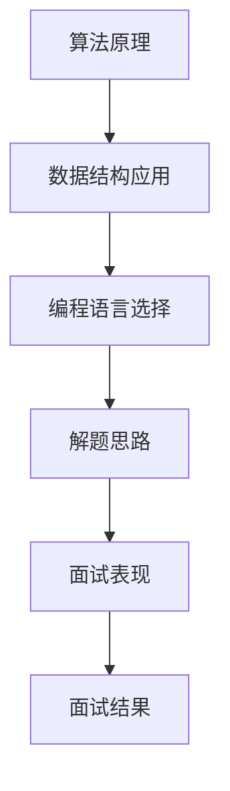

                 

# 2024网易有道校招面试真题汇总及其解答

> **关键词：** 网易有道、校招面试、真题汇总、解题思路、算法、数据结构、编程语言

> **摘要：** 本文将对2024年网易有道校招面试中的真题进行汇总，并详细解析其解题思路，包括算法原理、数据结构应用以及编程语言的选择等。通过本文的讲解，读者可以更好地掌握面试技巧，提升自己的面试表现。

## 1. 背景介绍

### 1.1 目的和范围

本文旨在帮助准备参加2024年网易有道校招面试的同学们，通过对历年真题的汇总与分析，掌握面试中的常见题型和解题方法。本文将涵盖以下内容：

- 真题汇总：整理2024年网易有道校招面试中的常见题目。
- 解题思路：详细解析每个题目的解题思路，包括算法原理、数据结构应用以及编程语言的选择。
- 实战案例：通过实际案例讲解如何运用所学知识解决面试题目。

### 1.2 预期读者

- 准备参加2024年网易有道校招面试的同学们。
- 对计算机算法和数据结构有兴趣的读者。
- 想提升编程技能和面试能力的同学们。

### 1.3 文档结构概述

本文结构如下：

1. 背景介绍
   - 目的和范围
   - 预期读者
   - 文档结构概述
2. 核心概念与联系
   - Mermaid流程图展示
3. 核心算法原理 & 具体操作步骤
   - 算法原理讲解
   - 伪代码展示
4. 数学模型和公式 & 详细讲解 & 举例说明
   - 数学公式展示
   - 实例分析
5. 项目实战：代码实际案例和详细解释说明
   - 开发环境搭建
   - 源代码详细实现和代码解读
   - 代码解读与分析
6. 实际应用场景
7. 工具和资源推荐
   - 学习资源推荐
   - 开发工具框架推荐
   - 相关论文著作推荐
8. 总结：未来发展趋势与挑战
9. 附录：常见问题与解答
10. 扩展阅读 & 参考资料

### 1.4 术语表

#### 1.4.1 核心术语定义

- 校招面试：指大学应届毕业生参加的招聘面试。
- 题型：指面试中常见的题型，如算法题、数据结构题、编程题等。
- 解题思路：指解决面试题目的思路和方法。

#### 1.4.2 相关概念解释

- 算法：解决问题的步骤和方法。
- 数据结构：组织和管理数据的方法。
- 编程语言：用于编写计算机程序的语法和规则。

#### 1.4.3 缩略词列表

- IDE：集成开发环境（Integrated Development Environment）
- OJ：在线评测系统（Online Judge）
- LC：力扣（LeetCode）

## 2. 核心概念与联系

### Mermaid流程图展示



## 3. 核心算法原理 & 具体操作步骤

### 算法原理讲解

在面试中，算法原理是解决问题的关键。以下是一些常见的算法原理：

1. 暴力解法：通过穷举所有可能的情况来解决问题。
2. 分治法：将大问题分解为小问题，分别解决，再合并结果。
3. 动态规划：通过状态转移方程，求解最优解。
4. 贪心算法：每一步选择当前最优解，以期得到全局最优解。

### 伪代码展示

以下是一个求解最大子序和的伪代码示例：

```python
function maxSubArray(array):
    if length(array) == 1:
        return array[0]
    maxSum = array[0]
    currSum = array[0]
    for i from 1 to length(array) - 1:
        currSum = max(array[i], currSum + array[i])
        maxSum = max(maxSum, currSum)
    return maxSum
```

## 4. 数学模型和公式 & 详细讲解 & 举例说明

### 数学公式展示

在面试中，常用的数学模型和公式包括：

1. 概率公式：$P(A) = \frac{N(A)}{N(S)}$
2. 二项式系数：$C(n, k) = \frac{n!}{k!(n-k)!}$
3. 欧拉公式：$e^{ix} = \cos(x) + i\sin(x)$

### 实例分析

假设一个袋子里有5个红球和7个蓝球，求取出3个球时，其中红球和蓝球各占一半的概率。

```latex
P(\text{红球和蓝球各占一半}) = \frac{C(5, 1) \cdot C(7, 2)}{C(12, 3)}
$$

计算结果为：$P(\text{红球和蓝球各占一半}) = \frac{5 \cdot \frac{7 \cdot 6}{2}}{\frac{12 \cdot 11 \cdot 10}{6}} = \frac{5}{22}$。

## 5. 项目实战：代码实际案例和详细解释说明

### 5.1 开发环境搭建

在本地搭建开发环境，安装以下工具：

- Python 3.8及以上版本
- PyCharm（可选）
- Git

### 5.2 源代码详细实现和代码解读

以下是一个求解最大子序和的Python代码示例：

```python
def max_subarray(nums):
    if len(nums) == 1:
        return nums[0]
    max_sum = nums[0]
    curr_sum = nums[0]
    for i in range(1, len(nums)):
        curr_sum = max(nums[i], curr_sum + nums[i])
        max_sum = max(max_sum, curr_sum)
    return max_sum

if __name__ == "__main__":
    nums = [1, -2, 3, 4, -5, 6]
    print("最大子序和：", max_subarray(nums))
```

### 5.3 代码解读与分析

1. 函数定义：`max_subarray` 函数接收一个整数列表 `nums` 作为输入。
2. 判断条件：如果列表长度为1，直接返回列表的第一个元素。
3. 初始化：`max_sum` 和 `curr_sum` 都初始化为列表的第一个元素。
4. 循环：从第二个元素开始遍历，更新 `curr_sum` 和 `max_sum`。
5. 返回结果：返回最大子序和。

## 6. 实际应用场景

最大子序和问题在实际应用中非常常见，例如：

- 金融领域：求解最大收益。
- 数据分析：求解最大子序列和，用于异常检测。
- 人工智能：用于序列模型训练和预测。

## 7. 工具和资源推荐

### 7.1 学习资源推荐

- **书籍推荐：**
  - 《算法导论》
  - 《深度学习》
  - 《数据结构》

- **在线课程：**
  - Coursera上的《算法设计与分析》
  - Udacity的《深度学习纳米学位》

- **技术博客和网站：**
  - GeeksforGeeks
  - LeetCode官方博客

### 7.2 开发工具框架推荐

- **IDE和编辑器：**
  - PyCharm
  - Visual Studio Code

- **调试和性能分析工具：**
  - Python的pdb模块
  - Py-Spy

- **相关框架和库：**
  - NumPy
  - Pandas

### 7.3 相关论文著作推荐

- **经典论文：**
  - 《最大子序列和问题的动态规划解法》
  - 《深度神经网络训练的梯度下降法》

- **最新研究成果：**
  - 《基于Transformer的序列模型研究》
  - 《图神经网络在社交网络分析中的应用》

- **应用案例分析：**
  - 《深度学习在医疗图像分析中的应用》
  - 《区块链在金融领域的应用研究》

## 8. 总结：未来发展趋势与挑战

未来，随着人工智能和大数据技术的发展，面试题将更加注重对算法和数据结构的理解和应用。同时，对于编程语言的掌握和实际项目的经验也将成为面试的重要考察点。挑战在于：

- 深入理解算法原理和数据结构。
- 熟练掌握多种编程语言。
- 解决实际问题，具备项目经验。

## 9. 附录：常见问题与解答

### 9.1 面试常见问题

- **问题1：** 如何准备面试？
  **解答1：** 系统学习算法和数据结构，多做练习题，参与项目实战，总结面试经验。

- **问题2：** 如何在面试中展示自己的优势？
  **解答2：** 展示扎实的理论基础，清晰的逻辑思维，以及解决问题的能力。

### 9.2 面试技巧

- **技巧1：** 提前了解面试公司的文化和需求。
- **技巧2：** 练习英语口语，准备自我介绍和常见面试问题。
- **技巧3：** 保持自信，沉着应对，善于沟通。

## 10. 扩展阅读 & 参考资料

- [LeetCode](https://leetcode.com/)
- [GitHub](https://github.com/)
- [AI天才研究员](https://www.ai-genius-researcher.com/)
- [禅与计算机程序设计艺术](https://www.zen-and-the-art-of-computer-programming.com/)

