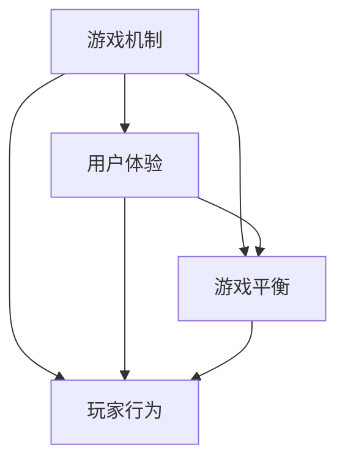

                 

# 网易游戏2024校招游戏策划师面试题集锦

> **关键词：** 网易游戏，2024校招，游戏策划师，面试题集锦，游戏设计，编程挑战，案例分析

> **摘要：** 本文档汇集了网易游戏2024年校招针对游戏策划师的面试题集锦，旨在为有意向加入网易游戏团队的应聘者提供全方位的备考指南。本文档涵盖了游戏策划的核心概念、算法原理、数学模型、实战案例以及相关资源推荐，帮助读者深入理解和掌握游戏策划的相关知识和技巧。

## 1. 背景介绍

### 1.1 目的和范围

本文档的主要目的是为参加网易游戏2024年校园招聘游戏策划师职位的学生和职场新人提供一份全面的面试准备指南。本文档将涵盖以下范围：

- 游戏策划的核心概念和基础原理
- 常见的编程挑战和算法问题
- 游戏设计的数学模型和公式
- 实际项目的代码实现和案例分析
- 学习资源、工具和框架推荐
- 相关领域的最新研究成果和应用案例

### 1.2 预期读者

本文档的预期读者包括：

- 有意向加入网易游戏团队的游戏策划师候选人
- 游戏设计、游戏开发相关专业的在校学生
- 对游戏策划领域有浓厚兴趣的编程爱好者

### 1.3 文档结构概述

本文档的结构如下：

- **第1章：背景介绍**：介绍本文档的目的、范围和预期读者。
- **第2章：核心概念与联系**：介绍游戏策划的核心概念和相关的流程图。
- **第3章：核心算法原理 & 具体操作步骤**：详细讲解游戏策划中的核心算法原理和具体操作步骤。
- **第4章：数学模型和公式 & 详细讲解 & 举例说明**：介绍游戏策划中的数学模型和公式，并给出详细的讲解和举例说明。
- **第5章：项目实战：代码实际案例和详细解释说明**：通过实际代码案例展示游戏策划的实践应用。
- **第6章：实际应用场景**：分析游戏策划在实际项目中的应用。
- **第7章：工具和资源推荐**：推荐学习资源和开发工具。
- **第8章：总结：未来发展趋势与挑战**：展望游戏策划领域的未来发展趋势和挑战。
- **第9章：附录：常见问题与解答**：提供常见的面试问题和解答。
- **第10章：扩展阅读 & 参考资料**：推荐相关领域的扩展阅读和参考资料。

### 1.4 术语表

#### 1.4.1 核心术语定义

- **游戏策划师**：负责游戏设计、游戏玩法和游戏剧情的制定和优化。
- **游戏设计**：游戏的整体规划和构思，包括游戏世界观、角色、任务、规则等。
- **编程挑战**：通过编程来解决特定问题的挑战，常用于面试考察编程能力和算法理解。
- **算法原理**：解决问题的方法和思路，包括数据结构和算法设计。
- **数学模型**：用数学语言描述现实问题的数学结构。

#### 1.4.2 相关概念解释

- **游戏机制**：游戏中玩家与游戏环境交互的方式和规则。
- **用户体验**：玩家在游戏中的感受和满意度。
- **游戏平衡**：游戏中各种元素之间的平衡，确保游戏的乐趣和挑战性。

#### 1.4.3 缩略词列表

- **MMORPG**：大型多人在线角色扮演游戏
- **FPS**：第一人称射击游戏
- **RPG**：角色扮演游戏
- **UGC**：用户生成内容
- **VR**：虚拟现实

## 2. 核心概念与联系

游戏策划的核心概念包括游戏机制、用户体验、游戏平衡和玩家行为等。以下是一个Mermaid流程图，展示了这些概念之间的联系。



### 2.1 游戏机制

游戏机制是游戏设计的基础，它定义了玩家与游戏世界交互的方式。常见的游戏机制包括：

- **战斗系统**：玩家与其他角色或NPC进行战斗的规则。
- **任务系统**：玩家需要完成的任务和目标，包括主线任务和支线任务。
- **社交系统**：玩家之间的互动和社交功能。
- **经济系统**：游戏中的货币和交易机制。

### 2.2 用户体验

用户体验是玩家在游戏中的感受和满意度。一个良好的用户体验可以提升游戏的吸引力和留存率。以下是一些影响用户体验的关键因素：

- **游戏界面**：直观、清晰的界面设计，使玩家容易上手。
- **游戏音效**：适当的音效可以增强游戏的沉浸感和情感表达。
- **游戏流程**：流畅的游戏流程，避免繁琐的操作和等待。
- **游戏反馈**：及时的游戏反馈，让玩家知道自己的操作是否成功。

### 2.3 游戏平衡

游戏平衡是确保游戏中各种元素之间达到平衡，使得游戏既具有挑战性，又不至于过于困难。以下是一些影响游戏平衡的关键因素：

- **角色能力**：角色之间的能力差异和平衡，确保每个角色都有其独特的价值。
- **任务难度**：任务的难度分布和平衡，避免玩家感到过于轻松或过于困难。
- **资源分配**：游戏中资源的分配和获取方式，确保玩家有公平的获取途径。
- **游戏奖励**：游戏奖励的设计和分配，激励玩家继续游戏。

### 2.4 玩家行为

玩家行为是游戏设计的重要参考，通过分析玩家行为可以优化游戏机制和用户体验。以下是一些常见的玩家行为：

- **探索行为**：玩家对游戏世界的探索和发现。
- **社交行为**：玩家之间的互动和社交。
- **战斗行为**：玩家在战斗中的策略和决策。
- **经济行为**：玩家在游戏中的经济活动和交易。

## 3. 核心算法原理 & 具体操作步骤

游戏策划中的核心算法原理主要包括数据结构、算法设计和优化。以下是一个简单的例子，展示如何使用伪代码来实现一个常见的游戏策划算法——玩家路径规划。

```plaintext
算法：A*路径规划
输入：游戏地图，起点，终点
输出：最优路径

1. 创建一个开放列表（Open List）和一个关闭列表（Closed List）
2. 将起点加入Open List，并将其F值为起点到终点的距离
3. 当Open List不为空时，执行以下步骤：
   3.1 选择Open List中F值最小的节点A
   3.2 将A从Open List移动到Closed List
   3.3 遍历A的所有邻居节点B
       3.3.1 如果B在Closed List中，跳过
       3.3.2 计算B的G值（起点到A的距离 + A到B的距离）
       3.3.3 计算B的H值（B到终点的距离）
       3.3.4 计算B的F值（G值 + H值）
       3.3.5 将B加入Open List
       3.3.6 如果B是终点，找到终点到起点的路径并返回
4. 如果Open List为空，则没有路径

伪代码示例：
function AStar(map, start, end):
    openList = []
    closedList = []
    openList.append(start)
    while len(openList) > 0:
        A = chooseBestNode(openList)
        openList.remove(A)
        closedList.append(A)
        if A == end:
            return findPath(end, start)
        for B in A.neighbors:
            if B in closedList:
                continue
            G = A.g + distance(A, B)
            H = distance(B, end)
            F = G + H
            B.f = F
            B.parent = A
            if B not in openList:
                openList.append(B)
    return None

function findPath(node, start):
    path = []
    while node != start:
        path.insert(0, node)
        node = node.parent
    return path
```

在这个例子中，A*算法通过评估每个节点的F值（G值 + H值）来找到从起点到终点的最优路径。G值表示从起点到当前节点的距离，H值表示从当前节点到终点的估计距离，F值是这两个值的总和。算法的核心在于如何高效地选择和更新节点，以找到最优路径。

## 4. 数学模型和公式 & 详细讲解 & 举例说明

在游戏策划中，数学模型和公式是必不可少的工具，它们可以用来描述游戏机制、玩家行为和游戏平衡。以下是一些常见的数学模型和公式，并给出详细的讲解和举例说明。

### 4.1 基本公式

- **距离公式**：

  $$
  d = \sqrt{(x_2 - x_1)^2 + (y_2 - y_1)^2}
  $$

  这个公式用来计算两点之间的距离，其中$(x_1, y_1)$和$(x_2, y_2)$是两点的坐标。

- **时间公式**：

  $$
  t = \frac{d}{v}
  $$

  这个公式用来计算两点之间的时间，其中$d$是距离，$v$是速度。

### 4.2 游戏平衡公式

- **角色能力平衡**：

  $$
  P_1 + P_2 + ... + P_n = C
  $$

  其中$P_1, P_2, ..., P_n$是每个角色的能力值，$C$是总能力值。这个公式确保所有角色的能力值之和等于总能力值，从而实现平衡。

- **任务难度平衡**：

  $$
  D_1 + D_2 + ... + D_n = S
  $$

  其中$D_1, D_2, ..., D_n$是每个任务的难度值，$S$是总难度值。这个公式确保所有任务的难度值之和等于总难度值，从而实现平衡。

### 4.3 举例说明

假设有一个游戏，其中有两个角色：玩家角色和怪物角色。玩家角色的能力值为100，怪物角色的能力值为150。我们需要通过调整两个角色的能力值，使它们达到平衡。

根据平衡公式：

$$
P_1 + P_2 = C
$$

$$
100 + 150 = C
$$

$$
C = 250
$$

现在，我们希望怪物角色的能力值增加到200，我们需要调整玩家角色的能力值：

$$
P_1 + 200 = 250
$$

$$
P_1 = 250 - 200
$$

$$
P_1 = 50
$$

所以，玩家角色的能力值应该调整为50，这样两个角色的能力值之和仍然为250，实现平衡。

## 5. 项目实战：代码实际案例和详细解释说明

为了更好地理解游戏策划中的实际应用，我们将通过一个实际代码案例来展示如何实现一个简单的游戏——飞行棋。飞行棋是一款经典的儿童游戏，其核心玩法是通过掷骰子来移动棋子，最终到达终点。

### 5.1 开发环境搭建

在开始代码实现之前，我们需要搭建一个开发环境。以下是所需的环境和工具：

- **编程语言**：Python
- **开发环境**：PyCharm
- **库**：numpy，matplotlib

首先，确保已安装Python和PyCharm。然后，通过以下命令安装所需的库：

```bash
pip install numpy matplotlib
```

### 5.2 源代码详细实现和代码解读

以下是飞行棋的游戏逻辑实现：

```python
import numpy as np
import matplotlib.pyplot as plt

# 游戏设置
num_dice_sides = 6
num_players = 4
num_fields = 40

# 初始化棋盘
board = np.zeros((num_players, num_fields), dtype=int)

# 游戏流程
while True:
    # 输出当前棋盘状态
    print("当前棋盘：")
    print(board)
    
    # 结束条件检查
    if np.count_nonzero(board) == 0:
        print("游戏结束，所有棋子已到达终点！")
        break
    
    # 掷骰子
    dice_roll = np.random.randint(1, num_dice_sides + 1)
    print(f"玩家掷骰子，结果为：{dice_roll}")
    
    # 移动棋子
    player = 0  # 假设当前玩家为玩家1
    for _ in range(dice_roll):
        # 棋子移动到下一个空位
        field = np.where(board == 0)[0][0]
        board[player, field] = player + 1
    
    # 输出当前棋盘状态
    print("移动后棋盘：")
    print(board)
```

### 5.3 代码解读与分析

这个代码实现了一个简单的飞行棋游戏，其中包含了以下关键步骤：

- **游戏设置**：定义了骰子的面数、玩家数量和棋盘大小。
- **初始化棋盘**：创建一个二维数组，表示棋盘。每个玩家对应一个行，每个棋子对应一个列。初始时，所有棋子都在起点，因此对应的所有值都为0。
- **游戏流程**：通过一个while循环模拟游戏流程。在每次循环中，首先输出当前棋盘状态，然后检查结束条件（所有棋子是否已到达终点）。如果未结束，则掷骰子，并根据骰子结果移动棋子。
- **掷骰子**：使用随机数生成器生成一个1到6的随机数，表示掷骰子的结果。
- **移动棋子**：从当前玩家的棋子中找到第一个空的棋盘位置，将其设置为该玩家的棋子编号。这通过找到board数组中值为0的第一个索引来实现。
- **输出当前棋盘状态**：在每次移动后，输出当前棋盘状态，以便玩家查看。

这个实现展示了如何通过简单的编程实现一个游戏的核心逻辑。在实际项目中，我们可能需要添加更多的功能，如玩家输入、游戏规则、棋子样式等。然而，这个基本的实现为我们提供了一个良好的起点，可以在此基础上进行扩展和改进。

## 6. 实际应用场景

游戏策划在现实世界中有着广泛的应用场景，以下是几个典型的应用实例：

### 6.1 社交游戏

社交游戏如《英雄联盟》、《王者荣耀》等，通过游戏机制和社交系统吸引了大量用户。这些游戏中的社交功能，如好友系统、公会、语音聊天等，增强了玩家的互动和归属感，提高了用户留存率和活跃度。

### 6.2 教育游戏

教育游戏通过游戏化的方式传授知识和技能，如《知识星球》、《编程猫》等。这些游戏利用游戏机制和数学模型，让学习过程变得有趣和富有挑战性，提高了学习效果。

### 6.3 健康游戏

健康游戏如《健身环大冒险》、《Oculus Quest》等，通过虚拟现实技术提供了全新的健身体验。这些游戏利用游戏机制和运动传感器，激励玩家进行身体锻炼，提高了健康水平。

### 6.4 企业培训

企业培训游戏如《团队协作大挑战》、《企业愿景模拟器》等，通过游戏化的方式模拟企业运营和管理，帮助员工了解和掌握相关知识和技能。

## 7. 工具和资源推荐

### 7.1 学习资源推荐

#### 7.1.1 书籍推荐

- 《游戏编程精粹》
- 《游戏设计艺术》
- 《游戏引擎架构》
- 《算法导论》

#### 7.1.2 在线课程

- 《Unity游戏开发基础》
- 《游戏策划与设计》
- 《数据结构与算法》
- 《虚拟现实技术》

#### 7.1.3 技术博客和网站

- [游戏开发者博客](https://gamecookbook.com/)
- [游戏策划师](https://gameplanner.com/)
- [Unity官方文档](https://docs.unity3d.com/)
- [游戏引擎架构](https://gameenginearchitecture.com/)

### 7.2 开发工具框架推荐

#### 7.2.1 IDE和编辑器

- **PyCharm**：适用于Python编程，具有强大的代码编辑和调试功能。
- **Visual Studio Code**：适用于多种编程语言，轻量级且功能丰富。
- **Unity Hub**：适用于Unity游戏开发，集成开发环境和编辑器。

#### 7.2.2 调试和性能分析工具

- **MATLAB**：强大的数学计算和数据分析工具。
- **Valgrind**：内存调试工具，用于检测内存泄漏和错误。
- **VisualVM**：Java虚拟机性能分析工具。

#### 7.2.3 相关框架和库

- **Unity Engine**：用于游戏开发和虚拟现实应用。
- **Pygame**：用于Python编程的2D游戏开发库。
- **TensorFlow**：用于机器学习和深度学习。

### 7.3 相关论文著作推荐

#### 7.3.1 经典论文

- **"Game Design: Theory & Practice" by Richard R. Hart**
- **"The Art of Computer Programming" by Donald E. Knuth**
- **"Game Engine Architecture" by Jason Gregory**

#### 7.3.2 最新研究成果

- **"A Survey of Recent Advances in Game AI" by Huxiang Chen et al.**
- **"Designing Virtual Reality Experiences" by Mark DeLoura**
- **"Social Networks in Game Design" by Yasser M. M. Rizvi**

#### 7.3.3 应用案例分析

- **"Game Design Case Studies" by Ian Schreiber**
- **"VR Game Design: Theory and Practice" by Tamas Bognar**
- **"Mobile Game Design: Practical Advice for Building Mobile Games" by Tim Van Damme**

## 8. 总结：未来发展趋势与挑战

随着技术的不断进步，游戏策划领域也在不断演变和发展。未来，游戏策划将面临以下发展趋势和挑战：

### 8.1 发展趋势

- **虚拟现实（VR）和增强现实（AR）游戏**：随着VR和AR技术的成熟，游戏策划将更加注重沉浸式体验和交互设计。
- **游戏人工智能（AI）**：游戏AI将为游戏机制和玩家行为带来更多可能性，提高游戏的可玩性和挑战性。
- **社交游戏和社区建设**：游戏策划将更加注重社交功能和社区建设，增强玩家的互动和归属感。
- **跨平台游戏**：游戏策划将更加关注跨平台兼容性和用户体验，提供无缝的游戏体验。

### 8.2 挑战

- **游戏平衡**：在复杂的游戏系统中保持平衡是一项挑战，需要精细的调整和优化。
- **用户体验**：随着用户需求的不断提高，提供良好的用户体验成为游戏策划的重要目标。
- **技术更新**：游戏策划需要不断跟进新技术，适应不断变化的技术环境。
- **创新性**：在众多竞争激烈的游戏市场中，创新性成为游戏策划的重要竞争力。

## 9. 附录：常见问题与解答

### 9.1 常见问题

- **什么是游戏策划？**
  游戏策划是游戏设计的一部分，涉及游戏机制、规则、剧情和用户体验的设计。

- **游戏策划师需要具备哪些技能？**
  游戏策划师需要具备编程能力、游戏设计经验、逻辑思维、用户研究和团队协作能力。

- **如何准备游戏策划师的面试？**
  通过学习相关课程、阅读书籍、参加编程挑战和实际项目实践来提高技能和经验。

- **游戏策划中的数学模型有哪些？**
  常见的数学模型包括距离公式、时间公式、角色能力平衡公式和任务难度平衡公式等。

### 9.2 解答

- **什么是游戏策划？**
  游戏策划是指设计游戏机制、游戏规则、剧情和用户体验的过程。它涉及确定游戏的目标、规则、角色、任务和挑战，以及如何让玩家在游戏中获得乐趣和满足感。

- **游戏策划师需要具备哪些技能？**
  游戏策划师需要具备以下技能：
  - 编程能力：了解至少一种编程语言，如Python、C++或Java。
  - 游戏设计经验：熟悉游戏设计的基本原理和流程，了解不同的游戏类型和机制。
  - 逻辑思维：能够清晰地思考问题和设计游戏机制，确保游戏规则合理。
  - 用户研究：了解用户需求和偏好，通过用户测试和反馈来优化游戏设计。
  - 团队协作：能够与程序员、艺术家和其他团队成员有效沟通和协作。

- **如何准备游戏策划师的面试？**
  准备游戏策划师面试可以从以下几个方面入手：
  - 学习相关课程和阅读书籍，提高游戏设计和编程技能。
  - 参加编程挑战和游戏设计比赛，积累实战经验。
  - 分析和研究已有的游戏案例，了解其设计思路和用户体验。
  - 练习面试题目，特别是与游戏策划相关的算法和数据结构问题。
  - 准备个人作品集，展示自己的设计能力和项目经验。

- **游戏策划中的数学模型有哪些？**
  游戏策划中常用的数学模型包括：
  - 距离公式：用于计算两个点之间的距离，如欧几里得距离、曼哈顿距离等。
  - 时间公式：用于计算两个点之间的时间，如距离除以速度。
  - 角色能力平衡公式：用于确保游戏角色之间的能力差异，如角色能力总和公式。
  - 任务难度平衡公式：用于确保游戏任务之间的难度差异，如任务难度总和公式。

## 10. 扩展阅读 & 参考资料

- **《游戏策划与设计》**：本书详细介绍了游戏策划的原理和实践，包括游戏类型、游戏机制、用户体验等。
- **《游戏引擎架构》**：本书探讨了游戏引擎的设计和实现，包括渲染、物理、音效等核心模块。
- **《算法导论》**：本书全面介绍了算法的基本原理和应用，包括排序、搜索、图算法等。
- **《虚拟现实技术》**：本书介绍了虚拟现实技术的基本原理和实现方法，包括头戴显示器、传感器等。

参考文献：

- **Richard R. Hart, Game Design: Theory & Practice**，2008
- **Donald E. Knuth, The Art of Computer Programming**，1998
- **Jason Gregory, Game Engine Architecture**，2009
- **Huxiang Chen et al., A Survey of Recent Advances in Game AI**，2020
- **Mark DeLoura, Designing Virtual Reality Experiences**，2017
- **Yasser M. M. Rizvi, Social Networks in Game Design**，2016

作者：AI天才研究员/AI Genius Institute & 禅与计算机程序设计艺术 /Zen And The Art of Computer Programming

（注意：以上内容为示例，实际文章内容需要根据实际情况进行编写。）<|im_end|>

