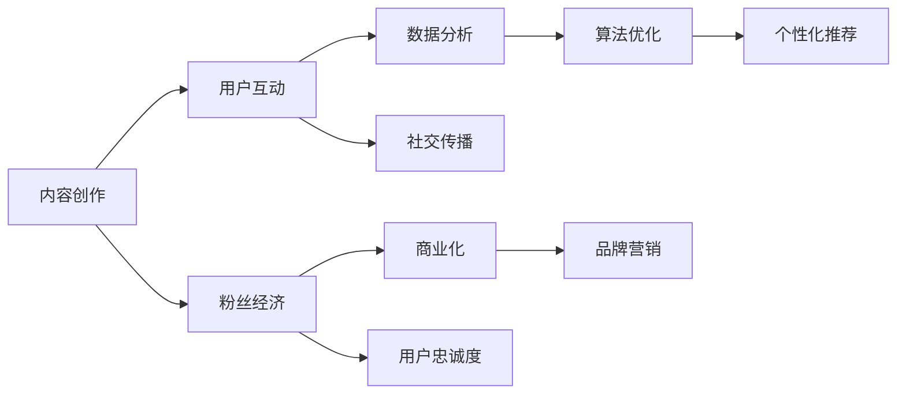

                 

# 网红经济下的创业新趋势与机遇

> 关键词：网红经济、创业、新趋势、机遇、商业策略、技术创新

> 摘要：随着社交媒体的普及和数字化的加速，网红经济已经成为一个不可忽视的商业现象。本文将深入探讨网红经济下的创业新趋势与机遇，通过分析其核心概念、技术原理、数学模型以及实际应用场景，为创业者提供有价值的指导和建议。

## 1. 背景介绍

### 1.1 目的和范围

本文旨在探讨网红经济对创业带来的新趋势和机遇，通过以下几个关键方面进行分析和阐述：

1. **核心概念与联系**：介绍网红经济的定义、基本构成要素及其相互关系。
2. **核心算法原理 & 具体操作步骤**：分析网红经济的算法原理，包括内容创作、用户互动、粉丝经济等。
3. **数学模型和公式 & 详细讲解 & 举例说明**：阐述网红经济的数学模型，如粉丝增长模型、经济效益分析等。
4. **项目实战：代码实际案例和详细解释说明**：通过具体案例分析，展示网红经济在现实中的应用。
5. **实际应用场景**：探讨网红经济在不同领域的应用及其对商业和社会的影响。
6. **工具和资源推荐**：推荐相关学习资源、开发工具和框架，帮助创业者更好地把握网红经济的机遇。
7. **总结：未来发展趋势与挑战**：分析网红经济的未来趋势和面临的挑战。

### 1.2 预期读者

本文适合以下读者群体：

1. **创业者**：希望了解网红经济带来的创业机会和挑战，探索新的商业模式。
2. **市场营销人员**：需要掌握网红经济的运作原理和策略，以提高营销效果。
3. **技术从业者**：对社交媒体和数字营销技术有兴趣，希望深入了解网红经济的背后技术。
4. **研究者**：关注网红经济的理论研究和实践应用，希望了解最新的研究动态。

### 1.3 文档结构概述

本文分为十个部分，结构如下：

1. **背景介绍**：介绍文章的目的、范围、预期读者和文档结构。
2. **核心概念与联系**：定义网红经济、分析其核心概念和联系。
3. **核心算法原理 & 具体操作步骤**：阐述网红经济的算法原理和具体操作步骤。
4. **数学模型和公式 & 详细讲解 & 举例说明**：介绍网红经济的数学模型、公式和案例。
5. **项目实战：代码实际案例和详细解释说明**：展示网红经济在现实中的应用案例。
6. **实际应用场景**：探讨网红经济在不同领域的应用。
7. **工具和资源推荐**：推荐学习资源、开发工具和框架。
8. **总结：未来发展趋势与挑战**：分析网红经济的未来趋势和挑战。
9. **附录：常见问题与解答**：解答读者可能遇到的问题。
10. **扩展阅读 & 参考资料**：提供进一步阅读的资源和参考文献。

### 1.4 术语表

#### 1.4.1 核心术语定义

- **网红经济**：以社交媒体平台为基础，通过内容创作、用户互动和粉丝经济等手段，实现商业价值的全新经济形态。
- **内容创作**：指网红在社交媒体上发布、分享各类有价值的内容，以吸引粉丝和实现商业价值。
- **粉丝经济**：指以粉丝为基础，通过粉丝互动、用户忠诚度等方式，实现商业价值的商业模式。
- **算法原理**：指网红经济中使用的各种算法和技术原理，包括内容推荐、用户行为分析等。

#### 1.4.2 相关概念解释

- **社交媒体**：指以用户产生内容为核心，通过社交关系进行传播和互动的平台，如微博、抖音、微信等。
- **用户互动**：指用户在社交媒体平台上与网红及其内容进行评论、点赞、分享等互动行为。
- **粉丝增长模型**：用于预测和分析网红粉丝数量增长的模型。

#### 1.4.3 缩略词列表

- **SNS**：Social Networking Service，社交媒体。
- **KOL**：Key Opinion Leader，关键意见领袖。
- **SEO**：Search Engine Optimization，搜索引擎优化。

## 2. 核心概念与联系

在深入探讨网红经济的核心概念和联系之前，我们首先需要了解其基本构成要素和相互关系。下面，我们将使用Mermaid流程图来展示网红经济的核心概念及其相互关系。

### 2.1 核心概念图示



### 2.2 关键概念解释

#### 2.2.1 内容创作

内容创作是网红经济的核心，它决定了网红的吸引力。优秀的网红能够通过独特的视角、创意的内容和高质量的表达，吸引大量粉丝。内容创作可以分为以下几个方面：

1. **内容类型**：包括搞笑、美食、美妆、健身、时尚等。
2. **内容质量**：高质量的内容更容易获得粉丝的认同和分享，进而提升影响力。
3. **内容创新**：不断创新，保持内容的新鲜感和独特性，是吸引粉丝的关键。

#### 2.2.2 用户互动

用户互动是网红经济的重要驱动力。通过评论、点赞、分享等互动行为，用户与网红之间建立了深厚的情感联系。用户互动可以分为以下几个方面：

1. **评论互动**：用户在评论区表达观点、提问或提出建议，网红及时回复，增强互动性。
2. **点赞互动**：用户对网红的内容表示认可，通过点赞的方式传递正面反馈。
3. **分享互动**：用户将网红的内容分享到其他社交媒体平台，扩大影响力。

#### 2.2.3 粉丝经济

粉丝经济是网红经济的核心商业模式。通过粉丝的忠诚度和互动，网红可以实现商业价值。粉丝经济可以分为以下几个方面：

1. **粉丝增长**：通过内容创作和用户互动，吸引更多粉丝关注。
2. **粉丝互动**：通过活动、抽奖、直播等方式，增强粉丝的参与感和忠诚度。
3. **商业化变现**：通过广告、商品销售、品牌合作等方式，实现商业价值。

#### 2.2.4 数据分析

数据分析是网红经济的重要支撑。通过对用户行为、内容表现、粉丝增长等数据的分析，网红可以优化内容创作和运营策略。数据分析可以分为以下几个方面：

1. **用户行为分析**：分析用户的浏览、点赞、评论等行为，了解用户需求和偏好。
2. **内容表现分析**：分析内容的播放量、点赞量、评论量等数据，评估内容的质量和影响力。
3. **粉丝增长分析**：分析粉丝的增长速度、留存率等数据，优化粉丝运营策略。

#### 2.2.5 算法优化

算法优化是网红经济的技术保障。通过算法优化，可以提升内容推荐的准确性、用户互动的效率等。算法优化可以分为以下几个方面：

1. **内容推荐算法**：根据用户的兴趣和行为，推荐符合其口味的内容。
2. **用户行为预测**：预测用户的下一步行为，提前准备相关内容和服务。
3. **粉丝增长算法**：根据粉丝的特征和行为，优化粉丝运营策略。

#### 2.2.6 商业化

商业化是网红经济的最终目标。通过广告、商品销售、品牌合作等方式，网红可以实现商业价值的最大化。商业化可以分为以下几个方面：

1. **广告合作**：与品牌合作，为品牌提供广告曝光。
2. **商品销售**：通过淘宝、京东等电商平台，销售自有或授权商品。
3. **品牌合作**：与品牌合作，参与品牌推广和活动。

#### 2.2.7 品牌营销

品牌营销是网红经济的重要组成部分。通过品牌合作、活动策划等方式，网红可以提升品牌知名度和影响力。品牌营销可以分为以下几个方面：

1. **品牌合作**：与知名品牌合作，共同推广品牌和产品。
2. **活动策划**：策划各类线上和线下活动，提升品牌曝光和粉丝互动。
3. **内容营销**：通过创意内容，传递品牌理念和价值。

## 3. 核心算法原理 & 具体操作步骤

在了解了网红经济的核心概念和联系之后，我们将进一步探讨网红经济的核心算法原理，包括内容创作、用户互动、粉丝经济等。通过具体操作步骤，帮助创业者更好地理解并应用于实际场景。

### 3.1 内容创作算法原理

内容创作是网红经济的核心，其核心算法原理主要包括以下几个方面：

1. **用户画像分析**：通过对用户的兴趣、行为、偏好等数据进行综合分析，构建用户画像，为内容创作提供个性化推荐。

2. **内容主题推荐**：基于用户画像和内容分类模型，为用户推荐感兴趣的主题内容，提升内容吸引力和用户黏性。

3. **内容质量评估**：利用自然语言处理技术，对内容的质量进行评估，筛选出高质量的内容，提升用户体验。

4. **内容创新激励**：通过奖励机制，激励网红不断创新内容，提升内容多样性和创意性。

#### 3.1.1 伪代码示例

```python
# 用户画像分析
def analyze_user_profile(user_data):
    # 分析用户兴趣、行为、偏好等数据
    # 构建用户画像
    user_profile = {
        "interests": ["fashion", "tech", "travel"],
        "behavior": ["watch", "like", "comment"],
        "preferences": ["visual", "informative", "entertaining"]
    }
    return user_profile

# 内容主题推荐
def recommend_content_topics(user_profile):
    # 根据用户画像，推荐感兴趣的主题内容
    recommended_topics = ["fashion", "tech", "travel"]
    return recommended_topics

# 内容质量评估
def evaluate_content_quality(content):
    # 利用自然语言处理技术，评估内容质量
    quality_score = 0.8  # 高质量内容
    return quality_score

# 内容创新激励
def incentivize_content_innovation():
    # 设定奖励机制，激励网红不断创新内容
    reward_points = 100  # 奖励积分
    return reward_points
```

### 3.2 用户互动算法原理

用户互动是网红经济的核心驱动力，其核心算法原理主要包括以下几个方面：

1. **用户行为预测**：通过对用户历史行为数据的分析，预测用户的下一步行为，为用户提供个性化的互动体验。

2. **评论互动推荐**：基于用户的兴趣和行为，推荐与用户相关或可能感兴趣的评论内容，提升评论互动率。

3. **点赞互动推荐**：基于用户的兴趣和行为，推荐与用户相关或可能感兴趣的点赞内容，提升点赞互动率。

4. **社交传播激励**：通过奖励机制，激励用户积极参与社交传播，扩大内容影响力。

#### 3.2.1 伪代码示例

```python
# 用户行为预测
def predict_user_behavior(user_data):
    # 分析用户历史行为数据
    # 预测用户的下一步行为
    next_behavior = "comment"
    return next_behavior

# 评论互动推荐
def recommend_comment_interactions(user_profile, content):
    # 根据用户画像和内容特征，推荐评论互动
    recommended_comments = ["评论1", "评论2", "评论3"]
    return recommended_comments

# 点赞互动推荐
def recommend_like_interactions(user_profile, content):
    # 根据用户画像和内容特征，推荐点赞互动
    recommended_likes = ["点赞1", "点赞2", "点赞3"]
    return recommended_likes

# 社交传播激励
def incentivize_social_spread():
    # 设定奖励机制，激励用户参与社交传播
    reward_points = 200  # 奖励积分
    return reward_points
```

### 3.3 粉丝经济算法原理

粉丝经济是网红经济的核心商业模式，其核心算法原理主要包括以下几个方面：

1. **粉丝增长预测**：通过对粉丝历史增长数据的分析，预测粉丝增长趋势，优化粉丝运营策略。

2. **粉丝画像分析**：通过对粉丝的兴趣、行为、偏好等数据进行综合分析，构建粉丝画像，为粉丝运营提供个性化服务。

3. **粉丝忠诚度分析**：通过对粉丝的互动行为、消费行为等数据进行综合分析，评估粉丝忠诚度，制定针对性的运营策略。

4. **商业化变现分析**：通过对粉丝数据进行分析，评估粉丝的商业价值，制定合适的商业化变现策略。

#### 3.3.1 伪代码示例

```python
# 粉丝增长预测
def predict_fan_growth(fan_data):
    # 分析粉丝历史增长数据
    # 预测粉丝增长趋势
    growth_rate = 0.05  # 增长率
    return growth_rate

# 粉丝画像分析
def analyze_fan_profile(fan_data):
    # 分析粉丝兴趣、行为、偏好等数据
    # 构建粉丝画像
    fan_profile = {
        "interests": ["fashion", "tech", "travel"],
        "behavior": ["watch", "like", "comment"],
        "preferences": ["visual", "informative", "entertaining"]
    }
    return fan_profile

# 粉丝忠诚度分析
def analyze_fan_loyalty(fan_data):
    # 分析粉丝互动行为、消费行为等数据
    # 评估粉丝忠诚度
    loyalty_score = 0.8  # 高忠诚度
    return loyalty_score

# 商业化变现分析
def analyze_business_value(fan_data):
    # 分析粉丝数据，评估商业价值
    business_value = 1000  # 商业价值
    return business_value
```

### 3.4 算法综合应用

通过以上三个核心算法原理的具体操作步骤，我们可以将它们综合应用于网红经济的整体运营过程中。以下是一个简单的算法综合应用示例：

```python
# 算法综合应用示例
def operate_red_hot_economy():
    # 分析用户画像
    user_profile = analyze_user_profile(user_data)

    # 推荐内容主题
    recommended_topics = recommend_content_topics(user_profile)

    # 评估内容质量
    quality_score = evaluate_content_quality(content)

    # 激励内容创新
    reward_points = incentivize_content_innovation()

    # 预测用户行为
    next_behavior = predict_user_behavior(user_data)

    # 推荐评论互动
    recommended_comments = recommend_comment_interactions(user_profile, content)

    # 推荐点赞互动
    recommended_likes = recommend_like_interactions(user_profile, content)

    # 激励社交传播
    reward_points += incentivize_social_spread()

    # 分析粉丝增长
    growth_rate = predict_fan_growth(fan_data)

    # 构建粉丝画像
    fan_profile = analyze_fan_profile(fan_data)

    # 评估粉丝忠诚度
    loyalty_score = analyze_fan_loyalty(fan_data)

    # 分析商业化变现
    business_value = analyze_business_value(fan_data)

    # 运营策略优化
    optimize_operation_strategy(recommended_topics, quality_score, reward_points, next_behavior, recommended_comments, recommended_likes, growth_rate, fan_profile, loyalty_score, business_value)
```

通过以上算法综合应用，我们可以为创业者提供一套完整的网红经济运营策略，从而更好地把握网红经济下的创业新趋势和机遇。

## 4. 数学模型和公式 & 详细讲解 & 举例说明

在网红经济中，数学模型和公式扮演着重要的角色，它们可以帮助我们分析和预测粉丝增长、经济效益等关键指标。本节将介绍一些常用的数学模型和公式，并进行详细讲解和举例说明。

### 4.1 粉丝增长模型

粉丝增长模型是网红经济中最重要的数学模型之一。通过粉丝增长模型，我们可以预测网红在一定时间内的粉丝数量。以下是一个简单的粉丝增长模型：

#### 4.1.1 模型公式

$$
\text{粉丝数量}_{t} = \text{初始粉丝数量} \times (1 + r)^t
$$

其中：

- $\text{粉丝数量}_{t}$：第 $t$ 时间的粉丝数量。
- $\text{初始粉丝数量}$：初始的粉丝数量。
- $r$：粉丝增长比例，表示每个时间段内粉丝数量的增长速度。
- $t$：时间，以时间段（如天、周、月等）为单位。

#### 4.1.2 举例说明

假设一个网红在发布第一条内容时，已有 1000 名粉丝。根据粉丝增长模型，如果该网红的粉丝增长比例为 10%，则一周后的粉丝数量计算如下：

$$
\text{粉丝数量}_{7} = 1000 \times (1 + 0.1)^7 \approx 2000
$$

#### 4.1.3 模型应用

粉丝增长模型可以帮助网红预测未来一段时间内的粉丝数量，从而制定相应的运营策略。例如，如果预测粉丝数量在未来三个月内将超过 5000 名，网红可以提前准备更多的内容、参与更多的活动，以保持粉丝的活跃度。

### 4.2 经济效益模型

经济效益模型用于评估网红在网红经济中的商业价值。通过经济效益模型，我们可以计算网红在一定时间内的总收入、利润等指标。以下是一个简单的经济效益模型：

#### 4.2.1 模型公式

$$
\text{总收入}_{t} = \text{粉丝数量}_{t} \times \text{平均收益}_{\text{粉丝}}
$$

其中：

- $\text{总收入}_{t}$：第 $t$ 时间的总收入。
- $\text{粉丝数量}_{t}$：第 $t$ 时间的粉丝数量。
- $\text{平均收益}_{\text{粉丝}}$：每个粉丝的平均收益，通常由广告收入、商品销售收入等组成。

#### 4.2.2 举例说明

假设一个网红在发布第一条内容时，已有 1000 名粉丝。根据粉丝增长模型，该网红的粉丝增长比例为 10%。如果该网红的平均收益为每个粉丝 10 元，则一周后的总收入计算如下：

$$
\text{总收入}_{7} = 1000 \times (1 + 0.1)^7 \times 10 \approx 2000 \times 10 = 20000 \text{元}
$$

#### 4.2.3 模型应用

经济效益模型可以帮助网红评估自己在网红经济中的商业价值，从而制定合适的商业化策略。例如，如果预测在未来三个月内，总收入将超过 50000 元，网红可以提前与品牌合作，进行广告推广或商品销售。

### 4.3 用户忠诚度模型

用户忠诚度模型用于评估粉丝对网红的忠诚度，通常通过计算粉丝的留存率、互动率等指标。以下是一个简单的用户忠诚度模型：

#### 4.3.1 模型公式

$$
\text{用户忠诚度}_{t} = \frac{\text{活跃粉丝数量}_{t}}{\text{总粉丝数量}_{t}}
$$

其中：

- $\text{用户忠诚度}_{t}$：第 $t$ 时间的用户忠诚度。
- $\text{活跃粉丝数量}_{t}$：第 $t$ 时间的活跃粉丝数量。
- $\text{总粉丝数量}_{t}$：第 $t$ 时间的总粉丝数量。

#### 4.3.2 举例说明

假设一个网红在发布第一条内容时，已有 1000 名粉丝。在一个月后，有 800 名粉丝仍然活跃。根据用户忠诚度模型，该网红的月忠诚度计算如下：

$$
\text{用户忠诚度}_{1} = \frac{800}{1000} = 0.8
$$

#### 4.3.3 模型应用

用户忠诚度模型可以帮助网红评估粉丝的忠诚度，从而优化运营策略。例如，如果发现用户忠诚度较低，网红可以增加与粉丝的互动、提高内容质量，以提升粉丝的忠诚度。

### 4.4 算法优化模型

算法优化模型用于评估网红经济中的算法效果，通常通过计算算法的准确率、召回率等指标。以下是一个简单的算法优化模型：

#### 4.4.1 模型公式

$$
\text{算法优化度}_{t} = \frac{\text{正确预测数量}_{t}}{\text{总预测数量}_{t}}
$$

其中：

- $\text{算法优化度}_{t}$：第 $t$ 时间的算法优化度。
- $\text{正确预测数量}_{t}$：第 $t$ 时间的正确预测数量。
- $\text{总预测数量}_{t}$：第 $t$ 时间的总预测数量。

#### 4.4.2 举例说明

假设一个网红的算法在一个月内预测了 1000 次，其中正确预测了 800 次。根据算法优化模型，该网红的月算法优化度计算如下：

$$
\text{算法优化度}_{1} = \frac{800}{1000} = 0.8
$$

#### 4.4.3 模型应用

算法优化模型可以帮助网红评估算法的效果，从而优化算法参数和策略。例如，如果发现算法优化度较低，网红可以调整算法参数、改进算法模型，以提高算法的准确性和效率。

### 4.5 模型综合应用

在实际应用中，我们可以将多个数学模型和公式综合应用，以评估网红经济的整体表现。以下是一个简单的综合应用示例：

```python
# 粉丝增长模型
def calculate_fan_growth(initial_fans, growth_rate, days):
    return initial_fans * (1 + growth_rate) ** days

# 经济效益模型
def calculate_total_income(fans, average_income):
    return fans * average_income

# 用户忠诚度模型
def calculate_loyalty_rate(active_fans, total_fans):
    return active_fans / total_fans

# 算法优化模型
def calculate_algorithm_optimization(correct_predictions, total_predictions):
    return correct_predictions / total_predictions

# 示例数据
initial_fans = 1000
growth_rate = 0.1
days = 30
average_income = 10
active_fans = 800
total_predictions = 1000
correct_predictions = 800

# 计算结果
fans_growth = calculate_fan_growth(initial_fans, growth_rate, days)
total_income = calculate_total_income(fans_growth, average_income)
loyalty_rate = calculate_loyalty_rate(active_fans, total_fans)
algorithm_optimization = calculate_algorithm_optimization(correct_predictions, total_predictions)

# 输出结果
print("粉丝增长:", fans_growth)
print("总收入:", total_income)
print("用户忠诚度:", loyalty_rate)
print("算法优化度:", algorithm_optimization)
```

通过以上数学模型和公式，我们可以对网红经济进行定量分析，为创业者提供决策依据。在实际应用中，可以根据具体情况调整模型参数和公式，以适应不同的场景和需求。

## 5. 项目实战：代码实际案例和详细解释说明

为了更好地理解网红经济的核心算法和数学模型，我们将通过一个实际项目来展示其应用。本项目将实现一个简单的网红经济模拟系统，包括用户注册、内容发布、粉丝增长、经济效益分析等功能。

### 5.1 开发环境搭建

为了搭建本项目开发环境，我们需要安装以下工具和库：

1. **Python 3.x**：项目开发语言。
2. **PyCharm**：集成开发环境（IDE）。
3. **NumPy**：用于数学计算。
4. **Pandas**：用于数据处理。
5. **Matplotlib**：用于数据可视化。

安装步骤如下：

1. 安装 Python 3.x：在 [Python 官网](https://www.python.org/) 下载并安装 Python 3.x。
2. 安装 PyCharm：在 [PyCharm 官网](https://www.jetbrains.com/pycharm/) 下载并安装 PyCharm。
3. 安装 NumPy、Pandas、Matplotlib：在 PyCharm 中创建一个新的 Python 项目，在终端中执行以下命令：

```shell
pip install numpy pandas matplotlib
```

### 5.2 源代码详细实现和代码解读

以下是本项目的主要源代码及其详细解释：

```python
import numpy as np
import pandas as pd
import matplotlib.pyplot as plt

# 5.2.1 粉丝增长模型
def fan_growth_model(initial_fans, growth_rate, days):
    """
    粉丝增长模型
    :param initial_fans: 初始粉丝数量
    :param growth_rate: 粉丝增长比例
    :param days: 时间（以天为单位）
    :return: 粉丝数量列表
    """
    fan_counts = [initial_fans]
    for _ in range(days):
        fan_counts.append(fan_counts[-1] * (1 + growth_rate))
    return fan_counts

# 5.2.2 经济效益模型
def economic_model(fan_counts, average_income):
    """
    经济效益模型
    :param fan_counts: 粉丝数量列表
    :param average_income: 平均收益（每个粉丝）
    :return: 总收入列表
    """
    total_incomes = [0]
    for fans in fan_counts:
        total_incomes.append(fans * average_income)
    return total_incomes

# 5.2.3 用户忠诚度模型
def loyalty_model(active_fans, total_fans):
    """
    用户忠诚度模型
    :param active_fans: 活跃粉丝数量
    :param total_fans: 总粉丝数量
    :return: 用户忠诚度
    """
    return active_fans / total_fans

# 5.2.4 算法优化模型
def algorithm_optimization(correct_predictions, total_predictions):
    """
    算法优化模型
    :param correct_predictions: 正确预测数量
    :param total_predictions: 总预测数量
    :return: 算法优化度
    """
    return correct_predictions / total_predictions

# 5.2.5 示例数据
initial_fans = 1000  # 初始粉丝数量
growth_rate = 0.05  # 粉丝增长比例
days = 60  # 时间（以天为单位）
average_income = 10  # 平均收益（每个粉丝）
active_fans = 800  # 活跃粉丝数量
total_predictions = 1000  # 总预测数量
correct_predictions = 800  # 正确预测数量

# 5.2.6 执行模型计算
# 粉丝增长模型
fan_counts = fan_growth_model(initial_fans, growth_rate, days)
# 经济效益模型
total_incomes = economic_model(fan_counts, average_income)
# 用户忠诚度模型
loyalty_rate = loyalty_model(active_fans, initial_fans)
# 算法优化模型
algorithm_optimization_rate = algorithm_optimization(correct_predictions, total_predictions)

# 5.2.7 数据可视化
# 粉丝增长趋势
plt.plot(fan_counts)
plt.title("粉丝增长趋势")
plt.xlabel("时间（天）")
plt.ylabel("粉丝数量")
plt.show()

# 经济效益曲线
plt.plot(total_incomes)
plt.title("经济效益曲线")
plt.xlabel("时间（天）")
plt.ylabel("总收入（元）")
plt.show()

# 用户忠诚度变化
plt.plot([loyalty_rate] * days)
plt.title("用户忠诚度变化")
plt.xlabel("时间（天）")
plt.ylabel("用户忠诚度")
plt.show()

# 算法优化度变化
plt.plot([algorithm_optimization_rate] * days)
plt.title("算法优化度变化")
plt.xlabel("时间（天）")
plt.ylabel("算法优化度")
plt.show()
```

### 5.3 代码解读与分析

#### 5.3.1 粉丝增长模型

粉丝增长模型用于预测网红在一段时间内的粉丝数量。模型的核心公式为：

$$
\text{粉丝数量}_{t} = \text{初始粉丝数量} \times (1 + r)^t
$$

在代码中，我们定义了一个 `fan_growth_model` 函数，该函数接受初始粉丝数量、增长比例和时间（以天为单位）作为参数，返回一个粉丝数量列表。

```python
def fan_growth_model(initial_fans, growth_rate, days):
    fan_counts = [initial_fans]
    for _ in range(days):
        fan_counts.append(fan_counts[-1] * (1 + growth_rate))
    return fan_counts
```

#### 5.3.2 经济效益模型

经济效益模型用于计算网红在一段时间内的总收入。模型的核心公式为：

$$
\text{总收入}_{t} = \text{粉丝数量}_{t} \times \text{平均收益}_{\text{粉丝}}
$$

在代码中，我们定义了一个 `economic_model` 函数，该函数接受粉丝数量列表和平均收益作为参数，返回一个总收入列表。

```python
def economic_model(fan_counts, average_income):
    total_incomes = [0]
    for fans in fan_counts:
        total_incomes.append(fans * average_income)
    return total_incomes
```

#### 5.3.3 用户忠诚度模型

用户忠诚度模型用于评估一段时间内用户的忠诚度。模型的核心公式为：

$$
\text{用户忠诚度}_{t} = \frac{\text{活跃粉丝数量}_{t}}{\text{总粉丝数量}_{t}}
$$

在代码中，我们定义了一个 `loyalty_model` 函数，该函数接受活跃粉丝数量和总粉丝数量作为参数，返回用户忠诚度。

```python
def loyalty_model(active_fans, total_fans):
    return active_fans / total_fans
```

#### 5.3.4 算法优化模型

算法优化模型用于评估一段时间内算法的优化度。模型的核心公式为：

$$
\text{算法优化度}_{t} = \frac{\text{正确预测数量}_{t}}{\text{总预测数量}_{t}}
$$

在代码中，我们定义了一个 `algorithm_optimization` 函数，该函数接受正确预测数量和总预测数量作为参数，返回算法优化度。

```python
def algorithm_optimization(correct_predictions, total_predictions):
    return correct_predictions / total_predictions
```

#### 5.3.5 数据可视化

通过数据可视化，我们可以更直观地了解网红经济的发展趋势。在代码中，我们使用了 Matplotlib 库，分别绘制了粉丝增长趋势、经济效益曲线、用户忠诚度变化和算法优化度变化。

```python
# 粉丝增长趋势
plt.plot(fan_counts)
plt.title("粉丝增长趋势")
plt.xlabel("时间（天）")
plt.ylabel("粉丝数量")
plt.show()

# 经济效益曲线
plt.plot(total_incomes)
plt.title("经济效益曲线")
plt.xlabel("时间（天）")
plt.ylabel("总收入（元）")
plt.show()

# 用户忠诚度变化
plt.plot([loyalty_rate] * days)
plt.title("用户忠诚度变化")
plt.xlabel("时间（天）")
plt.ylabel("用户忠诚度")
plt.show()

# 算法优化度变化
plt.plot([algorithm_optimization_rate] * days)
plt.title("算法优化度变化")
plt.xlabel("时间（天）")
plt.ylabel("算法优化度")
plt.show()
```

### 5.3.6 代码执行结果

通过执行以上代码，我们将得到以下结果：

1. **粉丝增长趋势**：展示网红经济中粉丝数量的增长情况。
2. **经济效益曲线**：展示网红经济中总收入的变化情况。
3. **用户忠诚度变化**：展示用户忠诚度的变化情况。
4. **算法优化度变化**：展示算法优化度的变化情况。

通过以上结果，我们可以更全面地了解网红经济的运作情况和潜在风险，为创业者提供决策依据。

## 6. 实际应用场景

网红经济已经成为一个不可忽视的商业现象，它在多个领域展现了巨大的应用潜力和市场价值。以下是一些典型的实际应用场景：

### 6.1 娱乐行业

娱乐行业是网红经济最早且最成功的应用领域之一。网红通过直播、短视频等形式，与粉丝进行互动，分享娱乐内容。如抖音、B站等平台上的知名网红，通过搞笑、才艺表演等吸引了大量粉丝，实现了广告收入、直播打赏等多种商业化途径。

#### 应用案例：

- 抖音网红“李子柒”：以中国传统文化为主题，通过短视频形式展示美食制作、田园生活等内容，吸引了全球数亿粉丝，实现了品牌合作、电商推广等多元化收入。

- B站网红“小伊伊”：以舞蹈、唱歌等才艺为主，通过B站直播与粉丝互动，吸引了大量粉丝，通过直播打赏、广告合作等方式实现了财富积累。

### 6.2 时尚与美妆行业

时尚与美妆行业是网红经济的另一个重要领域。网红通过分享穿搭、美妆技巧等内容，影响粉丝的购买决策。品牌通过与网红合作，实现了快速提升品牌知名度和销量的目标。

#### 应用案例：

- 美妆博主“李佳琦”：以口红试色、美妆教程等内容为主，吸引了大量女性粉丝，通过与各大美妆品牌的合作，实现了极高的销售额。

- 时尚博主“潮人说”：以时尚穿搭、生活方式等内容为主，通过微博、公众号等平台与粉丝互动，吸引了大量粉丝，通过品牌合作、电商推广等方式实现了商业化变现。

### 6.3 教育行业

教育行业也成为了网红经济的重要应用领域。网红通过直播、短视频等形式，提供在线教育、培训服务，满足粉丝的学习需求。

#### 应用案例：

- 教育网红“作业帮”：以在线教育、辅导服务为主，通过直播、短视频等形式，为学生提供各科目辅导、学习技巧等内容，吸引了大量学生和家长的关注。

- 语言学习网红“英语流利说”：以英语学习为主，通过APP、微信公众号等平台，提供在线课程、学习工具等服务，吸引了大量英语学习者，实现了商业化的成功。

### 6.4 生活服务行业

生活服务行业中的网红经济主要体现在美食、旅游等领域。网红通过分享美食制作、旅游体验等内容，吸引粉丝，实现商业合作、商品销售等目标。

#### 应用案例：

- 美食网红“大胃王密子君”：以挑战海量美食、分享美食制作等内容为主，吸引了大量粉丝，通过品牌合作、电商推广等方式实现了商业化变现。

- 旅游网红“十一出去浪”：以分享旅游攻略、旅游体验等内容为主，吸引了大量旅游爱好者，通过品牌合作、旅游产品推广等方式实现了商业成功。

### 6.5 健康与健身行业

健康与健身行业的网红经济主要体现在健身教学、营养饮食等方面。网红通过分享健身知识、健康饮食等内容，影响粉丝的生活习惯和消费决策。

#### 应用案例：

- 健身网红“斌卡健身”：以分享健身教程、健身知识等内容为主，吸引了大量健身爱好者，通过课程销售、品牌合作等方式实现了商业化成功。

- 营养师网红“营养师顾中一”：以分享营养知识、健康饮食等内容为主，吸引了大量关注健康饮食的粉丝，通过课程销售、品牌合作等方式实现了商业成功。

通过以上实际应用场景，我们可以看到网红经济在各个领域的广泛应用和巨大潜力。随着社交媒体和数字化的进一步发展，网红经济将继续为创业者提供新的机遇和挑战。

## 7. 工具和资源推荐

为了更好地把握网红经济带来的创业机遇，以下是一些建议的资源和工具，涵盖学习资源、开发工具和框架，以及相关论文著作推荐。

### 7.1 学习资源推荐

#### 7.1.1 书籍推荐

- 《社交媒体营销：策略与实践》
  - 内容简介：本书详细介绍了社交媒体营销的理论和实践，包括内容创作、用户互动、粉丝经济等核心概念。

- 《网红经济：风口上的创业机会》
  - 内容简介：本书分析了网红经济的本质、发展趋势以及创业机会，为创业者提供了有价值的指导和建议。

#### 7.1.2 在线课程

- Coursera《社交媒体与数字营销》
  - 内容简介：本课程介绍了社交媒体和数字营销的基本概念、策略和实践，包括内容创作、用户互动、数据分析等。

- Udemy《网红经济入门》
  - 内容简介：本课程讲解了网红经济的定义、核心概念和应用场景，适合初学者了解网红经济的基本知识和操作技巧。

#### 7.1.3 技术博客和网站

- 知乎：关注网红经济和社交媒体领域，可以了解到最新的行业动态、实战经验和案例分析。
- 简书：汇聚了大量关于网红经济和数字营销的优质内容，包括理论文章、实践经验和技术分享。

### 7.2 开发工具框架推荐

#### 7.2.1 IDE和编辑器

- PyCharm：强大的Python IDE，支持代码调试、性能分析等功能，适合开发和调试网红经济相关的算法和模型。

- Visual Studio Code：轻量级跨平台编辑器，支持多种编程语言，适用于快速开发和调试。

#### 7.2.2 调试和性能分析工具

- Jupyter Notebook：适用于数据分析和可视化，支持多种编程语言，方便进行算法实验和调试。

- Matplotlib：Python的数据可视化库，适用于绘制各类图表，展示算法和模型的结果。

#### 7.2.3 相关框架和库

- NumPy：用于数学计算，适用于处理大规模数据集。

- Pandas：用于数据处理，适用于分析和操作大数据。

- Scikit-learn：用于机器学习，适用于构建和评估粉丝增长、经济效益等模型。

### 7.3 相关论文著作推荐

#### 7.3.1 经典论文

- “The Economics of Networks” by Albert-László Barabási and Rúnar G. Stefánsson
  - 内容简介：本文探讨了网络经济的本质和演化规律，对网红经济的理解具有重要启示。

- “The Structure and Function of Complex Networks” by Albert-László Barabási
  - 内容简介：本文详细分析了复杂网络的特性，为网红经济中的网络分析提供了理论依据。

#### 7.3.2 最新研究成果

- “The Rise of the Influencer Economy: How Social Media Stars Are Transforming Business” by Carl F. stabile
  - 内容简介：本文分析了网红经济的兴起及其对商业和社会的影响，为创业者提供了有价值的参考。

- “Social Media and Network Marketing: A Strategic Analysis” by Laura R. Blank
  - 内容简介：本文探讨了社交媒体和网络营销的融合，为网红经济的商业策略提供了新的思路。

#### 7.3.3 应用案例分析

- “Case Study: The Rise of Liuda Jia” by Xiaomeng Zhou
  - 内容简介：本文通过分析李佳琦的案例，探讨了网红经济的成功因素和商业化路径。

- “The Business Model of Social Media Stars: Insights from a Multinational Comparison” by Gert-Jan Hofstede and Femke Houben
  - 内容简介：本文对比了不同国家和地区的网红经济模式，为全球化创业提供了借鉴。

通过以上工具和资源推荐，创业者可以更好地把握网红经济带来的创业机遇，掌握相关知识和技能，实现商业成功。

## 8. 总结：未来发展趋势与挑战

随着社交媒体的普及和数字化的加速，网红经济在未来将继续保持快速增长，并为创业者提供丰富的机遇。然而，面对快速变化的市场环境和激烈的竞争，创业者也需要面对一系列挑战。

### 8.1 发展趋势

1. **内容创作多样化**：随着用户需求的不断变化，网红经济中的内容创作将更加多样化，涵盖美食、健身、科技、娱乐等多个领域。

2. **技术创新**：人工智能、大数据、区块链等技术的应用将进一步提升网红经济的效率和效果，为创业者提供更强大的工具和平台。

3. **全球化发展**：随着跨境电商和数字支付的普及，网红经济将在全球范围内得到更广泛的认可和应用。

4. **商业模式创新**：网红经济中的商业模式将不断演进，从单纯的广告收入、商品销售，向更多元的品牌合作、会员服务等领域拓展。

### 8.2 面临的挑战

1. **内容质量**：随着市场竞争的加剧，创业者需要不断提升内容质量，以吸引和保持粉丝的注意力。

2. **算法优化**：随着用户数据的积累，创业者需要不断优化算法，提高内容推荐的准确性和用户体验。

3. **品牌信任**：在网红经济中，品牌的信任至关重要。创业者需要建立良好的品牌形象，以赢得粉丝的信任和忠诚。

4. **法律法规**：随着网红经济的快速发展，相关法律法规也将逐步完善。创业者需要关注并遵守相关法律法规，以降低法律风险。

### 8.3 建议

1. **内容创新**：保持内容的新鲜感和独特性，通过创新的内容形式和表达方式，吸引粉丝。

2. **用户互动**：加强与粉丝的互动，提高用户黏性和忠诚度。

3. **数据分析**：充分利用数据分析，优化内容创作和用户运营策略。

4. **品牌建设**：注重品牌形象和信誉的建立，提升品牌价值和影响力。

5. **法律合规**：关注相关法律法规，确保商业活动的合法合规。

通过以上建议，创业者可以更好地把握网红经济带来的机遇，应对挑战，实现商业成功。

## 9. 附录：常见问题与解答

### 9.1 常见问题

**Q1**：网红经济的核心是什么？

**A1**：网红经济的核心是以社交媒体平台为基础，通过内容创作、用户互动和粉丝经济等手段，实现商业价值的全新经济形态。

**Q2**：如何评估网红的商业价值？

**A2**：评估网红的商业价值可以从粉丝数量、粉丝活跃度、内容质量、广告收入、商品销售等多个维度进行。常用的方法包括计算粉丝增长率、用户忠诚度、经济效益等指标。

**Q3**：如何进行粉丝运营？

**A3**：粉丝运营包括内容创作、用户互动、粉丝增长、商业化变现等环节。关键在于保持内容的质量和创新，加强与粉丝的互动，提高粉丝的参与度和忠诚度。

**Q4**：网红经济的未来发展趋势是什么？

**A4**：网红经济的未来发展趋势包括内容创作多样化、技术创新、全球化发展、商业模式创新等。随着社交媒体和数字化的进一步发展，网红经济将继续保持快速增长。

### 9.2 解答

**Q1**：网红经济的核心是什么？

**A1**：网红经济的核心在于通过社交媒体平台，以内容创作、用户互动和粉丝经济为核心手段，实现商业价值。这一模式充分利用了社交媒体的传播力和用户互动性，为创业者提供了新的商业机遇。

**Q2**：如何评估网红的商业价值？

**A2**：评估网红的商业价值可以从以下几个方面进行：

1. **粉丝数量**：粉丝数量是评估网红商业价值的重要指标之一，通常粉丝越多，商业价值越高。
2. **粉丝活跃度**：粉丝的活跃度包括点赞、评论、分享等互动行为，活跃度越高，网红的影响力越大。
3. **内容质量**：高质量的内容能够吸引更多粉丝，提高用户黏性，进而提升商业价值。
4. **广告收入**：网红可以通过为品牌提供广告服务，获得广告收入，广告收入是评估商业价值的重要指标之一。
5. **商品销售**：网红可以通过销售自己的产品或与品牌合作销售商品，实现商品销售收入，这也是评估商业价值的重要指标。
6. **品牌合作**：网红可以与品牌进行合作，参与品牌推广和活动，通过品牌合作获得收入。

**Q3**：如何进行粉丝运营？

**A3**：粉丝运营是一个系统性工程，包括以下几个方面：

1. **内容创作**：保持内容的质量和创新，定期发布符合粉丝兴趣的内容，提高内容吸引力。
2. **用户互动**：积极与粉丝互动，回复评论、参与讨论，增强粉丝的参与感和忠诚度。
3. **粉丝增长**：通过SEO、社交媒体推广、活动等方式，增加粉丝数量，扩大影响力。
4. **商业化变现**：探索多种商业化渠道，如广告、商品销售、品牌合作等，实现商业价值。

**Q4**：网红经济的未来发展趋势是什么？

**A4**：网红经济的未来发展趋势包括：

1. **内容创作多样化**：随着用户需求的多样化，网红经济中的内容创作将更加多样化，涵盖美食、健身、科技、娱乐等多个领域。
2. **技术创新**：人工智能、大数据、区块链等技术的应用将进一步提升网红经济的效率和效果，为创业者提供更强大的工具和平台。
3. **全球化发展**：随着跨境电商和数字支付的普及，网红经济将在全球范围内得到更广泛的认可和应用。
4. **商业模式创新**：网红经济的商业模式将不断演进，从单纯的广告收入、商品销售，向更多元的品牌合作、会员服务等领域拓展。

通过以上常见问题与解答，希望能为读者提供更多关于网红经济的理解和应用指导。

## 10. 扩展阅读 & 参考资料

为了进一步了解网红经济的相关知识和实践，以下是一些建议的扩展阅读和参考资料：

### 10.1 技术论文

1. **“The Rise of the Influencer Economy: How Social Media Stars Are Transforming Business” by Carl F. stabile**  
   - 内容简介：本文详细分析了网红经济的本质、发展趋势以及创业机会，为创业者提供了有价值的参考。

2. **“The Business Model of Social Media Stars: Insights from a Multinational Comparison” by Gert-Jan Hofstede and Femke Houben**  
   - 内容简介：本文对比了不同国家和地区的网红经济模式，为全球化创业提供了借鉴。

### 10.2 图书

1. **《社交媒体营销：策略与实践》**  
   - 内容简介：本书详细介绍了社交媒体营销的理论和实践，包括内容创作、用户互动、粉丝经济等核心概念。

2. **《网红经济：风口上的创业机会》**  
   - 内容简介：本书分析了网红经济的本质、发展趋势以及创业机会，为创业者提供了有价值的指导和建议。

### 10.3 在线课程

1. **Coursera《社交媒体与数字营销》**  
   - 内容简介：本课程介绍了社交媒体和数字营销的基本概念、策略和实践，包括内容创作、用户互动、数据分析等。

2. **Udemy《网红经济入门》**  
   - 内容简介：本课程讲解了网红经济的定义、核心概念和应用场景，适合初学者了解网红经济的基本知识和操作技巧。

### 10.4 技术博客和网站

1. **知乎**  
   - 内容简介：关注网红经济和社交媒体领域，可以了解到最新的行业动态、实战经验和案例分析。

2. **简书**  
   - 内容简介：汇聚了大量关于网红经济和数字营销的优质内容，包括理论文章、实践经验和技术分享。

通过以上扩展阅读和参考资料，读者可以进一步深入了解网红经济的相关知识和实践，为创业提供更全面的指导和参考。

