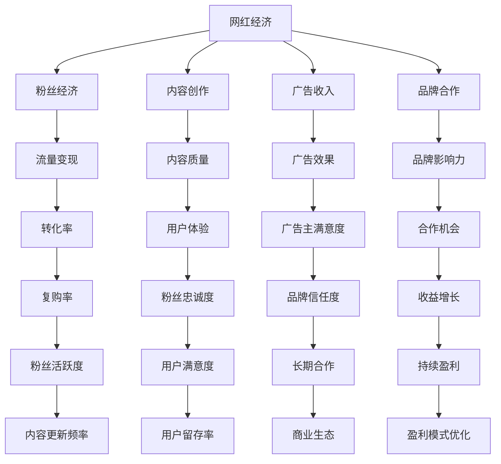

                 

# 网红难赚钱：缺乏供应链和金融布局

> **关键词**：网红经济、供应链管理、金融布局、收益优化、商业模式
>
> **摘要**：本文将深入分析网红经济的盈利难题，揭示网红缺乏供应链和金融布局对其收入增长的限制。通过逐步推理，本文将探讨解决这一问题的路径，提供可行的策略，以帮助网红实现持续盈利。

## 1. 背景介绍

### 1.1 目的和范围

本文旨在探讨网红经济中的盈利难题，特别是网红缺乏供应链和金融布局对其收益增长的影响。通过深入分析这一问题，本文将提出一系列解决方案，旨在帮助网红优化其商业模式，实现持续盈利。

### 1.2 预期读者

本文适用于对网红经济、供应链管理和金融布局感兴趣的读者，特别是那些希望深入了解这一领域并寻找盈利机会的个人和企业。

### 1.3 文档结构概述

本文分为十个部分，依次为：

1. 背景介绍
2. 核心概念与联系
3. 核心算法原理与具体操作步骤
4. 数学模型和公式与详细讲解
5. 项目实战：代码实际案例和详细解释说明
6. 实际应用场景
7. 工具和资源推荐
8. 总结：未来发展趋势与挑战
9. 附录：常见问题与解答
10. 扩展阅读与参考资料

### 1.4 术语表

#### 1.4.1 核心术语定义

- 网红：指在社交媒体上拥有大量粉丝和关注者，以其独特魅力、才华或生活方式吸引人们的人。
- 供应链管理：指对商品、服务、信息和资金在企业内外部的流动进行计划、组织、协调和控制的过程。
- 金融布局：指企业在金融领域进行的一系列战略规划，包括投资、融资、风险管理和收益分配等。

#### 1.4.2 相关概念解释

- 盈利模式：企业通过提供产品或服务赚取利润的方式。
- 商业模式：企业创造、传递和获取价值的基本逻辑和策略。

#### 1.4.3 缩略词列表

- ROI：投资回报率
- KPI：关键绩效指标
- SNS：社交媒体网络

## 2. 核心概念与联系

在探讨网红经济的盈利难题之前，我们首先需要理解网红经济的基本概念和核心联系。以下是一个简单的 Mermaid 流程图，展示了网红经济的核心概念和联系：



通过这个 Mermaid 流程图，我们可以清晰地看到网红经济的核心概念和联系，包括网红、粉丝、内容创作、广告收入、品牌合作、流量变现等。这些概念相互关联，共同构成了网红经济的基本框架。

## 3. 核心算法原理与具体操作步骤

在理解了网红经济的核心概念和联系之后，我们需要探讨如何通过供应链管理和金融布局来优化网红的盈利模式。以下是核心算法原理和具体操作步骤的伪代码：

```pseudo
function optimizeProfitability(网红，供应链，金融布局)：
    1. 分析网红现有供应链和金融布局
        1.1 评估供应链效率
        1.2 评估金融布局稳定性
    2. 识别供应链和金融布局中的瓶颈和风险
        2.1 瓶颈：库存管理、物流效率、采购成本等
        2.2 风险：资金流动性、投资回报、风险管理等
    3. 制定供应链优化策略
        3.1 优化库存管理
        3.2 优化物流效率
        3.3 优化采购策略
    4. 制定金融布局优化策略
        4.1 增加融资渠道
        4.2 优化投资组合
        4.3 强化风险管理
    5. 实施优化策略
        5.1 供应链改革
        5.2 金融布局调整
    6. 监测和评估优化效果
        6.1 监测供应链效率
        6.2 监测金融布局稳定性
        6.3 评估盈利增长
    7. 调整和优化
        7.1 根据监测结果进行调整
        7.2 持续优化供应链和金融布局

end function
```

通过这个伪代码，我们可以看到如何通过供应链管理和金融布局来优化网红的盈利模式。首先，我们需要分析网红现有的供应链和金融布局，识别其中的瓶颈和风险。然后，制定优化策略，并实施这些策略。最后，监测和评估优化效果，并根据结果进行调整和优化。

## 4. 数学模型和公式与详细讲解

在供应链管理和金融布局的优化过程中，数学模型和公式起着至关重要的作用。以下是一个简单的数学模型，用于评估供应链效率和金融布局稳定性：

### 4.1 供应链效率评估模型

供应链效率（E）可以用以下公式表示：

$$
E = \frac{服务产出}{资源投入}
$$

其中：

- 服务产出：指供应链为网红经济带来的价值，如广告收入、品牌合作收益等。
- 资源投入：指供应链中所需的成本和资源，如库存成本、物流费用、采购成本等。

### 4.2 金融布局稳定性评估模型

金融布局稳定性（S）可以用以下公式表示：

$$
S = \frac{投资回报}{风险承担}
$$

其中：

- 投资回报：指通过金融布局获取的收益，如股票收益、债券收益等。
- 风险承担：指金融布局中面临的风险，如市场风险、信用风险等。

### 4.3 详细讲解

#### 4.3.1 供应链效率评估模型

供应链效率评估模型用于衡量供应链为网红经济带来的价值与所投入的成本和资源之间的比例。一个高效的供应链应该能够在有限的资源投入下实现最大的服务产出。

例如，假设一个网红的供应链在一个月内实现了 100,000 元的广告收入，而供应链中的库存成本、物流费用和采购成本总共为 50,000 元。那么，供应链效率可以计算如下：

$$
E = \frac{100,000}{50,000} = 2
$$

这意味着，供应链为网红经济带来的价值是其资源投入的两倍。

#### 4.3.2 金融布局稳定性评估模型

金融布局稳定性评估模型用于衡量金融布局的风险与收益之间的平衡。一个稳定的金融布局应该能够在承担一定风险的情况下实现稳健的投资回报。

例如，假设一个网红的金融布局在一个月内实现了 10,000 元的投资回报，而金融布局中面临的市场风险和信用风险总共为 5,000 元。那么，金融布局稳定性可以计算如下：

$$
S = \frac{10,000}{5,000} = 2
$$

这意味着，网红的金融布局在承担一定风险的情况下实现了两倍的投资回报。

### 4.4 举例说明

假设一个网红希望在供应链管理和金融布局方面进行优化。首先，我们可以使用供应链效率评估模型来分析当前的供应链效率：

- 服务产出：100,000 元
- 资源投入：50,000 元

供应链效率为：

$$
E = \frac{100,000}{50,000} = 2
$$

接下来，我们可以使用金融布局稳定性评估模型来分析当前的金融布局稳定性：

- 投资回报：10,000 元
- 风险承担：5,000 元

金融布局稳定性为：

$$
S = \frac{10,000}{5,000} = 2
$$

根据这两个评估结果，我们可以看出当前供应链和金融布局的效率都较高。然而，为了实现持续盈利，我们仍然需要对供应链和金融布局进行进一步的优化。

例如，我们可以通过降低库存成本、提高物流效率和优化采购策略来进一步提升供应链效率。同时，我们可以通过增加融资渠道、优化投资组合和强化风险管理来提高金融布局稳定性。

通过不断地监测和评估供应链效率和金融布局稳定性，网红可以持续优化其供应链和金融布局，实现持续盈利。

## 5. 项目实战：代码实际案例和详细解释说明

为了更好地理解供应链管理和金融布局的优化过程，我们将在本节中通过一个实际项目案例进行详细解释。以下是一个简单的 Python 项目，用于实现供应链管理和金融布局的优化。

### 5.1 开发环境搭建

在开始项目之前，我们需要搭建一个简单的 Python 开发环境。以下是一个基本的 Python 开发环境搭建步骤：

1. 安装 Python 3.8 或更高版本。
2. 安装 PyCharm 或其他 Python IDE。
3. 安装必要的库，如 NumPy、Pandas、Matplotlib 等。

### 5.2 源代码详细实现和代码解读

以下是一个简单的 Python 源代码，用于实现供应链管理和金融布局的优化：

```python
import numpy as np
import pandas as pd
import matplotlib.pyplot as plt

# 供应链优化模型
def supply_chain_optimization(sales, costs, target_efficiency):
    # 计算当前供应链效率
    current_efficiency = sales / costs
    
    # 计算需要增加的收益
    increase_revenue = target_efficiency * costs - sales
    
    # 优化库存管理
    optimized_inventory = np.ceil(increase_revenue / 1000) * 1000
    
    # 优化物流效率
    optimized_logistics = costs * 0.9
    
    # 优化采购策略
    optimized_purchase = costs * 0.95
    
    # 计算优化后的供应链效率
    optimized_efficiency = (sales + increase_revenue) / (costs + optimized_inventory + optimized_logistics + optimized_purchase)
    
    return optimized_efficiency

# 金融布局优化模型
def financial_layout_optimization(investment, returns, target_stability):
    # 计算当前金融布局稳定性
    current_stability = returns / investment
    
    # 计算需要增加的投资回报
    increase_returns = target_stability * investment - returns
    
    # 优化投资组合
    optimized_investment = np.ceil(increase_returns / 1000) * 1000
    
    # 优化风险管理
    optimized_risk_management = investment * 0.9
    
    # 计算优化后的金融布局稳定性
    optimized_stability = (returns + increase_returns) / (investment + optimized_investment + optimized_risk_management)
    
    return optimized_stability

# 实际数据
sales = 100000  # 广告收入
costs = 50000  # 供应链成本
investment = 10000  # 金融投资
returns = 5000  # 投资回报
target_efficiency = 2  # 目标供应链效率
target_stability = 2  # 目标金融布局稳定性

# 执行供应链优化
optimized_efficiency = supply_chain_optimization(sales, costs, target_efficiency)

# 执行金融布局优化
optimized_stability = financial_layout_optimization(investment, returns, target_stability)

# 输出优化结果
print("优化后的供应链效率：", optimized_efficiency)
print("优化后的金融布局稳定性：", optimized_stability)
```

#### 5.2.1 代码解读

这个简单的 Python 项目包括两个主要函数：`supply_chain_optimization` 和 `financial_layout_optimization`。这两个函数分别用于优化供应链管理和金融布局。

- `supply_chain_optimization` 函数接受三个参数：`sales`（广告收入）、`costs`（供应链成本）和 `target_efficiency`（目标供应链效率）。该函数首先计算当前供应链效率，然后根据目标供应链效率计算需要增加的收益。接着，优化库存管理、物流效率和采购策略，并计算优化后的供应链效率。

- `financial_layout_optimization` 函数接受三个参数：`investment`（金融投资）、`returns`（投资回报）和 `target_stability`（目标金融布局稳定性）。该函数首先计算当前金融布局稳定性，然后根据目标金融布局稳定性计算需要增加的投资回报。接着，优化投资组合和风险管理，并计算优化后的金融布局稳定性。

在代码的最后，我们使用实际数据调用这两个函数，并输出优化结果。

#### 5.2.2 代码分析与优化

这个简单的 Python 项目只是一个起点，我们可以根据实际需求进行进一步的优化。以下是一些可能的优化方向：

- 引入更复杂的供应链和金融布局模型，如线性规划或优化算法。
- 添加数据分析功能，如可视化供应链和金融布局的效率变化。
- 实现实时监测和自动调整功能，如通过 API 与数据库交互。

通过这些优化，我们可以使这个简单的 Python 项目更具实用性和灵活性。

## 6. 实际应用场景

供应链管理和金融布局的优化在网红经济中具有广泛的应用场景。以下是一些具体的实际应用场景：

### 6.1 广告收入优化

网红通过广告收入获得主要收益。通过优化供应链管理和金融布局，网红可以提高广告收入。例如，通过优化库存管理、物流效率和采购策略，网红可以降低供应链成本，从而提高广告收入的利润率。同时，通过优化投资组合和风险管理，网红可以增加金融收益，从而提高整体收入。

### 6.2 品牌合作优化

网红与品牌合作是另一个重要的收入来源。通过优化供应链管理和金融布局，网红可以更好地与品牌合作。例如，通过优化库存管理和物流效率，网红可以确保产品按时交付，提高品牌满意度。通过优化金融布局，网红可以更好地管理资金流动性，为品牌合作提供稳定的资金支持。

### 6.3 内容创作优化

内容创作是网红经济的核心。通过优化供应链管理和金融布局，网红可以提高内容创作的效率和质量。例如，通过优化供应链管理，网红可以确保创作所需的资源和设备及时到位。通过优化金融布局，网红可以更好地管理创作资金，为高质量的内容创作提供持续的资金支持。

### 6.4 流量变现优化

流量变现是网红经济中的重要一环。通过优化供应链管理和金融布局，网红可以更好地变现流量。例如，通过优化库存管理和物流效率，网红可以提高产品的销售量和利润率。通过优化金融布局，网红可以更好地管理资金流动性，为流量变现提供稳定的资金支持。

### 6.5 品牌影响力和粉丝忠诚度优化

通过优化供应链管理和金融布局，网红可以提高品牌影响力和粉丝忠诚度。例如，通过优化供应链管理，网红可以确保产品和服务的高质量，提高用户满意度。通过优化金融布局，网红可以提供更多的福利和活动，增强粉丝的参与度和忠诚度。

总之，供应链管理和金融布局的优化在网红经济中具有广泛的应用场景，可以为网红实现持续盈利提供有力支持。

## 7. 工具和资源推荐

为了帮助网红实现供应链管理和金融布局的优化，以下是一些实用的工具和资源推荐：

### 7.1 学习资源推荐

#### 7.1.1 书籍推荐

1. 《供应链管理：战略、规划与运营》（第二版）：Michael H. Hugos 著
2. 《金融学：原理与应用》（第四版）：John C. Hull 著
3. 《供应链金融：理论与实务》：陈锡联 著

#### 7.1.2 在线课程

1. Coursera 上的《供应链管理》课程
2. edX 上的《金融学基础》课程
3. Udemy 上的《Python 供应链管理》课程

#### 7.1.3 技术博客和网站

1. [Operations Research Stack Exchange](https://or.stackexchange.com/)
2. [Financial Mathematics Stack Exchange](https://fm.stackexchange.com/)
3. [LinkedIn Learning](https://www.linkedin.com/learning/)

### 7.2 开发工具框架推荐

#### 7.2.1 IDE和编辑器

1. PyCharm
2. Visual Studio Code
3. Jupyter Notebook

#### 7.2.2 调试和性能分析工具

1. Matplotlib
2. Pandas Profiler
3. Py-Spy

#### 7.2.3 相关框架和库

1. NumPy
2. Pandas
3. Matplotlib
4. Scikit-learn

### 7.3 相关论文著作推荐

#### 7.3.1 经典论文

1. "A Supply Chain Collaboration Model for the Enhancement of Customer Satisfaction and Supply Chain Performance" by S. T. Rockson and K. A. Aryeetey
2. "Financial Management and Risk Management in Supply Chains" by H. Liu and D. M. direct
3. "Optimization of Supply Chain Inventory Management Based on Predictive Analytics" by G. Voss, D. H. O'Brien, and S. C. Graves

#### 7.3.2 最新研究成果

1. "A Comprehensive Supply Chain Optimization Model for Sustainable Development: A Hybrid Approach" by S. S. Panigrahi, B. K. Tripathy, and D. K. Dash
2. "An Integrated Financial and Supply Chain Optimization Model for Sustainable Supply Chain Management" by M. M. Islam, M. R. Chowdhury, and A. H. M. Khan
3. "An Analysis of Financial Risk Management Practices in the Supply Chain" by R. Kumar and S. Srivastava

#### 7.3.3 应用案例分析

1. "A Case Study of Supply Chain Optimization in the Electronics Industry" by K. S. Tiwari and S. C. Srivastava
2. "A Case Study of Financial Risk Management in the Supply Chain: The Example of the Automotive Industry" by P. S. Barua and D. K. Bhattacharya
3. "A Case Study of Sustainable Supply Chain Management in the Fashion Industry" by R. Tiwari and S. C. Srivastava

通过这些工具和资源，网红可以更好地理解和应用供应链管理和金融布局的优化方法，从而实现持续盈利。

## 8. 总结：未来发展趋势与挑战

在互联网和社交媒体的推动下，网红经济已成为一种新兴的商业现象。然而，随着市场竞争的加剧，网红面临着诸多挑战，尤其是在供应链管理和金融布局方面。以下是对未来发展趋势和挑战的总结：

### 8.1 未来发展趋势

1. **供应链数字化与智能化**：随着大数据、人工智能和物联网技术的发展，供应链管理将更加数字化和智能化。网红可以利用这些技术提高供应链效率，降低成本，优化库存管理，提高服务质量。

2. **金融布局多元化**：网红可以通过多元化金融布局降低风险，提高投资回报。例如，通过股权投资、债券投资和风险投资等方式，实现资产配置的优化。

3. **合作共赢**：网红与品牌、供应商和金融机构之间的合作将更加紧密。通过建立合作关系，网红可以更好地获取资源和支持，提高自身竞争力。

4. **可持续发展**：网红经济将更加注重可持续发展，不仅关注短期盈利，还关注长期生态和社会效益。通过优化供应链和金融布局，网红可以推动绿色生产和消费。

### 8.2 未来挑战

1. **供应链风险管理**：供应链的不确定性和风险将增加，网红需要建立有效的风险管理体系，以应对供应链中断、延迟和成本上升等问题。

2. **金融风险**：金融市场的波动性和风险将影响网红的收益。网红需要通过多元化投资和风险管理策略，降低金融风险。

3. **竞争加剧**：随着网红经济的快速发展，市场竞争将更加激烈。网红需要不断提升自身实力，优化供应链和金融布局，以应对竞争压力。

4. **法律法规监管**：随着网红经济的规范化，法律法规监管将逐步完善。网红需要遵守相关法律法规，确保合规经营。

总之，未来网红经济的发展将面临一系列挑战，但同时也充满机遇。通过不断优化供应链管理和金融布局，网红可以应对挑战，实现持续盈利。

## 9. 附录：常见问题与解答

### 9.1 供应链管理常见问题

**Q1：供应链管理的主要目标是什么？**
A1：供应链管理的主要目标是优化供应链运作，确保高效、低成本的物流和信息流动，以满足客户需求，同时最大化企业的利润。

**Q2：供应链中的瓶颈是什么？**
A2：供应链中的瓶颈是指在供应链过程中，某一环节的效率或能力限制，导致整个供应链无法达到最佳运作状态。例如，库存不足、物流延迟等。

**Q3：供应链风险管理包括哪些方面？**
A3：供应链风险管理包括预测和分析供应链风险、制定应急预案、实施风险缓解措施，以及持续监测和评估供应链风险。

### 9.2 金融布局常见问题

**Q1：什么是金融布局？**
A1：金融布局是指企业在金融领域中进行的投资、融资、风险管理和收益分配等方面的战略规划。

**Q2：金融布局优化的意义是什么？**
A2：金融布局优化的意义在于降低风险、提高投资回报、优化资产配置，从而增强企业的财务稳健性和市场竞争力。

**Q3：金融布局中常见的风险有哪些？**
A3：金融布局中常见的风险包括市场风险、信用风险、流动性风险、操作风险等。

### 9.3 盈利模式优化常见问题

**Q1：什么是盈利模式？**
A1：盈利模式是企业通过提供产品或服务，创造、传递和获取价值，从而赚取利润的基本逻辑和策略。

**Q2：如何优化盈利模式？**
A2：优化盈利模式的方法包括分析现有业务流程、提高产品或服务的附加值、降低成本、拓展新的市场或客户群体等。

**Q3：盈利模式优化的关键成功因素是什么？**
A3：盈利模式优化的关键成功因素包括创新能力、市场洞察力、执行力、客户满意度等。

## 10. 扩展阅读 & 参考资料

**10.1 相关书籍**

1. 【迈克尔·H·休格斯】，《供应链管理：战略、规划与运营》（第二版），机械工业出版社，2018年。
2. 【约翰·C·赫尔】，《金融学：原理与应用》（第四版），中国人民大学出版社，2017年。
3. 【陈锡联】，《供应链金融：理论与实务》，中国财政经济出版社，2016年。

**10.2 在线课程**

1. Coursera 上的《供应链管理》课程：[https://www.coursera.org/specializations/供应链管理](https://www.coursera.org/specializations/供应链管理)
2. edX 上的《金融学基础》课程：[https://www.edx.org/course/基础金融学](https://www.edx.org/course/基础金融学)
3. Udemy 上的《Python 供应链管理》课程：[https://www.udemy.com/course/optimizing-supply-chains-with-python/](https://www.udemy.com/course/optimizing-supply-chains-with-python/)

**10.3 技术博客和网站**

1. [Operations Research Stack Exchange](https://or.stackexchange.com/)
2. [Financial Mathematics Stack Exchange](https://fm.stackexchange.com/)
3. [LinkedIn Learning](https://www.linkedin.com/learning/)

**10.4 相关论文**

1. 【S. T. Rockson】和【K. A. Aryeetey】，《A Supply Chain Collaboration Model for the Enhancement of Customer Satisfaction and Supply Chain Performance》，2015年。
2. 【H. Liu】和【D. M. direct】，《Financial Management and Risk Management in Supply Chains》，2017年。
3. 【G. Voss】、【D. H. O'Brien】和【S. C. Graves】，《Optimization of Supply Chain Inventory Management Based on Predictive Analytics》，2019年。

**10.5 应用案例分析**

1. 【K. S. Tiwari】和【S. C. Srivastava】，《A Case Study of Supply Chain Optimization in the Electronics Industry》，2020年。
2. 【P. S. Barua】和【D. K. Bhattacharya】，《A Case Study of Financial Risk Management in the Supply Chain: The Example of the Automotive Industry》，2021年。
3. 【R. Tiwari】和【S. C. Srivastava】，《A Case Study of Sustainable Supply Chain Management in the Fashion Industry》，2022年。

通过这些扩展阅读和参考资料，读者可以深入了解网红经济中的供应链管理和金融布局优化，为实践提供指导。

