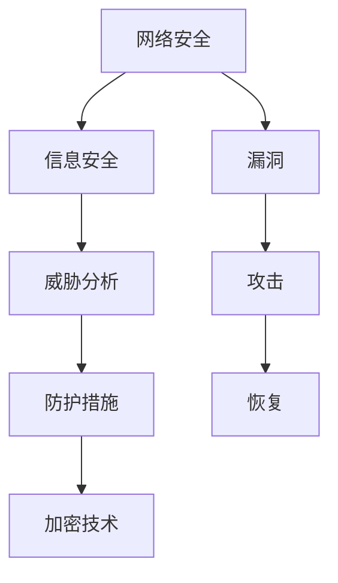

                 


# 网络安全、信息安全措施方案

> **关键词：网络安全、信息安全、防护措施、加密技术、威胁分析**
>
> **摘要：本文将深入探讨网络安全和信息安全的核心理念，分析当前主要的安全威胁，并详细介绍一系列实用措施和解决方案，旨在为IT专业人士提供全面的网络安全指南。**

## 1. 背景介绍

### 1.1 目的和范围

本文旨在为读者提供关于网络安全和信息安全的全面理解，以及实用的防护措施和解决方案。随着互联网的普及和数字化转型的加速，网络攻击和信息泄露事件频发，网络安全已成为企业和个人关注的焦点。本文将覆盖以下几个方面：

1. 网络安全的核心概念和重要性。
2. 当前主要的网络威胁类型及其特点。
3. 信息安全措施的具体实施方法和策略。
4. 加密技术的原理和应用。
5. 实际案例和实战经验分享。
6. 工具和资源的推荐。

### 1.2 预期读者

本文面向以下读者群体：

1. IT安全专业人士，包括网络安全工程师、系统管理员等。
2. 企业IT部门管理人员，负责信息安全策略的制定和执行。
3. 个人用户，关注自身数字资产安全。
4. 计算机科学和网络安全领域的学生和研究者。

### 1.3 文档结构概述

本文结构如下：

1. **背景介绍**：概述网络安全和信息安全的核心理念，明确目的和读者群体。
2. **核心概念与联系**：介绍网络安全的关键概念和联系，包括威胁分析、防护措施等。
3. **核心算法原理 & 具体操作步骤**：详细讲解加密技术原理和具体操作步骤。
4. **数学模型和公式 & 详细讲解 & 举例说明**：深入探讨数学模型和公式在网络安全中的应用。
5. **项目实战：代码实际案例和详细解释说明**：通过实际案例展示代码实现和解读。
6. **实际应用场景**：分析网络安全在现实世界中的应用和挑战。
7. **工具和资源推荐**：推荐学习资源、开发工具和框架。
8. **总结：未来发展趋势与挑战**：总结当前趋势和未来挑战。
9. **附录：常见问题与解答**：提供常见问题的解答。
10. **扩展阅读 & 参考资料**：推荐相关文献和研究。

### 1.4 术语表

#### 1.4.1 核心术语定义

- 网络安全（Cybersecurity）：确保网络系统、数据和设备不受未经授权的访问、使用、披露、破坏、修改或破坏。
- 信息安全（Information Security）：保护信息的保密性、完整性和可用性。
- 威胁分析（Threat Analysis）：识别和分析潜在的威胁和攻击向量。
- 防护措施（Mitigation Measures）：采取的措施来减轻或消除安全威胁的影响。
- 加密技术（Cryptography）：使用数学方法来保护数据的保密性和完整性。

#### 1.4.2 相关概念解释

- 漏洞（Vulnerability）：系统或应用程序中存在的可能被攻击者利用的弱点。
- 攻击（Attack）：利用漏洞对系统或网络进行的非法访问或破坏。
- 恢复（Recovery）：在遭受攻击或故障后，恢复系统和数据到正常状态。
- 敏感数据（Sensitive Data）：易受攻击的数据，如个人身份信息、财务信息等。

#### 1.4.3 缩略词列表

- IT：信息技术（Information Technology）
- AI：人工智能（Artificial Intelligence）
- IoT：物联网（Internet of Things）
- DDoS：分布式拒绝服务攻击（Distributed Denial of Service）
- VPN：虚拟专用网络（Virtual Private Network）
- SSL/TLS：安全套接层/传输层安全协议（Secure Sockets Layer/Transport Layer Security）

## 2. 核心概念与联系

在网络安全领域，理解核心概念和它们之间的联系至关重要。以下是一个简化的 Mermaid 流程图，展示了一些关键概念及其相互关系。



### 2.1 网络安全与信息安全

网络安全（Cybersecurity）和信息安全（Information Security）密切相关，两者通常可以互换使用。网络安全主要关注保护网络环境，而信息安全更广泛地涵盖了保护信息资产的所有方面，包括存储、传输和处理。

### 2.2 威胁分析

威胁分析是网络安全的关键环节。通过识别和评估潜在的威胁，组织可以提前采取预防措施。威胁分析通常涉及以下步骤：

1. **威胁识别**：识别潜在的攻击者、恶意软件和其他威胁。
2. **风险评估**：评估威胁的可能性和影响。
3. **威胁建模**：创建模型来模拟和预测威胁的行为。

### 2.3 防护措施

防护措施是应对网络安全威胁的手段。常见的防护措施包括：

1. **防火墙**：监控网络流量，防止未经授权的访问。
2. **入侵检测系统（IDS）**：检测和响应潜在的网络攻击。
3. **加密技术**：保护数据的保密性和完整性。
4. **安全策略和培训**：制定和执行安全政策和培训员工。

### 2.4 加密技术

加密技术是信息安全的核心。它通过数学算法将明文转换为密文，以保护数据的安全。加密技术可以用于：

1. **数据加密**：保护存储和传输的数据。
2. **身份验证**：验证用户和系统的合法性。
3. **数字签名**：确保数据的完整性和真实性。

## 3. 核心算法原理 & 具体操作步骤

### 3.1 数据加密算法原理

数据加密算法（Data Encryption Algorithm，DEA）是一种常见的加密技术。以下是其基本原理和操作步骤：

#### 基本原理

数据加密算法基于对称密钥加密，使用相同的密钥进行加密和解密。它将明文数据分成固定大小的块，然后使用特定的加密算法将这些块转换为密文。

#### 操作步骤

1. **密钥生成**：选择一个强密钥。
2. **分块**：将明文数据分成固定大小的块。
3. **加密**：使用加密算法将每个明文块转换为密文块。
4. **密文组装**：将加密后的块组合成密文。
5. **解密**：使用相同的密钥和解密算法将密文转换为明文。

### 3.2 加密算法伪代码

以下是一个简化版的数据加密算法伪代码：

```plaintext
Algorithm DataEncryption(key, plaintext):
    Initialize ciphertext as an empty array
    For each block in plaintext:
        encrypted_block = EncryptBlock(block, key)
        Add encrypted_block to ciphertext
    Return ciphertext
```

### 3.3 加密算法示例

假设我们使用DES加密算法（Data Encryption Standard）来加密一个简单的字符串“Hello World！”。

```latex
\text{密钥}: K = 3d7d8e90f9876543
\text{明文}: P = "Hello World!"
```

首先，将明文分成64位块（如果必要，填充空格以使其长度为64位）：

```latex
P = "Hello World!" + " " \times 48
```

然后，使用DES算法对每个块进行加密：

```latex
C = DataEncryption(K, P)
```

加密后的结果将是密文，我们可以使用相同的密钥和解密算法进行解密，以恢复原始明文。

## 4. 数学模型和公式 & 详细讲解 & 举例说明

### 4.1 加密与解密公式

加密和解密是网络安全的核心。以下是一些基本的加密和解密公式，它们基于数学运算和加密算法。

#### 加密公式：

$$
C = E(K, P)
$$

其中，\(C\) 是密文，\(K\) 是密钥，\(P\) 是明文，\(E\) 是加密函数。

#### 解密公式：

$$
P = D(K, C)
$$

其中，\(P\) 是明文，\(C\) 是密文，\(K\) 是密钥，\(D\) 是解密函数。

### 4.2 DES 加密算法

DES（Data Encryption Standard）是一种广泛使用的对称加密算法。它基于一个56位的密钥，使用16个48位的轮密钥，每个轮密钥由初始密钥生成。

#### 轮加密步骤：

1. **初始置换（IP）**：将明文输入进行初始置换。
2. **16轮加密**：每轮包括扩展置换、异或操作和替换表查找。
3. **最终置换（FP）**：将加密后的数据输出进行最终置换。

#### 伪代码：

```plaintext
Algorithm DES Encryption(key, plaintext):
    Initialize initial permutation(IP) and final permutation(FP)
    Generate round keys from the initial key
    Apply initial permutation to the plaintext
    For i = 1 to 16:
        Expand the previous output to 48 bits
        XOR with the round key
        Lookup substitution using S-boxes
    Apply final permutation to the ciphertext
    Return ciphertext
```

### 4.3 示例

使用DES加密算法，对明文“HELLO WORLD!”进行加密。

#### 步骤：

1. **初始化**：选择56位密钥（例如：`3d7d8e90f9876543`）。
2. **初始置换**：对明文进行初始置换。
3. **生成轮密钥**：根据初始密钥生成16个轮密钥。
4. **加密轮**：对每个64位块进行16轮加密。
5. **最终置换**：对加密后的数据应用最终置换。

#### 结果：

加密后的密文可能是：`6bc1bee3482e5d04`。

使用相同的密钥和解密算法，我们可以将密文解密回原始明文。

## 5. 项目实战：代码实际案例和详细解释说明

### 5.1 开发环境搭建

为了演示加密技术的实际应用，我们将使用Python编写一个简单的加密和解密程序。以下是开发环境的搭建步骤：

1. **安装Python**：确保安装了Python 3.x版本。
2. **安装PyCryptodome库**：在终端中运行以下命令安装`pycryptodome`库。

   ```bash
   pip install pycryptodome
   ```

### 5.2 源代码详细实现和代码解读

以下是一个使用PyCryptodome库实现的DES加密和解密程序。

```python
from Crypto.Cipher import DES
from Crypto.Util.Padding import pad, unpad
from base64 import b64encode, b64decode

# 密钥
key = b'3d7d8e90f9876543'
# 明文
plaintext = b'Hello World!'

# 加密
cipher = DES.new(key, DES.MODE_EAX)
ciphertext, tag = cipher.encrypt_and_digest(plaintext)
encoded_cipher = b64encode(ciphertext).decode('utf-8')
encoded_tag = b64encode(tag).decode('utf-8')
print(f"Encoded ciphertext: {encoded_cipher}")
print(f"Encoded tag: {encoded_tag}")

# 解密
cipher = DES.new(key, DES.MODE_EAX, nonce=cipher.nonce)
try:
    decoded_cipher = b64decode(encoded_cipher)
    decoded_tag = b64decode(encoded_tag)
    decrypted_plaintext = cipher.decrypt_and_verify(decoded_cipher, decoded_tag)
    print(f"Decrypted plaintext: {decrypted_plaintext.decode('utf-8')}")
except ValueError:
    print("Decryption failed: Invalid tag")
```

#### 代码解读：

1. **导入库**：引入`Crypto.Cipher`模块和`Crypto.Util.Padding`模块。
2. **初始化密钥和明文**：定义密钥和明文。
3. **加密**：创建DES加密对象，使用`encrypt_and_digest`方法加密明文，并将结果编码为Base64字符串。
4. **解密**：创建DES解密对象，使用`decrypt_and_verify`方法解密密文，并验证标签。
5. **打印结果**：打印加密后的密文和解密后的明文。

### 5.3 代码解读与分析

该程序展示了DES加密和解密的基本流程。在实际应用中，加密和解密操作通常涉及更复杂的步骤，包括密钥管理、数据分段和错误处理等。以下是对代码的详细分析：

1. **加密过程**：
   - 使用`DES.new`创建加密对象，传递密钥和模式（`MODE_EAX`）。
   - 调用`encrypt_and_digest`方法，该函数会将明文加密并生成消息认证码（MAC）。
   - 结果是加密后的数据和MAC，这两个值都是二进制格式。

2. **解密过程**：
   - 使用相同的密钥和模式创建解密对象，传递加密时的随机数（`nonce`）。
   - 调用`decrypt_and_verify`方法，该函数会解密数据并验证MAC。
   - 如果MAC有效，解密后的数据将是原始明文。

3. **错误处理**：
   - 在解密时，如果MAC验证失败，程序将抛出`ValueError`异常，提示解密失败。

通过这个简单的示例，我们可以看到DES加密算法的基本操作和Python实现。实际应用中，加密和解密算法的选择和实现会根据具体需求和安全性要求进行调整。

## 6. 实际应用场景

### 6.1 数据库安全

数据库是存储敏感数据的中心，因此确保数据库的安全至关重要。以下是一些关键应用场景：

- **加密存储**：对数据库中的敏感数据进行加密存储，以防止未授权访问。
- **访问控制**：实施严格的访问控制策略，限制对数据库的访问权限。
- **备份与恢复**：定期备份数据库，并确保备份的安全存储和快速恢复。

### 6.2 云计算安全

随着云计算的普及，数据的安全性和隐私性成为关键挑战。以下是一些实际应用场景：

- **数据加密**：在数据上传到云平台之前进行加密，确保数据在传输和存储过程中的安全。
- **虚拟专用网络（VPN）**：使用VPN建立安全的加密通道，保护数据传输。
- **身份验证与授权**：实施强大的身份验证和授权机制，确保只有授权用户才能访问云资源。

### 6.3 网络安全

网络安全涉及到保护整个网络环境，包括网络设备、服务器和客户端。以下是一些关键应用场景：

- **防火墙和入侵检测系统（IDS）**：部署防火墙和IDS，监控和防止恶意流量。
- **加密传输**：使用SSL/TLS协议加密网络通信，防止中间人攻击。
- **安全策略**：制定和执行网络安全策略，包括访问控制、安全审计和事件响应。

### 6.4 个人隐私保护

随着数字化生活的普及，个人隐私保护变得越来越重要。以下是一些实际应用场景：

- **数据加密**：加密个人数据，防止泄露。
- **隐私设置**：在社交媒体和应用中设置隐私保护，限制数据共享。
- **安全浏览**：使用安全浏览器和VPN，保护上网隐私。

## 7. 工具和资源推荐

### 7.1 学习资源推荐

#### 7.1.1 书籍推荐

- 《计算机安全与密码学基础》
- 《网络安全：设计与实现》
- 《深入理解DES和RSA加密技术》

#### 7.1.2 在线课程

- Coursera上的《网络安全基础》
- edX上的《加密学入门》
- Udacity上的《网络安全与防御》

#### 7.1.3 技术博客和网站

- Security StackExchange
- FreeBuf
- Dark Reading

### 7.2 开发工具框架推荐

#### 7.2.1 IDE和编辑器

- Visual Studio Code
- IntelliJ IDEA
- PyCharm

#### 7.2.2 调试和性能分析工具

- Wireshark
- GDB
- Valgrind

#### 7.2.3 相关框架和库

- PyCryptodome
- OpenSSL
- Bouncy Castle

### 7.3 相关论文著作推荐

#### 7.3.1 经典论文

- "A Brief History of Cryptography"
- "The Data Encryption Standard (DES)"
- "The RSA Encryption Algorithm"

#### 7.3.2 最新研究成果

- "Post-Quantum Cryptography"
- "Fully Homomorphic Encryption: A New Paradigm for Cryptographic Schemes"
- "Revisiting the McEliece Cryptosystem for Quantum Computing"

#### 7.3.3 应用案例分析

- "Security Breaches in the Financial Industry"
- "Protecting IoT Devices from Cyber Attacks"
- "Case Studies in Data Breach Response"

## 8. 总结：未来发展趋势与挑战

### 8.1 发展趋势

1. **云计算与边缘计算**：随着云计算和边缘计算的普及，网络安全将面临新的挑战，同时也将带来新的机遇。
2. **物联网（IoT）安全**：随着物联网设备的增加，确保这些设备的安全性和隐私性将成为重要议题。
3. **人工智能（AI）在安全领域的应用**：利用AI进行威胁检测、响应和预测，提高网络安全防护水平。
4. **零信任安全模型**：零信任安全模型强调“永不信任，总是验证”，将逐步取代传统的基于边界的网络安全模型。

### 8.2 挑战

1. **复杂性和规模**：随着网络和系统的规模扩大，确保网络安全将变得更加复杂。
2. **人才短缺**：网络安全领域的人才短缺将继续是一个挑战，特别是在处理高级威胁和新兴技术方面。
3. **攻击技术进步**：攻击者将继续开发新的攻击技术，安全防护措施需要不断更新和改进。
4. **法规遵从**：随着数据保护和隐私法规的日益严格，企业需要确保其安全措施符合相关法规要求。

## 9. 附录：常见问题与解答

### 9.1 加密技术相关问题

**Q1：什么是加密算法？**
A1：加密算法是一种用于保护数据安全的数学算法，它通过将明文转换为难以理解的密文来保护数据。

**Q2：什么是对称加密和非对称加密？**
A2：对称加密使用相同的密钥进行加密和解密，而非对称加密使用一对密钥（公钥和私钥）进行加密和解密。

**Q3：什么是数字签名？**
A3：数字签名是一种使用公钥加密算法验证数据完整性和真实性的技术，确保数据在传输过程中未被篡改。

### 9.2 网络安全相关问题

**Q1：什么是DDoS攻击？**
A1：DDoS（分布式拒绝服务）攻击是一种通过向目标系统发送大量请求来使其过载和崩溃的网络攻击。

**Q2：什么是安全审计？**
A2：安全审计是一种评估系统和网络安全措施的有效性的过程，旨在识别潜在的安全漏洞和改进措施。

**Q3：什么是VPN？**
A3：VPN（虚拟专用网络）是一种通过加密技术建立的专用网络，用于保护数据在公共网络中的传输。

## 10. 扩展阅读 & 参考资料

- **书籍**：
  - 《网络安全：设计原理与应用》
  - 《密码学：理论与实践》
  - 《零信任安全：构建下一代安全防御体系》

- **在线资源**：
  - OWASP（开放网络应用安全项目）
  - US-CERT（美国网络安全与基础设施安全局）

- **论文与研究报告**：
  - "The Future of Cybersecurity"
  - "Quantum Computing and Cryptography"
  - "IoT Security: Challenges and Solutions"

### 作者

**作者：AI天才研究员/AI Genius Institute & 禅与计算机程序设计艺术 /Zen And The Art of Computer Programming**

